# UE_HTML

## 一.基础知识

### 1.什么是HTML？

- 超文本标记语言：Hyper Text Markup Language，简称HTML，是一种用于创建网页的标准标记语言。
- 可以使用HTML来建立自己的WEB站点，HTML运营在浏览器上，通过浏览器来解析。
- HTML不是一种编程语言，而是一中标记语言
- 标记语言是一套标记标签
- HTML文档也称作web页面

#### 1.1.HTML历史

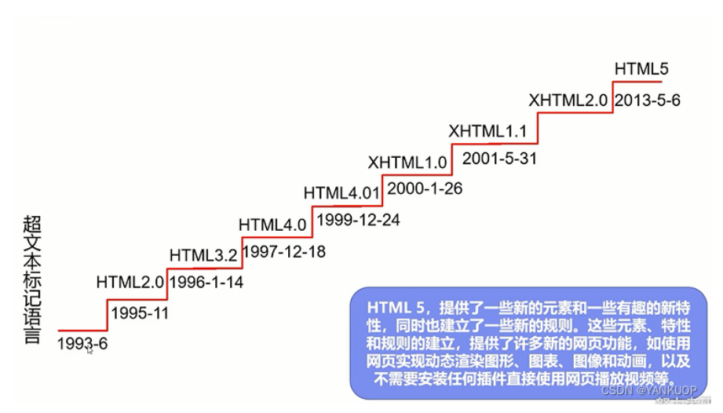

#### 1.2.HTML5的优势

- 当前世界知名浏览器厂商对HTML5的支持
  - Edge
  - Chrome
  - Firefox
- 市场的需求
- 跨平台

#### 1.3.W3C

##### 1.3.1.W3C组织

- World Wide Web Consortium万维网联盟
- 成立于1994年，Web技术领域中最具权威和影响力的国际中立性技术标准机构
- 网址：
  - http://www.w3.org
  - http://www.chinaw3c.org

##### 1.3.2.W3C标准

###### 1.3.1.结构化语言：HTML/XML

###### 1.3.2.表现化标准语言：CSS

###### 1.3.3.行为标准：DOM/ECMAScript

### 2.HTML文件

后缀名.htm/.html

### 3.HTML简介

```html
<!DOCTYPE html>
<html>
<head>
<meta charset="utf-8">
<title>菜鸟教程</title>
</head>
<body>
 
<h1>我的第一个标题</h1>
 
<p>我的第一个段落。</p>
 
</body>
</html>
```

#### 3.1.结构解析

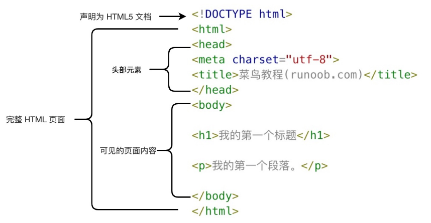

- **<!DOCTYPE html>** 声明为 HTML5 文档，告诉浏览器我们使用什么规范
- **<html>** 元素是 HTML 页面的根元素
- **<head>** 元素包含了文档的元（meta）数据，如 **<meta charset="utf-8">** 定义网页编码格式为 **utf-8**。
- **<title>** 元素描述了文档的标题
- **<body>** 元素包含了可见的页面内容
- **<h1>** 元素定义一个大标题
- **<p>** 元素定义一个段落

#### 3.2.HTML版本

| 版本      | 发布时间 |
| :-------- | :------- |
| HTML      | 1991     |
| HTML+     | 1993     |
| HTML 2.0  | 1995     |
| HTML 3.2  | 1997     |
| HTML 4.01 | 1999     |
| XHTML 1.0 | 2000     |
| HTML5     | 2012     |
| XHTML5    | 2013     |

### 4.HTML编辑器

#### 4.1.VSCode

#### 4.2.WebStorm

#### 4.3.IDEA

#### 4.4.记事本···

### 5.HTML基础

#### 5.1.HTML元素

##### 5.1.1.元素语法

1. Html元素以开始标签起始，以结束标签终止
2. 元素内容是开始标签与结束标签之间的内容
3. 大多数HTML元素拥有属性
4. html标签对大小不敏感

##### 5.1.2.元素属性

- html元素可以设置属性
- 属性可以在元素中添加附件信息
- 属性一般描述于开始标签
- 属性总是以名称/值对的形式出现
- 属性和属性值对大小写不敏感

属性参考手册：

链接：[HTML 全局属性 | 菜鸟教程 (runoob.com)](https://www.runoob.com/tags/ref-standardattributes.html)

适用于大多数Html元素的属性：

| 属性  | 描述                                                         |
| :---- | :----------------------------------------------------------- |
| class | 为html元素定义一个或多个类名（classname）(类名从样式文件引入) |
| id    | 定义元素的唯一id                                             |
| style | 规定元素的行内样式（inline style）                           |
| title | 描述了元素的额外信息 (作为工具条使用)                        |

##### 5.1.3.元素

Html标签手册：[HTML 标签列表(字母排序) | 菜鸟教程 (runoob.com)](https://www.runoob.com/tags/html-reference.html)

#### 5.2.HTML标签

##### 5.2.1.标题

```html
<h1>一级标题</h1>
<h2>二级标题</h2>
<h3>三级标题</h3>
<h4>四级标题</h4>
<h5>五级标题</h5>
<h6>六级标题</h6>
```

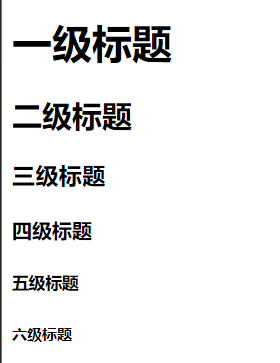

##### 5.2.2.段落

段落：paragraph

```html
<p>段落标签</p>
```

##### 5.2.3.分割线

```html
<hr/>
```

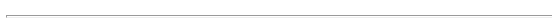

##### 5.2.4.换行

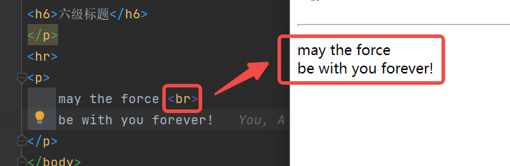

##### 5.2.5.版权

```html
<copy>&copy;归我所有</copy>
```

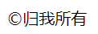

##### 5.2.6.链接

```html
<a href="http://www.baidu.com">点击我，跳转百度</a>
```

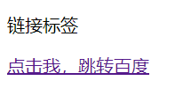

###### 5.2.6.1.传统超链接

###### 5.2.6.2.锚链接

```html
<p>
    <a href="top">到顶了</a>
</p>
```

```html
<p>锚链接</p>
<a href="#top">去到顶端</a>
```

###### 5.2.6.3.图片链接

```html
<p>图片链接</p>
<a href="https://www.baidu.com">
    
</a>
```

##### 5.2.7.图片

src：图片的路径，可以使用相对路径或者绝对路径

alt：图片丢失之后显示的提示

```html
<p>图片标签</p>

<br>

```

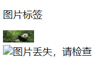

##### 5.2.8.视频

autoplay：自动播放

```html
<video src="../resources/videos/9ee2cd9b57a2c84aa213f8c1c3062889.mp4" autoplay height="10" width="20"></video>
```

##### 5.2.9.音频

autoplay：自动播放

contols：显示控制台

```html
<audio src="../resources/audios/9ee2cd9b57a2c84aa213f8c1c3062889.mp3" autoplay contols></audio>
```

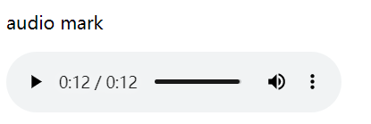

##### 5.2.10.区块

```html
<div style="background-color: yellow">
    <p>
        <这是一个区块></这是一个区块>
    </p>
</div>
```

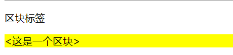

##### 5.2.11.样式

（详解在CSS）

###### 5.2.11.1.样式标签

- 粗体

  ```html
  <p><strong>这是粗体</strong></p>
  ```

- 斜体

  ```html
  <p><em>这是斜体</em></p>
  ```

###### 5.2.11.2.Style标签

```html
<!DOCTYPE html>
<html lang="en">
<head>
    <meta charset="UTF-8">
    <title>标签集合</title>
    <style>
        #secondDiv {
            background-color: red;
        }
    </style>
</head>
<body>
```

##### 5.2.12.脚本

后续详见js笔记

```html
<script>
    document.write("Hello World!")
</script>
```

##### 5.2.13.内联框架

```html
<div>
    <iframe name="hello" frameborder="0" height="400" width="1000">
    </iframe>
    <br>
    <a href="https://www.csdn.net/" target="hello">点击跳转CSDN.net</a>
</div>
```

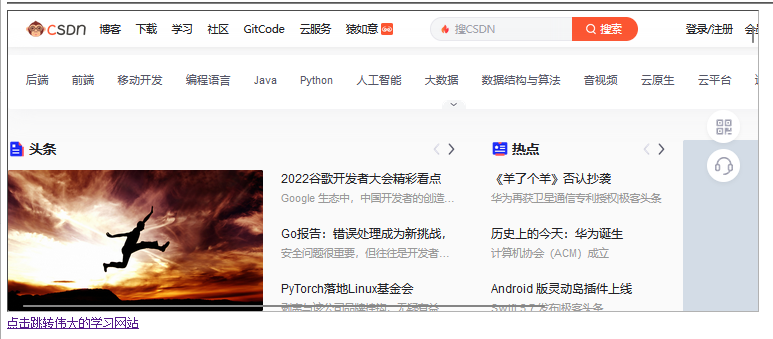

##### 5.1.14.万能的input

###### 5.2.14.1.单选

```html
<p>单选框</p>
<input type="radio" value="男" name="sex">男
<input type="radio" value="女" name="sex">女
</p>
```

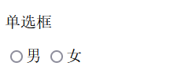

###### 5.2.15.2.多选

```html
<p>多选框</p>
<input type="checkbox" value="basketball" name="hobby">篮球
<input type="checkbox" value="football" name="hobby">足球
</p>
```

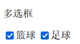

###### 5.2.15.3.按钮

###### 5.2.15.4.文本

###### 5.2.15.5.邮箱

###### 5.2.15.6.手机号

###### 5.2.15.7.提交

###### 5.2.15.8.清空

##### 5.2.16.列表

###### 5.2.16.1.有序列表

```html
<p>有序列表</p>
<ol>
    <li>中国</li>
    <li>美国</li>
    <li>俄罗斯</li>
    <li>韩国</li>
</ol>
```

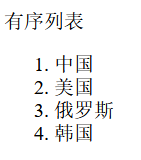

###### 5.2.16.1.无须列表

<p>有序列表</p>
<ul>
    <li>中国</li>
    <li>美国</li>
    <li>俄罗斯</li>
    <li>韩国</li>
</ul>

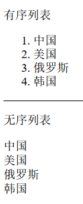

###### 5.2.16.1.自定义列表

##### 5.2.17.特殊符号

```html
<p>特殊符号</p>
<p>&hearts;</p>
<p>&nbsp;&nbsp;&nbsp;&nbsp;</p>
<p>&gt;</p>
<p>&lt;</p>
<p>&le;</p>
<p>&ge;</p>
```

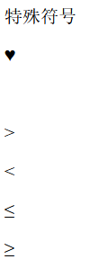

##### 5.2.18.表单

5.2.18.1.表单组成

5.2.18.2.表单提交

5.2.18.3.表单应用

#### 5.3.进阶1.0

##### 5.3.1.行级元素/块级元素

##### 5.3.2.正则校验

## 二.进阶2.X

### 1.SEO


