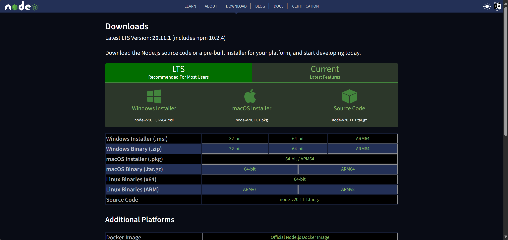
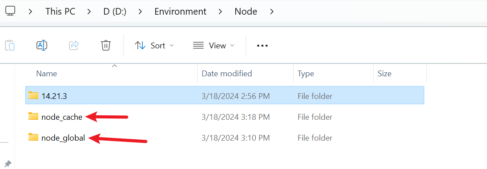
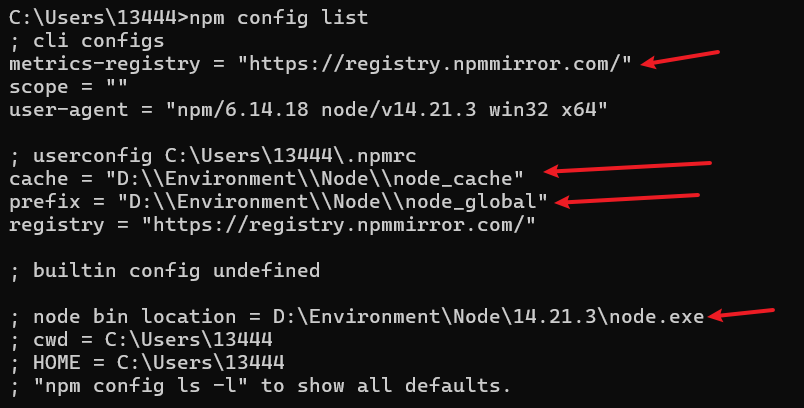
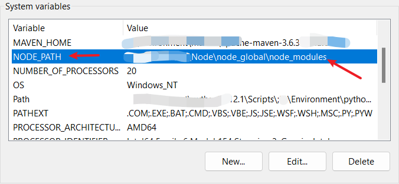
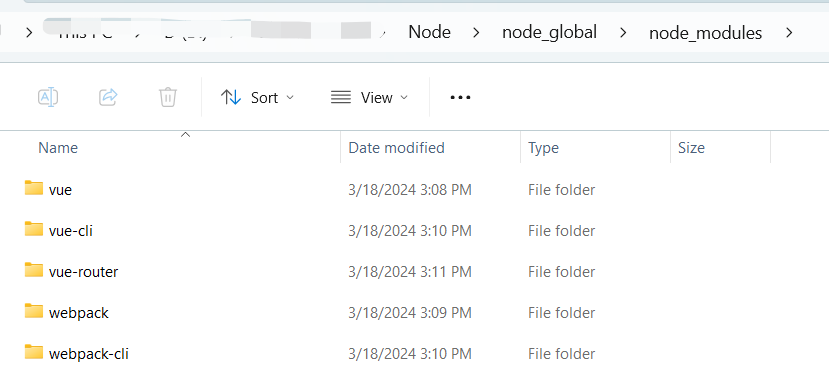

# VUE

## 0.前端环境搭建

参考博客：[Vue安装及环境配置、开发工具_vue@3.4.7 g:\javaworkspace\door-vue\node_modules\v-CSDN博客](https://blog.csdn.net/dream_summer/article/details/108867317)

==node、npm的介绍在下文中详细介绍==

### 1.node安装与配置

#### 1.node安装

node下载官网：[Node.js — Download (nodejs.org)](https://nodejs.org/en/download/)

注意选择与项目相匹配的Node版本

==验证node的安装情况：CMD命令==

```sh
node -v
npm -v
```



#### 2.node配置

配置默认安装目录与缓存日志目录

##### 1.创建目录

在合适的文件目录下创建node_cache、node_global及node_modules



##### 2.配置目录

执行命令

```shell
npm config set prefix "D:\Program Files\nodejs\node_global" -- 目标目录
npm config set cache "D:\Program Files\nodejs\node_cache"
```

##### 3.查看目录

```shell
npm config get prefix:查看npm全局安装包保存路径
npm config get cache:查看npm装包缓存路径
```

##### 4.配置淘宝镜像源（两种方式选择一种）

###### 1.npm配置淘宝镜像源

```shell
查看npm下载源
npm config get registry

配置npm的下载源
npm config set registry https://registry.npmmirror.com/ 
```

###### 2.安装cnpm

```shell
使用npm全局安装cnpm并配置淘宝镜像源
npm install -g cnpm --registry=https://registry.npmmirror.com/

查看cnpm的镜像源
cnpm config get registry
```

#### 3.相关命令：node、npm

```shell
npm config list：查看所有npm的配置
```



4.node环境配置（配置环境变量）



### 2.安装vue及脚手架

#### 1.安装vue.js

```shell
1.安装vue
npm install vue -g或cnpm install vue -g
解释：-g是全局安装

2.查看vue的信息、版本
信息：npm info vue或者cnpm info vue
版本：vue --version或者vue -V

3.查看安装的vue版本
npm list vue
```

#### 2.安装webpack

```shell
npm install webpack -g
```

#### 3.安装vue-cli脚手架

```shell
npm install vue-cli -g
```

#### 4.安装vue-router路由

```shell
npm install -g vue-router
```

==安装到现在，目前node_modules中包含的包==

