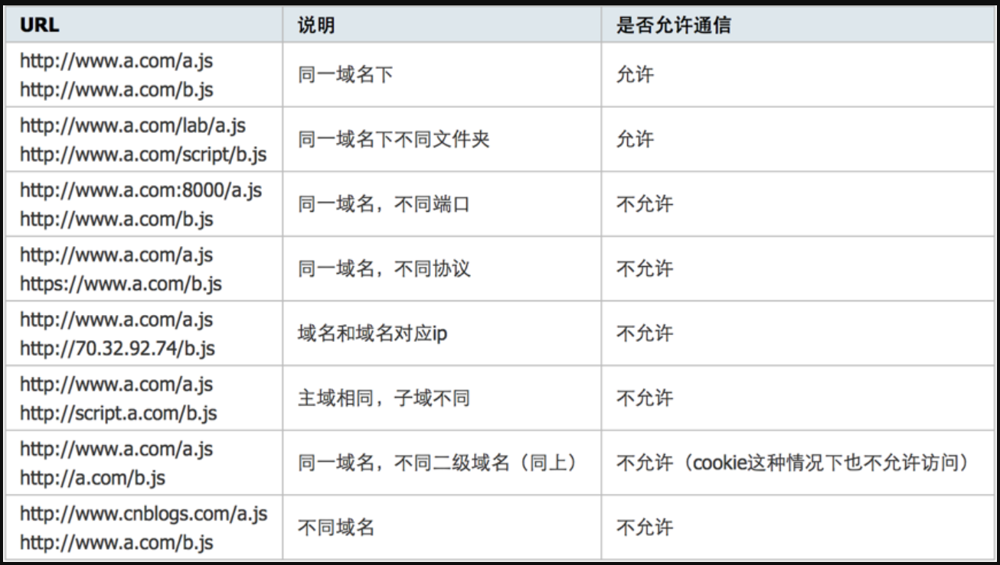

# 数据格式

# 1.JSON

## 1.1什么是JSON

JSON：javaScript Object Notation：js对象标记，是一种轻量级的数据交换格式，目前使用比较广泛。

- 采用完全独立于编程语言的文本格式来存储和表示数据
- 简洁和清晰的层次使得JSON成为理想的数据交换语言。
- 易于人的阅读和编写，同时也易于机器解析和生成，并有效地提升网络传输效率。

在javaScript语言中，一切都是对象。要求和语法格式：

- 对象表示为键值对，数据之间由逗号分隔。
- 花括号保存对象。
- 方括号保存数组。

## 1.2JSON语法

JSON键值对是用来保存javaScript对象的一种方式，和javaScript对象的写法差不多，键/值对组合的键名写在前面，并用双引号""包裹，使用冒号分隔，然后紧跟着值：

```json
{"name":"SuperRoc"}
```

JSON是JavaScript对象的字符串表示法，他使用文本表示一个JS对象的信息，本质是一个字符串。

```json
var obj = {name:'SuperRoc'}
var json = {"name":"SuperRoc"}
```

## 1.3JSON的优缺点

### 1.3.1JSON优点

1. 数据格式简单，易于读写，占用带宽小
2. 易于解析
3. 支持多种语言
4. 在PHP世界，已经有PHP-JSON和JSON-PHP出现，可见受众之多
5. 可以直接被服务器端代码使用，大大简化了服务器端和客户端的代码开发量

### 1.3.2JSON缺点

······

## 1.3JSON 与 XML

JSON和XML都用于传输数据；

json实例如下：

```json
{
    "sites": [
    { "name":"菜鸟教程" , "url":"www.runoob.com" }, 
    { "name":"google" , "url":"www.google.com" }, 
    { "name":"微博" , "url":"www.weibo.com" }
    ]
}
```

xml实例如下：

```xml
<sites>
  <site>
    <name>菜鸟教程</name> <url>www.runoob.com</url>
  </site>
  <site>
    <name>google</name> <url>www.google.com</url>
  </site>
  <site>
    <name>微博</name> <url>www.weibo.com</url>
  </site>
</sites>
```

### 1.3.1xml

#### 1.3.1.1xml的定义

​	扩展标记语言，用于标记电子文件使其具有结构性的标记语言，可以用来标记数据，定义数据类型，是一种允许用户对自己的标记语言进行定义的源语言。

​	其中XML使用DTD文档类型定义来组织数据；

​	这样做的好处：格式统一，跨平台和语言，已成为业内工人的标准。

​	XML是标准通用标记语言SGML的子集，非常适合Web传输，XML提供统一的方法来描述和交换独立于应用程序或供应商的结构化数据。

#### 1.3.1.2xml的优缺点

##### 1.优点

A.格式统一，符合标准

B.容易与其他系统进行远程交互，数据共享比较方便

##### 2.缺点

A.XML文件庞大（表示同样含义的上面两组数据，分别采用XML和JSON存储，XML的文件要比JSON的文件大），文件格式复杂，传输占带宽。

B.服务器及客户端都需要花费大量代码来解析XML，导致服务器端和客户端代码变得异常复杂且不易维护。

C.客户端不用浏览器之间解析XML的方式不一致，需要重复写很多代码；

D.服务器端和客户端解析XML文件需要花费很多时间。

### 1.3.2对比JSON和XML

#### 1.3.2.1相同之处

1. JSON和XML数据都可以“自我描述”，都易于理解
2. JSON和XML数据都是有层级结构
3. JSON和XMl数据都可以被大多数编程语言使用。

#### 1.3.2.2不同之处

1. JSON不需要结束标签
2. JSON更加简短
3. JSON读写速度更快
4. JSON可以使用数组
5. XML需要使用XML解析器来解析，JSON使用标准的JavaScript函数来解析

## 1.4JSON与JavaScript对象互转

JSON.parse()：将一个JSON字符串转换为JavaScript对象

JSON.stringify()：将JavaScript值转换为JSON字符串

## 1.5JSON工具

### 1.5.1jackson

### 1.5.2HuTool

### 1.5.3FastJSON

### 1.5.4Google

## 1.6JSON 与 JSONP

==JSON是一种数据交换格式，JSONP是非官方的跨域数据交互协议。==

**什么是跨域？**

JavaScript为了安全考虑，不允许跨域调用其他页面的对象，这种现象叫做跨域



​	因为JSON并不支持跨域资源请求，为了解决这个问题，需要采用JSONP数据交互协议。因为js文件的调用是不受跨域与否的限制，因此可以设法将json数据封装进js格式的文件中，供客户端进一步处理。

​	简单的说，就是json不支持跨域，而js可以跨域，因此在服务器端用客户端提供的js函数名将json数据封装起来，再将函数提供给客户端调用，从而获得json数据。

 　开发过程中，如果出现类似 “Origin ****** is not allowed by Access-Control-Allow-Origin.” 的错误，则可能是由于json数据不支持跨域导致的，应考虑使用jsonp协议。

 　如果出现类似 ”SyntaxError: Unexpected token ':'. Parse error.“ 的错误，则可能是由于返回的json数据没有用”callback“传递的函数名封装导致的。

注：参考：[简述json和jsonp的区别 - 简书 (jianshu.com)](https://www.jianshu.com/p/c6ac7d344cc6)
