# SpringFamily

注：Spring全家桶

# 1.Spring

## 1.1.Spring历史、简介、优点

> #### 简介

```xml
Spring : 春天 --->给软件行业带来了春天

2002年，Rod Jahnson首次推出了Spring框架雏形interface21框架。

2004年3月24日，Spring框架以interface21框架为基础，经过重新设计，发布了1.0正式版。

很难想象Rod Johnson的学历 , 他是悉尼大学的博士，然而他的专业不是计算机，而是音乐学。

Spring理念 : 使现有技术更加实用 . 本身就是一个大杂烩 , 整合现有的框架技术
```

Spring官网：http://spring.io/

官方下载地址 : https://repo.spring.io/libs-release-local/org/springframework/spring/

GitHub : https://github.com/spring-projects

> #### 优点

 1.Spring是一个开源免费的框架 , 容器

 2.Spring是一个轻量级的框架 , 非侵入式的框架

 **3.控制反转 IoC , 面向切面 Aop**

 4.对事务的支持 , 对框架的支持

**一句话概括：**

==**Spring是一个轻量级的控制反转(IoC)和面向切面(AOP)的容器（框架）。**==

## 1.2.Spring是什么？

### 1.2.1.Spring组成：七大模块

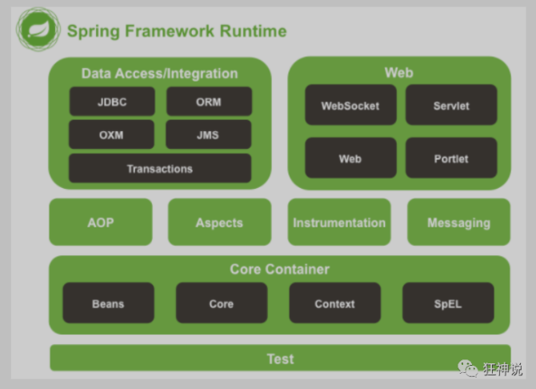

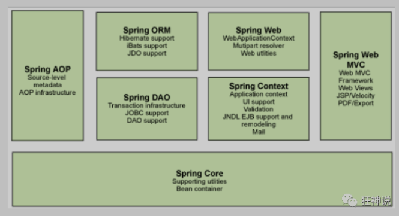

- **核心容器**：核心容器提供 Spring 框架的基本功能。核心容器的主要组件是 BeanFactory，它是工厂模式的实现。BeanFactory 使用*控制反转*（IOC）
  模式将应用程序的配置和依赖性规范与实际的应用程序代码分开。
- **Spring 上下文**：Spring 上下文是一个配置文件，向 Spring 框架提供上下文信息。Spring 上下文包括企业服务，例如 JNDI、EJB、电子邮件、国际化、校验和调度功能。
- **Spring AOP**：通过配置管理特性，Spring AOP 模块直接将面向切面的编程功能 , 集成到了 Spring 框架中。所以，可以很容易地使 Spring 框架管理任何支持 AOP的对象。Spring AOP 模块为基于Spring 的应用程序中的对象提供了事务管理服务。通过使用 Spring AOP，不用依赖组件，就可以将声明性事务管理集成到应用程序中。
- **Spring DAO**：JDBC DAO
  抽象层提供了有意义的异常层次结构，可用该结构来管理异常处理和不同数据库供应商抛出的错误消息。异常层次结构简化了错误处理，并且极大地降低了需要编写的异常代码数量（例如打开和关闭连接）。Spring DAO 的面向 JDBC的异常遵从通用的 DAO 异常层次结构。
- **Spring ORM**：Spring 框架插入了若干个 ORM 框架，从而提供了 ORM 的对象关系工具，其中包括 JDO、Hibernate 和 iBatis SQL Map。所有这些都遵从 Spring 的通用事务和 DAO异常层次结构。
- **Spring Web 模块**：Web 上下文模块建立在应用程序上下文模块之上，为基于 Web 的应用程序提供了上下文。所以，Spring 框架支持与 Jakarta Struts 的集成。Web模块还简化了处理多部分请求以及将请求参数绑定到域对象的工作。
- **Spring MVC 框架**：MVC 框架是一个全功能的构建 Web 应用程序的 MVC 实现。通过策略接口，MVC 框架变成为高度可配置的，MVC 容纳了大量视图技术，其中包括 JSP、Velocity、Tiles、iText和 POI。

### 1.2.2.Spring能做什么？

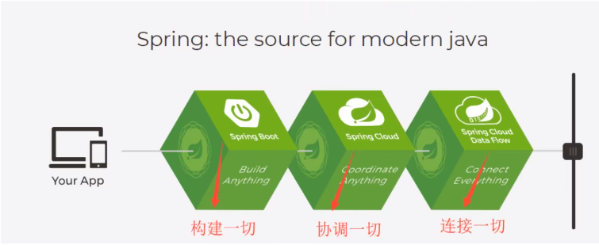

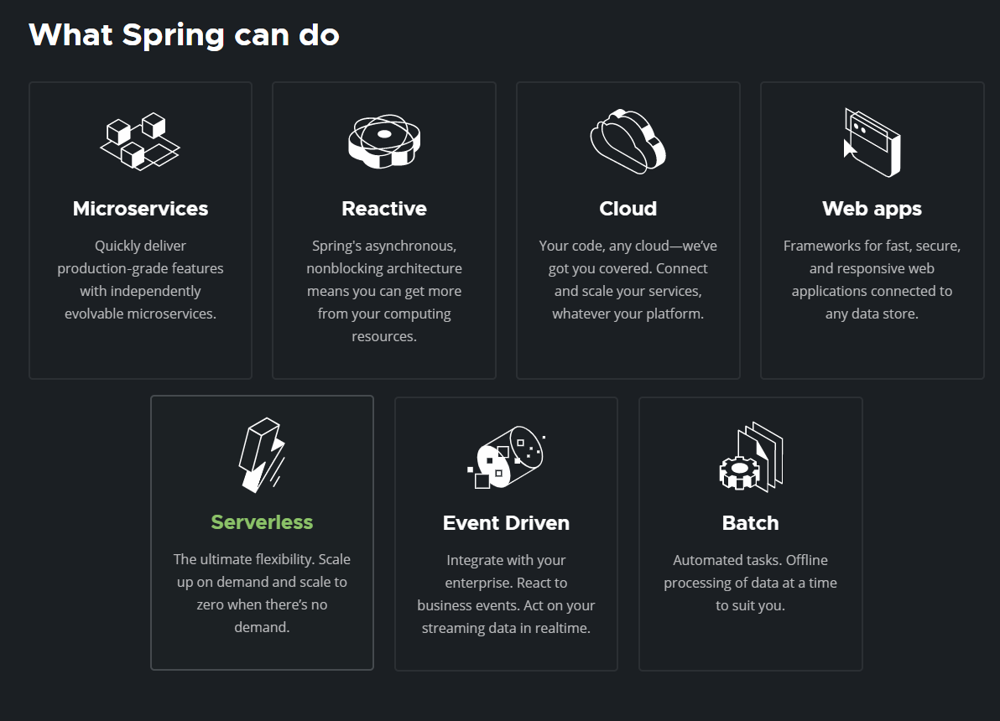

### 1.2.3.Spring思想及理论：IOC

#### 1.2.3.1.IOC理论

> 控制反转

```xml
控制反转IoC(Inversion of Control)，是一种设计思想，DI(依赖注入)是实现IoC的一种方法，也有人认为DI只是IoC的另一种说法。没有IoC的程序中 , 我们使用面向对象编程 , 对象的创建与对象间的依赖关系完全硬编码在程序中，对象的创建由程序自己控制，控制反转后将对象的创建转移给第三方，个人认为所谓控制反转就是：获得依赖对象的方式反转了。
```

IOC容器是具有依赖注入功能的容器，她能创建对象，IOC容器负责实例化、定位、配置应用程序中的对象来建立这些对象之间的依赖。

==**什么是控制反转？**==

之前new一个实例，控制权是程序员控制，而控制反转将new实例的工作交给Spring容器来控制，不再由程序员控制。

而在Spring中，BeanFactory是IOC容器的实际代表者。

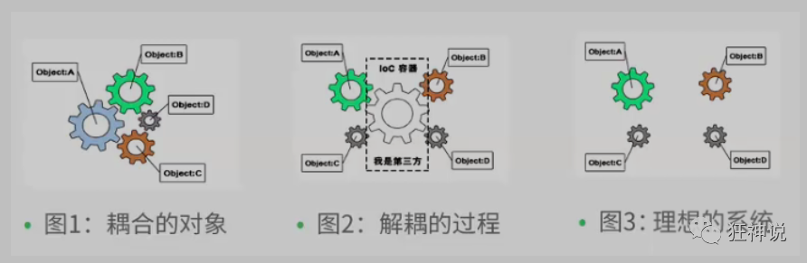


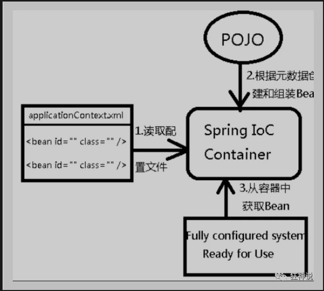

- **控制反转是一种通过描述（XML或注解）并通过第三方去生产或获取特定对象的方式。在Spring中实现控制反转的是IoC容器，其实现方法是依赖注入（Dependency Injection,DI）。**

#### 1.2.3.2.第一个Spring代码块：IOC的进阶理解

例子1：http://c.biancheng.net/view/4251.html

例子2：视频：https://www.bilibili.com/video/BV1WE411d7Dv?p=5&t=82

笔记链接：https://mp.weixin.qq.com/s/Sa39ulmHpNFJ9u48rwCG7A

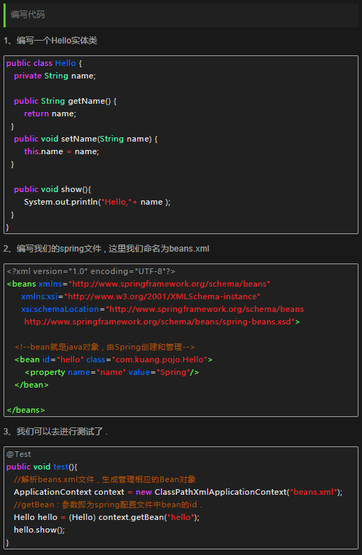

bean相当于创建一个对象，整个xml或者spring就是一个beans容器（对象容器），我们把new对象的动作交给了spring进行操作，省去了我们需要是创建相应对象的动作，类似于下面的new一个“hello”对象：

```java
Hello hello = new Hello();
```

将下面的new这个动作交于spring解决，后续交于注解解决。所谓的“控制反转”就是将我们自己去操作“反转”到spring操作，我们的代码不必出现一大堆的“new”，以及同一个类被多次引用从而创建多次对象，一定程度上避免资源的浪费。（资源浪费这个属于道听途说，如下图，java虚拟机new一个对象，当然，任重而道远，我也一定能了解到JVM相关的知识和应用。2022年1月4日20:36:32：new对象的确是会占用资源的，这里的资源通常是内存空间。）

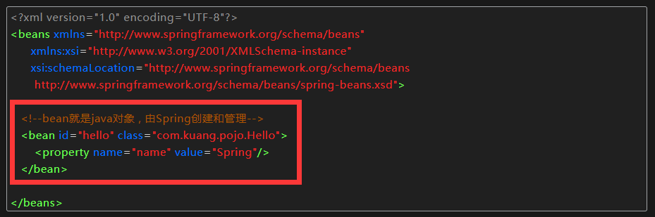

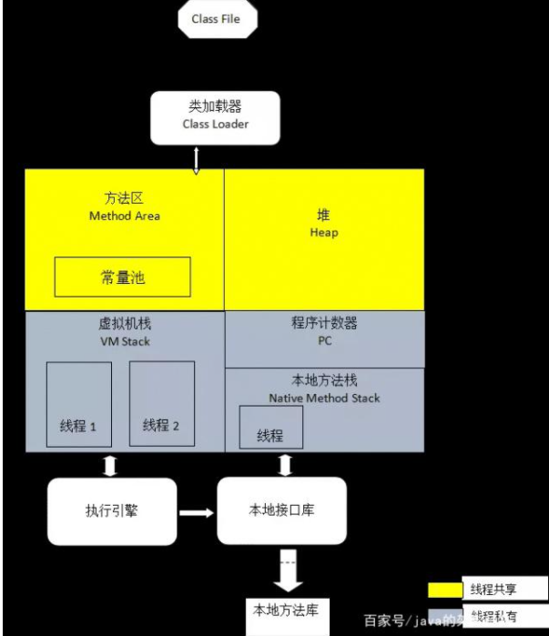

**所谓的IoC,一句话搞定 : 对象由Spring 来创建 , 管理 , 装配 !**

#### 1.2.3.3.Spring IOC创建对象的方式

1. 无参构造方式初始化

   类的无参构造方法

2. 有参构造方式初始化

   类的有参构造方法

#### 1.2.3.4.beans.xml的三种方式编写

```xml
<!-- 第一种根据index参数下标设置 -->
<bean id="userT" class="com.kuang.pojo.UserT">
   <!-- index指构造方法 , 下标从0开始 -->
   <constructor-arg index="0" value="kuangshen2"/>
</bean>

<!-- 第二种根据参数名字设置 -->
<bean id="userT" class="com.kuang.pojo.UserT">
   <!-- name指参数名 -->
   <constructor-arg name="name" value="kuangshen2"/>
</bean>

<!-- 第三种根据参数类型设置 -->
<bean id="userT" class="com.kuang.pojo.UserT">
   <constructor-arg type="java.lang.String" value="kuangshen2"/>
</bean>
```

### 1.2.4.Spring思想及理论：DI

**理解DI的关键：谁依赖谁，为什么需要依赖？谁注入了谁？注入了什么？**

- **谁依赖谁？：应用程序依赖IOC容器**
- **为什么需要依赖？：应用程序需要IOC容器来提供对象所需要的外部资源**
- **谁注入了谁？：IOC容器注入应用程序某个对象（应用程序需要的对象）**
- **注入了什么？：注入了某个对象需要的外部资源（包括对象、资源、常量数据）。**

#### 1.2.4.1.构造器注入

构造器在创建bean的时候，可以实现注入

#### 1.2.4.2.Set方式注入

注：要求被注入的属性必须要有set方法。

如果属性是Boolean，没有set方法，而是is。

##### 1.常量注入

```xml
 <bean id="student" class="com.kuang.pojo.Student">
     <property name="name" value="小明"/>
 </bean>
```

##### 2.Bean注入

注意点：这里的值是一个引用，ref

```xml
 <bean id="addr" class="com.kuang.pojo.Address">
     <property name="address" value="重庆"/>
 </bean>
 
 <bean id="student" class="com.kuang.pojo.Student">
     <property name="name" value="小明"/>
     <property name="address" ref="addr"/>
 </bean>
```

##### 3.数组注入

```xml
 <bean id="student" class="com.kuang.pojo.Student">
     <property name="name" value="小明"/>
     <property name="address" ref="addr"/>
     <property name="books">
         <array>
             <value>西游记</value>
             <value>红楼梦</value>
             <value>水浒传</value>
         </array>
     </property>
 </bean>
```

##### 4.List注入

```xml
 <property name="hobbys">
     <list>
         <value>听歌</value>
         <value>看电影</value>
         <value>爬山</value>
     </list>
 </property>
```

##### 5.Map注入

```xml
 <property name="card">
     <map>
         <entry key="中国邮政" value="456456456465456"/>
         <entry key="建设" value="1456682255511"/>
     </map>
 </property>
```

##### 6.set注入

```xml
 <property name="games">
     <set>
         <value>LOL</value>
         <value>BOB</value>
         <value>COC</value>
     </set>
 </property>
```

##### 7.Null注入

```xml
 <property name="wife"><null/></property>
```

##### 8.Properties注入

```xml
 <property name="info">
     <props>
         <prop key="学号">20190604</prop>
         <prop key="性别">男</prop>
         <prop key="姓名">小明</prop>
     </props>
 </property>
```

#### 1.4.2.3.扩展方法注入

1. p命名空间注入

   ```xml
    导入约束 : xmlns:p="http://www.springframework.org/schema/p"
    
    <!--P(属性: properties)命名空间 , 属性依然要设置set方法-->
    <bean id="user" class="com.kuang.pojo.User" p:name="狂神" p:age="18"/>
   ```

2. c命名空间注入

   ```xml
    导入约束 : xmlns:c="http://www.springframework.org/schema/c"
    <!--C(构造: Constructor)命名空间 , 属性依然要设置set方法-->
    <bean id="user" class="com.kuang.pojo.User" c:name="狂神" c:age="18"/>
   ```

### 1.2.5.Spring IOC的配置

#### 1.2.5.1.bean的别名

```xml
<!--设置别名：在获取Bean的时候可以使用别名获取-->
<alias name="userT" alias="userNew"/>
```

#### 1.2.5.2.bean的配置：beans.xml的书写

```xml
<!--bean就是java对象,由Spring创建和管理-->

<!--
   id 是bean的标识符,要唯一,如果没有配置id,name就是默认标识符
   如果配置id,又配置了name,那么name是别名
   name可以设置多个别名,可以用逗号,分号,空格隔开
   如果不配置id和name,可以根据applicationContext.getBean(.class)获取对象;

class是bean的全限定名=包名+类名
-->
<bean id="hello" name="hello2 h2,h3;h4" class="com.kuang.pojo.Hello">
   <property name="name" value="Spring"/>
</bean>
```

#### 1.2.5.3.Import

团队合作通过import来导入另外一个beans.xml所装配的bean

```xml
<import resource="{path}/beans.xml"/>
```

### 1.2.6.Bean的作用域

在Spring中，那些组成应用程序的主体及由Spring IoC容器所管理的对象，被称之为bean。简单地讲，bean就是由IoC容器初始化、装配及管理的对象

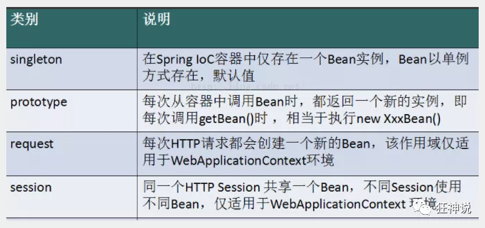

#### 1.2.6.1.单例模式（Spring的默认模式）

当一个bean的作用域为Singleton，那么Spring IoC容器中只会存在一个共享的bean实例，并且所有对bean的请求，只要id与该bean定义相匹配，则只会返回bean的同一实例。Singleton是单例类型，就是在**创建起容器时就同时自动创建了一个bean的对象**，不管你是否使用，他都存在了，每次获取到的对象都是同一个对象。注意，Singleton作用域是Spring中的缺省作用域。要在XML中将bean定义成singleton，可以这样配置：

```xml
 <bean id="ServiceImpl" class="cn.csdn.service.ServiceImpl" scope="singleton">
```

#### 1.2.6.2.原型模式

当一个bean的作用域为Prototype，表示一个bean定义对应多个对象实例。Prototype作用域的bean会导致在每次对该bean请求（将其注入到另一个bean中，或者以程序的方式调用容器的getBean()方法）时都会创建一个新的bean实例。Prototype是原型类型，它在我们创建容器的时候并没有实例化，而是当我们获取bean的时候才会去创建一个对象，而且我们每次获取到的对象都不是同一个对象。根据经验，对有状态的bean应该使用prototype作用域，而对无状态的bean则应该使用singleton作用域。在XML中将bean定义成prototype，可以这样配置：

```xml
 <bean id="account" class="com.foo.DefaultAccount" scope="prototype"/>  
  或者
 <bean id="account" class="com.foo.DefaultAccount" singleton="false"/>
```

### 1.2.7.AOP

#### 1.2.7.1代理模式

注：为什么要学代理模式？

因为：AOP的底层机制就是动态代理

代理模式的分类：

- 静态代理
- 动态代理

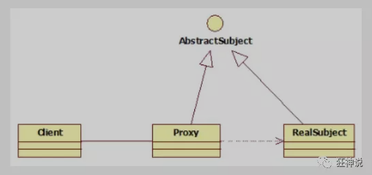

##### 1.2.7.1.1静态代理

**静态代理角色分析**

- 抽象角色 : 一般使用接口或者抽象类来实现
- 真实角色 : 被代理的角色
- 代理角色 : 代理真实角色 ; 代理真实角色后 , 一般会做一些附属的操作
- 客户  :  使用代理角色来进行一些操作

**静态代理的好处:**

- 可以使得我们的真实角色更加纯粹 . 不再去关注一些公共的事情
- 公共的业务由代理来完成 . 实现了业务的分工
- 公共业务发生扩展时变得更加集中和方便

**缺点 :**

- 类多了 , 多了代理类 , 工作量变大了 . 开发效率降低

##### 1.2.7.1.2动态代理

链接：https://www.bilibili.com/video/BV1WE411d7Dv?p=19&spm_id_from=pageDriver

笔记：https://mp.weixin.qq.com/s/McxiyucxAQYPSOaJSUCCRQ

- 动态代理的角色和静态代理是一样的。
- 动态代理的代理类是动态生成的，静态代理的代理类是我们提前写好的。
- 动态代理分为两类：一类是基于接口动态代理，一类是基于类的动态代理。
  - 基于接口的动态代理---JDK动态代理
  - 基于类的动态代理---cglib
  - 当下使用较多的是javasist

目前使用JDK的原生代码来实现，其余的道理都是一样的。

###### 1.2.7.1.2.1InvocationHandler：调用处理程序

###### 1.2.7.1.2.2Proxy：代理类

###### 1.2.7.1.2.3代码演示动态代理

###### 1.2.7.1.2.4动态代理的好处

- 可以是我们的真实角色更加的纯粹
- 公共的业务由代理完成，实现了业务的分工
- 公共业务发生拓展是变得更加集中和方便
- 一个动态代理一般代理某一类业务
- 一个动态代理可以代理很多的类，代理的事接口

#### 1.2.7.2AOP

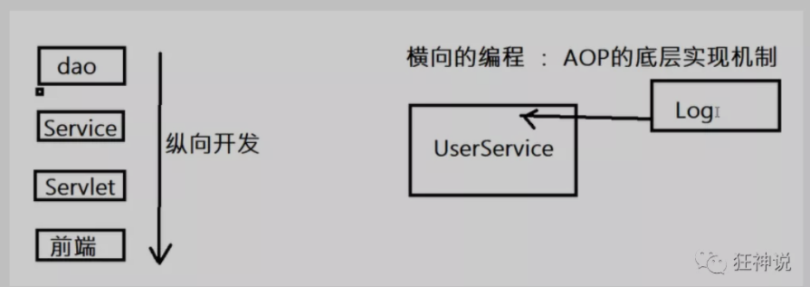

来自大佬的通俗理解：

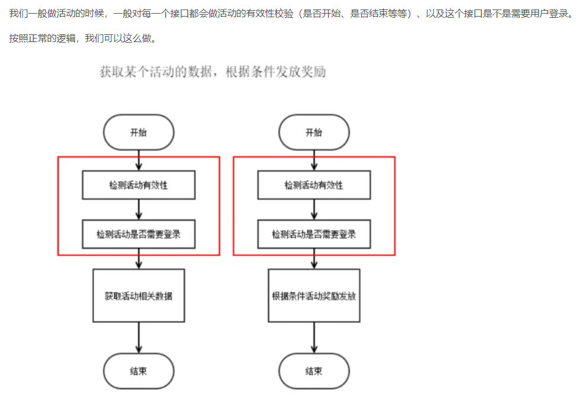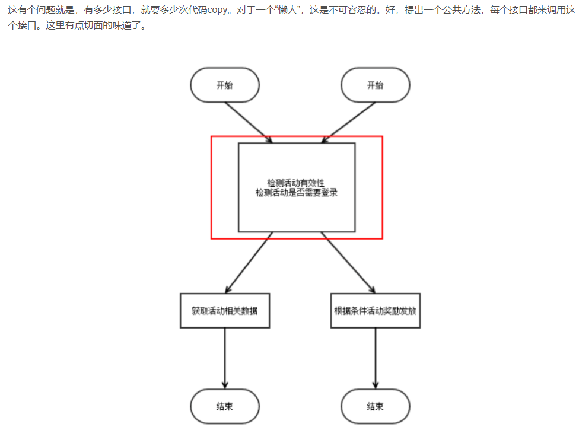


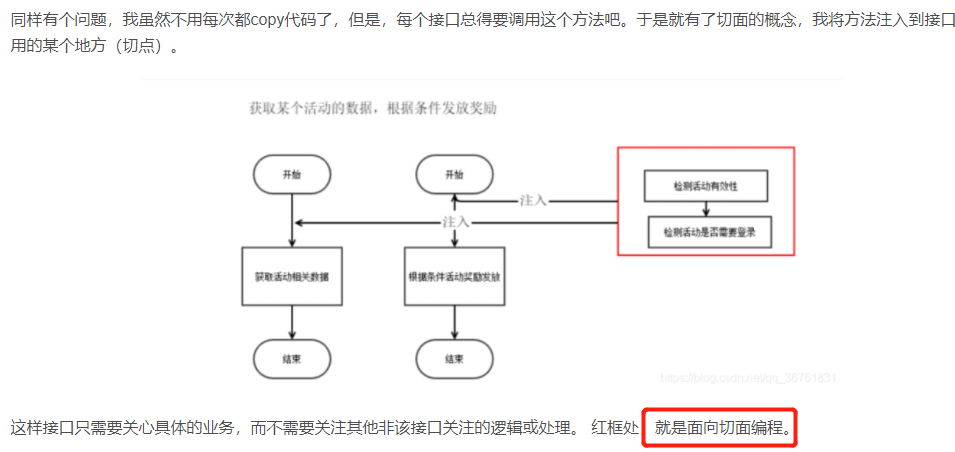


##### 1.2.7.2.1什么是AOP？

AOP（Aspect Oriented Programming）意为：面向切面编程，通过预编译方式和运行期动态代理实现程序功能的统一维护的一种技术。AOP是OOP的延续，是软件开发中的一个热点，也是Spring框架中的一个重要内容，是函数式编程的一种衍生范型。利用AOP可以对业务逻辑的各个部分进行隔离，从而使得业务逻辑各部分之间的耦合度降低，提高程序的可重用性，同时提高了开发的效率。

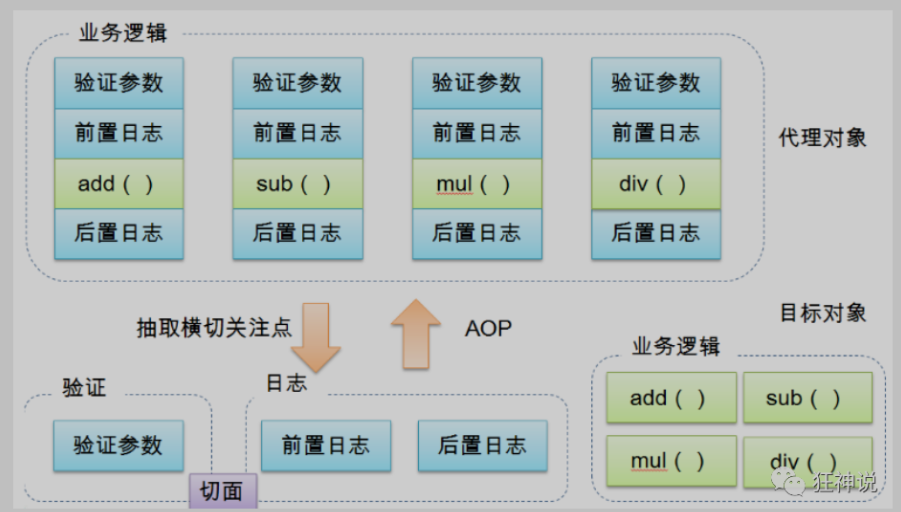

##### 1.2.7.2.2.Aop在Spring中的作用

###### 1.2.7.2.2.1**提供声明式事务；允许用户自定义切面**

###### 1.2.7.2.2.2Log日志

以下名词需要了解下：

- 横切关注点：跨越应用程序多个模块的方法或功能。即是，与我们业务逻辑无关的，但是我们需要关注的部分，就是横切关注点。如日志 , 安全 , 缓存 , 事务等等 ....

- 切面（ASPECT）：横切关注点 被模块化 的特殊对象。即，它是一个类。

- 通知（Advice）：切面必须要完成的工作。即，它是类中的一个方法。

- 目标（Target）：被通知对象。

- 代理（Proxy）：向目标对象应用通知之后创建的对象。

- 切入点（PointCut）：切面通知 执行的 “地点”的定义。

- 连接点（JointPoint）：与切入点匹配的执行点。

  Aop 在 不改变原有代码的情况下 , 去增加新的功能

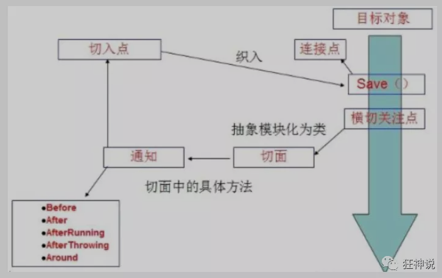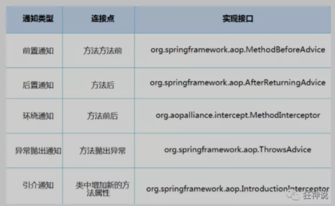


##### 1.2.7.2.3.Spring实现AOP的三种方式

###### 1.2.7.2.3.1.Spring实现AOP

1.使用AOP织入导入依赖包

```xml
<!-- https://mvnrepository.com/artifact/org.aspectj/aspectjweaver -->
<dependency>
   <groupId>org.aspectj</groupId>
   <artifactId>aspectjweaver</artifactId>
   <version>1.9.4</version>
</dependency>
```

###### 1.2.7.2.3.2.自定义类实现AOP

###### 1.2.7.2.3.3.使用注解实现AOP

### 1.2.8.声明式事务

#### 1.2.8.1什么是事务？

**事务就是把一系列的动作当成一个独立的工作单元，这些动作要么全部完成，要么全部不起作用。**

#### 1.2.8.2事务的四个属性ACID

1. 原子性（atomicity）

   事务是原子性操作，由一系列动作组成，事务的原子性确保动作要么全部完成，要么完全不起作用

2. 一致性（consistency）

   一旦所有事务动作完成，事务就要被提交。数据和资源处于一种满足业务规则的一致性状态中

3. 隔离性（isolation）

   可能多个事务会同时处理相同的数据，因此每个事务都应该与其他事务隔离开来，防止数据损坏

4. 持久性（durability）

   事务一旦完成，无论系统发生什么错误，结果都不会受到影响。通常情况下，事务的结果被写到持久化存储器中

#### 1.2.8.3 Sring中的事务管理

Spring在不同的事务管理API之上定义了一个抽象层，使得开发人员不必了解底层的事务管理API就可以使用Spring的事务管理机制。Spring支持编程式事务管理和声明式的事务管理。

##### 1.2.8.3.1编程式事务管理

- 将事务管理代码嵌到业务方法中来控制事务的提交和回滚
- 缺点：必须在每个事务操作业务逻辑中包含额外的事务管理代码

##### 1.2.8.3.2声明式事务管理

- 一般情况下比编程式事务好用。
- 将事务管理代码从业务方法中分离出来，以声明的方式来实现事务管理。
- 将事务管理作为横切关注点，通过aop方法模块化。Spring中通过Spring AOP框架支持声明式事务管理。

**使用Spring管理事务，注意头文件的约束导入 : tx**

```xml
xmlns:tx="http://www.springframework.org/schema/tx"
http://www.springframework.org/schema/tx
http://www.springframework.org/schema/tx/spring-tx.xsd">
```

**事务管理器**

- 无论使用Spring的哪种事务管理策略（编程式或者声明式）事务管理器都是必须的。
- 就是 Spring的核心事务管理抽象，管理封装了一组独立于技术的方法。

```xml
<?xml version="1.0" encoding="UTF-8"?>
<beans xmlns="http://www.springframework.org/schema/beans"
       xmlns:xsi="http://www.w3.org/2001/XMLSchema-instance"
       xmlns:tx="http://www.springframework.org/schema/tx"
       xmlns:aop="http://www.springframework.org/schema/aop"
       xsi:schemaLocation="http://www.springframework.org/schema/beans
        https://www.springframework.org/schema/beans/spring-beans.xsd
        http://www.springframework.org/schema/tx
        https://www.springframework.org/schema/tx/spring-tx.xsd
        http://www.springframework.org/schema/aop
        https://www.springframework.org/schema/aop/spring-tx.aop">

    <!--data source-->
    <bean id="datasource" class="org.springframework.jdbc.datasource.DriverManagerDataSource">
        <property name="driverClassName" value="com.mysql.jdbc.Driver"/>
        <property name="url" value="jdbc:mysql://111.230.212.103:3306/mybatis?userSSL=true&amp;
                userUnicode=true&amp;characterEncoding=UTF-8"/>
        <property name="username" value="root"/>
        <property name="password" value="hdk123"/>
    </bean>

    <!--sqlsession-->
    <bean id="sqlSessionFactory" class="org.mybatis.spring.SqlSessionFactoryBean">
        <property name="dataSource" ref="datasource" />
        <!--bound mybatis-->
        <property name="configLocation" value="classpath:mybatis-config.xml"/>
        <property name="mapperLocations" value="classpath:com/mapper/*.xml"/>
    </bean>

    <!--声明式事务-->
    <bean id="transactionManager" class="org.springframework.jdbc.datasource.DataSourceTransactionManager">
        <constructor-arg ref="datasource" />
    </bean>

    <!--结合aop实现事务置入-->
    <!--配置事务的类-->
    <tx:advice id="tx1" transaction-manager="transactionManager">
        <!--给哪些方法配置事务-->
        <!--配置事务的传播特性-->
        <tx:attributes>
            <tx:method name="add*" propagation="REQUIRED"/>
            <tx:method name="delete*" propagation="REQUIRED"/>
            <tx:method name="update*" propagation="REQUIRED"/>
            <tx:method name="*" propagation="REQUIRED"/>
            <tx:method name="query*" read-only="true"/>
        </tx:attributes>
    </tx:advice>

    <!--配置事务切入-->
    <aop:config>
        <aop:pointcut id="txpointxut" expression="execution(* com.mapper.*.*(..))"/>
        <aop:advisor advice-ref="tx1" pointcut-ref="txpointxut"/>
    </aop:config>

</beans>
```

#### 1.2.8.4事务开发与注解

## 1.3.如何使用Spring？

### 1.3.1.Bean的自动装配

> 自动装配说明

- 自动装配是使用spring满足bean依赖的一种方法
- spring会在应用上下文中为某个bean寻找其依赖的bean

其中**Spring中bean有三种装配机制，分别是：**

1. 在xml中显式配置；
2. 在java中显式配置；
3. 隐式的bean发现机制和自动装配。

**Spring的自动装配需要从两个角度来实现，或者说是两个操作：**

1. 组件扫描(component scanning)：spring会自动发现应用上下文中所创建的bean；
2. 自动装配(autowiring)：spring自动满足bean之间的依赖，也就是我们说的IoC/DI；

#### 1.3.1.1.xml配置之自动装配：AutowireByName

> ByName的时候，需要保证Bean的id唯一，并且这个Bean要和自动注入的属性的set方法的值一致。

#### 1.3.1.2.xml配置之自动装配：AutowireByType

ByType的时候，需要保证Bean的class唯一，并且这个Bean要和自动注入的属性的属性的类型一致。

### 1.3.2.使用注解实现装配Bean

jdk1.5开始支持注解，spring2.5开始全面支持注解。

在使用注解自动装配之前，需要在beans.xml中打开注解的开关

```xml
<?xml version="1.0" encoding="UTF-8"?>
<beans xmlns="http://www.springframework.org/schema/beans"
    xmlns:xsi="http://www.w3.org/2001/XMLSchema-instance"
    xmlns:context="http://www.springframework.org/schema/context"
    xsi:schemaLocation="http://www.springframework.org/schema/beans
        https://www.springframework.org/schema/beans/spring-beans.xsd
        http://www.springframework.org/schema/context
        https://www.springframework.org/schema/context/spring-context.xsd">

    <context:annotation-config/>

</beans>
```

#### 1.3.2.1.javaX的注入注解

##### 1.3.2.1.1.**@Autowired**

**@Autowired(required=false)  说明：false，对象可以为null；true，对象必须存对象，不能为null。**

```java
//如果允许对象为null，设置required = false,默认为true
@Autowired(required = false)
private Cat cat;
```

注:**@Qualifier**

- @Autowired是根据类型自动装配的，加上@Qualifier则可以根据byName的方式自动装配
- @Qualifier不能单独使用。

### 1.3.2.java的自动注入注解

#### 1..3.2.1.@Resource

- @Resource如有指定的name属性，先按该属性进行byName方式查找装配；
- 其次再进行默认的byName方式进行装配；
- 如果以上都不成功，则按byType的方式自动装配。
- 都不成功，则报异常。

**自动装配的两种注解的区别：**

@Autowired与@Resource异同：

1、@Autowired与@Resource都可以用来装配bean。都可以写在字段上，或写在setter方法上。

2、@Autowired默认按类型装配（属于spring规范），默认情况下必须要求依赖对象必须存在，如果要允许null 值，可以设置它的required属性为false，如：@Autowired(required=false)
，如果我们想使用名称装配可以结合@Qualifier注解进行使用

3、@Resource（属于J2EE复返），默认按照名称进行装配，名称可以通过name属性进行指定。如果没有指定name属性，当注解写在字段上时，默认取字段名进行按照名称查找，如果注解写在setter方法上默认取属性名进行装配。当找不到与名称匹配的bean时才按照类型进行装配。但是需要注意的是，如果name属性一旦指定，就只会按照名称进行装配。

### 1.3.3.使用注解开发

> 说明

在spring4之后，想要使用注解形式，必须得要引入aop的包。

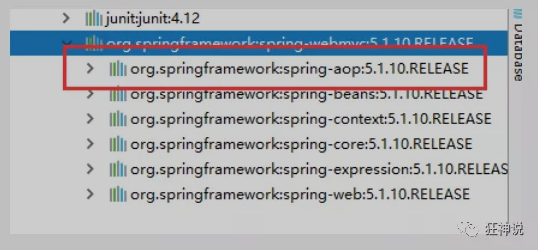

#### 1.3.3.1.装配bean

**@Component三个衍生注解**

为了更好的进行分层，Spring可以使用其它三个注解，功能一样，目前使用哪一个功能都一样。

- @Controller：web层
- @Service：service层
- @Repository：dao层

```java
@Component("user")
// 相当于配置文件中 <bean id="user" class="当前注解的类"/>
public class User {
   public String name = "秦疆";
}
```

#### 1.3.3.2.属性如何注入

```java
@Component("user")
public class User {

   public String name;

   @Value("秦疆")
   public void setName(String name) {
       this.name = name;
  }
}
```

#### 1.3.3.3.注入bean

@Autowried/@Resource

#### 1.3.3.4.作用域

@Scope

```java
@Controller("user")
@Scope("prototype")
public class User {
   @Value("秦疆")
   public String name;
}
```

#### 1.3.3.5.小结

**XML与注解比较**

- XML可以适用任何场景 ，结构清晰，维护方便
- 注解不是自己提供的类使用不了，开发简单方便

**xml与注解整合开发** ：推荐最佳实践

- xml管理Bean
- 注解完成属性注入
- 使用过程中， 可以不用扫描，扫描是为了类上的注解

### 1.3.4.整合MyBatis

#### 1.3.4.1导入相关jar包

- junit
- mybatis
- mysql
- mybatis-spring
- aop植入
- spring相关（Spring-jdbc）

junit

```xml
<dependency>
   <groupId>junit</groupId>
   <artifactId>junit</artifactId>
   <version>4.12</version>
</dependency>
```

mybatis

```xml
<dependency>
   <groupId>org.mybatis</groupId>
   <artifactId>mybatis</artifactId>
   <version>3.5.2</version>
</dependency>
```

mysql-connector-java

```xml
<dependency>
   <groupId>mysql</groupId>
   <artifactId>mysql-connector-java</artifactId>
   <version>5.1.47</version>
</dependency>
```

spring相关

```xml
<dependency>
   <groupId>org.springframework</groupId>
   <artifactId>spring-webmvc</artifactId>
   <version>5.1.10.RELEASE</version>
</dependency>
<dependency>
   <groupId>org.springframework</groupId>
   <artifactId>spring-jdbc</artifactId>
   <version>5.1.10.RELEASE</version>
</dependency>
```

aspectJ AOP 植入

```xml
<!-- https://mvnrepository.com/artifact/org.aspectj/aspectjweaver -->
<dependency>
   <groupId>org.aspectj</groupId>
   <artifactId>aspectjweaver</artifactId>
   <version>1.9.4</version>
</dependency>
```

mybatis-spring整合包 【重点】

```xml
<dependency>
   <groupId>org.mybatis</groupId>
   <artifactId>mybatis-spring</artifactId>
   <version>2.0.2</version>
</dependency>
```

#### 1.3.4.2配置mybatis

#### 1.3.4.3编写接口及相应的xml

#### 1.3.4.4mybatis-spring

mybatis官方文档链接：https://mybatis.org/mybatis-3/zh/getting-started.html

mybatis-spring：http://mybatis.org/spring/zh/index.html

#### 1.3.4.5整合mybatis和spring

### 1.3.5装配与注入的注解合集

#### 1.3.5.1装配

1. @Component及其衍生注解
   1. @Component
   2. @Service
   3. @Controller
   4. @Repository
2. @Bean
3. @Configuration
4. @Mapper（mybatis）

#### 1.3.5.2注入

1. @Autowired
2. @Resource

# 2.SpringMVC

## 2.1.什么是MVC？

- MVC是模型(Model)、视图(View)、控制器(Controller)的简写，是一种软件设计规范。
- 是将业务逻辑、数据、显示分离的方法来组织代码。
- MVC主要作用是**降低了视图与业务逻辑间的双向偶合**。
- MVC不是一种设计模式，**MVC是一种架构模式**。当然不同的MVC存在差异。

**Model（模型）：**数据模型，提供要展示的数据，因此包含数据和行为，可以认为是领域模型或JavaBean组件（包含数据和行为），不过现在一般都分离开来：Value Object（数据Dao） 和服务层（行为Service）。也就是模型提供了模型数据查询和模型数据的状态更新等功能，包括数据和业务。

**View（视图）：**负责进行模型的展示，一般就是我们见到的用户界面，客户想看到的东西。

**Controller（控制器）：**接收用户请求，委托给模型进行处理（状态改变），处理完毕后把返回的模型数据返回给视图，由视图负责展示。也就是说控制器做了个调度员的工作。

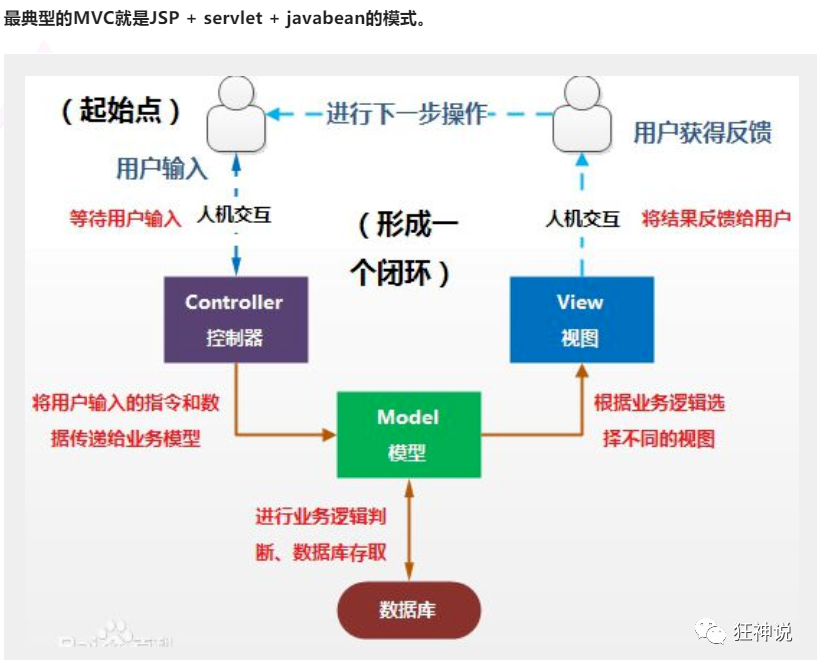

### 2.1.1分层架构的版本

#### 2.1.1.1model 01时代

- 在web早期的开发中，通常采用的都是Model1。
- Model1中，主要分为两层，视图层和模型层。

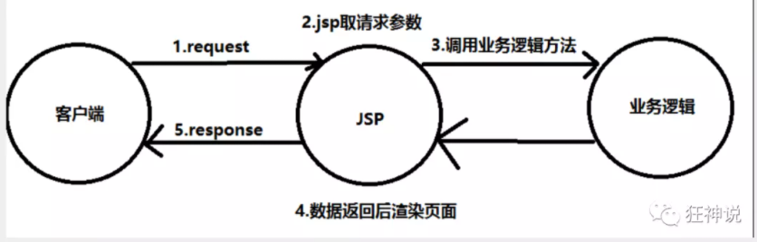

#### 2.2.1.2model 02时代

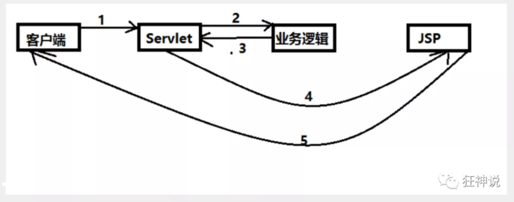

1. 用户发送请求
2. Servlet接受请求数据，并调用对应的业务逻辑方法
3. 业务处理完毕，返回更新后的数据给Servlet
4. Servlet转向JSP，由JSP来渲染页面
5. 响应给前端更新后的页面

## 2.2回顾Servlet

### 2.2.1导入依赖

```xml
<dependencies>
   <dependency>
       <groupId>junit</groupId>
       <artifactId>junit</artifactId>
       <version>4.12</version>
   </dependency>
   <dependency>
       <groupId>org.springframework</groupId>
       <artifactId>spring-webmvc</artifactId>
       <version>5.1.9.RELEASE</version>
   </dependency>
   <dependency>
       <groupId>javax.servlet</groupId>
       <artifactId>servlet-api</artifactId>
       <version>2.5</version>
   </dependency>
   <dependency>
       <groupId>javax.servlet.jsp</groupId>
       <artifactId>jsp-api</artifactId>
       <version>2.2</version>
   </dependency>
   <dependency>
       <groupId>javax.servlet</groupId>
       <artifactId>jstl</artifactId>
       <version>1.2</version>
   </dependency>
```

### 2.2.2编写Servlet类

**实现了Servlet类的方法的程序就是Servlet程序**

```java
//实现Servlet接口
public class HelloServlet extends HttpServlet {
   @Override
   protected void doGet(HttpServletRequest req, HttpServletResponse resp) throwsServletException, IOException {
       //取得参数
       String method = req.getParameter("method");
       if (method.equals("add")){
           req.getSession().setAttribute("msg","执行了add方法");
      }
       if (method.equals("delete")){
           req.getSession().setAttribute("msg","执行了delete方法");
      }
       //业务逻辑
       //视图跳转
       req.getRequestDispatcher("/WEB-INF/jsp/hello.jsp").forward(req,resp);
  }
  
   @Override
   protected void doPost(HttpServletRequest req, HttpServletResponse resp) throwsServletException, IOException {
       doGet(req,resp);
  }
}
```

### 2.2.3在Web.xml中注册Servlet

注册Servlet和Servlet-mapping

```java
<?xml version="1.0" encoding="UTF-8"?>
<web-app xmlns="http://xmlns.jcp.org/xml/ns/javaee"
        xmlns:xsi="http://www.w3.org/2001/XMLSchema-instance"
        xsi:schemaLocation="http://xmlns.jcp.org/xml/ns/javaee http://xmlns.jcp.org/xml/ns/javaee/web-app_4_0.xsd"
        version="4.0">
   <servlet>
       <servlet-name>HelloServlet</servlet-name>
       <servlet-class>com.kuang.servlet.HelloServlet</servlet-class>
   </servlet>
   <servlet-mapping>
       <servlet-name>HelloServlet</servlet-name>
       <url-pattern>/user</url-pattern>
   </servlet-mapping>
</web-app>
```

## 2.4常见的MVC框架

### 2.4.1后端框架

> Struts、Spring MVC、ASP.NET MVC、Zend Framework、JSF

### 2.4.2前端框架

> vue，angularJS，react

## 2.5什么是SpringMVC？

### 2.5.1为什么要学习SpringMVC？


Spring MVC是Spring Framework的一部分，是基于Java实现MVC架构的轻量级Web框架。

查看官方文档：https://docs.spring.io/spring/docs/5.2.0.RELEASE/spring-framework-reference/web.html#spring-web

### 2.5.2SpringMVC的优点

1. 轻量级，简单易学
2. 高效 , 基于请求响应的MVC框架
3. 与Spring兼容性好，无缝结合
4. 约定优于配置
5. 功能强大：RESTful、数据验证、格式化、本地化、主题等
6. 简洁灵活

==**Spring的web框架围绕DispatcherServlet [ 调度Servlet ] 设计。**==

DispatcherServlet的作用是将请求分发到不同的处理器。从Spring 2.5开始，使用Java 5或者以上版本的用户可以采用基于注解形式进行开发，十分简洁；

正因为SpringMVC好 , 简单 , 便捷 , 易学 , 天生和Spring无缝集成(使用SpringIoC和Aop) , 使用约定优于配置 . 能够进行简单的junit测试 . 支持Restful风格 .异常处理 , 本地化 ,国际化 , 数据验证 , 类型转换 , 拦截器 等等......所以我们要学习 .

### 2.5.3.SpringMVC的原理（执行原理）（重中之重）

如下图所示：

当发起请求时被前置的控制器拦截到请求，根据请求参数生成代理请求，找到请求对应的实际控制器，控制器处理请求，创建数据模型，访问数据库，将模型响应给中心控制器，控制器使用模型与视图渲染视图结果，将结果返回给中心控制器，再将结果返回给请求者。

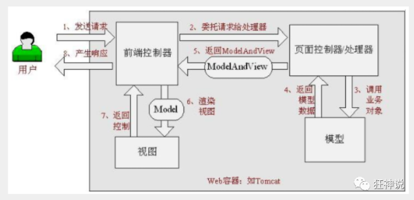


==**SpringMVC执行原理：对请求处理**==

注：下图是SpringMVC一个完整的流程图，事先表示了SpringMVC框架提供的技术，不需要开发者实现，虚线表示需要开发者实现。

1. DispatcherServlet表示前置控制器，是整个SpringMVC的控制中心。当用户发送请求，DispatcherServlet接受请求拦截请求

   假设请求的Url为http：//localhost：9999/SpringMVC/input-product

   如上的Url会被拆分成：

   ​	（1.）http://localhost:9999 表示服务器域名

   ​	（2.）SpringMVC 表示部署在服务器上的web站点

   ​	（3.）input-product 表示控制器

   通过上述分析，用户的请求被认为是：位于服务器localhost：9999的SpringMVC站点的input-product控制器

2. HandlerMapping：处理器映射。DispatcherServlet调用HandlerMapping，HandlerMapping根据请求Url查找Handler

3. HandlerExecution表示具体的Handler，其主要作用是根据Url查找控制器，如上url查找的控制器为input-product

4. HandlerExceution将解析后的信息传递给DispatcherServlet

5. HandlerAdapter表示处理器适配器，这里使用了适配器模式，其按照特定的规则去执行Handler

6. Handler让具体的Controller去执行

7. Controller将具体的执行信息返回给HandlerAdapter，如ModelAndView

8. HandlerAdapter将视图逻辑名或者模型（模型中可能携带数据）传递给DispatcherServlet

9. DispatcherServlet调用视图解析器（ViewResolver）来解析HandlerAdapter传递的逻辑视图名

10. 视图解析器ViewResolver将解析的逻辑视图名传递给DispatcherServlet

11. DispatcherServlet根据视图解析器解析的视图结果调用具体的视图

12. 最终将视图呈现给用户。

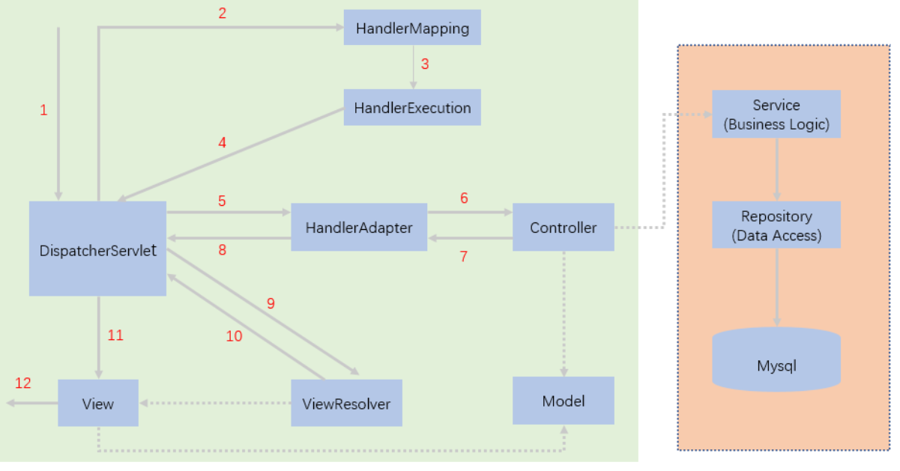

#### 2.5.3.1DispatcherServlet

Spring的web框架围绕着DispatcherServlet设计，DispatcherServlet的作用是将请求分发到不同的处理器。

从Spring 2.5开始，使用Java5或者以上的用户可以采用基于注解的Controller声明方式。

SpringMVC和许多的框架一样，以请求为驱动，围绕一个中心Servlet分派请求及提供其他的功能。

DispatcherServlet是一个继承自HttpServlet的Servlet子类。

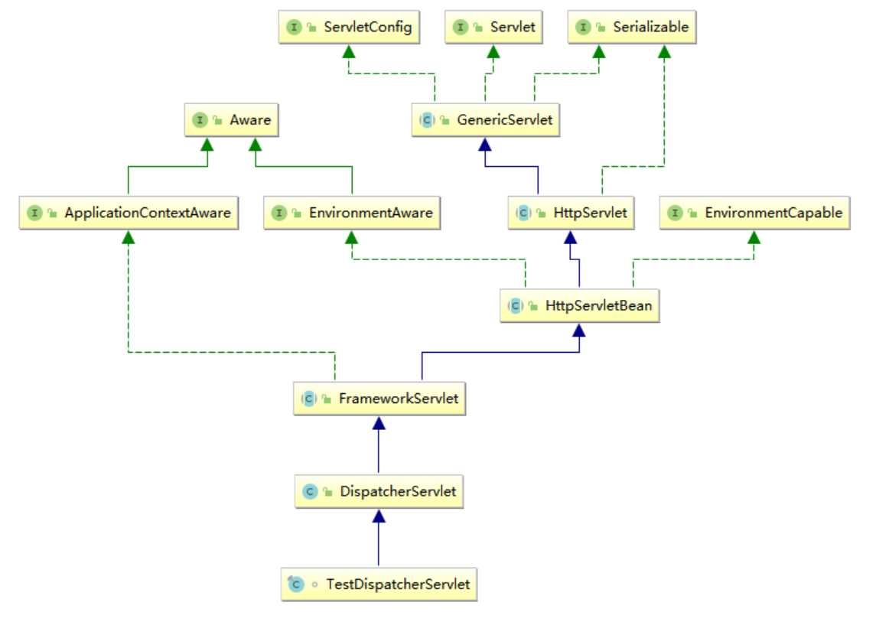

#### 2.5.3.2HandlerMapping

HandlerMapping主要用来解析请求的Url，解析出控制器

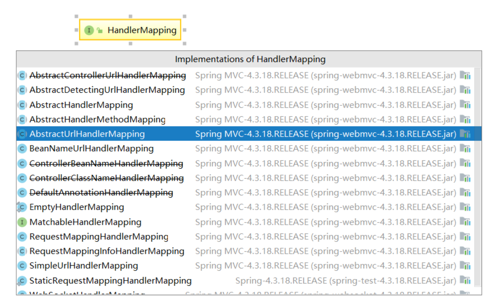

如下为HandlerMapping的UML图：

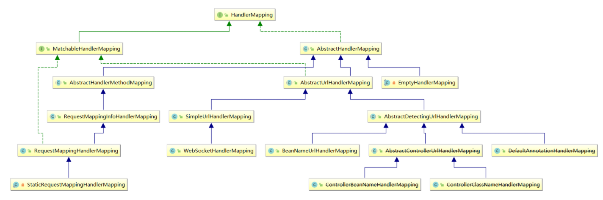

#### 2.5.3.3HandlerAdapter

HandlerAdapter主要是调度Controller处理业务逻辑

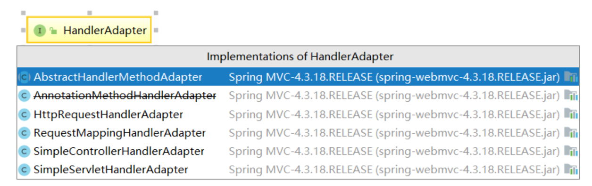

#### 2.5.3.4ViewResolver

ViewResolver接口主要作用是解析DispatcherServlet传递的逻辑视图名，并将其解析结果传递给DispatcherServlet。

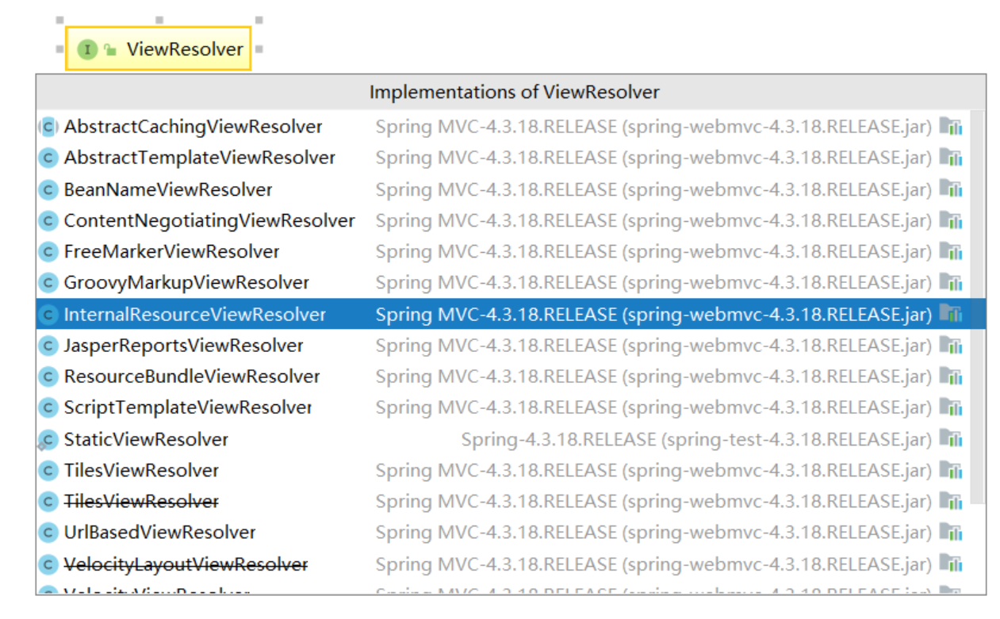

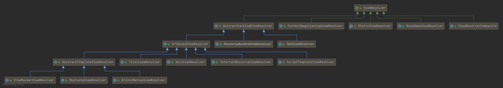

## 2.6.第一个SpringMVC程序

### 2.6.1导入SpringMVC的依赖

### 2.6.2配置web.xml：注册DispatcherServlet

```xml
<?xml version="1.0" encoding="UTF-8"?>
<web-app xmlns="http://xmlns.jcp.org/xml/ns/javaee"
        xmlns:xsi="http://www.w3.org/2001/XMLSchema-instance"
        xsi:schemaLocation="http://xmlns.jcp.org/xml/ns/javaee http://xmlns.jcp.org/xml/ns/javaee/web-app_4_0.xsd"
        version="4.0">
   <!--1.注册DispatcherServlet-->
   <servlet>
       <servlet-name>springmvc</servlet-name>
       <servlet-class>org.springframework.web.servlet.DispatcherServlet</servlet-class>
       <!--关联一个springmvc的配置文件:【servlet-name】-servlet.xml-->
       <init-param>
           <param-name>contextConfigLocation</param-name>
           <param-value>classpath:springmvc-servlet.xml</param-value>
       </init-param>
       <!--启动级别-1-->
       <load-on-startup>1</load-on-startup>
   </servlet>
   <!--/ 匹配所有的请求；（不包括.jsp）-->
   <!--/* 匹配所有的请求；（包括.jsp）-->
   <servlet-mapping>
       <servlet-name>springmvc</servlet-name>
       <url-pattern>/</url-pattern>
   </servlet-mapping>
</web-app>
```

### 2.6.3编写SpringMVC的配置文件

```xml
<?xml version="1.0" encoding="UTF-8"?>
<beans xmlns="http://www.springframework.org/schema/beans"
      xmlns:xsi="http://www.w3.org/2001/XMLSchema-instance"
      xsi:schemaLocation="http://www.springframework.org/schema/beans
       http://www.springframework.org/schema/beans/spring-beans.xsd">
</beans>
```

### 2.6.4添加处理器映射器

```xml
<bean class="org.springframework.web.servlet.handler.BeanNameUrlHandlerMapping"/>
```

### 2.6.5添加处理器适配器

```xml
<bean class="org.springframework.web.servlet.mvc.SimpleControllerHandlerAdapter"/>
```

### 2.6.6添加视图解析器

```xml
<!--视图解析器:DispatcherServlet给他的ModelAndView-->
<bean class="org.springframework.web.servlet.view.InternalResourceViewResolver" id="InternalResourceViewResolver">
   <!--前缀-->
   <property name="prefix" value="/WEB-INF/jsp/"/>
   <!--后缀-->
   <property name="suffix" value=".jsp"/>
</bean>
```

### 2.6.7编写Controller并配置到IOC容器中

```java
import org.springframework.web.servlet.ModelAndView;
import org.springframework.web.servlet.mvc.Controller;

import javax.servlet.http.HttpServletRequest;
import javax.servlet.http.HttpServletResponse;

//注意：这里我们先导入Controller接口
public class HelloController implements Controller {

   public ModelAndView handleRequest(HttpServletRequest request, HttpServletResponse response) throws Exception {
       //ModelAndView 模型和视图
       ModelAndView mv = new ModelAndView();

       //封装对象，放在ModelAndView中。Model
       mv.addObject("msg","HelloSpringMVC!");
       //封装要跳转的视图，放在ModelAndView中
       mv.setViewName("hello"); //: /WEB-INF/jsp/hello.jsp
       return mv;
  }
   
}
```

### 2.6.8启动tomcat测试

## 2.7.使用注解开发SpringMVC

### 2.7.0SpringMVC整体开发步骤

##### 2.7.0.1新建一个web项目

##### 2.7.0.2导入相关的jar包

##### 2.7.0.3编写Web.xml，注册DispatcherServlet

##### 2.7.0.4编写Springmvc.xml配置文件

SpringMVC.xml必备的三个组件：处理器映射器，处理器适配器，视图解析器

##### 2.7.0.5创建对应的控制类

##### 2.7.0.6调试测试

### 2.7.1配置web.xml

```xml
<?xml version="1.0" encoding="UTF-8"?>
<web-app xmlns="http://xmlns.jcp.org/xml/ns/javaee"
        xmlns:xsi="http://www.w3.org/2001/XMLSchema-instance"
        xsi:schemaLocation="http://xmlns.jcp.org/xml/ns/javaee http://xmlns.jcp.org/xml/ns/javaee/web-app_4_0.xsd"
        version="4.0">

   <!--1.注册servlet-->
   <servlet>
       <servlet-name>SpringMVC</servlet-name>
       <servlet-class>org.springframework.web.servlet.DispatcherServlet</servlet-class>
       <!--通过初始化参数指定SpringMVC配置文件的位置，进行关联-->
       <init-param>
           <param-name>contextConfigLocation</param-name>
           <param-value>classpath:springmvc-servlet.xml</param-value>
       </init-param>
       <!-- 启动顺序，数字越小，启动越早 -->
       <load-on-startup>1</load-on-startup>
   </servlet>

   <!--所有请求都会被springmvc拦截 -->
   <servlet-mapping>
       <servlet-name>SpringMVC</servlet-name>
       <url-pattern>/</url-pattern>
   </servlet-mapping>

</web-app>
```

/和/*的区别：

< url-pattern > / </ url-pattern > 不会匹配到.jsp， 只针对我们编写的请求；即：.jsp 不会进入spring的 DispatcherServlet类 。< url-pattern > /* </ url-pattern > 会匹配 *.jsp，会出现返回 jsp视图 时再次进入spring的DispatcherServlet 类，导致找不到对应的controller所以报404错。

### 2.7.2添加SpringMVC配置文件

在视图解析器中我们把所有的视图都存放在/WEB-INF/目录下，这样可以保证视图安全，因为这个目录下的文件，客户端不能直接访问。

1. 1. - 让IOC的注解生效
      - 静态资源过滤 ：HTML . JS . CSS . 图片 ， 视频 .....
      - MVC的注解驱动
      - 配置视图解析器

```xml
<?xml version="1.0" encoding="UTF-8"?>
<beans xmlns="http://www.springframework.org/schema/beans"
      xmlns:xsi="http://www.w3.org/2001/XMLSchema-instance"
      xmlns:context="http://www.springframework.org/schema/context"
      xmlns:mvc="http://www.springframework.org/schema/mvc"
      xsi:schemaLocation="http://www.springframework.org/schema/beans
       http://www.springframework.org/schema/beans/spring-beans.xsd
       http://www.springframework.org/schema/context
       https://www.springframework.org/schema/context/spring-context.xsd
       http://www.springframework.org/schema/mvc
       https://www.springframework.org/schema/mvc/spring-mvc.xsd">
​
   <!-- 自动扫描包，让指定包下的注解生效,由IOC容器统一管理 -->
   <context:component-scan base-package="com.kuang.controller"/>
   <!-- 让Spring MVC不处理静态资源 -->
   <mvc:default-servlet-handler />
   <!--
   支持mvc注解驱动
       在spring中一般采用@RequestMapping注解来完成映射关系
       要想使@RequestMapping注解生效
       必须向上下文中注册DefaultAnnotationHandlerMapping
       和一个AnnotationMethodHandlerAdapter实例
       这两个实例分别在类级别和方法级别处理。
       而annotation-driven配置帮助我们自动完成上述两个实例的注入。
    -->
   <mvc:annotation-driven />
​
   <!-- 视图解析器 -->
   <bean class="org.springframework.web.servlet.view.InternalResourceViewResolver"
         id="internalResourceViewResolver">
       <!-- 前缀 -->
       <property name="prefix" value="/WEB-INF/jsp/" />
       <!-- 后缀 -->
       <property name="suffix" value=".jsp" />
   </bean>
​
</beans>
```

### 2.7.3创建Controller

```java
import org.springframework.stereotype.Controller;
import org.springframework.ui.Model;
import org.springframework.web.bind.annotation.RequestMapping;
​
@Controller
@RequestMapping("/HelloController")
public class HelloController {
​
   //真实访问地址 : 项目名/HelloController/hello
   @RequestMapping("/hello")
   public String sayHello(Model model){
       //向模型中添加属性msg与值，可以在JSP页面中取出并渲染
       model.addAttribute("msg","hello,SpringMVC");
       //web-inf/jsp/hello.jsp
       return "hello";
  }
}
```


## 2.8.Controller

- 控制器复杂提供了访问应用程序的行为，通常通过接口定义或者注解定义两种方法实现
- 控制器负责解析用户的请求，并将其转换为一个模型
- SpringMVC中一个控制器可以包含多个方法
- SpringMVC中配置Controller的方法有很多种

### 2.8.1创建控制器

#### 2.8.1.1.实现Controller接口

Controller是一个接口，在org.springframework.web.servlet.mvc包下

实现该接口的类可以获得控制器的功能

```java
public interface Controller {
   //处理请求且返回一个模型与视图对象
   ModelAndView handleRequest(HttpServletRequest var1, HttpServletResponsevar2) throws Exception;
}
```

#### 2.8.1.2.使用注解@Controller

@Controller注解用于声明Spring类的实例是一个控制器，该注解是@Component的衍生注解

使用@Controller可以将控制器注册到SpringIOC的容器中，需要搭配Spring的配置

```xml
<!-- 自动扫描指定的包，下面所有注解类交给IOC容器管理 -->
<context:component-scan base-package="com.kuang.controller"/>
```

注：注解方式是最常用的方式，原因是一个控制器下可以实现多个方法。

## 2.9.RequestMapping

@RequestMapping注解用于映射url到控制器类或者一个特定的处理程序方法。可以用于类或者方法上。当用于类上，表示类中所有的响应请求的方法都是以该地址作为父路径，

## 2.10RestFul风格

RestFul风格就是一个基于资源定位及操作资源的风格。既不是标准也不是协议，仅是一种展示风格。

基于这个风格的软件可以更加简洁，更有层次。

## 2.11SpringMVC：跳转

跳转分为重定向/转发

### 2.11.1结果跳转方式

#### 2.11.1.1.配置视图解析器

```xml
<!-- 视图解析器 -->
<bean class="org.springframework.web.servlet.view.InternalResourceViewResolver"
     id="internalResourceViewResolver">
   <!-- 前缀 -->
   <property name="prefix" value="/WEB-INF/jsp/" />
   <!-- 后缀 -->
   <property name="suffix" value=".jsp" />
</bean>
```

#### 2.11.1.2.Controller编写对应跳转代码

```java
public class ControllerTest1 implements Controller {
​
   public ModelAndView handleRequest(HttpServletRequest httpServletRequest,HttpServletResponse httpServletResponse) throws Exception {
       //返回一个模型视图对象
       ModelAndView mv = new ModelAndView();
       mv.addObject("msg","ControllerTest1");
       mv.setViewName("test");
       return mv;
  }
}
```

### 2.11.2Servlet跳转

使用ServletAPI不需要视图解析器

```java
@Controller
public class ResultGo {
​
   @RequestMapping("/result/t1")
   public void test1(HttpServletRequest req, HttpServletResponse rsp) throwsIOException {
       rsp.getWriter().println("Hello,Spring BY servlet API");
  }
​
   @RequestMapping("/result/t2")
   public void test2(HttpServletRequest req, HttpServletResponse rsp) throwsIOException {
       rsp.sendRedirect("/index.jsp");
  }
​
   @RequestMapping("/result/t3")
   public void test3(HttpServletRequest req, HttpServletResponse rsp) throwsException {
       //转发
       req.setAttribute("msg","/result/t3");
       req.getRequestDispatcher("/WEB-INF/jsp/test.jsp").forward(req,rsp);
  }
​
}
```

### 2.11.3SpringMVC实现跳转

#### 2.11.3.1不需要视图解析器

```java
@Controller
public class ResultSpringMVC {
   @RequestMapping("/rsm/t1")
   public String test1(){
       //转发
       return "/index.jsp";
  }
​
   @RequestMapping("/rsm/t2")
   public String test2(){
       //转发二
       return "forward:/index.jsp";
  }
​
   @RequestMapping("/rsm/t3")
   public String test3(){
       //重定向
       return "redirect:/index.jsp";
  }
}
```

#### 2.11.3.2需要视图解析器

```java
@Controller
public class ResultSpringMVC2 {
   @RequestMapping("/rsm2/t1")
   public String test1(){
       //转发
       return "test";
  }
​
   @RequestMapping("/rsm2/t2")
   public String test2(){
       //重定向
       return "redirect:/index.jsp";
       //return "redirect:hello.do"; //hello.do为另一个请求/
  }
​
}
```

## 2.12SpringMVC：数据处理

### 2.12.1前端传给后端数据

基于restful风格处理前端传来的数据

#### 2.12.1.1提交的域名称和处理方法的参数名一致

提交数据 : http://localhost:8080/hello?name=kuangshen

处理方法 :

```java
@RequestMapping("/hello")
public String hello(String name){
   System.out.println(name);
   return "hello";
}
```

#### 2.12.1.2提交的域名称和处理方法的参数名不一致

提交数据 : http://localhost:8080/hello?username=kuangshen

处理方法 :

```java
//@RequestParam("username") : username提交的域的名称 .
@RequestMapping("/hello")
public String hello(@RequestParam("username") String name){
   System.out.println(name);
   return "hello";
}
```

后台输出 : kuangshen

#### 2.12.1.3提交的是对象

1、实体类

```
public class User {
   private int id;
   private String name;
   private int age;
   //构造
   //get/set
   //tostring()
}
```

2、提交数据 : http://localhost:8080/mvc04/user?name=kuangshen&id=1&age=15

3、处理方法 :

```
@RequestMapping("/user")
public String user(User user){
   System.out.println(user);
   return "hello";
}
```

后台输出 : User { id=1, name='kuangshen', age=15 }

说明：如果使用对象的话，前端传递的参数名和对象名必须一致，否则就是null。

### 2.12.2后端传给前端数据

#### 2.12.2.1通过ModelAndView

```java
public class ControllerTest1 implements Controller {

   public ModelAndView handleRequest(HttpServletRequest httpServletRequest,HttpServletResponse httpServletResponse) throws Exception {
       //返回一个模型视图对象
       ModelAndView mv = new ModelAndView();
       mv.addObject("msg","ControllerTest1");
       mv.setViewName("test");
       return mv;
  }
}
```

#### 2.12.2.2通过ModelMap

ModelMap

```java
@RequestMapping("/hello")
public String hello(@RequestParam("username") String name, ModelMap model){
   //封装要显示到视图中的数据
   //相当于req.setAttribute("name",name);
   model.addAttribute("name",name);
   System.out.println(name);
   return "hello";
}
```

#### 2.12.2.3通过Model

Model

```java
@RequestMapping("/ct2/hello")
public String hello(@RequestParam("username") String name, Model model){
   //封装要显示到视图中的数据
   //相当于req.setAttribute("name",name);
   model.addAttribute("msg",name);
   System.out.println(name);
   return "test";
}
```

#### 2.12.2.4.ModelAndView、ModelMap、Model对比

```txt
Model 只有寥寥几个方法只适合用于储存数据，简化了新手对于Model对象的操作和理解；

ModelMap 继承了 LinkedMap ，除了实现了自身的一些方法，同样的继承 LinkedMap 的方法和特性；

ModelAndView 可以在储存数据的同时，可以进行设置返回的逻辑视图，进行控制展示层的跳转。
```

## 2.13SSM整合

主机环境要求：

- idea/...
- mysql
- tomcat
- maven

### 2.13.1基础环境搭建

#### 2.13.1.1数据库环境

#### 2.13.1.2maven及静态资源过滤

##### 2.13.1.2.1使用idea创建一个maven项目，添加web支持

##### 2.13.1.2.2导入相关的依赖包

##### 2.13.1.2.3构建项目包结构

### 2.13.2整合：mybatis

#### 2.13.2.1数据库配置文件

#### 2.13.2.2idea关联数据库

#### 2.13.2.3mybatis核心配置文件

#### 2.13.2.4对应的实体类

#### 2.13.2.5Dao层的mapper接口

#### 2.13.2.6对应接口的Mapper.xml文件

#### 2.13.2.7Service层的接口和实现类

### 2.13.3整合：Spring

#### 2.13.3.1Spring-Dao.xml

```xml
<?xml version="1.0" encoding="UTF-8"?>
<beans xmlns="http://www.springframework.org/schema/beans"
      xmlns:xsi="http://www.w3.org/2001/XMLSchema-instance"
      xmlns:context="http://www.springframework.org/schema/context"
      xsi:schemaLocation="http://www.springframework.org/schema/beans
       http://www.springframework.org/schema/beans/spring-beans.xsd
       http://www.springframework.org/schema/context
       https://www.springframework.org/schema/context/spring-context.xsd">
​
   <!-- 配置整合mybatis -->
   <!-- 1.关联数据库文件 -->
   <context:property-placeholder location="classpath:database.properties"/>
​
   <!-- 2.数据库连接池 -->
   <!--数据库连接池
       dbcp 半自动化操作 不能自动连接
       c3p0 自动化操作（自动的加载配置文件 并且设置到对象里面）
   -->
   <bean id="dataSource" class="com.mchange.v2.c3p0.ComboPooledDataSource">
       <!-- 配置连接池属性 -->
       <property name="driverClass" value="${jdbc.driver}"/>
       <property name="jdbcUrl" value="${jdbc.url}"/>
       <property name="user" value="${jdbc.username}"/>
       <property name="password" value="${jdbc.password}"/>
​
       <!-- c3p0连接池的私有属性 -->
       <property name="maxPoolSize" value="30"/>
       <property name="minPoolSize" value="10"/>
       <!-- 关闭连接后不自动commit -->
       <property name="autoCommitOnClose" value="false"/>
       <!-- 获取连接超时时间 -->
       <property name="checkoutTimeout" value="10000"/>
       <!-- 当获取连接失败重试次数 -->
       <property name="acquireRetryAttempts" value="2"/>
   </bean>
​
   <!-- 3.配置SqlSessionFactory对象 -->
   <bean id="sqlSessionFactory" class="org.mybatis.spring.SqlSessionFactoryBean">
       <!-- 注入数据库连接池 -->
       <property name="dataSource" ref="dataSource"/>
       <!-- 配置MyBaties全局配置文件:mybatis-config.xml -->
       <property name="configLocation" value="classpath:mybatis-config.xml"/>
   </bean>
​
   <!-- 4.配置扫描Dao接口包，动态实现Dao接口注入到spring容器中 -->
   <!--解释 ：https://www.cnblogs.com/jpfss/p/7799806.html-->
   <bean class="org.mybatis.spring.mapper.MapperScannerConfigurer">
       <!-- 注入sqlSessionFactory -->
       <property name="sqlSessionFactoryBeanName" value="sqlSessionFactory"/>
       <!-- 给出需要扫描Dao接口包 -->
       <property name="basePackage" value="com.kuang.dao"/>
   </bean>
​
</beans>
```

#### 2.13.3.2Spring-service.xml

```xml
<?xml version="1.0" encoding="UTF-8"?>
<beans xmlns="http://www.springframework.org/schema/beans"
      xmlns:xsi="http://www.w3.org/2001/XMLSchema-instance"
      xmlns:context="http://www.springframework.org/schema/context"
      xsi:schemaLocation="http://www.springframework.org/schema/beans
   http://www.springframework.org/schema/beans/spring-beans.xsd
   http://www.springframework.org/schema/context
   http://www.springframework.org/schema/context/spring-context.xsd">
​
   <!-- 扫描service相关的bean -->
   <context:component-scan base-package="com.kuang.service" />
​
   <!--BookServiceImpl注入到IOC容器中-->
   <bean id="BookServiceImpl" class="com.kuang.service.BookServiceImpl">
       <property name="bookMapper" ref="bookMapper"/>
   </bean>
​
   <!-- 配置事务管理器 -->
   <bean id="transactionManager"class="org.springframework.jdbc.datasource.DataSourceTransactionManager">
       <!-- 注入数据库连接池 -->
       <property name="dataSource" ref="dataSource" />
   </bean>
​
</beans>
```

### 2.13.4整合：SpringMVC

#### 2.13.4.1web.xml

```xml
<?xml version="1.0" encoding="UTF-8"?>
<web-app xmlns="http://xmlns.jcp.org/xml/ns/javaee"
        xmlns:xsi="http://www.w3.org/2001/XMLSchema-instance"
        xsi:schemaLocation="http://xmlns.jcp.org/xml/ns/javaee http://xmlns.jcp.org/xml/ns/javaee/web-app_4_0.xsd"
        version="4.0">
​
   <!--DispatcherServlet-->
   <servlet>
       <servlet-name>DispatcherServlet</servlet-name>
       <servlet-class>org.springframework.web.servlet.DispatcherServlet</servlet-class>
       <init-param>
           <param-name>contextConfigLocation</param-name>
           <!--一定要注意:我们这里加载的是总的配置文件，之前被这里坑了！-->  
           <param-value>classpath:applicationContext.xml</param-value>
       </init-param>
       <load-on-startup>1</load-on-startup>
   </servlet>
   <servlet-mapping>
       <servlet-name>DispatcherServlet</servlet-name>
       <url-pattern>/</url-pattern>
   </servlet-mapping>
​
   <!--encodingFilter-->
   <filter>
       <filter-name>encodingFilter</filter-name>
       <filter-class>
          org.springframework.web.filter.CharacterEncodingFilter
       </filter-class>
       <init-param>
           <param-name>encoding</param-name>
           <param-value>utf-8</param-value>
       </init-param>
   </filter>
   <filter-mapping>
       <filter-name>encodingFilter</filter-name>
       <url-pattern>/*</url-pattern>
   </filter-mapping>
   
   <!--Session过期时间-->
   <session-config>
       <session-timeout>15</session-timeout>
   </session-config>
   
</web-app>
```

#### 2.13.4.2Spring-mvc.xml

```xml
<?xml version="1.0" encoding="UTF-8"?>
<beans xmlns="http://www.springframework.org/schema/beans"
      xmlns:xsi="http://www.w3.org/2001/XMLSchema-instance"
      xmlns:context="http://www.springframework.org/schema/context"
      xmlns:mvc="http://www.springframework.org/schema/mvc"
      xsi:schemaLocation="http://www.springframework.org/schema/beans
   http://www.springframework.org/schema/beans/spring-beans.xsd
   http://www.springframework.org/schema/context
   http://www.springframework.org/schema/context/spring-context.xsd
   http://www.springframework.org/schema/mvc
   https://www.springframework.org/schema/mvc/spring-mvc.xsd">
​
   <!-- 配置SpringMVC -->
   <!-- 1.开启SpringMVC注解驱动 -->
   <mvc:annotation-driven />
   <!-- 2.静态资源默认servlet配置-->
   <mvc:default-servlet-handler/>
​
   <!-- 3.配置jsp 显示ViewResolver视图解析器 -->
   <beanclass="org.springframework.web.servlet.view.InternalResourceViewResolver">
       <property name="viewClass"value="org.springframework.web.servlet.view.JstlView" />
       <property name="prefix" value="/WEB-INF/jsp/" />
       <property name="suffix" value=".jsp" />
   </bean>
​
   <!-- 4.扫描web相关的bean -->
   <context:component-scan base-package="com.kuang.controller" />
​
</beans>
```

#### 2.13.4.3applicationContent.xml

```xml
<?xml version="1.0" encoding="UTF-8"?>
<beans xmlns="http://www.springframework.org/schema/beans"
      xmlns:xsi="http://www.w3.org/2001/XMLSchema-instance"
      xsi:schemaLocation="http://www.springframework.org/schema/beans
       http://www.springframework.org/schema/beans/spring-beans.xsd">

   <import resource="spring-dao.xml"/>
   <import resource="spring-service.xml"/>
   <import resource="spring-mvc.xml"/>
   
</beans>
```

#### 2.13.4.4编写Controller及视图层

## 2.14SpringMVC与拦截器

**首先，实现了HandlerInterceptor接口的就是拦截器程序**

在SpringMVC中讨论拦截器，实现拦截器的接口，注册拦截器，添加拦截器的触发条件

### 2.14.1实现拦截器接口

```java
import org.springframework.web.servlet.HandlerInterceptor;
import org.springframework.web.servlet.ModelAndView;
​
import javax.servlet.http.HttpServletRequest;
import javax.servlet.http.HttpServletResponse;
​
public class MyInterceptor implements HandlerInterceptor {
​
   //在请求处理的方法之前执行
   //如果返回true执行下一个拦截器
   //如果返回false就不执行下一个拦截器
   public boolean preHandle(HttpServletRequest httpServletRequest,HttpServletResponse httpServletResponse, Object o) throws Exception {
       System.out.println("------------处理前------------");
       return true;
  }
​
   //在请求处理方法执行之后执行
   public void postHandle(HttpServletRequest httpServletRequest,HttpServletResponse httpServletResponse, Object o, ModelAndView modelAndView)throws Exception {
       System.out.println("------------处理后------------");
  }
​
   //在dispatcherServlet处理后执行,做清理工作.
   public void afterCompletion(HttpServletRequest httpServletRequest,HttpServletResponse httpServletResponse, Object o, Exception e) throws Exception {
       System.out.println("------------清理------------");
  }
}
```

### 2.14.2在SpringMVC.xml中配置拦截器

```xml
<!--关于拦截器的配置-->
<mvc:interceptors>
   <mvc:interceptor>
       <!--/** 包括路径及其子路径-->
       <!--/admin/* 拦截的是/admin/add等等这种 , /admin/add/user不会被拦截-->
       <!--/admin/** 拦截的是/admin/下的所有-->
       <mvc:mapping path="/**"/>
       <!--bean配置的就是拦截器-->
       <bean class="com.kuang.interceptor.MyInterceptor"/>
   </mvc:interceptor>
</mvc:interceptors>
```

### 2.14.3拦截器、过滤器、监听器

### 2.14.4拦截器的使用场景

#### 2.14.4.1验证用户是否登陆

## 2.15SpringMVC：文件上传/下载

### 2.15.0SpringMVC与文件操作

#### 2.15.0.1导入jar包

```xml
<!--文件上传-->
<dependency>
   <groupId>commons-fileupload</groupId>
   <artifactId>commons-fileupload</artifactId>
   <version>1.3.3</version>
</dependency>
<!--servlet-api导入高版本的-->
<dependency>
   <groupId>javax.servlet</groupId>
   <artifactId>javax.servlet-api</artifactId>
   <version>4.0.1</version>
</dependency>
```

#### 2.15.0.2配置Bean：multipartResolver

```xml
<!--文件上传配置-->
<bean id="multipartResolver" class="org.springframework.web.multipart.commons.CommonsMultipartResolver">
   <!-- 请求的编码格式，必须和jSP的pageEncoding属性一致，以便正确读取表单的内容，默认为ISO-8859-1 -->
   <property name="defaultEncoding" value="utf-8"/>
   <!-- 上传文件大小上限，单位为字节（10485760=10M） -->
   <property name="maxUploadSize" value="10485760"/>
   <property name="maxInMemorySize" value="40960"/>
</bean>
```

### 2.15.1文件上传

### 2.15.2文件下载

# 3.SpringBoot

注：快速开发的脚手架。

参考链接：

1. [Spring Boot是什么 (biancheng.net)](http://c.biancheng.net/spring_boot/overview.html)
2. [(14条消息) 终于，狂神说SSM及SpringBoot系列文章完更！！！_狂神说-CSDN博客_狂神springboot](https://blog.csdn.net/qq_33369905/article/details/105828924?ops_request_misc={"request_id"%3A"164163239816780265489945"%2C"scm"%3A"20140713.130102334.pc_blog."}&request_id=164163239816780265489945&biz_id=0&utm_medium=distribute.pc_search_result.none-task-blog-2~blog~first_rank_ecpm_v1~rank_v31_ecpm-1-105828924.nonecase&utm_term=springboot&spm=1018.2226.3001.4450)

## 3.1什么是SpringBoot？

SpringBoot是基于Spring开发框架，简化了大量的配置，整合了所有框架的一个java开发框架。

### 3.1.1SpringBoot的优点

1. 为所有的Spring开发者提供更快的入门
2. 开箱即用，简化了大量的项目配置
3. 内嵌式容器简化了Web项目
4. 没有冗余的代码生成和XML配置要求

## 3.2什么是微服务架构

微服务架构是一项在云中部署应用和服务的新技术。

### 3.2.1服务的发展历史

## 3.3第一个SpringBoot程序

### 3.3.0.环境准备

- java version 1.8+
- Maven
- SpringBoot
- IDEA

### 3.3.1IDEA快速创建

使用IDEA创建和使用Spring官网创建有异曲同工之妙，填写项目信息，填写项目路径，等待构建成功。

### 3.3.2Spring官网创建

Spring Initializr：https://start.spring.io/

使用Spring官网创建项目，选择需要的信息然后创建项目，下载压缩包

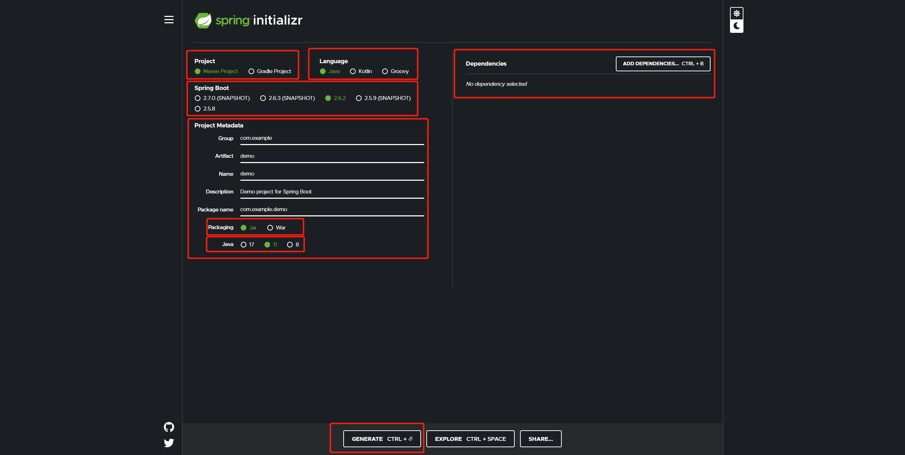

### 3.3.3.SpringBoot项目的初始依赖：pom.xml

```xml

<!-- 父依赖 -->
<parent>
    <groupId>org.springframework.boot</groupId>
    <artifactId>spring-boot-starter-parent</artifactId>
    <version>2.2.5.RELEASE</version>
    <relativePath/>
</parent>

<dependencies>
    <!-- web场景启动器 -->
    <dependency>
        <groupId>org.springframework.boot</groupId>
        <artifactId>spring-boot-starter-web</artifactId>
    </dependency>
    <!-- springboot单元测试 -->
    <dependency>
        <groupId>org.springframework.boot</groupId>
        <artifactId>spring-boot-starter-test</artifactId>
        <scope>test</scope>
        <!-- 剔除依赖 -->
        <exclusions>
            <exclusion>
                <groupId>org.junit.vintage</groupId>
                <artifactId>junit-vintage-engine</artifactId>
            </exclusion>
        </exclusions>
    </dependency>
</dependencies>

<build>
    <plugins>
        <!-- 打包插件 -->
        <plugin>
            <groupId>org.springframework.boot</groupId>
            <artifactId>spring-boot-maven-plugin</artifactId>
        </plugin>
    </plugins>
</build>
```

#### 3.3.3.1.Spring-boot-starter-parent

Springboot讲日常企业应用研发中的各种场景抽取出来，做成了一个个的starter（启动器），starter中整合了该场景下各种可能用到的依赖，用户只需要在maven中引入starter依赖，SpringBoot就能自动扫描要加载的信息并启动相应的默认配置。

starter中提供了大量的自动配置，让用户拜托了处理各种依赖和配置的困扰，因为starter会导入当前starter依赖的其他jar包，而不需要用户显式地去定义。

并不是所有的starter都是Springboot官方提供的，也有部分的starter是由第三方厂商提供。

## 3.4SpringBoot：自动装配

### 3.4.1.主启动类

```java
//@SpringBootApplication 来标注一个主程序类
//说明这是一个Spring Boot应用
@SpringBootApplication
public class SpringbootApplication {

   public static void main(String[] args) {
     //以为是启动了一个方法，没想到启动了一个服务
      SpringApplication.run(SpringbootApplication.class, args);
   }

}
```

==**@SpringBootApplication注解来表示当前为Springboot项目的主启动类，分析这个注解究竟做了什么？**==

### 3.4.2@SpringBootApplication

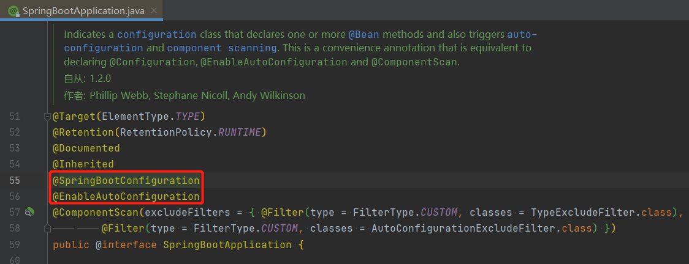

```java
@SpringBootConfiguration
@EnableAutoConfiguration
@ComponentScan(
    excludeFilters = {@Filter(
    type = FilterType.CUSTOM,
    classes = {TypeExcludeFilter.class}
), @Filter(
    type = FilterType.CUSTOM,
    classes = {AutoConfigurationExcludeFilter.class}
)}
)
public @interface SpringBootApplication {
    // ......
}
```

#### 3.4.2.1@ComponentScan

#### 3.4.2.2==@SpringBootConfiguration==

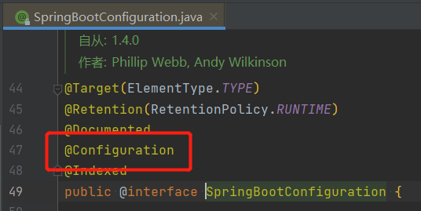

作用：SpringBoot的配置类，标注在某一个类上，表示这是一个Springboot的配置类

继续往下点这个注解。

```java
// 点进去得到下面的 @Component
@Configuration
public @interface SpringBootConfiguration {}
```

##### 3.4.2.2.1@Configuration

@Configuration：说明是一个配置类，配置类对应Spring的xml配置文件。

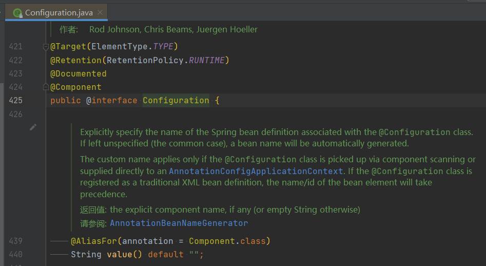

###### 3.4.2.2.1.1@Component

```java
@Component
public @interface Configuration {}
```

同时这里的@Component表名启动类本身也是Spring的一个组件，负责启动应用。

#### 3.4.2.3==@EnableAutoConfiguration==

@EnableAutoConfiguration：开启自动配置功能

以前我们需要自己配置的东西，而现在SpringBoot可以自动帮我们配置

@EnableAutoConfiguration告诉SpringBoot开启了自动配置功能，这样自动配置才能生效。

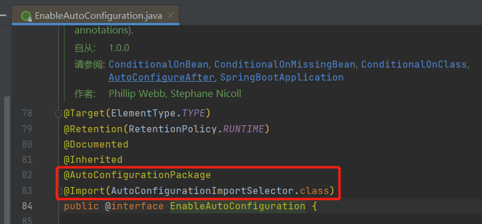

##### 3.4.2.3.1@AutoConfigurationPackage

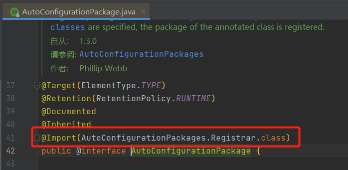

**@AutoConfigurationPackage：自动配置包**

@import：Spring的底层注解，给容器注入一个组件

Registrar.class作用：将主启动类的所在包及包下面所有自曝里面的所有组件扫描到Spring容器。

###### 3.4.2.3.1.1@import和@Registrar

##### 3.4.2.3.2@AutoConfigurationImportSelector


@AutoConfigurationImportSelector：自动配置导入选择器

###### 3.4.2.3.2.1方法：getCandidateConfigurations--->SpringFactoriesLoader

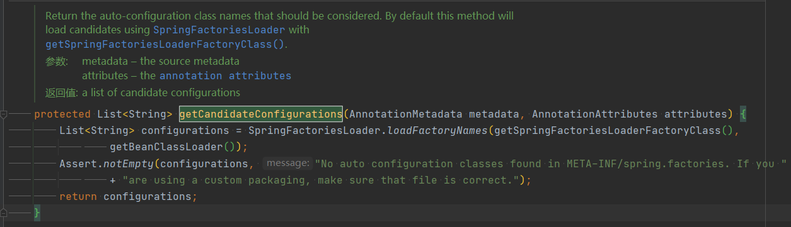

其中上述方法加载了一个SpringFactoriesLoader的静态方法

###### 3.4.2.3.2.2方法：SpringFactoriesLoader--->loadFactoriesNames

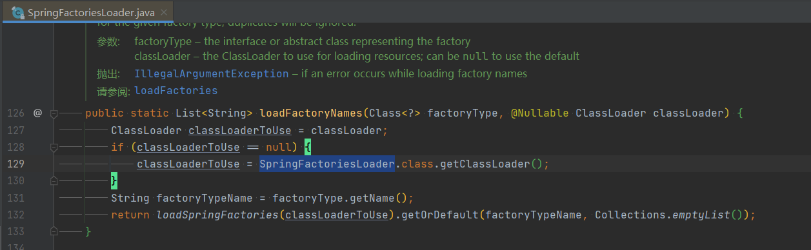

这个方法有点用了loadFactoriesNames方法

###### 3.4.2.3.2.3方法：loadFactoriesNames--->loadSpringFactories

loadFactoriesNames调用了loadSpringFactories

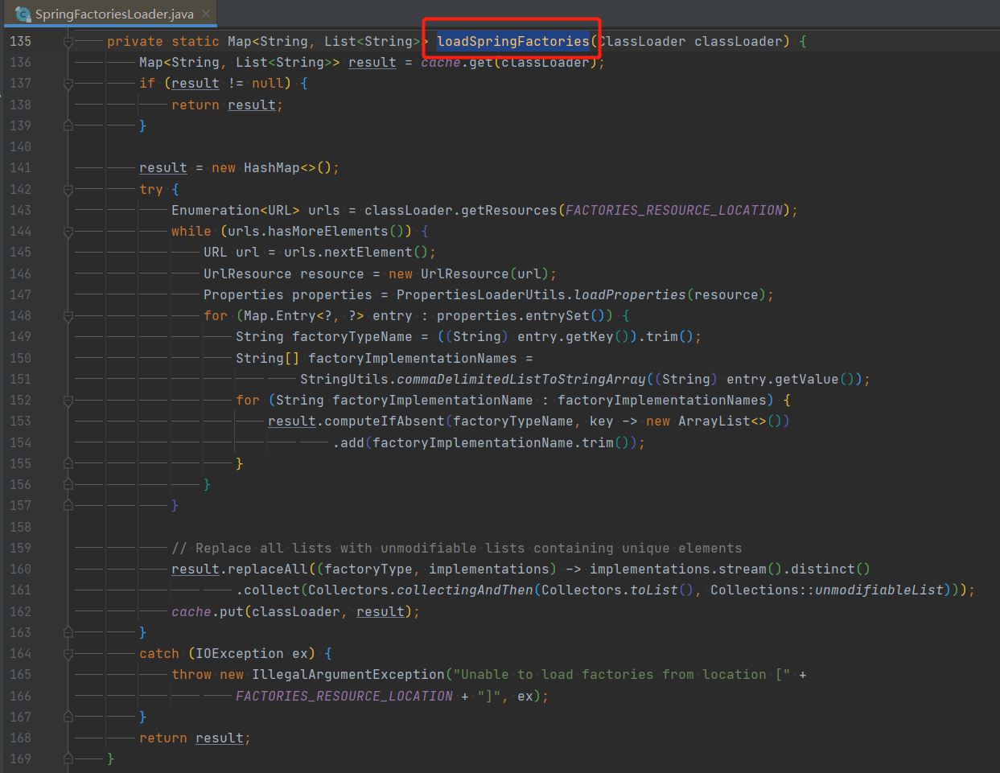

###### 3.4.2.3.2.4loadSpringFactories--->spring.factories

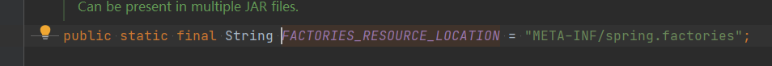

一个静态常量，跟随常量表示的路径去查看这个spring.factories文件

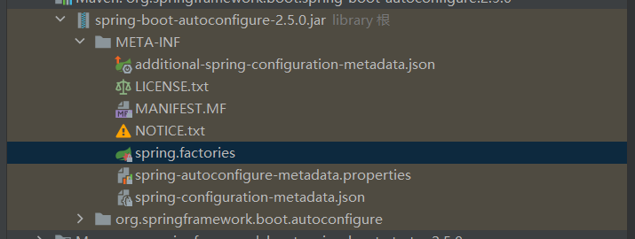

由于spring.factories文件过长，截取部分片段：如下图：可以看到一些资源文件

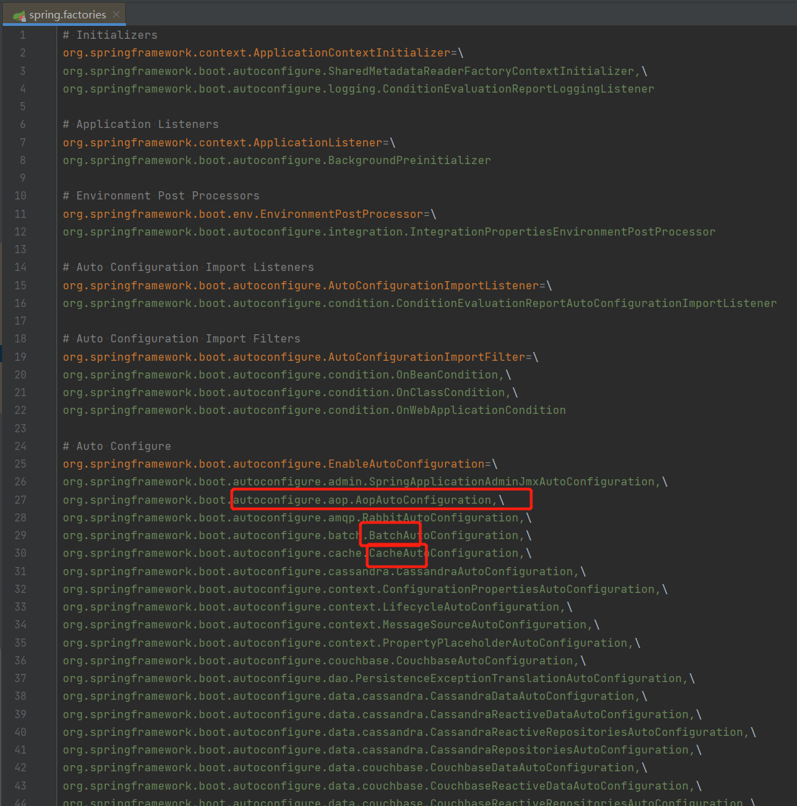

点开一个WebMVCAutoConfiguration：如下图

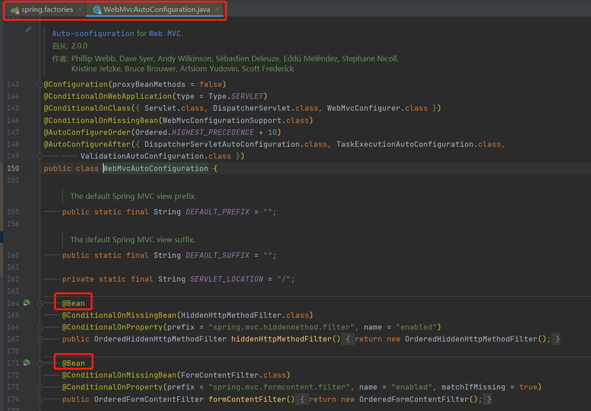

可以看到一个个都是javaConfig配置类，并且都注入了@Bean。

【浅谈javaConfig方式：[(14条消息) javaConfig简介_lolichan的博客-CSDN博客](https://blog.csdn.net/lolichan/article/details/84924322)】

org.springframework.boot.autoconfigure包下：截取片段：如下图：

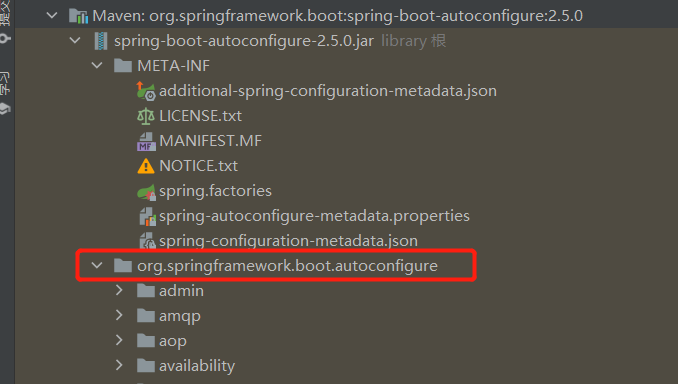

所以，所谓的自动配置就是从项目路径下去搜索所有的META-INF/spring.factories配置文件，将其中对应的org.springframework.boot.autoconfigure包下的配置项，通过反射实例化为对应表述了@Configuration的javaconfig形式的ioc容器配置类，然后将其实例化汇总到IOC容器中。

### 3.4.3.自动装配原理

分析HttpEncodingAutoConfiguration（Http编码自动配置）：

```java
//表示这是一个配置类，和以前mvc写的配文件一样，也可以给容器调价组件
@Configuration(proxyBeanMethods = false)

//启动指定类的ConfigurationProperties功能：
	//进入这个HttpProperties查看，将陪文件中的值和HttpProperties绑定起来
	//并把HttpProperties加入到IOC容器中
@EnableConfigurationProperties(ServerProperties.class)

//Spring容器@Conditional注解
	//根据不同的条件判断，如果满足指定的条件，整个配置类里面的配置就会生效
	//下面这里的判断就是判断当前应用是否是web应用，如果是，当前配置类则生效。
@ConditionalOnWebApplication(type = ConditionalOnWebApplication.Type.SERVLET)

//判断当前项目有没有这个类CharacterEncodingFilter：SpringMVC中进行乱码解决的过滤器
@ConditionalOnClass(CharacterEncodingFilter.class)

//判断配置文件中是否存在某个配置：spring.http.encoding.enable；
	//如果不存在，判断是成立的。
	//即使配置文件中不配是spring.http.http.encoding.enable = true；也是默认生效的。
@ConditionalOnProperty(prefix = "server.servlet.encoding", value = "enabled", matchIfMissing = true)
public class HttpEncodingAutoConfiguration {

	private final Encoding properties;

  
	public HttpEncodingAutoConfiguration(ServerProperties properties) {
		this.properties = properties.getServlet().getEncoding();
	}

  //给容器中添加一个组件，这个组件的某些值需要在Properties中获取
	@Bean
	@ConditionalOnMissingBean//判断容器中是否有这个组件
	public CharacterEncodingFilter characterEncodingFilter() {
		CharacterEncodingFilter filter = new OrderedCharacterEncodingFilter();
		filter.setEncoding(this.properties.getCharset().name());
		filter.setForceRequestEncoding(this.properties.shouldForce(Encoding.Type.REQUEST));
		filter.setForceResponseEncoding(this.properties.shouldForce(Encoding.Type.RESPONSE));
		return filter;
	}

	@Bean
	public LocaleCharsetMappingsCustomizer localeCharsetMappingsCustomizer() {
		return new LocaleCharsetMappingsCustomizer(this.properties);
	}

	static class LocaleCharsetMappingsCustomizer
			implements WebServerFactoryCustomizer<ConfigurableServletWebServerFactory>, Ordered {

		private final Encoding properties;

		LocaleCharsetMappingsCustomizer(Encoding properties) {
			this.properties = properties;
		}

		@Override
		public void customize(ConfigurableServletWebServerFactory factory) {
			if (this.properties.getMapping() != null) {
				factory.setLocaleCharsetMappings(this.properties.getMapping());
			}
		}

		@Override
		public int getOrder() {
			return 0;
		}

	}

}
```

总结：根据当前不同的条件判断，决定这个配置类是否有效

- 一旦配置类生效，这个配置类就会给容器中添加各种组件
- 这些组件的属性都是从对应的properties类中获取，类中的每一个属性又是和配置文件绑定的
- 所有配置文件中能配置的属性都是在xxxProperties类中封装
- 配置文件中能配置什么就可以参照某个功能对应这个属性类

#### 3.4.3.1@xxxAutoConfiguration

#### 3.4.3.2@xxxProperties

#### 3.4.3.3@Conditional

自动配置类必须在一定的条件下才能生效

@Conditional：必须是@Conditional指定的条件成立，才给容器中添加组件，配置中所有的内容才会生效。

所以，文件中包含了很多的自动配置类，但必须在特定的条件下才能生效，也就是不是所有的都会生效。

可以通过debug=true属性，来让控制台打印自动配置报告，就可以看哪些配置类剩下了。


## 3.5SpringBoot主启动类启动过程

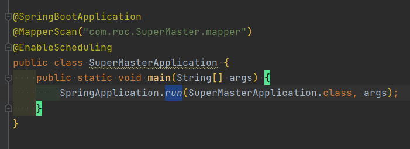

在SpringBoot的主启动类中，只有一个方法，SpringBootApplication.run()。

查看其构造器：如下图

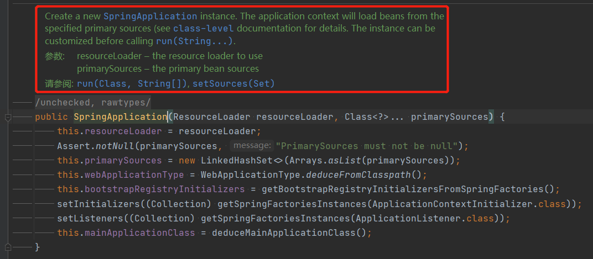

这个类则主要做了以下四件事：

1. 推断应用的类型是普通项目还是web项目
2. 查找并加载所有可用的初始化器，设置到initializers属性中
3. 找出所有的应用程序监听器，设置到listeners属实中
4. 推断并设置main方法的定义类，找到运行的主类

参考下图：

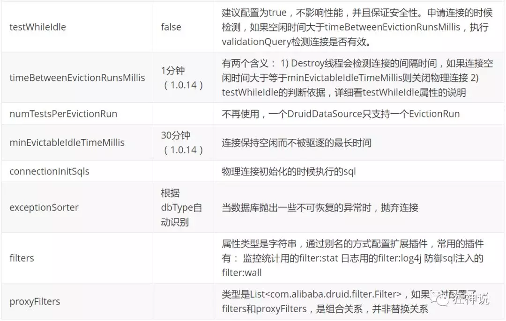

## 3.6SpringBoot配置文件

SpringBoot中使用全局的配置文件**application.properties**或者**application.yaml**

其中配置文件的作用：修改SpringBoot自动装配的默认值，因为SpringBoot在底层就装配好了。

### 3.6.1yaml

YAML：“YAML Ain't a Markup Language”（YAML不是一种标记语言），然而在开发过程中却仍然是一门标记语言。

Yaml配置文件也是SpringBoot推荐的格式。

#### 3.6.1.1YAML语法要求

1. 空格不得省略
2. 用缩进来控制层级关系，只要是左边对齐的一列数据都是同一个层级的
3. 属性和值的大小写都是敏感的。

#### 3.6.1.1YAML和数组

yaml表示数组（list，set）：用 -  值表示数组中的一个元素

```yaml
pets：
	- cat
	- dog
	- pig
```

#### 3.6.1.2yaml注入配置文件

以下均为实例，暂时未在项目中遇见：

1. 新建一个application.yaml

2. 导入依赖

   ```xml
   <!-- 导入配置文件处理器，配置文件进行绑定就会有提示，需要重启 -->
   <dependency>
     <groupId>org.springframework.boot</groupId>
     <artifactId>spring-boot-configuration-processor</artifactId>
     <optional>true</optional>
   </dependency>
   ```

3. 编写一个实体类Person

   ```java
   @Component //注册bean到容器中
   public class Person {
       private String name;
       private Integer age;
       private Boolean happy;
       private Date birth;
       private Map<String,Object> maps;
       private List<Object> lists;
       private Dog dog;
       
       //有参无参构造、get、set方法、toString()方法  
   }
   ```

4. 使用yaml的方式注入

   ```yaml
   person:
     name: Roc
     age: 3
     happy: false
     birth: 2000/01/01
     maps: {k1: v1,k2: v2}
     lists:
      - code
      - girl
      - music
     dog:
       name: 旺财
       age: 1
   ```

5. 修改类文件

   ```java
   /*
   @ConfigurationProperties作用：
   将配置文件中配置的每一个属性的值，映射到这个组件中；
   告诉SpringBoot将本类中的所有属性和配置文件中相关的配置进行绑定
   参数 prefix = “person” : 将配置文件中的person下面的所有属性一一对应
   */
   @Component //注册bean
   @ConfigurationProperties(prefix = "person")
   public class Person {
       private String name;
       private Integer age;
       private Boolean happy;
       private Date birth;
       private Map<String,Object> maps;
       private List<Object> lists;
       private Dog dog;
   }
   ```

6. 测试

题外话：配置文件占位符${}：编写占位符生成随机数

```yaml
person:
    name: qinjiang${random.uuid} # 随机uuid
    age: ${random.int}  # 随机int
    happy: false
    birth: 2000/01/01
    maps: {k1: v1,k2: v2}
    lists:
      - code
      - girl
      - music
    dog:
      name: ${person.hello:other}_旺财
      age: 1
```

### 3.6.2properties

【注：properties配置文件在写中文的时候就会乱码，需要在IDEA中设置全局文件编码格式为：UTF-8】

### 3.6.3总结：SPringBoot的配置文件


注意点：

1. yaml和properties都可以作为配置文件，官方推荐yaml
2. 配置了yaml或properties，javaBean都可以获取到值，但推荐yaml
3. @Value注解的使用
4. JavaBean和配置文件一一映射使用@configurationProperties

## 3.7JSR-303规范校验

JSR-303是Java EE 6中的一项子规范：叫做Bean validation

使用JSR-303校验：

1. 导入依赖

   ```xml
   <dependency>
       <groupId>org.springframework.boot</groupId>
       <artifactId>spring-boot-starter-validation</artifactId>
   </dependency>
   ```

2. 使用下列注解

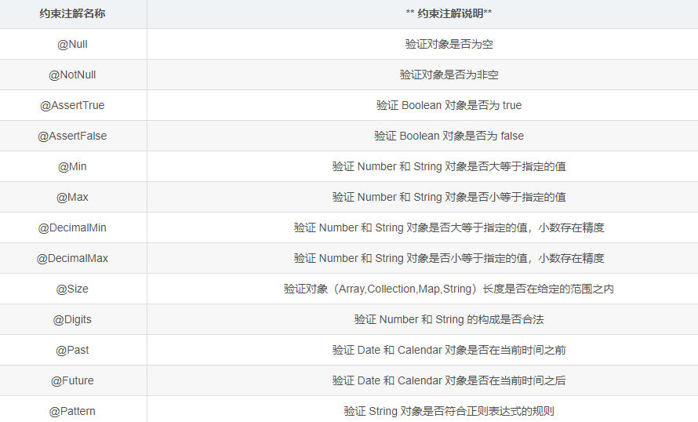

实例：

1. 编写Java Bean

   ```java
   @Component //注册bean
   @ConfigurationProperties(prefix = "person")
   @Validated  //数据校验
   public class Person {
   
       @Email(message="邮箱格式错误") //name必须是邮箱格式
       private String name;
   }
   ```

2. 测试

## 3.8多环境文件配置

### 3.8.1多环境文件

profile是Spring对不同环境提供不同配置功能的支持，可以通过激活不同环境的版本，实现快速切换环境。

其中dev、test、prod分别表示为开发环境，测试环境，生产环境。

application.yaml

application-dev.yaml

application-test.yaml

application-prod.yaml

定义需要生效的环境文件配置：

```yaml
#选择要激活那个环境块
spring:
  profiles:
    active: prod
```

### 3.8.2不同路径下环境文件生效顺序

其中Springboot会默认以下位置的application.properties或者application.yaml文件作为Springboot的默认配置文件：

```txt
优先级1：项目路径下的config文件夹配置文件
优先级2：项目路径下配置文件
优先级3：资源路径下的config文件夹配置文件
优先级4：资源路径下配置文件
```

并且优先级从高到低，高优先级会覆盖低优先级的配置。

### 3.8.3指定位置加载配置文件

项目打包好之后，可以使用命令行参数的形式，启动项目的时候来指定配置文件的新位置

```sh
java -jar spring-boot-config.jar --spring.config.location=F:/application.properties
```

## 3.9SpringBoot Banner配置

在Springboot项目下的resources目录下新建一个banner.txt的文件，便可以替换掉官方的banner

## 3.10模板引擎

**SpringBoot不支持JSP；**

SpringBoot推荐使用模板引擎；

常见的模板引擎：freemarker，Thymeleaf

本篇简要介绍Thymeleaf

### 3.10.1模板引擎的作用

模板引擎的作用就是写一个页面模板，动态获取一些值，可以允许写一些表达式，模板引擎会接收我们的数据，解析填充到指定的位置，并输出出去。

### 3.10.2Thymeleaf

#### 3.10.2.1引入依赖

```xml
<!--thymeleaf-->
<dependency>
    <groupId>org.springframework.boot</groupId>
    <artifactId>spring-boot-starter-thymeleaf</artifactId>
</dependency>
```

#### 3.10.2.2语法学习

```xml
Simple expressions:（表达式语法）
Variable Expressions: ${...}：获取变量值；OGNL；
    1）、获取对象的属性、调用方法
    2）、使用内置的基本对象：#18
         #ctx : the context object.
         #vars: the context variables.
         #locale : the context locale.
         #request : (only in Web Contexts) the HttpServletRequest object.
         #response : (only in Web Contexts) the HttpServletResponse object.
         #session : (only in Web Contexts) the HttpSession object.
         #servletContext : (only in Web Contexts) the ServletContext object.

    3）、内置的一些工具对象：
　　　　　　#execInfo : information about the template being processed.
　　　　　　#uris : methods for escaping parts of URLs/URIs
　　　　　　#conversions : methods for executing the configured conversion service (if any).
　　　　　　#dates : methods for java.util.Date objects: formatting, component extraction, etc.
　　　　　　#calendars : analogous to #dates , but for java.util.Calendar objects.
　　　　　　#numbers : methods for formatting numeric objects.
　　　　　　#strings : methods for String objects: contains, startsWith, prepending/appending, etc.
　　　　　　#objects : methods for objects in general.
　　　　　　#bools : methods for boolean evaluation.
　　　　　　#arrays : methods for arrays.
　　　　　　#lists : methods for lists.
　　　　　　#sets : methods for sets.
　　　　　　#maps : methods for maps.
　　　　　　#aggregates : methods for creating aggregates on arrays or collections.
==================================================================================

  Selection Variable Expressions: *{...}：选择表达式：和${}在功能上是一样；
  Message Expressions: #{...}：获取国际化内容
  Link URL Expressions: @{...}：定义URL；
  Fragment Expressions: ~{...}：片段引用表达式

Literals（字面量）
      Text literals: 'one text' , 'Another one!' ,…
      Number literals: 0 , 34 , 3.0 , 12.3 ,…
      Boolean literals: true , false
      Null literal: null
      Literal tokens: one , sometext , main ,…
      
Text operations:（文本操作）
    String concatenation: +
    Literal substitutions: |The name is ${name}|
    
Arithmetic operations:（数学运算）
    Binary operators: + , - , * , / , %
    Minus sign (unary operator): -
    
Boolean operations:（布尔运算）
    Binary operators: and , or
    Boolean negation (unary operator): ! , not
    
Comparisons and equality:（比较运算）
    Comparators: > , < , >= , <= ( gt , lt , ge , le )
    Equality operators: == , != ( eq , ne )
    
Conditional operators:条件运算（三元运算符）
    If-then: (if) ? (then)
    If-then-else: (if) ? (then) : (else)
    Default: (value) ?: (defaultvalue)
    
Special tokens:
    No-Operation: _
```

## 3.11SpringBoot整合MVC

SpringBoot对SpringMVC做了哪些扩展，如何定制？

### 3.11.1.官方文档解读

```xml
Spring MVC Auto-configuration
// Spring Boot为Spring MVC提供了自动配置，它可以很好地与大多数应用程序一起工作。
Spring Boot provides auto-configuration for Spring MVC that works well with most applications.
// 自动配置在Spring默认设置的基础上添加了以下功能：
The auto-configuration adds the following features on top of Spring’s defaults:
// 包含视图解析器
Inclusion of ContentNegotiatingViewResolver and BeanNameViewResolver beans.
// 支持静态资源文件夹的路径，以及webjars
Support for serving static resources, including support for WebJars 
// 自动注册了Converter：
// 转换器，这就是我们网页提交数据到后台自动封装成为对象的东西，比如把"1"字符串自动转换为int类型
// Formatter：【格式化器，比如页面给我们了一个2019-8-10，它会给我们自动格式化为Date对象】
Automatic registration of Converter, GenericConverter, and Formatter beans.
// HttpMessageConverters
// SpringMVC用来转换Http请求和响应的的，比如我们要把一个User对象转换为JSON字符串，可以去看官网文档解释；
Support for HttpMessageConverters (covered later in this document).
// 定义错误代码生成规则的
Automatic registration of MessageCodesResolver (covered later in this document).
// 首页定制
Static index.html support.
// 图标定制
Custom Favicon support (covered later in this document).
// 初始化数据绑定器：帮我们把请求数据绑定到JavaBean中！
Automatic use of a ConfigurableWebBindingInitializer bean (covered later in this document).

/*
如果您希望保留Spring Boot MVC功能，并且希望添加其他MVC配置（拦截器、格式化程序、视图控制器和其他功能），则可以添加自己
的@configuration类，类型为webmvcconfiguer，但不添加@EnableWebMvc。如果希望提供
RequestMappingHandlerMapping、RequestMappingHandlerAdapter或ExceptionHandlerExceptionResolver的自定义
实例，则可以声明WebMVCregistrationAdapter实例来提供此类组件。
*/
If you want to keep Spring Boot MVC features and you want to add additional MVC configuration 
(interceptors, formatters, view controllers, and other features), you can add your own 
@Configuration class of type WebMvcConfigurer but without @EnableWebMvc. If you wish to provide 
custom instances of RequestMappingHandlerMapping, RequestMappingHandlerAdapter, or 
ExceptionHandlerExceptionResolver, you can declare a WebMvcRegistrationsAdapter instance to provide such components.

// 如果您想完全控制Spring MVC，可以添加自己的@Configuration，并用@EnableWebMvc进行注释。
If you want to take complete control of Spring MVC, you can add your own @Configuration annotated with @EnableWebMvc.
```

### 3.11.2.ContentNegotiatingViewResolver:内容协商视图解析器

SpringBoot自动配置了ViewResolver，就是之前SpringMVC部分的视图解析器：即得到的返回值获得视图对象，然后由视图对象决定如何渲染。

同样可以自定义自己的视图解析器，去改变DispatcherServlet的调用的路径，调用自己的视图解析器。

SpringBoot在自动配置很多组件的时候，先看容器有没有用户自己配置的，如果有用户自己配置的@Bean，就会用用户自己配置，否则就会使用自动配置的。

### 3.11.3开发者全面接管SpringMVC

## 3.12.国际化

我们的网站常常会涉及中英文甚至更多语言的切换，因此则需要适配国际化

### 3.12.1实现国际化

#### 3.12.1.1.国际化配置文件编写

在resources资源文件夹下新建一个i18n目录，里面存放国际化配置文件

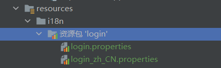

#### 3.12.1.2.抽取页面需要国际化改造的内容

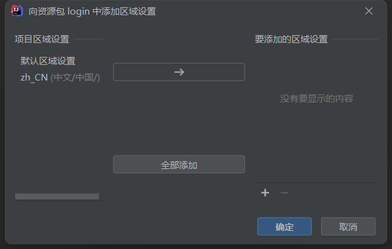

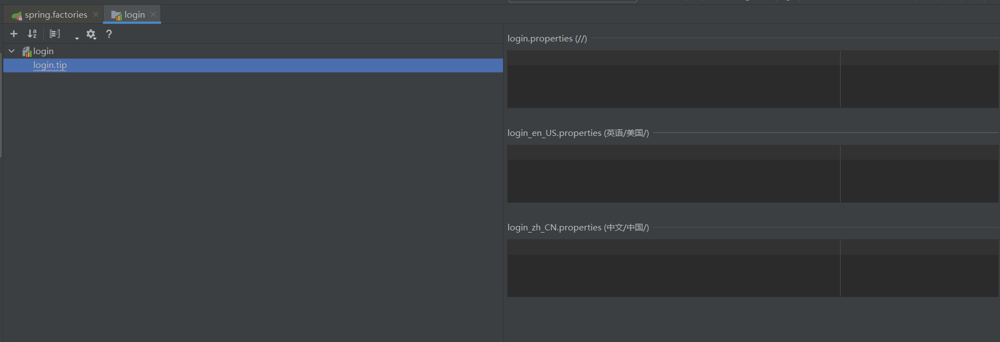

#### 3.12.1.3SpringBoot开启i18n的配置

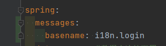

### 3.12.2.自动解析国际化需求

根据前端传来的请求，获取HTTP中的国际化标识符，来判断采用何种国际化配置

### 3.12.3.imam项目与国际化

## 3.13.拦截器

拦截器在SpringMVC中概述过，同样SpringBoot也提供了拦截器功能，只要是实现了拦截器接口的都可以被称为拦截器。

主要应用于登录校验、权限验证、乱码解决、性能监控和异常处理。

### 3.13.1整合拦截器

1. 定义拦截器
2. 注册拦截器
3. 指定拦截器规则

## 3.14.SpringBoot整合JDBC

看清楚一点，对于任何框架的数据访问层，无论是何种数据源，最后的落脚点都是JDBC

SpringBoot采用了Spring Data的方式

### 3.14.1整合JDBC

1. 导入启动starter

   ```xml
   <dependency>
       <groupId>org.springframework.boot</groupId>
       <artifactId>spring-boot-starter-jdbc</artifactId>
   </dependency>
   <dependency>
       <groupId>mysql</groupId>
       <artifactId>mysql-connector-java</artifactId>
       <scope>runtime</scope>
   </dependency>
   ```

2. 编写yaml配置文件连接数据库

   ```yaml
   spring:
     datasource:
       username: root
       password: 123456
       #?serverTimezone=UTC解决时区的报错
       url: jdbc:mysql://localhost:3306/springboot?serverTimezone=UTC&useUnicode=true&characterEncoding=utf-8
       driver-class-name: com.mysql.cj.jdbc.Driver
   ```

3. 测试

   ```java
   public void contextLoads() throws SQLException {
     //看一下默认数据源
     System.out.println(dataSource.getClass());
     //获得连接
     Connection connection =   dataSource.getConnection();
     System.out.println(connection);
     //关闭连接
     connection.close();
   }
   ```

### 3.14.2JdbcTemplate

JdbcTemplate主要提供了以下几种方法：

1. execute方法：执行任何的SQL语句
2. update方法及batchUpdate方法：update方法用于执行新增、修改、删除等语句；batchUpdate方法用于执行批处理相关语句
3. query方法：查询
4. call方法：用于执行存储过程、函数等相关语句

## 3.15.SpringBoot整合Druid数据源

浅析为啥需要整合数据源：java程序很大部分都要操作数据库，为了提高性能操作，不得不使用数据库连接池。

数据库连接池种类很多，Druid、C3P0、DBCP等等。

本处仅概述Druid；

Druid是阿里巴巴开源平台一个数据库连接池的实现，结合了C3P0等数据库连接池的优点，同时添加了日志监控。

Druid可以很好地监控DB连接池和SQL的执行情况，天生就是针对监控而生的DB连接池。

### 3.15.1Druid基本配置参数


### 3.15.2.整合Druid

1. 导入依赖（Druid+Log4j）

   ```xml
   <!-- https://mvnrepository.com/artifact/com.alibaba/druid -->
   <dependency>
       <groupId>com.alibaba</groupId>
       <artifactId>druid</artifactId>
       <version>1.1.21</version>
   </dependency>
   
   
   <!-- https://mvnrepository.com/artifact/log4j/log4j -->
   <dependency>
       <groupId>log4j</groupId>
       <artifactId>log4j</artifactId>
       <version>1.2.17</version>
   </dependency>
   ```

2. 切换数据源配置及配置其他属性

   ```yaml
   spring:
     datasource:
       username: root
       password: 123456
       #?serverTimezone=UTC解决时区的报错
       url: jdbc:mysql://localhost:3306/springboot?serverTimezone=UTC&useUnicode=true&characterEncoding=utf-8
       driver-class-name: com.mysql.cj.jdbc.Driver
       type: com.alibaba.druid.pool.DruidDataSource
   
       #Spring Boot 默认是不注入这些属性值的，需要自己绑定
       #druid 数据源专有配置
       initialSize: 5
       minIdle: 5
       maxActive: 20
       maxWait: 60000
       timeBetweenEvictionRunsMillis: 60000
       minEvictableIdleTimeMillis: 300000
       validationQuery: SELECT 1 FROM DUAL
       testWhileIdle: true
       testOnBorrow: false
       testOnReturn: false
       poolPreparedStatements: true
   
       #配置监控统计拦截的filters，stat:监控统计、log4j：日志记录、wall：防御sql注入
       #如果允许时报错  java.lang.ClassNotFoundException: org.apache.log4j.Priority
       #则导入 log4j 依赖即可，Maven 地址：https://mvnrepository.com/artifact/log4j/log4j
       filters: stat,wall,log4j
       maxPoolPreparedStatementPerConnectionSize: 20
       useGlobalDataSourceStat: true
       connectionProperties: druid.stat.mergeSql=true;druid.stat.slowSqlMillis=500
   ```

3. 配置Druid数据源后台监控

   ```java
   //配置 Druid 监控管理后台的Servlet；
   //内置 Servlet 容器时没有web.xml文件，所以使用 Spring Boot 的注册 Servlet 方式
   @Bean
   public ServletRegistrationBean statViewServlet() {
       ServletRegistrationBean bean = new ServletRegistrationBean(new StatViewServlet(), "/druid/*");
   
       // 这些参数可以在 com.alibaba.druid.support.http.StatViewServlet 
       // 的父类 com.alibaba.druid.support.http.ResourceServlet 中找到
       Map<String, String> initParams = new HashMap<>();
       initParams.put("loginUsername", "admin"); //后台管理界面的登录账号
       initParams.put("loginPassword", "123456"); //后台管理界面的登录密码
   
       //后台允许谁可以访问
       //initParams.put("allow", "localhost")：表示只有本机可以访问
       //initParams.put("allow", "")：为空或者为null时，表示允许所有访问
       initParams.put("allow", "");
       //deny：Druid 后台拒绝谁访问
       //initParams.put("kuangshen", "192.168.1.20");表示禁止此ip访问
   
       //设置初始化参数
       bean.setInitParameters(initParams);
       return bean;
   }
   ```

## 3.16.SpringBoot整合Mybatis/Mybatis-plus

### 3.16.1整合Mybatis

1. 导入依赖

   ```xml
   <dependency>
       <groupId>org.mybatis.spring.boot</groupId>
       <artifactId>mybatis-spring-boot-starter</artifactId>
       <version>2.1.1</version>
   </dependency>
   ```

2. 配置数据源(配合数据库连接池)

   ```yaml
   spring:
     datasource:
       username: root
       password: 123456
       #?serverTimezone=UTC解决时区的报错
       url: jdbc:mysql://localhost:3306/springboot?serverTimezone=UTC&useUnicode=true&characterEncoding=utf-8
       driver-class-name: com.mysql.cj.jdbc.Driver
       type: com.alibaba.druid.pool.DruidDataSource
   
       #Spring Boot 默认是不注入这些属性值的，需要自己绑定
       #druid 数据源专有配置
       initialSize: 5
       minIdle: 5
       maxActive: 20
       maxWait: 60000
       timeBetweenEvictionRunsMillis: 60000
       minEvictableIdleTimeMillis: 300000
       validationQuery: SELECT 1 FROM DUAL
       testWhileIdle: true
       testOnBorrow: false
       testOnReturn: false
       poolPreparedStatements: true
   
       #配置监控统计拦截的filters，stat:监控统计、log4j：日志记录、wall：防御sql注入
       #如果允许时报错  java.lang.ClassNotFoundException: org.apache.log4j.Priority
       #则导入 log4j 依赖即可，Maven 地址：https://mvnrepository.com/artifact/log4j/log4j
       filters: stat,wall,log4j
       maxPoolPreparedStatementPerConnectionSize: 20
       useGlobalDataSourceStat: true
       connectionProperties: druid.stat.mergeSql=true;druid.stat.slowSqlMillis=500
   ```

3. 测试

### 3.16.2整合Mybatis-plus

## 3.17.SpringSecurity

Spring Security是一个功能强大且高度可定制的身份验证和访问控制框架。

Spring Security是一个框架，侧重于为Java应用提供身份验证和授权。


思考：权限一般对应于功能权限、访问权限和菜单权限。


Spring是一个非常流行和成功的java 应用开发框架，Spring Security基于Spring框架，提供了一套Web应用安全性的完整解决方案。一般地说，Web应用的安全性包括用户认证（Authentication）和用户授权（Authorization）两个部分。

用户认证（Authenication）指的是验证某个用户是否为系统中的合法主体，也就是说用户能否访问该系统。用户认证一般要求用户提供用户名和密码。系统通过校验用户名和密码来完成认证操作。

用户授权（Authorization）指的是验证某个用户是否有权限执行某个操作。在一个系统中，不同的用户所具有的权限是不同的。比如对一个文件有的用户只能读取，而有的用户可以进行修改。一般说系统会为不同用户划分不同的角色，每一个角色对应一系列的权限。


对于上述两种情景，Spring Security框架都有很好的支持，在用户认证方面，Spring Security框架支持主流的认证方式，包括HTTP基本认证、HTTP表单认证、HTTP摘要认证、OPENID和LDAP等。在用户授权方面，Spring Security提供了基于角色的访问控制和访问控制列表，可以对应用中的领域对象进行细粒度的控制。

Spring Security是针对Spring项目的安全框架，也是Spring Boot底层安全模块默认的技术选型，他可以实现强大的Web安全控制。目标就是，引入安全模块，少量配置，即可实现强大的安全管理。

Spring Security的两个主要目标就是：“认证（Authenication）”和“授权（Authorization）”。

本篇概述Spring Security，暂未进行详细的代码测试，其中各家企业的综合安全解决方案各不相同，未来会抽取出来做详细描述。

### 3.17.1整合Spring Security

1. 引入Spring Security

   ```xml
   <dependency>
      <groupId>org.springframework.boot</groupId>
      <artifactId>spring-boot-starter-security</artifactId>
   </dependency>
   ```

2. 编写Spring Security配置类

   ```java
   @EnableWebSecurity // 开启WebSecurity模式
   public class SecurityConfig extends WebSecurityConfigurerAdapter {
   
      @Override
      protected void configure(HttpSecurity http) throws Exception {
   	 // 定制请求的授权规则
      // 首页所有人可以访问
      http.authorizeRequests().antMatchers("/").permitAll()
     .antMatchers("/level1/**").hasRole("vip1")
     .antMatchers("/level2/**").hasRole("vip2")
     .antMatchers("/level3/**").hasRole("vip3");
     }
   }
   ```

3. Spring Security配置类开启登录功能

   ```java
   // 开启自动配置的登录功能
   // /login 请求来到登录页
   // /login?error 重定向到这里表示登录失败
   http.formLogin();
   ```

4. Spring Security配置类开启注销功能

   ```java
   //....
   //开启自动配置的注销的功能
   // /logout 注销请求
   http.logout();
   ```

5. Spring Security开启“记住我”

   ```java
   //记住我
   http.rememberMe();
   ```

6. 测试

7. 完整的Spring Security配置类代码

   ```java
   import org.springframework.security.config.annotation.authentication.builders.AuthenticationManagerBuilder;
   import org.springframework.security.config.annotation.web.builders.HttpSecurity;
   import org.springframework.security.config.annotation.web.configuration.EnableWebSecurity;
   import org.springframework.security.config.annotation.web.configuration.WebSecurityConfigurerAdapter;
   import org.springframework.security.crypto.bcrypt.BCryptPasswordEncoder;
   
   @EnableWebSecurity
   public class SecurityConfig extends WebSecurityConfigurerAdapter {
   
      //定制请求的授权规则
      @Override
      protected void configure(HttpSecurity http) throws Exception {
   
          http.authorizeRequests().antMatchers("/").permitAll()
         .antMatchers("/level1/**").hasRole("vip1")
         .antMatchers("/level2/**").hasRole("vip2")
         .antMatchers("/level3/**").hasRole("vip3");
   
   
          //开启自动配置的登录功能：如果没有权限，就会跳转到登录页面！
              // /login 请求来到登录页
              // /login?error 重定向到这里表示登录失败
          http.formLogin()
             .usernameParameter("username")
             .passwordParameter("password")
             .loginPage("/toLogin")
             .loginProcessingUrl("/login"); // 登陆表单提交请求
   
          //开启自动配置的注销的功能
              // /logout 注销请求
              // .logoutSuccessUrl("/"); 注销成功来到首页
   
          http.csrf().disable();//关闭csrf功能:跨站请求伪造,默认只能通过post方式提交logout请求
          http.logout().logoutSuccessUrl("/");
   
          //记住我
          http.rememberMe().rememberMeParameter("remember");
     }
   
      //定义认证规则
      @Override
      protected void configure(AuthenticationManagerBuilder auth) throws Exception {
          //在内存中定义，也可以在jdbc中去拿....
          //Spring security 5.0中新增了多种加密方式，也改变了密码的格式。
          //要想我们的项目还能够正常登陆，需要修改一下configure中的代码。我们要将前端传过来的密码进行某种方式加密
          //spring security 官方推荐的是使用bcrypt加密方式。
   
          auth.inMemoryAuthentication().passwordEncoder(new BCryptPasswordEncoder())
                 .withUser("kuangshen").password(new BCryptPasswordEncoder().encode("123456")).roles("vip2","vip3")
                 .and()
                 .withUser("root").password(new BCryptPasswordEncoder().encode("123456")).roles("vip1","vip2","vip3")
                 .and()
                 .withUser("guest").password(new BCryptPasswordEncoder().encode("123456")).roles("vip1","vip2");
     }
   }
   ```

## 3.17.2企业认证方案

## 3.18.SpringBoot与Shrio

Apache Shrio是一个java安全框架，相对于Spring Security相对比较简单，从功能上没有SpringSecurity强大。

图为Shrio官网：[Apache Shiro | Simple. Java. Security.](https://shiro.apache.org/)

描述为：一个简单的安全框架，介绍上还说了十分钟起步翱翔~

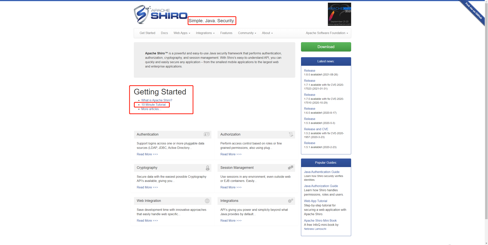

### 3.18.1Shrio功能框架图

下图为Shrio的功能框架图：

* 认证：Authenication：身份认证/登录，验证用户是不是有相应的登录身份
* 授权：Authorization：授权，权限认证，验证某个认证的用户是不是有某个权限
* session管理：Session Management：会话管理
* 缓存：Caching：缓存
* 记住我：remember me：记住我，下次登录时不用登录操作
* 加密：Cryptography：加密保护数据的安全性
* Web支持：Web Support：web支持，可以很容易集成到Web环境中
* 并发：Concurrent：Shrio支持多线程应用并发验证
* 测试：Testing：测试支持
* Run AS：允许用户伪装成另外一个用户进行访问


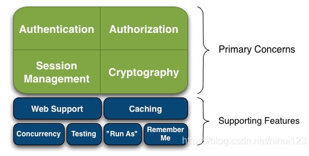

### 3.18.2Shrio工作流


从上图可以看出，与应用程序代码直接交互的是Subject对象，也就是说Shrio对外的API核心的内容是Subject

1. Subject：主体，代表当前用户，这里的用户不一定指的是具体的人，与当前应用交互的任何的东西都是Subject，这是一个抽象的概念，所有的Subject都绑定在一个SecurityManager，与Subject交互都要委托到SecurityManager，所以真正的执行者是SecurityManager。
2. SecurityManager：安全管理器，SecurityManager操作所有的安全操作，管理所有的Subject，并负责和后面的其他组件交互
3. Realm域：Shrio从Realm中获取安全数据，例如用户、角色和权限等，可以把RealM看成DataSource。

### 3.18.3Shrio内部架构

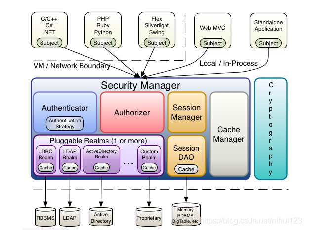

[(14条消息) Shiro系列_初学者-CSDN博客](https://blog.csdn.net/nihui123/category_9460158.html)

该大佬讲的相当精彩。

## 3.19.SpringBoot与Swagger

Swagger：

- 号称世界上最流行的API框架
- RestFul Api文档在线自动生成器
- 直接运行，在线测试Api
- 支持多种语言
- 支持配合认证框架一同使用

### 3.19.1整合Swagger

详情请见RD_Swagger.md文件

## 3.20.异步任务

场景还原：一些花费时间较长的加载过程，例如邮件发送，请求发送之后需要等后台处理发送邮件结束，响应才会成功，这样会造成前台响应不动，极低地用户体验。因此考虑异步去完成该类型的任务。

### 3.20.1自己实现异步效果：线程睡眠

```java
@Service
public class AsyncService {

   public void hello(){
       try {
           Thread.sleep(3000);
      } catch (InterruptedException e) {
           e.printStackTrace();
      }
       System.out.println("业务进行中....");
  }
}
```

### 3.20.2伟大的Async

**目标方法上添加@Async注解，主启动类上添加@EnableAsync注解**

便可以实现请求通了之后，页面瞬间响应，后台代码按部就班地执行。

## 3.21.邮件任务

spring-boot-starter-mail：Spring Boot支持邮件发送。

### 3.21.1整合邮件发送

1. 导入依赖

   ```xml
   <dependency>
      <groupId>org.springframework.boot</groupId>
      <artifactId>spring-boot-starter-mail</artifactId>
   </dependency>
   ```

2. 配置邮箱信息

   ```yaml
   spring.mail.username=134447155@qq.com
   spring.mail.password=你的qq授权码
   spring.mail.host=smtp.qq.com
   # qq需要配置ssl
   spring.mail.properties.mail.smtp.ssl.enable=true
   ```

3. 发送简单的邮件

4. 发送复杂的邮件

## 3.22.定时任务

### 3.22.1Spring：异步执行任务调度接口

Spring提供了两个接口：

- TaskExecutor接口
- TaskScheduler接口

两个注解：

- @EnableScheduling
- @Scheduled

### 3.22.2定时任务框架（包含歪门邪道）

详情参见：SuperMaster项目中关于定时任务的描述

### 3.22.3Cron表达式

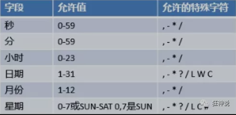

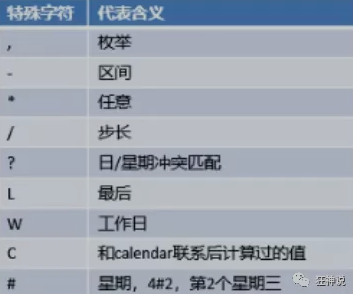

#### 3.22.3.1常用表达式

```txt
（1）0/2 * * * * ?   表示每2秒 执行任务
（1）0 0/2 * * * ?   表示每2分钟 执行任务
（1）0 0 2 1 * ?   表示在每月的1日的凌晨2点调整任务
（2）0 15 10 ? * MON-FRI   表示周一到周五每天上午10:15执行作业
（3）0 15 10 ? 6L 2002-2006   表示2002-2006年的每个月的最后一个星期五上午10:15执行作
（4）0 0 10,14,16 * * ?   每天上午10点，下午2点，4点
（5）0 0/30 9-17 * * ?   朝九晚五工作时间内每半小时
（6）0 0 12 ? * WED   表示每个星期三中午12点
（7）0 0 12 * * ?   每天中午12点触发
（8）0 15 10 ? * *   每天上午10:15触发
（9）0 15 10 * * ?     每天上午10:15触发
（10）0 15 10 * * ?   每天上午10:15触发
（11）0 15 10 * * ? 2005   2005年的每天上午10:15触发
（12）0 * 14 * * ?     在每天下午2点到下午2:59期间的每1分钟触发
（13）0 0/5 14 * * ?   在每天下午2点到下午2:55期间的每5分钟触发
（14）0 0/5 14,18 * * ?     在每天下午2点到2:55期间和下午6点到6:55期间的每5分钟触发
（15）0 0-5 14 * * ?   在每天下午2点到下午2:05期间的每1分钟触发
（16）0 10,44 14 ? 3 WED   每年三月的星期三的下午2:10和2:44触发
（17）0 15 10 ? * MON-FRI   周一至周五的上午10:15触发
（18）0 15 10 15 * ?   每月15日上午10:15触发
（19）0 15 10 L * ?   每月最后一日的上午10:15触发
（20）0 15 10 ? * 6L   每月的最后一个星期五上午10:15触发
（21）0 15 10 ? * 6L 2002-2005   2002年至2005年的每月的最后一个星期五上午10:15触发
（22）0 15 10 ? * 6#3   每月的第三个星期五上午10:15触发
```

## 3.23.SpringBoot与事务

## 3.24.SpringBoot与RestTemplate

## 3.25.SpringBoot与Redis

## 3.26.初探分布式

### 3.26.1什么是分布式系统

分布式系统是建立在网络上的软件系统。

分布式系统是由一组通过网络进行通信、为了完成共通的任务而协调工作的计算机节点组成的系统。

## 3.27.RPC

### 3.27.1什么是RPC？

RPC：remote procedure call：远程过程调用，是一种进程间的通信方式，是一种技术思想，不是技术规范。它允许调用另一个地址空间的过程或者函数，而不用程序员显式地编码这个远程调用的细节，即程序员就像调用本地方法一样调用远程方法。

详细的RPC介绍：[如何给老婆解释什么是RPC - 简书 (jianshu.com)](https://www.jianshu.com/p/2accc2840a1b)

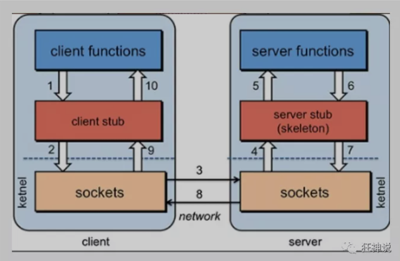

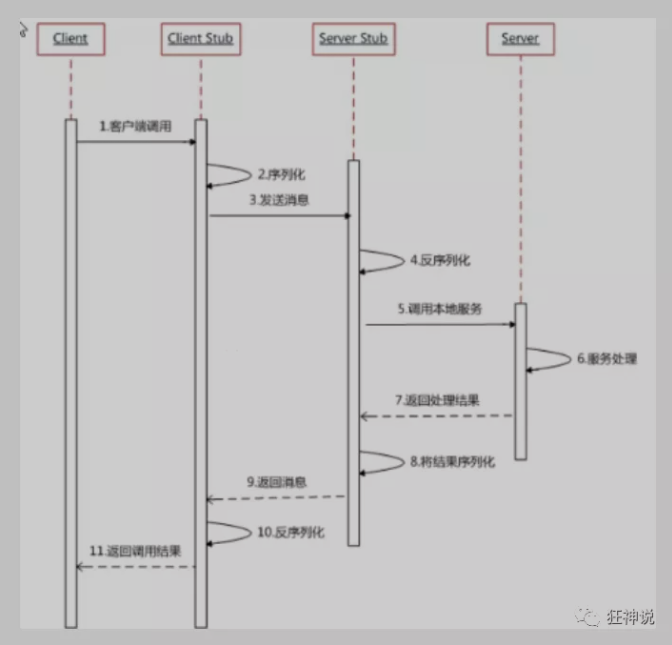

### 3.27.2RPC与RestFul

### 3.27.3RPC与RMI

## 3.28.Dubbo


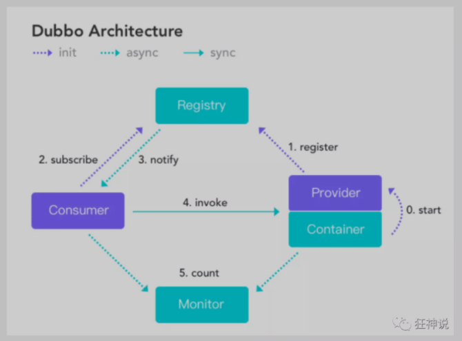

### 3.28.1Dubbo概念

#### 3.28.1.1服务提供者

暴露服务的服务提供方，服务提供者在启动的时候向用户中心注册自己提供的服务。

#### 3.28.1.2服务消费者

调用远程服务的服务消费方，向注册中心订阅自己所需的服务，服务消费者从提供者地址列表中，基于负载均衡算法，挑选一台提供者供自己调用。

#### 3.28.1.3注册中心

注册中心返回服务提供者地址列表提供给消费者，如果有变更，注册中心将长连接推送变更数据给消费者。

#### 3.28.1.4监控中心

服务消费者和提供者，在内存中累计调用次数和调用时间，定时每分钟发送一次统计数据到监控中心。

### 3.28.2Dubbo环境搭建

### 3.28.3整合Dubbo和Zookeeper

1. 启动Zookeeper
2. 构建一个新项目
3. 实现服务提供者
4. 实现服务消费者

## 3.29.Zookeeper服务注册与发现

### 3.29.1Zookeeper概念

### 3.29.2Zookeeper环境搭建

# 4.SpringCloud

注：

- 官方网站：https://spring.io/projects/spring-cloud

- 中文学习网站：https://www.springcloud.cc/

- 快速开始：https://www.springcloud.cc/spring-cloud-config.html#_quick_start

- 截止2021.01.11，SpringCloud更新到2020.0.0

- 截止2022.01.10，SpringCloud更到到2021.0.0

  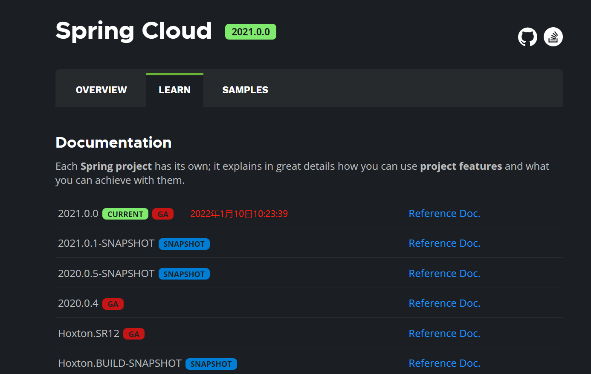

## 4.1.什么是SpringCloud？

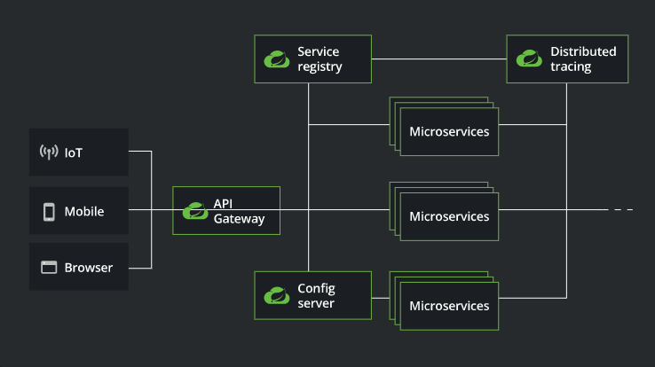

```xml
	Spring Cloud为开发人员提供了快速构建分布式系统中的一些常见模式的工具(例如配置管理、服务注册与发现、断路器、智能路由、微代理、控制总线、一次性令牌、全局锁、领导人选举、分布式会话、集群状态)。分布式系统的协调导致了锅炉板模式，而使用Spring Cloud开发人员可以快速建立实现这些模式的服务和应用程序。它们在任何分布式环境中都能很好地工作，包括开发人员自己的笔记本电脑、裸金属数据中心和云计算等托管平台。
```

## 4.2.为什么用SpringCloud？

### 4.2.1.SpringCloud和SpringBoot的关系

```xml
1. SpringBoot专注于开发方便的开发单个个体微服务；SpringCloud是关注全局的微服务协调整理治理框架，它将SpringBoot开发的一个个单体微服务，整合并管理起来，为各个微服务之间提供：配置管理、服务发现、断路器、路由、为代理、事件总栈、全局锁、决策竞选、分布式会话等等集成服务；
2. SpringBoot可以离开SpringCloud独立使用，开发项目，但SpringCloud离不开SpringBoot，属于依赖关系
```


**Spring Boot与Spring Cloud**

- Spring Boot 是 Spring 的一套快速配置脚手架，可以基于Spring Boot 快速开发单个微服务;
- Spring Cloud是基于Spring Boot实现的；
- Spring Boot专注于快速、方便集成的单个微服务个体，Spring Cloud关注全局的服务治理框架；
- Spring Boot使用了约束优于配置的理念，很多集成方案已经帮你选择好了，能不配置就不配置 , Spring Cloud很大的一部分是基于Spring Boot来实现，Spring Boot可以离开Spring Cloud独立使用开发项目，但是Spring Cloud离不开Spring Boot，属于依赖的关系。
- SpringBoot在SpringClound中起到了承上启下的作用，如果你要学习SpringCloud必须要学习SpringBoot。

### 4.2.2.什么是微服务？

```xml
微服务是指具体解决某一个问题/提供落地对应服务的一个服务应用，狭义的看，可以看作是IDEA中的一个个微服务工程，或者Moudel。
```

### 4.2.3.微服务与微服务架构

```xml
通常而言，微服务架构是一种架构模式，或者说是一种架构风格，它体长将单一的应用程序划分成一组小的服务，每个服务运行在其独立的自己的进程内，服务之间互相协调，互相配置，为用户提供最终价值，服务之间采用轻量级的通信机制(HTTP)互相沟通，每个服务都围绕着具体的业务进行构建，并且能狗被独立的部署到生产环境中，另外，应尽量避免统一的，集中式的服务管理机制，对具体的一个服务而言，应该根据业务上下文，选择合适的语言，工具(Maven)对其进行构建，可以有一个非常轻量级的集中式管理来协调这些服务，可以使用不同的语言来编写服务，也可以使用不同的数据存储。
```

### 4.2.4.微服务的优缺点

```xml
优点：
1.	单一职责原则；
2.	每个服务足够内聚，足够小，代码容易理解，这样能聚焦一个指定的业务功能或业务需求；
3.	开发简单，开发效率高，一个服务可能就是专一的只干一件事；
4.	微服务能够被小团队单独开发，这个团队只需2-5个开发人员组成；
5.	微服务是松耦合的，是有功能意义的服务，无论是在开发阶段或部署阶段都是独立的；
6.	微服务能使用不同的语言开发；
7.	易于和第三方集成，微服务允许容易且灵活的方式集成自动部署，通过持续集成工具，如jenkins，Hudson，bamboo；
8.	微服务易于被一个开发人员理解，修改和维护，这样小团队能够更关注自己的工作成果，无需通过合作才能体现价值；
9.	微服务允许利用和融合最新技术；
10.	微服务只是业务逻辑的代码，不会和HTML，CSS，或其他的界面混合;
11.	每个微服务都有自己的存储能力，可以有自己的数据库，也可以有统一的数据库；

缺点：
1.	开发人员要处理分布式系统的复杂性；
2.	多服务运维难度，随着服务的增加，运维的压力也在增大；
3.	系统部署依赖问题；
4.	服务间通信成本问题；
5.	数据一致性问题；
6.	系统集成测试问题；
7.	性能和监控问题；
```

### 4.2.5.微服务技术栈

#### 4.2.5.1.根据服务提供商分类

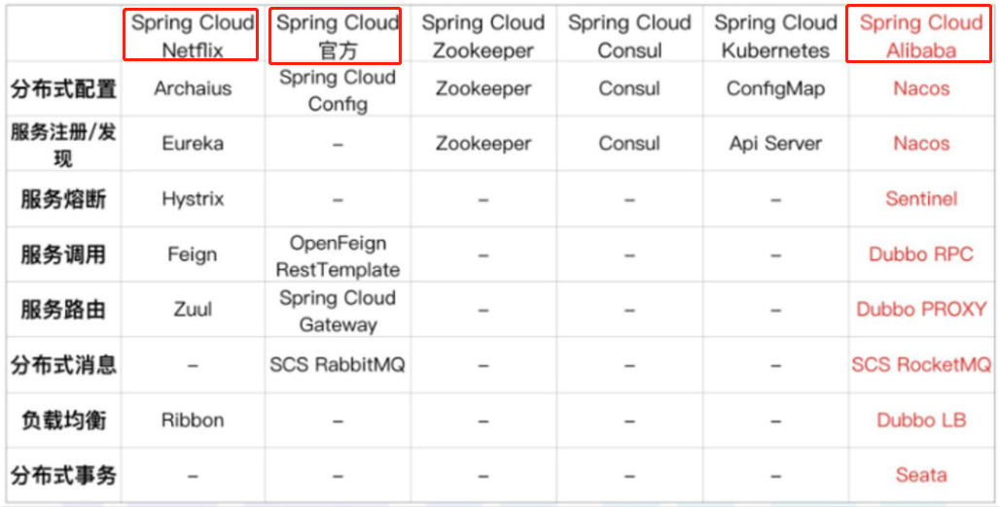

#### 4.2.5.2.根据技术栈分类


### 4.2.6.dubbo和SpringCloud

## 4.3.SpringCloud概述

### 4.3.1.SpringCloud版本选择

- 采用伦敦地铁站进行版本区分，推荐使用GA稳定版本（截止2021.01.12，版本更新到2020.0.0）


### 4.3.2.SpringCloud快速开始

- 快速开始：https://www.springcloud.cc/spring-cloud-config.html#_quick_start

### 4.3.3.配置类文件参考

#### 4.3.3.1.maven依赖导入

```xml
<!---->
<dependency>
    <groupId></groupId>
    <artifactId></artifactId>
    <version></version>
</dependency>
```

```xml
    <properties>
        <maven.compiler.source>8</maven.compiler.source>
        <maven.compiler.target>8</maven.compiler.target>
        <lomok.version>1.18.16</lomok.version>
    </properties>

	<!--注：版本截止到2021.01.12-->
    <!--打包方式-->
    <packaging>pom</packaging>

    <dependencyManagement>
        <dependencies>

            <!--SpringCloud依赖-->
            <dependency>
                <groupId>org.springframework.cloud</groupId>
                <artifactId>spring-cloud-dependencies</artifactId>
                <version>Hoxton.SR1</version>
                <type>pom</type>
            </dependency>

            <!--SpringBoot-->
            <dependency>
                <groupId>org.springframework.boot</groupId>
                <artifactId>spring-boot-dependencies</artifactId>
                <version>2.4.1</version>
            </dependency>

            <!--SpringBoot启动器-->
            <dependency>
                <groupId>org.springframework.boot</groupId>
                <artifactId>spring-boot-starter</artifactId>
                <version>2.4.1</version>
            </dependency>

            <!--数据库-->
            <dependency>
                <groupId>mysql</groupId>
                <artifactId>mysql-connector-java</artifactId>
                <version>5.1.38</version>
            </dependency>

            <!--数据源-->
            <dependency>
                <groupId>com.alibaba</groupId>
                <artifactId>druid</artifactId>
                <version>1.1.23</version>
            </dependency>

            <!--myBatis-->
            <dependency>
                <groupId>org.mybatis.spring.boot</groupId>
                <artifactId>mybatis-spring-boot-starter</artifactId>
                <version>2.1.4</version>
            </dependency>

            <!--log4j-->
            <dependency>
                <groupId>log4j</groupId>
                <artifactId>log4j</artifactId>
                <version>1.2.17</version>
            </dependency>

            <!--junit-->
            <dependency>
                <groupId>junit</groupId>
                <artifactId>junit</artifactId>
                <version>4.13.1</version>
                <scope>test</scope>
            </dependency>

            <!--lombok-->
            <dependency>
                <groupId>org.projectlombok</groupId>
                <artifactId>lombok</artifactId>
                <version>${lomok.version}</version>
            </dependency>

        </dependencies>
```

- 方便依赖导入版本维护，将version提到properties维护

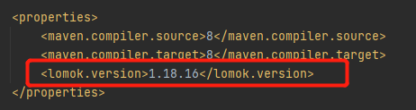


- 新建其他模块时导入需要的模块


#### 4.3.3.2.mybatis-config.xml文件头

```xml
<?xml version="1.0" encoding="UTF-8" ?>
<!DOCTYPE configuration
        PUBLIC "-//mybatis.org//DTD Config 3.0//EN"
        "http://mybatis.org/dtd/mybatis-3-config.dtd">
<configuration>

</configuration>
```

#### 4.3.3.3.mapper.xml文件头

```xml
<?xml version="1.0" encoding="UTF-8" ?>
<!DOCTYPE mapper
        PUBLIC "-//mybatis.org//DTD Config 3.0//EN"
        "http://mybatis.org/dtd/mybatis-3-mapper.dtd">
<mapper namespace= "dao文件路径">
//CRUD
</mapper>
```

#### 4.3.3.4.新建项目启动类

```java
//启动类:请自定义启动类名称
@SpringBootApplication
public class DeptProvider_8001 {
    public static void main(String[] args) {
        SpringApplication.run(DeptProvider_8001.class,args);
    }
}
```

#### 4.3.3.5.application.yml文件

```xml
#服务端口号
server:
  port: 8001

#MyBatis配置
mybatis:
  type-aliases-package: com.roc.springcloud.pojo.api
  config-location: classpath:mybatis-config.xml
  mapper-locations: classpath:mappers/*.xml

#Spring配置
spring:
  application:
    name: springcloud-provider

#数据源及数据库配置
  datasource:
    type: com.alibaba.druid.pool.DruidDataSource
    driver-class-name: com.alibaba.druid.proxy.DruidDriver
    url: jdbc:mysql://localhost:3306/Db01?useUnicode=true&characterEncoding=utf-8
    username: root
    password: 123456
```

### 4.3.4.新建SpringCloud项目遇见的问题

- 纯Maven项目：新建项目时目录一直延长：编写package时重写全部项目文件路径，IDEA识别后会拆开

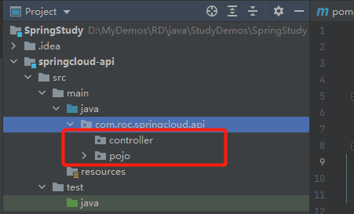

- 链式写法：注解@Accessors(chain = true)


## 4.4Spring Cloud Netflix

### 4.4.1.Eureka：服务注册与发现

#### 4.4.1.1.什么是Eureka？

```xml
Eureka是Netflix的有个子模块，也是核心模块之一。Eureka是基于REST的服务，用于定位服务，以实现云端中间件层服务发现和故障转移，服务注册与发现对于微服务来说是非常重要的，有了服务注册与发现，只需要使用服务的标识符，就可以访问到服务，而不需要修改服务调用的配置文件了，功能类似于Dubbo的注册中心，比如Zookeeper.
```

#### 4.4.1.2.Eureka:基本架构


```xml
系统中的其他微服务，使用Eureka的客户端连接到EurekaServer并维持心跳连接。这样系统的维护人员就可以通过EurekaServer来监控系统中各个微服务是否正常运行，Springcloud 的一些其他模块 (比如Zuul) 就可以通过EurekaServer来发现系统中的其他微服务，并执行相关的逻辑.
```

#### 4.4.1.3.构建配置Eureka.server

##### 1.pom.xml配置

```xml
<!--导入Eureka Server依赖-->
<dependency>
    <groupId>org.springframework.cloud</groupId>
    <artifactId>spring-cloud-starter-eureka-server</artifactId>
    <version>1.4.6.RELEASE</version>
</dependency>
```

##### 2.application.yaml配置

```xml
server:
  port: 7001

# Eureka配置
eureka:
  instance:
    # Eureka服务端的实例名字
    hostname: 127.0.0.1
  client:
    # 表示是否向 Eureka 注册中心注册自己(这个模块本身是服务器,所以不需要)
    register-with-eureka: false
    # fetch-registry如果为false,则表示自己为注册中心,客户端的化为 ture
    fetch-registry: false
    # Eureka监控页面~
    service-url:
      defaultZone: http://${eureka.instance.hostname}:${server.port}/eureka/
```

#### 4.4.1.4.构建配置Eureka.client

##### 1.pom.xml配置

```xml
<!--Eureka依赖-->
<!-- https://mvnrepository.com/artifact/org.springframework.cloud/spring-cloud-starter-eureka -->
<dependency>
    <groupId>org.springframework.cloud</groupId>
    <artifactId>spring-cloud-starter-eureka</artifactId>
    <version>1.4.6.RELEASE</version>
</dependency>

```

##### 2.application.yaml

```xml
# Eureka配置：配置服务注册中心地址
eureka:
  client:
    service-url:
      defaultZone: http://localhost:7001/eureka/
```

##### 3.给主启动类添加@EnableEurekaClient注解

```xml
/**
 * @Auther: wp
 * @Date: 2021年1月15日11:39:51
 * @Description: 启动类
 */
@SpringBootApplication
// @EnableEurekaClient 开启Eureka客户端注解，在服务启动后自动向注册中心注册服务
@EnableEurekaClient
public class DeptProvider_8001 {
    public static void main(String[] args) {
        SpringApplication.run(DeptProvider_8001.class,args);
    }
}
```

-----------------------------------------------**服务注册成功**-----------------------------------------------

##### 4.修改Eureka上的默认描述信息

```xml
# Eureka配置：配置服务注册中心地址
eureka:
  client:
    service-url:
      defaultZone: http://localhost:7001/eureka/
  instance:
    instance-id: springcloud-provider-dept-8001 #修改Eureka上的默认描述信息
```

**截止以上其他个性化操作，包括单个服务的注册已经全部实现。**

##### 5.关于Eureka的保护机制

**注：Eureka心跳健康检查机制：https://www.jdon.com/springcloud/eureka-health-monitoring.html**

```xml
1.根据上图可得到，Eureka.server本身作为SpringCloud项目中的一个微服务存在，其他的微服务通过导入Eureka.client的jar成为一个Eureka的客户端，客户端会通过请求想server发送请求，也就是所谓的心跳，server来判断这个客户端是否还在继续工作。

2.触发保护机制：
  当因为网络原因，微服务和server之间无法进行通信，但是服务依旧是健康的，此时server不应该注销该服务，于是，进入自我保护模式。一旦进入保护模式，server则保护服务注册表中的信息，不在删除服务注册表中的数据，也不会注销任何微服务。同样当网络恢复后，server自动退出保护机制。综上所述，自我保护模式是一种应对网络异常的安全保护措施。

3.架构哲学：它的架构哲学是宁可同时保留所有微服务（健康的微服务和不健康的微服务都会保留），也不盲目注销任何健康的微服务。使用自我保护模式，可以让Eureka集群更加的健壮、稳定。

4.在Spring Cloud中，可以使用eureka.server.enable-self-preservation = false 禁用自我保护模式。
```

#### 4.4.1.5.Eureka：集群环境配置

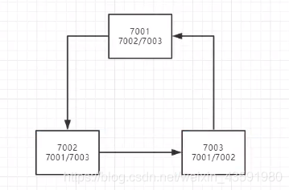

```xml
搭建Eureka集群，确保单个server挂掉之后其他服务仍然可以使用。一个服务需要绑定多个Eureka，即使一个挂掉，其他仍旧可以使用。主要为理解集群的概念，同样的服务来承担出错的风险。
```

#### 4.4.1.6.对比Eureka和Zookeeper的区别

注：**CAP**

```xml
1.什么是CAP原则？
CAP定理又称CAP原则，指的是在一个分布式系统中，Consistency（一致性）、 Availability（可用性）、Partition tolerance（分区容错性），最多只能同时三个特性中的两个，三者不可兼得。

CAP：是指的一致性，可用性，分区容错性

C：一致性:即更新操作成功并返回客户端后，所有节点在同一时间的数据完全一致，这就是分布式的一致性。

A:可用性：即服务一直可用，而且是正常响应时间。

P:分区容错性：即分布式系统在遇到某节点或网络分区故障的时候，仍然能够对外提供满足一致性或可用性的服务。
```

注：CA，CP，AP

```xml
CA without P：如果不要求P（不允许分区），则C（强一致性）和A（可用性）是可以保证的。但放弃P的同时也就意味着放弃了系统的扩展性，也就是分布式节点受限，没办法部署子节点，这是违背分布式系统设计的初衷的。

CP without A：如果不要求A（可用），相当于每个请求都需要在服务器之间保持强一致，而P（分区）会导致同步时间无限延长(也就是等待数据同步完才能正常访问服务)，一旦发生网络故障或者消息丢失等情况，就要牺牲用户的体验，等待所有数据全部一致了之后再让用户访问系统。设计成CP的系统其实不少，最典型的就是分布式数据库，如Redis、HBase等。对于这些分布式数据库来说，数据的一致性是最基本的要求，因为如果连这个标准都达不到，那么直接采用关系型数据库就好，没必要再浪费资源来部署分布式数据库。

 AP wihtout C：要高可用并允许分区，则需放弃一致性。一旦分区发生，节点之间可能会失去联系，为了高可用，每个节点只能用本地数据提供服务，而这样会导致全局数据的不一致性。典型的应用就如某米的抢购手机场景，可能前几秒你浏览商品的时候页面提示是有库存的，当你选择完商品准备下单的时候，系统提示你下单失败，商品已售完。这其实就是先在 A（可用性）方面保证系统可以正常的服务，然后在数据的一致性方面做了些牺牲，虽然多少会影响一些用户体验，但也不至于造成用户购物流程的严重阻塞。
```

根据实际业务去考虑取舍问题

1.银行业务：务必保证数据一致性，在可用性和分区容错进行取舍。

2..........

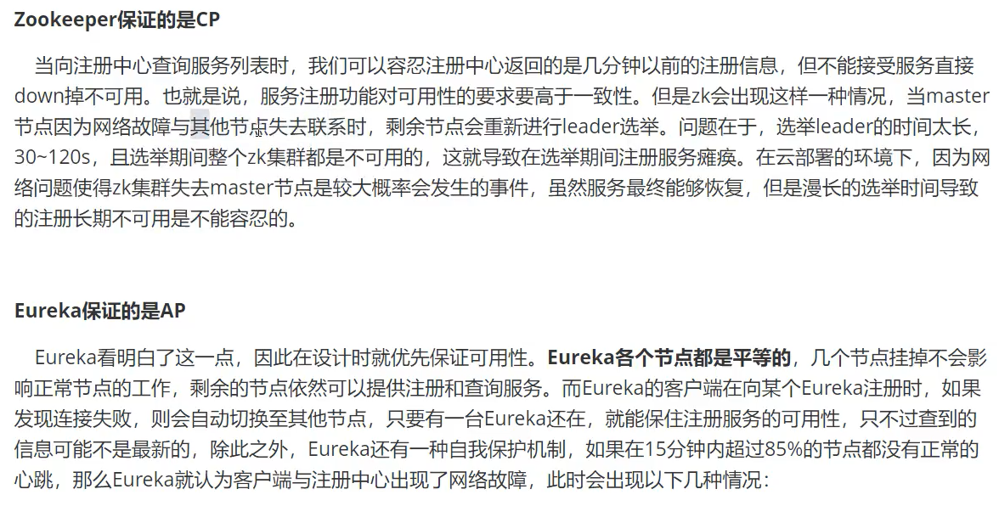


### 4.4.2.Ribbon：客户端负载均衡工具

#### 4.4.2.1.Ribbon是什么？

```xml
Ribbon 是 Netflix 发布的开源项目，主要功能是提供客户端的软件负载均衡算法，将 Netflix 的中间层服务连接在一起。Ribbon 的客户端组件提供一系列完整的配置项，如：连接超时、重试等。简单的说，就是在配置文件中列出 LoadBalancer (简称LB：负载均衡) 后面所有的及其，Ribbon 会自动的帮助你基于某种规则 (如简单轮询，随机连接等等) 去连接这些机器。我们也容易使用 Ribbon 实现自定义的负载均衡算法！
```

#### 4.4.2.2.Ribbon能做什么？

```xml
1.将用户的请求平摊的分配到多个服务上，从而达到系统的HA (高用)
```

**注：**

1. 常见的负载均衡软件有Nginx，Lvs等
2. Dubbo、SpringCloud 中均给我们提供了负载均衡，**SpringCloud 的负载均衡算法可以自定义**
3. 负载均衡分类：

- 集中式LB
    - 即在服务的提供方和消费方之间使用独立的LB设施，如**Nginx(反向代理服务器)**，由该设施负责把访问请求通过某种策略转发至服务的提供方！
- 进程式LB
    - 将LB逻辑集成到消费方，消费方从服务注册中心获知有哪些地址可用，然后自己再从这些地址中选出一个合适的服务器。
    - **Ribbon 就属于进程内LB**，它只是一个类库，集成于消费方进程，消费方通过它来获取到服务提供方的地址！

#### 4.4.2.3.集成Ribbon

##### 1.pom.xml：集成Ribbon和Eureka

```xml
<!--Ribbon-->
<dependency>
    <groupId>org.springframework.cloud</groupId>
    <artifactId>spring-cloud-starter-ribbon</artifactId>
    <version>1.4.6.RELEASE</version>
</dependency>
<!--Eureka: Ribbon需要从Eureka服务中心获取要拿什么-->
<dependency>
    <groupId>org.springframework.cloud</groupId>
    <artifactId>spring-cloud-starter-eureka</artifactId>
    <version>1.4.6.RELEASE</version>
</dependency>
```

##### 2.application.yaml

配置Eureka

```xml
# Eureka配置
eureka:
  client:
    register-with-eureka: false # 不向 Eureka注册自己
    service-url: # 从三个注册中心中随机取一个去访问
      defaultZone: http://eureka7001.com:7001/eureka/,http://eureka7002.com:7002/eureka/,http://eureka7003.com:7003/eureka/
```

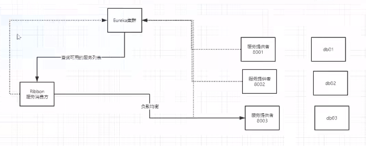

### 4.4.3.Feign：服务调用

Feign是声明式Web Service客户端，它让微服务之间的调用变得更简单，**类似controller调用service。**

#### 4.4.3.2.Feign能做什么？

Feign在Ribbon的基础上集成并封装了对Http的请求，**在Feign的实现下，我们只需要创建一个接口并使用注解的方式来配置它 (类似以前Dao接口上标注Mapper注解，现在是一个微服务接口上面标注一个Feign注解)
，即可完成对服务提供方的接口绑定，简化了使用Spring Cloud Ribbon 时，自动封装服务调用客户端的开发量。**

#### 4.4.3.3.Feign与Ribbon

两者皆可实现负载均衡，Ribbon是Feign的子集，对于性能来讲，由于Feign进行了二次操作，所以存在性能会比Ribbon略低的可能。

与**Ribbon**不同的是，通过**Feign**只需要定义服务绑定接口且以声明式的方法，优雅而简单的实现了服务调用。

#### 4.4.3.4.集成Feign

提供服务方+负载均衡客户端都需导入Feign，消费方则只管消费即可。

```xml
<!--Feign的依赖-->
<dependency>
    <groupId>org.springframework.cloud</groupId>
    <artifactId>spring-cloud-starter-feign</artifactId>
    <version>1.4.6.RELEASE</version>
</dependency>
```

#### 4.4.3.5.Feign和Ribbon如何选择？


### 4.4.4.HyStrix：服务熔断

> 复杂分布式体系结构中的应用程序有数十个依赖关系，每个依赖关系在某些时候将不可避免失败！

分布式系统中服务雪崩是什么？

```xml
多个微服务之间调用的时候，假设微服务A调用微服务B和微服务C，微服务B和微服务C又调用其他的微服务，这就是所谓的“扇出”，如果扇出的链路上某个微服务的调用响应时间过长，或者不可用，对微服务A的调用就会占用越来越多的系统资源，进而引起系统崩溃，所谓的“雪崩效应”。
```


#### 4.4.4.1.什么是HyStrix？

**Hystrix**是一个应用于处理分布式系统的延迟和容错的开源库，在分布式系统里，许多依赖不可避免的会调用失败，比如超时，异常等，**Hystrix**
能够保证在一个依赖出问题的情况下，不会导致整个体系服务失败，避免级联故障，以提高分布式系统的弹性。

“**断路器**”本身是一种开关装置，当某个服务单元发生故障之后，通过断路器的故障监控 (类似熔断保险丝) ，**向调用方返回一个服务预期的，可处理的备选响应 (FallBack)
，而不是长时间的等待或者抛出调用方法无法处理的异常，这样就可以保证了服务调用方的线程不会被长时间，不必要的占用**，从而避免了故障在分布式系统中的蔓延，乃至雪崩。

#### 4.4.4.2.HyStrix能做什么？

- 服务降级
- 服务熔断
- 服务限流
- 接近实时的监控


#### 4.4.4.3.什么是HyStrix服务熔断？

```xml
 熔断机制是赌赢雪崩效应的一种微服务链路保护机制。

​ 当扇出链路的某个微服务不可用或者响应时间太长时，会进行服务的降级，进而熔断该节点微服务的调用，快速返回错误的响应信息。检测到该节点微服务调用响应正常后恢复调用链路。在SpringCloud框架里熔断机制通过Hystrix实现。Hystrix会监控微服务间调用的状况，当失败的调用到一定阀值缺省是5秒内20次调用失败，就会启动熔断机制。熔断机制的注解是：@HystrixCommand。
```

#### 4.4.4.4.实现HyStrix服务熔断

 ```xml
<!--导入Hystrix依赖-->
<dependency>
    <groupId>org.springframework.cloud</groupId>
    <artifactId>spring-cloud-starter-hystrix</artifactId>
    <version>1.4.6.RELEASE</version>
</dependency>
 ```

#### 4.4.4.5.服务降级

```xml
服务降级是指 当服务器压力剧增的情况下，根据实际业务情况及流量，对一些服务和页面有策略的不处理，或换种简单的方式处理，从而释放服务器资源以保证核心业务正常运作或高效运作。说白了，就是尽可能的把系统资源让给优先级高的服务。

资源有限，而请求是无限的。如果在并发高峰期，不做服务降级处理，一方面肯定会影响整体服务的性能，严重的话可能会导致宕机某些重要的服务不可用。所以，一般在高峰期，为了保证核心功能服务的可用性，都要对某些服务降级处理。比如当双11活动时，把交易无关的服务统统降级，如查看蚂蚁深林，查看历史订单等等。

服务降级主要用于什么场景呢？当整个微服务架构整体的负载超出了预设的上限阈值或即将到来的流量预计将会超过预设的阈值时，为了保证重要或基本的服务能正常运行，可以将一些 不重要 或 不紧急 的服务或任务进行服务的 延迟使用 或 暂停使用。

降级的方式可以根据业务来，可以延迟服务，比如延迟给用户增加积分，只是放到一个缓存中，等服务平稳之后再执行 ；或者在粒度范围内关闭服务，比如关闭相关文章的推荐。
```

##### 1.服务降级需要考虑的问题

- 1）那些服务是核心服务，哪些服务是非核心服务
- 2）那些服务可以支持降级，那些服务不能支持降级，降级策略是什么
- 3）除服务降级之外是否存在更复杂的业务放通场景，策略是什么？

#### 4.4.4.6.服务熔断和服务降级的区别

- **服务熔断—>服务端**：某个服务超时或异常，引起熔断~，类似于保险丝(自我熔断)
- **服务降级—>客户端**：从整体网站请求负载考虑，当某个服务熔断或者关闭之后，服务将不再被调用，此时在客户端，我们可以准备一个 FallBackFactory ，返回一个默认的值(缺省值)
  。会导致整体的服务下降，但是好歹能用，比直接挂掉强。
  -
  触发原因不太一样，服务熔断一般是某个服务（下游服务）故障引起，而服务降级一般是从整体负荷考虑；管理目标的层次不太一样，熔断其实是一个框架级的处理，每个微服务都需要（无层级之分），而降级一般需要对业务有层级之分（比如降级一般是从最外围服务开始）
- 实现方式不太一样，服务降级具有代码侵入性(由控制器完成/或自动降级)，熔断一般称为**自我熔断**。

#### 4.4.4.7.Dashboard流监控

##### 1.导入依赖

```xml
<!--Hystrix依赖-->
<dependency>
    <groupId>org.springframework.cloud</groupId>
    <artifactId>spring-cloud-starter-hystrix</artifactId>
    <version>1.4.6.RELEASE</version>
</dependency>
<!--dashboard依赖-->
<dependency>
    <groupId>org.springframework.cloud</groupId>
    <artifactId>spring-cloud-starter-hystrix-dashboard</artifactId>
    <version>1.4.6.RELEASE</version>
</dependency>
<!--Ribbon-->
<dependency>
    <groupId>org.springframework.cloud</groupId>
    <artifactId>spring-cloud-starter-ribbon</artifactId>
    <version>1.4.6.RELEASE</version>
</dependency>
<!--Eureka-->
<dependency>
    <groupId>org.springframework.cloud</groupId>
    <artifactId>spring-cloud-starter-eureka</artifactId>
    <version>1.4.6.RELEASE</version>
</dependency>
<!--实体类+web-->
<dependency>
    <groupId>com.haust</groupId>
    <artifactId>springcloud-api</artifactId>
    <version>1.0-SNAPSHOT</version>
</dependency>
<dependency>
    <groupId>org.springframework.boot</groupId>
    <artifactId>spring-boot-starter-web</artifactId>
</dependency>
<!--热部署-->
<dependency>
    <groupId>org.springframework.boot</groupId>
    <artifactId>spring-boot-devtools</artifactId>
</dependency>
```

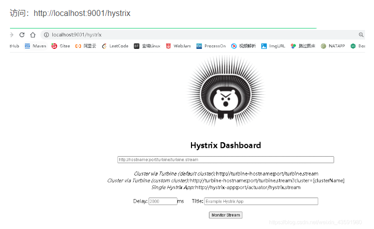

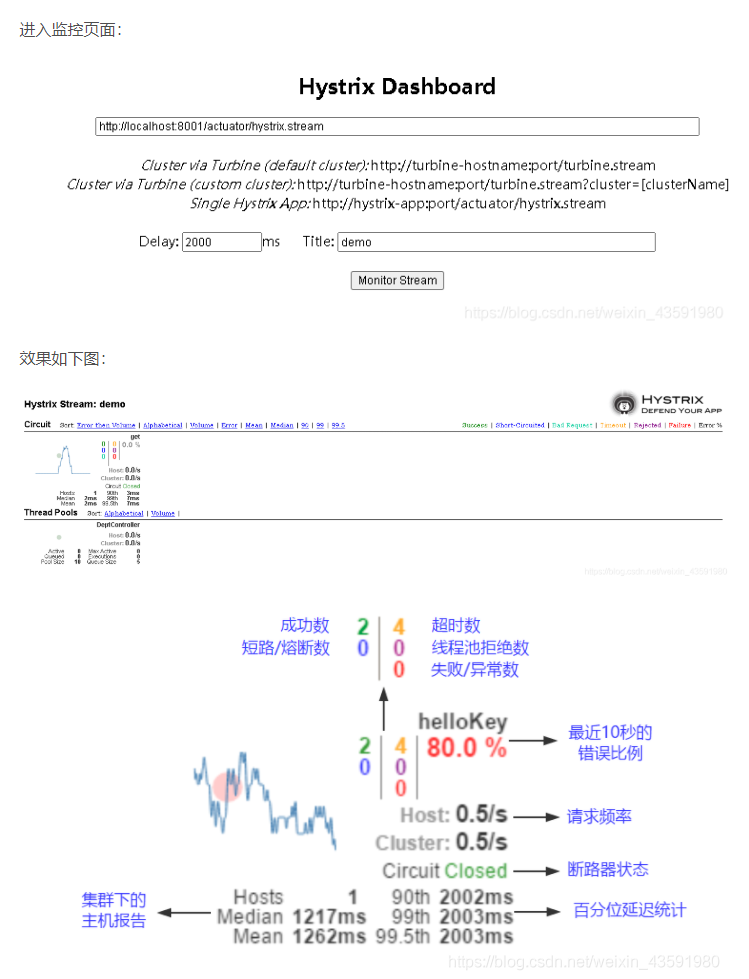

### 4.4.5.Zuul：路由网关

狂神：https://www.bilibili.com/video/BV1jJ411S7xr?p=17&spm_id_from=pageDriver

官方文档：https://github.com/Netflix/zuul/

SpringCloud中文网关于Zuul的解释：https://www.springcloud.cc/spring-cloud-greenwich.html#_router_and_filter_zuul

#### 4.4.5.1.什么是Zuul？

```xml
Zull包含了对请求的路由(用来跳转的)和过滤两个最主要功能：

​ 其中路由功能负责将外部请求转发到具体的微服务实例上，是实现外部访问统一入口的基础，而过滤器功能则负责对请求的处理过程进行干预，是实现请求校验，服务聚合等功能的基础。Zuul和Eureka进行整合，将Zuul自身注册为Eureka服务治理下的应用，同时从Eureka中获得其他服务的消息，也即以后的访问微服务都是通过Zuul跳转后获得。
```

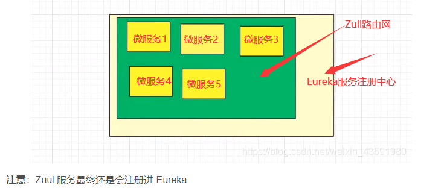

#### 4.4.5.2.zuul能做什么？

> 代理 + 路由 + 过滤

[Netflix将Zuul](https://www.slideshare.net/MikeyCohen1/edge-architecture-ieee-international-conference-on-cloud-engineering-32240146/27)用于以下[用途](https://www.slideshare.net/MikeyCohen1/edge-architecture-ieee-international-conference-on-cloud-engineering-32240146/27)：

- 认证方式
- 见解
- 压力测试
- 金丝雀测试
- 动态路由
- 服务迁移
- 减载
- 安全
- 静态响应处理
- 主动/主动流量管理

#### 4.4.5.3.导入Zuul

##### 1.pom.xml

```xml
<dependencies>
    <!--导入zuul依赖-->
    <dependency>
        <groupId>org.springframework.cloud</groupId>
        <artifactId>spring-cloud-starter-zuul</artifactId>
        <version>1.4.6.RELEASE</version>
    </dependency>
    <!--Hystrix依赖-->
    <dependency>
        <groupId>org.springframework.cloud</groupId>
        <artifactId>spring-cloud-starter-hystrix</artifactId>
        <version>1.4.6.RELEASE</version>
    </dependency>
    <!--dashboard依赖-->
    <dependency>
        <groupId>org.springframework.cloud</groupId>
        <artifactId>spring-cloud-starter-hystrix-dashboar</artifactId>
        <version>1.4.6.RELEASE</version>
    </dependency>
    <!--Ribbon-->
    <dependency>
        <groupId>org.springframework.cloud</groupId>
        <artifactId>spring-cloud-starter-ribbon</artifactId>
        <version>1.4.6.RELEASE</version>
    </dependency>
    <!--Eureka-->
    <dependency>
        <groupId>org.springframework.cloud</groupId>
        <artifactId>spring-cloud-starter-eureka</artifactId>
        <version>1.4.6.RELEASE</version>
    </dependency>
    <!--实体类+web-->
    <dependency>
        <groupId>com.haust</groupId>
        <artifactId>springcloud-api</artifactId>
        <version>1.0-SNAPSHOT</version>
    </dependency>
    <dependency>
        <groupId>org.springframework.boot</groupId>
        <artifactId>spring-boot-starter-web</artifactId>
    </dependency>
    <!--热部署-->
    <dependency>
        <groupId>org.springframework.boot</groupId>
        <artifactId>spring-boot-devtools</artifactId>
    </dependency>
</dependencies>
```

##### 2.application.yml

```xml
server:
  port: 9527

spring:
  application:
    name: springcloud-zuul #微服务名称

# eureka 注册中心配置
eureka:
  client:
    service-url:
      defaultZone: http://eureka7001.com:7001/eureka/,http://eureka7002.com:7002/eureka/,http://eureka7003.com:7003/eureka/
  instance: #实例的id
    instance-id: zuul9527.com
    prefer-ip-address: true # 显示ip

info:
  app.name: roc.springcloud # 项目名称
  company.name: ximidoudou # 公司名称

# zull 路由网关配置
zuul:
  # 路由相关配置
  # 原来访问路由 eg:http://www.cspStudy.com:9527/springcloud-provider-dept/dept/get/1
  # zull路由配置后访问路由 eg:http://www.cspstudy.com:9527/haust/mydept/dept/get/1
  routes:
    mydept.serviceId: springcloud-provider-dept # eureka注册中心的服务提供方路由名称
    mydept.path: /mydept/** # 将eureka注册中心的服务提供方路由名称 改为自定义路由名称
  # 不能再使用这个路径访问了，*： 忽略,隐藏全部的服务名称~
  ignored-services: "*"
  # 设置公共的前缀
  prefix: /roc
```

##### 3.主启动类

```xml
/**
 * @Auther: roc
 * @Date: 2021年2月2日23:13:24
 * @Description: Zull路由网关主启动类
 */
@SpringBootApplication
@EnableZuulProxy // 开启Zuul
public class ZuulApplication_9527 {

    public static void main(String[] args) {
        SpringApplication.run(ZuulApplication_9527.class,args);
    }
}
```

## 4.5.SpringCloud Alibaba

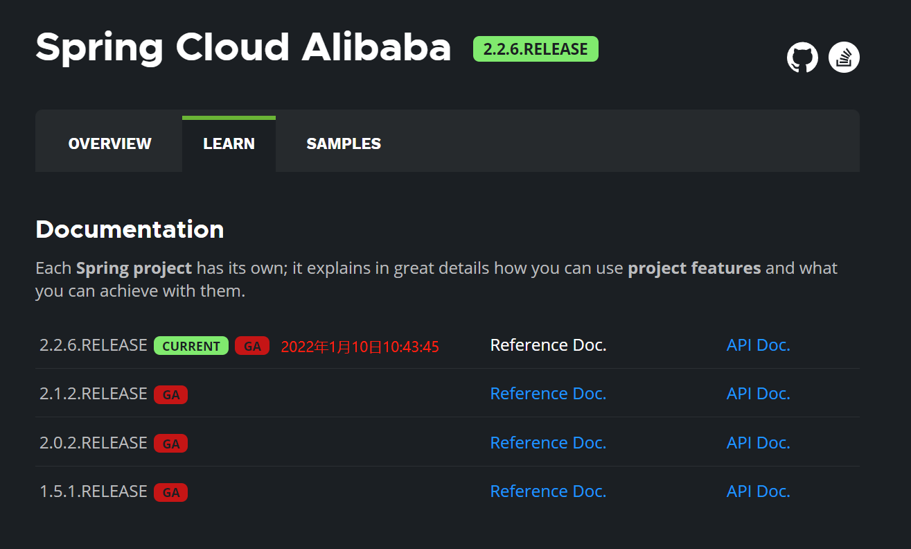


### 4.5.1.Nacos：服务注册与配置中心

### 4.5.2.Sentinel：服务监控降级

### 4.5.3.Dubbo：服务调用（java RPC框架）

### 4.5.4.Rocket MQ：消息队列

### 4.5.5.SchedulerX：分布式任务调度

### 4.5.6.Seata：分布式事务

### 4.5.7.阿里云商业化组件：OSS等

# 5.Server plugs

## 5.1.Nginx

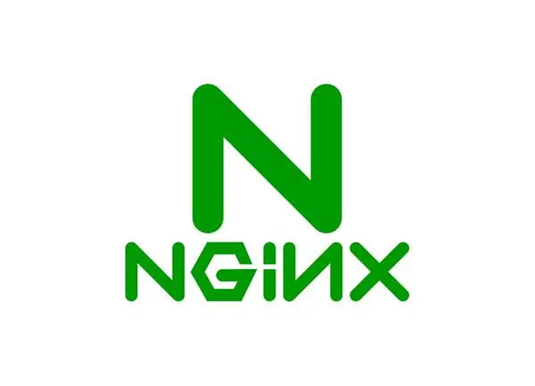


Nginx是一个高性能的HTTP和反向代理服务器，同时也提供了IMAP/POP3/SMTP服务。

Nginx是有俄罗斯人伊戈尔.赛索耶夫开发。俄罗斯人的开发能力还是有目共睹。

参考文档：

1. Nginx官网：[nginx news](http://nginx.org/)
2. Nginx中文文档：[Nginx中文文档](https://www.nginx.cn/doc/)
3. Nginx菜鸟教程：[Nginx 安装配置 | 菜鸟教程 (runoob.com)](https://www.runoob.com/linux/nginx-install-setup.html)
4. Nginx博客园教程：[Nginx 入门学习教程 - 星云博客园 - 博客园 (cnblogs.com)](https://www.cnblogs.com/xingyunblog/p/9066865.html)

### 5.1.1.Nginx产生的原因

​	用户从少变多，我们横向扩展服务器，需要有人帮忙解决客户访问各个不同服务器的需求。因此需要一台服务器在用户和服务器之间，帮忙转发客户请求至后面的服务器集群。

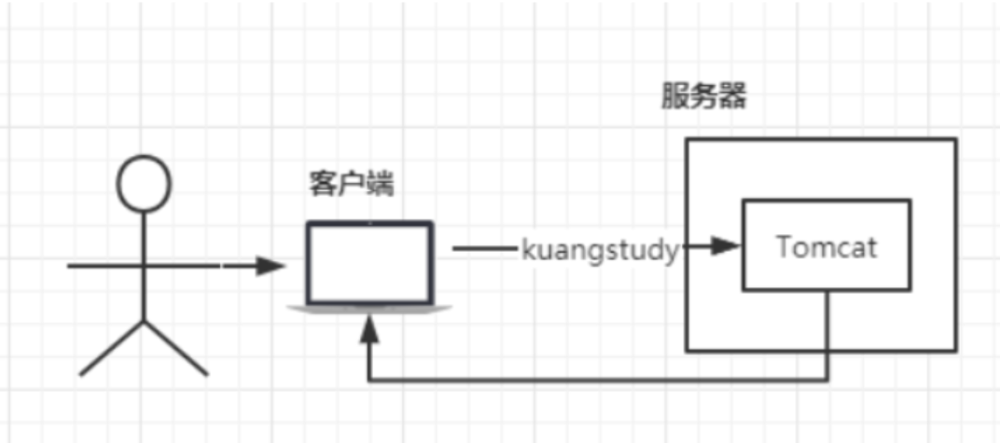

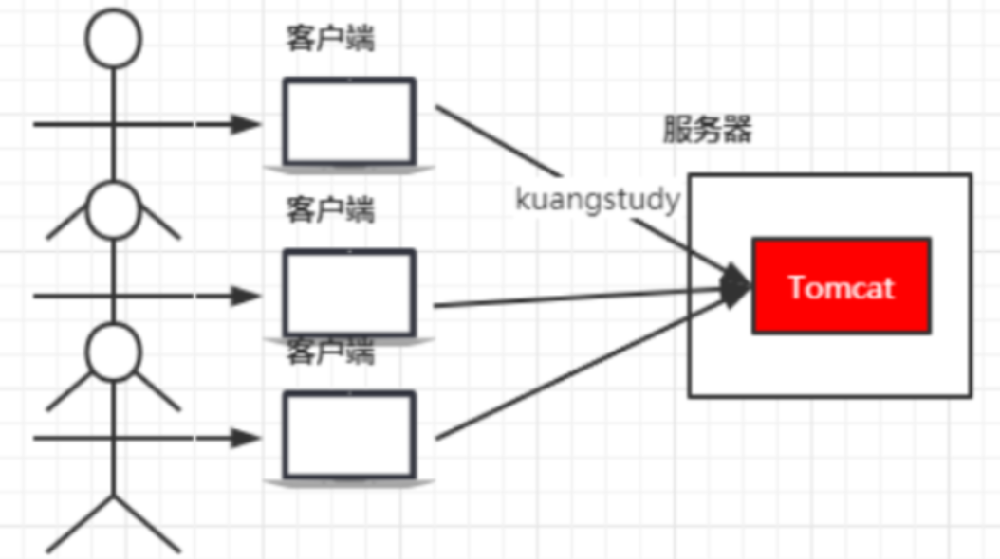

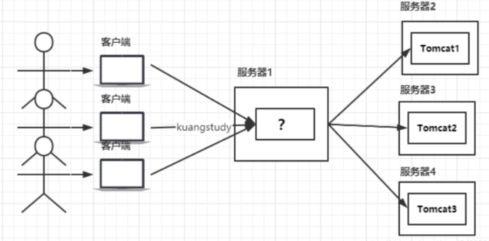

### 5.1.2.什么是Nginx

1. Nginx是一个==高性能的HTTP和反向代理服务器==，同时也提供了IMAP/POP3/SMTP服务。
2. 占用内存少，并发能力强
3. Nginx启动特别简单，并且几乎可以做到7*24h不间断地运行
4. Nginx完全使用C语言开发，==官方数据测试表明能够支持高达50000个并发连接数的响应。==

### 5.1.3.Nginx能做什么

#### 5.1.3.1HTTP代理/反向代理

- 反向代理：反向代理是代理服务器的，所以用户是无感知的

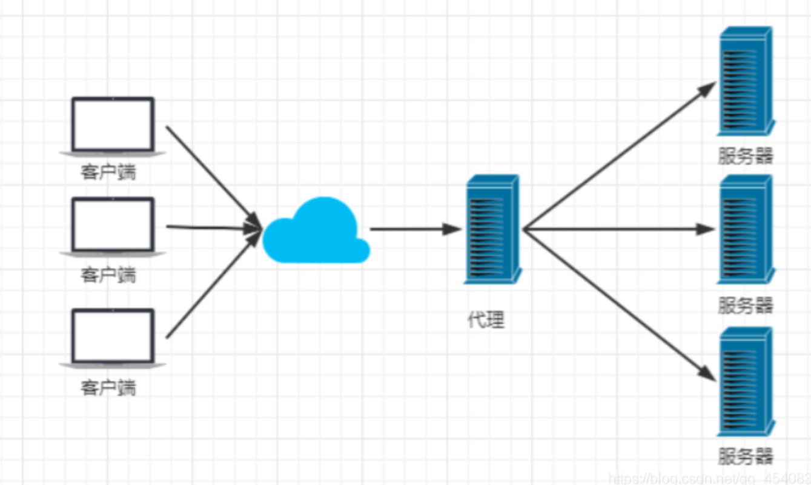

#### 5.1.3.2负载均衡

##### 5.1.3.2.1.什么是负载均衡？

- 负载：客户端发送的，Nginx接受到的请求的数量就是负载量
- 均衡：请求数量按照一定的规则分发到不同的服务器的处理规则就是我们说的均衡原则

##### 5.1.3.2.2.Nginx实现负载均衡

- Nginx提供的负载均衡测量有两种：内置策略和扩展策略。其中内置策略为轮询、加权轮询、IP hash。
  - 轮询/加权轮询：weight（默认选择）：接受到的请求按照顺序逐一发送到不同的后端服务器，即使在使用过程中，一台服务器宕机，Nginx会自动剔除队列，请求不会受到影响。同时可以给定不同的后端服务器一个权重值，用于调整不同的服务器上的请求的分配率，权重数越大，被分配到请求的几率也就越大。实际要根据生产环境中不同的后端服务器的硬件进行调整。
  - IP Hash：对客户端的IP进行hash操作，然后根据hash结果将同一个客户端的ip的请求分发给同一台服务器进行处理，可以解决session不共享的问题。
  - fair：（fair：公平的）智能调度调整算法，动态地根据后端服务器的请求处理到响应的时间进行均衡分配，响应时间短处理效率高的服务器分配的请求的概率也就越高。但是Nginx默认不支持fair算法，如需使用需要安装upstream_fair模块。
  - url_hash：按照访问的url的hash结果分配请求，每个请求的url会指向后端的某个服务器，可以在nginx作为静态服务器的情况下使用以提高访问效率，默认nginx不支持这种调度算法，要使用的话需要安装nginx的hash软件包。

- 同样提供负载均衡的工具：Ribbon，feign，LVS

##### 5.1.3.2.3.Nginx和Ribbon的区别

1. nginx：nginx是客户端的所有请求统一交给nginx处理，由nginx实现负载均衡然后转发，属于服务器端负载均衡
2. ribbon：ribbon是从eureka服务注册中心服务器端获取服务注册的列表，缓存至本地，让本地的方法区实现负载均衡。

所以nginx适合于服务器端实现负载均衡，比如tomcat，而ribbon适合于在微服务中RPC远程过程调用中实现本地服务负载均衡，SpringCloud官方采用的是本地客户端的负载均衡。

#### 5.1.3.3.动静分离

拆分动态网站中的动静态文件，一些静态文件，例如css、js、html和图片等文件，解疑将其放置专门的静态资源服务器中，而不用请求静态资源的时候去同一个资源下去取。

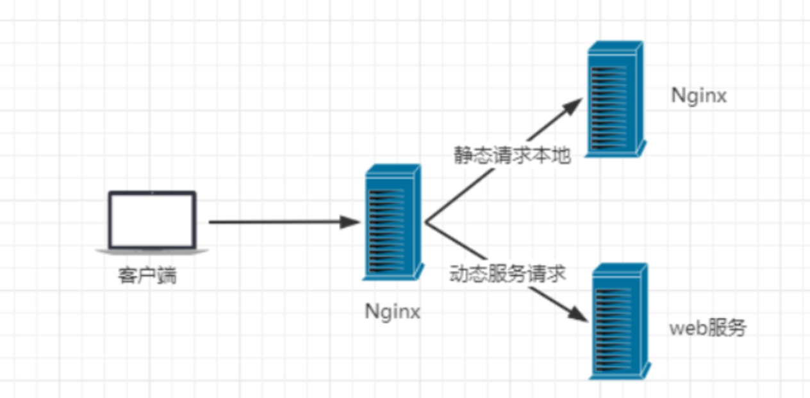

### 5.1.4.Nginx的安装

nginx下载地址：[nginx: download](http://nginx.org/en/download.html)

同时nginx分为linux版本，和Windows版本，此处选择稳定版的Windows版本，下载之后是一个压缩包，解压之后即可使用。

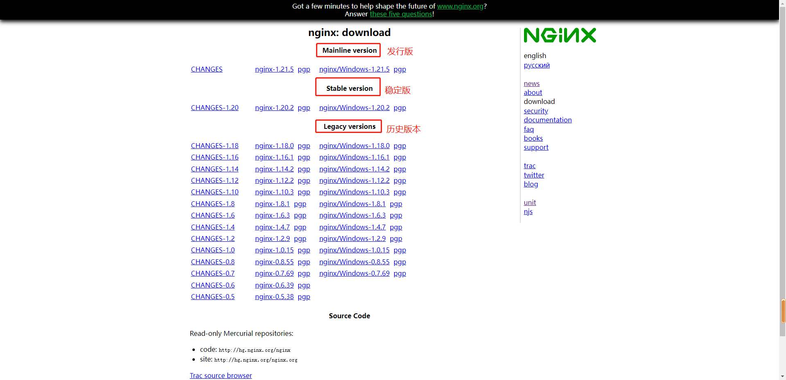

#### 5.1.4.1.Windows安装

下载、解压：

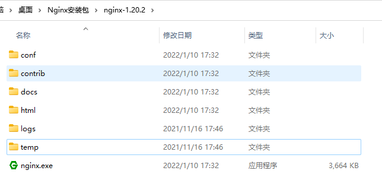

启动即可：解压目录下使用cmd命令即可启动

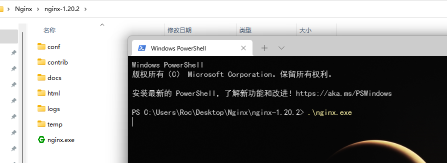

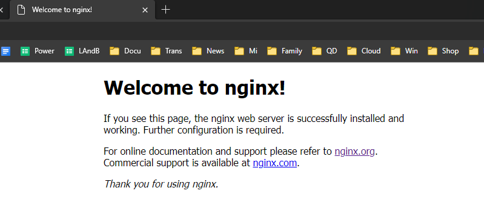

#### 5.1.4.2.Linux安装

### 5.1.5Nginx配置文件

.jpg)

#### 5.1.5.1配置文件结构

```xml
...              #全局块

events {         #events块
   ...
}

http      #http块
{
    ...   #http全局块
    server        #server块
    { 
        ...       #server全局块
        location [PATTERN]   #location块
        {
            ...
        }
        location [PATTERN] 
        {
            ...
        }
    }
    server
    {
      ...
    }
    ...     #http全局块
}
```

1. 全局块：配置影响nginx全局的指令。一般有运行nginx服务器的用户组，nginx进程pid存放路径，日志存放路径，配置文件引入，运行生成worker process数等。
2. events块：配置影响nginx服务器或与用户的网络连接，有每个进程的最大连接数。选取哪种事件驱动模型处理连接请求，是否允许同时接受多个网络连接，开启多个网络连接序列化等
3. http块
   1. http全局块：可以嵌套多个server，配置代理、缓存、日志定义等绝大多数功能和第三方模块的配置。例如文件引入、mime-type定义、日志自定义、是否使用sendfile传输文件、连接超时时间、单连接请求数等
   2. sever块：配置虚拟主机（服务器）的相关参数，一个http中可以允许有多个server
4. location块：配置请求的路由，以及各种页面的处理情况，例如500,404页面

#### 5.1.5.2.nginx.conf参考文件

```xml
########### 每个指令必须有分号结束。#################
#user administrator administrators;  #配置用户或者组，默认为nobody nobody。
#worker_processes 2;  #允许生成的进程数，默认为1
#pid /nginx/pid/nginx.pid;   #指定nginx进程运行文件存放地址
error_log log/error.log debug;  #制定日志路径，级别。这个设置可以放入全局块，http块，server块，级别以此为：debug|info|notice|warn|error|crit|alert|emerg
events {
    accept_mutex on;   #设置网路连接序列化，防止惊群现象发生，默认为on
    multi_accept on;  #设置一个进程是否同时接受多个网络连接，默认为off
    #use epoll;      #事件驱动模型，select|poll|kqueue|epoll|resig|/dev/poll|eventport
    worker_connections  1024;    #最大连接数，默认为512
}
http {
    include       mime.types;   #文件扩展名与文件类型映射表
    default_type  application/octet-stream; #默认文件类型，默认为text/plain
    #access_log off; #取消服务日志    
    log_format myFormat '$remote_addr–$remote_user [$time_local] $request $status $body_bytes_sent $http_referer $http_user_agent $http_x_forwarded_for'; #自定义格式
    access_log log/access.log myFormat;  #combined为日志格式的默认值
    sendfile on;   #允许sendfile方式传输文件，默认为off，可以在http块，server块，location块。
    sendfile_max_chunk 100k;  #每个进程每次调用传输数量不能大于设定的值，默认为0，即不设上限。
    keepalive_timeout 65;  #连接超时时间，默认为75s，可以在http，server，location块。

    upstream mysvr {   
      server 127.0.0.1:7878;
      server 192.168.10.121:3333 backup;  #热备
    }
    error_page 404 https://www.baidu.com; #错误页
    server {
        keepalive_requests 120; #单连接请求上限次数。
        listen       4545;   #监听端口
        server_name  127.0.0.1;   #监听地址       
        location  ~*^.+$ {       #请求的url过滤，正则匹配，~为区分大小写，~*为不区分大小写。
           #root path;  #根目录
           #index vv.txt;  #设置默认页
           proxy_pass  http://mysvr;  #请求转向mysvr 定义的服务器列表
           deny 127.0.0.1;  #拒绝的ip
           allow 172.18.5.54; #允许的ip           
        } 
    }
}
```

#### 5.1.5.3.常见配置项

```xml
1.$remote_addr 与 $http_x_forwarded_for 用以记录客户端的ip地址；
2.$remote_user ：用来记录客户端用户名称；
3.$time_local ： 用来记录访问时间与时区；
4.$request ： 用来记录请求的url与http协议；
5.$status ： 用来记录请求状态；成功是200；
6.$body_bytes_s ent ：记录发送给客户端文件主体内容大小；
7.$http_referer ：用来记录从那个页面链接访问过来的；
8.$http_user_agent ：记录客户端浏览器的相关信息；
```

### 5.1.6.Nginx常用命令

```sh
cd /usr/local/nginx/sbin/
./nginx  启动
./nginx -s stop  停止
./nginx -s quit  安全退出
./nginx -s reload  重新加载配置文件
ps aux|grep nginx  查看nginx进程
```

linux有关防火墙的命令

```sh
# 开启
service firewalld start
# 重启
service firewalld restart
# 关闭
service firewalld stop
# 查看防火墙规则
firewall-cmd --list-all
# 查询端口是否开放
firewall-cmd --query-port=8080/tcp
# 开放80端口
firewall-cmd --permanent --add-port=80/tcp
# 移除端口
firewall-cmd --permanent --remove-port=8080/tcp
#重启防火墙(修改配置后要重启防火墙)
firewall-cmd --reload
# 参数解释
1、firwall-cmd：是Linux提供的操作firewall的一个工具；
2、--permanent：表示设置为持久；
3、--add-port：标识添加的端口；
```

### 5.1.7.Nginx服务器搭建

### 5.1.8.Nginx服务器集群

## 5.2MQ

### 5.2.0SpringCloud关于MQ

### 5.2.1什么是MQ

MQ（message queue）：消息队列：通过典型的生产者和消费者模式，生产者不间断地向消息队列中生产消息，消费者不断地从队列中获取消息。

因为消息的生产和消费都是异步的，而且生产者只关心消息的生产，消费者只关心消息的接受和消费，两者没有紧密的关联，同时也没有对业务逻辑的入侵，轻松地解决了系统间的解耦。

同时，MQ又被称为消息中间件，通过高效可靠的消息传递机制进行平台无关的数据交流，并基于数据通信来进行分布式架系统的集成。

主要用途：不同进程或者线程之间的通信

#### 5.2.1.1.产生消息队列的原因

1. 不同进程之间传递消息时，两个进程之间耦合程度过高，改动一个进程，就必须修改另外一个进程，为了隔离两个进程，在两个进程之间抽离出一层（没有什么问题不是加一层能解决的）所有两个进程之间传递的消息，都必须通过消息队列来传递。单独修改某一个进程并不会影响另外一个。
2. 某一个进程接受的消息太多，一下子无法处理完，并且也有先后顺序，必须对收到的消息进行排队，因此诞生了消息队列

#### 5.2.1.2MQ的分类及区别

市面上的MQ技术目前很多，老牌的ActiveMQ、RabbitMQ，主要用于处理大数据的kafka，以及阿里巴巴自主研发的RocketMQ；

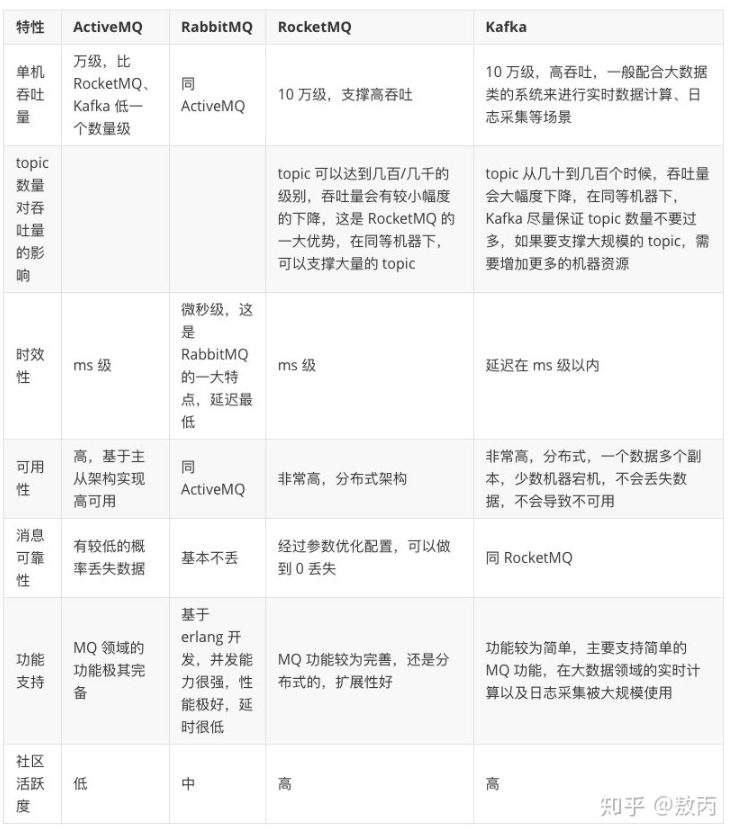

### 5.2.2RabbitMQ

参考链接：[极限编程网 (limitcode.com)](https://www.limitcode.com/list/5913f8ce45b508059064a71e?p=1)

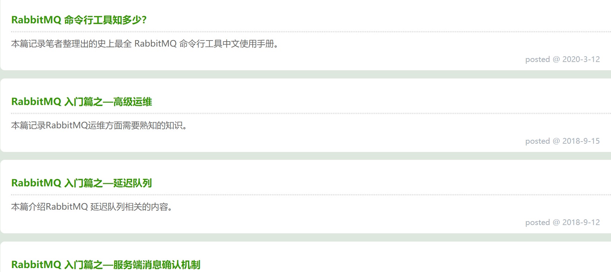

#### 5.2.2.0.RabbitMQ官网

`RabbitMQ是基于AMQP协议，采用erlang语言开发，是部署最广泛的开源消息中间件，是最受欢迎的开源消息中间件之一。`

整体网页的风格是一只只的兔子，正如其名，Rabbit呐。

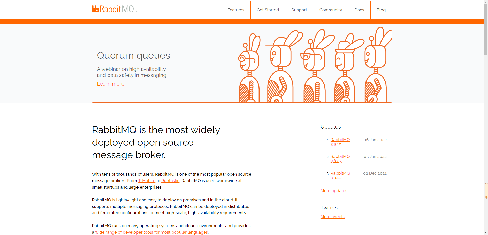

#### 5.2.2.0.AMQP协议

AMQP协议：AMQP（advanced message queuing protocol）协议在2003年时提出，最早应用于金融领域不同平台之间的消息交互问题。顾名思义，AMQP是一种协议，更准确地说是一种binary wire-level protocol（链接协议）。这是其和JMS的本质差别，AMQP不通过API层进行限定，而是直接定义网络交换的数据格式。这使得AMQP的Provider天然就是跨平台的。

下图是AMQP协议模型：

Publisher application：生产者

Consumer application：消费者

Exchange：交换机

Message Queue：消息队列

Virtual host：虚拟主机

Server：服务

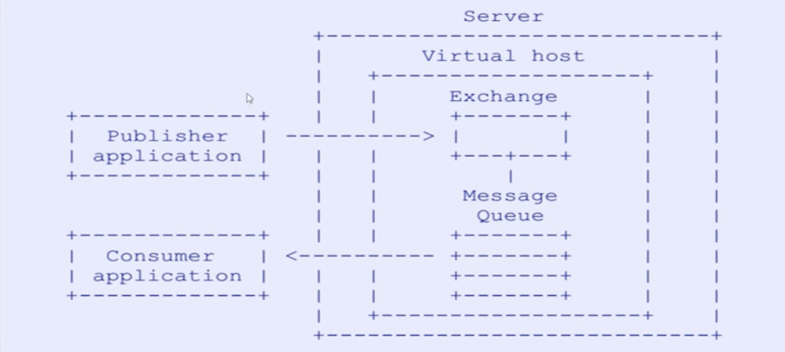

##### 5.2.2.0.1.RabbitMQ与AMQP对应的组件

1. virtual host：虚拟主机：每个rabbitMQ服务器都能创建若干个虚拟的消息服务器，称之为虚拟主机，每一个虚拟主机都有自己的交换机、队列和绑定等，每一个虚拟主机之间都是隔离的，每个rabbitmq用户必须隶属一个或者多个虚拟主机，rabbitmq在安装后会创建一个“/”的虚拟主机。
2. provider：生产者
3. server：服务
4. Exchange：交换机
5. Message Queue：消息队列
6. consumer：消费者

#### 5.2.2.1RabbitMQ的安装

在RabbitMQ官网上下载并安装，下面详细展开linux CentOS的安装。

**首先强调的是：RabbitMQ安装之前需要当前环境有Erlang语言的支持。**

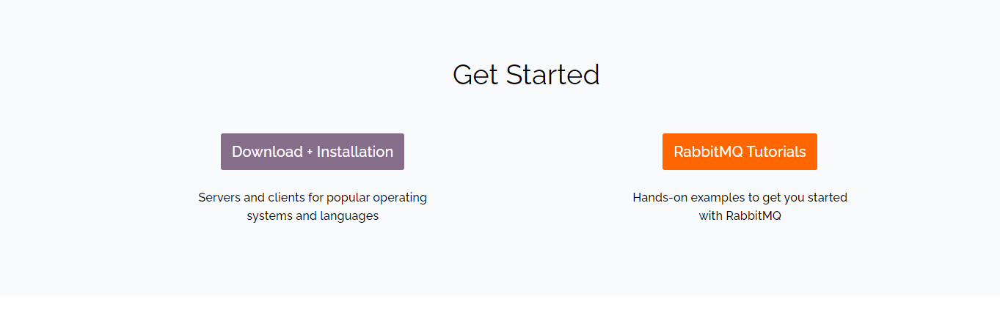

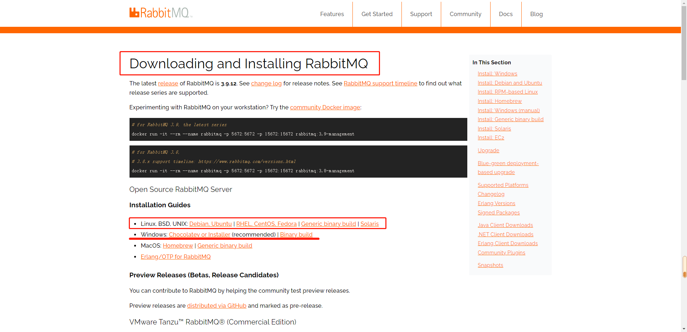

##### 5.2.2.1.1.Windows安装RabbitMQ

##### 5.2.2.1.2.linux CentOS安装RabbitMQ

当前主要的项目环境仍然是linux。

```sh
# 1.将rabbitmq安装包上传到linux系统中
	erlang-22.0.7-1.el7.x86_64.rpm  #l7表示是Centosl7,Centosl8表示Centos8
	rabbitmq-server-3.7.18-1.el7.noarch.rpm

# 2.安装Erlang依赖包
	rpm -ivh erlang-22.0.7-1.el7.x86_64.rpm

# 3.安装RabbitMQ安装包(需要联网)
	yum install -y rabbitmq-server-3.7.18-1.el7.noarch.rpm
	注意:默认安装完成后配置文件模板在:/usr/share/doc/rabbitmq-server-3.7.18/rabbitmq.config.example目录中,需要	
	将配置文件复制到/etc/rabbitmq/目录中,并修改名称为rabbitmq.config
# 4.复制配置文件
	cp /usr/share/doc/rabbitmq-server-3.7.18/rabbitmq.config.example /etc/rabbitmq/rabbitmq.config

# 5.查看配置文件位置
	ls /etc/rabbitmq/rabbitmq.config

# 6.修改配置文件(参见下图:)
	vim /etc/rabbitmq/rabbitmq.config 
```


```txt
将上图中配置文件中红色部分去掉`%%`,以及最后的`,`逗号 
修改为下图:
```

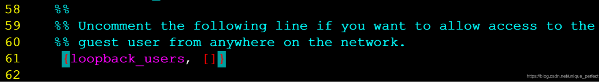

```sh
# 7.执行如下命令,启动rabbitmq中的插件管理
	rabbitmq-plugins enable rabbitmq_management
	
	出现如下说明:
		Enabling plugins on node rabbit@localhost:
    rabbitmq_management
    The following plugins have been configured:
      rabbitmq_management
      rabbitmq_management_agent
      rabbitmq_web_dispatch
    Applying plugin configuration to rabbit@localhost...
    The following plugins have been enabled:
      rabbitmq_management
      rabbitmq_management_agent
      rabbitmq_web_dispatch

    set 3 plugins.
    Offline change; changes will take effect at broker restart.

# 8.启动RabbitMQ的服务
	systemctl start rabbitmq-server
	systemctl restart rabbitmq-server
	systemctl stop rabbitmq-server
	

# 9.查看服务状态(见下图:)
	systemctl status rabbitmq-server
  ● rabbitmq-server.service - RabbitMQ broker
     Loaded: loaded (/usr/lib/systemd/system/rabbitmq-server.service; disabled; vendor preset: disabled)
     Active: active (running) since 三 2019-09-25 22:26:35 CST; 7s ago
   Main PID: 2904 (beam.smp)
     Status: "Initialized"
     CGroup: /system.slice/rabbitmq-server.service
             ├─2904 /usr/lib64/erlang/erts-10.4.4/bin/beam.smp -W w -A 64 -MBas ageffcbf -MHas ageffcbf -
             MBlmbcs...
             ├─3220 erl_child_setup 32768
             ├─3243 inet_gethost 4
             └─3244 inet_gethost 4
      .........
```

```sh
# 10.关闭防火墙服务
	systemctl disable firewalld  # 需要关闭防火墙，否则访问不了
    Removed symlink /etc/systemd/system/multi-user.target.wants/firewalld.service.
    Removed symlink /etc/systemd/system/dbus-org.fedoraproject.FirewallD1.service.
	systemctl stop firewalld   

# 11.访问web管理界面
	http://10.15.0.8:15672/
	
# 12.登录管理界面
	username:  guest
	password:  guest
```

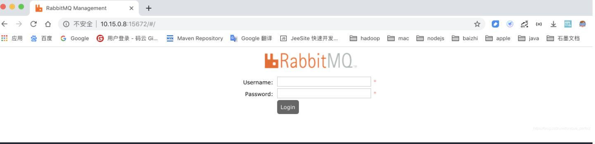

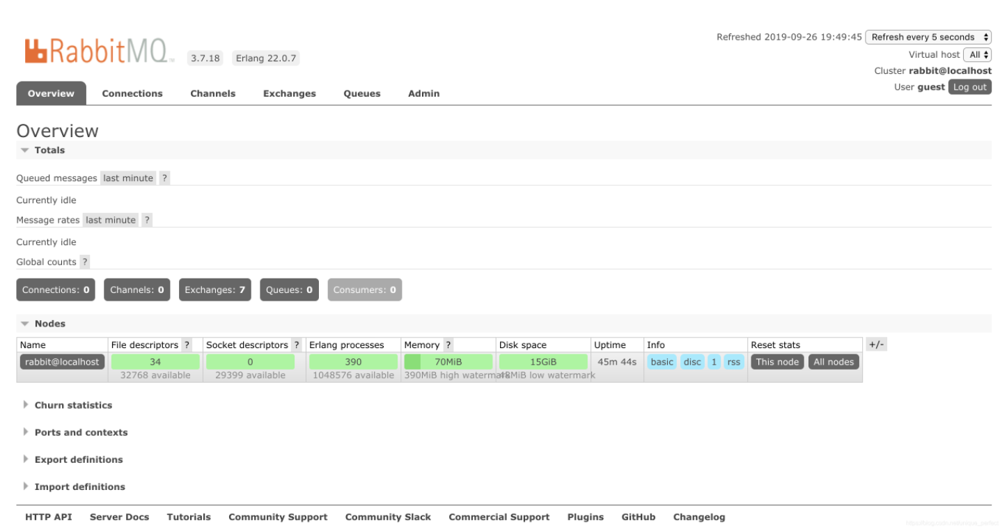

#### 5.2.2.2RabbitMQ管理命令行

```sh
# 1.服务启动相关
	systemctl start|restart|stop|status rabbitmq-server

# 2.管理命令行  用来在不使用web管理界面情况下命令操作RabbitMQ
	rabbitmqctl  help  可以查看更多命令

# 3.插件管理命令行
	rabbitmq-plugins enable|list|disable 
```

#### 5.2.2.3RabbitMQ管理界面

##### 5.2.2.3.1.overview整体页面概览

overview：概览

connections：连接：无论是生产者还是消费者，都需要与RabbitMQ建立连接后才能完成消息分生产和消费，在connections里可以查看连接情况。

Channel：通道：建立连接后，会形成通道，消息的投递依赖于通道。

Exchange：交换机：用来实现消息的路由。

Queues：队列：即消息队列，消息存放在队列中，等待消费，消息被消费后移除队列。

Admin：管理

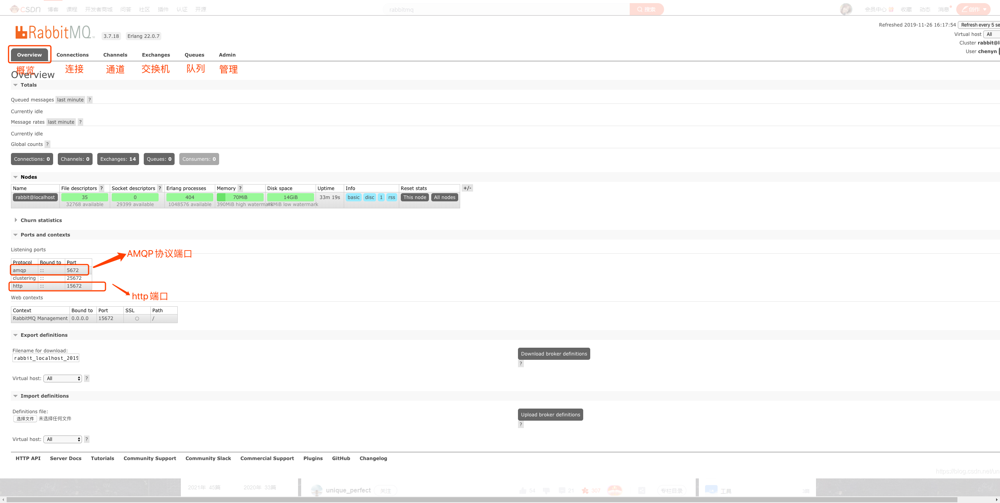

##### 5.2.2.3.2.Admin用户管理

###### 5.2.2.3.2.1添加/删除用户

在这里可以添加删除用户，可以修改用户的权限。

其中：用户的权限

1. 超级管理员：administrator：可以登录管理控制台，可以查看所有的信息，并且对用户、策略进行操作
2. 监控者：monitor：可以登陆控制台，可以查看rabbitMQ节点的相关信息
3. 策略定制者：Policymaker：可以登录控制台，同时可以对policy进行管理，但无法查看节点的相关信息
4. 普通管理者：Management：既可以登录控制台，无法看到节点信息，也无法对策略进行管理
5. 扮演者：Impersonator
6. 没有任何权限：none

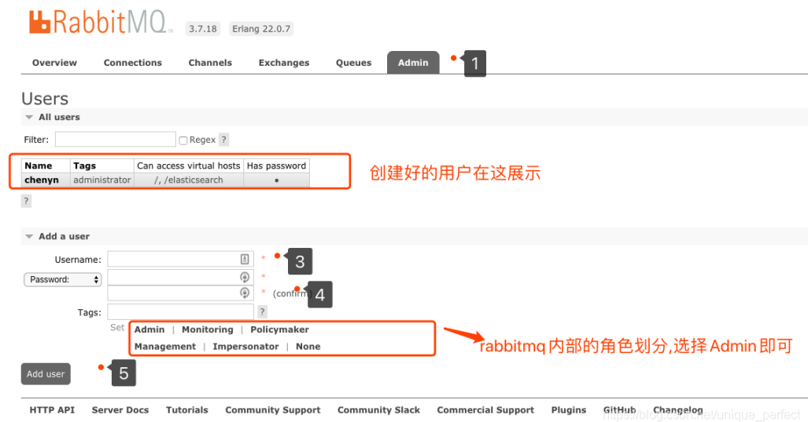

##### 5.2.2.3.3.虚拟主机的管理

创建虚拟主机：虚拟主机就是为了让各个用户可以互不干扰的工作，RabbitMQ添加了虚拟主机的概念，其实就是一个独立的访问路径，不同用户使用不同路径，各自有各自的交换机、队列，而且互不影响。

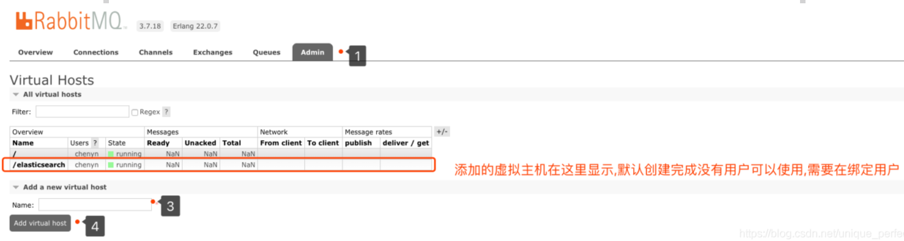

#### 5.2.2.4RabbitMQ消费模型

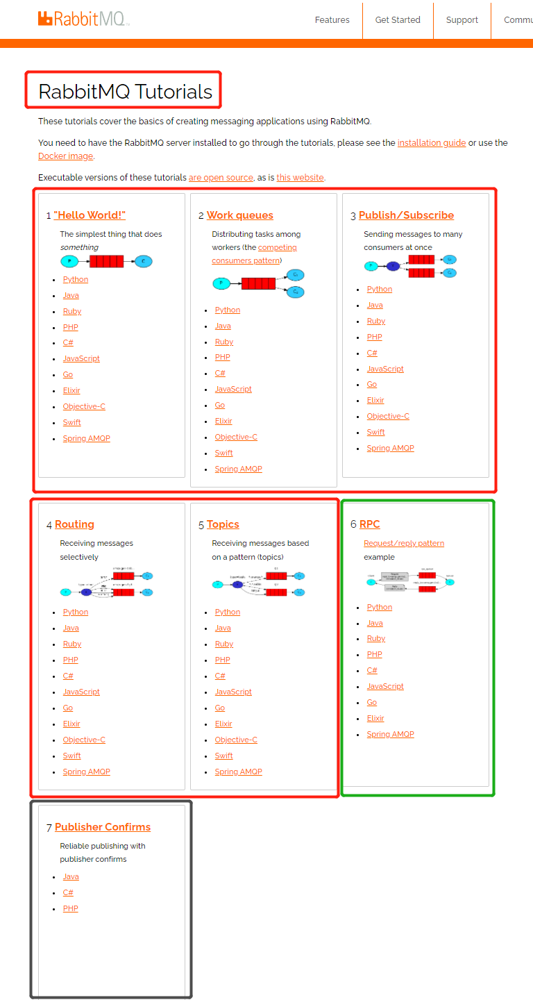

##### 5.2.2.4.1.Helloworld

又称为“直连”模型：如下图

P：provider：消息的生产者

C：consumer：消息的消费者

红色：queue：队列

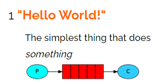

###### 5.2.2.4.1.1.生产者

步骤如下：

1. 创建连接MQ的连接工厂对象
2. 连接RabbitMQ主机
   1. 设置主机IP
   2. 设置主机端口号
   3. 连接主机中的MQ的虚拟主机
   4. 设置访问虚拟主机的用户和密码
3. 获取连接对象Connection
4. 获取连接中的通道channel
5. 使用通道channel声明绑定消息队列
6. 使用通道channel发布消息
7. 关闭资源

```java
public class Provider {

    //生产消息
    @Test
    public void testSendMessage() throws IOException, TimeoutException {
/*
        //创建连接mq的连接工厂对象
        ConnectionFactory connectionFactory = new ConnectionFactory();
        //设置连接rabbitmq主机
        connectionFactory.setHost("192.168.11.143");
        //设置端口号
        connectionFactory.setPort(5672);
        //设置连接那个虚拟主机
        connectionFactory.setVirtualHost("/ems");
        //设置访问虚拟主机的用户名和密码
        connectionFactory.setUsername("ems");
        connectionFactory.setPassword("123");

        //获取连接对象
        Connection connection = connectionFactory.newConnection();*/

        //通过工具类获取连接对象
        Connection connection = RabbitMQUtils.getConnection();

        //获取连接中通道
        Channel channel = connection.createChannel();

        //通道绑定对应消息队列
        //参数1:  队列名称 如果队列不存在自动创建
        //参数2:  用来定义队列特性是否要持久化 true 持久化队列   false 不持久化
        //参数3:  exclusive 是否独占队列  true 独占队列   false  不独占
        //参数4:  autoDelete: 是否在消费完成后自动删除队列  true 自动删除  false 不自动删除
        //参数5:  额外附加参数
        channel.queueDeclare("hello",true,false,false,null);

        //发布消息

        //参数1: 交换机名称 参数2:队列名称  参数3:传递消息额外设置  参数4:消息的具体内容
        channel.basicPublish("","hello", MessageProperties.PERSISTENT_TEXT_PLAIN,"hello rabbitmq".getBytes());


        /*channel.close();
        connection.close();*/

        //调用工具类
        RabbitMQUtils.closeConnectionAndChanel(channel,connection);


    }
}
```

注意点：管理后台的作用：

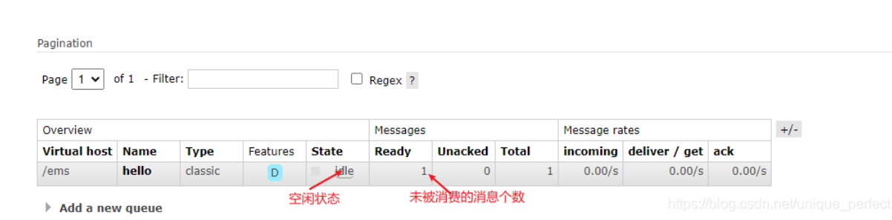

###### 5.2.2.4.1.2.消费者

步骤如下：

1. 创建连接MQ的连接工厂对象
   1. 设置连接mq的主机ip
   2. 设置主机端口号
   3. 设置连接虚拟机
   4. 设置访问虚拟主机的账户和密码
2. 获取连接对象Connection
3. 通过连接对象获取通道channel
4. 通过通道消费队列
5. 定义通道队列的消费者
6. 监听并消费消息

```java
public class Consumer {

    private final static String QUEUE_NAME = "q_test_01";

    public static void main(String[] argv) throws Exception {

        // 获取到连接以及mq通道
        Connection connection = ConnectionUtil.getConnection();
        // 从连接中创建通道
        Channel channel = connection.createChannel();
        // 声明队列
        channel.queueDeclare(QUEUE_NAME, false, false, false, null);

        // 定义队列的消费者
        QueueingConsumer consumer = new QueueingConsumer(channel);

        // 监听队列
        channel.basicConsume(QUEUE_NAME, true, consumer);

        // 获取消息
        while (true) {
            QueueingConsumer.Delivery delivery = consumer.nextDelivery();
            String message = new String(delivery.getBody());
            System.out.println(" [x] Received '" + message + "'");
        }
    }
}
```

###### 5.2.2.4.1.3.提取工具类

注意点：

1. 连接提取封装成工具类，避免大量冗余代码
2. 提取ConnectionFactory为静态资源，只在类加载的时候执行一次

```java
public class RabbitUtils{
  
  	private static ConnectionFactory connectionFactory;
    private static Properties properties;
    static{
        //重量级资源  类加载执行之执行一次
        connectionFactory = new ConnectionFactory();
        connectionFactory.setHost("192.168.42.134");
        connectionFactory.setPort(5672);
        connectionFactory.setVirtualHost("/");
        connectionFactory.setUsername("admin");
        connectionFactory.setPassword("admin");

    }

    //定义提供连接对象的方法
    public static Connection getConnection() {
        try {
            return connectionFactory.newConnection();
        } catch (Exception e) {
            e.printStackTrace();
        }
        return null;
    }

    //关闭通道和关闭连接工具方法
    public static void closeConnectionAndChanel(Channel channel, Connection conn) {
        try {
            if(channel!=null) channel.close();
            if(conn!=null)   conn.close();
        } catch (Exception e) {
            e.printStackTrace();

        }
    }
}
```

##### 5.2.2.4.2.work模型

work queues，也被称为task queues：任务模型。

当消息处理比较耗时的时候，消息的产生速度就会大于消息的消费速度。长此以往，消息就会被堆积，无法及时得到处理，越来越多，此时就需要work模型。

**work模型允许队列绑定多个消费者，共同消费消息，同时可以循环轮替处理消息，也可以能者多劳地处理消息。**

`默认情况下，RabbitMQ将按照消息的顺序发送给下一个消费者。并且每个消费者拿到的消息都是平均的，这种分发消息的方式叫做循环。`

假设出现，一个消费者接收到了消息之后，处理较慢，另外一个消费者处理消息较快，就会出现，一个消息者早早地就完成了消息的处理，另外一个却始终在慢慢地处理消息，这是我们不想看到的。因此我们希望处理快的同学做的事情多一些。

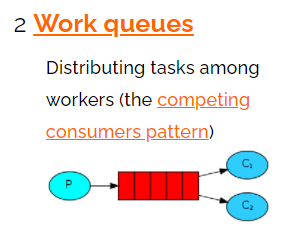

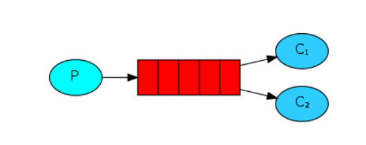

###### 5.2.2.4.2.1.消息确认机制

默认情况下，消息是自动确认的，消息在未出队列之前就已经确定好该由哪个消费者消费，为了避免这样的情况，关闭消息的自动确定，消息只有被消费了才会被确认。

###### 5.2.2.4.2.2.循环消费

###### 5.2.2.4.2.3.能者多劳

##### 5.2.2.4.3.广播模型

fanout：扇出：也被称为广播模型

在广播模式下，消息的发送：

1. 可以有多个消费者
2. 每个消费者有自己的队列queue
3. 每个队列绑定到Exchange交换机
4. 生产者发送的消息只能发送到交换机
5. 交换机决定发送给那个队列，生产者无法决定
6. 交换机把消息发送给绑定的所有队列
7. 绑定各个队列的消费者都能拿到消息，以此实现了一条消息可以被多个消费者消费


##### 5.2.2.4.4.Routing之订阅模型direct

在fanout模式下，一条消息会被所有订阅（绑定）的模型所消费，但是某种场景下，我们希望不同的消息会被不同的队列消费。这时候就需要Direct类型的Exchange交换机。

`在Direct模型下，队列与交换机的绑定需要制定一个RoutingKey（路由Key），同样生产者生产消息给exchange交换机的时候也需要制定routingKey。`

`exchange交换机会根据前后给定的routing key进行判断，只有队列queue的routing key和message的routing key完全一致，消费者才会接收到消息。`

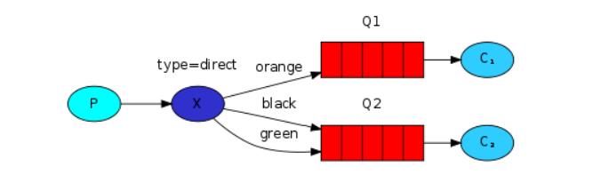

##### 5.2.2.4.5.动态路由topic

```txt
Topic类型的Exchange与Direct相比，都是可以根据RoutingKey
把消息路由到不同的队列。只不过Topic类型Exchange可以让
队列在绑定Routing key的时候使用通配符！这种模型Routingkey 
一般都是由一个或多个单词组成，多个单词之间以”.”分割，
例如： item.insert

# 统配符
		* (star) can substitute for exactly one word.    匹配不多不少恰好1个词
		# (hash) can substitute for zero or more words.  匹配零个、一个或多个词
# 如:
		audit.#    匹配audit、audit.irs 、或者audit.irs.corporate等
    audit.*   只能匹配 audit.irs
```


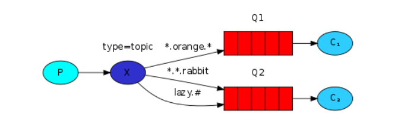

##### 5.2.2.4.6.RPC

##### 5.2.2.4.7.Publisher Confirms

#### 5.2.2.5整合SpringBoot

##### 5.2.2.5.1.导入依赖

```xml
<dependency>
  <groupId>org.springframework.boot</groupId>
  <artifactId>spring-boot-starter-amqp</artifactId>
</dependency>
```

##### 5.2.2.5.2.编写配置文件

```yaml
spring:
  application:
    name: springboot_rabbitmq
  rabbitmq:
    host: 10.15.0.9
    port: 5672
    username: ems
    password: 123
    virtual-host: /ems
```

##### 5.2.2.5.3.RabbitTemplate与注解

###### 5.2.2.5.3.1.helloworld

###### 5.2.2.5.3.2.work

###### 5.2.2.5.3.3.fanout

###### 5.2.2.5.3.4.direct

###### 5.2.2.5.3.5.topic

#### 5.2.2.6MQ的应用场景

##### 5.2.2.6.1.异步处理

场景说明：用户注册后，需要发注册邮件和注册短信

###### 5.2.2.6.1.1.串行方式

串行方式: 将注册信息写入数据库后,发送注册邮件,再发送注册短信,以上三个任务全部完成后才返回给客户端。 这有一个问题是,邮件,短信并不是必须的,它只是一个通知,而这种做法让客户端等待没有必要等待的东西. 

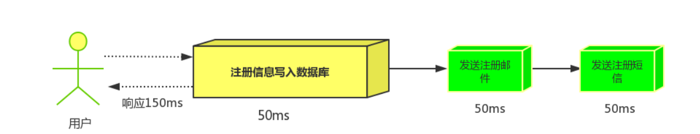

###### 5.2.2.6.1.2.并行方式

并行方式: 将注册信息写入数据库后,发送邮件的同时,发送短信, 以上三个任务完成后,返回给客户端,并行的方式能提高处理的时间。 

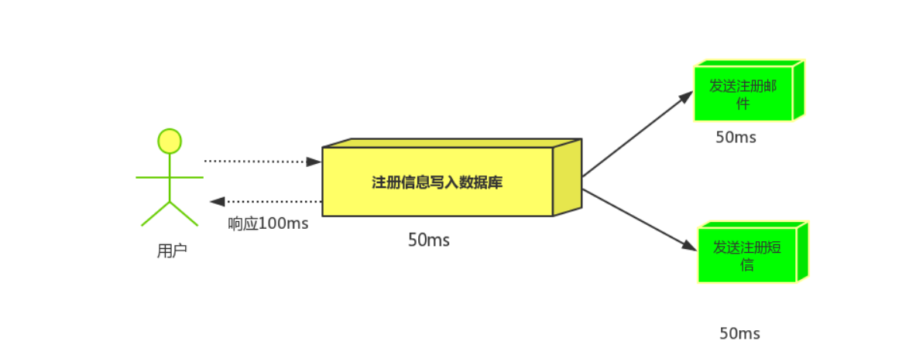

###### 5.2.2.6.1.3.使用消息队列

消息队列:假设三个业务节点分别使用50ms,串行方式使用时间150ms,并行使用时间100ms。虽然并行已经提高的处理时间,但是,前面说过,邮件和短信对我正常的使用网站没有任何影响，客户端没有必要等着其发送完成才显示注册成功,应该是写入数据库后就返回. 消息队列: 引入消息队列后，把发送邮件,短信不是必须的业务逻辑异步处理 
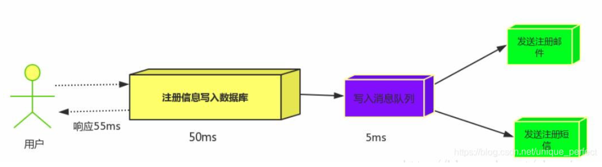

##### 5.2.2.6.2.应用解耦

场景：双11是购物狂节,用户下单后,订单系统需要通知库存系统,传统 的做法就是订单系统调用库存系统的接口. 


这种做法有一个缺点: 当库存系统出现故障时,订单就会失败。 订单系统和库存系统高耦合. --->引入消息队列 

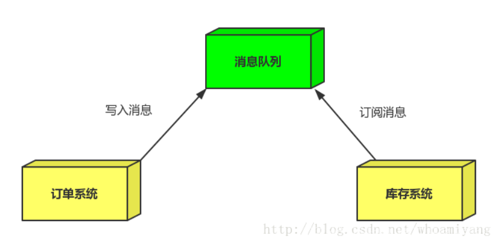

##### 5.2.2.6.3.流量削峰

场景: 秒杀活动，一般会因为流量过大，导致应用挂掉,为了解决这个 问题，一般在应用前端加入消息队列。  

`作用: 1.可以控制活动人数，超过此一定阀值的订单直接丢弃(我为什么 秒杀一次都没有成功过呢^^)  `

 `			2.可以缓解短时间的高流量压垮应用(应用程序按自己的最大处理能力 获取订单) `

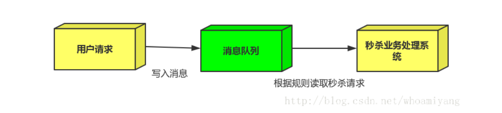

1. 用户的请求,服务器收到之后,首先写入消息队列,加入消息队列长度超过最大值,则直接抛弃用户请求或跳转到错误页面.  （这句话是否可以得出队列的长度是可以限定的？2022年1月12日00:14:25留下疑问）

2. 秒杀业务根据消息队列中的请求信息，再做后续处理.

#### 5.2.2.7RabbitMQ与Docker

#### 5.2.2.8RabbitMQ镜像集群

#### 5.2.2.9.RabbitMQ与数据结构

#### 5.2.2.10.RabbitMQ与持久化

#### 5.2.2.11.RabbitMQ与高并发

#### 5.2.2.12.RabbitMQ与内存分析？调优？（2022年1月12日00:20:36 大晚上就是爱多想哈？）

### 5.2.3RocketMQ

### 5.2.4ActiveMQ

### 5.2.5Kafka
