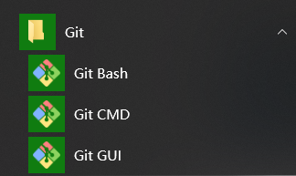
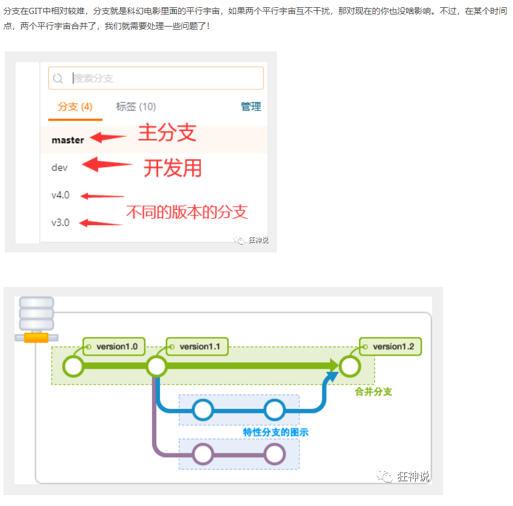
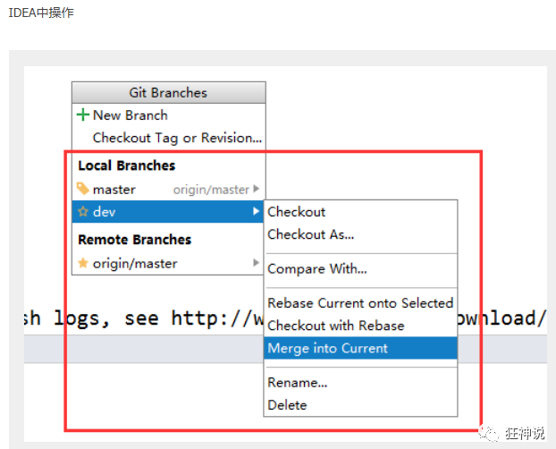
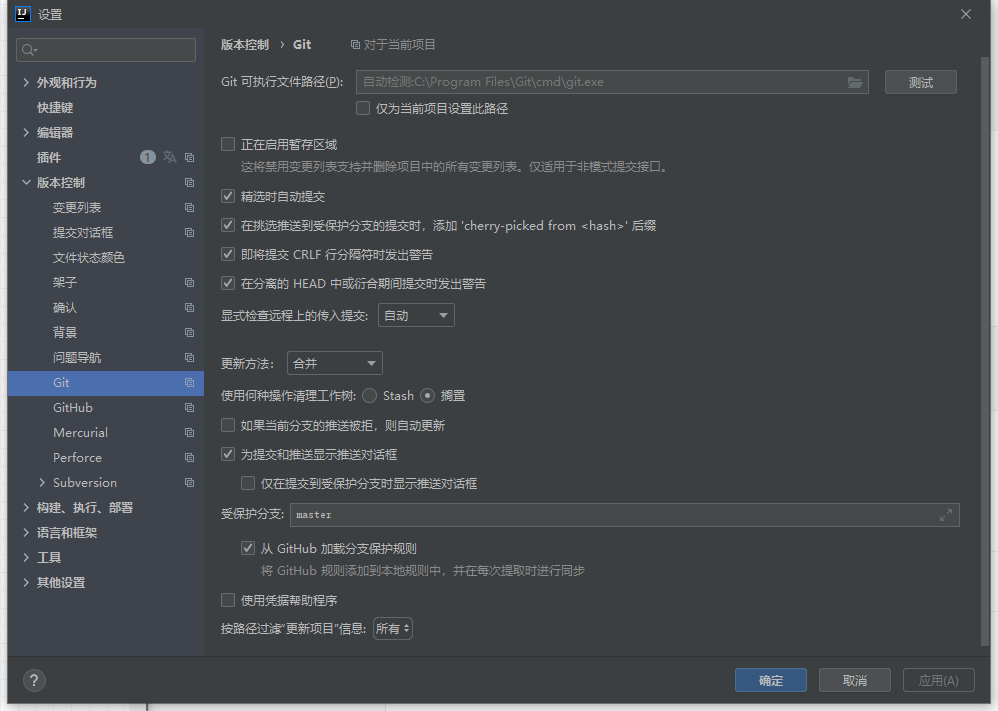

# 版本控制工具

# 一.版本控制

```xml
什么是版本控制？
版本控制（version control）是一种在开发的过程中用于管理我们对文件、目录或工程等内容的修改历史，方便查看更改历史记录，备份以便恢复以前的版本的软件工程技术。
```

# 二.为什么要进行版本控制

- 实现跨区域多人协同开发
- 追踪和记载一个或者多个文件的历史记录
- 组织和保护你的源代码和文档
- 统计工作量
- 并行开发、提高开发效率
- 跟踪记录整个软件的开发过程
- 减轻开发人员的负担，节省时间，同时降低人为错误

# 三.常见的版本控制工具

使用过

- **Git**
- **SVN**（Subversion）

未使用过

- **CVS**（Concurrent Versions System）
- **VSS**（Micorosoft Visual SourceSafe）
- **TFS**（Team Foundation Server）
- Visual Studio Online

# 四.根据版本控制分类区分常见的版本控制工具

## 1.本地版本控制


## 2.集中版本控制 SVN


## 3.分布式版本控制 Git


# 五.git和svn的区别

1. svn是集中式版本控制系统，版本库是放在中央服务器上，工作时候需要从中央服务器上拉取最新的版本，结束工作需要提交到中央服务器上；git是分布式版本控制系统，且git是目前世界上最先进的分布式版本控制系统，每个工作电脑都是一个完整的版本库。

2. 联网：svn务必联网才能使用，git并不是严格意义不需要联网，而是本地修改的文件，会在本地存有版本库，待联网之后即可同步至远程

# 六.Git

## 1.git官网

https://git-scm.com/

## 2.Git安装及环境变量配置

```xml
https://blog.csdn.net/sanxd/article/details/82624127?ops_request_misc=%25257B%252522request%25255Fid%252522%25253A%252522161147446516780271564307%252522%25252C%252522scm%252522%25253A%25252220140713.130102334.pc%25255Fall.%252522%25257D&request_id=161147446516780271564307&biz_id=0&utm_medium=distribute.pc_search_result.none-task-blog-2~all~first_rank_v2~rank_v29-2-82624127.pc_search_result_cache&utm_term=git%E5%AE%89%E8%A3%85
```

安装成功之后会出现这三个程序：如下图



**Git Bash：**Unix与Linux风格的命令行，使用最多，推荐最多

**Git CMD：**Windows风格的命令行

**Git GUI**：图形界面的Git，不建议初学者使用，尽量先熟悉常用命令

## 3.基本Linux命令的学习

```xml
1）cd : 改变目录。
2）cd . . 回退到上一个目录，直接cd进入默认目录
3）pwd : 显示当前所在的目录路径。
4）ls(ll): 都是列出当前目录中的所有文件，只不过ll(两个ll)列出的内容更为详细。
5）touch : 新建一个文件 如 touch index.js 就会在当前目录下新建一个index.js文件。
6）rm: 删除一个文件, rm index.js 就会把index.js文件删除。
7）mkdir: 新建一个目录,就是新建一个文件夹。
8）rm -r : 删除一个文件夹, rm -r src 删除src目录
   rm -rf /  切勿在Linux中尝试！删除电脑中全部文件！
9）mv 移动文件, mv index.html src index.html 是我们要移动的文件, src 是目标文件夹,当然, 这样写,必须保证文件和目标文件夹在同一目录下。
10）reset 重新初始化终端/清屏。
11）clear 清屏。
12）history 查看命令历史。
13）help 帮助。
14）exit 退出。
15）#表示注释
```

## 4.git的基本配置

```xml
git config -l 查看配置
git config --system --list
git config --global --list
```

```xml
设置本地用户名和邮箱
git config --global user.name "roc" #名字
git config --global user.email 1344471553@qq.com #邮箱
```

以上git配置均保存在本地文件中

git的配置：C:\Program Files\Git\etc


用户配置：C:\Users\13444\ .gitconfig

文件内容：


## 5.git的工作原理

### 1.三个/四个区域

- 工作区：workspace
- 暂存区：index/Stage
- 仓库区：History
- 远程仓库：Remote Directory


### 2.工作流程

```xml
１、在工作目录中添加、修改文件；
２、将需要进行版本管理的文件放入暂存区域；
３、将暂存区域的文件提交到git仓库。
```


3.常见的git命令

```xml
本地仓库搭建git init
远程克隆仓库git clone +  Url
```

### 3.git文件状态

- Untracked: 未跟踪, 此文件在文件夹中, 但并没有加入到git库, 不参与版本控制. 通过git add 状态变为Staged.
- Unmodify: 文件已经入库, 未修改, 即版本库中的文件快照内容与文件夹中完全一致. 这种类型的文件有两种去处, 如果它被修改, 而变为Modified. 如果使用git rm移出版本库, 则成为Untracked文件
- Modified: 文件已修改, 仅仅是修改, 并没有进行其他的操作. 这个文件也有两个去处, 通过git add可进入暂存staged状态, 使用git checkout 则丢弃修改过, 返回到unmodify状态, 这个git
  checkout即从库中取出文件, 覆盖当前修改 !
- Staged: 暂存状态. 执行git commit则将修改同步到库中, 这时库中的文件和本地文件又变为一致, 文件为Unmodify状态. 执行git reset HEAD filename取消暂存, 文件状态为Modified

### 4.git基本命令

#### 4.1.查看文件状态、提交日志、分支

##### 4.1.1.查看文件状态

```java
git status

git status fileName
```

##### 4.1.2.查看提交日志

```java
git log
```

##### 4.1.3.查看分支

```java
git branch
```

#### 4.2.分支操作

##### 4.2.1.查看当前分支

```java
git branch
```

##### 4.2.2.切换当前分支

```java
git checkout branchName
```

##### 4.2.3.新建分支

```java
git branch branchName
```

#### 4.3.添加文件

```java
git add. 添加所有文件到暂存区

git add fileName 添加指定文件到暂存区
    
git add [dir] 添加指定目录到暂存区，包括子目录
```

#### 4.4.提交文件

```java
git commit -m ""
```

#### 4.5.推送及拉取

##### 4.5.1.推送

```java
git push
```

##### 4.5.2.拉取

```java
git pull
```

#### 4.6.克隆仓库

```java
git clone 仓库地址
```

#### 4.7.初始化仓库

```java
git init
```

```xml
#查看指定文件状态
git status [filename]

#查看所有文件状态
git status

# git add .  添加所有文件到暂存区

# git commit -m "消息内容"    提交暂存区中的内容到本地仓库 -m 提交信息
```

#### 4.8.使用git命令合并单次提交或者多次提交至目标分支

使用cmd、powershell或者git bash进入命令行操作

```
1.get checkout 分支名字：切换分支
2.git log ：获取当前分支commit的log，查到commitID（如果知道ID，此步骤可以忽略）
切换至目标分支
3.git cherry-pick ids：将commit记录们合并到目标分支
4.git push：当前分支推送至远程
```

完成自己的修改提交至目标分支的操作。

***备注如果合并多次提交的话：***

==不建议使用多次提交，一旦需要合并代码，并不能清楚定位到哪些是已经被摘樱桃的，哪些没有被摘樱桃==

1. 多个id：git cherry-pick ids：id之间使用空格隔开，适用于多个不连续提交的id
2. 多个连续的ids：git cherry-pick （start，end]：不提交start
3. 多个连续的ids：git cherry-pick [start，end]：提交start

### 5.忽略不需要跟踪的文件

此项配置在.gitignore中

```xml
忽略文件
有些时候我们不想把某些文件纳入版本控制中，比如数据库文件，临时文件，设计文件等

在主目录下建立".gitignore"文件，此文件有如下规则：

忽略文件中的空行或以井号（#）开始的行将会被忽略。

可以使用Linux通配符。例如：星号（*）代表任意多个字符，问号（？）代表一个字符，方括号（[abc]）代表可选字符范围，大括号（{string1,string2,...}）代表可选的字符串等。

如果名称的最前面有一个感叹号（!），表示例外规则，将不被忽略。

如果名称的最前面是一个路径分隔符（/），表示要忽略的文件在此目录下，而子目录中的文件不忽略。

如果名称的最后面是一个路径分隔符（/），表示要忽略的是此目录下该名称的子目录，而非文件（默认文件或目录都忽略）。

#为注释
```

```xml
*.class
*.log
*.lock

#Package Files#
*.jar
*.war
*.ear
target/

#idea#
.idea/
*.iml
```

# 七.常见工具

## 1.GitHub

## 2.Gitee

### 1.官网：https://gitee.com/


### 2.免密码登录：SSH公钥

```xml
# 进入 C:\Users\Administrator\.ssh 目录
# gitBash生成公钥
ssh -keygen -t rsa
```

拿到公钥和私钥，把公钥和gitee绑定起来。

### 3.使用gitee创建一个远程仓库

## 3.GitHub：同理gitee

### 4.GitLab

#### 4.1新建项目仓库

- 添加项目成员及配置项目成员的权限

#### 4.2新建分支

- 根据业务需求合理创建分支以及未来项目迭代的分支管理

#### 4.3同步至本地

- 切换目标分支

- 添加过滤文件配置
- 添加项目初始化文件
- 格式化项目代码（使用IDEA全局格式化项目代码）

#### 4.4推送及提交至远程分支

# 八.分支是什么？



```xml
git分支中常用指令：

# 列出所有本地分支
git branch

# 列出所有远程分支
git branch -r

# 新建一个分支，但依然停留在当前分支

git branch [branch-name]

# 新建一个分支，并切换到该分支
git checkout -b [branch]

# 合并指定分支到当前分支
$ git merge [branch]

# 删除分支

$ git branch -d [branch-name]

# 删除远程分支
$ git push origin --delete [branch-name]

$ git branch -dr [remote/branch]
```



# 九.可视化工具

## 1.IDEA集成Git



## 2.TortoiseGit

## 3.SourceTree

## 4.TortoiseSVN

# 十.版本控制问题

## 10.1Git远程同步至本地

远程拉取至本地即可，本地有无代码都可，新建本地项目至git仓库中，即可建立联系，配置ssh密钥及进行后续的git操作。

## 10.2本地文件同远程仓库建立连接

前提：远程存在仓库/本地存在项目代码

解决方案：将项目代码直接拉取到本地项目目录中。建立仓库实现VCS版本控制


