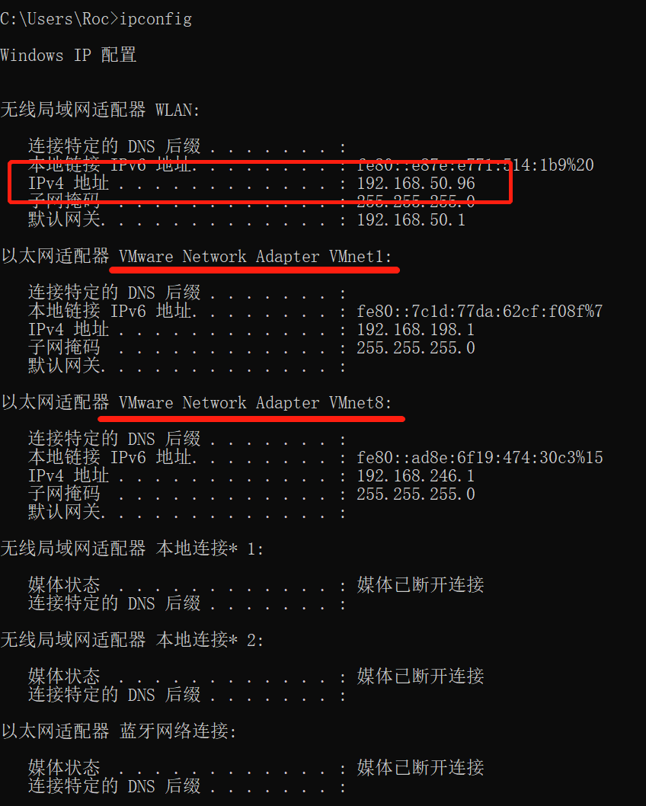

# RD_Network

注：本文穿插网络环境的相关知识

推荐书籍：计算机网络

## 一.NetWork基础知识

## 二.NetWork网络应用

## 三.NetWork常见问题及解决办法

### 3.1小操作

#### 3.1.1查看windows本机的IP地址

命令：Win+R：CMD：IPConfig

### 3.2常见问题及解决办法

#### 3.2.1解决某端口被占用

1.cmd

Win+R：netstat -ano | findstr 8080

pid：正在使用端口的进程

Win+R：taskkill -pid 1680 -f：解除1680进程的端口占用

再次验证8080端口是否在被占用

Win+R：netstat -ano | findstr 8080

如有占用继续关闭，然后结束操作，彻底关闭占用8080端口的进程。

