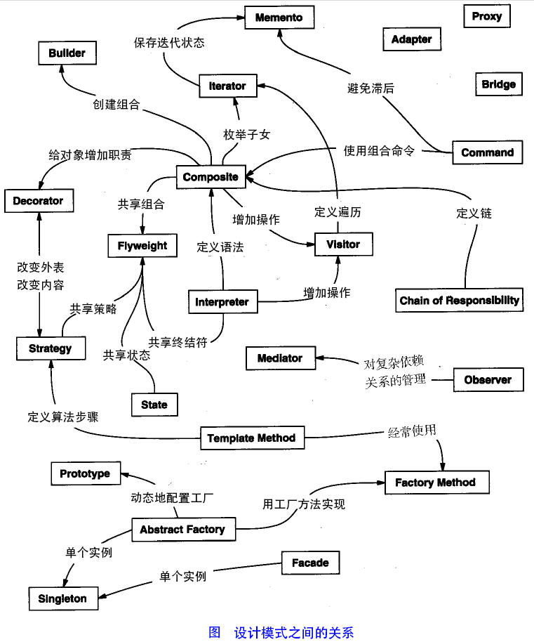
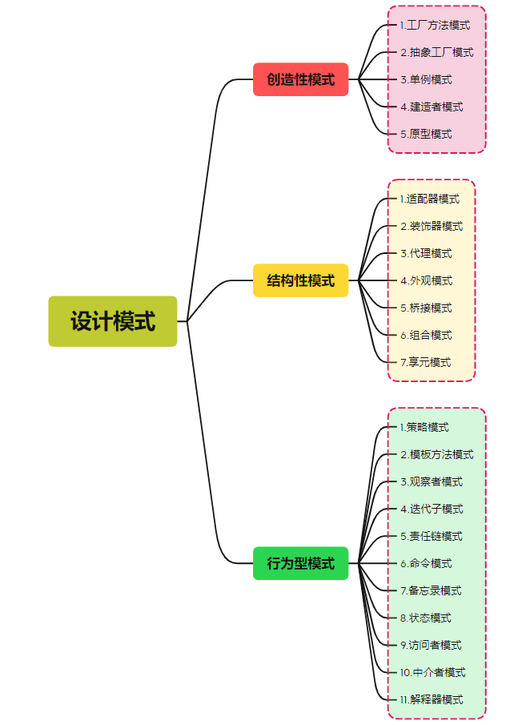

# 伟大的设计模式

注：参考链接:[软件设计模式概述 (biancheng.net)](http://c.biancheng.net/view/1317.html)

# 1.设计模式

## 1.1.设计模式的概念

​	软件设计模式，是一套被反复使用、多数人知晓的、经过分类目的、代码设计经验的总结。他描述了在软件设计过程中的一些不断重复发生的问题，以及该问题的解决方案。也就是说，它是解决特定问题的一系列讨论，是前辈们总结的代码设计经验的总结，具有一定的普遍性，可以反复使用。其目的是为了提供代码的可重用性、代码的可读性和代码的可靠性。

## 1.2.学习设计模式的意义

​	设计模式的本质是面向对象设计原则的实际运用，是对类的封装性、继承性和多态性以及类的关联关系和组合关系的充分理解。

​	正确使用设计模式具有一下优点：

1. 可以提高程序员的思维能力、编码能力和设计能力
2. 使程序设计更加标准化、代码编制更加工程化，使软件开发效率大大提高，从而缩短软件的开发周期
3. 使设计的代码可重用性高、可读性强、可靠性高、灵活性好、可维护性强。

​	设计模式具有很多的好处，尤其是对于程序员编码思维的提升，不过设计模式只是一个引导，再具体的软件开发过程中，必须根据设计的应用系统的特点和要求来恰当选择。对于简单的程序开发，可能一些简单的算法要比引入某种设计模式更加的容易，但对于大项目的开发或者框架设计，用设计模式来组织代码显然会更好。

## 1.3.设计模式的基本要素

​	软件设计模式使人们可以更加简单地复用成功的设计和体系结构，它通常包含以下几个要素：模式名称、别名、动机、问题、解决方案、效果、结构、模式角色、合作关系、实现方法、适用性、已知应用、例程、模式扩展和相关模式等，其中最关键的元素包括以下4个主要部分。

1. 模式名称

   每一个模式都有自己的名字，通过用一两个词来描述，可以根据模式的问题、特点、解决方案、功能或者效果来命名。模式名称可以帮助我们理解和记忆该设计模式，也方便我们讨论自己的设计。

2. 问题

   问题描述了该模式的应用环境，即何时使用该模式，它解释了设计问题和问题存在的前因后果，以及必须要满足的一些先决条件。

3. 解决方案

   模式问题的解决方案包括设计的组成成分。它们之间的相互关系及各自的职责和协作方式。因为模式就像一个模板，可应用与多种不同场合，所以解决方案并不描述一个特定而且具体设计或实现，而是提供设计问题的抽象描述和怎样用一个具有一般意义的元素组合（类或对象的组合）来解决这个问题。

4. 效果

   描述了模式的应用效果以及使用该模式应该权衡的问题，即模式的优缺点。主要是对时间和空间的衡量，以及该模式对系统的灵活性、扩充性、可移植性的影响，也考虑其实现问题。显示地列出这些效果对理解和评价这些模式有很大的帮助。

# 2.GoF：23种设计模式

计算机行业和建筑行业的关系很深。

软件工程可以说是引申于建筑工程。

同样，“设计模式”这个术语最初并不是出现在软件设计中的，而是被用于建筑领域的设计中的。

以1990年作为分界岭的话，在此之前，建筑界已经开展了多次关于设计相关的理论研究及落地，在此之后，软件工程界才开始讨论设计模式的话题，后面则就召开了很多次的关于设计模式的研讨会。

1995年，艾瑞克·伽马（ErichGamma）、理査德·海尔姆（Richard Helm）、拉尔夫·约翰森（Ralph Johnson）、约翰·威利斯迪斯（John Vlissides）等四位作者合作出版了《设计模式：可复用面向对象软件的基础》（Design Patterns: Elements of Reusable Object-Oriented Software）一书，总计收录了23个设计模式，这是软件设计模式领域的里程碑事件，导致了软件设计模式的突破。这四位作者在软件开发领域也以他们的“四人组”（Gang of Four，GoF）匿名著称。

**上面配图则就是帅帅的四人组。**

本章程暂定谈论狭义的23中经典设计模式。

注：设计模式是面向对象软件的，因此任何面向对象的语言都适用于此，而不仅仅只是java语言。

2022年1月14日17:24:08初探究java版本的设计模式。

# 2.七大设计原则

| 设计原则     | 一句话归纳                                                   | 目的                                       |
| ------------ | ------------------------------------------------------------ | ------------------------------------------ |
| 开闭原则     | 对扩展开放，对修改关闭                                       | 降低维护带来的新风险                       |
| 单一职责原则 | 一个类只干一件事，实现类要单一                               | 便于理解，提高代码的可读性                 |
| 接口隔离原则 | 一个接口只做一件事，接口要精简单一                           | 功能解耦，高内聚，低耦合                   |
| 依赖倒置原则 | 高层不应该依赖底层，底层面向接口编程                         | 更利于代码结构的升级扩展                   |
| 迪米特法则   | 不该知道的不要知道，一个类应该保持对其他对象最少的了解，降低耦合度 | 只和朋友说话，不和陌生人交流，减少代码臃肿 |
| 里氏替换原则 | 不要破坏集成体系，子类重写方法功能发生改变，不应该影响父类方法的含义 | 防止继承泛滥                               |
| 合成复用原则 | 尽量使用组合或者聚合关系实现代码复用，少使用继承             | 降低代码耦合                               |

## 2.1开闭原则

## 2.2依赖倒置原则

## 2.3单一职责原则

## 2.4接口隔离原则

## 2.5迪米特法则

## 2.6里氏替换原则

## 2.7合成复用原则

# 3.设计模式分类

# 4.23种设计模式

## 4.1.工厂方法模式

## 4.2.抽象工厂模式

## 4.3.单例模式

## 4.4.建造者模式

## 4.5.原型模式

## 4.6.适配器模式

## 4.7.装饰器模式

## 4.8.代理模式

## 4.9.外观模式

## 4.10.桥接模式

## 4.11.组合模式

## 4.12.享元模式

## 4.13.策略模式

## 4.14.模板方法模式

## 4.15.观察者模式

## 4.16.迭代子模式

## 4.17.责任链模式

## 4.18.命令模式

## 4.19.备忘录模式

## 4.20.状态模式

## 4.21.访问者模式

## 4.22.中介者模式

## 4.23.解释器模式
