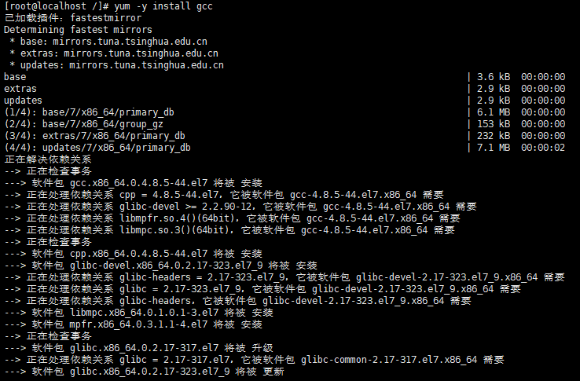
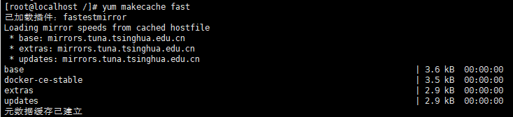
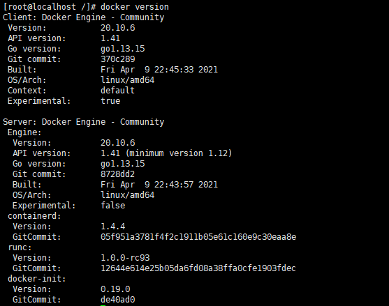
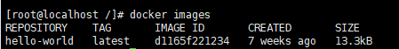
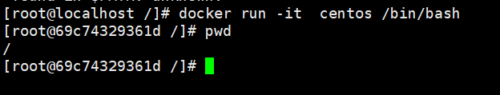
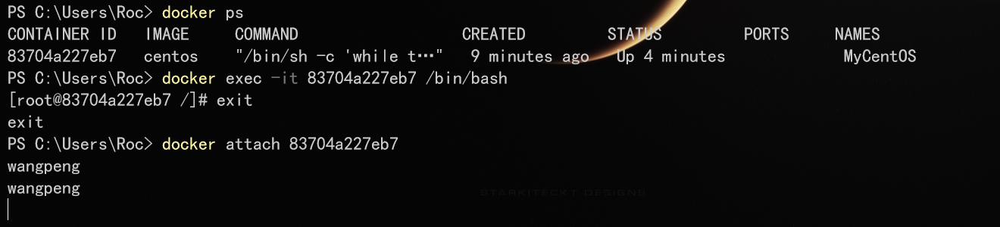

# Docker


## 1.Docker概述

### 1.1Docker为什么出现？

```xml
解决开发-上线需要重复进行环境配置的麻烦问题
```

### 1.2Docker的历史

[Docker_百度百科 (baidu.com)](https://baike.baidu.com/item/Docker)

### 1.3Docker官网及文档


官网：[Empowering App Development for Developers | Docker](https://www.docker.com/)

文档：[Docker Documentation | Docker Documentation](https://docs.docker.com/)

### 1.4Docker能做什么？

> 传统的虚拟机技术


传统虚拟机技术的缺点：

1、 资源占用十分多

2、 冗余步骤多

3、 启动很慢！

> 容器化技术


比较Docker和虚拟机技术的不同：

- 传统虚拟机，虚拟出一条硬件，运行一个完整的操作系统，然后在这个系统上安装和运行软件

- 容器化技术不是模拟一个完整的操作系统，容器内的应用直接运行在宿主机的内容，容器是没有自己的内核的，也没有虚拟我们的硬件，所以就轻便了

- 每个容器间是互相隔离，每个容器内都有一个属于自己的文件系统，互不影响

### 1.5Docker的优点

#### 1.5.1应用更快速的交付和部署

传统：一堆帮助文档，安装程序。

Docker：打包镜像发布测试一键运行。

#### 1.5.2更便捷的升级和扩缩容

使用了 Docker之后，我们部署应用就和搭积木一样 项目打包为一个镜像，扩展服务器A！服务器B

#### 1.5.3更简单的系统运维

在容器化之后，我们的开发，测试环境都是高度一致的

#### 1.5.4更高效的计算资源利用

Docker是内核级别的虚拟化，可以在一个物理机上可以运行很多的容器实例！服务器的性能可以被压榨到极致。

## 2.Docker安装

### 2.1Docker的组成

#### 2.1.1Docker架构图


#### 2.1.2Docker名词

##### 2.1.2.1镜像（image）

docker镜像就好比是一个目标，可以通过这个目标来创建容器服务，tomcat镜像==>run==>容器（提供服务器），通过这个镜像可以创建多个容器（最终服务运行或者项目运行就是在容器中的）。

##### 2.1.2.2容器（container）

Docker利用容器技术，独立运行一个或者一组应用，通过镜像来创建的. 启动，停止，删除，基本命令 目前就可以把这个容器理解为就是一个简易的 Linux系统。

##### 2.1.2.3仓库（repository）

仓库就是存放镜像的地方！ 仓库分为公有仓库和私有仓库。(很类似git)
Docker Hub是国外的。 阿里云…都有容器服务器(配置镜像加速!)

### 2.2Docker安装

#### 2.2.1Linux系统（CentOS07）下Docker安装

> 环境准备

1. linux系统（CentOs）
2. Xsheel

> 环境查看

```xml
[root@localhost ~]# uname -r
3.10.0-1160.el7.x86_64
```


```xml
[root@localhost ~]# cat /etc/os-release
```


Docker安装：可移步到RD_Linux教程中查看

官方参考手册：https://docs.docker.com/install/linux/docker-ce/centos/

相关准备卸载及安装：

**总过程：**

```xml
#1.卸载旧版本
yum remove docker \
                  docker-client \
                  docker-client-latest \
                  docker-common \
                  docker-latest \
                  docker-latest-logrotate \
                  docker-logrotate \
                  docker-engine
#2.需要的安装包
yum install -y yum-utils

#3.设置镜像的仓库--------替换阿里云的镜像
yum-config-manager \
    --add-repo \
    https://download.docker.com/linux/centos/docker-ce.repo
#上述方法默认是从国外的，不推荐

#推荐使用国内的
yum-config-manager \
    --add-repo \
    https://mirrors.aliyun.com/docker-ce/linux/centos/docker-ce.repo

#4. 更新yum软件包索引
yum makecache fast

#5.安装docker相关的 docker-ce 社区版 而ee是企业版
#  这里我们使用社区版即可
yum install docker-ce docker-ce-cli containerd.io 

#6.启动docker
systemctl start docker

#7. 配置阿里云加速器
7.1.
sudo mkdir -p /etc/docker

7.2.
sudo tee /etc/docker/daemon.json <<-'EOF'
{
  "registry-mirrors": ["https://7cfs6kw9.mirror.aliyuncs.com"]
}
EOF

7.3.
sudo systemctl daemon-reload

7.4.
sudo systemctl restart docker

#8. 使用docker version查看是否按照成功
docker version

#9. 测试
docker run hello-world
```

##### 2.2.1.1利用yum移除docker，卸载旧版本

```xml
yum remove docker \
          docker-client \
          docker-client-latest \
          docker-common \
          docker-latest \
          docker-latest-logrotate \
          docker-logrotate \
          docker-engine
```


##### 2.2.1.2安装yum相关组件

```xml
yum install -y yum-utils device-mapper-persistent-data lvm2
```


##### 2.2.1.3yum安装gcc相关（需要确保 虚拟机可以上外网 ）

```xml
yum -y install gcc
yum -y install gcc-c++
```




##### 2.2.1.4切换docker的阿里云镜像

```xml
切换yum的引包为阿里云的镜像
yum-config-manager --add-repo http://mirrors.aliyun.com/docker-ce/linux/centos/docker-ce.repo
```


##### 2.2.1.5更新yum的软件包索引

```xml
yum makecache fast
```



##### 2.2.1.6安装docker CE

```xml
yum -y install docker-ce docker-ce-cli containerd.io
```


##### 2.2.1.7启动Docker服务

systemctl start docker

##### 2.2.1.8配置阿里云加速器

```xml
1.
sudo mkdir -p /etc/docker

2.
sudo tee /etc/docker/daemon.json <<-'EOF'
{
  "registry-mirrors": ["https://7cfs6kw9.mirror.aliyuncs.com"]
}
EOF

3.
sudo systemctl daemon-reload

4.
sudo systemctl restart docker
```

##### 2.2.1.9查看docker版本

```xml
docker version
```



##### 2.2.1.10运行hello-world

```xml
docker run hello-world
```


##### 2.2.1.11列出本地镜像

```xml
docker images : 列出本地镜像。
```



#### 2.2.2windows系统下Docker安装

##### 2.2.2.1下载Docker Desktop

1. 下载

- 官方地址下载Docker Desktop官方https://docs.docker.com/docker-for-windows/install/（推荐==Windows10以上==用户使用）

- Docker Toolboxhttp://mirrors.aliyun.com/docker-toolbox/windows/docker-toolbox/（推荐==Windows10==以下用户使用）

2. 下载WSL

- https://docs.microsoft.com/en-us/windows/wsl/install-win10#step-4---download-the-linux-kernel-update-package

3. 打开“启动或关闭Windows服务"中”适用于Linux的Windows子系统“

4. 先安装WSL，继续安装Windows版docker Desktop

5. 配置阿里云Docker镜像加速器

   在系统右下角托盘图标内右键菜单选择 Settings，打开配置窗口后左侧导航菜单选择 Docker Daemon。编辑窗口内的JSON串，填写下方加速器地址：

```
{
  "registry-mirrors": ["https://7cfs6kw9.mirror.aliyuncs.com"]
}
```

 编辑完成后点击 Apply 保存按钮，等待Docker重启并应用配置的镜像加速器。

### 2.3卸载docker

```xml
#1. 卸载依赖
yum remove docker-ce docker-ce-cli containerd.io
#2. 删除资源
rm -rf /var/lib/docker
# /var/lib/docker 是docker的默认工作路径！
```

### 2.4hello-world运行流程


### 2.5Docker运行原理

Docker是一个Client-Server结构的系统，Docker的守护进程运行在主机上。通过Socket从客户端访问！

Docker-Server接收到Docker-Client的指令，就会执行这个命令！


### 2.6Docker为什么比VM快？


1、docker有着比虚拟机更少的抽象层。由于docker不需要Hypervisor实现硬件资源虚拟化,运行在docker容器上的程序直接使用的都是实际物理机的硬件资源。因此在CPU、内存利用率上docker将会在效率上有明显优势。
2、docker利用的是宿主机的内核,而不需要Guest OS。

因此,当新建一个 容器时,docker不需要和虚拟机一样重新加载一个操作系统内核。仍而避免引导、加载操作系统内核返个比较费时费资源的过程,当新建一个虚拟机时,虚拟机软件需要加载GuestOS,返个新建过程是**分钟级**
别的。而docker由于直接利用宿主机的操作系统,则省略了这个复杂的过程,因此新建一个docker容器只需要**几秒钟**。

## 3.Docker命令

### 3.1Docker帮助命令

#### 3.1docker version：Docker版本

````xml
docker version
````


#### 3.2docker info：docker信息

```xml
docker info
```


#### 3.3docker 命令 --help：docker某个命令的帮助命令

```xml
docker 命令 --help
```


```dockerfile
docker --help
```


### 3.2镜像命令

#### 3.2.1docker images查看所有镜像地址

```xml 
docker images
```


```xml
[root@localhost ~]# docker images
REPOSITORY    TAG       IMAGE ID       CREATED       SIZE
hello-world   latest    d1165f221234   7 weeks ago   13.3kB
# repository：仓库源
# tag		：镜像标签
# IMAGE ID	：镜像ID
# CREATED	：创建时间
# SIZE		：大小
```

选项：

```xml
Options:
  -a, --all             Show all images (default hides intermediate images) //展示所有的镜像

  -f, --filter filter   Filter output based on conditions provided			//过滤器
  -q, --quiet           Only show image IDs									//只展示镜像ID
```


#### 3.2.2搜索镜像

```xml
docker search 镜像名称
```


```xml
docker search mysql
```

添加过滤器：


#### 3.2.3下载镜像

```xml
docker pull 镜像名字
```


实例：

```xml
[root@localhost ~]# docker pull mysql		//拉取mysql的docker镜像
Using default tag: latest		//如果不配置tag，默认为latest
latest: Pulling from library/mysql		//分层下载(联合文件系统)
f7ec5a41d630: Pull complete 
9444bb562699: Pull complete 
6a4207b96940: Pull complete 
181cefd361ce: Pull complete 
8a2090759d8a: Pull complete 
15f235e0d7ee: Pull complete 
d870539cd9db: Pull complete 
493aaa84617a: Pull complete 
bfc0e534fc78: Pull complete 
fae20d253f9d: Pull complete 
9350664305b3: Pull complete 
e47da95a5aab: Pull complete 
Digest: sha256:04ee7141256e83797ea4a84a4d31b1f1bc10111c8d1bc1879d52729ccd19e20a			//签名
Status: Downloaded newer image for mysql:latest
docker.io/library/mysql:latest		//真实地址
```

```xml
docker pull mysql:5.7
```


文件分层系统表示部分文件在之前最新的版本中已经下载了，仅下载不同的文件。


#### 3.2.4删除镜像

```xml
docker rmi 镜像名称
```


```xml
#根据所有的ID删除全部镜像
docker rmi -f $(docker images - aq)

#-f：强制删除
```


```xml
#单次根据ID删除单个docker镜像
docker rmi -f:镜像iD
#单次根据ID删除单个docker镜像
docker rmi -f 镜像ID 镜像ID...
```


### 3.3容器命令

```xml
# 拉取centOS镜像
docker pull centos
```


#### 3.3.1新建容器，且进入容器

```xml
# 新建容器并启动
docker run -it centos /bin/bash
```




选项及参数：

```xml
docker run [可选参数] image | docker container run [可选参数] image 
#参数说明
--name="Name"		#容器名字 tomcat01 tomcat02 用来区分容器
-d					#后台方式运行
-it 				#使用交互方式运行，进入容器查看内容
-p					#指定容器的端口 -p 8080(宿主机):8080(容器)
		-p ip:主机端口:容器端口
		-p 主机端口:容器端口(常用)
		-p 容器端口
		容器端口
-P(大写) 				随机指定端口
```


#### 3.3.2查看正在运行或者曾经运行过的容器

```xml
docker ps -a
```


选项及参数：

```xml
docker ps 命令  		#列出当前正在运行的容器
  -a, --all     	 #列出当前正在运行的容器 + 带出历史运行过的容器
  -n=?, --last int   #列出最近创建的?个容器 ?为1则只列出最近创建的一个容器,为2则列出2个
  -q, --quiet        #只列出容器的编号
```

#### 3.3.3退出容器

```xml
# 关闭容器且退出
exit
# 不关闭容器直接退出
ctrl+P+Q
```


#### 3.3.4删除容器

```xml
docker rm 容器ID以上不能删除正在运行的容器
强制删除所有的容器
docker rm -f $(docker ps -aq)
```


#### 3.3.5启动及停止容器

```xml
docker start 容器id	#启动容器
docker restart 容器id	#重启容器
docker stop 容器id	#停止当前正在运行的容器
docker kill 容器id	#强制停止当前容器
```


注：进入容器

```xml
docker exec -it 容器ID /bin/bash
```


#### 3.3.6后台启动容器

```xml
docker run -d centos
```


**发现服务直接关闭且退出了**

*# 问题docker ps. 发现centos 停止了*

*# 常见的坑，docker容器使用后台运行，就必须要有要一个前台进程，docker发现没有应用，就会自动停止*

#### 3.3.7查看日志

```xml
docker logs --help
Options:
      --details        Show extra details provided to logs 
*  -f, --follow         Follow log output
      --since string   Show logs since timestamp (e.g. 2013-01-02T13:23:37) or relative (e.g. 42m for 42 minutes)
*      --tail string    Number of lines to show from the end of the logs (default "all")
*  -t, --timestamps     Show timestamps
      --until string   Show logs before a timestamp (e.g. 2013-01-02T13:23:37) or relative (e.g. 42m for 42 minutes)
```


#### 3.3.8查看进程

```xml
docker top 容器ID

[root@localhost /]# docker top 3182b2636434 
UID                 PID                 PPID                C                   STIME               TTY                 TIME                CMD
root                51361               51339               0                   22:16               pts/0               00:00:00            /bin/bash

```

#### 3.3.9查看元数据

```xml
docker inspect 容器ID
```

```xml
PS C:\Users\Roc> docker inspect 83704a227eb7
[
    {
        "Id": "83704a227eb7ee0d3612d9c3a793b86e3749a141ab80d17e307a0d5036c8f4c8",
        "Created": "2021-04-28T06:22:34.2330364Z",
        "Path": "/bin/sh",
        "Args": [
            "-c",
            "while true;do echo wangpeng;sleep 1;done"
        ],
        "State": {
            "Status": "running",
            "Running": true,
            "Paused": false,
            "Restarting": false,
            "OOMKilled": false,
            "Dead": false,
            "Pid": 3165,
            "ExitCode": 0,
            "Error": "",
            "StartedAt": "2021-04-28T06:22:34.8301202Z",
            "FinishedAt": "0001-01-01T00:00:00Z"
        },
        "Image": "sha256:300e315adb2f96afe5f0b2780b87f28ae95231fe3bdd1e16b9ba606307728f55",
        "ResolvConfPath": "/var/lib/docker/containers/83704a227eb7ee0d3612d9c3a793b86e3749a141ab80d17e307a0d5036c8f4c8/resolv.conf",
        "HostnamePath": "/var/lib/docker/containers/83704a227eb7ee0d3612d9c3a793b86e3749a141ab80d17e307a0d5036c8f4c8/hostname",
        "HostsPath": "/var/lib/docker/containers/83704a227eb7ee0d3612d9c3a793b86e3749a141ab80d17e307a0d5036c8f4c8/hosts",
        "LogPath": "/var/lib/docker/containers/83704a227eb7ee0d3612d9c3a793b86e3749a141ab80d17e307a0d5036c8f4c8/83704a227eb7ee0d3612d9c3a793b86e3749a141ab80d17e307a0d5036c8f4c8-json.log",
        "Name": "/MyCentOS",
        "RestartCount": 0,
        "Driver": "overlay2",
        "Platform": "linux",
        "MountLabel": "",
        "ProcessLabel": "",
        "AppArmorProfile": "",
        "ExecIDs": null,
        "HostConfig": {
            "Binds": null,
            "ContainerIDFile": "",
            "LogConfig": {
                "Type": "json-file",
                "Config": {}
            },
            "NetworkMode": "default",
            "PortBindings": {},
            "RestartPolicy": {
                "Name": "no",
                "MaximumRetryCount": 0
            },
            "AutoRemove": false,
            "VolumeDriver": "",
            "VolumesFrom": null,
            "CapAdd": null,
            "CapDrop": null,
            "CgroupnsMode": "host",
            "Dns": [],
            "DnsOptions": [],
            "DnsSearch": [],
            "ExtraHosts": null,
            "GroupAdd": null,
            "IpcMode": "private",
            "Cgroup": "",
            "Links": null,
            "OomScoreAdj": 0,
            "PidMode": "",
            "Privileged": false,
            "PublishAllPorts": false,
            "ReadonlyRootfs": false,
            "SecurityOpt": null,
            "UTSMode": "",
            "UsernsMode": "",
            "ShmSize": 67108864,
            "Runtime": "runc",
            "ConsoleSize": [
                30,
                120
            ],
            "Isolation": "",
            "CpuShares": 0,
            "Memory": 0,
            "NanoCpus": 0,
            "CgroupParent": "",
            "BlkioWeight": 0,
            "BlkioWeightDevice": [],
            "BlkioDeviceReadBps": null,
            "BlkioDeviceWriteBps": null,
            "BlkioDeviceReadIOps": null,
            "BlkioDeviceWriteIOps": null,
            "CpuPeriod": 0,
            "CpuQuota": 0,
            "CpuRealtimePeriod": 0,
            "CpuRealtimeRuntime": 0,
            "CpusetCpus": "",
            "CpusetMems": "",
            "Devices": [],
            "DeviceCgroupRules": null,
            "DeviceRequests": null,
            "KernelMemory": 0,
            "KernelMemoryTCP": 0,
            "MemoryReservation": 0,
            "MemorySwap": 0,
            "MemorySwappiness": null,
            "OomKillDisable": false,
            "PidsLimit": null,
            "Ulimits": null,
            "CpuCount": 0,
            "CpuPercent": 0,
            "IOMaximumIOps": 0,
            "IOMaximumBandwidth": 0,
            "MaskedPaths": [
                "/proc/asound",
                "/proc/acpi",
                "/proc/kcore",
                "/proc/keys",
                "/proc/latency_stats",
                "/proc/timer_list",
                "/proc/timer_stats",
                "/proc/sched_debug",
                "/proc/scsi",
                "/sys/firmware"
            ],
            "ReadonlyPaths": [
                "/proc/bus",
                "/proc/fs",
                "/proc/irq",
                "/proc/sys",
                "/proc/sysrq-trigger"
            ]
        },
        "GraphDriver": {
            "Data": {
                "LowerDir": "/var/lib/docker/overlay2/6bff8239a23b0d6dbaee6c056e9a49761c0bcadd219c63f86337a4c34925df04-init/diff:/var/lib/docker/overlay2/e1569ae1453d6de27824ec8bc02fbf6cab4ddc4cf1f4f625ed2235327216d9d4/diff",
                "MergedDir": "/var/lib/docker/overlay2/6bff8239a23b0d6dbaee6c056e9a49761c0bcadd219c63f86337a4c34925df04/merged",
                "UpperDir": "/var/lib/docker/overlay2/6bff8239a23b0d6dbaee6c056e9a49761c0bcadd219c63f86337a4c34925df04/diff",
                "WorkDir": "/var/lib/docker/overlay2/6bff8239a23b0d6dbaee6c056e9a49761c0bcadd219c63f86337a4c34925df04/work"
            },
            "Name": "overlay2"
        },
        "Mounts": [],
        "Config": {
            "Hostname": "83704a227eb7",
            "Domainname": "",
            "User": "",
            "AttachStdin": false,
            "AttachStdout": false,
            "AttachStderr": false,
            "Tty": false,
            "OpenStdin": false,
            "StdinOnce": false,
            "Env": [
                "PATH=/usr/local/sbin:/usr/local/bin:/usr/sbin:/usr/bin:/sbin:/bin"
            ],
            "Cmd": [
                "/bin/sh",
                "-c",
                "while true;do echo wangpeng;sleep 1;done"
            ],
            "Image": "centos",
            "Volumes": null,
            "WorkingDir": "",
            "Entrypoint": null,
            "OnBuild": null,
            "Labels": {
                "org.label-schema.build-date": "20201204",
                "org.label-schema.license": "GPLv2",
                "org.label-schema.name": "CentOS Base Image",
                "org.label-schema.schema-version": "1.0",
                "org.label-schema.vendor": "CentOS"
            }
        },
        "NetworkSettings": {
            "Bridge": "",
            "SandboxID": "25f9011f445fdf93258bb3adf1b23977f4055a4cc83ca0c6b64e135eb4a3a874",
            "HairpinMode": false,
            "LinkLocalIPv6Address": "",
            "LinkLocalIPv6PrefixLen": 0,
            "Ports": {},
            "SandboxKey": "/var/run/docker/netns/25f9011f445f",
            "SecondaryIPAddresses": null,
            "SecondaryIPv6Addresses": null,
            "EndpointID": "02c97e8591ecaaa213ed2ebd7aa475b8ade1d7c535d364dc70dd9ce1a9a932dd",
            "Gateway": "172.17.0.1",
            "GlobalIPv6Address": "",
            "GlobalIPv6PrefixLen": 0,
            "IPAddress": "172.17.0.2",
            "IPPrefixLen": 16,
            "IPv6Gateway": "",
            "MacAddress": "02:42:ac:11:00:02",
            "Networks": {
                "bridge": {
                    "IPAMConfig": null,
                    "Links": null,
                    "Aliases": null,
                    "NetworkID": "ccc614bf1a4d22d1981ff2d004594878081e550f7345fe879ad41ddf77802f6c",
                    "EndpointID": "02c97e8591ecaaa213ed2ebd7aa475b8ade1d7c535d364dc70dd9ce1a9a932dd",
                    "Gateway": "172.17.0.1",
                    "IPAddress": "172.17.0.2",
                    "IPPrefixLen": 16,
                    "IPv6Gateway": "",
                    "GlobalIPv6Address": "",
                    "GlobalIPv6PrefixLen": 0,
                    "MacAddress": "02:42:ac:11:00:02",
                    "DriverOpts": null
                }
            }
        }
    }
]
```

#### 3.3.10进入当前运行的容器


目前正在运行“MyCentOS”的容器

```xml
进入容器开启一个新的终端，可以在里面进行操作
docker exec -it 容器ID /bin/bash
```


```xml
进入正在运行的容器
docker attach 容器ID
```



#### 3.3.11将容器内的文件拷贝到主机上

```xml
docker cp 容器ID:文件路径/文件名称 /目标路径
```


拷贝命令是手动动作，未来可实现自动拷贝

#### 3.N命令小结


## 4.（Windows/Linux）+Docker+N--以linux试验

### 4.N内网+外网？内网穿透？


### 4.1安装Nginx

```xml
查看Nginx的docker版本
docker search Nginx

拉取最新的Nginx
docker pull Nginx

创建“Nginx01”的容器，并在后台运行，更改外部端口访问为3344
docker run -d --name Nginx01 Nginx -p 3344:80 /bin/bash

查看运行中的容器
docker ps

进入“Nginx01”的容器
docker attach 容器ID

外网访问
```


### 4.2安装Tomcat

```xml
查看tomcat的docker版本
docker search tomcat

拉取最新的Tomcat
docker pull tomcat

创建“tomcat01”的tomcat容器
docker run -itd --name tomcat01 -p 3355:8080 tomcat

# 测试是否连通

进入正在运行的“tomcat01”容器
docker exec -it tomcat01 /bin/bash
```


但是出问题了：


进入容器：


重新进入页面：


docker中安装tomcat成功

## 5.容器数据卷

## 6.DockerFile

## 7.Docker网络原理

## 8.IDEA整合docker

## 9.DockerCompose

## 10.DockerSwarm（简化版K8S）

## 11.CI/CD

## 12.docker问题

### 12.1安装docker install -windows报错


解决方案：

1. windows服务--开启WSL（适用于Linux的Windows子系统）


2.
下载WSL2且安装：https://docs.microsoft.com/en-us/windows/wsl/install-win10#step-4---download-the-linux-kernel-update-package
3. 重启docker desktop。

