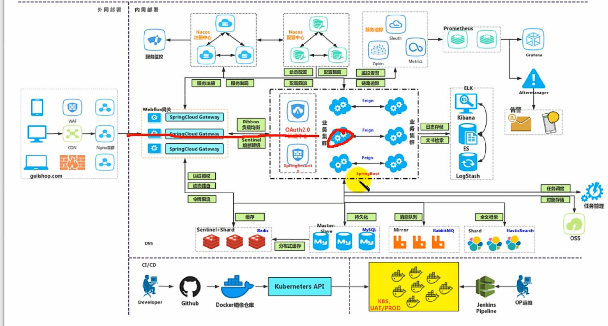
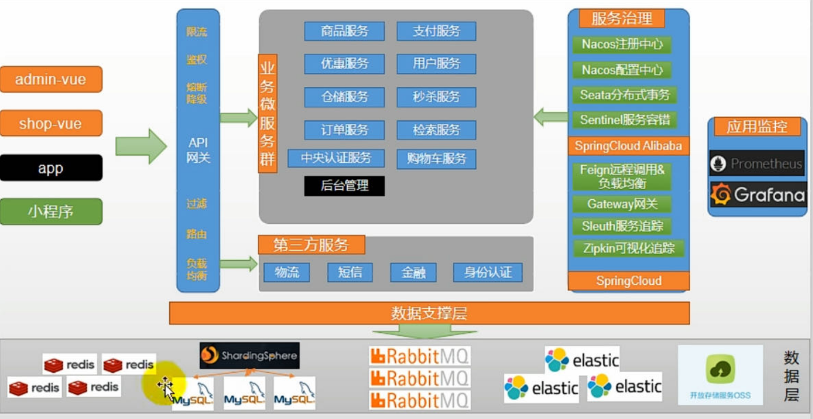
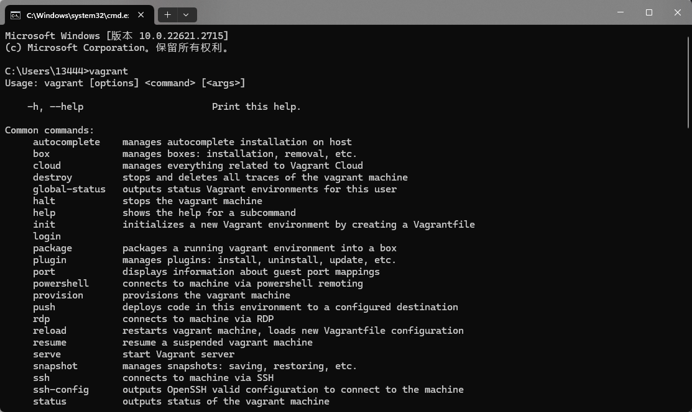
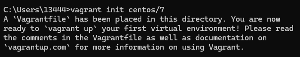
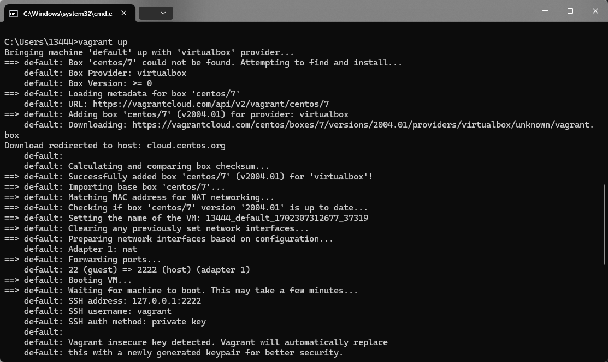

# GrainMall

# 一.分布式基础概念

## 1.微服务

微服务架构风格，就像把一个单独的应用程序开发为一套小服务，每个小服务运行在自己的进程中，并使用轻量级别机制通信，通常是Http API调用。这些服务围绕业务能力来构建，并通过完全自动化部署机制来独立部署。这些服务使用不同的编程语言书写，以及不同的数据存储技术，并保持最低限度的集中式管理。

*简而言之，拒绝大型单体应用，基于业务边界进行服务微化拆分，各个服务独立部署运行。*

## 2.集群、分布式、节点

集群是个物理形态，分布式是个工作方式。

只要是一对机器，就可以叫集群。至于他们是不是一起协作干活，这个谁也不知道。


《分布式系统原理与泛型》定义：“分布式系统是若干独立计算机的集合，这些计算机对于用户来说就像是个单个相关系统”。分布式系统是建立在网络之上的软件系统。

分布式是将不同的业务分布在不同的地方。

集群指的是将几台服务器集中在一起，实现同一业务。

分布式中的每一个节点都可以做集群，但集群并不一定就是分布式的。

节点：集群中的一个服务器。

## 3.远程调用

在分布式系统中，各个服务可能处于不同主机，但服务之间不可避免的需要互相调用，称之为远程调用。

SpringCloud中推荐使用HTTP+JSON的方式完成远程调用。

其中HTTP和JSON都是可以实现跨平台的调用方式。

## 4.负载均衡

为了不让每一台服务器太忙或者太闲，可以“负载均衡”地调用每一个服务器，提升网站的健壮性。


例如：分布式系统中，A服务需要调用B服务，B服务在多台机器中都存在，A调用任意一个服务器均可完成功能。

常见的负载均衡算法：

1. 轮询：为第一个请求选择健康池中的第一个后端服务器，然后按顺序往后依次选择，直到最后一个，然后循环。
2. 最小连接：优先选择连接数最少，也就是压力最小的后端服务器，在会话较长的情况下可以考虑采用这种方式。
3. 散列：根据请求源的IP散列值来选择要转发的服务器，这种方式可以一定程度上保证特点用户能连接到相同的服务器。如果你的应用需要处理状态而要求用户能连接到和之前相同的服务器，可以采用这种方式。

## 5.服务注册、发现&&注册中心

A服务调用B服务，A服务并不知道B服务当前在哪几台服务器上有，哪些正常的，哪些服务已经下线。解决此问题，可以引入注册中心。


如果某些服务下线，我们其他人可以实时的感知到其他服务的状态，从未避免调用不可用的服务。

## 6.配置中心

每一个服务最终都有大量的配置，并且每个服务都可能部署在多台机器上。我们经常需要变更配置，我们可以让每个服务在配置中心获取自己的配置。

**配置中心用来集中管理微服务的配置信息。**

## 7.服务熔断&服务降级

在微服务架构中，微服务之间通过网络进行通信，存在互相依赖，当其中一个服务不可用时，有可能造成雪崩效应。要防止这样的情况，必须要有容错机制来保护服务。

***<u>一个服务不可用，可能造成整个服务调用链造成阻塞。</u>***

例如：对于一个高并发请求，第一个请求进来需要等待（阻塞），持续占用资源，第二、第三个同样，当更多的请求进入时就会导致整个整个服务器资源耗尽，**一个服务的不可用，导致整个服务器资源的不可用，从而导致整个服务的雪崩现象。**

### 7.1.服务熔断

**服务熔断：服务的短路保护机制**

​	设置服务的超时，当被调用的服务经常失败达到某个阈值，可以开启断路保护机制，后来的请求不再去调用这个服务。本地直接返回默认的数据。

### 7.2.服务降级

​	在运维期间，当系统处于高峰期，系统资源紧张，可以让非核心业务降级运行。

​	降级：某些服务不处理，或者简单处理，常见的处理方式有：抛异常、返回NULL、调用MOCK数据、调用Fallback处理逻辑。

## 8.API网关

在微服务架构中，APIGateway作为整个架构的重要组件，它抽象了微服务中都需要的公共功能，同时提供了客户端负载均衡、服务自动熔断、灰度发布、统一认证、限流流控、日志统计等丰富的功能，帮助我们解决很多的API管理难题

限流流控：以恒定的速率将请求发送给服务，避免短时内流量高发。

# 二.微服务架构图



# 三.微服务划分图



# 四.项目环境搭建

## 4.1.虚拟机

推荐使用VMware、virtualBox

推荐使用virtualBox+vagrant

### 4.1.1.vagrant命令

常用命令：

```
vagrant --version                # 查看 vagrant 版本

vagrant box list                 # 查看 box 列表
vagrant box add [boxname] [url]  # 添加 box
vagrant box remove [boxname]     # 移除 box
vagrant box update               # 更新 box
vagrant box repackage [name|id] --output [name]  # 打包 box


vagrant init [name [url]]  # 初始化，生成 Vagrantfile
vagrant up [name|id]       # 启动虚拟机
vagrant halt [name|id]     # 关闭虚拟机
vagrant reload [name|id]   # 重启虚拟机
vagrant reload --provision # 重新加载部分 Vagrantfile 中的配置项
vagrant suspend [name|id]  # 挂起虚拟机
vagrant resume [name|id]   # 唤醒挂起的虚拟机
vagrant destory [name|id]  # 销毁虚拟机
vagrant status [name|id]   # 查看虚拟机状态
vagrant global-status      # 查看所有虚拟机的状态
vagrant port [name|id]     # 查看端口映射
vagrant validate  		   # 校验 Vagrantfile

vagrant ssh [name|id]         # 进入虚拟机
vagrant ssh-config [name|id]  # 查看 ssh 配置

vagrant snapshot list       # 查看快照列表
vagrant snapshot push       # 状态入栈
vagrant snapshot pop        # 状态弹栈
vagrant snapshot save [vm-name] [NAME]     # 保存一个快照，不要与 push 和 pop 混合使用
vagrant snapshot restore [vm-name] [NAME]  # 恢复指定快照
vagrant snapshot delete [vm-name] [NAME]   # 删除一个快照

```

实例：

CMD下

vagrant：弹出命令提示则说明安装成功



vagrant init centos/7：*初始化，生成 Vagrantfile*，windows系统下默认在用户文件夹下。



vagrant up：*根据配置文件，启动虚拟机，如果第一次创建虚拟机则会在vagrant镜像仓库下拉取文件*



vagrant ssh：进入虚拟机

### 4.1.2.虚拟机网络

#### 4.1.2.1.端口转发

#### 4.1.2.2.配置虚拟机网络

[搞懂虚拟机VirtualBox网络配置 - 知乎 (zhihu.com)](https://zhuanlan.zhihu.com/p/403513377)

## 4.2.Docker


