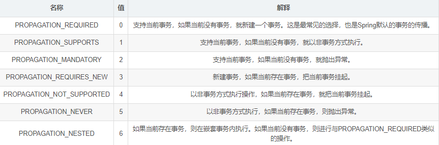
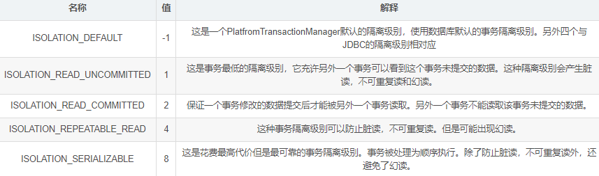
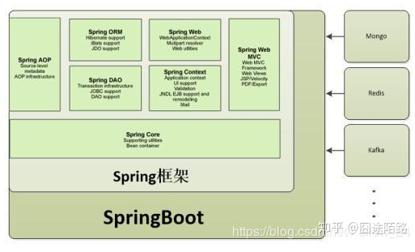
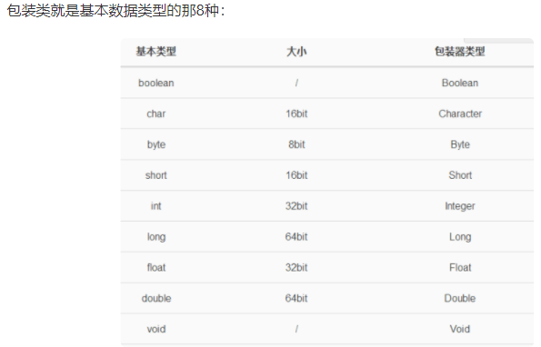
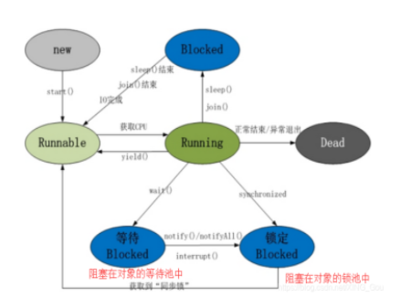

# interview questions

## 1.CSDN+github

### 1.1CSDN

| 序号 | 内容                                               | 链接地址                                                 |
| ---- | -------------------------------------------------- | :------------------------------------------------------- |
| 1    | Java基础知识面试题（2020最新版）                   | https://thinkwon.blog.csdn.net/article/details/104390612 |
| 2    | Java集合容器面试题（2020最新版）                   | https://thinkwon.blog.csdn.net/article/details/104588551 |
| 3    | Java异常面试题（2020最新版）                       | https://thinkwon.blog.csdn.net/article/details/104390689 |
| 4    | 并发编程面试题（2020最新版）                       | https://thinkwon.blog.csdn.net/article/details/104863992 |
| 5    | JVM面试题（2020最新版）                            | https://thinkwon.blog.csdn.net/article/details/104390752 |
| 6    | Spring面试题（2020最新版）                         | https://thinkwon.blog.csdn.net/article/details/104397516 |
| 7    | Spring MVC面试题（2020最新版）                     | https://thinkwon.blog.csdn.net/article/details/104397427 |
| 8    | Spring Boot面试题（2020最新版）                    | https://thinkwon.blog.csdn.net/article/details/104397299 |
| 9    | Spring Cloud面试题（2020最新版）                   | https://thinkwon.blog.csdn.net/article/details/104397367 |
| 10   | MyBatis面试题（2020最新版）                        | https://thinkwon.blog.csdn.net/article/details/101292950 |
| 11   | Redis面试题（2020最新版）                          | https://thinkwon.blog.csdn.net/article/details/103522351 |
| 12   | MySQL数据库面试题（2020最新版）                    | https://thinkwon.blog.csdn.net/article/details/104778621 |
| 13   | 消息中间件MQ与RabbitMQ面试题（2020最新版）         | https://thinkwon.blog.csdn.net/article/details/104588612 |
| 14   | Dubbo面试题（2020最新版）                          | https://thinkwon.blog.csdn.net/article/details/104390006 |
| 15   | Linux面试题（2020最新版）                          | https://thinkwon.blog.csdn.net/article/details/104588679 |
| 16   | Tomcat面试题（2020最新版）                         | https://thinkwon.blog.csdn.net/article/details/104397665 |
| 17   | ZooKeeper面试题（2020最新版）                      | https://thinkwon.blog.csdn.net/article/details/104397719 |
| 18   | Netty面试题（2020最新版）                          | https://thinkwon.blog.csdn.net/article/details/104391081 |
| 19   | 架构设计&分布式&数据结构与算法面试题（2020最新版） | https://thinkwon.blog.csdn.net/article/details/105870730 |

### 1.2GitHub

链接;https://github.com/Snailclimb/JavaGuide

## 2.summary

### 2.1java basic

#### 2.1.1Java访问控制符

public：对所有类可见

private：在同一类可见

protected：对同一包内的类和子类可见

default：在同一包内可见，不使用任何修饰符

#### 2.1.2“==”和equal的区别

“==”：

```xml
基本类型比较：比较的是值是否相同
引用类型比较：比较的是内存地址值是否相同
```

equal：

```xml
引用类型：默认情况下，比较的是地址值
```

#### 2.1.3实例变量和static静态变量区别

- **生命周期不同**

  实例变量随着对象的创建而存在，随着对象的回收而释放

  静态变量随着类的加载而存在，随着类的消失而消失

- **调用方式不同**

  实例变量只能由对象调用

  静态变量可以由对象调用，也可以由类调用

- **数据存储位置不同**

  实例变量存存储在堆内存的对象中

  静态变量存储在方法区的静态区

#### 2.1.4自动装箱和拆箱

自动装箱：自动将基本数据类型封装成包装器类型

自动拆箱：自动将包装器类型转换为基本数据类型

#### 2.1.5什么情况会造成内存泄漏/内存溢出？

内存溢出：（out of memory，可理解为内存不够）

```xml
代码存在死循环
内存中加载的数据过于庞大
GC回收不完全
···
```

内存泄漏：（Memory Leak）

```xml
static字段引起的内存泄漏
未关闭的资源导致内存泄漏
不正确的equals()和hashCode()
引用了外部类的内部类
finalize方法导致的内存泄漏
常量字符串造成的内存泄漏
改变哈希值
变量不合理的作用域
···
```

#### 2.1.6ArrayList和linkedlist区别

ArrayList：查询快，基于动态数组实现

linkedlist：增删快，基于链表结构实现

#### 2.1.7多线程的实现方法

继承Thread类，重写run（）方法

通过线程池创建线程

实现Runnable接口

实现Callable接口

#### 2.1.8Java线程wait()和sleep()···区别

wait（）：使当前线程暂停一段时间，释放对象锁

sleep（）：使当前线程暂停一段时间，不释放对象锁

join（）：

run（）：

start（）：

···

#### 2.1.9数据类型

基本数据类型：

```xml
数字类型：
	整数类型：
		byte
		short
		int
		long
	浮点型：
		float
		double
布尔类型：
		Boolean
字符类型：
		char
```

引用数据类型：

```xml
引用类型：
		类
		接口
		数组
```

### 2.2MySql basic

链接：https://www.cnblogs.com/GT_Andy/archive/2009/12/25/1921911.html

### 2.3Spring basic

### 2.4SpringMVC basic

### 2.5···

## 3.2021年3月1日

### 3.1java的特性

封装、继承、多态、抽象

封装：隐藏对象的属性和实现细节，仅仅对外公开接口

封装具有一下优点：

便于使用者正确、方便的使用系统，防止使用者错误修改系统属性； 有助于建立各个系统之间的松耦合关系； 提高软件的可重用性； 降低了大型系统的风险，即便整个系统不成功，个别独立的子系统有可能还有价值。 封装的两大原则：

把尽可能多的东西藏起来，对外提供简洁的接口； 把所有的属性封装起来。

继承：子类和父类之间的继承关系，子类可以获取到父类的属性和方法

多态：对象的多种形态

抽象：现实生活中的事物被抽象成对象，把具有相同属性和行为的对象被抽象成类，再从具有相同属性和行为的类中抽象出父类

### 3.2java集合类有哪些

List：有序，可重复，关注点为索引

set：无序，不可重复，只是简单地将对象放进集合中

map：key-value，key唯一，但value不唯一

### 3.3String类中常用的方法

- length（）：获取字符串的长度

- charAt（int index）返回某个位置的字符
- toCharArray（）将字符串转换为数组
- equals：比较字符串是否相同
- format：格式化字符串
- subString：截取字符串
- ···

### 3.4Spring IOC和AOP的理解

IOC：控制反转（Di：依赖注入）

个人理解：IOC是一个容器，所谓的“控制反转”，则是将新建、管理及装配对象的动作交由Spring处理，省去了由我们去挨个创建对象的操作。

AOP：面向AOP编程（注：OOP：面向对象变编程；POP：面向过程编程）利用AOP可以对业务逻辑的各个部分进行隔离，从而使得业务逻辑各部分之间的耦合度降低，提高程序的可重用性，同时提高了开发的效率。

个人理解：将系统中方法相同的功能提取出来，例如日志，每个模块之间是相互隔离互不干扰，通过一种横向的编程思想，将公用行为封装成可重用模块，以实现解耦的目的。

### 3.5#{}和${}的区别

\#{}是预编译处理，$ {}是字符串替换

\#{}:表示一个占位符号，通过#{}可以实现preparedStatement向占位符中设置值，自动进行java类型和jdbc类型转换，#{}可以有效防止sql注入。

\#{}可以接收简单类型值或pojo属性值。

如果parameterType传输单个简单类型值，#{}括号中可以是value或其它名称。例如“%”#{name}”%”

${}:表示拼接sql串，通过${}可以将parameterType 传入的内容拼接在sql中且不进行jdbc类型转换，
${}可以接收简单类型值或pojo属性值，如果parameterType传输单个简单类型值，${}括号中只能是value。

### 3.6简单说说遇到的异常有哪些？

- 空指针
- 指定包不存在
- 未自动创建Bean
- 数组下标越界
- 内存溢出

### 3.7普通类，静态类，抽象类和接口的区别

链接：https://blog.csdn.net/qq_37752233/article/details/79546375

普通类：可以实例化，可以被继承

静态类：不能实例化，不能被继承，没有默认的构造方法

抽象类：（什么是抽象类？：https://www.runoob.com/java/java-abstraction.html）

接口：可以被调用，可以被继承

### 3.8问：如何设计后台系统中的权限表

链接：https://www.cnblogs.com/myseries/p/10871633.html

产品原型上会给到直接的部分表结构。

举例：可以采用“用户-角色-权限”的结构去设计表结构，一个用户可能拥有多个角色，一个角色可能有多个权限。“用户-角色”和“角色-权限”之间可以通过关联表结合起来，可以提高程序的扩展性，每张表中有各自的主键ID和关键外键，不允许直接从“用户”到“权限”。

### 3.9jDK，jRE，jVM的区别

JDK：java开发工具包，包含java的基本类包

JRE：java运行时环境

JVM：java虚拟机

**延伸：java程序如何运行？**

- 通过编写工具编写.java文件
- javac（java编译器）编译为.class文件（字节码文件）
- jvm将.class文件解释为二进制文件

### 3.10什么是面向对象编程？和面向过程编程有啥区别？

链接：面向对象编程：https://blog.csdn.net/qq_37651267/article/details/90550939

面向过程 ：是分析解决问题的步骤，然后用函数把这些步骤一步一步地实现，然后在使用的时候一一调用则可。性能较高，所以单片机、嵌入式开发等一般采用面向过程开发。 

面向对象：是把构成问题的事务分解成各个对象，而建立对象的目的也不是为了完成一个个步骤，而是为了描述某个事物在解决整个问题的过程中所发生的行为。面向对象有 封装、继承、多态 的特性，所以易维护、易复用、易扩展。可以设计出低耦合的系统。
但是性能上来说，比面向过程要低。

## 4.2021年3月2日

### 4.1面向对象的特性？

 封装、继承、多态、抽象

### 4.2String是java的基本数据类型吗？基本类型有哪些？

String不是java的基本数据类型。

基本数据类型：

 整形：

 byte/short/int/long

 浮点型：

 dubble/float

 布尔类型：

 boolean

 字符类型：

 char

### 4.3float f = 3.4;正确吗？

 不正确

### 4.4&和&&的区别？

- 使用&时，当前面的表达式为假的时候，程序依旧会继续执行后面的表达式，然后再得出FALSE的结果
- 当使用&&（短路与）时，则相反，当前面的表达式结果为假时则不会再执行后面的表达式，直接得出FALSE的结果

**追加：|和||的区别**

- |：当使用|时，若前面的表达式为真时，程序会继续执行后面的表达式，然后在得出TRUE的结果
- 当使用||（短路或）时，若前面的表达式结果为真，则程序不会再执行后面的表达式，直接得出TRUE的结果

### 4.5解释内存中的栈（stack）、堆（heap）和静态区（static area）的区别？

栈：通常我们定义一个基本数据类型的变量，一个对象的引用，还有就是函数调用的 现场保存 都使用内存中的栈空间；

堆：通过new关键字和构造器创建的对象放在堆空间

静态区：程序中的字面量（literal）如直接书写的100、”hello”和常量都是放在静态区中。

分析：String str = new String("hello");

变量str放在栈上

new创建出来的字符串对象放在堆上

“hello”放置在静态区

**追加：java中创建对象的五种方式**

链接：https://www.cnblogs.com/wxd0108/p/5685817.html

| 使用new关键字                      | } → 调用了构造函数   |
| ---------------------------------- | -------------------- |
| 使用Class类的newInstance方法       | } → 调用了构造函数   |
| 使用Constructor类的newInstance方法 | } → 调用了构造函数   |
| 使用clone方法                      | } → 没有调用构造函数 |
| 使用反序列化                       | } → 没有调用构造函数 |

### 4.6用最有效率的方式计算2乘以8？

因为位运算由CPU直接支持，效率最高

system.out.println(2<<3);

### 4.7在java中，如何跳出当前的多重嵌套循环？

break

### 4.8阐述final、finally、finalize的区别？

final：可以用于修饰变量，方法，类，被修饰的变量的值不能被改变，被修饰的方法不能被重写，被修饰的类不能被继承，它和abstract是反义词
finally：通常放在try…catch…的后面构造总是执行代码块，这就意味着程序无论正常运行还是发生异常，这里的代码只要JVM不关闭都会执行，可以将释放外部资源的代码写在finally块中
finalize：Object类的方法，Java中允许使用finalize()方法在垃圾回收器将对象从内存中清除出去之前做必要的清理工作，这个方法是由垃圾回收器在销毁对象时调用的，通过重写finalize()
方法可以整理系统资源或者执行其他清理工作

### 4.9阐述ArrayList、vector、LinkedList的存储性能和特性。

ArrayList和Vector都是使用数组方式存储数据

此数组元素数大于实际存储的数据以便增加和插入元素，它们都允许直接按序号索引元素，但是插入元素要涉及数组元素移动等内存操作，所以索引数据快而插入数据慢，Vector由于使用了synchronized方法(线程安全)
，通常性能上较ArrayList差；

而LinkedList使用双向链表实现存储，按序号索引数据需要进行前向或后向遍历，但是插入数据时只需要记录本项的前后项即可，所以插入速度较快。

### 4.10转发（forward）和重定向（redirect）的区别？

链接：https://www.cnblogs.com/kingofjava/p/10761679.html

转发是服务器行为，重定向是客户端行为

转发（Forword）通过RequestDispatcher对象的 forward（HttpServletRequest request,HttpServletResponse response） 方法实现的。

RequestDispatcher 可以通过 HttpServletRequest的 getRequestDispatcher() 方法获得。

重定向（Redirect） 是利用服务器返回的状态码来实现的。客户端浏览器请求服务器的时候，服务器会返回一个状态码。服务器通过HttpServletRequestResponse的setStatus(int status)
方法设置状态码。如果服务器返回301或者302，则浏览器会到新的网址重新请求该资源。

相同点：

- 都能实现页面跳转

不同点：

- 请求转发的时候，url地址栏不会发生变化；
- 重定向的时候，url地址栏会发生变化；

### 4.11MyBatis中使用#和$书写占位符有什么区别？

### 4.12UNION和UNION ALL的区别？

**Union：对两个结果集进行并集操作，不包括重复行，同时进行默认规则的排序；**

**Union All：对两个结果集进行并集操作，包括重复行，不进行排序；**

### 4.13数据库有哪几种约束类型？

1. 主键约束
2. 外键约束
3. 检查约束
4. 默认值约束
5. 唯一约束

### 4.14什么是索引覆盖？

​        **一个索引包含了（或覆盖了）满足查询结果的数据就叫做覆盖索引**

索引覆盖是select的数据列只用从索引中取得就行，不必去读取数据行。索引是提高数据库高效查询的一种方式，属于SQL优化的一部分。

### 4.15Spring的事务管理（Spring事务+MySQL事务+JDBC事务详解）？

链接：https://blog.csdn.net/donggua3694857/article/details/69858827

**Spring事务的本质其实就是数据库对事务的支持**

**使用JDBC的事务管理机制,就是利用java.sql.Connection对象完成对事务的提交**

因为事务中拥有四大特性。ACID：原则性，一致性，隔离性，持久性

1.原子性（Atomicity）事务是一个原子操作，由一系列动作组成。事务的原子性确保动作要么全部完成，要么完全不起作用。

2.一致性（Consistency）事务在完成时，必须是所有的数据都保持一致状态。

3.隔离性（Isolation）并发事务执行之间无影响，在一个事务内部的操作对其他事务是不产生影响，这需要事务隔离级别来指定隔离性。

4.持久性（Durability）一旦事务完成，数据库的改变必须是持久化的。

而在企业级应用中，面对多用户访问数据库则需要考虑事务的并发。

而事务的并发可能存在的问题：

1.脏读：一个事务读到另一个事务未提交的更新数据。 2.不可重复读：一个事务两次读同一行数据，可是这两次读到的数据不一样。 3.幻读：一个事务执行两次查询，但第二次查询比第一次查询多出了一些数据行。
4.丢失更新：撤消一个事务时，把其它事务已提交的更新的数据覆盖了。

**JDBC则定义了事务隔离级别来解决事务的问题：**

TRANSACTION_NONE JDBC 驱动不支持事务

TRANSACTION_READ_UNCOMMITTED 允许脏读、不可重复读和幻读。

TRANSACTION_READ_COMMITTED 禁止脏读，但允许不可重复读和幻读。

TRANSACTION_REPEATABLE_READ 禁止脏读和不可重复读，单运行幻读。

TRANSACTION_SERIALIZABLE 禁止脏读、不可重复读和幻读。

**Spring定义事务**

**Spring事务管理的核心接口是PlatformTransactionManager**

**Spring事务的传播属性**



#### Spring事务的隔离级别



同样，事务级别越高，数据库能够执行的并发就越少，性能就越差。

### 4.16Servlet的生命周期

链接：https://blog.csdn.net/javaloveiphone/article/details/8154791?ops_request_misc=%257B%2522request%255Fid%2522%253A%2522161482864516780274110633%2522%252C%2522scm%2522%253A%252220140713.130102334..%2522%257D&request_id=161482864516780274110633&biz_id=0&utm_medium=distribute.pc_search_result.none-task-blog-2~all~sobaiduend~default-2-8154791.first_rank_v2_pc_rank_v29_10&utm_term=Servlet%E7%9A%84%E7%94%9F%E5%91%BD%E5%91%A8%E6%9C%9F

Servlet的生命周期可以分为四个阶段，即装载类及创建实例阶段、初始化阶段、服务阶段和实例销毁阶段

### 4.17SpringMVC的运行原理

链接：https://blog.csdn.net/z_ssyy/article/details/82153487?ops_request_misc=%257B%2522request%255Fid%2522%253A%2522161475363816780261934914%2522%252C%2522scm%2522%253A%252220140713.130102334..%2522%257D&request_id=161475363816780261934914&biz_id=0&utm_medium=distribute.pc_search_result.none-task-blog-2~all~sobaiduend~default-1-82153487.first_rank_v2_pc_rank_v29_10&utm_term=SpringMVC%E7%9A%84%E8%BF%90%E8%A1%8C%E5%8E%9F%E7%90%86

1. Http请求：客户端请求提交到DispatcherServlet。
2. 寻找处理器：由DispatcherServlet控制器查询一个或多个HandlerMapping，找到处理请求的Controller。
3. 调用处理器：DispatcherServlet将请求提交到Controller。
4. 调用业务处理和返回结果：Controller调用业务逻辑处理后，返回ModelAndView。
5. 处理视图映射并返回模型： DispatcherServlet查询一个或多个ViewResoler视图解析器，找到ModelAndView指定的视图。
6. Http响应：视图负责将结果显示到客户端。

### 4.18Spring、SpringMVC、SpringBoot、SpringCloud的区别联系？

链接：

1. https://zhuanlan.zhihu.com/p/63117304
2. https://zhuanlan.zhihu.com/p/156074428



Spring是一个轻量级的控制反转(IoC)和面向切面(AOP)的容器框架。Spring使你能够编写更干净、更可管理、并且更易于测试的代码。

Spring MVC是Spring的一个模块，一个web框架。通过Dispatcher Servlet, ModelAndView 和 View
Resolver，开发web应用变得很容易。主要针对的是网站应用程序或者服务开发——URL路由、Session、模板引擎、静态Web资源等等。

Spring配置复杂，繁琐，所以推出了Spring boot，约定优于配置，简化了spring的配置流程。

Spring Cloud构建于Spring Boot之上，是一个关注全局的服务治理框架。

### 4.19中国象棋将帅问题：https://blog.csdn.net/weixin_37627774/article/details/109923401


解题：https://www.cnblogs.com/elvalad/p/4117194.html

## 5.2021年3月8日

### 5.1.java1.8的优势？

- 速度更快
- 代码更少，使用了Lambda表达式
- 最大简化空指针异常

### 5.2.java和.net的区别和优势？

### 5.3.java为什么能实现跨平台？

**jvm虚拟机**：一次编译，各处运行

**延伸：java程序如何运行？**

- 通过编写工具编写.java文件
- javac（java编译器）编译为.class文件（字节码文件）
- jvm将.class文件解释为二进制文件
- Unix，win，linux等机器

### 5.4.String，stringbuffer和stringbuilder的区别

**String：**字符串常量 。

**StringBuffer** 与 **StringBuilder**是字符缓冲变量。

Java 中字符串属于**对象**，Java 提供了 **String 类来创建和操作字符串

当**对字符串进行修改**的时候，需要使用 StringBuffer 和 StringBuilder 类。

和 String 类不同的是，StringBuffer 和 StringBuilder 类的对象能够被多次的修改，并且**不产生新的未使用对象**。

StringBuilder 类在 Java 5 中被提出，它和 StringBuffer 之间的最大不同在于 StringBuilder 的方法不是线程安全的（不能同步访问）。

由于 StringBuilder 相较于 StringBuffer 有速度优势，**所以多数情况下建议使用 StringBuilder 类**。然而在应用程序要求线程安全的情况下，则必须使用 StringBuffer 类。

### 5.5.如何拼接字符串？

- stringBuffer拼接字符串：https://blog.csdn.net/weixin_43343423/article/details/88899708?ops_request_misc=%257B%2522request%255Fid%2522%253A%2522161519436016780266268252%2522%252C%2522scm%2522%253A%252220140713.130102334..%2522%257D&request_id=161519436016780266268252&biz_id=0&utm_medium=distribute.pc_search_result.none-task-blog-2~all~baidu_landing_v2~default-2-88899708.first_rank_v2_pc_rank_v29&utm_term=StringBuffer%E5%A6%82%E4%BD%95%E6%8B%BC%E6%8E%A5%E6%96%B0%E7%9A%84%E5%AD%97%E7%AC%A6%E4%B8%B2%28%29

- +号拼接字符串

### 5.6.如何new一个线程？

### 5.7.JDK，JRE，JVM的区别？包含关系？

### 5.8.重写和重载？

### 5.9.解释内存中的栈（stack）、堆（heap）和静态区（static area）的区别？

### 5.10.java的四大特性（需要具体）？

### 5.11.java中的基本数据类型？

### 5.12.spring boot的约定大于配置？

**约定大于配置是一种开发原则，就是减少人为的配置，直接用默认的配置就能获得我们想要的结果。**

**在传统所需要配置的地方，SpringBoot都进行了约定（配置好了），开发人员能配置得更少，更直接地开发项目，写业务逻辑代码。**

spring boot和maven的约定大于配置体现点：

 1.maven的目录文件结构

1）默认有resources文件夹,存放资源配置文件。src-main-resources,src-main-java默认的编译生成的类都在targetwen。

2）默认有target文件夹，将生成class文件盒编程生成的jar存放在target文件夹下

2.spring boot默认的配置文件必须是，也只能是application.命名的yml文件或者properties文件，且唯一

1）spring boot默认只会去src-main-resources文件夹下去找application配置文件

### 5.13.spring中的单例模式？何种情况下不会考虑单例模式？

在Spring中，Bean的scope属性中存在着两种模式既单例模式（singleton）和多例模式（prototype）。

```xml
    singleton 单例模式： 对象在整个系统中只有一份，所有的请求都用一个对象来处理，如service和dao层的对象一般是单例的。
	为什么使用单例：因为没有必要每个请求都新建一个对象的时候，因为这样会浪费CPU和内存。
    prototype 多例模式：对象在整个系统中可以有多个实例，每个请求用一个新的对象来处理，如action。

为什么使用多例：防止并发问题；即一个请求改变了对象的状态，此时对象又处理另一个请求，而之前请求对对象的状态改变导致了对象对另一个请求做了错误的处理；
```

Spring bean 默认的是单例模式。

### 5.14.spring/springMvc/springBoot/springCloud中常用的注解

链接：https://blog.csdn.net/kxj19980524/article/details/85124785?ops_request_misc=%257B%2522request%255Fid%2522%253A%2522161519586216780262557993%2522%252C%2522scm%2522%253A%252220140713.130102334.pc%255Fall.%2522%257D&request_id=161519586216780262557993&biz_id=0&utm_medium=distribute.pc_search_result.none-task-blog-2~all~first_rank_v2~rank_v29-2-85124785.first_rank_v2_pc_rank_v29&utm_term=spring%2Fspringboot%2Fspringcloud%E5%B8%B8%E7%94%A8%E6%B3%A8%E8%A7%A3

### 5.15.SpringCloud中服务注册？

Eureka 包含两个组件：Eureka Server 和 Eureka Client.

Eureka Server 提供服务注册，各个节点启动后，回在EurekaServer中进行注册，这样Eureka Server中的服务注册表中将会储存所有课用服务节点的信息，服务节点的信息可以在界面中直观的看到.

Eureka Client 是一个Java客户端，用于简化EurekaServer的交互，客户端同时也具备一个内置的，使用轮询负载算法的负载均衡器。在应用启动后，将会向EurekaServer发送心跳 (默认周期为30秒)
。如果Eureka Server在多个心跳周期内没有接收到某个节点的心跳，EurekaServer将会从服务注册表中把这个服务节点移除掉 (默认周期为90s)

### 5.16.springboot的优势？

- 为所有Spring开发者更快的入门
- **开箱即用**，提供各种默认配置来简化项目配置
- 内嵌式容器简化Web项目
- 没有冗余代码生成和XML配置的要求

### 5.17.spring IOC和AOP？

### 5.18.冒泡算法

### 5.19.GC处理机制

链接：https://blog.csdn.net/qingzibbb/article/details/107576374?ops_request_misc=%257B%2522request%255Fid%2522%253A%2522161519623416780271521868%2522%252C%2522scm%2522%253A%252220140713.130102334..%2522%257D&request_id=161519623416780271521868&biz_id=0&utm_medium=distribute.pc_search_result.none-task-blog-2~all~sobaiduend~default-2-107576374.first_rank_v2_pc_rank_v29&utm_term=GC%E5%A4%84%E7%90%86%E6%9C%BA%E5%88%B6

### 5.20.为什么java中integer有对应的基本类型int，但是string没有对应的基本类型？

integer 是int类型的包装类，int是基本类型，java有8个基本类型，但string不是，string是常量。

**注：什么是包装类？**



### 5.21.什么是进程？什么是线程？什么是多线程？

链接：https://blog.csdn.net/wutian842929/article/details/107856129?ops_request_misc=&request_id=&biz_id=102&utm_term=%E4%BB%80%E4%B9%88%E6%98%AF%E5%A4%9A%E7%BA%BF%E7%A8%8B&utm_medium=distribute.pc_search_result.none-task-blog-2~all~sobaiduweb~default-5-107856129.first_rank_v2_pc_rank_v29

### 5.22.线程的生命周期



```xml
新建状态（New）：至今尚未启动的线程的状态。线程刚被创建，但尚未启动。如：Thread t = new MyThread();

就绪状态（Runnable）：当调用线程对象的start()方法（t.start();），线程即进入就绪状态。处于就绪状态的线程，只是说明此线程已经做好了准备，随时等待CPU调度执行，并不是说执行了t.start()此线程立即就会执行；

运行状态（Running）：当CPU开始调度处于就绪状态的线程时，此时线程才得以真正执行，即进入到运行状态。注：就 绪状态是进入到运行状态的唯一入口，也就是说，线程要想进入运行状态执行，首先必须处于就绪状态中；

阻塞状态（Blocked）：处于运行状态中的线程由于某种原因，暂时放弃对CPU的使用权，停止执行，此时进入阻塞状态，直到其进入到就绪状态，才有机会再次被CPU调用以进入到运行状态。根据阻塞产生的原因不同，阻塞状态又可以分为三种：

1）等待阻塞—位于对象等待池中的阻塞状态（Blocked in object’s wait pool）：当线程处于运行状态时，如果执行了某个对象的wait()方法，Java虚拟机就会把线程放到这个对象的等待池中，这涉及到“线程通信”的内容。

2）同步阻塞 --位于对象锁池中的阻塞状态（Blocked in object’s lock pool）：当线程处于运行状态时，试图获得某个对象的同步锁时，如果该对象的同步锁已经被其他线程占用，Java虚拟机就会把这个线程放到这个对象的锁池中，这涉及到“线程同步”的内容。【线程在获取synchronized同步锁失败(因为锁被其它线程所占用)】

3）其他阻塞状态（Otherwise Blocked）：当前线程执行了sleep()方法，或者调用了其他线程的join()方法，或者发出了I/O请求时，就会进入这个状态。线程会进入到阻塞状态。当sleep()状态超时、join()等待线程终止或者超时、或者I/O处理完毕时，线程重新转入就绪状态。

死亡状态（Dead）：线程执行完了或者因异常退出了run()方法，该线程结束生命周期。
```

### 5.23.什么是devops？

你所在的公司是如何实施DevOps的？：https://www.zhihu.com/question/24413538/answer/116474416

### 5.24.详述spring中事务的传播行为和事务隔离？

### 5.25.如何解决两个线程对同一张表操作？

可以用乐观锁方案：

在表里增加个字段，版本号字段

每次更新前先从数据库里获取这个版本号的值，然后更新时要同步更新版本号+1，并且增加更新条件版本号=查询出来的值。

因为更新时每次只可能有一个线程更新到数据，等到另外一个线程再去更新数据的时候版本号已经+1了，所以会更新失败，重新获取版本号再走更新流程，这样就解决了多线程并发更新被覆盖的问题。

而且乐观锁机制避免了长事务中的数据库加锁开销（多个线程操作过程中，都没有对数据库数据加锁），大大提升了大并发量下的系统整体性能表现。

### 5.26.lambda表达式？

链接：https://blog.csdn.net/qq_36906073/article/details/101317783?ops_request_misc=%257B%2522request%255Fid%2522%253A%2522161519701316780274189852%2522%252C%2522scm%2522%253A%252220140713.130102334..%2522%257D&request_id=161519701316780274189852&biz_id=0&utm_medium=distribute.pc_search_result.none-task-blog-2~all~sobaiduend~default-2-101317783.first_rank_v2_pc_rank_v29&utm_term=lambda%E8%A1%A8%E8%BE%BE%E5%BC%8F

## 6.2022年4月4日

### 6.1.java

6.1.1.java basic

String类及相关问题

String类

StringBuilder、StringBuffer的区别

6.1.2.jvm

jvm的内存模型

jvm的演进

双亲委派模式

GC

6.1.3.JUC

线程的状态

线程状态的流转

创建线程的几种方式

线程池

线程池的参数

6.1.4.Reflect

### 6.2.Spring全家桶

6.2.1.Spring

Spring的注解

6.2.2.Spring Mvc

6.2.3.Spring Boot

Spring Boot的运行原理

Spring Boot

6.2.4.Spring Cloud

### 6.3.Data

6.3.1.Redis

6.3.2.MySQL

6.3.3.MyBatis

### 6.4.Web

6.4.1.Http/Https

6.4.2.

### 6.5.Net

### 6.6.Data Struct

### 6.7.Dsign Pattern

6.7.1.单例模式