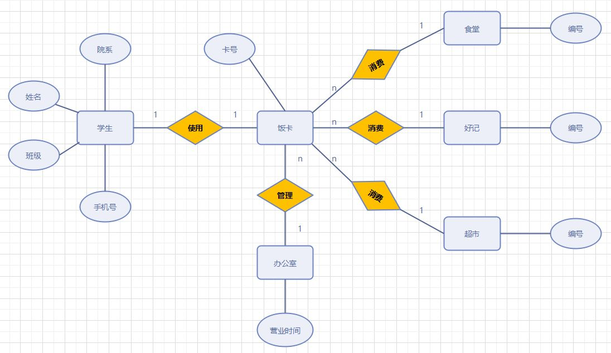

# ER图

注：参考链接：

[数据库ER图基础概念整理 - 简书 (jianshu.com)](https://www.jianshu.com/p/9ff938e3a498)

[ER图（实体关系图）怎么画？ - 知乎 (zhihu.com)](https://zhuanlan.zhihu.com/p/270299029)

[E-R图_百度百科 (baidu.com)](https://baike.baidu.com/item/E-R图/304954?fromtitle=ER图&fromid=2908042&fr=aladdin)

[ER图 - MBA智库百科 (mbalib.com)](https://wiki.mbalib.com/wiki/ER图)

# 1.什么是ER图？

E-R图（Entity Relationship Diagram）：实体关系图：是指提供了表示实体型、属性和联系的方法，用来描述现实世界的概念模型。

# 2.ER图的基本要素

1. 用矩形表示实体，矩形框内写明实体名

2. 用椭圆表示实体的属性，并用无向边将其与相应的实体型连接起来

3. 用菱形表示实体型之间的联系，在菱形框内写明联系名，并用无向边分别与有关实体型连接起来，同时在无向边旁标上联系的类型（1:1，1：n或者m:n）

例如下图：

# 3.ER图中的关系

（1）1对1（1:1）：指对于实体集A与实体集B，A中的每一个实体至多与B中一个实体有关系；反之，在实体集B中的每个实体至多与实体集A中一个实体有关系。

（2）1对多（1:N）：1对多关系是指实体集A与实体集B中至少有N(N>0)个实体有关系；并且实体集B中每一个实体至多与实体集A中一个实体有关系。

（3）多对多（M:N）：多对多关系是指实体集A中的每一个实体与实体集B中至少有M(M>0)个实体有关系，并且实体集B中的每一个实体与实体集A中的至少N（N>0）个实体有关系.

# 4.ER图的绘制规范

在ER图中有如下四个成分：

**1）矩形框：**表示实体，在框中记入实体名。

**2）菱形框：**表示联系，在框中记入联系名。

**3）椭圆形框**：表示实体或联系的属性，将属性名记入框中。对于主属性名，则在其名称下划一下划线。

**4）连线：**实体与属性之间；实体与联系之间；联系与属性之间用直线相连，并在直线上标注联系的类型。（对于一对一联系，要在两个实体连线方向各写1； 对于一对多联系，要在一的一方写1，多的一方写N；对于多对多关系，则要在两个实体连线方向各写N，M。)

# 5.ER图的绘制流程

- 1）确定所有的实体集合；
- 2）选择实体集应包含的属性；
- 3）确定实体集之间的联系；
- 4）确定实体集的关键字，用下划线在属性上表明关键字的属性组合；
- 5）确定联系的类型，在用线将表示联系的菱形框联系到实体集时，在线旁注明是1或n(多）来表示联系的类型。

# 6.ER图的绘制工具

## 6.1.在线工具

## 6.2.Visio