# UML类图

参考链接：

[类与类之间的几种关系 - 残剑_ - 博客园 (cnblogs.com)](https://www.cnblogs.com/liuling/archive/2013/05/03/classrelation.html)

[UML类图 - 简书 (jianshu.com)](https://www.jianshu.com/p/57620b762160)

[(16条消息) UML类图几种关系的总结_PlayBoy's 部落格-CSDN博客_uml类图](https://blog.csdn.net/tianhai110/article/details/6339565)

[五分钟读懂UML类图 - shindoyang - 博客园 (cnblogs.com)](https://www.cnblogs.com/shindo/p/5579191.html)

UML类图：UML Class Diagram

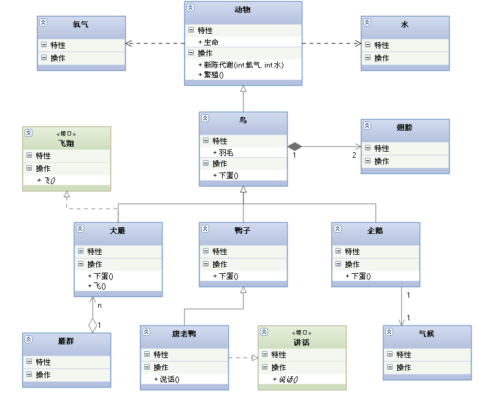

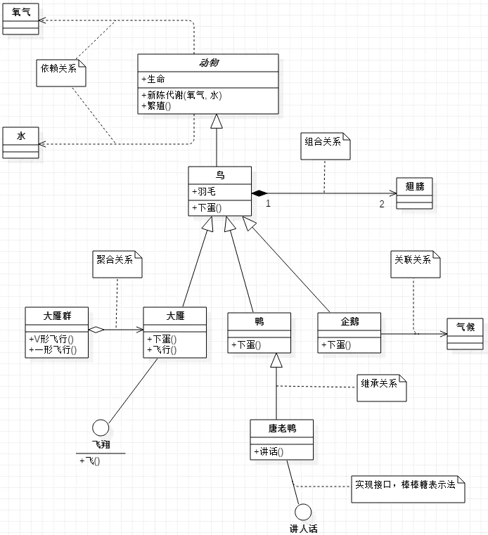

# 1.什么是UML？

UML：Unified Modeling Language：统一建模语言。

UML是用来设计软件蓝图的可视化建模语言。

它的特点就是简单、单一、图形化、能表达软件设计中的动态与静态信息。

**UML从目标系统的不同角度出发，定义了用例图、类图、对象图、状态图、活动图、时序图、协作图、构件图、部署图等9种图**

# 2.UML类图

UML类图是用来显示系统中的类、接口、协作以及它们之间的静态结构和关系的一种静态模型。它主要用来描述系统的结构化设计，帮助人们简化对软件系统的理解。

UML类图是系统分析与设计阶段的重要产物，也是系统编码与测试的重要模型依据。

# 3.类之间的关系

在软件系统中，类不是孤立存在的，类与类之间存在各种关系。根据类与类之间的耦合度从弱到强排列，UML类图中涵盖了一下几种关系：依赖关系、关联关系、聚合关系、组合关系、泛化关系和实现关系。其中泛化关系和实现关系的耦合度相等是最强的。

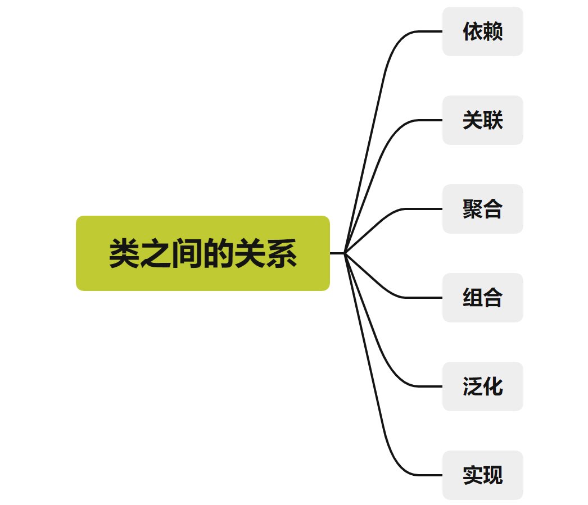

## 3.1.依赖

依赖就是一个类A使用到了另一个类B，而这种关系是具有偶然性的、临时性的、非常弱的。

但是类B的变化会影响到A。

**表现在代码层面，为类B作为参数被类A在某个方法中使用。**

**在UML类图设计中，依赖关系使用由类A指向类B的带箭头虚线表示**

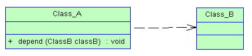

## 3.2.关联

关联体现在两个类之间语义级别的一种强依赖关系。例如，我和我的朋友。这种关系比依赖强，不存在依赖关系的偶然性，关系也不是临时的，一般是长期的，而且双方的关系一般是平等的。

**表现在代码层面，为关联类B以类的属性形式出现在关联类A中，可能是关联类A引用了一个类型为关联类B的全局变量。**

关联可以是单向的，也可以是双向的，还可以是自关联

**在UML类图中，关联关系用由关联类A指向被关联类B的带箭头实线表示，在关联的两端，可以标注关联双方的角色和多重性标记。**

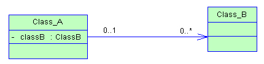

## 3.3.聚合

聚合是关联关系的一种特例，它体现的是整体与部分的关系，即has-a的关系。

此时整体与部分之间是可以分离的，他们有着各自的生命周期，部分可以属于多个整体对象，也可以为多个整个多想共享。

**表现在代码层面上，和关联关系是一致的，只能从语意中区分。**

**在UML类图设计中，聚合关系使用以空心菱形加实线箭头表示。**

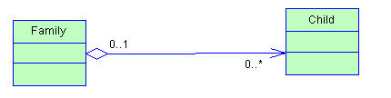

## 3.4.组合

组合也是关联关系的一种特例，它体现的是一种contains-a的关系，这种关系比聚合更强，也称为强聚合。

它同样体现整体与部分之间的关系，但此时整体和部分是不可分的，整体的生命周期结束也就意味这部分的生命周期结束，例如人和人的大脑。

**表现在代码层面，和关联关系是一致的，只能从语义级别来区分。**

**在UML类图设计中，组合关系以实心菱形加实线箭头表示。**

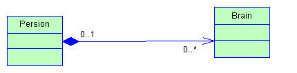

## 3.5.泛化

泛化又称为继承，继承指的是是一个类（成为子类、子接口）继承另外一个类（称为父类、父接口）的功能，并可以增加它自己的新功能的能力。

**在java中继承关系通过关键字extends明确标识，在设计时一般没有争议性。**

**在UML类图设计中，继承使用一条带空心三角剪头的实线标识，从子类指向父亲或者子接口指向父接口。**

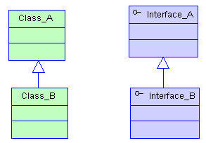

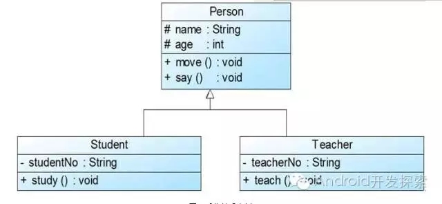

## 3.6.实现

实线是指的一个class类实线interface接口（可以是多个）的功能。

实线是类与接口中最常见的关系。在java中此关系使用关键字implement明确标识。

在设计时一般没有争议。

**在UML类图设计时，实现用一条带空心三角箭头的虚线表示，从实现类指向被实现的接口。**

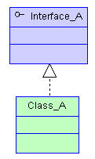

# 4.类的属性的表示方式

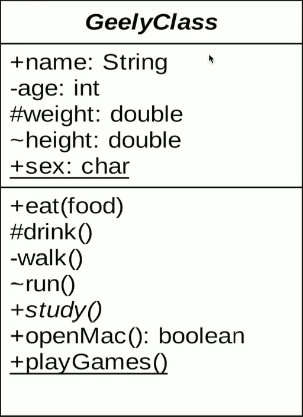

```txt
-表示private  
#表示protected 
~表示default,也就是包权限  
_下划线表示static  
斜体表示抽象  
```


上图表示一个Employee类，它包含name、age和email这三个属性，以及modifyInfo()方法。

属性和方法前面的符号代表的意义：

-：私有：private

+：公开：public

#：受保护的：protected

# 5.类的方法的表示方式

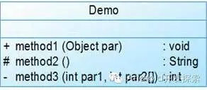

**·** public方法method1接收一个类型为Object的参数，返回值类型为void

**·** protected方法method2无参数，返回值类型为String

**·** private方法method3接收类型分别为int、int[]的参数，返回值类型为int


