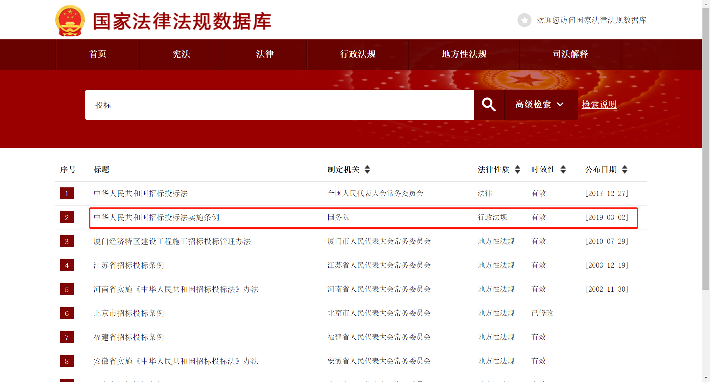
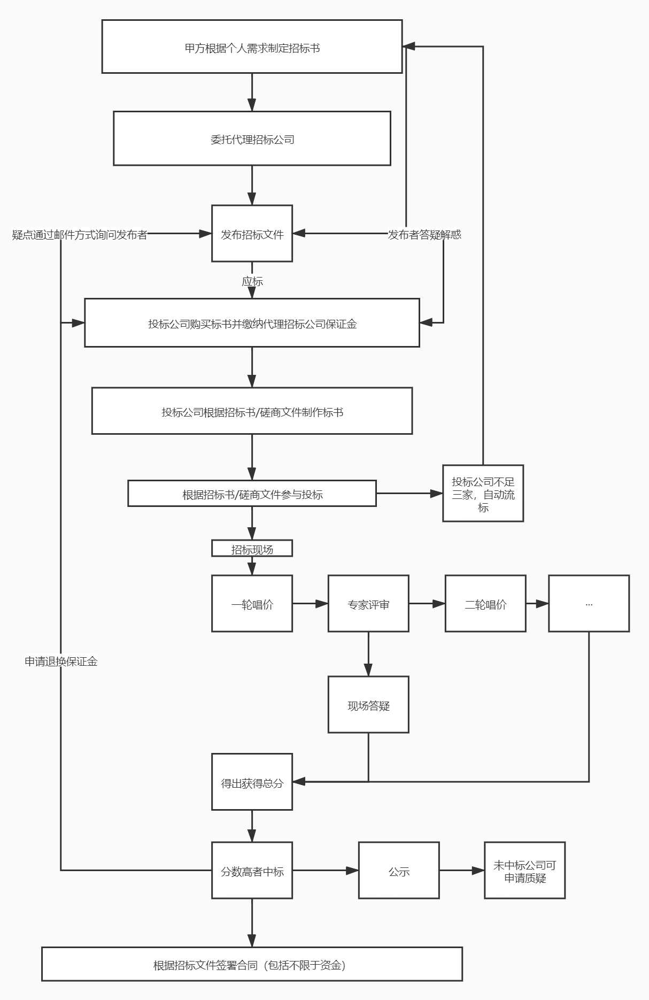

# 标书

## 1.什么是标书？

标书（bidding documents）是由发标单位编制或委托设计单位编制，向投标者提供对该工程的主要技术、质量、工期等要求的文件。

### 1.1标书：百度百科

```xml
https://baike.baidu.com/item/%E6%A0%87%E4%B9%A6/407477?fr=aladdin
```

### 1.2国际标书相关问题

#### 1.2.1国外企业国际招标

一般是以建设采购方所在地的语言为准。如国外的企业进行国际招标，一般是以英语(或当地语言)为准，且注意招标文件中提到的当地的法律法规。

#### 1.2.2中国企业国际招标

如果是中国单位进行国际招标，招标文件中一般注明，当中英文版本产生差异时以中文为准。

### 1.3招投标相关法律法规

时间：2021年5月28日

1.3.1《中华人民共和国招投标法》

[国家法律法规数据库 (npc.gov.cn)](https://flk.npc.gov.cn/detail2.html?MmM5MDlmZGQ2NzhiZjE3OTAxNjc4YmY4OGYxNzBiMzE%3D)

1.3.2其他相关法律解释



## 2.招投标简要流程

时间：截止2021年5月28日

应标：对标书进行响应

流标：指政府采购或工程招投标中投标人不足三家，或所有投标都被否决

中标

废标：指政府采购中出现报名参加或实质性响应的供应商不足三家、存在影响采购公正的违法违规行为、投标报价均超过预算、因重大变故采购任务取消的情形时，招标采购单位作出来的全部投标无效的处理



## 3.标书的制作

### 3.1读懂招标书/磋商文件

#### 3.1.1招标书/磋商文件关键词

##### 3.1.1.1项目名称/项目编号

##### 3.1.1.2招标中介公司

##### 3.1.1.3预算（报价）

##### 3.1.1.4标书报名时间段

##### 3.1.1.5投标时间

##### 3.1.1.6供应商须知前附表

##### 3.1.1.7不接受联合体标价/不允许二包

###### 3.1.1.7.1联合体

联合体：几家公司组成相关团体

###### 3.1.1.7.2二次外包

项目中间商，中标后卖出，争取中间差价

注意招标书/磋商文件：不允许将关键部分/核心部分外包给其他公司

##### 3.1.1.8技术规格偏离表（有则加分，无不扣分）

无偏离：提出的要求能完全满足

正偏离：提出的要求超额满足

负偏离：提出的要求不能完全满足

##### 3.1.1.9字体格式、大小要求

##### 3.1.1.10标书目录顺序可依照打分表

##### 3.1.1.11商务部分售后对比技术部分售后

​ 分清商务售后和技术售后

#### 3.1.2招标书/磋商文件评审办法

##### 3.1.2.1某某标书（2021.05.09）

​            **报价部分/技术部分/商务部分**

​ ==占比：3:6:1==

根据占比核算相关部分，进而核算总分。

### 3.2信用核定、企业审查相关网站

时间：截止2021年5月28日

#### 3.2.1信用核定

==根据标书要求，截图图片需要带上最新的时间戳==

##### 3.2.1.1国家企业信用信息公示系统

http://www.gsxt.gov.cn/index.html

##### 3.2.1.2信用中国

https://www.creditchina.gov.cn/

##### 3.2.1.3中国人民银行企业部分

http://www.pbccrc.org.cn/zxzx/qyzx/list.shtml

##### 3.2.1.4国际知识产权局商标局 中国商标网

http://sbj.cnipa.gov.cn/

##### 3.2.1.5中国执行信息公开网

http://zxgk.court.gov.cn/

##### 3.2.1.6中国专利公布公告

http://epub.sipo.gov.cn/

#### 3.2.2企业审查

##### 3.2.2.1企查查

https://www.qcc.com/

##### 3.2.2.2天眼查

https://www.tianyancha.com/

### 3.3标书相关材料装订

==提前准备好密封袋、胶棒等==

## 4.参与投标

### 4.1确定参与投标的地点，时间以及准备相关的资料

包括不限于标书、副标、保证金退换等资料

### 4.2允许携带手机等设备？

允许携带手机或者录音设备建议开启，对相关报价环节进行录音，拍照取证。

### 4.3相关报价等信息需现场公开

如未公开，可提出质疑。

## 5.合同（简要）

### 5.1什么是合同？

合同：百度百科

```xml
https://baike.baidu.com/item/%E5%90%88%E5%90%8C/20705?fr=aladdin
```

### 5.2合同相关法律法规

#### 5.2.1中华人民共和国合同法（废止尚不清楚）

时间：截止2021年5月28日

```xml
http://www.npc.gov.cn/wxzl/wxzl/2000-12/06/content_4732.htm
```

#### 5.2.2中国民法典 合同部分（第三编 合同）

时间：截止2021年5月28日

```xml
http://www.npc.gov.cn/npc/c30834/202006/75ba6483b8344591abd07917e1d25cc8.shtml
```
