# 软件设计师-知识笔记-20221030

==**按照官方《软件设计师考试大纲梳理》**==

优先按照上午的考试范围梳理知识目录的顺序

注：部分笔记来源：

1. [软件设计师资格考试_曲绍墉的博客-CSDN博客](https://blog.csdn.net/weixin_44489825/category_10374407.html)
2. [(36条消息) 《软件设计师》备考笔记_莫凡-11的博客-CSDN博客](https://blog.csdn.net/weixin_51333606/article/details/122653873)

# 一.计算机与软件工程知识

## 1.计算机系统基础知识（计算机组成）

0. 应试：
   1. 上午考试一般占到6分左右

### 1.1计算机内数据的表示及运算

#### 1.1.1R进制转十进制：==按权展开==

**小数点左右有所不同**：小数点左边权重需要-1，小数点右边权重只需要变为绝对值的负数


#### 1.1.2十进制转R进制：短除法

**取余数，然后从下往上排序**


#### 1.1.3 二进制转八进制与十六进制

==**每三个二进制位对应一个八进制位**==

==**每四个二进制位对应一个十六进制位**==

图片表示：

二进制转八进制：每三个二进制位对应一个八进制位

二进制转十六进制：每四个二进制位对应一个十六进制

123456789：原数表示

10：A

11：B

12：C

13：D

14：E

15：F

16：G

数字不够字母来凑表示十六进制

二级制可以作为中间的纽带


#### 1.1.4原码，反码，补码，移码

1. 参考链接：[深入理解计算机中的原码、补码、反码 - 知乎 (zhihu.com)](https://zhuanlan.zhihu.com/p/371184302)

2. **为什么会有原码反码移码？**

   1. 原码上：基本常识1-1=0，使用原码计算之后转换为十进制，结果为-2
   2. 反码上：基本常识1-1=0，使用反码计算之后转换为十进制，结果为-0，-0和0其实是一样的，0不分奇偶性，但是还是别扭
   3. 补码上：基本常识1-1=0，使用补码计算之后转换为十进制，结果为0，和常识一样
   4. 移码：特定场合使用：作为浮点运算中的阶码

3. 进制计算注意的事项：

   1. 优先将数转换为二进制数，如采用一个字节存储该数据，一个字节有8个bit位，则转换后的二级制数长度为8，如果转换之后不足8位，补0即可，其中首位为符号位。
   2. 符号位：正数为0，负数为1

4. 原码，反码，补码，移码

   1. 原码转反码：正数的反码是其的原码，负数的反码是其原码除符号位全部取反
   2. 反码到补码：反码的基础上，从右+1，逢2进1
   3. 补码到移码：补码的基础上，首位取反

5. 数值表示的范围：

   按照8个位计算，n=8

   表示取值范围的个数是说 对应的原码的个数

- 原码：-127~127

- 反码：-127~127
- 补码：-128~127


#### 1.1.4浮点数运算

1. 浮点数表示：

   浮点数表示为：
   

其中M为尾数，e为指数，R为基数

2. 浮点数的运算：

   - 计算机浮点数是什么、浮点数存储、浮点数的运算规则：[(31条消息) 计算机浮点数和存储和运算规则_杨过姑父的博客-CSDN博客_浮点数存储计算方法](https://blog.csdn.net/weixin_42286658/article/details/124752163)

   - 浮点数的运算规则：[(31条消息) 浮点数的运算方法_君知燕云归的博客-CSDN博客_浮点运算](https://blog.csdn.net/weixin_51760209/article/details/124074076)

   - 运算过程：

     对阶--->尾数运算--->结果格式化

     对接规则：一般为低阶指数向高阶指数对等，如果结果的尾数小数点前面的数字小于1或者不小于10，则将结果格式化

### 1.2计算机结构


1. 程序计数器：PC
   - 用于存放下一条指令所在单元的地址的地方：当执行一条指令时，首先需要根据PC中存放的指定地址，将指令从内存取到指令寄存器，此过程为取指令。与此同时，PC中的地址或自动+1或由转移指针给出下一条指令的地址。
   - 此后经过分析指令，执行指令。完成第一条指令的执行，而后根据PC取到的第二条指令的地址，如此循环，执行每一条指令。
   - 程序计数器通常又被称为指令计数器

### 1.3Flynn分类法

1. 计算机体系结构的分类方法

2. 分类依据：指令流/数据流

   S：single单个

   M：more多个

   I:instruction 指令

   D：data 数据

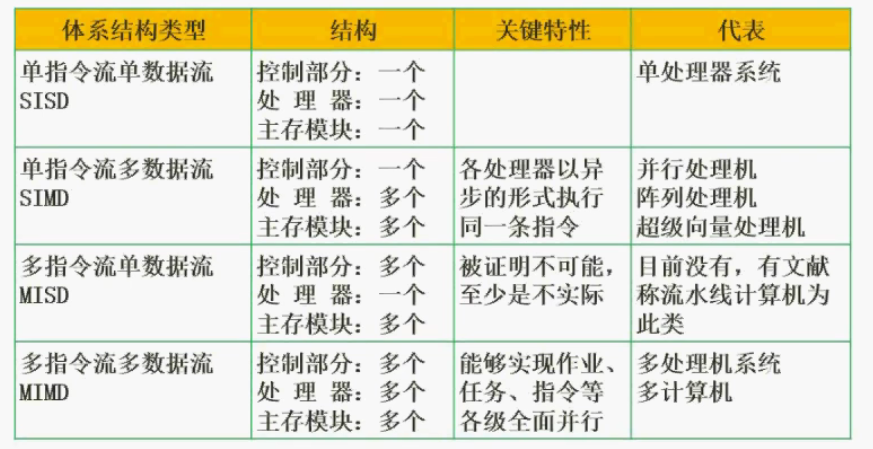

- 单指令流单数据流：单处理器系统：386/486/586/奔腾早期/单片机：==控制部件和处理器都只有一个==
- 单指令流多数据流：**阵列处理机**：适合处理数组运算
- 多指令流单数据流：暂时没有实现
- 多指令流多数据流：目前主要流行模式

### 1.4CISC与RISC

CISC：计算机理论刚刚开始流行的时候提出。根据不同的用户做不同的指令，复杂指令集

RISC：精简指令集：引入了寄存器，大大提高了运算速度


### 1.5流水线技术

#### 1.5.1什么是流水线？


目的：减少部件的浪费

#### 1.5.2指令执行的顺序

 ==**-->取指-->分析-->执行-->**==

#### 1.5.3使用流水线或者不使用流水线的指令执行情况


#### 1.5.4流水线耗时计算

考试：执行n条指令需要消耗的时间？

答案：理论公式（98%）/实践公式（2%）==根据考试答案衡量正确与否==

流水线执行周期：△t：执行时间最长的一段

实践公式中的K是指流水线的执行段数

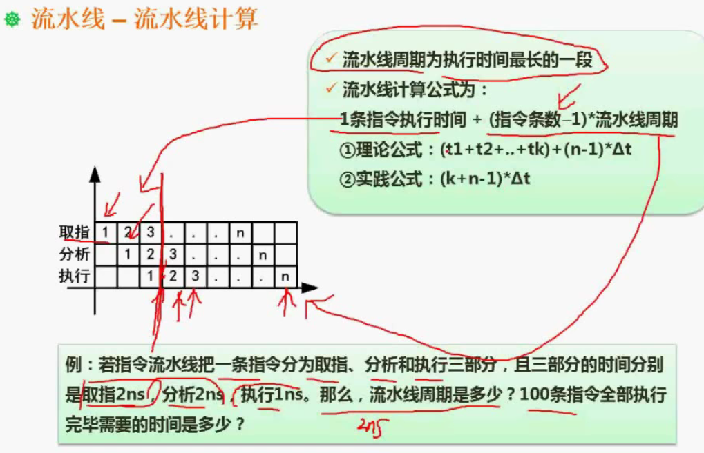

#### 1.5.5流水线吞吐率


最大吞吐率忽略流水线的建立时间比流水线周期长的时间

#### 1.5.6流水线的加速比

加速比越高越好

#### 1.5.7计算流水线的效率

流水线每个阶段的耗时尽可能相等的情况下流水线的效率最高


### 1.6存储系统

#### 1.6.1层次化存储结构

越小越快，越大越慢（基于性价比的考虑）


#### 1.6.2局部性原理

集中时间段对某段空间的集中访问


- 时间局部性：例如上图S+=j这条代码是要执行1000000次的，如果将这段代码直接放入到Cache里面就会大大提高计算效率，如果没有在Cache里面，每一次都要调用主存储器的，这样的花销就会很大。
- 空间局部性：就是访问了一个存储空间以后，立即访问他的临近空间
- 工作集理论：就是把经常访问的界面，放到一个集合里面

相联存储器

#### 1.6.3Cache


Cache的访问命中率：CPU从Cache中读到数据的概率

#### 1.6.4主存


RAM:断电即失，随机存储器，相当于电脑的内存

ROM：断电不丢失，例如BIOS。

==主存编址==


大地址减小地址然后加一。

[16. 2.15 随机存储器与只读存储器_哔哩哔哩_bilibili](https://www.bilibili.com/video/BV1oG4y1q77w/?p=16&spm_id_from=pageDriver&vd_source=e807673b1b75f152a538b328dcd67f24)

#### 1.6.4磁盘

盘面，磁头

磁道，扇区

存取时间=寻道时间+等待时间


**单缓存区**：磁头扫描到信息之后，单缓存区一次只能放一次信息，只有这个信息处理完毕之后，才能继续流入信息。

同时磁头扫描不会停止，会按照匀速往前转动，但是不读取信息。


第一次读取：

读取R0需要3ms，此时指针到了R1的开始部位，R0的信息进入单缓存区等待处理，缓存区处理信息3ms，但是读取R1的时候需要同时放入缓存区，因为缓存区内的信息还未处理完，所以不选择进行R1的读取，同时，单缓存区强调为顺序处理，只能放弃读取R1，匀速转动往前推进，转动一个扇区3ms，需要重新转动到R1的开端，则转动一圈，经历了11个3ms，继续读取R1的信息，而此时单缓存区处理R0的信息完毕，读取完R1，磁头往前转动的同时，处理完R1的信息，以此类推···

总结：

读取信息、处理信息，且把磁头定位到下一个信息扇区的开头，需要的时间为：读取3ms，处理+磁头定位33ms，总计36ms，然后以此类推，一直处理R9+磁头定位R10，总计经历了10组，36ms*10=360ms。

最后一组，读取R10需要3ms，处理3ms，不需要继续磁头定位。最后一组仅消耗6ms。

总计以上情况，共计消耗了（3ms+33ms）* 10+（3ms+3ms） * 1 = 366ms

### 1.7总线系统

1. 总线的概念

   总线是连接计算机有关部件的一组信号线，是计算机中用来传递信息代码的公共渠道

2. 总线的分类

   根据总线所处的位置不同，总线通常被分为三中类型。

   1. 内部总线

      微机内部的，各个外围芯片与处理器之间的总线，属于芯片级别

   2. 系统总线

      系统总线即为各个插线板和系统板之间的总线，其中包括

      1. 数据总线

         用来阐述数据的，如32位，64位等一次性能够传输的位

      2. 地址总线

         某个计算机中的地址总线为32位，那就代表它所能管理的地址空间为2的32个字节

      3. 控制总线

         发送相应控制信号的总线

   3. 外部总线

      即微机和外部设备的总线

### 1.8可靠性

#### 1.8.1串并联系统

1. 串联系统

   

   只要有一个子系统失效，则整个系统都将失效

   - 串联系统的可靠性计算

     每个组成系统的可靠性相乘所得的乘积则为整个系统的可靠性

   - 串联系统的失效性计算

     每个系统的时效性相加所得的和则为整个系统的失效性

2. 并联系统

   少数子系统的失效不会影响整个系统

   - 并联系统的可靠性

     

   - 并联系统的失效性

#### 1.8.2N模冗余系统与混合系统

1. N模冗余系统

   n个功能相同的系统同时处理，然后将结果放在表决器中，然后通过表决来得到最终的输出结果

   其中表决器将采用少数服从多数的原则，输出大多数子系统得到的答案

   面向一些高可靠性的要求时，==需要提高系统的可靠性==，便可以采用N模冗余模型来搭建系统

2. 混合系统

   混合系统指的是串联系统和并联系统的混合

   其中混合系统的有效率计算思路：观察给的图示看当前系统的大方向是哪种系统，然后观察细微的为哪种系统，然后结合上文中提到的计算方式来计算整个混合系统的可靠性

#### 1.8.3可靠性和可用性

1. 可靠性

   可靠性是指系统在给定的时间间隔内，给定条件下无失效运作的概率

2. 可用性

   可用性是指给定的时间点上，一个系统能够正常运作的效率

3. MTBF和MTTF

   1. MTBF：平均失效间隔时间
   2. MTTF：平均无故障时间

### 1.9差错控制之校验码

1. 什么是检错和纠错？
   1. 检错：将错误检查出来
   2. 纠错：将错误检查出来的同时并进行纠正
   3. 实现检错和纠错的方式：增大码距

#### 1.9.1码距

1. 什么是码距？

   整个编码系统中任意两个码字之间的最小距离

2. 码距的作用

   增大码距能够起到检错的作用

   码距的长度达到一定长度（一般短的情况下）能够达到检错的目的

   码距继续增加到一定长度，能够达到纠错的目的

3. 码距和检错、纠错的关系

   1. 一个码组内为了检测e个误码，要求最小的码距应满足：d>=e+1
   2. 一个码组内为了纠正t个误码，要求最小的码距应满足：d>=2t+1

#### 1.9.2循环校验码CRC

[(36条消息) 循环冗余校验码（CRC）详解_InterestAndFun的博客-CSDN博客_crc校验码](https://blog.csdn.net/interestANd/article/details/115544588)

1. 模2除法

   

2. 异或操作

   00为0

   11为0

   10为1

   01为1

3. 循环校验码CRC

   1. 可以检错但不可纠错

   2. 原理：在原始报文上添加上校验信息，然后让其与循环校验码的生成多项式进行模2运算，余数添加到报文的后面，这时候的原始报文就是CRC。然后拿循环校验码的生成多项式进行模2运算余数为0，说明传输过程中不会出现错误。若不为0则传输过程中出现了错误。

   3. 生成多项式：生成的多项式是一个二进制数，如"X^4+ X^3+X+1",这个多项式实际上就是二进制数11011，在于原始报文模2相除是，需要在原码的后方添加一些0，添加的0的个数就等于生成多项式的二级制数位的个数减去一，增加的0即为校验信息

   4. 计算CRC编码

      

#### 1.9.3奇偶校验码

[秒懂 奇偶校验码 - 知乎 (zhihu.com)](https://zhuanlan.zhihu.com/p/26509678)

1. 什么是奇偶校验码

   奇偶校验码是检验码，它用来检测数据传输过程中是否发生错误，是众多校验码中较为简单的一种

2. 奇校验

   奇校验：原始码流+校验位，总共有奇数个1

3. 偶校验

   偶校验：原始码流+校验位，总共有偶数个1

   

4. 奇校验还是偶校验？

   都有应用。

   奇校验一个重要的特征是产生不了全0编码，所以在实际过程中选择的时候考虑好这一点。

同时，因为奇偶校验码检测出数据是否出错，而不能检测哪一位出错，为此提出了海明校验码

#### 1.9.4海明校验码

海明校验码需要掌握的程度：

1. 海明码基本的编码规则，如何编码
2. 多少位的信息位需要多少位的校验位
3. 计算信息串中哪里是信息位，哪里是校验位


1. 什么是海明校验码？

   海明校验码是利用奇偶性来检验和纠错的校验方法

   ==海明校验码的构成方法是在数据位之间的确定位置插入k个校验位，通过扩大码距和实现检错和纠错==

   对于数据位为n的数据，加入k位的校验码，它应满足以下公式：

   

   公式的意思是：可以用来校验错误的数据个数（2^k-1）要大于或者等于原数据位数（n）和校验位数（k）的和。

2. 海明校验码的编码规则

   理解：

   1. 校验位只可放在2的次方的位置，从右开始计数位数，2的0次方是1，2的1次方是2，依次类推。
   2. 可以使用画表的方式来计算整个的海明校验码

   

## 2.计算机软件知识

### 2.1.操作系统知识

#### 2.1.0.操作系统概述

1. 操作系统的作用
   1. 管理系统的硬件、软件、数据资源
   2. 控制程序运行
   3. 人机之间的接口
   4. 应用软件与硬件之间的接口
2. 操作系统的管理职能
   1. ==进程管理==：**进程的状态、前趋图、PV操作，死锁问题（银行家算法）**
   2. ==存储管理==：**段页式存储、页面置换算法**
   3. ==文件管理==：索引文件、位示图
   4. 作业管理
   5. 设备管理
   6. ==微内核操作系统==：**虚设备与Spooling技术**
3. 应试
   1. 上午考试中一般占到5-7分
   2. 重点
      1. ==**银行家算法**==
      2. ==**PV操作**==
      3. ==**文件管理**==
      4. ==**存储管理**==
      5. ==**操作系统的分类及其特点**==


#### 2.1.1.进程管理

##### 2.1.1.1进程状态

1. 什么是进程的状态？

   进程的状态是指操作系统当中对进程进行管理的时候为进程指定相应的状态，以便为进程分配相应的资源把进程管理起来。

2. 进程的状态的分类

   1. 三态模型

      1. 运行

         当前进程被分配到足够的资源，且CPU分配了时间片来运行

      2. 就绪

         就绪的状态是指除了CPU资源意外的所有资源都已经准备就绪

         处于就绪状态的程序需要排队获取CPU资源，且即使得到了CPU资源，进程的运行时间也是有限的。

      3. 等待

         等待状态下进程除了缺少CPU资源还缺少其他资源，如用户指令或者外设支持等资源

      

   2. 五态模型

      最初的三态模型纯熟之后，我们发现一个问题，就是三种状态不足以涵盖我们常见的情况，因此提出了五态模型

      1. 运行

      2. 活跃就绪（就绪）

      3. 静止就绪

         静止就绪是指该进程处于运行态，但是由于人为的需要，由运行状态将其退至静止就绪状态，即挂起操作，再次恢复或者激活该程序时，该程序就由静止就绪转为活跃就绪进而等待被调度。

      4. 活跃阻塞

      5. 静止阻塞

      

##### 2.1.1.2前趋图

1. 前趋图概念

   前趋图是将一个完整的进程所需的工序按照是否具有先后关系和约束关系将进程再次区分的图

2. 模型实例

   

   前趋图功能使我们直观地知道哪些任务可以并行，哪些任务有先后关系

##### 2.1.1.3同步与互斥

1. 同步

   1. 同步就是在同一时刻只允许某一个进程使用这一个资源，即统一资源不能服务于多个进程
   2. **同步的反义词是异步**

2. 互斥

   1. **互斥的反义词是共享**

3. 经典问题

   1. 步行和自行车

      

   2. 生产者和消费者问题

      1. 对于单缓冲情况而言，市场是一个互斥资源且只允许一个人进行操作，不允许多个人进行操作
      2. 操作包括生产者放置商品和消费者拿走商品
      3. 生产者放置一个商品在市场中，然后如果我们还想要在放置商品就会出现溢出的情况，那么只有等待商品被消费者拿走，才能放置下一个商品
      4. 生产者和消费者存在速度差异和等待过程，这就是同步的情况。多缓存情况一样，只不过可以放置的商品变多了。

      

##### 2.1.1.4.PV操作


1. PV操作中的概念：PV操作就是两种原子操作的组合

   1. 临界资源

      各个进程间需要互斥方式对其进行共享的资源，如打印机，磁带机等等

   2. 临界区

      代码块

      各个进程访问临界资源的那段代码称为临界区

   3. 信号量

      一种特殊的变量，特殊在于专用于PV操作的变量，比如：P（S），V(S)中的S就是信号量

2. P操作的主要步骤

   1. S减一
   2. 若S减一之后仍然大于等于0，则进程继续执行
   3. 若S减一之后小于0，则该进程被阻塞后放入等待该信号量的进程队列中，然后等待调度

3. V操作

   1. S加一
   2. 若相加之后结果仍然大于0，则该进程继续执行
   3. 若相加之后结果小于或等于0，则从该信号的等待队列中释放一个等待进程，然后再返回原进程继续执行或者转进程等待调度

4. 单缓冲区生产者和消费者问题使用PV原语进行描述

   

5. 例题

   1. 书店收银员问题

   

6. PV操作的解题思路

   找出约束关系，在过程中模拟假设执行哪个进程会遇见什么问题，应该在哪里有什么约束，假设执行另外一个进程又会面临什么问题，然后把PV操作加起来就能够解决问题

7. PV操作和前趋图的使用

   1. 对于前趋图，箭线表示前驱和后继关系，前驱进程完成需要通知后继进程（使用V()操作进行通知），后继进程开始前需要检查前驱进程是否完成（用P（）操作）进行检查

   2. 在前趋图中，每一个箭头流出指向后继进程，都会有一个V()操作通知后继，每一个箭头的流入都是始于前趋进程，需要检查前趋进程是否完成，使用P（）操作进行检查

      

   

   2. 例题

   

##### 2.1.1.4死锁

1. 什么是死锁

   进程管理是操作系统的核心，但是设计不当就会出现死锁的问题。

   如果一个进程在等待一件不可能发生的事情，这个进程就死锁了。

   如果一个或者多个进程产生死锁，就会造成系统死锁。

2. 发生死锁的四大必要条件

   1. 互斥
   2. 保持和等待
   3. 不剥夺：系统不会把已分配给一个进程的资源剥夺掉分配给其他进程
   4. 环路等待：如果总计有三个进程，A等待B给A释放资源，B等待C给B释放资源，C等待A给C释放资源，这样子就形成了环路等待

3. 死锁的预防和避免

   1. 预防

      死锁的预防就是通过打破四大必要条件

   2. 避免

      死锁的避免分成两种：有序资源分配法和银行家算法

      1. 有序资源分配法

         1. 概述：将资源先分配给A进程，再分配给B进程，然后最后是C进程，以此类推。将系统资源按照顺序分配给进程，一个进程完成后才能将资源分配给下一进程
         2. 效率：该方法的资源利用率比较低，所以一般会采用银行家算法

      2. ==**银行家算法**==

         1. 银行家算法是以银行房贷的思路来做资源的分配的

         2. 分配原则

            1. 当一个进程对资源的最大需求量不超过系统中的资源数时可以接纳该进程
            2. 进程可以分期请求资源，但请求的总数不能超过最大需求量
            3. 当系统现有的资源不能满足进程尚需资源数时，对进城的请求可以推迟分配，但总能使进程在有限的时间里得到资源

         3. 例题

            

            

4. 死锁相关的计算题

   1. 计算机系统至少需要多少资源将不可能发生死锁问题
   2. 银行家算法的相关例题

#### 2.1.2.存储管理

##### 2.1.2.1分区存储组织

1. 四种不同的存储管理分配算法

   1. 首次适应算法：顺次寻找首个能够容纳目标空间的空白区域，并在其中切割一块出来放置目标
   2. 最佳适应算法：分配空间时希望能够分配到与目标作业所需空间最接口的空间，这样就能给整个系统保留大块的空白区域，**不好处就是会产生很多碎片空间，且不连续**
   3. 最差适应算法：将即将执行的作业存放到最大的空白区域
   4. 循环首次适应算法：每次分配都是从刚分配的空白区域中寻找一个满足需求的空白区域。

   

##### 2.1.2.2页式存储组织

1. 由来

   1. 为了解决分区存储带来的内存碎片化问题提出了页式存储

2. 具体思路

   1. 把用户程序分成等份大小的页，比如等分成n个4k大小的区域，每个区域称为页，同样把内存当中的存储区也分成等份大小（块大小和页大小相同）的块
   2. 调用程序时，不再是一次性将程序全部调入，而是需要哪些页就通过页表调用到相应的块

   

3. 掌握

   1. 逻辑地址和物理地址的转换

      

      1. 什么是逻辑地址？

         ==**逻辑地址=页号+页内地址**==

         高级程序语言使用逻辑地址

         

      2. 什么是物理地址？

         ==**物理地址=块号+页内地址**==

      3. 通过逻辑地址求物理地址

         1. 逻辑地址和物理地址的页内地址是相同的
         2. 逻辑地址的页号与物理地址的块号是不相等的，也可以做到相等。

      4. 例题

         

         

4. 优劣

   1. 优点：利用率高，碎片小，分配及管理简单
   2. 缺点：增加了系统开销（读取页表和查询页表的映射关系都会增加系统开销）；可能出现抖动现象

##### 2.1.2.3段式存储组织

1. 概念

   1. 段式存储中的段包含段号和段内地址两部分

      

2. 具体思路

   1. 按照逻辑结构划分，将main主函数作为一个段，然后第一个f(x)子函数作为第一个段，再来第二个子函数作为一个段，以此类推，段之间的大小不要求一致，按照这种逻辑方式最大的好处就是便与共享

   2. 段表

      其中存储段号、段长、基址（基地址就是段在内存空间中是从哪一个地址开始的一个连续空间段）

      短的长度是有限的，如果段号长度大于段表长度则判断越界，发出中断信号

      

3. 掌握

   

4. 优劣

   1. 优点：多道程序共享内存，各段程序互不影响
   2. 缺点：内存利用率低，内存碎片浪费大

##### 2.1.2.4段页式存储组织

1. 概念
   1. 段页式存储是结合了段式和页式的一种存储组织，先分段再分页
   2. 段页式存储属于折中产物，将两者的优点结合起来
2. 优缺点
   1. 优点：空间浪费小，存储共享容易，存储保护容易，能动态连接
   2. 缺点：增加了管理软件，复杂性和开销随之增加，需要的硬件以及占用的内容也有所增加，使得执行速度 大大下降（因为需要先查段表在查页表）

##### 2.1.2.5快表

快表是一块小容量的相联存储器，由高速缓存器组成，速度快，并且可以从硬件上保证按照内容并行查找，一般用来存放当前访问最为频繁的少数活动页面的页号

1. 相联存储器是按照内容进行存储的，速度非常快，效率非常高
2. 快表是放在Cache（高速缓存器）当中的，而段表和页表放在内存中就称为慢表

##### 2.1.2.6页面置换（淘汰/调度）算法

1. 应用背景

   1. Cache的数量有限，当Cache的块都被占了，需要调用新的块进来时，就涉及到了页面的置换问题
   2. 当进程运行过程中，若其访问的页面不在内存中而需要将其调入，但内存没有闲暇的空间，就需要从内存中调出一页程序或者数据

2. 分类

   1. 最佳置换算法（OPT）

      所选择的被淘汰页面将是以后永不使用的，或者在最长时间内不在被访问的页面，这样可以保证最低的缺页率

      **最佳置换算法由于无法从得知若干页面在未来最长时间不会被访问，因此该算法无法实现**

   2. 随机置换算法（RAND）

      随机淘汰一个页面，具有不稳定性

   3. ==**先进先出算法（FIFO）**==

      优先淘汰最早进入内存的页面，也就是在内存中驻留时间最长的页面

      缺点：可能会产生抖动现象

   4. ==**最近最少使用算法（LRU）**==

      选择最近最长时间没有访问的页面予以淘汰，它认为过去一段时间内未被访问过的页面，在最近的将来也不会被访问。根据局部性原理解释

3. “抖动”现象

   1. **==抖动现象是说在页面置换过程中一种最高糟糕的情形就是，刚刚换出的页面马上又要进入主存，刚刚进入的页面马上又要换出主存，这样频繁的页面调度行为称为抖动。==**
   2. 如果一个进程在换页上用的时间多于执行时间，那么这个进程就在颠簸

4. “缺页”现象

   缺页现象是说需要访问的页面不在内存中

5. 例题

   1. 考试实例

      1. 注意点：**指令跨页默认为只会产生一次缺页中断，数据类型跨页默认会产生两次缺页中断**
      2. 访问几次内存：查询页表一次，查询对应的内存块再一次

      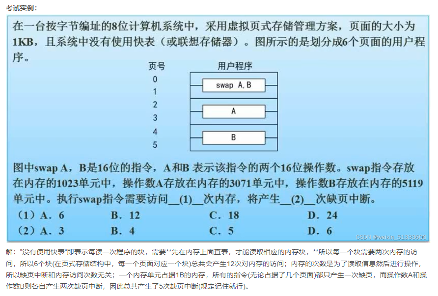

#### 2.2.3.文件管理

##### 2.2.3.1索引文件结构


1. 概念

   1. 索引文件结构是一种非常巧妙的文件结构，由于结构本身容量非常有限，但是引入了一种扩展机制能够方便地将容量扩大很多倍
   2. 一般的索引结构是有13个节点，编号从0开始。（注意：考试中存在不一定是13个节点的文件结构，题目会说明节点的情况，没有说明就是标准的13个节点的文件索引结构）

2. 索引类别

   1. 直接索引
      1. 规定0-9的地址是直接索引，地址对应的是物理盘块，物理盘块存储内容
   2. 一级间接索引
      1. 10属于一级间接索引
   3. 二级文件索引
      1. 11是二级间接索引
   4. 三级间接索引
      1. 12是三级间接索引

3. 优缺点

   1. 优点：分级越多存储的内容会越多
   2. 缺点：查询效率会降低

4. 例题

   1. 例题一

      

      

##### 2.2.3.2.文件和树形目录结构


1. 树形目录结构
2. 相对路径：从当前路径开始的路径
3. 绝对路径：从盘符开始的路径
4. 文件属性
   1. 只读R
   2. 存档A
   3. 系统S
   4. 隐藏文件H
5. 文件名的组成
   1. 驱动器号+路径+主文件名+扩展名

##### 2.2.3.3.空闲存储空间的管理

1. 概念

   1. 空闲存储空间就是磁盘上存在大量的空间，为了有效管理这些空间提出了空闲存储空间管理的方法

2. 管理方法分类

   1. 空闲区表法

      用一张表记录哪些地方是空闲的，以便管理起来

   2. 空闲链表法

      把空闲区域都链起来，连成一个链表，然后需要分配空间的时候，从这条链表中划分出一部分即可

   3. 成组链表法

      分组也分连的方法进行管理

   4. 位示图法（重点）

      1. 概念

         画一个位示图（表格），该图中1表示该区域已经被占用，0表示该区域还是空闲的

         将存储空间分成若干个物理块，就能够直接地表达出物理块是否被占用

      2. 生活实际应用：电影院，机场座位编号图

3. 例题

   1. 位示图例题

      

      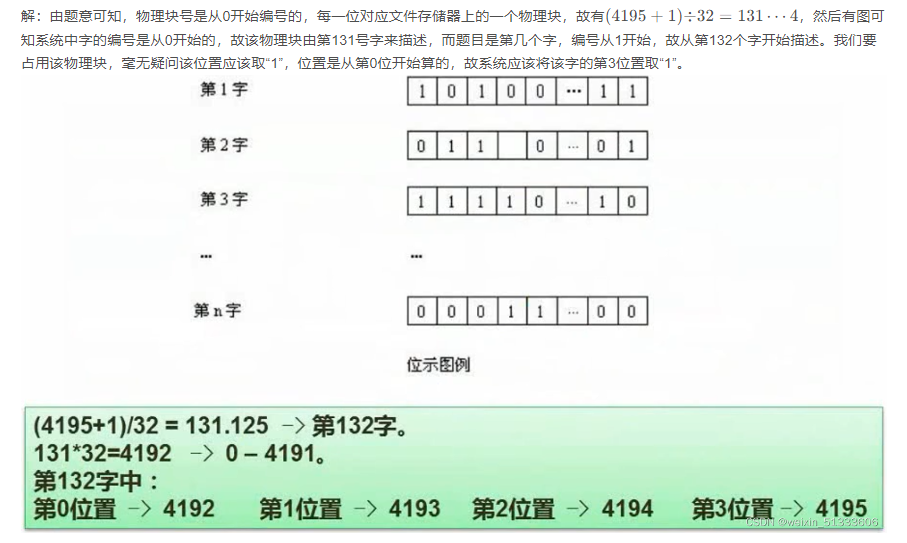

##### 2.2.3.4.设备管理/数据传输控制方式

1. 设备管理的5个层次
   1. 用户进程
   2. 与设备无关的系统软件
   3. 设备驱动程序
   4. 中断处理程序
   5. 硬件
2. 数据传输控制方式
   1. 概念
      1. 数据传输控制就是指内存和外设之间的数据传输问题
      2. 解决方法包括：程序控制方式、程序中断方式、DMA方式、通道、输入输出处理机。其中前三种要求掌握，最后两种一般是运用在特殊的计算机上解决数据传输问题
   2. 分类
      1. 程序控制方式
         1. 又称为程序插叙方式，这种方式是最为低级的，**也是CPU介入最多的一种方式**，即整个数据的传输控制需要CPU的介入
         2. 此时外设处于非常被动的地位，既不能主动的反馈信息，比如：是否完成是否中断等信息，而是由CPU主动发出查询指令，进而才能对信息进行查询
      2. 程序中断方式
         1. 基本和程序控制方式相同，但相较于程序控制方式，添加了中断机制，存在了主动性，即：如果外设完成了数据的传输或发布等操作，外设会发出中断指令，系统就会进行下一步处理，效率比程序控制方式高
      3. DMA方式（Direct Memory Access，直接存储器访问）
         1. 在该方式中会有专门的DMA控制器管控外设和内存之间的数据交换过程，CPU只需要在开头进行一些介入，比如做好初始化等等，整个过程有DMA控制器完成，完成后由CPU接管后续工作，这样大大提高了效率
      4. 通道
      5. 输入输出处理机

##### 2.2.3.5.虚设备与SPOOLING技术

Spooling技术是关于慢速字符设备如何与计算机主机交换信息的一种技术，通过叫做“假脱机技术”

Spooling技术通过磁盘来实现


##### 2.2.3.6.微内核操作系统


结合微服务思考，两者比较类似

1. 为什么将操作系统做的更小？
   1. 追求系统的可靠性、稳定性、安全性
2. 微内核操作系统划分
   1. 用户态
   2. 核心态

### 2.2.程序设计语言和语言处理程序知识

PS：正规式每次都会考到，表达式偶尔会考察到，传值与传址考察频率比较高，其他的了解即可

#### 2.2.1编译过程

编程语言从执行原理上可分为编译型语言和解释型语言。

计算机不能直接理解机器语言之外的语言，因此需要将我们写的代码编译成机器语言，再交给计算机去执行。

具有把其他语言翻译成机器语言功能的称为编译器。

编译过程：


1. 词法分析：程序员编写的源程序首先进行词法分析，就是检查语言的关键词是否出现词法错误。
2. 语法分析：词法正确，检查词法连接成的语法是否出现语法错误
3. 语义分析：往往只能分析出一部分的错误，有些错误是无法通过机械化方法分析出来，这也是一些程序的bug，难以杜绝的通过机器检查的方式难以发现。
4. 中间代码生成
5. 代码优化：具体操作是如何匹配相应的系统使整个代码的效率提高
6. 目标代码生成需要转化成目标程序
7. 目标代码往往指的可执行的代码，涉及到底层硬件的一些东西，相当于转换成机器可执行的东西。

#### 2.2.2文法的定义以及语法推导树

1. 概念

   一个形式文法是一个有序四元组G=（V，T，S，P）其中

   1. V：非终结符，不是语言组成部分，不是最终结果，可以理解为占位符
   2. T：终结符，是语言的组成部分，是最终结果。V∩T=∅
   3. S：起始符，是语言的开始符号
   4. P：产生式，用终结符号代替非终结符号的规则，例如α->β

2. 文法的类型：0型，1型，2型，3型

   1. 0型又称为短语文法
   2. 1型又称为上下文有关文法
   3. 2型又称为上下文无关文法
   4. 3型又称为正规文法

3. 语法推导树

   用来进行语法规则的推导，通过推导树，我们可以了解到一种语法能够表达的穿，以及能够构造的句型是什么样子

   

#### 2.2.3有限自动机与正规式

##### 2.2.3.1有限自动机


##### 2.2.3.2正规式

正规式是有限自动机的另一种表达形式，正规式是描述程序语言单词的表达式


#### 2.2.4表达式


#### 2.2.5函数调用（传值与传址）


传值调用：形参取的是实参的值，形参的改变不会导致调用点所传的实值发生改变

传址调用：形参取得是实参的地址，相当于实参存储单元地址的引用，因此其址的改变就改变了实参的值

#### 2.2.6各种程序语言的特点

1. Fortran语言(适用于科学计算，执行效率高)
2. Pascal语言 (为教学而开发的, 表达能力强，引申出了Delphi )
3. C语言 (指针操作能力强，高效 )
4. Lisp语言 (函数式程序语言，符号处理，应用于 人工智能 )
5. C++ 语言 (面向对象，高效 )
6. Java语言 (面向对象，中间代码，跨平台 )
7. C#语言 (面向对象，中间代码，.Net )
8. Prologi语言 (适用于逻辑推理，简洁性，表达能力，数据库和专家系统 )

### 2.3.数据库知识

==**重点**==：规范化理论，关系代数

#### 2.3.1.数据库模式


1. 三级模型-两级映射

   1. 三级模型

      1. 内模式
         1. 又称为物理数据库模式，它是和物理层次数据库直接关联的，负责管理存储数据的方式，即数据应以什么格式存放在物理文件上，以及如何优化这些存储方式
         2. 该模式重点关注在数据如何存放
         3. 对于内模式，又叫存储模式，对应文件级别，是数据结构和存储方式的描述，是数据在数据库内部表示的表示方法，定义所有内部的记录类型，索引和文件的组织方式，以及数据控制方面的细节，例如B数结构存储，Hash方法存储，聚簇索引等等
      2. 概念模式
         1. 又称为概念级数据库，即数据库中的“表”，在该模式中，根据业务和应用，数据被分为了若干张表，表和表之间会有相应的关联
         2. 对于概念模式，对于表级，是数据库中全部数据的逻辑结构和特质的描述，若干个概念记录类型组成，只涉及类型的描述，不涉及具体的值
      3. 外模式（用户模式）
         1. 处于用户的应用层次，即数据库中的视图，使用户在对数据的控制上有了更多的手段以及更为灵活的处置方式

   2. 两级映射

      1. 概念模式-内模式映射

         管理内部的存储形式和表的一种情况的映射关系。

      2. 外模式-概念模式映射

         即视图和表之间的映射关系

#### 2.3.2.数据库设计

##### 2.3.2.1.数据库设计过程


##### 2.3.2.2.ER模型


1. E-R模型的构成

   1. 实体：方框
   2. 属性：椭圆
   3. 联系：菱形

2. 局部/全局E-R图

   1. 局部E-R图
   2. 全局E-R图
   3. 集成产生的冲突和解决办法
      1. 属性冲突：同一属性可能会存在不同的分E-R图中，由于设计人员不同或是出发点不同，对于属性的类型、取值范围和数据单位等可能会不一致
      2. 命名冲突：相同意义的属性再不同E-R图中有着不同的命名，或是名词相同的属性在不同的分E-R图中代表不同的含义
      3. 结构冲突：同一实体再不同的分E-R图中有不同的属性，统一对象在某一分E-R图中被抽象为实体，而在另一E-R图中被抽象为属性，需要统一

3. E-R图转关系模式的两条原则

   1. 一个实体转换一个关系模式

   2. 联系转换关系模式

      1. 1:1联系
      2. 1：m联系
      3. m:n联系

   3. 特例：三个以上实体间的一个多元联系

      

##### ==**2.3.2.3.关系代数**==


1. 并∪

2. 交∩

3. 差-

4. 笛卡尔积x

   1. 笛卡尔积当中，会把两个参与笛卡尔积的集合的属性一一列举出来，成为笛卡尔积最终的结果，前一部分是S1，后一部分是S2

   

5. 投影π（列）

   投影是选列的操作

   

6. 选择σ（行）

   选择是选择行的操作

   

   ==**投影和选择操作的列名和行名可以使用数字代替，如下图**==

   

7. 联结⋈

   一般联结操作下方写联结的条件

   

   如果没有写条件，则为自然联结

   所谓自然联结就是两张表中相同的字段做等值连接

   ==**联结和笛卡尔积最大的区别就是联结只会保留相同列中的其中一个**==

   

#### 2.3.3.规范化理论

##### ==2.3.3.1.函数依赖==

1. 函数依赖

设R(U)是属性U上的一个关系模式,X和Y是U的子集,r为R的任一关系,如果对于r中的任意两个元组u,v,只要有u[X]=v[X],就有u[Y]=v[Y],则称X函数决定Y,或称Y函数依赖于X,记为X→Y。


2. 函数依赖的分类

   1. 部分函数依赖

      A和B的组合键可以确定C，同时A也可以确定C，也就是组合键中的部分键便可确定其他键。

   2. 传递依赖

      A确定B，B确定C，推理可得A可以确定C

##### 2.3.3.2.规范化理论

1. 非规范化的关系模式可能出现的问题

   1. 数据冗余
   2. 更新异常
   3. 插入异常
   4. 删除异常

   

2. 规范化理论的价值

3. 规范化理论的用途

##### 2.3.3.3.键


1. 键

   实体的属性的集合

2. 数据库系统中键的分类

   1. 超键

      唯一能够标识元组的键，可以是单个的属性，也可以是属性的集合

      例如：学号可以找到唯一的学生，（学号+姓名）可以找到唯一的学生，（学号+姓名+身份号）可以找到唯一的学生

   2. 候选键

      1. 候选键是一种特殊的超键，它是在超键的基础上消除冗余属性得到的键，也可以是多个。

         例如：

         - 学号可以是候选键
         - 学号+身份证可以是候选键，两者都可以唯一标识
         - 学号+姓名+身份证就不是候选键，单拎出姓名不可以唯一标识一个学生

      2. 求候选键的步骤

         1. 将关系模式的函数依赖使用“有向图”的方式表示
         2. 找到入度为0的属性，并==**以该属性集合为起点**==，尝试遍历有向图，若能遍历图中所有的节点，则该属性集合即为关系模式的候选键
         3. 若入度为0的属性集合不能遍历图中的所有节点（或者没有入度为0的属性），则需尝试性地将一些中间节点（既有入度也有出度的节点）并入到入度为0的属性集合中，直到该集合能遍历所有的节点，该集合即为候选键

      3. 例题

         

   3. 主键

      唯一标识元组的键

      从候选键中选择一个作为主键

   4. 外键

      外键是其他关系的主键，在做关联查询的时候需要用到

##### ==2.3.3.4.范式（NF）==


1. 概念
   1. 范式的符号为：NF
   2. 范式分等级，目前常用的为一级范式，二级范式，三级范式，以及BC范式，还有更高的范式
   3. 随着范式等级的提高，规范化程度就会越高，数据表的拆分也会越来越细，而数据表拆分地过细会造成性能方面的问题，通常在对范式的处理过程中采取折中的方法，要求达到第三范式即可。
   4. 建立关系模式过程中可能会出现的问题
      1. 插入异常
      2. 删除异常
      3. 数据冗余
      4. 更新异常
2. 分类
   1. 第一范式（1NF）
      1. 概念：在关系模式中，所有的字段都是不可再分的数据项，则称为第一范式。
   2. 第二范式（2NF）
      1. 概念：关系模式中，满足第一范式，且每个非主属性完全依赖主键（不存在部分依赖），则称为第二范式
   3. 第三范式（3NF）
      1. 概念：当且仅当满足第二范式，且没有非主属性传递依赖与码时，则称为第三范式
   4. BC范式（BCNF）
      1. 概念：设R是一个关系模式，F是它的（函数）依赖集，R属于BCNF当且仅当其F中每一个依赖的决定因素必定包含R的某个候选码
3. 例题
4. 提醒：当范式级别不够时，可以通过分解关系模式来提高范式级别。

##### 2.3.3.5.模式分解

1. 模式分解要求

   1. 保持函数依赖分解

      1. 所谓保持函数依赖分解，就是分解前有哪些函数依赖，分解之后这些函数依赖仍然存在，这就是保持函数依赖分解

   2. 无损分解

      1. 无损和有损
         1. 有损：不可还原
         2. 无损：可还原
      2. 无损联结分解：将一个关系模式分解成若干个关系模式后，通过自然连接和投影等运算仍能还原到原来的模式

   3. 例题

      1. 表格法判断有损无损

         

      2. 计算法判断有损无损

         1. 计算法局限性较强，只适合于一分为二的情况

            

#### 2.3.4.并发控制

##### 2.3.4.1.基本概念

1. 事务

   1. 事务的特性

      1. 原子性：事务的内容操作要么做，要么不做
      2. 一致性：在事务执行之前，数据保持一致的状态。执行之后也是一致的状态
      3. 隔离性：事务之间的执行是独立进行的
      4. 持续性：事务执行之后，其造成的结果是持续性的，即使数据库崩溃，其对数据库的更新操作也是永久有效。

   2. 并发产生的问题

      由于在关系型数据库中，允许多个用户同时访问和更改共享数据的进程。SqlServer使用锁定以允许多个用户同时访问和更改共享数据而彼此之间不会发生冲突。

      1. 丢失更新
      2. 不可重复读
      3. 脏数据

2. 封锁协议

   1. 锁的类别

      1. X锁：写锁或者排它锁

         如果事务T对数据加上X锁之后，就只允许事务T读取和修改数据，其他事务对数据A不能再加任何锁，从而不能读取和修改数据，直到事务T释放数据上的锁。

      2. S锁：读锁或者共享锁

         如果事务T对数据加上了S锁后，事务T就只能读数据但不可以修改，其他事务可以再对当前数据加S锁，只要数据加上了S锁，其他事务只能加S锁，但是不能加X锁。

   2. 协议等级

      1. 一级封锁协议

         事务在修改数据R之前必须对其加X（写锁或者排它锁）锁，直到事务结束才释放，可防止丢失修改，该锁可以使得除了当前事务以外的所有事务将不能访问R，而只有当前事务可以阅读和修改R。

      2. 二级封锁协议

         一级封锁协议加上事务T在读取数据R之前先对其加S（读锁或者共享锁）锁，读完后即可释放S锁，可防止丢失修改，还可以防止读“脏”数据。

         该锁的作用是，所有的事务都可以访问R，但包括T在内的所有事务都不能修改R。

      3. 三级封锁协议

         一级封锁协议加上事务T在读取数据R之前，先对其加上S锁，直到事务结束才释放，可以防止丢失修改，可以防止读“脏”数据与防止数据重复读

      4. 两段锁协议

         可串行化（通过加锁解锁的两个阶段使并发事务排队进行），可能会发生死锁。

3. 死锁问题

##### 2.3.4.2.数据库完整性约束

1. 实体完整性约束
2. 参照完整性约束
3. 用户自定义完整性约束
4. 触发器

#### 2.3.5.数据库安全

保证数据库安全的措施

1. 用户标识和鉴定
2. 存取控制
3. 密码存储和传输
4. 视图的保护
5. 审计


#### 2.3.6.数据库备份与恢复

##### 2.3.6.1.数据备份

1. 按照备份方式区分

   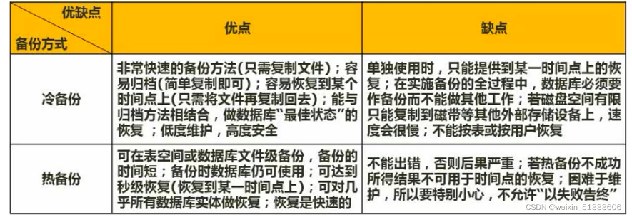

   1. 热备份
   2. 冷备份

2. 按照备份的量区分

   1. 完全备份
   2. 差量备份：仅备份上次完全备份之后变化的数据（可以解决增量备份可能出现的错误）
   3. 增量备份：备份上一个备份之后变化的数据，备份速度快

3. 四种转储方式

   1. 静态海量转储
   2. 静态增量转储
   3. 动态海量转储
   4. 动态增量转储

4. 日志文件

##### 2.3.6.2.数据库的故障与恢复


#### 2.3.7.数据仓库与数据挖掘

1. 数据仓库

   1. 数据仓库和数据库之间的联系

   2. 数据仓库的特点

      1. 面向主题，而不是面向应用
      2. 一般数据仓库会记录一些集成式的数据
      3. 相对稳定性
      4. 反映历史变化

   3. 数据仓库的建立阶段

      

      

2. 数据挖掘

   1. 数据挖掘的方法
      1. 决策树
      2. 神经网络
      3. 遗传算法
      4. 关联规则挖掘算法
   2. 数据挖掘方法的分类
      1. 关联分析：挖掘出隐藏在数据间的相互关系
      2. 序列模式分析：侧重点是分析数据间的前后/因果关系
      3. 分类分析：为每一个记录赋予一个标记在按标记分类
      4. 聚类分析：分类分析法的逆过程

#### 2.3.8.反规范化

反规范化是为了提高查询效率，以牺牲一些空间及规范程度为代价来提高查询的速度

1. 反规范化具体的技术手段
   1. 增加派生性冗余列
   2. 增加冗余列
   3. 重新组表
   4. 分割表

#### 2.3.9.大数据

大数据是一种对海量数据处理的一些相关技术。

（2022年10月24日23:24:23~）

### 2.4.计算机网络知识

#### 2.4.1.OSI/RM七层协议


1. 七层模型诞生的背景

   1. 七层模型是计算机网络的基石，计算机网络的整个基础就是构建在七层模型之上的。
   2. 由国际化标准组织简历

2. 局域网和广域网

   1. 局域网使用第一层和第二层
   2. 广域网使用剩余的层

3. 七层模型和四层模型

4. 各层简述

   1. 物理层
      1. 物理层是二进制传输，二级制数据就是高电平和低电平这样的数据。
      2. 中继器：由于信号会随着距离的增加而衰减，中继器则是接受一端的信息原封不动地发送给另一端，依次达到长距离传输的作用。
   2. 数据链路层
      1. 数据链路层有了信息单位---帧，传输过程中就好识别了，比方说网卡具有MAC地址，MAC地址就是一个帧地址
      2. 网桥是连接两个同类型网络的设备
      3. 交换机是多端口的网桥，用来将多个设备联网起来，交换机比集线器的性能高得多
   3. 网络层
      1. 三层交换机就是添加了路由功能的交换机
   4. 传输层
      1. TCP、UDP
   5. 会话层
   6. 表示层
   7. 应用层

5. 例题

   

#### 2.4.2.网络技术标准与协议


1. 简要背景描述

   1. 计算机网络世界中有一种“协议簇”的概念，所谓协议簇不是单一的协议，而是有多个协议的整合体。其中主要的是TCP/IP协议簇。
   2. TCP/IP协议簇是一个庞大的体系，其中根据TCP/IP协议簇会把网络划分为4层模型，TCP/IP和Internet进行了深度绑定，因此用途相当广泛，但效率并不是特别快，因此TCP/IP又被称为重量级协议

2. 协议簇分类

   1. TCP/IP：可扩展，可靠，应用最广，牺牲了速度和效率
   2. IPX/SPX：NONELL，局域网内联网游戏时广泛使用了这个协议做通信的支撑
   3. NETBEUI：IBM，该协议不支持路由，正因为不支持路由，因此速度非常快

3. 常见协议的基本功能

   1. 第三层网络层常见协议

      1. IP
      2. ICMP：Internet网的控制协议，使用的ping命令检查网络是否通畅就是用了ICMP协议
      3. IGMP
      4. ARP：地址解析，将IP地址转MAC地址
      5. RARP：反向地址解析协议，将MAC地址转成IP地址

   2. 第四层传输层

      1. TCP：可靠协议，通信时建立连接

         TCP协议具有验证机制，在传输过程中会有反馈，因此能及时地知道有哪些数据包正常的有目的的传到目的地。

         建立连接和断开连接的三次握手、四次挥手

         

      2. UDP：不可靠协议，通信时不建立连接

      3. 基于TCP的协议

         1. HTTP：超文本传输协议
         2. SMTP：简单邮件传送协议
         3. POP3：接收邮件
         4. FTP：文件传输协议
         5. Telnet：远程登录协议

      4. 基于UDP的协议

         1. DHCP：**局域网内使用DHCP服务器来实现IP的分配工作**

            DHCP客户端从DHCP服务器上获取本机的IP地址、DNS服务器的地址，DHCP服务器的地址、默认网关的地址，但是没有web服务器、邮件服务的地址

            1. IP地址分配的机制是 客户机/服务器模式
            2. IP地址的租约默认是8天，**租约过半，客户机需要向DHCP服务器申请续租，其中如果租期超过了87.5%仍未能和最初的DHCP服务器联系上，便开始联系其他的DHCP服务器**
            3. DHCP协议分分配策略
               1. 固定分配
               2. 动态分配
               3. 自动分配
            4. 局域网内两个非常特殊IP地址：169.254.x.x（Windows体系下）和0.0.0.0（linux体系下）
               1. 分配到上述两个地址则说明没有和DHCP服务器连接上，上述两个地址都是假地址，是不能和外界通信

         2. TFTP：简单邮件传送协议，和FTP相比，TFTP是不可靠的

         3. SNMP：简单网络管理协议

         4. DNS：域名解析服务

            1. DNS服务器负责域名和IP地址之间的转换。

            2. DNS体系中两种查询方式

               1. 递归查询
               2. 迭代查询

            3. 示例

               

               

         5. 例题

            

#### 2.4.3.网络类型与拓扑结构

1. 网络类型

   1. 按照范围分
      1. 局域网
      2. 城域网
      3. 广域网
      4. 因特网
   2. 按照拓扑结构分
      1. 总线型结构
      2. 星型结构
      3. 环状结构

2. 拓扑结构

   

   1. 总线型结构
   2. 星型结构
   3. 环状结构

#### 2.4.4.网络规划与设计


1. 网络规划原则

   1. 网络规划的基本原则
      1. 实用性原则
      2. 开放性原则
      3. 先进性原则
   2. 网络设计的基本原则
      1. 可用性
      2. 可靠性

2. 逻辑网络设计

   利用需求分析和现有网络体系分析的结果来设计逻辑网络结构，输出内容为以下几点：

   1. 逻辑网络设计图
   2. **IP地址方案**
   3. **安全方案**
   4. 具体的软硬件、广域网连接设备和基本服务
   5. 招聘和培训网络员工的具体说明
   6. 对软硬件、服务、员工和培训的费用初步估计

3. 物理网络设计

   物理网络设计是对逻辑网络设计的物理实现，通过对设备的具体物理分布、运行环境等确定，确保网络的物理连接符合逻辑连接的要求，输出内容如下：

   1. 网络物理结构图和布线方案
   2. 设备和部件的详细列表清单
   3. 软硬件和安装费用的估算
   4. 安装日程表，详细说明服务的时间以及期限
   5. 安装后的测试计划
   6. 用户的培训计划

4. 分层设计

   

   1. 接入层：向本地网段提供用户接入，**只有一个层次**
   2. 汇聚层：网络访问策略控制、数据包处理、过滤、寻址，**可以有多个层次**
   3. 核心层：数据交换，**只有一个层次**

#### 2.4.5.IP地址与子网划分（IPv4）

背景：

1. IPV4的地址是不够用的。

2. IP地址在使用过程中，由于原来的分类方式过于严苛，导致了一些问题

3. IPV4地址分成ABCDE五个类别，其中ABC这三个是普通的IP地址

   

4. 子网掩码

   1. 什么是子网掩码？

      1. 其实无论是划分多少个子网，还是把子网合并还是把一个网拆分，都利用到了子网掩码。子网掩码的本质是通过设置不同的子网掩码来进行网络的划分和网络的汇聚。
      2. **子网掩码其实就是用来区分一个IP地址哪部分是主机号，哪些部分是网络号，子网掩码中为1的部分对应网络号，为0的部分对应主机号。**

   2. 子网划分技术

      1. 将一个网络划分成多个子网
      2. 将多个网络合并成一个大的网络

   3. 如何计算子网掩码？

      1. 例题1：将B类地址168.195.0.0划分为27个子网，子网掩码是多少？

         

      2. 例题2：将B类地址168.195.0.0划分为若干个子网，每个子网内有主机700台，则子网掩码为多少？

         

5. 无分类编址（无类领间路由）

   1. IP地址={<网络前缀>，<主机号>}
   2. 
   3. 

6. 特殊含义的IP地址

   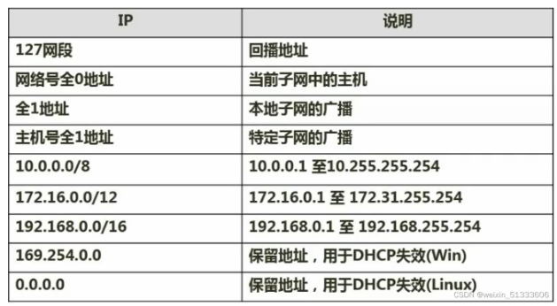

   

   

#### 2.4.6.HTML


#### 2.4.7.无线网


#### 2.4.8.网络接入技术


#### 2.4.9.IPv6

IPV6是设计用于代替现行版本IP协议的下一代IP协议

1. 为什么提出IPV6？

   1. 核心原因是IP资源严重不足以及IP地址分配不公平，世界上百分之70的IPV4地址都在美国

2. IPv6相较于IPV4有了哪些升级？

   1. 
   2. 

3. IPv6地址的分类

   1. 单播地址
   2. 任播地址
   3. 组播地址

4. IPv4和IPV6之间的过渡

   IPV4和IPV6的过渡期间，主要采用三种基本技术

   1. 双协议栈
   2. 隧道技术
   3. NAT-PT

### 2.5.多媒体基础知识

#### 2.5.1.音频相关概念


#### 2.5.2.图像相关概念

##### 2.5.2.1.亮度、色调、饱和度

- 亮度是明亮程度
- 色调是色温差异
- 饱和度是色彩艳丽程度

##### 2.5.2.2.光的三原色/印刷三原色

- 光的三原色：红、绿、蓝（靛蓝）
- 印刷三原色：品红、黄、青（天蓝）


##### 2.5.2.3.彩色空间


1. 彩色空间：电脑显示器采用的是RGB彩色空间
2. YUV是电视中常用的色彩空间。彩色电视出现前用的是黑白电视的信号，为了让同一组信号可以在黑白和彩色电视上使用，发明了YUV彩色空间，其中包括了灰度值（亮度值），黑白电视只需要接受其中的亮度值即可
   3.
   CMY是印刷领域用到的彩色空间，C对应艳青，M对应洋红，Y对应黄。但是光的颜色是叠加的原理，而印刷的颜色是采用相减的原理。比如假设印刷的一种涂料显示为黄颜色，是因为涂料能吸收除了黄颜色以外的任何颜色的光，并反射黄色光，其三种颜色重叠为黑色，实践上调出的黑色不够黑，显棕色，且重叠而产生黑色的成本高昂，于是提出了CMYK，单独提出来了黑色颜料
3. HSV和HSB彩色空间，称为艺术家彩色空间
4. 电视上还能够应用YIQ，YCBCR彩色空间，其中YCBCR是YUV衍生出来的

#### 2.5.3.媒体的种类


#### 2.5.4.多媒体相关计算问题

##### 2.5.4.1.图像容量计算


##### 2.5.4.2.音频容量计算

容量=采样频率（Hz） * 量化 / 采样位数（位） * 声道数 /8

##### 2.5.4.3.视频容量计算

容量=每帧图像容量（Byte）* 每帧秒数 * 时间 + 音频容量 * 时间

#### 2.2.6.常见的多媒体标准


JPEG是目前最常见的图像文件标准，是有损压缩标准。有比较高的压缩比，升级版是JPEG-2000，在专业领域应用广泛，如医学，其压缩包括有损和无损。

MPEG-1/2/4/7/21：

- 1：最大贡献是定义了VCD和MP3格式，MP3取名是因为在MPEG-1的第三层定义的。
- 2：定义了DVD格式
- 4：最大的改变和革新就是增加了增强交互性，在1和2中都是VCD，MP3，DVD等标准，而4中已经有了网络和可视电话等应用。
- 7：已经不是具体的应用，是多媒体内容描述接口。
- 21：是标准集成，是融合其他的标准。

##### 2.2.6.1.数据压缩基础

数据压缩的基础是有冗余。

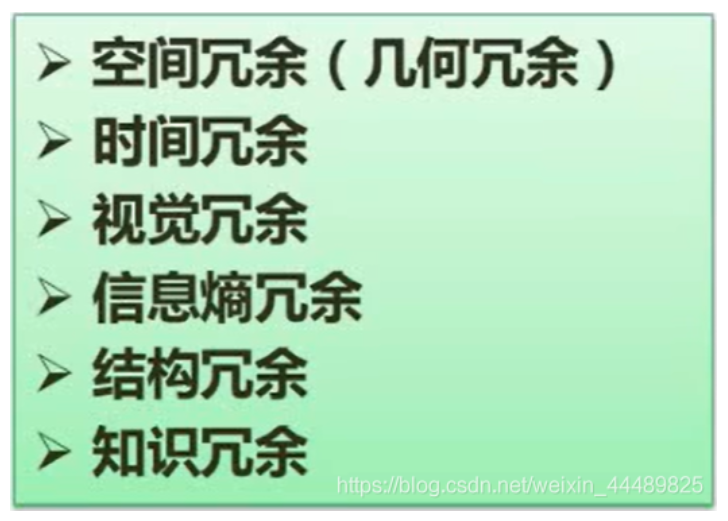

==冗余的分类：==

1. 空间冗余：比如拍照片，背景是白色的墙，那么大面积相同的像素点就存在空间冗余
2. 时间冗余：视频中老师讲课，只有老师在视频中随时间有形态变化，背景不动，不动的部分下一帧可以不刷新，这就是时间冗余。
3. 视觉冗余：人的视觉感知是有限的，比如几种颜色在人的视觉里是分辨不出来的，那么照片可以将这几种颜色统一为一种颜色。
4. 信息熵冗余：不同信息编码，冗余度不一样，可以合理编码降低冗余度
5. 结构冗余：某个结构部件有大量冗余，比如每个地砖花纹是一样的，照片有若干地砖，可以只记录一个地砖的花纹。
6. 知识冗余：可以通过知识得到，不需要再去记录的冗余。

##### 2.2.6.2.有损压缩与无损压缩


- 无损压缩称熵编码法：通过编码的方式做压缩。

- 有损压缩称熵压缩法：熵压缩即已经损害了原始信息。

- 最常见的无损编码是变长编码中的Huffman编码，把使用频度高的编码编的短一些，频度低的编码编的长一点。

- 常见的有损编码：离散，余弦，变换，预测

### 2.6.数据结构与算法基础

PS：上午下午都会考到且难度最高

重点：线性表、树与二叉树、排序与查找、算法基础及常见算法

#### 2.6.1.数组与矩阵

##### 2.6.1.1.数组


##### 2.6.1.2.稀疏矩阵

常考题型：计算稀疏矩阵当中某一个元素对应的一维数组的下标

1. 概念

   1. 在矩阵中，当数值为0的元素数目远远多于非0元素的数据，且非0元素分布没有规律时，则称该矩阵为稀疏矩阵，与之相反，若非0元素数据占据大多数时，则称该矩阵为稠密矩阵。定义非0元素的总数比矩阵所有元素的总数为矩阵的稠密度

2. 二维数组存入计算机中都是以一维数组顺次的形式存储下来的。

3. 代入法求解

   

#### 2.6.2.线性表

##### 2.6.2.1.数据结构的定义

1. 数据结构的概念

   数据结构就是计算机存储以及组织数据的方式而已。

2. 为什么研究数据结构

   研究数据结构是因为选择不同的数据结构可能带来的运行效率会非常之大。

   在同样的数据结构当中稍作调整可以让效率有很大的概念

3. 数据逻辑结构

   - 线性结构
   - 非线性结构
   - 图

   

##### 2.6.2.2.线性表

1. 概念：线性表是线性结构的基本表现

2. 常见的两种存储结构

   1. 顺序存储结构：顺序表
   2. 链式存储结构：链表

3. 链表详解

   1. 链表是一系列的存储数据元素的单元通过指针串接起来形成的，因此每个单元至少有两个域，一个域用于数据元素的存储，另一个域或者两个域是指向其他单元的指针。这里具有一个数据域和多个指针域的存储单元通常称为节点。

   2. 链表是在不连续的空间下存储数据。

   3. 链表的第一个节点和最后一个节点，分别称为链表的头节点和尾结点。尾结点的特征是其next引用为null。

   4. 链表中的每个结点的next引用都相当于一个指针，指向另一个节点，依靠这些next引用，我们可以遍历整个链表

   5. 指针域存在的意义

      因为空闲的存储空间不一定全都是连续的。

   6. 链表的分类

      1. 单向链表：只有一个指针域，整个节点数据域都用来存储数据元素，指针域用于指向下一个具有相同结构的节点
      2. 双向链表：在单链表节点结构中新增加一个域，该域用于指向节点的直接前驱节点，该链表称为双向链表。单向链表只能从一个方向遍历，双向链表可以从两个方向遍历。其中两个指针分别称为前驱指针和后继指针。
      3. 循环链表：头节点和尾节点都被连接在一起的链表称之为循环链表，这种方式在单向和双链表中皆可实现，循环链表中第一个节点之前就是最后一个节点，反之亦然。

      

   7. 链表的基本操作

      

      1. 增
      2. 删
      3. 改
      4. 查

   8. 链表的特点

      1. 增删快，查找慢

      

##### 2.6.2.3.顺序存储与链式存储

顺序存储和链式存储的对比：

1. 从空间性能对比

   1. 存储密度：顺序存储的存储密度为1（更优），而链式存储的密度则小于1
   2. 容量分配：顺序存储信息需要多少空间需要事先确定才能够分配连续的空间，而链式存储能够动态地改变容量的分配（更优）

2. 从时间性能对比

   

   1. 查询
   2. 读
   3. 插入
   4. 删除

##### 2.6.2.4.队列与栈


1. 队列：先进先出
   1. 循环队列
      1. 规定尾指针的下一元素是头指针表示队满。如果说所有空间都存储上信息后，那么头指针和尾指针又安置在一起，导致队空和队满的条件相同。
2. 栈：先进后出


#### 2.6.3.广义表

1. 广义表的定义

   1. 广义表是由n个表元素组成的有限序列，是线性表的推广。
   2. 通常用递归的形式进行定义。

2. 基本运算

   

   1. 取表头：表头是最外层的第一个表的元素
   2. 取表尾：表尾是除了第一个层第一个元素之外的所有元素组成的广义表
   3. 广义表的长度
   4. 广义表的深度：广义表中括号嵌套的最大层数

#### 2.6.4.树与二叉树


##### 2.6.4.1.树

1. 树的相关知识
   1. 结点：图中1、2、3等等都是结点
   2. 结点的度：即一个结点所有孩子结点的个数称为度，例如1的度是2,3的度是1,4的度是0
   3. 树的度：一个树当中，结点中度的最大值称为树的度。
   4. 根结点：树顶部的节点
   5. 叶子结点：没有孩子结点的结点
   6. 分支节点：有分支的结点
   7. 内部结点：不是根结点也不是叶子结点的结点
   8. 父结点和子结点：父结点和子结点是一个相对的概念
   9. 兄弟结点：拥有同一个父结点的子结点称为兄弟结点，也存在堂兄结点
   10. 层次：树的层次，上图的树有四个层次。

##### 2.6.4.2.二叉树

1. 二叉树的分类

   1. 二叉树：每个结点最多只有两个叶子结点的树
   2. 满二叉树：二叉树中所有非叶子结点的度都是2，且叶子结点都在同一个层次上。
   3. 完全二叉树：如果一个二叉树与满二叉树前m个节点的结构相同，这样的二叉树被称为完全二叉树，也就是说，如果把满二叉树从右至左，从下往上删除一些节点，剩余的结构会构成完全二叉树
   4. 不完全二叉树：不是完全二叉树的二叉树

2. 二叉树的重要特性

   

3. 二叉树的遍历

   

   1. 前序遍历：根节点，左子树结点，右子树结点

      12457836

   2. 中序遍历：左子树结点，根结点，右子树结点

      42785136

   3. 后序遍历：左子树结点，右子树结点，根结点

      48452631

   4. 层次遍历：按照层序编号进行遍历

      12345678

##### 2.6.4.3.反向构造二叉树

1. 概念

   知道一定的二叉树的遍历序列，然后反向推出二叉树的构造。

   前序和中序或者中序和后序都能够推出二叉树。

   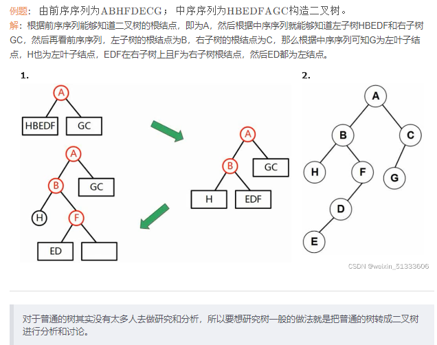

##### 2.6.4.4.树转二叉树

普通的树转二叉树的原则：

1. 树的某个结点的孩子结点转化成二叉树的左子树结点
2. 树的某个结点的兄弟结点转化成二叉树的右子树结点（右孩子节点）


##### 2.6.4.5.查找（排序）二叉树

1. 概念

   查找二叉树是一类特殊的二叉树，又称为二叉排序树，又称为二叉搜索树。

   特点：

   1. 左孩子小于根
   2. 右孩子大于根

2. 价值和意义

   能够极大地提高查询的速度和效率

3. 插入运算

4. 删除节点

##### 2.6.4.6.最优二叉树（哈夫曼树）

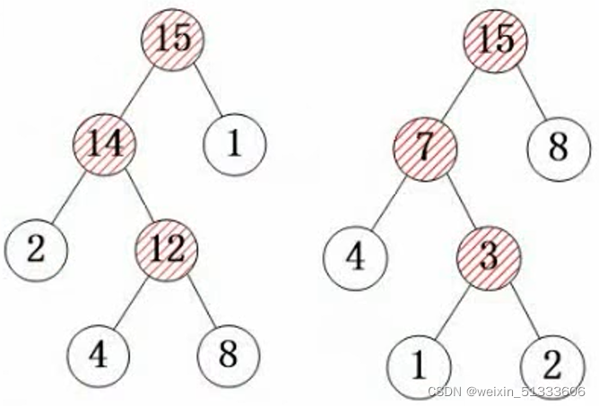

1. 概念

   哈夫曼树是一种工具，用于哈夫曼编码，哈夫曼树中每一个父节点的键值等于其子结点之和。

2. 哈夫曼编码的作用

   1. 哈夫曼编码是一种无损压缩编码的方式，能够将原始编码的长度变得更短些，从而节省存储空间和传输带宽

3. 相关概念

   1. 树的路径长度：从根节点到叶子结点所经过的每段路径的个数之和
   2. 权：某个叶子结点的数值，代表某一个字符出现的频度
   3. 带权路径畅读：某个树的路径长度乘以该路径的权值
   4. 树的带权路径长度（树的代价）：所有叶子结点的带权路径长度之和

4. 构造一个哈夫曼树

   1. 例题：假设有一组权值5,29,7,8,14，23,3,11，请尝试构造哈夫曼树

      

##### 2.6.4.7.线索二叉树

1. 概念：在二叉树的基础上，会有很多的虚线的箭线将结点连接起来

2. 为什么会有线索二叉树？

   1. 在二叉树中，很多结点是属于空闲的状态。很多的指针都是空的，没有被利用起来

      

   2. 为了利用起来方便树的遍历，就提出了前序线索，中序线索，后序线索

      

3. 构造线索二叉树

##### 2.6.4.8.平衡二叉树

1. 平衡二叉树提出的原因

   1. 同样的一个序列，排序二叉树可能有多颗，且形态不一样
   2. 一个排序二叉树越平衡，查询效率越高

2. 平衡二叉树的定义

   1. 任意结点的左右子树深度不能相差超过1
   2. 每结点的平衡度只能为-1,0,1
   3. 平衡二叉树是高度平衡的二叉排序树

3. 平衡树的建立过程

   1. 对于不平衡的二叉树需要做相应的调整才能够达到这种平衡度：找到中位数构造，中位数为根节点，然后找到左右子树的中位数，并遵循排序二叉树的构造原则

   2. 例题对数列 { 1 , 5 , 7 , 9 , 8 , 39 , 73 , 88 } \{1,5,7,9,8,39,73,88\}{1,5,7,9,8,39,73,88} 构造排序二叉树，可以构造出多棵形式不同的排序二叉树。
      答：显然右边构成的是平衡二叉树。

      

4. 求取每个结点的平衡度

   1. 对于所有叶子结点而言，平衡度都是
   2. 深度就是层数：即要求当前结点的平衡度就是用左子树的深度减去右子树的深度即为平衡度。

#### 2.6.5.图

##### 2.6.5.1.图的基本概念

1. 图的分类

   

   1. 有向图
   2. 无向图

2. 完全图

##### 2.6.5.2.图的存储

1. 邻接矩阵（用得少，浪费空间）

   

2. 邻接表（用的多）

   

##### 2.6.5.3.图的遍历

1. 图的遍历分类

   

   1. 深度优先（前序遍历）
   2. 广度优先（层次遍历）

2. 结合存储结构看图的遍历

   

##### 2.6.5.4.拓扑顺序

1. 概念：拓扑排序就是用一个序列表达事件执行的先后顺序
2. 拓扑排序可能产生多个序列
3. 用有向边表示活动之间开始的先后关系，这种有向图称为用顶点表示活动网络，简称为AOV网络
4. 求取拓扑排序

##### 2.6.2.6.图的最小生成树

1. 图和树

   图有环路，树没有环路

   图和树有n个结点，如果边的数量大于等于n，则为图，小于n则为树

2. 求取最小生成树

   原则：从n个结点的图中选出n-1条边作为树的枝，这个n-1条边的权重之和最小的情况就是最小生成树

3. 求取最小生成树的算法

   1. 普里姆算法

      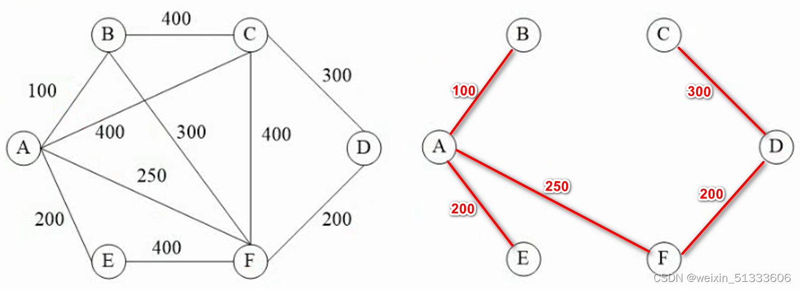

   2. 克鲁斯卡尔算法

      

#### 2.6.6.算法

##### 2.6.6.1.算法特点

1. 有穷性：执行有穷步数之后结束
2. 确定性：算法的每一条指令都必须有确切的含义，不能含糊不清
3. 算法必须有0个或者0个以上的输入
4. 算法必须有1个或者1个以上的输出
5. 有效性/可行性：算法的每个步骤都能有效执行并能得到确定的结果

##### 2.6.6.2.算法的复杂度

1. 时间复杂度（必考）

   参考链接：[(39条消息) 常见算法的时间复杂度 Ο(1)＜Ο(log2n)＜Ο(n)＜Ο(nlog2n)＜Ο(n2)＜Ο(n3)＜…_Nice_young的博客-CSDN博客_log2n的时间复杂度](https://blog.csdn.net/qq_41955653/article/details/93370770?spm=1001.2101.3001.6650.1&utm_medium=distribute.pc_relevant.none-task-blog-2~default~CTRLIST~Rate-1-93370770-blog-117523781.pc_relevant_3mothn_strategy_and_data_recovery&depth_1-utm_source=distribute.pc_relevant.none-task-blog-2~default~CTRLIST~Rate-1-93370770-blog-117523781.pc_relevant_3mothn_strategy_and_data_recovery&utm_relevant_index=2)

   时间复杂度是指程序运行从开始到结束所需的时间

   渐进时间复杂度

   常见的对算法执行所需时间的度量*O*(1)<*O*(log2*n*)<*O*(*n*)<*O*(*n*log2*n*)<*O*(*n* ^ 2)<*O*(n^3) <O(2^n)

   1. 赋值语句：O（1），赋值语句所花费的时间一般认为是常数级别，不论有几条赋值语句
   2. 循环语句：O（n），O（n ^ 2）,O（n ^ 3）：单循环，双重循环，三层循环
   3. 树的查找：log2n，n为树的节点

   

2. 空间复杂度

   空间复杂度是指对一个算法在运行过程中临时占用存储空间大小的度量

   一个算法的空间复杂度只考虑在运行过程中为局部变量分配的存储空间的大小

#### 2.6.7.查找问题

##### 2.6.7.1.顺序查找

1. 概念：将待查找的关键字依次从头到尾进行比较，如果存在相同的元素，则成功，如果不存在，则失败

2. 查找成功时，顺序查找的平均查找长度为（等概率的情况下）：

   

3. 顺序查找的时间复杂度：O（n）

4. 顺序查找的优缺点

   1. 常见且简单的查找方式
   2. 整体效率不高

##### 2.6.7.2.二分查找

1. 概念或要求

   1. 该查询使用的前提是该序列的关键字是有序排列的。（应该是从小到大，或从大到小）

   2. 折半查找在查找成功时关键字的比较次数最多为[log2 N] + 1 次

   3. 折半查找的时间复杂度为O（log 2 n）

   4. 二分查找的优缺点

      1. 优点：查找效率比顺序查找要高，而且查找的数据越多，相较于顺序查找的优势越明显

      

   5. 二分查找的注意事项

      二分查找每次都要跟中间的数进行比较，但要注意细节

      1. mid的值为（最小坐标+最大坐标）/2 （注：商如果有小数需要舍弃小数值）
      2. mid所对应的位置已经比较过，不需要纳入到下一次的比较中去，所以下一次的区间是[low,mid-1]或者[mid+1,high]

##### 2.6.7.3.散列表

hash表是一种基于内容存储的方式

1. hash表冲突的解决办法
   1. 开放定址法
   2. 线性探测法
   3. 伪随机数法
2. hash表会产生冲突，出现冲突就要调整空间，调整空间使得效率较低
   1. 对哈希表进行精心的设计，这样效率才能提高
   2. 扩大映射区间，这样冲突的概率会减小

#### 2.6.8.==排序问题==

##### 2.6.8.1.排序问题概述

排序的目的是增大查找效率

稳定排序和不稳定排序


内排序和外排序


##### 2.6.8.2.直接插入排序

插入排序步骤简单明了，但是速度很慢


##### 2.6.8.3.希尔排序


经过前面两轮的分组排序，整个序列变得基本有序。当增量d为1的时候就是用直接插入排序，元素挪动的位置就大大减少了。

希尔排序的效率比整个数据使用直接插入排序的效率要高，尤其是当数据量较大时就更加明显

希尔排序适合于在处理大数据量的场景下替换直接插入排序

##### 2.6.8.4.直接选择排序

直接选择排序的过程是，首先在所有记录中选出排序码最小的记录，把它与第一个记录交换，然后在其余的记录内选出排序码最小的记录，与第二个交换，以此类推，知道所有记录排完为止


##### 2.6.8.5.堆排序

1. 堆的分类

   1. 大顶堆
   2. 小顶堆

   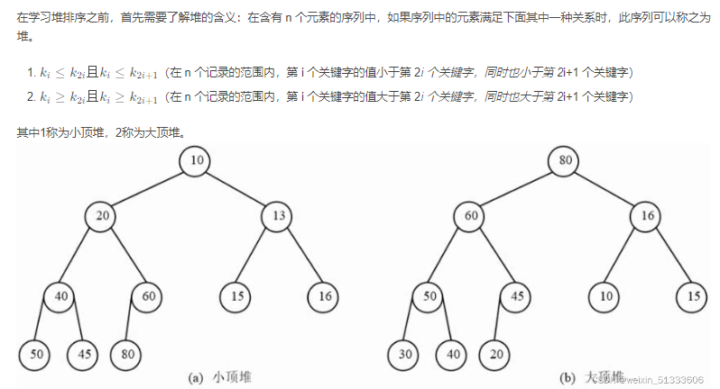

2. 堆排序的概念

   通过将无序表转化为堆，可以直接找到表中最大值或者最小值，然后将其提取出来，令剩余的记录再重建一个堆，去除次大值或者次小值，如此反复执行就可以得到一个有序序列，此过程为堆排序

3. 堆排序的步骤

   1. 将一个无序序列转化为一个大顶堆或者小顶堆
   2. 然后取到相应的值，然后筛选出新的堆顶点

4. 堆排序的优点

   1. 堆排序由于使用到了树的数据结构，因此效率上要比直接选择排序高很多

5. 堆排序的应用

   1. 给出n个元素，不需要对所有元素进行排序，只需要求出前m个最值即可（堆排序每一次筛选都会选出一个最值，而且是很高效的选择出来）

##### 2.6.8.6.冒泡排序

1. 冒泡排序的基本思想

   冒泡排序的基本思想是，通过相邻元素之间的比较和交换，将排序码较小的元素逐渐从底部移向顶部。由于整个排序的过程就像水底的气泡一样逐渐向上冒，因此称为冒泡算法。

   **缺点是需要频繁的读写数据**

2. 基本工序

   

##### 2.6.8.7.快速排序

1. 概念

   快速排序采用的是分治法，其基本思想是将原问题分解成若干个规模更小但结构与原问题类似的子问题，通过递归的方式解决这些子问题。

2. 步骤

   1. 在待排序的n个记录中任取一个记录，以该记录的排序码为基准，将所有记录分为两组，第一组都小于该数，第二组都大于该数
   2. 采用相同的方式对左右两组进行排序，直到所有的记录都排到相应的位置为止。

3. 图示过程

   

##### 2.6.8.8.归并排序

归并也称为合并，是将两个或两个以上的有序子表合并为一个新的有序表。

若将两个有序表合并为一个有序表，则称为**二路合并**。

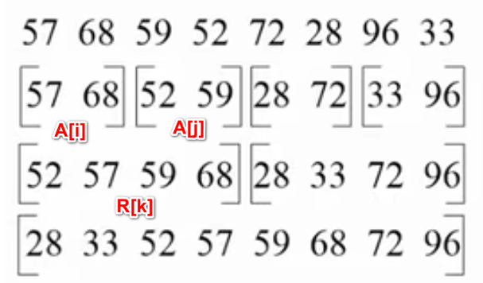

归并的效率会较高一些，因为对有序表进行合并要比对无序表进行合并的效率高，归并虽然看上去元素比较多，但事实上归并速度是很快的。

**将问题拆成若干个小问题的好处：上述所讲述的多种排序算法中可以看出一种共同的思想就是排序算法在很多地方都是将问题规格缩小来解决问题，因为当问题不断扩大的时候，处理问题所消耗的时间不一定是按照线性增长的，可能是按照几何级数增长的，因此可以考虑将问题拆成更小的问题，即使拆分之后问题依旧很多，但每个问题规模较小耗时会短一些。**

##### 2.6.8.9.基数排序

基数排序是一种借助关键字排序思想对单逻辑关键字进行排序的方法

基数排序不是基于关键字比较的排序方法，它适合于元素很多而关键字较少的序列

基数的选择和关键字的分解是根据关键字的类型来决定的，例如关键字是十进制数，则按照个位，十位分解，同样也可以说基数排序是按照关键字拆成多个维度的东西。

##### 2.6.8.10排序算法的时间复杂度与空间复杂度

## 3.系统开发和运行知识

### 3.1.软件工程

#### 3.1.1.软件开发模型


##### 3.1.1.1.瀑布模型（SDLC）


==瀑布模型渐渐淡出人们视线，已经基本淘汰。因为有重大缺陷，足以导致项目失败。==

==瀑布模型强调文档化、标准化==，是一个结构化方法的模型，把结构化方法的特点表现的淋漓尽致。

瀑布模型还加了回溯通道，这个阶段遇到问题可以回到上一个阶段把问题解决再往下进行：


其缺陷的根本原因在于其需求分析阶段，因为需求在项目初期就完全明确是几乎不可能的，当整个项目走到最后阶段，可能此时用户需求变化，就会导致推翻了之前全部的工作。此时要回到需求分析阶段重新开始。这使得瀑布模型难以完成项目。

===瀑布模型适用于需求明确或者是二次开发。（强调必须完全明确需求的项目）==

##### 3.1.1.2.其他经典模型（原型模型、增量模型、演化模型）


瀑布模型问世以后，引起大家对模型的追逐，产生了其他模型，为了比年重蹈瀑布模型的覆辙，其他模型试图避免了瀑布模型的缺陷。

原型和瀑布模型是一对相当互补的模型，瀑布模型败在无法对需求变化灵活的应对，而**
原型就是定位于需求不明确的情况。原型强调在项目开始初期，建立一个简易系统（比如一个界面，按钮设计等，或者是初步的系统），从而可以用建议模型拿来给用户做演示，按照用户需求对系统进行调整。**
但是原型往往只应用于开发需求分析的阶段，如果将原型通过演化，最终成为软件产品，则这种模型就是演化模型。

**螺旋模型也是从原型发展来的，还有瀑布模型和演化模型的特征。**

增量模型结合了瀑布模型和原型的思想，作系统的时候先把用户的核心需求做出来，将做好的系统拿给用户使用，修正用户提出的问题，然后把修正好的模型加上核心模块外的若干模块后，再给用户使用，再改进，这就是增量模型。强调的是一个模块一个模块的做下去，并且每一次核心模块都会被用户体验并给出修正意见，风险较小。

##### 3.1.1.3.螺旋模型

螺旋模型是右侧的模型，结合了多个模型的特征，比如原型，瀑布模型，演化模型等。

如果有一个需求不明确的项目，选择开发模型，那么选择原型，而不是螺旋模型，即使它包括了原型的特征，但是原型是专门针对不确定需求产生的，要选择最匹配的选项。如果没有原型选项，可以选择螺旋模型。

==**螺旋模型的特点除了融合了多种模型外，是引入了风险分析。**==

##### 3.1.1.4.V模型


V模型是强调测试的模型，提前写测试计划，提早发现问题。

##### 3.1.1.5.喷泉模型与RAD


喷泉模型最大的特点是面向对象的。

RAD是快速开发模型，由喷泉模型（SDLC）和构件组装模型（CBSD）组合而成的模型。用可视化工具做开发，就已经是RAD模型了。最大的特点是可以快速构建应用系统。

##### 3.1.1.6.构件组装模型（CBSD）


考虑把每个模块做成标准的构件，进行组装后得到软件。极大的提高了软件开发的复用性，可以是软件的开发时间缩短，降低开发成本，提高软件可靠性（每个构件都已经经过长时间的考验）。

##### 3.1.1.7.敏捷开发方法


敏捷开发方法适用于做小型项目，中型大型项目不适用。适用于小步快跑的方式完成项目。

#### 3.1.2.信息系统开发方法


信息化系统开发方法：

1. 结构化方法
2. 原型法
3. 面向对象方法
4. 面向服务方法

#### 3.1.3.需求工程


#### 3.1.4.系统设计

##### 3.1.4.1.结构化设计


结构化设计主要分为概要设计和详细设计。

- 要求信息隐蔽。模块独立性越强系统越灵活。
- 调用的深度越深，出错可能性越大

扇入多说明其他模块调用这个模块的数目多，价值高。扇出多，说明这个模块的职能太多，是不好的现象。


高内聚，低耦合：

内聚就是模块内部各个部件连接的紧密程度，越高越好。

耦合是模块与模块之间紧密程度，越低越好。


#### 3.1.5.软件测试

##### 3.1.5.1.测试原则和类型


##### 3.1.5.2.测试用例设计


- 黑盒测试：不知道内部结构，只知道输入输出

- 白盒测试：时刻可以看到内部结构

**白盒测试比黑盒测试更全面**

==黑盒测试==

- 边界值分析：测试边界值
- 错误推测
- 因果图

==白盒测试==

- 逻辑覆盖：语句覆盖，判定覆盖
- 循环覆盖

##### 3.1.5.3.测试阶段


确认测试：验证性测试。

单元测试：模块测试。

集成测试：模块的接口衔接，增量式工作量大。

系统测试：偏重压力和性能测试（负载，强度，容量）。

##### 3.1.5.4.McCabe复杂度


环路复杂度公式如上，m是边，n是点。

注意：分叉处可以抽象为结点，也可以把分叉处”解开“，比如2，3，4，都可以画出三条不相交的先线连到7处。两种情况复杂度计算结果是一样的。

#### 3.1.6.系统运行与维护


维护阶段是项目周期中占时间最长的，要确保系统能够正常运行。

+ 可分析性
+ 可改变性
+ 可测试性
+ 改正维护性
+ 适应性维护
+ 完善性维护
+ 预防性维护

#### 3.1.7.软件能力成熟度模型的集成


CMMI：是由软件能力成熟度模型（CMM）发展而来，主要衡量软件开发承包商改善软件质量的能力。

阶段性分级：1是混乱级，没有通过CMMI评级的都是一级，上图给出是二三四五级。

#### 3.1.8.**项目管理基础知识**


主要考察时间管理和风险管理。

风险关心未来的变化和选择。

## 4.面向对象基础知识

### 4.1.面向对象基本概念


消息是对象进行交互采用的机制，用的是异步方式

模式是经验的传承，可以被复用。

### 4.2.面向对象设计

#### 4.2.1.设计原则


一个类的职责（方法）越多，耦合性就会增大。

用新的类解决问题，就不提倡修改类。

李氏替换原则提倡不要盲目重载父类方法。

### 4.3.UML

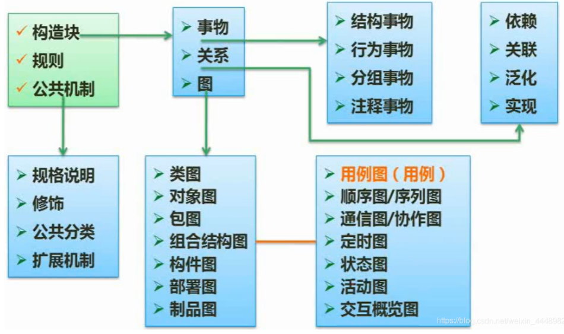

构造块：关系+图

部署图

用例图

顺序图

通信图

活动图

## 5.网络与信息安全

### 5.1.信息安全基础

#### 5.1.1.信息系统安全属性

1. 保密性
   1. 最小授权原则
   2. 防暴露
   3. 信息加密
   4. 物理保密
2. 完整性
   1. 安全协议
   2. 检验码
   3. 密码校验
   4. 数字签名
   5. 公证
3. 可用性
   1. 综合保障
4. 不可抵赖性
   1. 数字签名

#### 5.1.2.对称加密与非对称加密

##### 5.1.2.1.对称加密技术

1. 概念：对称加密技术就是在加密和解密的过程中所使用的的密钥相同

2. 特点：加解密都是用一套密钥

3. 缺陷：

   1. 加密强度不高
   2. 密钥分发困难

4. 常见的对称加密算法

   1. DES：替换+移位

   2. 3DES

      

   3. AES

   4. RC-5

   5. IDEA

##### 5.1.2.2.非对称加密技术

1. 概念：非对称加密技术就是加密和解密的过程中所使用的的密钥不同，即使用公钥加密就要使用相应的私钥进行解密。

2. 特点：加解密过程中使用的不是一套密钥

   1. 在非对称加密方案中，每一个都会有自己的公钥和私钥，公钥是可以公开的，私钥是不可以公开的，

3. 缺点：加密速度慢

   在非对称加密过程中，密钥的长度是非常职场的，目前使用的密钥一般是使用1024位的密钥，1024位的密钥相较于56位的密钥长了接近20倍，那么56位的密钥加密所消耗的时间远远低于1024位的加密时间，加密的时间之长使得对于内容比较庞大的数据来说，用非对称加密是完全行不通的，因为效率太低无法走向应用，**因此在实际的应用过程中，其实对称和非对称是互为补充使用的，使用对称加密的方式来加密大内容的传输，使用非对称的方式加密对称加密的密钥，使得密钥分发的问题就得以解决了**

4. 常见的非对称加密算法

   1. RSA：512位（或1024位）密钥、计算量极大、难破解
   2. Elgamal：其基础是Diffie-Hellman密钥交换算法
   3. ECC
   4. 背包算法
   5. Rabin
   6. D-H

#### 5.1.3.信息摘要

1. 概念：信息摘要就是一段信息的特征值。

2. 特点：跟随原始信息的变化而变化

3. 常见的信息摘要算法

   1. 单向散列函数（单向HASH函数）

      1. 特点

         信息摘要中的单向散列函数就是将正文通过消息摘要算法计算出摘要的结果，但是反过来不能够把摘要还原成明文。

      2. 常见算法

         1. MD5：128位
         2. SHA：160位，因为SHA通常采用的密钥长度较长，因此安全性高于MD5

   2. 固定长度的散列值

4. 机密技术和摘要技术的区别？为什么摘要不能做加密？

   1. 加密的目的是为了防止信息泄露的同时还需要得到原始信息
   2. 摘要是一种破坏性的手法，是只取特征值，但不能还原原始信息，因此会有绝大多数的信息已经丢失，所以信息摘要算法是不能做加密功能的。

#### 5.1.4.数字签名

概念：数字签名主要是一种防止抵赖的技术，使用数字化的方式来给发送者在信息上签上自己的名字，这样接受者就知道是由谁发送的，并且发送者无法抵赖

常见流程：A发送一段信息给B，A使用自己的私钥进行加密，然后发送给B，B使用了A的公钥进行解密，成功解开，因此判定该加密后的信息肯定是由A发送的，因为A的私钥只有自己有。

由此可见在使用过程中，称上述过程为加密些许不妥当，改为签名和验签最合适。A使用自己的私钥进行签名，B使用A的公钥进行验签，因此判断是A发送的，同样也不适合进行加密传输信息，因为A的公钥全天下都知道。因此在实际使用过程中，使用信息摘要算法对原始大文件信息进行摘要计算，然后使用A的私钥进行加密，同时A传输原始信息给B，B收到所谓的原始信息和一段密文，为了校验信息在传输过程中是否被修改了，B对所谓的原始信息进行了信息摘要处理，使用A的公钥解密了密文，然后对比两部分，如果结果一样，则证明信息在传输过程中没有被篡改，否则信息已经被破坏。

#### 5.1.5.数字信封与PGP

1. 数字信封
   1. 数字信封的原理
      1. 发送方将原文用对称密钥加密传输，而将对称密钥使用接收方的公钥进行加密发送给对方
      2. 接受方收到电子信封，使用自己的私钥解密信封，取出对称密钥解密原文
2. PGP
   1. 什么是PGP
      1. PGP既可以用于电子邮件加密，也可以用于文件储存加密，采用了杂合算法，包括IDEA，RSA，MD5，ZIP数据压缩算法
      2. PGP承认两种不同的数据证书格式：PGP证书和X.509证书
         1. PGP证书包含PGP版本号。证书持有者的公钥，证书持有者的信息，证书拥有者的数字签名，证书的有效期，密钥首选的对称加密算法
         2. X.509证书包含证书版本，证书的序列号，签名算法标识，证书有效期
   2. 数字证书
      1. 概念：数字证书是电子凭证，用于断言网络上的个人，计算机和其他实体的在线身份。数字证书类似于护照等身份证。常见的事，它们包含公钥和持有者的身份，是由证书颁发机构（CA）颁发，证书颁发机构必须在颁发证书之前和使用证书验证证书持有者的身份。

#### 5.1.6.各个网络层次的安全保障


#### 5.1.7.网络威胁与攻击

1. 网络威胁

   

   

2. 网络攻击

   1. 网络攻击的分类
      1. 主动攻击
         1. 拒绝服务攻击
         2. 分布式拒绝服务
         3. 信息篡改
         4. 资源使用
         5. 欺骗
         6. 伪装
         7. 重放等
      2. 被动攻击
         1. 嗅探
         2. 信息收集

#### 5.1.8.防火墙技术

防火墙的级别可以分为网络级和应用级，其中网络级的防火墙的工作层次比较低，工作效率比较高，主要做法是拒绝接收指定IP段的信息，不管其中内容如何，而应用级的防火墙工作层次比较高，工作效率比较低，主要做法是不论信息的来源直接将信息进行开箱检查，否则拒绝接收


#### 5.1.9.DOS攻击


## 6.标准化、信息化和知识产权基础知识

### 6.1.法律法规

#### 6.1.1法律法规的保护期限问题


1. 署名权，修改权，保护作品完整权的保护期限必须是永久的，否则作品无法流传下去。
2. 发表权、使用权、获得报酬权的保护期限为终生以及死后50年。过了期限，就是全人类共同财产。
3. 单位软件产品和单位作品权力期限均为50年。
4. 注册商标有效期十年，六个月内需要续注。
5. 发明专利权保护期20年。
6. 实用新型专利和外观设计专利保护期限10年。
7. 商业秘密保护期限不确定，公开后公众可用。

#### 6.1.2法律法规的知识产权人确定问题

##### 6.1.2.1产品归属


主要界定一个人的产品是归单位还是归个人所有。

##### 6.1.2.2委托创作


#### 6.1.3法律法规的侵权判定问题


1. 发表即公之于众，不一定要出版或刊登。
2. 开发软件思想、处理、操作、概念不受保护，否则技术无法发展。
3. 非公民作品的官方文件不受著作权保护。比如法律被人在2013年翻译，2014年官方出了官方翻译版本，则2014年开始该人翻译版本不受著作权保护。


#### 6.1.4标准化知识以及标准分类

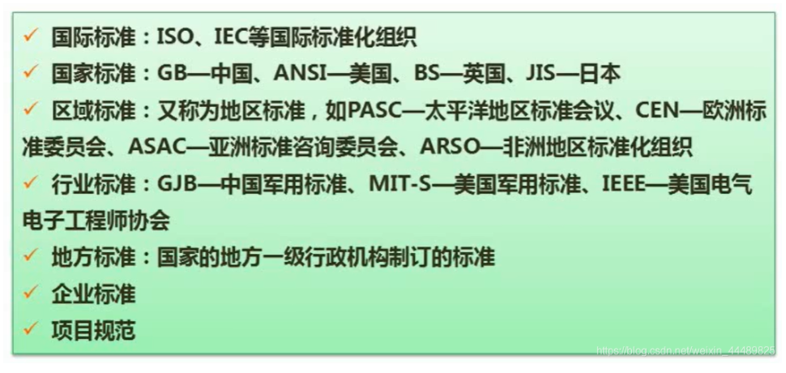

**中国军用标准定为行业标准。**


## 7.软件开发进展

## 8.计算机专业英语

# 二.软件设计

## 1.结构化分析与设计

### 1.1.需求分析

### 1.2.数据流图

数据流图又被称为DFD，或者分成数据流图，这是一种在需求分析阶段用到的一种工具。

**在结构化的分析设计中，DFD的使用频率相当之高，数据流图是重点考察的知识点，数据流图的题每次下午设计题中的第一个题，分值15分，**

#### 1.2.1.数据流图的基本概念

1. 数据流图的基本元素

   1. 数据流
   2. 加工：功能模块
   3. 数据存储：暂时存储的数据（文件）,数据存储的粒度往往不是以数据库为单位，而是以表为单位。描述它的措辞在题目中往往是某某记录表，某某记录文件，这样的描述往往就是数据存储。
   4. 外部实体：外部实体是指软件系统之外的人员或组织

2. 数据流图与E-R图

   两者的基本元素有哪些不要混淆


#### 1.2.2.数据流图又称为分层数据流图


**由顶层到细化**

顶层图中椭圆为待开发系统

两个方框代表外部实体。

外部实体与系统有数据流转关系。0层图将系统细化，变化的是系统内部的表示，分出的结点为处理职能部件。下面的子图将各部件细化。

分层图是由上而下逐层分解，思路和结构化方法完全匹配，数据流图是结构化方法中最主流的工具。

 构图时要注意上一层图和下一层图要保持平衡。

1. 顶层图：顶层图中间有一个大椭圆代表了需要开发的系统，两边的方框代表了是外部实体。外部实体和我们的系统有数据的流转关系，就形成了数据流图，但是顶层图能够表达的信息十分有限，因此考虑将顶层图进行细化。
2. 0层图：0层图可以看到外部实体以及跟外部实体联系的数据流是没有任何变化的，而是系统内部进行了细化。原来只是用一个节点就代表整个系统，现在会把这一个节点拆分为几个节点，这几个节点就相当于系统的几个处理职能部件，这几个职能部件之间会有一定的交互，会有数据流的流转。

#### 1.2.3.数据字典


#### 1.2.4.数据流图的平衡原则

1. 父图与子图之间的平衡

   

2. 子图内部的平衡

   

#### 1.2.5.数据流图问题的答题技巧

1. 详细分析试题的说明
2. 利用数据平衡原则

## 2.面向对象分析与设计

### 2.1.统一建模语言UML

UML：统一建模语言

#### 2.1.1.用例图

1. 概念

   用例图是用户和开发人员交流的一种重要的方式，是对用户需求的一种描述，开发人员从用户的角度整体上理解系统的功能

   

2. 用例图的三要素

   1. 参与者

   2. 用例

   3. 用例之间的关系

      1. 包括关系：include

      2. 扩展关系：extend

      3. 泛化关系：空心三角箭头指向父亲

         

#### 2.1.2.类图与对象图


1. 类图的多重度
   1. 1：表示一个集合中的一个对象对应另一个集合中1个对象
   2. 0..*：表示一个集合中的一个对象对应另一个集合的0个或多个对象（可以不对应）
   3. 1..*：表示一个集合中的一个对象对应另一个集合中的一个或多个对象，至少对应一个
   4. *：表示一个集合中的一个对象对应另一个集合中的多个对象
2. 关系
   1. 依赖
   2. 泛化
   3. 组合
   4. 聚合
   5. 实现

#### 2.1.3.顺序图

顺序图最大的特点就是在 处理事务的时候是按照时间顺序一步步走下去的。


#### 2.1.4.活动图

活动图是一种从结构来讲和程序流程图非常接近的图，这种图能够表现整个处理流程的基本情况以及分支的状态。


#### 2.1.5.状态图


#### 2.1.6.通信图


通信图又称为协作图，是顺序图的一种表达方式，不过并没有严格地强调时间顺序。

#### 2.1.7.案例习题

#### 2.1.8.UML2.0

##### 2.1.8.1.分类2.0

```tex
UML 2.0包括14种图，分别列举如下:
(1) 类图。描述一组类、接口、协作和它们之间的关系。在面向对象系统的建模中，最常见的图就是类图。类图 给出了系统的静态设计视图，活动类的类图给出了系统的静态进程视图。
(2) 对象图。描述一组对象及它们之间的关系。对象图描述了在类图中所建立的事物实例的静态快照。和类图一 样，这些图给出系统的静态设计视图或静态进程视图，但它们是从真实案例或原型案例的角度建立的。
(3) 构件图。描述一个封装的类和它的接口、端口，以及由内嵌的构件和连接件构成的内部结构。构件图用于表 示系统的静态设计实现视图。对于由小的部件构建大的系统来说, 构件图是很重要的。构件图是类图的变体。
(4) 组合结构图。描述结构化类 (例如，构件或类) 的内部结构，包括结构化类与系统其余部分的交互点。组合 结构图用于画出结构化类的内部内容。
(5) 用例图。描述一组用例、参与者及它们之间的关系。用例图给出系统的静态用例视图。这些图在对系统的行 为进行组织和建模时是非常重要的。
(6) 顺序图。是一种交互图 (interaction diagram)，交互图展现了一种交互，它由一组对象或参与者以及它们 之间可能发送的消息构成。交互图专注于系统的动态视图。顺序图是强调消息的时间次序的交互图。
(7) 通信图。也是一种交互图，它强调收发消息的对象或参与者的结构组织。顺序图和通信图表达了类似的基本 概念，但它们所强调的概念不同，顺序图强调的是时序，通信图强调的是对象之间的组织结构 (关系)。在UML 1.X版本中，通信图称为协作图 (collaboration diagram)。
(8) 定时图。也是一种交互图，它强调消息跨越不同对象或参与者的实际时间，而不仅仅只是关心消息的相对顺 序。
(9) 状态图。描述一个状态机，它由状态、转移、事件和活动组成。状态图给出了对象的动态视图。它对于接 口、类或协作的行为建模尤为重要，而且它强调事件导致的对象行为，这非常有助于对反应式系统建模。
(10) 活动图。将进程或其他计算结构展示为计算内部一步步的控制流和数据流。活动图专注于系统的动态视 图。它对系统的功能建模和业务流程建模特别重要，并强调对象间的控制流程。
(11) 部署图。描述对运行时的处理节点及在其中生存的构件的配置。部署图给出了架构的静态部署视图，通常 一个节点包含一个或多个部署图。
(12）制品图。描述计算机中一个系统的物理结构。制品包括文件、数据库和类似的物理比特集合。制品图通常 与部署图一起使用。制品也给出了它们实现的类和构件。
(13) 包图。描述由模型本身分解而成的组织单元，以及它们之间的依赖关系。
其中类图、对象图、用例图 (后期已划分为动态图) 、组件图及配置图为静态图，其它的为动态图。
```

##### 2.1.8.2.关系2.0


1. 关系分类

   1. 泛化

      【泛化关系】：一种继承关系，制定了子类如何特化父类所有特征和行为的

      【箭头指向】：带箭头的实线，箭头指向父亲。

      

   2. 实现

      【实现关系】：是一种类与接口的关系，表示类是接口所有特征和行为的实现

      【箭头指向】：带三角箭头的虚线，箭头指向接口

      

   3. 关联

      【关联关系】：是一种拥有的关系，它使一个类知道另一个类的属性和方法

      【代码体现】：成员变量

      【箭头指向】：带普通箭头的实线，箭头指向被拥有者

      其中关联可以是双向的，也可以是单向的。

      双向的关联可以有两个箭头或者没有箭头，单向的关联有一个箭头

      

      自身关联：

      

   4. 聚合

      【聚合关系】：整体和部分的关系，例如：车和车胎是整体和部分的关系

      ​						聚合关系是关联关系的一种，是强的关联关系

      ​						关联和聚合无法在语法上区分，必须考察具体的逻辑关系

      【代码体现】：成员变量

      【箭头指向】：带空心菱形的实心线，菱形指向整体

      

   5. 组合

      【组合关系】：组合关系是整体与部分的关系

      ​						组合关系是关联关系的一种，是比聚合关系还要强的关系

      ​						它要求普通的聚合关系中代表整体的对象负责代表部分的对象的生命周期

      【代码提现】：成员变量

      【箭头指向】：带实心菱形的实线，菱形指向整体

      

   6. 依赖

      【依赖关系】：是一种使用的关系，要尽量不要使用双向的互相依赖

      【代码体现】：局部变量、方法的参数或者对静态方法的调用

      【箭头指向】：带箭头的虚线，指向被使用者

      

2. 关系的弱化顺序

   泛化=实现>组合>聚合>关联>依赖

### 2.2.基于用例的需求描述

### 2.3.软件建模

### 2.4.设计模式

#### 2.4.1.设计模式的基本概念


架构模式：全局看问题的方案。

设计模式：关心局部的设计问题，一般在构件的设计时用到。

惯用法：底层，语言有关。

#### 2.4.2.设计模式的分类


##### 2.4.2.1.创建型模式


- 抽象工厂是做系列产品。比如指定要创建操作Oracle的对象，那么生产的对象是Oracle相关的，不需要指定类。
- 构建器模式
- 工厂方法模式
- 原型模式：克隆模型，通过拷贝来创建。new创建消耗的资源比较多，原型模式效率会高一些。
- 单例模式：保证一个类只有一个实例。

##### 2.4.2.2.结构性模式


##### 2.4.2.3.行为型模式


## 3.数据库应用分析与设计

### 3.1.数据库设计过程

### 3.1.E-R模型


1. 需求分析阶段

   在需求分析阶段，将产出数据流图，数据字典，需求规格说明书。

2. 概念结构设计阶段

   本阶段主要任务是完成E-R模型的建模工作。

3. 逻辑结构设计阶段

   逻辑结构设计阶段是之前规范化理论大展宏图的空间。

   **关系模式是逻辑结构设计的产物，是通过对E-R模型进行转换得到的。**

4. 物理设计阶段

   物理设计阶段就会把数据库管理系统也就是DBMS以及硬件操作系统，这些特性考虑进去，最后形成实实在在的数据库。

#### 3.1.1.E-R模型


##### 3.1.1.1.实体间联系类型

1. 一对一
2. 一对多
3. 多对多

##### 3.1.1.2.ER图面向实体模型的转换

### 3.2.设计关系模式

### 3.3.数据库语言SQL

### 3.4.数据库访问

## 4.软件实现

### 4.1.算法设计与分析

#### 4.1.1分治法

##### 4.1.1.1分治法概述

##### 4.1.1.2递归技术

##### 4.1.1.3二分查找

#### 4.1.2回溯法

#### 4.1.3贪心法

#### 4.1.4动态规划法

#### 4.1.5案例

### 4.2.程序设计

## 5.软件测试

### 5.1.单元测试

### 5.2.集成测试

### 5.3.系统测试

### 5.4.测试方法和测试用例

## 6.软件评审

# 三.真题分析

## 1.上午题

### 1.1.2021年上半年上午题

1. 计算机硬件：CPU的组成
2. RISC和CISC：精简指令集和复杂指令集
3. 输入输出（I/O）控制方式
4. 闪存/ROM
5. 磁盘：磁盘转速提高一倍
6. 异常和中断
7. 计算机网络协议：SSL->TLS/TCP/UDP/SSH/TFTP
8. 计算机安全：拒绝服务
9. 加密：对称加密和非对称加密
10. SQL注入的首要目标：获取数据库的权限
11. IPSEC为IP数据报文加密
12. 软件著作权
13. 商标注册：谁先注册是谁的，同一时间注册谁先使用是谁的
14. 侵权
15. 数据字典加工逻辑
16. 软件设计阶段模块划分：作用范围应该在控制范围之内
17. 软件项目活动图：关键路径长度
18. 风险：风险不能完全避免
19. 算术表达式的后缀式
20. 编译：类型检查在语义分析阶段发生
21. 程序编程语言：java语言的特性：即时编译+自动的垃圾回收机制
22. 云部署之私有云
23. 位示图：一位存储一个物理块的地址
24. 页面置换算法
25. 前趋图+PV：进为P，出为V
26. 软件工程：软件开发模型
27. 软件模块独立程度：内聚和藕合
28. 软件开发流程：软件详细设计
29. 软件文档
30. 白盒测试（打开盒子看内部测试）
31. 软件可维护性/可靠性/可用性
32. 维护类型
33. 面向对象分析的执行活动顺序
34. 面向对象设计的原则
35. UML之类图
36. 封装、继承、多态、抽象
37. UML之状态图：对反应型对象建模
38. 设计模式之命令模式
39. 语法树
40. 有限自动机：确定的有限自动机和不确定的有限自动机
41. 引用调用和值调用
42. E-R图
43. 关系模式
44. 关系代数 （投影，自然连接，传值）
45. 堆栈，队列
46. 二叉树
47.  稀疏矩阵
48. 哈希表之线性探查法
49. 排序算法之归为位：第一次排序就可以把某个元素的位置确定下来
    1. 直接插入排序：局部有序区
    2. 冒泡排序
50. 构建大顶堆
51. 算法：分治法
52. 计算算法的时间复杂度
53. 算法策略
54. IPV6
55. 应用层协议
56. 邮件协议
57. DNS缓存清除本地命令
58. 网络系统设计