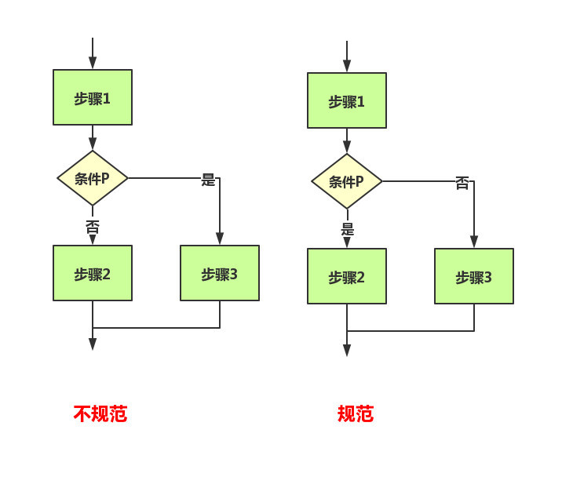

# 流程图

使用图形表示算法的思路是一种极好的方法，因为千言万语不如一张图。

流程图（FlowChat）：以特定的图形符号加上说明，表示算法的图成为流程图或者框图

注：参考链接：

[流程图_百度百科 (baidu.com)](https://baike.baidu.com/item/流程图/206961?fr=aladdin)

[关于流程图，你想知道的都在这里 - 知乎 (zhihu.com)](https://zhuanlan.zhihu.com/p/67533900)

# 1.流程图的定义

流程图是用来直观描述一个工作过程的具体步骤图，使用图形表示流程思路，是一种极好的办法。

# 2.流程图的功能

1. 能帮助梳理活动流程的先后顺序
2. 帮助查漏补缺、避免活动流程、逻辑上出现遗漏，确保活动流程的完整性
3. 职场沟通的利器

# 3.流程图的符号要求

# 4.流程图的三大结构

## 4.1.顺序结构

​	在顺序结构中，各个步骤都是按照先后顺序执行的，这是一种最简单的基本结构。

## 4.2.选择结构

​	选择结构又称为分支结构。选择结构用于判断给定的条件，根据判断的结构判断某些条件，根据判断的结构来控制程序的流程。

## 4.3.循环结构

​	循环结构又称为重复结构，就是路程在一定的条件下，反复执行某一操作的流程结构。循环结构又可以分为当型结构和直到型结构。

# 5.流程图的注意事项

（1）绘制流程图时，为了提高流程图的逻辑性，应遵循从左到右、从上到下的顺序排列。

（2）绘制流程图时，为了提高流程图的逻辑性，应遵循从左到右、从上到下的顺序排列。一个流程从开始符开始，以结束符结束。开始符号只能出现一次，而结束符号可出现多次。若流程足够清晰，可省略开始、结束符号。

（3）菱形为判断符号，必须要有“是和否（或Y和N）”两种处理结果，意思是说，菱形判断框一定需要有两条箭头流出；且判断符号的上下端流入流出一般用“是（或Y）”，左右端流入流出用“否（或Y）”。

（4）同一流程图内，符号大小需要保持一致，同时连接线不能交叉，连接线不能无故弯曲。

（5）流程处理关系为并行关系的，需要将流程放在同一高度。

（6）必要时应采用标注，以此来清晰地说明流程，标注要用专门的标注符号。

（7）处理流程须以单一入口和单一出口绘制，同一路径的指示箭头应只有一个。

（8）同一路径的指示箭头应只有一个。

（9）流程图中，如果有参考其他已经定义的流程，不需重复绘制，直接用已定义流程符号即可。

# 6.流程图的分类

业务流程图，功能流程图，页面流程图，用户操作流程图，系统流程图等等等等

其中**逻辑流程图**：

- 每一表格代表一个页面
- 最上面那个蓝色的是顶栏的标题
- 下面的是功能
- 灰色的是按钮
- 框框是对按钮进行解释说明

# 7.流程图的变体--泳道图

# 8.流程图的示例

注册登录逻辑流程图：

# 9.绘制工具

## 9.1.在线工具

## 9.2.Visio

