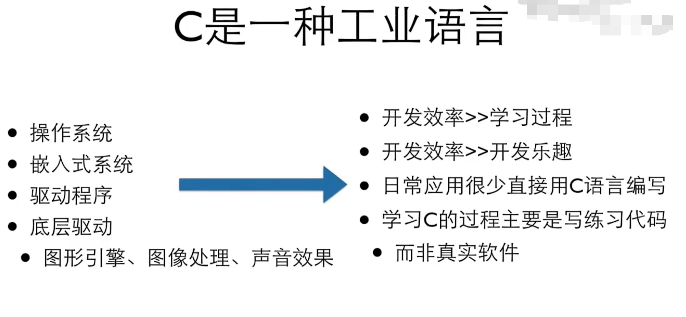

2023年5月29日22:44:54还愿~

# C语言

## 1.C语言的历史

### 1.1.C语言与人

C语言之父：肯.汤普森，丹尼斯.里奇

**Fortran（人类历史上第一个高级程序语言）-->BCPL-->B语言-->初代的C**

C语言的参考书：K&R（C语言黑皮书）

BCPL和B都支持指针间接方式，C支持了指针（指针是C语言的灵魂，是使C语言成为C语言的基石）

C语言收到PL/1的影响，也致力于表达操作系统所使用的机器指令。

1973年3月，UNIX的第三版上出现了C语言的编译器

1973年11月，第四版UNIX操作系统完全由C语言重写。

### 1.2.C语言与操作系统

C语言的历史就是UNIX的历史

### 1.3.C语言与其他语言

图为：2023年4月编程语言排行榜

#### 1.3.1.语法区别

**C语言和C_Like语言**

语言的能力/适用领域主要是由库（或者函数库）和传统所决定的。

抽象层次的高低之分

#### 1.3.2.使用领域区别

目前来看，是做操作系统、嵌入式系统的语言选择不二之选。

### 1.4.C语言的版本及标准变更（发展历史）

#### 1.4.1.C89

​	1989年ANSI发布了一个标准--ANSI C

#### 1.4.2.C95

#### 1.4.3.C99

#### 1.4.4.C11

### 1.5.C语言以计算为主的编程语言

C语言是早起的编程语言，是与操作系统接触更近的语言。

早起的编程语言，Fortran、B和C的主要任务是为了数值计算，80年代及以后诞生、发展及壮大的编程语言以处理信息为主

## 2.C语言的教程

==***本笔记选择B站教程：浙江大学翁恺教授的C语言基础教程***==

### 2.1.C语言是编译型语言

#### 2.1.1.讲透编译型与解释性语言

传统解释：

讲透解释：

- 对于计算机的编程语言来说，编程语言是没有解释和编译之分的，任何一种语言都可以解释执行也可以编译执行，这是一种由来已久的习惯而已。
- 

#### 2.1.2.C语言的运行过程

### 2.2.如何写和运行C语言（工具推荐及选择）

### 2.3.第一个C语言程序：Hello World

### 2.4.C语言语法

#### 2.4.1.C语言程序框架

#### 2.4.2.详解Hello World

#### 2.4.3.C语言与基础计算

#### 2.4.4.使用指令编译执行Hello World

#### 2.4.5.定义变量

##### 2.4.5.1.赋值与关系的区别

##### 2.4.5.2.初始化值的目的

##### 2.4.5.3.C语言不同版本对定义变量的区别

##### 2.4.5.4.赋值语句（初始化）变量与输入函数Scanf输入变量

###### 2.4.5.4.1.赋值语句

###### 2.4.5.4.2.函数Scanf

###### 2.4.5.4.3.复合赋值

##### 2.4.6.C语言的保留字

##### 2.4.7.常量const  

#### 2.4.8.C语言的数据类型

强类型语言，弱类型语言

类型安全

自动类型装换和强制类型转换

##### 2.4.8.1.整数

##### 2.4.8.2.浮点数

#### 2.4.9.表达式

##### 2.4.9.1.运算符

##### 2.4.9.2.算子

##### 2.4.9.3.运算符优先级

##### 2.4.9.4.交换运算

##### 2.4.9.5.复合赋值

##### 2.4.9.6.++与--

#### 2.4.10.控制语句if...else...

if（条件成立）{

}else{

}

- 关系运算符与算术运算符的优先程度：所有的关系运算符的优先级都比算术运算符低，但比赋值运算来得快
- 判断是否相等的==的!=的优先级比其他的低，而连续的关系运算是从左往右进行的
- 嵌套if...else...

#### 2.4.11.注释

//：单行注释

/**/：多行注释

#### 2.4.12.缩进

#### 2.4.13.switch...case...

C语言的switch...case...仅能使用int整形值

#### 2.4.14.循环

##### 2.4.14.1.while循环

语法上正确，逻辑上错误：死循环

##### 2.4.14.2.do...while...循环

##### 2.4.14.3.for循环

##### 2.4.14.4.while循环和for循环的区别和联系

#### 2.4.15.辗转相除法

#### 2.4.16.unsigned

设计unsigned的初衷是为了让C语言进行纯二进制的运算，而不是为了扩大正数的范围

#### 2.4.17.整数越界

[6.2.4 整数的范围：如何推算整数类型所能表达的数的范围，越界了会怎样_哔哩哔哩_bilibili](https://www.bilibili.com/video/BV1XZ4y1S7e1?p=56)

#### 2.4.18.整数的格式化

不管在计算机内部是什么样的数据，重点是如何去看待这个数

[6.2.5 整数的格式化：如何格式化输入输出整数，如何处理8进制和16进制_哔哩哔哩_bilibili](https://www.bilibili.com/video/BV1XZ4y1S7e1?p=57&vd_source=e807673b1b75f152a538b328dcd67f24)

#### 2.4.19.C语言中8进制和16进制

printf和scanf中既可以展示8进制和16进制，也可以读取8进制和16进制

2.4.20.内存对齐

2.4.21.float和Double表达的数的范围

[6.2.7 浮点类型：double和float，它们是什么，如何输入输出_哔哩哔哩_bilibili](https://www.bilibili.com/video/BV1XZ4y1S7e1?p=59&spm_id_from=pageDriver&vd_source=e807673b1b75f152a538b328dcd67f24)

数学中，数的表示是连续的，但在计算机中数的表示是离散的。

#### 2.4.20.字符Char

#### 2.4.21.转义字符

逃逸字符（特殊字符）

#### 2.4.22.C语言的运算和运算符

条件运算符

逗号运算符

逻辑类型和逻辑运算

短路运算

运算符的先后顺序

2.4.23.函数Function

2.4.23.1.函数是什么

2.4.23.2.函数的组成

2.4.23.3.函数的返回return

2.4.23.4.函数原型

2.4.23.5.调用函数

调用时可以传参的类型可以不匹配，C语言的检查并不严格。

2.4.23.6.函数知道自己在何处被调用以及在何处需要返回

2.4.24.变量空间（生存期、作用域）

代码块

2.4.25.数组

什么是数组

数组的定义

数组的使用

遍历数组

数组与指针

数组的集成初始化

数组的大小sizeof

2.4.26.指针

指针是让C语言成为C语言的原因。

指针的表示

指针的使用

指针的计算

指针与数组

数组是特殊的指针，指针与数组有这天然的联系

2.4.27.查找素数的方法

埃式素数筛法

欧式素数筛法

本地变量

字符串的输入输出

输出宏

 