# MyBatis

注：部分笔记源自网络：https://mp.weixin.qq.com/s/vy-TUFa1Rb69ekxiEYGRqw

## 0.1什么是持久层？

```xml
一、 java三层架构

业务层（逻辑层、service层）
采用事务脚本模式。将一个业务中所有的操作封装成一个方法，同时保证方法中所有的数据库更新操作，即保证同时成功或同时失败。避免部分成功部分失败引起的数据混乱操作。

表现层（JSP）
采用MVC模式。
M称为模型，也就是实体类。用于数据的封装和数据的传输。
V为视图，也就是GUI组件，用于数据的展示。
C为控制，也就是事件，用于流程的控制。

持久层（DAO）
采用DAO模式，建立实体类和数据库表映射（ORM映射）。也就是哪个类对应哪个表，哪个属性对应哪个列。持久层的目的就是，完成对象数据和关系数据的转换。

二、SSH框架
业务层——Spring
表现层——Struts
持久层——Hibernate

三、SSM框架
业务层——Spring
表现层——SpringMVC
持久层——MyBatis
```

## 0.2什么是mybatis体系？

```xml
MyBatis 是一款   优秀的持久层框架   ，它支持自定义 SQL、存储过程以及高级映射。MyBatis 免除了几乎所有的 JDBC 代码以及设置参数和获取结果集的工作。MyBatis 可以通过简单的 XML 或注解来配置和映射原始类型、接口和 Java POJO（Plain Old Java Objects，普通老式 Java 对象）为数据库中的记录。
```

mybatis3官网：https://mybatis.org/mybatis-3/zh/index.html

mybatis-plus3官网：https://mp.baomidou.com/或者https://mybatis.plus/

记住这只小鸟。

为简化开发而生···额···为偷懒而生！！！


# 一.Mybatis

```xml
注：
以往在java代码中操作数据库，需要借助JDBC，每次需要编写较长的配置代码，进行操作，目前仅试验过CURD的代码实现，繁琐且不灵活，因此首先借助mybatis。
仅从目前接手的任务来看，个人关注的重点依旧在SQL的操作上，因为IDEA的升级版本迅速，所以在项目中的mapper文件中常常会爆红一大片，此处不必紧张，根据大佬介绍，只要SQL在数据库工具中能够跑通，按照动态SQL的实现方式写入mapper中，执行起来就没啥问题。
目前仅写过简单的CURD，学识浅薄，暂记笔记以待厚积薄发。以下是截止目前2021年1月28日22:05:44，脑子中仍记得的mybatis的相关情况。待后续时间充裕，重温mybatis。
```

注：参考连接：[Mybatis学习笔记（狂神说） - 唐先生的internet - 博客园 (cnblogs.com)](https://www.cnblogs.com/tjlstudy/p/12991574.html)

## 1.1、构建第一个MyBatis程序

### 1.1.1.pom.xml导入依赖

```xml
<!--导入依赖-->
<dependencies>
    <!--mysql驱动-->
    <dependency>
        <groupId>mysql</groupId>
        <artifactId>mysql-connector-java</artifactId>
        <version>*.*.*</version>
    </dependency>
    <!--mybatis-->
    <dependency>
        <groupId>org.mybatis</groupId>
        <artifactId>mybatis</artifactId>
        <version>*.*.*</version>
    </dependency>
    <!--junit-->
    <dependency>
        <groupId>junit</groupId>
        <artifactId>junit</artifactId>
        <version>*.*.*</version>
    </dependency>
</dependencies>
```

### 1.1.2.编写Mybatis配置文件mybatis-config.xml

```xml
<?xml version="1.0" encoding="UTF-8" ?>
<!DOCTYPE configuration
        PUBLIC "-//mybatis.org//DTD Config 3.0//EN"
        "http://mybatis.org/dtd/mybatis-3-config.dtd">
<!--configuration核心配置文件-->
<configuration>
    <!--environments配置环境组-->
    <!--default默认环境-->
    <environments default="development">
        <!--environment单个环境-->
        <environment id="development">
            <!--transactionManager配置事务管理器-->
            <transactionManager type="JDBC"/>
            <!--配置连接池-->
            <dataSource type="POOLED">
                <property name="driver" value="com.mysql.jdbc.Driver"/>
                <property name="url" value="jdbc:mysql://localhost:3306/mybatis?useSSL=true&amp;useUnicode=true&amp;characterEncoding=UFT-8"/>
                <property name="username" value="root"/>
                <property name="password" value="Cc105481"/>
            </dataSource>
        </environment>
    </environments>

</configuration>
```

### 1.1.3.编写mybatis工具类用于获取sqlSessionfactory

```xml
import org.apache.ibatis.io.Resources;
import org.apache.ibatis.session.SqlSession;
import org.apache.ibatis.session.SqlSessionFactory;
import org.apache.ibatis.session.SqlSessionFactoryBuilder;
import java.io.IOException;
import java.io.InputStream;

public class MybatisUtils {

   private static SqlSessionFactory sqlSessionFactory;

   static {
       try {
           String resource = "mybatis-config.xml";
           InputStream inputStream = Resources.getResourceAsStream(resource);
           sqlSessionFactory = new SqlSessionFactoryBuilder().build(inputStream);
      } catch (IOException e) {
           e.printStackTrace();
      }
  }

   //获取SqlSession连接
   public static SqlSession getSession(){
       return sqlSessionFactory.openSession();
}
```

### 1.1.4.编写实体类

javabean：私有属性，有参无参，get/set，序列化

```java
public class User {

    private int id;
    private String name;
    private String pwd;

    public User() {
    }

    public User(int id, String name, String pwd) {
        this.id = id;
        this.name = name;
        this.pwd = pwd;
    }

    public int getId() {
        return id;
    }

    public void setId(int id) {
        this.id = id;
    }

    public String getName() {
        return name;
    }

    public void setName(String name) {
        this.name = name;
    }

    public String getPwd() {
        return pwd;
    }

    public void setPwd(String pwd) {
        this.pwd = pwd;
    }

    @Override
    public String toString() {
        return "User{" +
                "id=" + id +
                ", name='" + name + '\'' +
                ", pwd='" + pwd + '\'' +
                '}';
    }
}
```

### 1.1.5.mapper接口

```java
public interface UserDao {
    List<User> getUserList();
}
```

### 1.1.6.接口实现

```xml
<?xml version="1.0" encoding="UTF-8" ?>
<!DOCTYPE mapper
        PUBLIC "-//mybatis.org//DTD Mapper 3.0//EN"
        "http://mybatis.org/dtd/mybatis-3-mapper.dtd">
<!--namespace绑定一个对应的mapper接口-->
<mapper namespace="com.hou.dao.UserDao">

    <!--id方法名-->
    <select id="getUserList" resultType="com.hou.pogo.User">
        select * from mybatis.user
    </select>

</mapper>
```

### 1.1.7.注册mapper

**mybatis-config.xml中注册mapper接口**

```xml
<?xml version="1.0" encoding="UTF-8" ?>
<!DOCTYPE configuration
        PUBLIC "-//mybatis.org//DTD Config 3.0//EN"
        "http://mybatis.org/dtd/mybatis-3-config.dtd">

<configuration>
    <environments default="development">
        <environment id="development">
            <transactionManager type="JDBC"/>
            <dataSource type="POOLED">
                <property name="driver" value="com.mysql.jdbc.Driver"/>
                <property name="url" value="jdbc:mysql://111.230.212.103:3306/mybatis?userSSL=true&amp;
                userUnicode=true&amp;characterEncoding=UTF-8"/>
                <property name="username" value="root"/>
                <property name="password" value="hdk123"/>
            </dataSource>
        </environment>
    </environments>

    <!--每一个mapper.xml都需要注册-->
    <mappers>
        <mapper resource="com/hou/dao/UserMapper.xml"/>
    </mappers>

</configuration>
```

### 1.1.8.CURD

## 1.2.Mybatis配置

### 1.2.1mybatis-config.xml

这里会添加关于mybatis的全部配置，配置之间有前后顺序关系，不按照既定顺序会报错。

具体详细配置参考官网。

```xml
<?xml version="1.0" encoding="UTF-8" ?>
<!DOCTYPE configuration
        PUBLIC "-//mybatis.org//DTD Config 3.0//EN"
        "http://mybatis.org/dtd/mybatis-3-config.dtd">

<configuration>
    <environments default="development">
        <environment id="development">
            <transactionManager type="JDBC"/>
            <dataSource type="POOLED">
                <property name="driver" value="com.mysql.jdbc.Driver"/>
                <property name="url" value="jdbc:mysql://111.230.212.103:3306/mybatis?userSSL=true&amp;
                userUnicode=true&amp;characterEncoding=UTF-8"/>
                <property name="username" value="root"/>
                <property name="password" value="hdk123"/>
            </dataSource>
        </environment>
    </environments>

    <!--每一个mapper.xml都需要注册-->
    <mappers>
        <mapper resource="com/hou/dao/UserMapper.xml"/>
    </mappers>

</configuration>
```

### 1.2.2.配置解析

```xml
configuration（配置）
    properties（属性）
    settings（设置）
    typeAliases（类型别名）
    typeHandlers（类型处理器）
    objectFactory（对象工厂）
    plugins（插件）
        environments（环境配置）
            environment（环境变量）
            transactionManager（事务管理器）
    dataSource（数据源）
    databaseIdProvider（数据库厂商标识）
    mappers（映射器）
```

#### 1.2.2.1.mybatis多环境配置

#### 1.2.2.2.与properties文件一起构成配置

#### 1.2.2.3.类型别名

##### 1.2.2.3.1.使用.xml文件配置别名

```xml
<typeAliases>
    <typeAlias type="com.hou.pogo.User" alias="User"></typeAlias>
</typeAliases>
```

##### 1.2.2.3.2.使用注解配置别名

```java
@Alias("hello")
public class User {
}
```

#### 1.2.2.4.缓存配置

#### 1.2.2.5.懒加载配置

#### 1.2.2.6.log配置

| 设置名             | 描述                                                         | 有效值                                                       | 默认值 |
| :----------------- | :----------------------------------------------------------- | :----------------------------------------------------------- | :----- |
| cacheEnabled       | 全局性地开启或关闭所有映射器配置文件中已配置的任何缓存。     | true \| false                                                | true   |
| lazyLoadingEnabled | 延迟加载的全局开关。当开启时，所有关联对象都会延迟加载。 特定关联关系中可通过设置 `fetchType` 属性来覆盖该项的开关状态。 | true \| false                                                | false  |
| logImpl            | 指定 MyBatis 所用日志的具体实现，未指定时将自动查找。        | SLF4J \| LOG4J \| LOG4J2 \| JDK_LOGGING \| COMMONS_LOGGING \| STDOUT_LOGGING \| NO_LOGGING | 未设置 |

#### 1.2.2.7.映射器mapper

注册mapper的方式有三种。

方式一: [推荐使用]

```xml
<mappers>
    <mapper resource="com/hou/dao/UserMapper.xml"/>
</mappers>
```

方式二：

```xml
<mappers>
    <mapper class="com.hou.dao.UserMapper" />
</mappers>
```

- 接口和它的Mapper必须同名
- 接口和他的Mapper必须在同一包下

方式三：

```xml
<mappers>
    <!--<mapper resource="com/hou/dao/UserMapper.xml"/>-->
    <!--<mapper class="com.hou.dao.UserMapper" />-->
    <package name="com.hou.dao" />
</mappers>
```

- 接口和它的Mapper必须同名
- 接口和他的Mapper必须在同一包下

#### 1.2.2.8.其他配置

- [typeHandlers（类型处理器）](https://mybatis.org/mybatis-3/zh/configuration.html#typeHandlers)
- [objectFactory（对象工厂）](https://mybatis.org/mybatis-3/zh/configuration.html#objectFactory)
- plugins（插件）
  - mybatis-generator-core
  - mybatis-plus
  - 通用mapper

## 1.3.生命周期和作用域


#### 1.3.1.SqlSessionFactoryBuilder

- 一旦创建SqlSessionFactory不再需要Builder
- 局部变量

#### 1.3.2.SqlSessionFactory

- 一旦被创建，整个应用运行期间一直存在

- 单例模式/静态单例模式

#### 1.3.3.SqlSession

- 每个线程拥有自己的SqlSession实例
- SqlSession的实例不是线程安全的，不能被共享
- 作用域在请求或者方法作用域
- 用完需要立马关闭

### 1.3.4.Mybatis详细执行流程

1. Resource获取全局配置文件
2. 实例化SqlsessionFactoryBuilder
3. 解析配置文件流XMLCondigBuilder
4. Configration所有的配置信息
5. SqlSessionFactory实例化
6. trasactional事务管理
7. 创建executor执行器
8. 创建SqlSession
9. 实现CRUD
10. 查看是否执行成功
11. 提交事务
12. 关闭

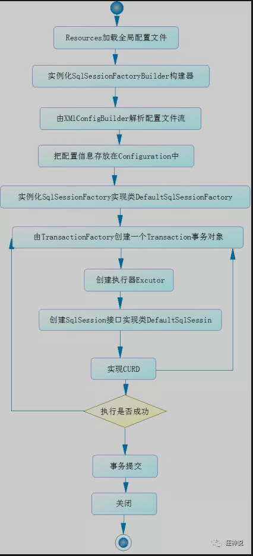

## 1.5.mybatis与map

### 1.5.1map传递多个参数

UserMapper.xml

```xml
<insert id="addUser2" parameterType="map">
    insert into mybatis.user (id, name, pwd) values (#{id1}, #{name1}, #{pwd1});
</insert>

```

UersMapper.java

```java
int addUser2(Map<String, Object> map);
```

UserTest.java

```java
@Test
public void addUser2(){
    SqlSession sqlSession = MybatisUtils.getSqlSession();

    UserMapper mapper = sqlSession.getMapper(UserMapper.class);
    Map<String, Object> map = new HashMap<String, Object>();
    map.put("id1",5);
    map.put("name1","dong");
    map.put("pwd1","12345");
    mapper.addUser2(map);

    //提交事务
    sqlSession.commit();
    sqlSession.close();
}
```

### 1.5.2.ResultMap结果集映射

```xml
<?xml version="1.0" encoding="UTF-8" ?>
<!DOCTYPE mapper
        PUBLIC "-//mybatis.org//DTD Mapper 3.0//EN"
        "http://mybatis.org/dtd/mybatis-3-mapper.dtd">
<!--namespace绑定一个对应的mapper接口-->
<mapper namespace="com.hou.dao.UserMapper">

    <select id="getUserById" resultMap="UserMap" parameterType="int">
        select * from mybatis.user where id = #{id}
    </select>

    <!--结果集映射-->
    <resultMap id="UserMap" type="User">
        <!--colunm 数据库中的字段，property实体中的属性-->
        <result column="id" property="id"></result>
        <result column="name" property="name"></result>
        <result column="pwd" property="password"></result>
    </resultMap>

</mapper>
```

**property**： 映射到列结果的字段或属性。

**column** ：数据库中的列名，或者是列的别名。

结果集映射在mybatis-plus中使用频繁，并且会自动生成。

- `resultMap` 元素是 MyBatis 中最重要最强大的元素。
- ResultMap 的设计思想是，对简单的语句做到零配置，对于复杂一点的语句，只需要描述语句之间的关系就行了。

```xml
<resultMap id="UserMap" type="User">
    <!--colunm 数据库中的字段，property实体中的属性-->
    <!--<result column="id" property="id"></result>-->
    <!--<result column="name" property="name"></result>-->
    <result column="pwd" property="password"></result>
</resultMap>
```

## 1.6.日志实现

==**日志打开需要配置**==

logImpl

- SLF4J
- LOG4J [掌握]
- LOG4J2
- JDK_LOGGING
- COMMONS_LOGGING
- STDOUT_LOGGING [掌握]
- NO_LOGGING

```xml
<settings>
    <setting name="logImpl" value="STDOUT_LOGGING"/>
</settings>
```

### 1.6.1.Log4j与mybatis

#### 1.6.1.1.导入log4j的jar包

```xml
<dependencies>
    <!-- https://mvnrepository.com/artifact/log4j/log4j -->
    <dependency>
        <groupId>log4j</groupId>
        <artifactId>log4j</artifactId>
        <version>1.2.17</version>
    </dependency>
</dependencies>
```

#### 1.6.1.2.新建log4j.properties配置文件

```xml
### set log levels ###
log4j.rootLogger = DEBUG,console,file

### 输出到控制台 ###
log4j.appender.console = org.apache.log4j.ConsoleAppender
log4j.appender.console.Target = System.out
log4j.appender.console.Threshold = DEBUG
log4j.appender.console.layout = org.apache.log4j.PatternLayout
log4j.appender.console.layout.ConversionPattern = [%c]-%m%n

### 输出到日志文件 ###
log4j.appender.file=org.apache.log4j.RollingFileAppender
log4j.appender.file.File=./log/hou.log
log4j.appender.file.MaxFileSize=10mb 
log4j.appender.file.Threshold=DEBUG 
log4j.appender.file.layout=org.apache.log4j.PatternLayout
log4j.appender.file.layout.ConversionPattern=[%p][%d{yy-MM-dd}][%c]%m%n

# 日志输出级别
log4j.logger.org.mybatis=DEBUG
log4j.logger.java.sql=DEBUG
log4j.logger.java.sql.Statement=DEBUG
log4j.logger.java.sql.ResultSet=DEBUG
log4j.logger.java.sql.PreparedStatement=DEBUG
```

#### 1.6.1.3.打开mybatis中的日志配置

```xml
<settings>
    <setting name="logImpl" value="LOG4J"/>
</settings>
```

#### 1.6.1.4.使用log4j

执行之前的代码，在控制台就看见日志输出了。

## 1.7.分页

### 1.7.1Limit分页

limit分页就是在sql语句的最后加上limit关键字及其参数

### 1.7.2RowBounds

```java
@Test
public void getUserByRow(){
    SqlSession sqlSession = MybatisUtils.getSqlSession();
    //RowBounds实现
    RowBounds rowBounds = new RowBounds(1, 2);

    //通过java代码层面
    List<User> userList = sqlSession.selectList
        ("com.hou.dao.UserMapper.getUserByRowBounds",
         null,rowBounds);

    for (User user : userList) {
        System.out.println(user);
    }

    sqlSession.close();
}
```

### 1.7.3分页插件

#### 1.7.3.1pageHelper


## 1.8.使用注解开发

```java
public interface UserMapper {

    @Select("select * from user")
    List<User> getUsers();
}
```

@Select

@insert

@update

@delete

**@Param注解用于给方法参数起一个名字。以下是总结的使用原则：**

- 在方法只接受一个参数的情况下，可以不使用@Param。
- 在方法接受多个参数的情况下，建议一定要使用@Param注解给参数命名。
- 如果参数是 JavaBean ， 则不能使用@Param。
- 不使用@Param注解时，参数只能有一个，并且是Javabean。


仅用于实现简单的SQL需求，目前来看公司不提倡。

## 1.9.Lombok

lombok插件：一款用于丧失编码能力的简单的java插件

使用注解便可以生成有参无参构造方法、get、set方法等

## 1.10.多对一处理

### 1.10.1构建环境

```sql
CREATE TABLE `teacher` (
	`id` INT(10) NOT NULL PRIMARY KEY,
	`name` VARCHAR(30) DEFAULT NULL
)ENGINE=INNODB DEFAULT CHARSET=utf8

INSERT INTO teacher (`id`, `name`) VALUES (1, 'hou');

CREATE TABLE `student` (
	`id` INT(10) NOT NULL,
	`name` VARCHAR(30) DEFAULT NULL,
	`tid` INT(10) DEFAULT NULL,
	PRIMARY KEY (`id`),
	KEY `fktid` (`tid`),
	CONSTRAINT `fktid` FOREIGN KEY (`tid`) REFERENCES `teacher` (`id`)
)ENGINE=INNODB DEFAULT CHARSET=utf8

INSERT INTO student (`id`, `name`, `tid`) VALUES (1, 'xiao1', 1);
INSERT INTO student (`id`, `name`, `tid`) VALUES (2, 'xiao2', 1);
INSERT INTO student (`id`, `name`, `tid`) VALUES (3, 'xiao3', 1);
INSERT INTO student (`id`, `name`, `tid`) VALUES (4, 'xiao4', 1);
INSERT INTO student (`id`, `name`, `tid`) VALUES (5, 'xiao5', 1);
```

### 1.10.2实体类、mapper接口、mapper.xml

#### 1.10.2.1实体类

```java
@Data
public class Student {
    private int id;
    private String name;

    //学生需要关联一个老师
    private Teacher teacher;
}
```

```java
@Data
public class Teacher {
    private int id;
    private String name;
}
```

### 1.10.3多对一处理

#### 1.10.3.1按照查询嵌套处理

```xml
<?xml version="1.0" encoding="UTF-8" ?>
<!DOCTYPE mapper
        PUBLIC "-//mybatis.org//DTD Config 3.0//EN"
        "http://mybatis.org/dtd/mybatis-3-mapper.dtd">

<mapper namespace="com.hou.dao.StudentMapper">

    <select id="getStudent" resultMap="StudentTeacher">
      select * from student;
    </select>

    <resultMap id="StudentTeacher" type="com.hou.pojo.Student">
        <result property="id" column="id"></result>
        <result property="name" column="name"></result>
        <!--对象使用assiociation-->
        <!--集合用collection-->
        <association property="teacher" column="tid"
                     javaType="com.hou.pojo.Teacher"
                     select="getTeacher"></association>
    </resultMap>

    <select id="getTeacher" resultType="com.hou.pojo.Teacher">
      select * from teacher where id = #{id};
    </select>

</mapper>
```

#### 1.10.3.2按照结果嵌套处理

```sql
select s.id sid,s.name sname,t.name tname
from student s,teacher t where s.tid=t.id;
```

```xml
<select id="getStudent2" resultMap="StudentTeacher2">
    select s.id sid,s.name sname,t.name tname
    from student s,teacher t where s.tid=t.id;
</select>

<resultMap id="StudentTeacher2" type="com.hou.pojo.Student">
    <result property="id" column="sid"></result>
    <result property="name" column="sname"></result>
    <association property="teacher" javaType="com.hou.pojo.Teacher">
        <result property="name" column="tname"></result>
    </association>

</resultMap>
```

## 1.11.一对多处理

### 1.11.1构建环境

### 1.11.2实体类、mapper接口、mapper.xml

```java
@Data
public class Teacher {
    private int id;
    private String name;
    private List<Student> studentList;
}
```

```java
@Data
public class Student {
    private int id;
    private String name;
    private int tid;
}
```

### 1.11.3多对一处理

#### 1.11.3.1按照查询嵌套处理

```xml
<select id="getTeacher2" resultMap="TeacherStudent2">
    select * from mybatis.teacher where id = #{id}
</select>

<resultMap id="TeacherStudent2" type="com.hou.pojo.Teacher">
    <collection property="studentList" column="id" javaType="ArrayList"
                ofType="com.hou.pojo.Student"
                select="getStudentByTeacherId"></collection>
</resultMap>

<select id="getStudentByTeacherId" resultType="com.hou.pojo.Student">
    select * from mybatis.student where tid = #{id}
</select>
```

#### 1.11.3.2按照结果嵌套处理

```xml
<select id="getTeacher" resultMap="TeacherStudent">
    select s.id sid, s.name sname, t.name tname, t.id tid
    from student s, teacher t
    where s.tid = t.id and t.id = #{id};
</select>

<resultMap id="TeacherStudent" type="com.hou.pojo.Teacher">
    <result property="id" column="tid"></result>
    <result property="name" column="tname"></result>
    <!--集合中的泛型信息，我们用oftype获取-->
    <collection property="studentList" ofType="com.hou.pojo.Student">
        <result property="id" column="sid"></result>
        <result property="name" column="sname"></result>
    </collection>
</resultMap>
```

1. 关联 - association 多对一
2. 集合 - collection 一对多
3. javaType & ofType
   1. JavaType用来指定实体中属性类型
   2. ofType映射到list中的类型，泛型中的约束类型

## 1.12.动态SQL

动态SQL：根据不同的条件生成不同的SQL

mybatis和下面的mybatis-plus的精髓 我认为就是这个动态SQL。

```txt
官网描述：
MyBatis 的强大特性之一便是它的动态 SQL。如果你有使用 JDBC 或其它类似框架的经验，你就能体会到根据不同条件拼接 SQL 语句的痛苦。例如拼接时要确保不能忘记添加必要的空格，还要注意去掉列表最后一个列名的逗号。利用动态 SQL 这一特性可以彻底摆脱这种痛苦。
虽然在以前使用动态 SQL 并非一件易事，但正是 MyBatis 提供了可以被用在任意 SQL 映射语句中的强大的动态 SQL 语言得以改进这种情形。
动态 SQL 元素和 JSTL 或基于类似 XML 的文本处理器相似。在 MyBatis 之前的版本中，有很多元素需要花时间了解。MyBatis 3 大大精简了元素种类，现在只需学习原来一半的元素便可。MyBatis 采用功能强大的基于 OGNL 的表达式来淘汰其它大部分元素。
```

### 1.12.1if

```xml
<select id="queryBlogIF" parameterType="map" resultType="Blog">
    select * from mybatis.blog where 1=1
    <if test="title != null">
        and title = #{title}
    </if>
    <if test="author != author">
        and author = #{author}
    </if>
</select>
```

### 1.12.2choose、when、otherwise

在choose大的标签下，当when怎么样，最后，没有执行otherwise

```xml
<select id="queryBlogchoose" parameterType="map" resultType="Blog">
    select * from mybatis.blog
    <where>
        <choose>
            <when test="title != null">
                title = #{title}
            </when>
            <when test="author != null">
                and author = #{author}
            </when>
            <otherwise>
                and views = #{views}
            </otherwise>
        </choose>
    </where>
</select>
```

### 1.12.3trim、where、set

其中trim：可以自定义标签

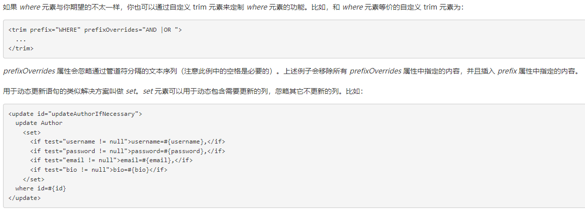

```xml
<update id="updateBlog" parameterType="map">
    update mybatis.blog
    <set>
        <if test="title != null">
            title = #{title},
        </if>
        <if test="author != null">
            author = #{author}
        </if>
    </set>
    where id = #{id}
</update>
```

### 1.12.4for-each

```xml
<!--ids是传的，#{id}是遍历的-->
<select id="queryBlogForeach" parameterType="map" resultType="Blog">
    select * from mybatis.blog
    <where>
        <foreach collection="ids" item="id" open="and ("
                 close=")" separator="or">
            id=#{id}
        </foreach>
    </where>
</select>
```

test代码：

```java
@Test
public void queryBlogForeach(){
    SqlSession sqlSession = MybatisUtils.getSqlSession();
    BlogMapper blogMapper = sqlSession.getMapper(BlogMapper.class);
    Map map = new HashMap();

    ArrayList<Integer> ids = new ArrayList<Integer>();
    ids.add(1);
    ids.add(3);
    map.put("ids",ids);

    List<Blog> list = blogMapper.queryBlogForeach(map);

    for (Blog blog : list) {
        System.out.println(blog);
    }

    sqlSession.close();
}
```

### 1.12.5SQL片段

```xml
<sql id="if-title-author">
    <if test="title != null">
        title = #{title}
    </if>
    <if test="author != null">
        and author = #{author}
    </if>
</sql>

<select id="queryBlogIF" parameterType="map" resultType="Blog">
    select * from mybatis.blog
    <where>
        <include refid="if-title-author"></include>
    </where>
</select>
```

## 1.13.mybatis缓存

### 1.13.1什么是缓存？

- 存在内存中的临时数据。
- 将用户经常查询的数据放在缓存（内存）中，用户去查询数据就不用从磁盘上(关系型数据库数据文件)查询，从缓存中查询，从而提高查询效率，解决了高并发系统的性能问题。

### 1.13.2为什么使用缓存？

减少和数据库的交互次数，减少系统开销，提高系统效率。

### 1.13.3什么样的数据可以使用缓存？

经常查询并且不经常改变的数据。

### 1.13.4mybatis缓存

- MyBatis包含一个非常强大的查询缓存特性，它可以非常方便地定制和配置缓存。缓存可以极大的提升查询效率。

- MyBatis系统中默认定义了两级缓存：**一级缓存**和**二级缓存**

- - 默认情况下，只有一级缓存开启。（SqlSession级别的缓存，也称为本地缓存）
  - 二级缓存需要手动开启和配置，他是基于namespace级别的缓存。
  - 为了提高扩展性，MyBatis定义了缓存接口Cache。我们可以通过实现Cache接口来自定义二级缓存

#### 1.13.4.1一级缓存

一级缓存也叫本地缓存：

- 与数据库同一次会话期间查询到的数据会放在本地缓存中。
- 以后如果需要获取相同的数据，直接从缓存中拿，没必须再去查询数据库；

1. 开启日志
2. 测试一个session中查询两次相同记录。

缓存失效：

- 映射语句文件中的所有 insert、update 和 delete 语句会刷新缓存。
- 查询不同的mapper.xml
- 手动清除缓存

一级缓存默认开启，只在一次sqlseesion中有效

#### 1.13.4.2二级缓存

- 二级缓存也叫全局缓存，一级缓存作用域太低了，所以诞生了二级缓存

- 基于namespace级别的缓存，一个名称空间，对应一个二级缓存；

- 工作机制

- - 一个会话查询一条数据，这个数据就会被放在当前会话的一级缓存中；
  - 如果当前会话关闭了，这个会话对应的一级缓存就没了；但是我们想要的是，会话关闭了，一级缓存中的数据被保存到二级缓存中；
  - 新的会话查询信息，就可以从二级缓存中获取内容；
  - 不同的mapper查出的数据会放在自己对应的缓存（map）中；

##### 1.13.4.2.1开启mybatis-config.xml的配置

```xml
<setting name="cacheEnabled" value="true"/>
```

##### 1.13.4.2.2在mapper.xml中使用二级缓存

```xml
<cache eviction="FIFO"
       flushInterval="60000"
       size="512"
       readOnly="true"/>
```

- 只有开启了二级缓存，在Mapper下有效
- 所有数据都会先放在一级缓存
- 只有当回话提交，或者关闭的时候，才会提交到二级缓存

### 1.13.3缓存原理

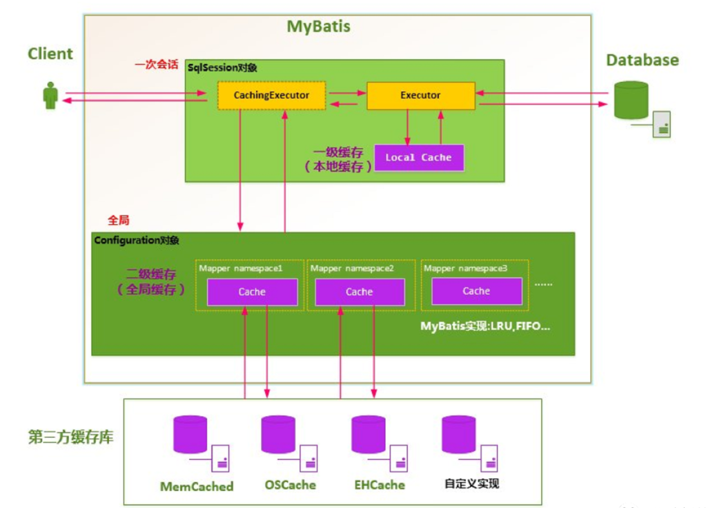

### 1.13.4自定义缓存:ehcache


#### 1.13.4.1导入mybatis-ehcache的jar包

```xml
<!-- https://mvnrepository.com/artifact/org.mybatis.caches/mybatis-ehcache -->
<dependency>
    <groupId>org.mybatis.caches</groupId>
    <artifactId>mybatis-ehcache</artifactId>
    <version>1.2.0</version>
</dependency>
```

#### 1.13.4.2书写ehcache.xml配置

```xml
<?xml version="1.0" encoding="UTF-8"?>
<ehcache xmlns:xsi="http://www.w3.org/2001/XMLSchema-instance"
         xsi:noNamespaceSchemaLocation="http://ehcache.org/ehcache.xsd"
         updateCheck="false">
    <!--
       diskStore：为缓存路径，ehcache分为内存和磁盘两级，此属性定义磁盘的缓存位置。参数解释如下：
       user.home – 用户主目录
       user.dir  – 用户当前工作目录
       java.io.tmpdir – 默认临时文件路径
     -->
    <diskStore path="java.io.tmpdir/Tmp_EhCache"/>
    <!--
       defaultCache：默认缓存策略，当ehcache找不到定义的缓存时，则使用这个缓存策略。只能定义一个。
     -->
    <!--
      name:缓存名称。
      maxElementsInMemory:缓存最大数目
      maxElementsOnDisk：硬盘最大缓存个数。
      eternal:对象是否永久有效，一但设置了，timeout将不起作用。
      overflowToDisk:是否保存到磁盘，当系统当机时
      timeToIdleSeconds:设置对象在失效前的允许闲置时间（单位：秒）。仅当eternal=false对象不是永久有效时使用，可选属性，默认值是0，也就是可闲置时间无穷大。
      timeToLiveSeconds:设置对象在失效前允许存活时间（单位：秒）。最大时间介于创建时间和失效时间之间。仅当eternal=false对象不是永久有效时使用，默认是0.，也就是对象存活时间无穷大。
      diskPersistent：是否缓存虚拟机重启期数据 Whether the disk store persists between restarts of the Virtual Machine. The default value is false.
      diskSpoolBufferSizeMB：这个参数设置DiskStore（磁盘缓存）的缓存区大小。默认是30MB。每个Cache都应该有自己的一个缓冲区。
      diskExpiryThreadIntervalSeconds：磁盘失效线程运行时间间隔，默认是120秒。
      memoryStoreEvictionPolicy：当达到maxElementsInMemory限制时，Ehcache将会根据指定的策略去清理内存。默认策略是LRU（最近最少使用）。你可以设置为FIFO（先进先出）或是LFU（较少使用）。
      clearOnFlush：内存数量最大时是否清除。
      memoryStoreEvictionPolicy:可选策略有：LRU（最近最少使用，默认策略）、FIFO（先进先出）、LFU（最少访问次数）。
      FIFO，first in first out，这个是大家最熟的，先进先出。
      LFU， Less Frequently Used，就是上面例子中使用的策略，直白一点就是讲一直以来最少被使用的。如上面所讲，缓存的元素有一个hit属性，hit值最小的将会被清出缓存。
      LRU，Least Recently Used，最近最少使用的，缓存的元素有一个时间戳，当缓存容量满了，而又需要腾出地方来缓存新的元素的时候，那么现有缓存元素中时间戳离当前时间最远的元素将被清出缓存。
   -->
    <defaultCache
            eternal="false"
            maxElementsInMemory="10000"
            overflowToDisk="false"
            diskPersistent="false"
            timeToIdleSeconds="1800"
            timeToLiveSeconds="259200"
            memoryStoreEvictionPolicy="LRU"/>

    <cache
            name="cloud_user"
            eternal="false"
            maxElementsInMemory="5000"
            overflowToDisk="false"
            diskPersistent="false"
            timeToIdleSeconds="1800"
            timeToLiveSeconds="1800"
            memoryStoreEvictionPolicy="LRU"/>

</ehcache>
```

# 二.MyBatis-plus

**mybatis-plus更新较快，建议时参照官方文档食用。**

截止2022年1月10日15:16:17，官方文档快速开始中的推荐使用版本为3.5.0


## 2.1.什么是mybatis-plus？

```xml
MyBatis-Plus (opens new window)（简称 MP）是一个 MyBatis (opens new window)的增强工具，在 MyBatis 的基础上只做增强不做改变，为简化开发、提高效率而生。
```


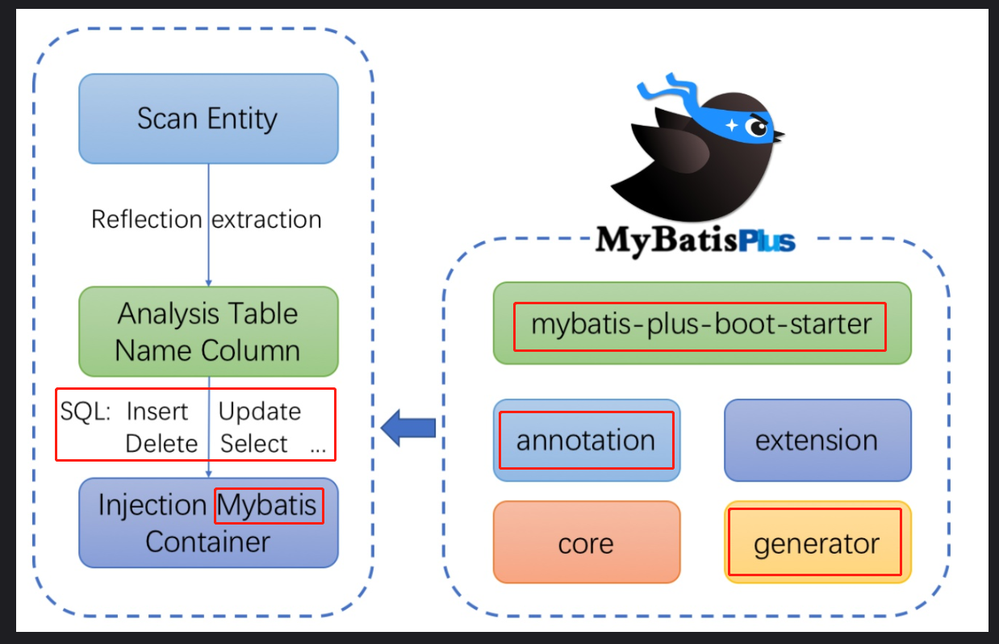

## 2.2.特性

注：标注黄色粗体寓意为在未来实操中务必使用

- **无侵入**：只做增强不做改变，引入它不会对现有工程产生影响，如丝般顺滑
- **损耗小**：**启动即会自动注入基本 CURD，性能基本无损耗，直接面向对象操作**
- **强大的 CRUD 操作**：内置==通用 Mapper、通用 Service==，仅仅通过少量配置即可实现单表大部分 CRUD 操作，更有强大的条件构造器，满足各类使用需求
- ==**支持 Lambda 形式调用**==：通过 Lambda 表达式，方便的编写各类查询条件，无需再担心字段写错
- ==**支持主键自动生成**==：支持多达 4 种主键策略（内含分布式唯一 ID 生成器 - Sequence），可自由配置，完美解决主键问题
- **支持 ActiveRecord 模式**：支持 ActiveRecord 形式调用，实体类只需继承 Model 类即可进行强大的 CRUD 操作
- **支持自定义全局通用操作**：支持全局通用方法注入（ Write once, use anywhere ）
- ==**内置代码生成器**==：采用代码或者 Maven 插件可快速生成 Mapper 、 Model 、 Service 、 Controller 层代码，支持模板引擎，更有超多自定义配置等您来使用
- **内置分页插件**：**基于 MyBatis 物理分页，开发者无需关心具体操作，配置好插件之后，写分页等同于普通 List 查询**
- **分页插件支持多种数据库**：支持 MySQL、MariaDB、Oracle、DB2、H2、HSQL、SQLite、Postgre、SQLServer 等多种数据库
- ==**内置性能分析插件**==：可输出 Sql 语句以及其执行时间，建议开发测试时启用该功能，能快速揪出慢查询
- **内置全局拦截插件**：提供全表 delete 、 update 操作智能分析阻断，也可自定义拦截规则，预防误操作

## 2.3.快速开始

**数据库搭建**

```mysql
# ------------------------
# 创建数据库User
create database User;
# 使用数据库User
use  User;
# 如果user表存在的话，删除user
drop table if exists user ;
# 创建user表
CREATE TABLE user
(
    id BIGINT(20) NOT NULL COMMENT '主键ID' auto_increment,
    name VARCHAR(30) NULL DEFAULT NULL COMMENT '姓名',
    age INT(11) NULL DEFAULT NULL COMMENT '年龄',
    email VARCHAR(50) NULL DEFAULT NULL COMMENT '邮箱',
    create_time datetime DEFAULT  CURRENT_TIMESTAMP,
    update_time datetime ON UPDATE  CURRENT_TIMESTAMP,
    deleted int(20) default '0',
    PRIMARY KEY (id)
);
# 插入数据
insert into user
(id, name, age, email, create_time, update_time, deleted)
VALUES
(1,'mark',19,'1344471553@qq.com',CURRENT_TIMESTAMP,CURRENT_TIMESTAMP,0),
(2,null,30,'1344471553@qq.com',CURRENT_TIMESTAMP,CURRENT_TIMESTAMP,0),
(3,'roc',19,null,CURRENT_TIMESTAMP,CURRENT_TIMESTAMP,0),
(4,'john',19,'13@qq.com',CURRENT_TIMESTAMP,CURRENT_TIMESTAMP,0);
# 查询user表
select * from user;
```

### 2.3.1.依赖导入

```xml
<!--mysql-->
<dependency>
    <groupId>mysql</groupId>
    <artifactId>mysql-connector-java</artifactId>
</dependency>
<!--lombok-->
<dependency>
    <groupId>org.projectlombok</groupId>
    <artifactId>lombok</artifactId>
</dependency>
<!--mybatis-plus-->
<dependency>
    <groupId>com.baomidou</groupId>
    <artifactId>mybatis-plus-boot-starter</artifactId>
    <version>3.0.5</version>
</dependency>
```

### 2.3.2.配置:连接数据库

```xml
application.yml

# mysql
#spring.datasource.username=root
#spring.datasource.password=root
#spring.datasource.url=jdbc:mysql://localhost:3306/User?userSSL=true&useUnicode=true&characterEncoding=UTF-8&serverTimezone=UTC
#spring.datasource.driver-class-name=com.mysql.cj.jdbc.Driver

spring:
  datasource:
    username: root
    password: 123456
    url: jdbc:mysql://localhost:3306/user?userSSL=true&useUnicode=true&characterEncoding=UTF-8&serverTimezone=UTC
    driver-class-name: com.mysql.cj.jdbc.Driver
```

### 2.3.3.编写Mapper继承BaseMapper

## 2.4.配置日志

```xml
#配置日志
mybatis-plus:
  configuration:
    log-impl: org.apache.ibatis.logging.stdout.StdOutImpl
```


## 2.5.CRUD扩展

### 2.5.1.insert

```java
@Test
public void addUser(){
  User user = new User();
  //我们并没有setId，而是自动生成了Id
  user.setName("wangPeng");
  user.setAge(81);
  user.setEmail("1344471553@qq.com");
  userMapper.insert(user);
}
```


### 2.5.2.update

```java
@Test
public void update(){
  User user = new User();
  //我们并没有setId，而是自动生成了Id
  user.setId(6);
  user.setName("wangyufei");
  user.setAge(18);
  user.setEmail("1344471553@qq.com");
  userMapper.updateById(user);
}
```

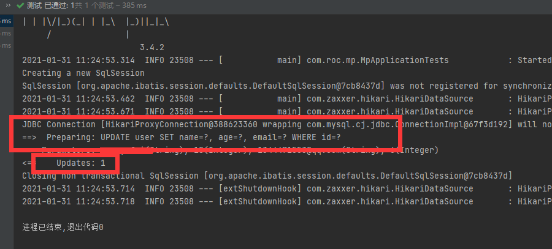

自动填充：源自官网：https://mp.baomidou.com/guide/auto-fill-metainfo.html

```xml
创建时间 . 修改时间! 这些个操作都是自动化完成的,我们不希望手动更新!

阿里巴巴开发手册:所有的数据库表:gmt_create .gmt_modified几乎所有的表都要配置上!而且需要自动化!
```

更新表结构

```java
CREATE TABLE user
(
    id BIGINT(20) NOT NULL COMMENT '主键ID' auto_increment,
    name VARCHAR(30) NULL DEFAULT NULL COMMENT '姓名',
    age INT(11) NULL DEFAULT NULL COMMENT '年龄',
    email VARCHAR(50) NULL DEFAULT NULL COMMENT '邮箱',
    create_time datetime DEFAULT  CURRENT_TIMESTAMP,
    update_time datetime ON UPDATE  CURRENT_TIMESTAMP,
    PRIMARY KEY (id)
);
```

更新对应实体类

```java
@Data
@AllArgsConstructor
@NoArgsConstructor
public class User {

    @TableId(type = IdType.AUTO)
    private Integer id;

    private String name;
    private Integer age;
    private String email;
    private Date createTime;
    private Date updateTime;

}
```

## 2.6.**主键生成策略**

分布式系统唯一id生成:https://www.cnblogs.com/haoxinyue/p/5208136.html

截止2022年1月10日15:23:02，3.5.0的Mybatis-plus中的@TableId的属性发生了变化。

**雪花算法**😦**Twitter的snowflake算法**

```xml
snowflake是Twitter开源的分布式ID生成算法，结果是一个long型的ID。其核心思想是：使用41bit作为毫秒数，10bit作为机器的ID（5个bit是数据中心，5个bit的机器ID），12bit作为毫秒内的流水号（意味着每个节点在每毫秒可以产生 4096 个 ID），最后还有一个符号位，永远是0.可以保证几乎全球唯一
```

在实体类上需要自增的主键上加上注解

```java
@Data
@AllArgsConstructor
@NoArgsConstructor
public class User {
@TableId(type = IdType.AUTO)
private Integer id;

private String name;
private Integer age;
private String email;
}
```
    @TableId()的其他属性：
    AUTO(0),//数据库ID自增  
    NONE(1),//该类型为未设置主键类型      
    INPUT(2),//用户输入ID
      		 //该类型可以通过自己注册自动填充插件进行填充  
      		 /以下3种类型、只有当插入对象ID 为空，才自动填充。     
    ID_WORKER(3),//全局唯一ID (idWorker)      
    UUID(4),//全局唯一ID (UUID)          
    ID_WORKER_STR(5);//字符串全局唯一ID (idWorker 的字符串表示)   

## 2.7.乐观锁/悲观锁/自旋锁

参考临街：https://www.bilibili.com/video/BV17E411N7KN?p=8&spm_id_from=pageDriver

```xml
乐观锁: 顾名思义十分乐观,他总是认为不会出现问题,无论干什么都不去上锁!如果出现了问题,再次更新值测试

悲观锁：顾名思义十分悲观,他总是认为出现问题,无论干什么都会上锁!再去操作!
```

当要更新一条记录的时候，希望这条记录没有被别人更新 乐观锁实现方式：

> - 取出记录时，获取当前version
> - 更新时，带上这个version
> - 执行更新时， set version = newVersion where version = oldVersion
> - 如果version不对，就更新失败

乐观锁/悲观锁/自旋锁/JUC······

锁，在MySQL和java的并发编程中都提到了。这里应该是强调的是java的并发编程，也就是JUC。

这里便不再详细阐述，java的并发编程将放在javaBasic中的高阶篇展开。

### 2.7.1.乐观锁

### 2.7.2.悲观锁

### 2.7.3.自旋锁

## 2.8.查询操作

### 2.8.1.根据ID查询用户

```java
@Test
public void selectUserById(){
  User user = userMapper.selectById(1);
  System.out.println(user);
}
```

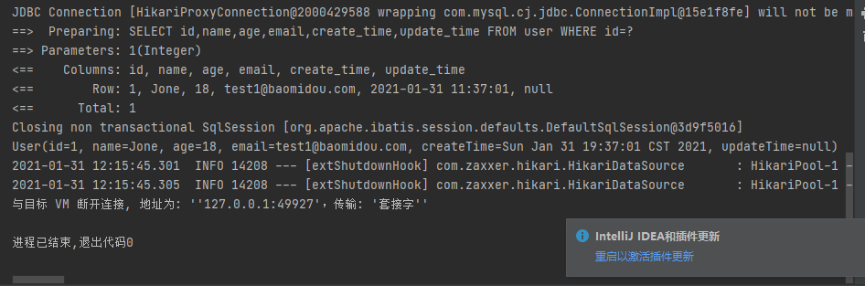

### 2.8.2.查询用户列表

```java
@Test
public void selectUserList(){
  List<User> userList = userMapper.selectList(null);
  userList.forEach(System.out::println);
}
```


### 2.8.3.查询部分用户

```java
@Test
public void selectUserByIds(){
  List<User> userList = userMapper.selectBatchIds(Arrays.asList(1, 2, 3));
  userList.forEach(System.out::println);
}
```


### 2.8.4.使用map进行条件查询

```java
@Test
public void setUserByMap(){
  HashMap<String, Object> map = new HashMap<>();
  map.put("name","wangyufei");
  List<User> userList = userMapper.selectByMap(map);
  userList.forEach(System.out::println);
}
```

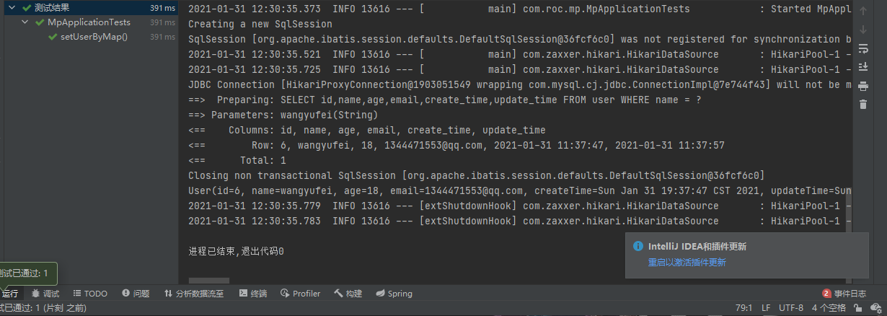

## 2.9.分页查询

### 2.9.1.传统的使用limit分页

### 2.9.2.pageHelper第三方插件

### 2.9.3.MP内置分页插件

官网：https://mp.baomidou.com/guide/page.html

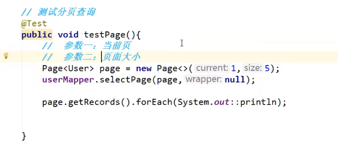

## 2.10.删除操作

### 2.10.1.根据Id删除

```java
@Test
public void deleteById(){
  userMapper.deleteById(6);
}
```

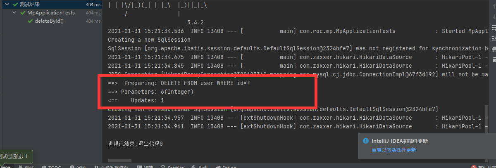

### 2.10.2.批量删除

```java
@Test
public void deleteByBatchId(){
  userMapper.deleteBatchIds(Arrays.asList(1, 2, 3));
}
```


### 2.10.3.通过map删除

map传入一个可以拼接在where条件上的值。

```java
@Test
public void deleteByMap(){
  HashMap<String, Object> map = new HashMap<>();
  map.put("name","Sandy");
  userMapper.deleteByMap(map);
}
```


## 2.11.逻辑删除/物理删除

### 2.11.1.更改表结构

```mysql
CREATE TABLE user
(
    id BIGINT(20) NOT NULL COMMENT '主键ID' auto_increment,
    name VARCHAR(30) NULL DEFAULT NULL COMMENT '姓名',
    age INT(11) NULL DEFAULT NULL COMMENT '年龄',
    email VARCHAR(50) NULL DEFAULT NULL COMMENT '邮箱',
    create_time datetime DEFAULT  CURRENT_TIMESTAMP,
    update_time datetime ON UPDATE  CURRENT_TIMESTAMP,
    deleted int(20) default '0',
    PRIMARY KEY (id)
);
```

### 2.11.2.更改实体类

```java
@Data
@AllArgsConstructor
@NoArgsConstructor
public class User {

    @TableId(type = IdType.AUTO)
    private Integer id;

    private String name;
    private Integer age;
    private String email;
    private Date createTime;
    private Date updateTime;

    @TableLogic
    private Integer deleted;
}
```

### 2.11.3.实操

实际业务中删除其实为更新操作，将deleted改为“已被删除状态”。

## 2.12.性能分析插件

MP提供一种性能分析插件：https://mp.baomidou.com/guide/p6spy.html

狂神：https://www.bilibili.com/video/BV17E411N7KN?p=13&spm_id_from=pageDriver

### 2.12.1.导入插件

```xml
<dependency>
    <groupId>p6spy</groupId>
    <artifactId>p6spy</artifactId>
    <version>3.8.7</version>
</dependency>
```

### 2.12.2.配置插件

- 数据连接修改

  ```java
  #驱动需要改为p6spy的驱动
  driverClassName: com.p6spy.engine.spy.P6SpyDriver
  #连接串修改，jdbc后面添加p6spy，其他没有变化
  url: jdbc:p6spy:mysql://数据库地址
  ```

- p6spy配置文件添加

  ==文件名为：spy.properties，存放路径和application.yml同级==

  ```java
  #3.2.1以上使用
  modulelist=com.baomidou.mybatisplus.extension.p6spy.MybatisPlusLogFactory,com.p6spy.engine.outage.P6OutageFactory
  #3.2.1以下使用或者不配置
  #modulelist=com.p6spy.engine.logging.P6LogFactory,com.p6spy.engine.outage.P6OutageFactory
  # 自定义日志打印
  logMessageFormat=com.baomidou.mybatisplus.extension.p6spy.P6SpyLogger
  #日志输出到控制台
  appender=com.baomidou.mybatisplus.extension.p6spy.StdoutLogger
  # 使用日志系统记录 sql
  #appender=com.p6spy.engine.spy.appender.Slf4JLogger
  # 设置 p6spy driver 代理
  deregisterdrivers=true
  # 取消JDBC URL前缀
  useprefix=true
  # 配置记录 Log 例外,可去掉的结果集有error,info,batch,debug,statement,commit,rollback,result,resultset.
  excludecategories=info,debug,result,commit,resultset
  # 日期格式
  dateformat=yyyy-MM-dd HH:mm:ss
  # 实际驱动可多个
  #driverlist=org.h2.Driver
  # 是否开启慢SQL记录
  outagedetection=true
  # 慢SQL记录标准 2 秒
  outagedetectioninterval=2
  ```

## 2.13.条件构造器Wrapper

官网：https://mp.baomidou.com/guide/wrapper.html

B站狂神：https://www.bilibili.com/video/BV17E411N7KN?p=14&spm_id_from=pageDriver

### 2.13.1.通过Wrapper构造条件进行查询

```java
@Test
//查询name不为空，且邮箱不为空，年龄大于12岁的用户
public void selectByWrapper(){
    QueryWrapper<User> queryWrapper = new QueryWrapper<>();
    queryWrapper
            .isNotNull("name")
            .isNotNull("email")
            .ge("age",12);

    userMapper.selectList(queryWrapper).forEach(System.out::println);
}
```

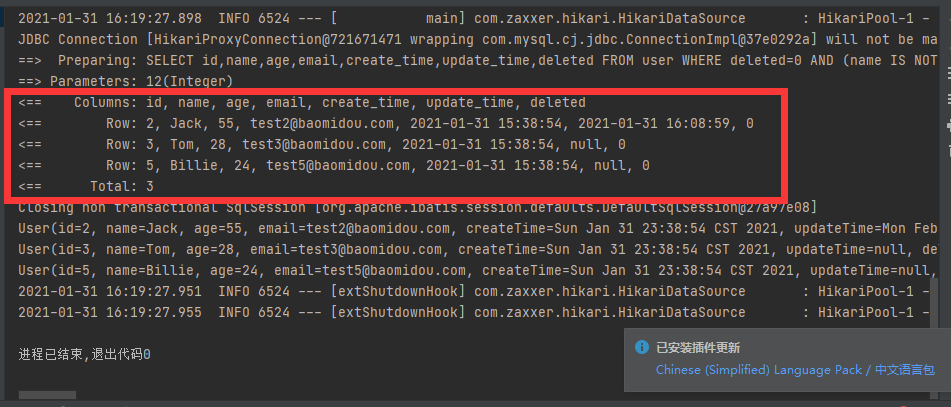

```mysql
SELECT id,name,age,email,create_time,update_time,deleted FROM user WHERE deleted=0 AND (name IS NOT NULL AND email IS NOT NULL AND age >= ?)
```

### 2.13.2.通过Wrapper构造模糊查询

```java
@Test
public void selectByName(){
    QueryWrapper<User> queryWrapper = new QueryWrapper<>();
    queryWrapper.eq("name","kuangshengshuo");
    userMapper.selectList(queryWrapper);    
}
```


```mysql
SELECT id,name,age,email,create_time,update_time,deleted FROM user WHERE deleted=0 AND (name = ?)
```


### 2.13.3.通过wrapper构造between···and···

```java
@Test
public void selectByBetween(){
    QueryWrapper<User> queryWrapper = new QueryWrapper<>();
    queryWrapper.between("age","10","30");
    userMapper.selectList(queryWrapper).forEach(System.out::println);
    Integer count = userMapper.selectCount(queryWrapper);
    System.out.println(count);
}
```


### 2.13.4.通过wrapper构造模糊查询

```java
@Test
public void selectByLike(){
    QueryWrapper<User> queryWrapper = new QueryWrapper<>();
    queryWrapper.notLike("name","e");
    List<Map<String, Object>> maps = userMapper.selectMaps(queryWrapper);
    maps.forEach(System.out::println);
}
```


### 2.13.5.嵌入SQL进行查询

```java
@Test
public void selectBySql(){
    QueryWrapper<User> queryWrapper = new QueryWrapper<>();
    queryWrapper.inSql("id","select id from user where id <5");
    List<Object> objects = userMapper.selectObjs(queryWrapper);
    objects.forEach(System.out::println);
}
```

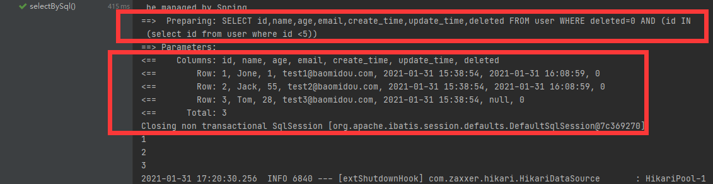

### 2.13.6.通过Id进行降序排序

```java
@Test
public void selectByOrder(){
    QueryWrapper<User> queryWrapper = new QueryWrapper<>();
    queryWrapper.orderByDesc("Id");
    List<User> userList = userMapper.selectList(queryWrapper);
    userList.forEach(System.out::println);
}
```


wrapper的玩法不止这些~~~

## 2.14.代码自动生成器mybatis  generator

官方：https://mp.baomidou.com/guide/generator.html#使用教程

狂神：https://www.bilibili.com/video/BV17E411N7KN?p=16&spm_id_from=pageDriver


