# MySql

## 一.什么是数据库？

### 1.数据库

**DataBase** , 简称**DB**

**概念** : 长期存放在计算机内,有组织,可共享的大量数据的集合,是一个数据 "仓库"

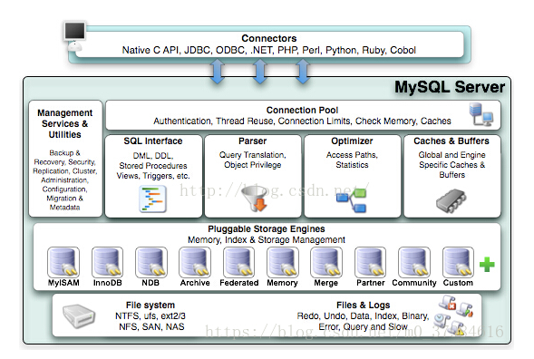

### 2.数据库的分类

- 关系型数据库：关系型数据库通过外键链接建立表之间的联系

  MySQL、Oracle、SQL Server

- 非关系型数据库：非关系型数据库通常指数据以对象的形式存储在数据库中，而对象之间的关系通过每个对象自身的属性来决定

  Redis、MongoDB

### 3.数据库管理系统

 数据库管理系统，简称DBMS，科学组织和存储数据 , 高效地获取和维护数据

## 二.MySql


### 1.MySql的简介

**概念 :** 是现在**流行**的**开源**的,**免费**的 **关系型**数据库

**历史 :** 由瑞典MySQL AB 公司开发，目前属于 Oracle 旗下产品。

**特点 :**

- 免费 , 开源数据库
- 小巧 , 功能齐全
- 使用便捷
- 可运行于Windows或Linux操作系统
- 可适用于中小型甚至大型网站应用

**官网 :** **https://www.mysql.com/**

常用版本：5.7/8.0

5.7和8.0的区别？

### 2.MySQL安装

参考RD_NewEnvironment.md中关于MySQL的安装以及数据库管理系统的安装。

### 3.MySQL的数据类型

#### 3.1数值类型

java对应类型：int/long/float/double/bigdecimal

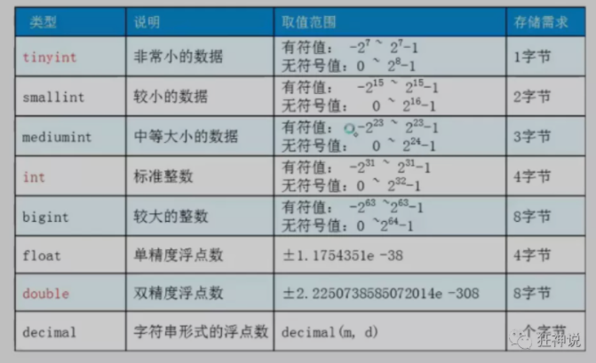

#### 3.2字符串类型

java类型：String

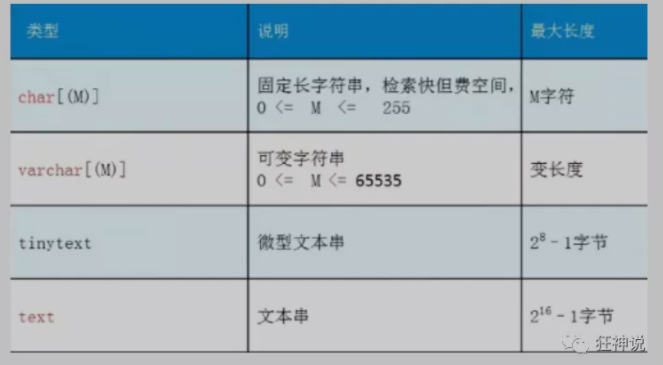

#### 3.3日期类型

java类型：java.util.Date

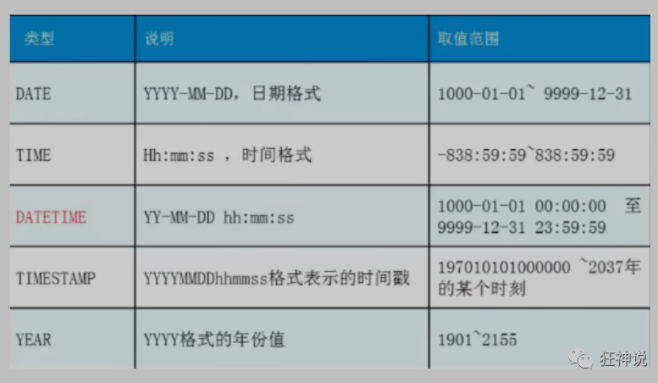

#### 3.4null

- 理解为“没有值”或者“未知值”

- 不要使用null进行运算，结算结果仍为null

### 4.MySql的字段属性

```mysql
UnSigned
无符号的整数
声明该数据列不允许负数 .

ZEROFILL
0填充的
不足位数的用0来填充 , 如int(3),5则为005

Auto_InCrement
自动增长的 , 每添加一条数据 , 自动在上一个记录数上加 1(默认)
通常用于设置主键 , 且为整数类型
可定义起始值和步长
当前表设置步长(AUTO_INCREMENT=100) : 只影响当前表

SET @@auto_increment_increment=5 ; 影响所有使用自增的表(全局)

NULL 和 NOT NULL
默认为NULL , 即没有插入该列的数值
如果设置为NOT NULL , 则该列必须有值

DEFAULT
默认的
用于设置默认值
例如,性别字段,默认为"男" , 否则为 "女" ; 若无指定该列的值 , 则默认值为"男"的值

character set utf8
设置数据库字符集编码
若无设定，则根据数据库配置my.ini中的参数设定：建议在sql语句中完成字符集的设置，否则在另外环境运行SQL会因为字符集编码不同造成未知的bug
```

### 5.数据库引擎

MySQL的数据表的类型 : **MyISAM** , **InnoDB** , HEAP , BOB , CSV等...

#### 5.1MyISAM和InnoDb的区别

（仅限5.17考虑）


#### 5.2MYISAM和INNODB区别详解

- 适用 MyISAM : 节约空间及相应速度
- 适用 InnoDB : 安全性 , 事务处理及多用户操作数据表

### 6.数据库表的存储位置

- MySQL数据表以文件方式存放在磁盘中

    - 包括表文件 , 数据文件 , 以及数据库的选项文件
        - 位置 : Mysql安装目录\data\下存放数据表 . 目录名对应数据库名 , 该目录下文件名对应数据表 

- 注意 :

     - \* . frm -- 表结构定义文件

     - \* . MYD -- 数据文件 ( data )

     - \* . MYI -- 索引文件 ( index )

          

     - InnoDB类型数据表只有一个 *.frm文件 , 以及上一级目录的ibdata1文件

     - MyISAM类型数据表对应三个文件 :

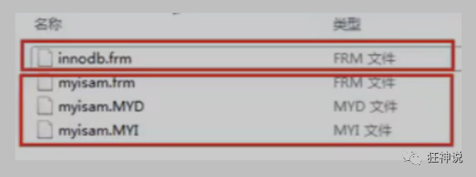

### 7.外键

#### 7.1什么是外键？

​	如果公共关键字在一个关系中是主关键字，那么这个公共关键字被称为另一个关系的外键。由此可见，外键表示了两个关系之间的相关联系。以另一个关系的外键作主关键字的表被称为**主表**，具有此外键的表被称为主表的**从表**。

​	在实际操作中，将一个表的值放入第二个表来表示关联，所使用的值是第一个表的主键值(在必要时可包括复合主键值)。此时，第二个表中保存这些值的属性称为外键(**foreign key**)。

#### 7.2**外键作用**

保持数据**一致性**，**完整性**，主要目的是控制存储在外键表中的数据,**约束**。使两张表形成关联，外键只能引用外表中的列的值或使用空值。

**删除外键：**先删除子表，再删除主表。

#### 7.3**阿里巴巴java开发手册中对外键的解释**


### 8.MySQL大小写敏感设置与Mybatis

#### 8.1MySQL关于大小写的设置

##### 8.1.1查看当前mysql的大小写敏感设置

```sql
show global variables like '%lower_case%';
```

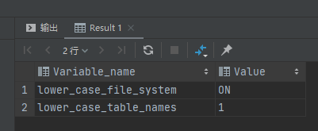

**lower_case_file_system：表示当前系统是否大小写敏感，只读参数，无法修改。**

1. ON：大小写不敏感

2. OFF：大小写敏感

**lower_case_table_name：表示表名是否大小写敏感，可以修改**

1. lower_case_table_name：1 大小写敏感

2. lower_case_table_name：0 mysql会把表名转换为小写

##### 8.1.2如要修改MySQL对大小写敏感的设置？

1. 打开my.ini：目标在第205行


2. 修改目标参数：lower_case_table_name

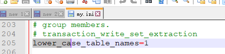

#### 8.2mybatis

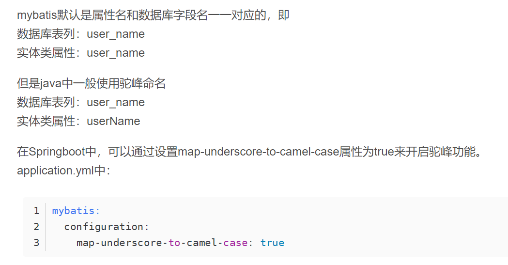

具体讨论将在MyBatis框架中展开。

### 9mysql字符集和校对规则

参考链接：[MySQL字符集及校对规则的理解 - GeaoZhang - 博客园 (cnblogs.com)](https://www.cnblogs.com/geaozhang/p/6724393.html?utm_source=itdadao&utm_medium=referral)

==只要涉及到文字的地方，就会存在字符集和编码方式。==

建表建库都需要指定好当前库所支持的字符集

## 三.MySQL Basic

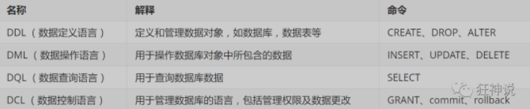

### 1.操作库

```mysql
创建数据库 : create database [if not exists] 数据库名;

删除数据库 : drop database [if exists] 数据库名;

查看数据库 : show databases;

使用数据库 : use 数据库名;
```

### 2.操作表

#### 2.1查询

```mysql
查看所有的表：show tables;
查看表中所有的信息：：describe 表名;或者 desc 表名
查询表的创建语句：show create table 表名;
```

#### 2.2新建

```mysql
create table [if not exists] `表名`(
   '字段名1' 列类型 [属性][索引][注释],
   '字段名2' 列类型 [属性][索引][注释],
  #...
   '字段名n' 列类型 [属性][索引][注释]
)[表类型][表字符集][注释];
```

示例：

```mysql
drop table if exists students;
# 创建学生表
# comment添加注释
create table if not exists students(
    sid     int         not null    auto_increment primary key comment '学生id',
    sname   varchar(25) not null                               comment '学生姓名',
    sage    int         not null                               comment '学生年龄'
)ENGINE = InnoDB character set utf8
                                                               comment = '学生表';
```

#### 2.3修改表

**alter**：修改表结构

##### 2.3.1修改表名

```mysql
alter table 表名 rename as 新表名;
```

##### 2.3.2增加表的字段

```mysql
alter table 表名 add 字段名 字段类型 字段数形;
```

##### 2.3.3修改表的字段约束

```mysql
alter table 表名 modify 字段名 新的字段类型;
```

##### 2.3.4重命名表的字段

```mysql
alter table 表名 change 字段名 新的字段名 新的字段类型
```

##### 2.3.5删除表的字段

```mysql
alter table 表名 drop 字段名;
```

#### 2.4删除表

```mysql
drop table if exists 表名;
```

### 3.DML语言

#### 3.1insert

```mysql
INSERT INTO 表名[(字段1,字段2,字段3,...)] VALUES('值1','值2','值3')
```

注：

- 主键自增的列可以忽略
- 字段和字段之间用英文逗号隔开
- 字段是可以省略的，但要与填写的值一一对应

#### 3.2update

```mysql
UPDATE 表名 SET column_name=value [,column_name2=value2,...] [WHERE condition];
```

注：

- 不指定条件的情况下，更新表默认更新所有的数据
- condition为指定条件

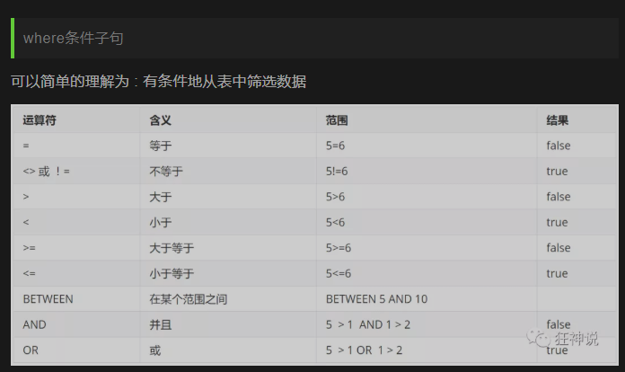

#### 3.3delete数据

```mysql
DELETE FROM 表名 [WHERE condition];
```

#### 3.4TRUNCATE清空表

**清空表**

作用：用于完全清空表数据 , 但表结构 , 索引 , 约束等不变 ;

语法：

```mysql
TRUNCATE [TABLE] table_name;
```

**注意：区别于DELETE命令**

- 相同 : 都能删除数据 , 不删除表结构 , 但TRUNCATE速度更快
- 不同 :
  - 使用TRUNCATE TABLE 重新设置AUTO_INCREMENT计数器
  - 使用TRUNCATE TABLE不会对事务有影响 （事务后面会说）

```xml
-- 结论:truncate删除数据,自增当前值会恢复到初始值重新开始;不会记录日志.

-- 同样使用DELETE清空不同引擎的数据库表数据.重启数据库服务后
-- InnoDB : 自增列从初始值重新开始 (因为是存储在内存中,断电即失)
-- MyISAM : 自增列依然从上一个自增数据基础上开始 (存在文件中,不会丢失)
```

### 4.DQL语言

**DQL( Data Query Language 数据查询语言 )**

- 查询数据库数据 , 如**SELECT**语句
- **简单的单表查询或多表的复杂查询和嵌套查询**
- 是**数据库语言中最核心,最重要的语句**
- 使用频率最高的语句

#### 4.1select

```mysql
SELECT [ALL | DISTINCT]
{* | table.* | [table.field1[as alias1][,table.field2[as alias2]][,...]]}
FROM table_name [as table_alias]
  [left | right | inner join table_name2]  -- 联合查询
  [WHERE ...]  -- 指定结果需满足的条件
  [GROUP BY ...]  -- 指定结果按照哪几个字段来分组
  [HAVING]  -- 过滤分组的记录必须满足的次要条件
  [ORDER BY ...]  -- 指定查询记录按一个或多个条件排序
  [LIMIT {[offset,]row_count | row_countOFFSET offset}];
   -- 指定查询的记录从哪条至哪条
```

**注意 : [ ] 括号代表可选的 , { }括号代表必选得**

> AS 子句作为别名

作用：

- 可给数据列取一个新别名
- 可给表取一个新别名
- 可把经计算或总结的结果用另一个新名称来代替

```mysql
-- 这里是为列取别名(当然as关键词可以省略)
SELECT studentno AS 学号,studentname AS 姓名 FROM student;

-- 使用as也可以为表取别名
SELECT studentno AS 学号,studentname AS 姓名 FROM student AS s;

-- 使用as,为查询结果取一个新名字
-- CONCAT()函数拼接字符串
SELECT CONCAT('姓名:',studentname) AS 新姓名 FROM student;
```

- select的其他玩法

```sql
select version();  --查询系统版本
 
select 100*3-1 as 计算结果 --用来计算

select @@auto_increment_increment； --查询自增步长
```

#### 4.2concat：拼接

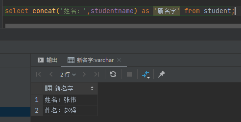

#### 4.3distinct：去重

作用 : 去掉SELECT查询返回的记录结果中重复的记录 ( 返回所有列的值都相同 ) , 只返回一条

```mysql
select distinct('列名') from 表名
```

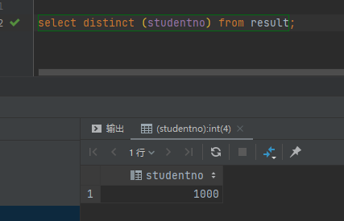

#### 4.4Where

作用：用于检索数据表中 符合条件 的记录

搜索条件可由一个或多个逻辑表达式组成 , 结果一般为真或假


```mysql
-- 满足条件的查询(where)
SELECT Studentno,StudentResult FROM result;

-- 查询考试成绩在95-100之间的
SELECT Studentno,StudentResult
FROM result
WHERE StudentResult>=95 AND StudentResult<=100;

-- AND也可以写成 &&
SELECT Studentno,StudentResult
FROM result
WHERE StudentResult>=95 && StudentResult<=100;

-- 模糊查询(对应的词:精确查询)
SELECT Studentno,StudentResult
FROM result
WHERE StudentResult BETWEEN 95 AND 100;

-- 除了1000号同学,要其他同学的成绩
SELECT studentno,studentresult
FROM result
WHERE studentno!=1000;

-- 使用NOT
SELECT studentno,studentresult
FROM result
WHERE NOT studentno=1000;
```

#### 4.5模糊查询

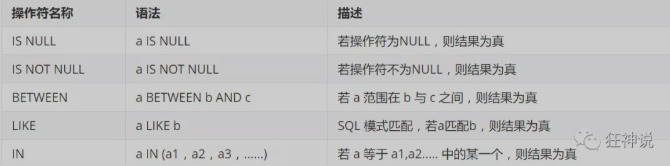

```mysql
-- 模糊查询 between and \ like \ in \ null

-- =============================================
-- LIKE
-- =============================================
-- 查询姓刘的同学的学号及姓名
-- like结合使用的通配符 : % (代表0到任意个字符) _ (一个字符)
SELECT studentno,studentname FROM student
WHERE studentname LIKE '刘%';

-- 查询姓刘的同学,后面只有一个字的
SELECT studentno,studentname FROM student
WHERE studentname LIKE '刘_';

-- 查询姓刘的同学,后面只有两个字的
SELECT studentno,studentname FROM student
WHERE studentname LIKE '刘__';

-- 查询姓名中含有 嘉 字的
SELECT studentno,studentname FROM student
WHERE studentname LIKE '%嘉%';

-- 查询姓名中含有特殊字符的需要使用转义符号 '\'
-- 自定义转义符关键字: ESCAPE ':'

-- =============================================
-- IN
-- =============================================
-- 查询学号为1000,1001,1002的学生姓名
SELECT studentno,studentname FROM student
WHERE studentno IN (1000,1001,1002);

-- 查询地址在北京,南京,河南洛阳的学生
SELECT studentno,studentname,address FROM student
WHERE address IN ('北京','南京','河南洛阳');

-- =============================================
-- NULL 空
-- =============================================
-- 查询出生日期没有填写的同学
-- 不能直接写=NULL , 这是代表错误的 , 用 is null
SELECT studentname FROM student
WHERE BornDate IS NULL;

-- 查询出生日期填写的同学
SELECT studentname FROM student
WHERE BornDate IS NOT NULL;

-- 查询没有写家庭住址的同学(空字符串不等于null)
SELECT studentname FROM student
WHERE Address='' OR Address IS NULL;
```

#### 4.6连接查询

**join对比**


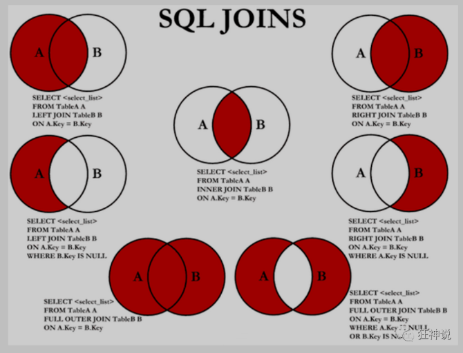

##### 4.6.1左右连接&三表连接

```mysql
/*
连接查询
   如需要多张数据表的数据进行查询,则可通过连接运算符实现多个查询
内连接 inner join
   查询两个表中的结果集中的交集
外连接 outer join
   左外连接 left join
       (以左表作为基准,右边表来一一匹配,匹配不上的,返回左表的记录,右表以NULL填充)
   右外连接 right join
       (以右表作为基准,左边表来一一匹配,匹配不上的,返回右表的记录,左表以NULL填充)
       
等值连接和非等值连接

自连接
*/

-- 查询参加了考试的同学信息(学号,学生姓名,科目编号,分数)
SELECT * FROM student;
SELECT * FROM result;

/*思路:
(1):分析需求,确定查询的列来源于两个类,student result,连接查询
(2):确定使用哪种连接查询?(内连接)
*/
SELECT s.studentno,studentname,subjectno,StudentResult
FROM student s
INNER JOIN result r
ON r.studentno = s.studentno

-- 右连接(也可实现)
SELECT s.studentno,studentname,subjectno,StudentResult
FROM student s
RIGHT JOIN result r
ON r.studentno = s.studentno

-- 等值连接
SELECT s.studentno,studentname,subjectno,StudentResult
FROM student s , result r
WHERE r.studentno = s.studentno

-- 左连接 (查询了所有同学,不考试的也会查出来)
SELECT s.studentno,studentname,subjectno,StudentResult
FROM student s
LEFT JOIN result r
ON r.studentno = s.studentno

-- 查一下缺考的同学(左连接应用场景)
SELECT s.studentno,studentname,subjectno,StudentResult
FROM student s
LEFT JOIN result r
ON r.studentno = s.studentno
WHERE StudentResult IS NULL

-- 思考题:查询参加了考试的同学信息(学号,学生姓名,科目名,分数)
SELECT s.studentno,studentname,subjectname,StudentResult
FROM student s
INNER JOIN result r
ON r.studentno = s.studentno
INNER JOIN `subject` sub
ON sub.subjectno = r.subjectno
```

##### 4.6.2自连接

```mysql
自连接
   数据表与自身进行连接
```

#### 4.7排序

##### 4.7.1升序

order by 字段 ASC

Ascending

##### 4.7.2降序

order by 字段 DESC

Descending

#### 4.8分页

##### 4.8.1为什么要分页？

- 缓解数据库的压力
- 给人的体验更好（另外还有一种技术叫做瀑布流：图片网站、视频网站）

limit 第几条开始，每页条数

```xml
推导:
   第一页 : limit 0,5
   第二页 : limit 5,5
   第三页 : limit 10,5
   ......
   第N页 : limit (pageNo-1)*pageSzie,pageSzie
   [pageNo:页码,pageSize:单页面显示条数]
```

```mysql
SELECT s.studentno,studentname,subjectname,StudentResult
FROM student s
INNER JOIN result r
ON r.studentno = s.studentno
INNER JOIN `subject` sub
ON r.subjectno = sub.subjectno
WHERE subjectname='数据库结构-1'
ORDER BY StudentResult DESC , studentno
LIMIT 0,5
```

#### 4.9子查询&嵌套查询

##### 4.9.1子查询

```xml
什么是子查询?
   在查询语句中的WHERE条件子句中,又嵌套了另一个查询语句
   子查询返回的结果一般都是集合,故而建议使用IN关键字;
```

```mysql
SELECT studentno,subjectno,StudentResult
FROM result
WHERE subjectno in
(
   SELECT subjectno FROM `subject`
   WHERE subjectname = '数据库结构-1'
)
ORDER BY studentresult DESC;
```

##### 4.9.2嵌套查询

```tex
什么是嵌套查询？
	嵌套查询可由多个子查询组成,求解的方式是由里及外;
```

套娃查询：我都关着灯

### 5.mysql函数

链接：https://mp.weixin.qq.com/s/NYSJSrJtmEEXS_n94X9QZQ

#### 5.1常见函数

##### 5.1.1数据函数

```mysql
 SELECT ABS(-8);  /*绝对值*/
 SELECT CEILING(9.4); /*向上取整*/
 SELECT FLOOR(9.4);   /*向下取整*/
 SELECT RAND();  /*随机数,返回一个0-1之间的随机数*/
 SELECT SIGN(0); /*符号函数: 负数返回-1,正数返回1,0返回0*/
```

##### 5.1.2字符串函数

```mysql
 SELECT CHAR_LENGTH('狂神说坚持就能成功'); /*返回字符串包含的字符数*/
 SELECT CONCAT('我','爱','程序');  /*合并字符串,参数可以有多个*/
 SELECT INSERT('我爱编程helloworld',1,2,'超级热爱');  /*替换字符串,从某个位置开始替换某个长度*/
 SELECT LOWER('KuangShen'); /*小写*/
 SELECT UPPER('KuangShen'); /*大写*/
 SELECT LEFT('hello,world',5);   /*从左边截取*/
 SELECT RIGHT('hello,world',5);  /*从右边截取*/
 SELECT REPLACE('狂神说坚持就能成功','坚持','努力');  /*替换字符串*/
 SELECT SUBSTR('狂神说坚持就能成功',4,6); /*截取字符串,开始和长度*/
 SELECT REVERSE('狂神说坚持就能成功'); /*反转
 
 -- 查询姓周的同学,改成邹
 SELECT REPLACE(studentname,'周','邹') AS 新名字
 FROM student WHERE studentname LIKE '周%';
```

##### 5.1.3日期和时间函数

```mysql
 SELECT CURRENT_DATE();   /*获取当前日期*/
 SELECT CURDATE();   /*获取当前日期*/
 SELECT NOW();   /*获取当前日期和时间*/
 SELECT LOCALTIME();   /*获取当前日期和时间*/
 SELECT SYSDATE();   /*获取当前日期和时间*/
 
 -- 获取年月日,时分秒
 SELECT YEAR(NOW());
 SELECT MONTH(NOW());
 SELECT DAY(NOW());
 SELECT HOUR(NOW());
 SELECT MINUTE(NOW());
 SELECT SECOND(NOW());
```

##### 5.1.4系统信息函数

```mysql
 SELECT VERSION();  /*版本*/
 SELECT USER();     /*用户*/
```

#### 5.2聚合函数

##### 5.2.1数学聚合函数

| 函数名称 | 描述                                                         |
| -------- | ------------------------------------------------------------ |
| COUNT()  | 返回满足Select条件的记录总和数，如 select count(*) 【不建议使用 *，效率低】 |
| SUM()    | 返回数字字段或表达式列作统计，返回一列的总和。               |
| AVG()    | 通常为数值字段或表达列作统计，返回一列的平均值               |
| MAX()    | 可以为数值字段，字符字段或表达式列作统计，返回最大的值。     |
| MIN()    | 可以为数值字段，字符字段或表达式列作统计，返回最小的值。     |

```mysql
 -- 聚合函数
 /*COUNT:非空的*/
 SELECT COUNT(studentname) FROM student;
 SELECT COUNT(*) FROM student;
 SELECT COUNT(1) FROM student;  /*推荐*/
 
 -- 从含义上讲，count(1) 与 count(*) 都表示对全部数据行的查询。
 -- count(字段) 会统计该字段在表中出现的次数，忽略字段为null 的情况。即不统计字段为null 的记录。
 -- count(*) 包括了所有的列，相当于行数，在统计结果的时候，包含字段为null 的记录；
 -- count(1) 用1代表代码行，在统计结果的时候，包含字段为null 的记录 。
 /*
 很多人认为count(1)执行的效率会比count(*)高，原因是count(*)会存在全表扫描，而count(1)可以针对一个字段进行查询。其实不然，count(1)和count(*)都会对全表进行扫描，统计所有记录的条数，包括那些为null的记录，因此，它们的效率可以说是相差无几。而count(字段)则与前两者不同，它会统计该字段不为null的记录条数。
 
 下面它们之间的一些对比：
 
 1）在表没有主键时，count(1)比count(*)快
 2）有主键时，主键作为计算条件，count(主键)效率最高；
 3）若表格只有一个字段，则count(*)效率较高。
 */
 
 SELECT SUM(StudentResult) AS 总和 FROM result;
 SELECT AVG(StudentResult) AS 平均分 FROM result;
 SELECT MAX(StudentResult) AS 最高分 FROM result;
 SELECT MIN(StudentResult) AS 最低分 FROM result;
```

##### 5.2.2分组函数Group by

```mysql
 -- 查询不同课程的平均分,最高分,最低分
 -- 前提:根据不同的课程进行分组
 
 SELECT subjectname,AVG(studentresult) AS 平均分,MAX(StudentResult) AS 最高分,MIN(StudentResult) AS 最低分
 FROM result AS r
 INNER JOIN `subject` AS s
 ON r.subjectno = s.subjectno
 GROUP BY r.subjectno
 HAVING 平均分>80;
 
 /*
 where写在group by前面.
 要是放在分组后面的筛选
 要使用HAVING..
 因为having是从前面筛选的字段再筛选，而where是从数据表中的>字段直接进行的筛选的
 */
```

## 四.MySQL Super

### 1.事务

#### 1.1什么是事务？

​	**ACID**，是指[数据库管理系统](https://baike.baidu.com/item/数据库管理系统)（[DBMS](https://baike.baidu.com/item/DBMS)）在写入或更新资料的过程中，为保证[事务](https://baike.baidu.com/item/事务)（transaction）是正确可靠的，所必须具备的四个特性：[原子性](https://baike.baidu.com/item/原子性)（atomicity，或称不可分割性）、[一致性](https://baike.baidu.com/item/一致性)（consistency）、[隔离性](https://baike.baidu.com/item/隔离性)（isolation，又称独立性）、[持久性](https://baike.baidu.com/item/持久性)（durability）。

1. 事务就是将一组SQL放在同一批次内去执行；
2. 如果一个SQL语言出错，那该批次的SQL都将取消执行；
3. Mysql事务处理只支持InnoDb和BDB数据表类型

#### 1.2事务的原则（重点）

==**ACID：atomicity / consistency / isolation / durability**==

注：可用银行转账的例子来理解。

1. **原子性：atomicity**

- 整个事务的所有操作，要么全部完成，要么全部失败
- 不可能停止在中间的某个环节
- 事务在执行过程中发生错误，会被回滚到事务开始前的状态

2. **一致性：consistency**

- 事务前后的数据完整性必须保持一致

3. **隔离性：isolation**

- 数据库为每一个开启的事务保证不能被其他事务所打扰。同样，多个并发事务之间要相互隔离。

4. **持久性：durability**

- 一个事务一旦被提交，它对数据库中的数据的改变是永久性的，不允许回退。

#### 1.3事务隔离可能带来的问题

另一种说法是事务的并发问题。

1. 脏读：一个事务读到了另外一个事务未提交的数据

2. 幻读：一个事务内读取到别的事务插入的数据，导致前后不一致

3. 不可重复读：一个事务中，读取一个表，多次读取，结果不同。（不一定是错误）

#### 1.4MySql事务隔离级别

##### 1.4.1事务隔离级别

1. 串行化：Serializable：可避免脏读、不可重复读、幻读的发生

2. 可重复读：Repeatable：可避免脏读、不可重复读的发生

3. 读已提交：Read committed：可避免脏读的发送

4. 读未提交：Read uncommitted：最低级别，任何情况下都无法保证

| NO   | name     | English Name     | 脏读 | 幻读 | 不可重复读 |
| ---- | -------- | ---------------- | ---- | ---- | ---------- |
| 1    | 串行化   | Serializable     | √    | √    | √          |
| 2    | 可重复读 | Repeatable       | √    | ×    | √          |
| 3    | 读已提交 | Read committed   | √    | ×    | ×          |
| 4    | 读未提交 | Read uncommitted | ×    | ×    | ×          |

==**注：MySQL的默认事务隔离级别是Repeatable-read。其他的数据库的事务隔离机制暂不确定。**==

##### 1.4.2查看和改变数据库的事务隔离级别

###### 1.查看当前数据库的事务隔离级别

```sql
select @@tx_isolation; #当前数据库的事务隔离级别
```

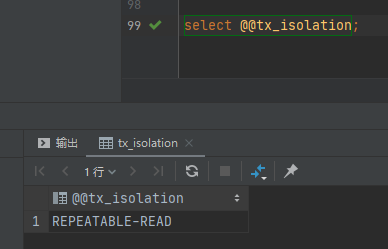

###### 2.修改当前数据库的事务级别

==设置数据库的隔离级别一定要在开启事务之前。==

第一种方式：

```sql
set transaction isolation level 目标级别;
```

第二种方式：

```sql
set tx_isolation = '目标级别';
```

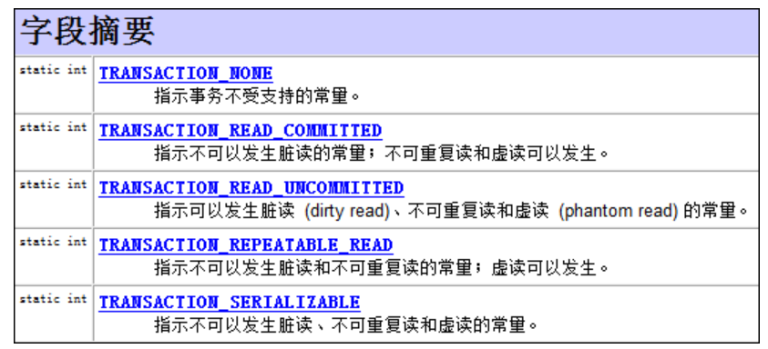

#### 1.5事务的传播级别

PROPAGATION：propagation：传播

##### 1.5.1什么是事务的传播？

​	基于事务的四大原则中，我们了解到，事务一旦不在一起执行，会因为隔离造成一些问题，同样事务要么一次性全部执行，要么执行失败，恢复至执行前的状态。这就给了一个思路，即在处理修改数据库的操作中，要保证全部都在一个事务中，同样事务不成功便成仁，因此，需要以此来引进事务的传播特性来保证事务的四原则。

​	同样，mysql编程以及java编程及后续引进Spring框架，对事务的使用都是基于事务的四原则及隔离级别以及传播级别来展开讨论。

参考连接：以下链接从mysql及spring关于事务的传播展开，同样包括@Transactional注解的讲解及使用场景。

| https://blog.csdn.net/lianjian6534/article/details/112434905 |
| ------------------------------------------------------------ |
| https://blog.csdn.net/jiangyu1013/article/details/84397366   |
| https://blog.csdn.net/javaxuexilu/article/details/100738686  |
| https://www.cnblogs.com/boboooo/p/11969968.htmls             |
| https://blog.csdn.net/weixin_31860143/article/details/113611608 |

##### 1.5.2事务的传播级别

| 类型                      | 说明                                                         |
| ------------------------- | ------------------------------------------------------------ |
| PROPAGATION_REQUIRED      | 如果当前没有事务，就新建一个事务，如果已经存在一个事务中，就加入到这个事务。这是最常见的选择。 |
| PROPAGATION_SUPPORTS      | 支持当前事务，如果当前没有事务，就以非事务方式执行。         |
| propagation_MANDATORY     | 使用当前的事务，如果当前没有事务，就抛出异常。               |
| propagation_requires_new  | 新建事务，如果当前存在事务，就把当前事务挂起。               |
| propagation_not_supported | 已非事务的方式执行操作，如果当前存在事务，就把当前事务挂起。 |
| propagation_never         | 以非事务方式执行，如果当前存在事务，则抛出异常。             |
| propagation_nested        | 如果当前存在事务，则在嵌套事务内执行，如果当前没有事务，则执行propagation_required类似的操作。 |

注：MySQL默认的是PROpagation_required

##### 1.5.3事务的传播状态流转

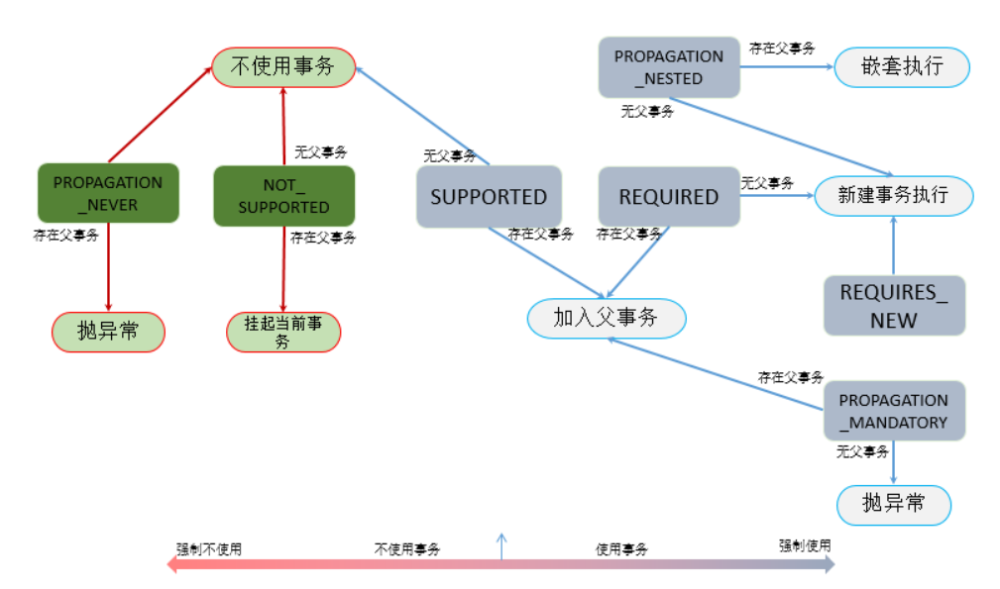

#### 1.6事务与Spring

1. Spring中的事务隔离级别、传播级别同数据库对事务的隔离级别和传播级别本质是都是一样的。

2. Spring支持编程式事务管理以及声明式事务管理两种方式

   1. 编程式事务管理
      - 编程式事务管理是侵入式事务管理，使用TransactionTemplate或者直接使用PlatformTransactionManager，对于编程式事务管理，Spring推荐使用TransactionTemplate。
   2. 声明式事务管理
      - 声明式事务管理是建立在AOP之上，本质方法是对方法前后进行拦截，然后在目标方法开始前创建或者加入一个事务，执行完目标方法根据执行情况提交或者回滚

   总结Spring的编程式事务管理以及声明式事务管理

   1. 编程式事务每次实现都要单独实现，业务量大功能复杂的时候，使用编程式事务无疑是痛苦的，声明式属于无侵入式的，不会影响业务逻辑的实现，只要再配置文件中做相关的事务规则声明或者通过注解的方式，便将事务规则应用到业务逻辑中。
   2. 声明式事务管理的粒度是方法级别的，而编程式事务管理是可以到代码块的，可以通过提取方法的方式完成声明式事务管理的配置。

#### 1.7什么时候使用事务？

参考连接：

[(3条消息) 什么时候使用mysql事务_幻羽公子的博客-CSDN博客_mysql什么时候使用事务](https://blog.csdn.net/lmy_1/article/details/54381565)

​	使用事务务必会浪费性能，这就是程序中常见的一些矛盾点，小数据量的读取看似消耗时间少，以及操作者丝毫感觉不到消耗时间，但当数据很多，时间成本瞬间提升，因此需要考虑好什么时候需要务必使用那些消耗性能的操作。

1. 银行金融行业，凡是涉及到金钱的，使用事务
2. 根据设计规约，如数据库的三大范式，确保数据的一致性，原子性
3. 具体业务具体展开

#### 1.8MySQL事务代码basic

```sql
-- 使用set语句来改变自动提交模式
SET autocommit = 0;   /*关闭*/
SET autocommit = 1;   /*开启*/

-- 注意:
--- 1.MySQL中默认是自动提交
--- 2.使用事务时应先关闭自动提交

-- 开始一个事务,标记事务的起始点
START TRANSACTION  

-- 提交一个事务给数据库
COMMIT

-- 将事务回滚,数据回到本次事务的初始状态
ROLLBACK

-- 还原MySQL数据库的自动提交
SET autocommit =1;

-- 保存点
SAVEPOINT 保存点名称 -- 设置一个事务保存点
ROLLBACK TO SAVEPOINT 保存点名称 -- 回滚到保存点
RELEASE SAVEPOINT 保存点名称 -- 删除保存点
```

#### 1.9java与事务/数据库隔离级别

##### 1.9.1JDBC与事务提交/回滚

使用java代码操作数据库，与数据库建立连接，可将数据库代码的事务实现转为java代码实现，同样可以完成开启事务，提交事务，回滚事务。

##### 1.9.2JDBC与隔离级别

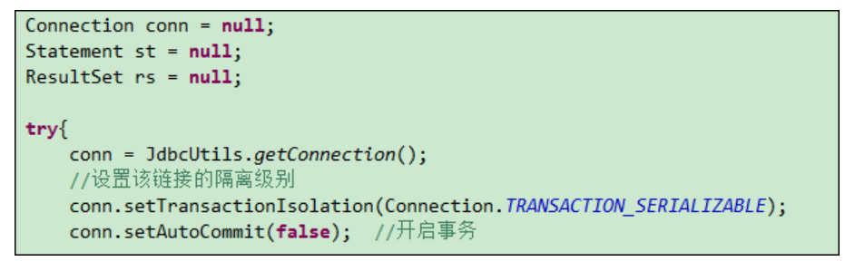

注：隔离级别的设置只对当前连接有效

- 对于使用MySQL命令窗口来说，一个窗口就相当于一个链接，当前窗口设置的隔离级别仅对当前窗口的事务有效。

- 对于JDBC操作数据库来说，一个Connection对象相当于一个链接，而当前Connection对象设置的隔离级别仅对当前Connection对象有效，与其他链接的Connection对象无关。

### 2.索引

#### 2.1什么是索引

索引在MySQL中是一种特殊的键，是存储引擎用于快速查找记录的一种数据结构。

下文关于索引展开叙述，索引可以理解为字典的目录。

#### 2.2索引的优缺点

##### 2.2.1优点

2. 确保数据的唯一性（主键索引，唯一索引）
3. 可以加速表和表之间的链接，实现表与表之间的参照完整性
4. 使用分组和排序子句，进行数据检索时，可以显著减少分组和排序的时间
5. 全文检索字段进行搜索优化
6. 索引对InnoDB（对索引支持行级锁）非常重要
7. 索引可以将随机IO变成顺序IO

##### 2.2.2缺点

1. 索引虽然大大提高了查询速度，同时也降低了更新变的速度，如对表进行insert、update、delete。更新表的时候不仅需要更新保存数据，还需要保存索引文件。
2. 建立索引会占用磁盘的索引文件。
3. 如果某个数据列包含很多重复的内容，为其创建索引就没有太大的实际效果。

#### 2.3索引的存储与检索原理

此处只考虑Mysql引擎为InnoDB。

InnoDB使用的是B+Tree；

##### 2.3.1B+Tree

B+Tree：每个叶子节点下都包含一个指向下一叶子结点的指针，从而方便叶子节点的范围便利。

##### 2.3.2什么是B-Tree？

B-Tree：B=Balance 平衡

B-tree是一种多路自平衡的搜索树。

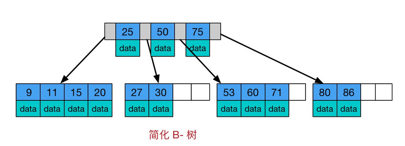

B-Tree有以下的特点：

1. 所有的键值分布在整个棵树中，即索引值和具体的data都在每个节点里。
2. 任何一个关键字出现且只出现在一个节点中。
3. 搜索有可能在非叶子结点结束
4. 在关键字全集中做一次查找，性能逼近二分查找。

深入B-Tree：b-tree是专门为外部存储器设计的，如磁盘，它对读取和写入大块数据有良好的性能，所以一般被用在文件系统和数据库中。

一般来说，对内存的访问约为50ns，而磁盘却在10ms左右，速度差了接近5个数量级，磁盘的读取时间远远炒到了数据在内存中比较的时间，这说明程序大部分的时间会被阻塞在磁盘IO上，因此作为整个程序的一环，对于数据库的处理，也需要尽可能地减少对磁盘IO的访问。

**空间局部性原理：如果一个存储器的某个位置被访问，那么将它附近的位置也会被访问。**

索引的执行效率依赖磁盘IO的次数，快速索引需要有效地减少磁盘IO的次数。索引的原理其实就是不断地缩小查找范围，平衡二叉树是每次将范围分割为两个区间，为了更快，b-tree每次将范围分割为多个区间，区间越多，定位数据越快越准确。

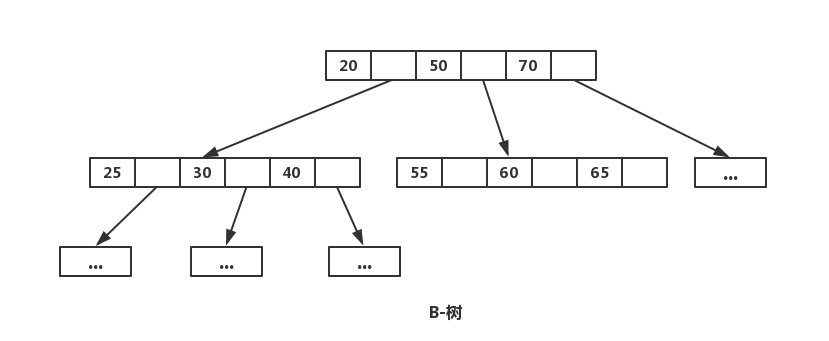

##### 2.3.3mysql与B+Tree

注：参考连接

```sql
深入理解mysql索引机制：https://www.cnblogs.com/tanglinsheng/p/10795321.html
mysql索引的原理与应用：索引类型、存储结构与锁（高阶文章）：https://segmentfault.com/a/1190000019366328?utm_source=tag-newest
深入理解mysql索引底层的数据结构：https://www.cnblogs.com/zealoter/articles/12745414.html
一文彻底搞懂Mysql基础：B树和B+Tree的区别：https://blog.csdn.net/a519640026/article/details/106940115/
面试官问你B树和B+树：https://my.oschina.net/u/4116286/blog/3107389
```

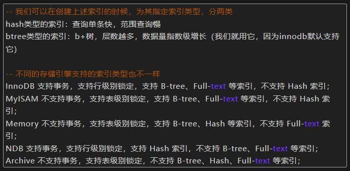

#### 2.4索引设计准则

1. 搜索的索引列不一定是所要选择的列。
2. 使用唯一索引。
3. 使用短索引，如果是对字符串进行索引，尽可能指定前缀长度
4. 利用最左索引。
5. 不要过度索引。
6. 设计库表的时候主键尽可能选择较短的数据类型

#### 2.5InnoDB聚簇索引/非聚簇索引

##### 2.5.1InnoDB聚簇索引

聚簇索引就是对磁盘上的实际数据重新组织已按照特定的一个或者多个列的值排序的算法。

特点是，存储数据的顺序和索引顺序一致。

一般情况下主键会默认生成，当表中没有主键的情况下，第一个not null Unique列表示聚簇索引，否则，InnoDB会创建一个隐藏的row-id作为聚簇索引。

##### 2.5.2InnoDB非聚簇索引

所有不是聚簇索引的索引都叫非聚簇索引或者辅助索引。

在InnoDB存储引擎中，每个辅助索引的每条记录都包含逐渐，也包含非聚簇索引指定的列。

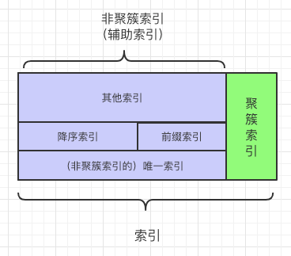

#### 2.6索引分类

##### 2.6.1主键索引（primary key）

主键索引：某一列属性能唯一标识的一条记录

特点：

1. 最常见的索引类型
2. 确保数据记录的唯一性
3. 确定特定数据记录在数据库中的位置

##### 2.6.2唯一索引（Unique）

唯一索引：避免同一列的值的重复，允许空值

唯一索引与主键索引的区别：

1. 一个表只能有一个主键索引，但是可以有多个唯一索引
2. 主键索引一定是唯一索引，唯一索引则不是主键索引
3. 主键索引可以与外键构成完整性约束，唯一索引不可以
4. 唯一索引允许有控制，但是主键列是不允许的
5. 主键更适合那些不同意更改的唯一标识，如自动递增列，身份证号等。

同样可以衍生出一个混淆视听的问题：主键和唯一索引的区别？

1. 首先主键是一种约束，唯一索引是一种索引，两者的本质是是不同
2. 主键其实是依靠主键索引完成约束，主键索引和唯一索引有上述的几种区别
3. 主键是每张表的必备约束，用于表面一张表中有相同的数据，但是唯一索引可以不创建
4. 主键和唯一索引都可以是多列。这里需要区分的是，主键多列是指的多个列构成主键，唯一索引的多列是说一张表中可以创建多个唯一索引且不冲突，需要注意的是索引越多对表的更新压力越大。

注：唯一索引参考连接：[Mysql的唯一性索引unique - hongdada - 博客园 (cnblogs.com)](https://www.cnblogs.com/hongdada/p/9970176.html#唯一性索引作用)

##### 2.6.3常规索引（index）

常规索引：快速定位特定数据

注意：

- index和key关键字都可以设置常规索引
- 应加在查询条件的字段
- 不宜添加太多的常规索引，影响数据的插入、删除和修改操作。

##### 2.6.4全文索引（Full Text）

全文索引：快速定位特定数据

注意：

- 只能用于MyIsam类型的数据表
- 只能用于CHAR，VARCHAR，TEXT数据类型
- 适用于大数据集

#### 2.7索引创建

##### 2.7.1创建索引

创建索引的三种方式

1.create

```sql
create index index_name on table_name(column_name);
# index为普通索引，这里根据需要选择自己合适的索引
```

2.修改表结构（添加索引）

```sql
alter table table_name add index index_name(column_name);
```

3.创建表的时候直接指定

```sql
create table if not exists table_name(
	id int not null,
  name varchar(250) null,
  index [index_name] (name(length))
)engine = InnoDB char set utf8 comment '';
```

##### 2.7.2删除索引

```sql
drop index [index_name] on table_name;
```

##### 2.7.3显示索引信息

```sql
show index from table_name;
```

#### 2.8索引覆盖/mysql回表

##### 2.8.1索引覆盖

索引覆盖：select的数据列只用从索引中就能够取得，不必从数据表中读取，换句话说查询列要被所使用的索引覆盖。

##### 2.8.2mysql回表查询

先定位主键值，再定位行记录，回表查询的性能较扫描件一遍索引树更低，因为扫描了两边。

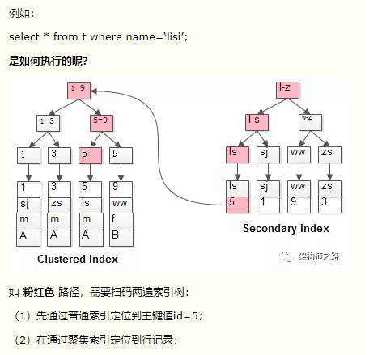

##### 2.8.3利用索引覆盖优化SQL

#### 2.9联合索引

##### 2.9.1什么是联合索引？

两个或者更多个列上的索引，被称为联合索引，联合索引又被称为复合索引。

对于联合索引：MySQL从左往右地使用索引中的字段，一个查询可以只使用索引的一部分，但只能是最左侧部分，遵循最左原则。

例如索引是key index（a，b，c），可以支持a|a，b|a，b，c三种组合进行查找，但是不能支持b，c查找。

##### 2.9.2联合索引的命名规则

1. 需要加索引的字段，要在where条件中
2. 数据量少的字段不需要+索引
3. 当范围查询遇到<,>，between，like就会停止匹配
4. 适用于最左原则

##### 2.9.3什么是最左原则？

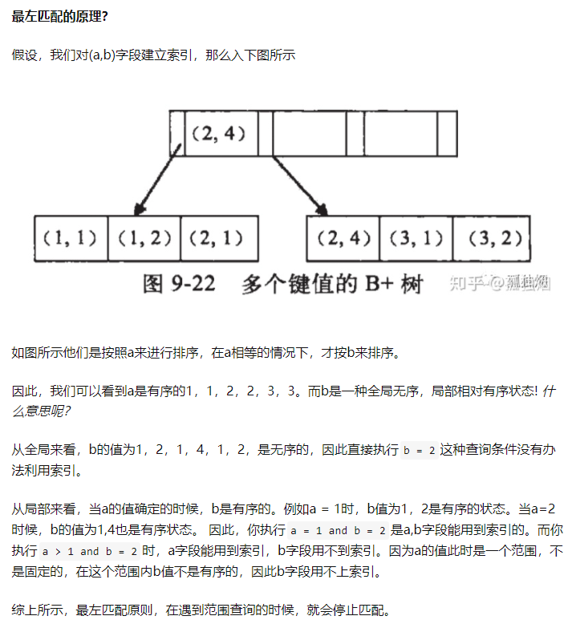

#### 2.10索引失效

##### 2.10.1索引失效的主要情况

1. 伴随着表的增长。where条件出来的数据太多，大于15%，使得索引失效，会导致CBO（一种SQL优化器）计算走索引的时间大于走全表
2. 统计信息失效，需要重新搜索统计信息
3. 索引本身失效，需要重新建立索引

##### 2.10.2索引失效的具体情况

1. 单独引用复合索引里非第一位置的索引列
2. 对索引列运算
3. 对索引应用内部函数，这种情况下应该建立基于函数的索引
4. 类型错误，如果目标字段为varchar，where条件使用的是数字类型
5. mysql预计使用全表扫描比使用索引快，则不适用索引
6. like的模糊查询以%开头，索引失效
7. 索引列没有限制not null

#### 2.11索引优化

##### 2.11.1Explain优化查询检测

explain后跟上需要执行的sql

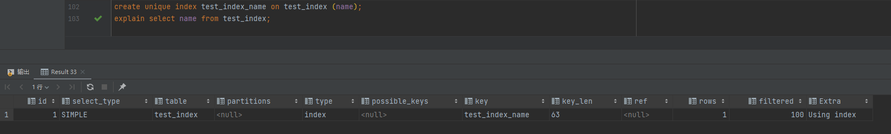

##### 2.11.2索引优化策略

1. 避免出现回表查询，多使用覆盖查询
2. 索引列上不能使用表达式或者函数
3. 前缀索引和索引列的选择性
4. 使用联合索引
5. 使用索引扫描来优化排序
6. 使用索引优化锁

##### 2.11.3索引的优化和维护

1. 删除重复和冗余的索引

2. 查找未被使用的索引

3. 更新索引的统计信息及减少索引碎片

   ```sql
   # 对索引
   	analyze table table_name;
   	
   # 对表 使用不当会导致锁表
   	optimize table table_name;
   ```

4. pt-duplicate-key-checker

   1. pt-duplicate-key-checker工具可以帮助检查表中重复的索引或者主键

#### 2.12索引与左右全模糊查询（遇见过）

mysql索引失效的一种原因就是like查询以%开头，也就是左模糊，同样全模糊也会导致索引失效

此处探究like关键字的使用对索引的影响。

左模糊与全模糊查询过程中不会触发索引，优化的思路之一就是让其去触发索引。

可能提高模糊查询效率的几种方式：暂未试验

1. 合理的情况下使用右模糊去代替其他模糊
2. 函数
   1. Locate（）
   2. position（）
   3. instr（）
3. 改用联合索引

### 3.用户权限管理

root是拥有最高权限的用户

基本命令：

```sql
/* 用户和权限管理 */ ------------------
用户信息表：mysql.user

-- 刷新权限
FLUSH PRIVILEGES

-- 增加用户 CREATE USER kuangshen IDENTIFIED BY '123456'
CREATE USER 用户名 IDENTIFIED BY [PASSWORD] 密码(字符串)
  - 必须拥有mysql数据库的全局CREATE USER权限，或拥有INSERT权限。
  - 只能创建用户，不能赋予权限。
  - 用户名，注意引号：如 'user_name'@'192.168.1.1'
  - 密码也需引号，纯数字密码也要加引号
  - 要在纯文本中指定密码，需忽略PASSWORD关键词。要把密码指定为由PASSWORD()函数返回的混编值，需包含关键字PASSWORD

-- 重命名用户 RENAME USER kuangshen TO kuangshen2
RENAME USER old_user TO new_user

-- 设置密码
SET PASSWORD = PASSWORD('密码')    -- 为当前用户设置密码
SET PASSWORD FOR 用户名 = PASSWORD('密码')    -- 为指定用户设置密码

-- 删除用户 DROP USER kuangshen2
DROP USER 用户名

-- 分配权限/添加用户
GRANT 权限列表 ON 表名 TO 用户名 [IDENTIFIED BY [PASSWORD] 'password']
  - all privileges 表示所有权限
  - *.* 表示所有库的所有表
  - 库名.表名 表示某库下面的某表

-- 查看权限   SHOW GRANTS FOR root@localhost;
SHOW GRANTS FOR 用户名
   -- 查看当前用户权限
  SHOW GRANTS; 或 SHOW GRANTS FOR CURRENT_USER; 或 SHOW GRANTS FOR CURRENT_USER();

-- 撤消权限
REVOKE 权限列表 ON 表名 FROM 用户名
REVOKE ALL PRIVILEGES, GRANT OPTION FROM 用户名    -- 撤销所有权限
```

```sql
-- 权限列表
ALL [PRIVILEGES]    -- 设置除GRANT OPTION之外的所有简单权限
ALTER    -- 允许使用ALTER TABLE
ALTER ROUTINE    -- 更改或取消已存储的子程序
CREATE    -- 允许使用CREATE TABLE
CREATE ROUTINE    -- 创建已存储的子程序
CREATE TEMPORARY TABLES        -- 允许使用CREATE TEMPORARY TABLE
CREATE USER        -- 允许使用CREATE USER, DROP USER, RENAME USER和REVOKE ALL PRIVILEGES。
CREATE VIEW        -- 允许使用CREATE VIEW
DELETE    -- 允许使用DELETE
DROP    -- 允许使用DROP TABLE
EXECUTE        -- 允许用户运行已存储的子程序
FILE    -- 允许使用SELECT...INTO OUTFILE和LOAD DATA INFILE
INDEX     -- 允许使用CREATE INDEX和DROP INDEX
INSERT    -- 允许使用INSERT
LOCK TABLES        -- 允许对您拥有SELECT权限的表使用LOCK TABLES
PROCESS     -- 允许使用SHOW FULL PROCESSLIST
REFERENCES    -- 未被实施
RELOAD    -- 允许使用FLUSH
REPLICATION CLIENT    -- 允许用户询问从属服务器或主服务器的地址
REPLICATION SLAVE    -- 用于复制型从属服务器（从主服务器中读取二进制日志事件）
SELECT    -- 允许使用SELECT
SHOW DATABASES    -- 显示所有数据库
SHOW VIEW    -- 允许使用SHOW CREATE VIEW
SHUTDOWN    -- 允许使用mysqladmin shutdown
SUPER    -- 允许使用CHANGE MASTER, KILL, PURGE MASTER LOGS和SET GLOBAL语句，mysqladmin debug命令；允许您连接（一次），即使已达到max_connections。
UPDATE    -- 允许使用UPDATE
USAGE    -- “无权限”的同义词
GRANT OPTION    -- 允许授予权限


/* 表维护 */

-- 分析和存储表的关键字分布
ANALYZE [LOCAL | NO_WRITE_TO_BINLOG] TABLE 表名 ...
-- 检查一个或多个表是否有错误
CHECK TABLE tbl_name [, tbl_name] ... [option] ...
option = {QUICK | FAST | MEDIUM | EXTENDED | CHANGED}
-- 整理数据文件的碎片
OPTIMIZE [LOCAL | NO_WRITE_TO_BINLOG] TABLE tbl_name [, tbl_name] ...
```

### 4.MySQL备份(导出)与导入

#### 4.1数据库备份

##### 4.1.1备份的必要性

1. 保证重要数据不丢失 
2. 数据转移

##### 4.1.2数据库备份方法

1. mysqlDump工具
2. 数据库管理工具
3. 直接拷贝数据库文件

mysqlDump工具：

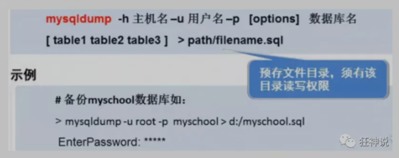

```sql
-- 导出
1. 导出一张表 -- mysqldump -uroot -p123456 school student >D:/a.sql
　　mysqldump -u用户名 -p密码 库名 表名 > 文件名(D:/a.sql)
2. 导出多张表 -- mysqldump -uroot -p123456 school student result >D:/a.sql
　　mysqldump -u用户名 -p密码 库名 表1 表2 表3 > 文件名(D:/a.sql)
3. 导出所有表 -- mysqldump -uroot -p123456 school >D:/a.sql
　　mysqldump -u用户名 -p密码 库名 > 文件名(D:/a.sql)
4. 导出一个库 -- mysqldump -uroot -p123456 -B school >D:/a.sql
　　mysqldump -u用户名 -p密码 -B 库名 > 文件名(D:/a.sql)

可以-w携带备份条件

```

#### 4.2导入

```sql
-- 导入
1. 在登录mysql的情况下：-- source D:/a.sql
　　source 备份文件
2. 在不登录的情况下
　　mysql -u用户名 -p密码 库名 < 备份文件
```

### 5.数据库三大范式

#### 5.1为什么要规范化设计数据库？

糟糕的数据库设计：

	1. 数据冗余，存储空间浪费
	2. 数据更新和插入的异常
	3. 程序性能差

良好的数据库设计：

	1. 节省数据的存储空间
	2. 能够保证数据的完整性
	3. 方便进行数据库应用系统的开发

#### 5.2三大范式（重点）

> 三大范式

##### 5.2.1第一范式

==**原子性**==

第一范式的目的是保证每一列的原子性，符合目标：每一列都是不可以继续分割的最小数据单元。

##### 5.2.2第二范式

第二范式是在满足第一范式的基础上，保证表的唯一性：一个表只能说明一个事物。

##### 5.2.3第三范式

第三范式是满足第二范式的基础上，保证每一列都和主键有直接联系，而不是传递依赖。

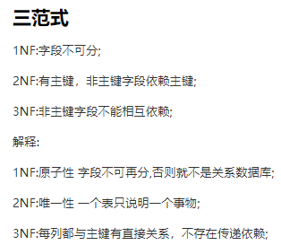

#### 5.3范式与性能的关系（从实践出发）

为满足某种商业目标 , 数据库性能比规范化数据库更重要

在数据规范化的同时 , 要综合考虑数据库的性能

通过在给定的表中添加额外的字段,以大量减少需要从中搜索信息所需的时间

通过在给定的表中插入计算列,以方便查询

### 6.数据库驱动

程序要通过数据库驱动去和数据库打交道

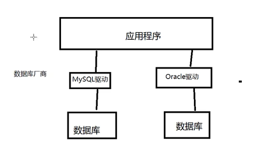

### 7.JDBC

SUN公司为了简化开发人员对数据库的操作，提供了一个java版的操作数据库的规范。因此对于开发人员，我们只需要掌握JDBC接口的操作即可。

换句话说，没有什么是加一层解决不了的。

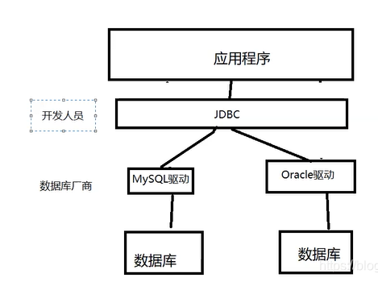

JDBC属于是直接使用java提供的操作数据库的类去操作数据库，代码上有很多的重复性，例如建立连接和释放资源，因此可以将重复的部分提出来做一个工具类。

#### 7.1JDBC编码的整体思路

1. 加载驱动
2. 用户信息
3. 连接目标数据库
4. 执行SQL
5. 获得结果集
6. 释放资源

示例代码：

```java
public static void main(String[] args) throws ClassNotFoundException, SQLException {
		//1.加载驱动
		Class.forName("com.mysql.jdbc.Driver");
		
		//2.用户信息
		//useUnicode = true 支持中文编码
		//characterEncoding = utf8 设定字符集
		//useSSL = true 安全连接
		String url = "jdbc:mysql://localhost:3306/jdbcStudy?useUnicode = true & characterEncoding = utf8 && useSSL = true";
		String user = "root";
		String password = "lcp5211314..";
		
		//3.连接成功，数据库对象 Connection 代表数据库
		Connection connection = DriverManager.getConnection(url, user, password);
		
		//4.执行SQL的对象
		Statement statement = connection.createStatement();
		
		//5.执行SQL的对象，去执行SQL，可能存在结果，查看返回结果
		String sql = "SELECT * FROM users";
		
		ResultSet resultSet = statement.executeQuery(sql); //返回的结果集
		
		while(resultSet.next()) {
			System.out.println("id = " + resultSet.getObject("id"));
			System.out.println("name = " + resultSet.getObject("NAME"));
			System.out.println("password = " + resultSet.getObject("PASSWORD"));
			System.out.println("email = " + resultSet.getObject("email"));
			System.out.println("birthday = " + resultSet.getObject("birthday"));
		}
		
		//6.释放连接
		resultSet.close();
		statement.close();
		connection.close();
	}
```

注：这里使用的事Statement对象

#### 7.2JDBC操作事务

使用JDBC操作事务同样需要遵守事务的四原则。

JDBC操作事务的步骤：

1. 开启事务
2. 一组业务执行完毕，关闭事务
3. 可以在catch语句中显示地定义回滚（默认是失败就会发生回滚）

### 8.Statement对象详解

JDBC中的Statement对象用于向数据库发送需要执行的SQL语句，想要完成对数据库的增删改查，只需要这个对象对数据库发送增删改查语句即可。

statement对象的executeUpdate方法用于发送增删改语句，且会返回一个整数。

statement对象的executeQuery方法用于发送查询语句，返回代表查询结果的ResultSet对象。

### 9.SQL注入问题

SQL本身存在漏洞：sql注入攻击是利用是指利用设计上的漏洞，在目标服务器上运行Sql语句以及进行其他方式的攻击，动态生成Sql语句时没有对用户输入的数据进行验证是Sql注入攻击得逞的主要原因。

如果验证用户是否存在的SQL语句为：

以下代码仅展示是什么，不在意代码的规范性

```sql
select * from users where `NAME`='name'  AND `PASSWORD`=' password '
```

如果name = ' or 1=1'  ,password = 123456

上属语句就变成了

```sql
select * from users where `NAME`='' or '1=1'  AND `PASSWORD`=' 123456 '
```

将绕过验证，同样这种方法仅对Statement有效，对preparedstatement对象无效。

这里还会引申出MySQL的面试问题：#{}和${}的区别：

总结答案：

#{}是预编译处理，${}是字符串替换。

mybatis在处理#{}时，会把sql中的#{}替换成？号，调用Preparedment的set方法赋值，而处理${}时只是替换成变量的值。

因为直接替换变量的值，所以有心者可以利用这个漏洞完成SQL注入，对程序进行破坏。而预编译的#{}则不会发生这样的问题，因此提高了系统的安全性。

### 10.PreparedStatement对象

学习PreparedStatement不得不提它和Statement的区别

#### 10.1PreparedStatement对象和Statement对象的区别

1. 连接数据库的步骤区别

   ```java
   Statement:
   String sql="insert into student(stuo,stuname) values('"name"',"age"+")";
   Statement.excuteupadte(sql);
   PrepareStatement:
   String sql="insert into student(stuo,stuname) values(?,?)";
   PrepareStatement=connection.PrepareStatement(sql); //预编译SQL
   PrepareStatement.setString(1,name);
   PrepareStatement.setInt(2,age);
   ```

2. PreparedStatement可有效提高性能

   当处理批量处理SQL语句时，PreparedStatement采用Cache机智，则预编译的语句就会放在cache中，下次执行相同的SQL语句，则直接从cache中取出来。

3. PreparedStatement可以防止SQL注入

### 11.DBCP/C3P0/Druid连接池

#### 11.1数据库连接池

参考链接：[(3条消息) 谈谈数据库连接池的原理_敦格-CSDN博客_数据库连接池原理](https://blog.csdn.net/shuaihj/article/details/14223015/)

早期使用JDBC连接数据库的时候，通常的做法就是连接-执行完毕-释放资源，因为连接-释放是很消耗资源的，因此采用池化技术，准备一些预先的资源，有请求过来直接连接即可。

通常各种的数据库连接池都会有例如常用连接数，最少连接数，等待超时等参数。

- 用池来管理 Connection，使得可以重复使用 Connection
- **有了池，我们不用自己创建 Connection，通过数据库连接池来获取 Connection.**
- **当 Connection 用完后，调用 close() 方法也不会真的关闭 Connection，而是把 Connection “归还”给池，池可以再利用这个 Connection**
- 如果不使用连接池，每次与数据库会话都要产生一个 Connection，极大的消耗资源


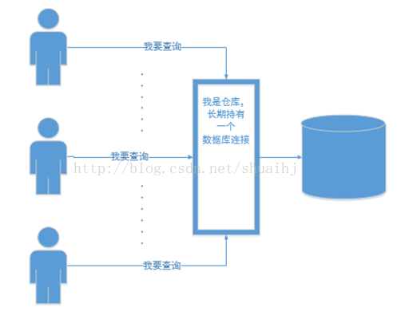

以下介绍三种数据库连接池的使用：整体思路为：导入jar包，创建配置文件，书写业务类。

#### 11.2DBCP

注：参考链接：[(3条消息) DBCP的使用_dougan_的博客-CSDN博客_dbcp](https://blog.csdn.net/dougan_/article/details/82593720)

```
DBCP 是 apache 实现的一个连接池，也是 Spring 官方推荐的
```

1. properties类

   

   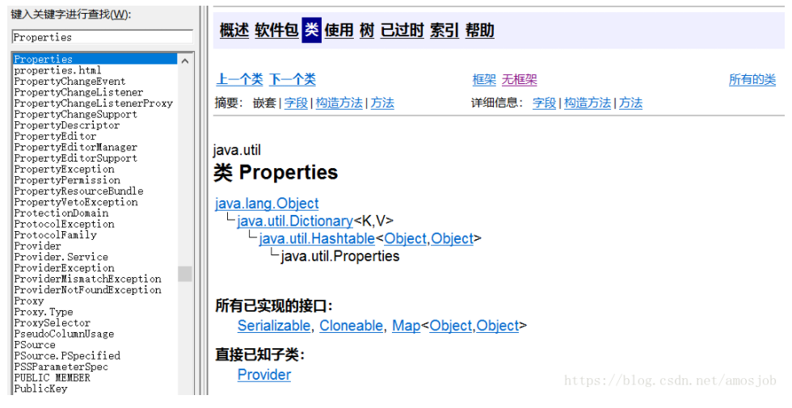

   常用的方法：

   ```java
   getProperty(String key)   在此属性列表中搜索具有指定键的属性。如果在此属性列表中找不到该键，则会检查默认属性列表及其默认值（递归）。如果未找到该属性，则该方法返回默认值参数。
   
   list(PrintStream out)  将此属性列表打印到指定的输出流。此方法对于调试很有用。
   
   load(InputStream inStream)  从输入字节流中读取属性列表（键和元素对）。输入流采用加载（Reader）中指定的简单的面向行的格式，并假定使用ISO 8859-1字符编码;即每个字节是一个Latin1字符。不在Latin1中的字符和某些特殊字符在使用Unicode转义符的键和元素中表示。 此方法返回后，指定的流仍保持打开状态。
   
   setProperty(String key, String value) 调用 Hashtable 的方法 put 。他通过调用基类的put方法来设置 键值对。
   
   store(OutputStream out, String comments) 将此Properties表中的此属性列表（键和元素对）以适合使用load（InputStream）方法加载到Properties表的格式写入输出流。 此Properties方法不会写出此Properties表的defaults表中的属性（如果有）。
   
   storeToXML(OutputStream os, String comment, String encoding) 使用指定的编码发出表示此表中包含的所有属性的XML文档。
   
   clear()  清除此哈希表，使其不包含任何键。
   
   stringPropertyNames()  返回此属性列表中的一组键，其中键及其对应的值是字符串，如果尚未从主属性列表中找到相同名称的键，则包括默认属性列表中的不同键。键或键不是String类型的属性将被省略。
   ```

#### 11.3C3P0

```
C3P0 是 hibernate 官方推荐的
```

#### 11.4Druid

Druid的具体使用会在SpringBoot中讨论。

### 12.视图

#### 12.1什么是视图

视图是一个虚拟表，是SQL的查询结果，其内容由查询定义。数据库中只放了视图的定义，并没有存放视图的数据，数据依旧存在之前的表中，只是在使用视图的时候取出相应的数据。

视图和真实的表一样，包含列和行。

视图在允许条件下的数据改变会影响基表。

操作视图也需要有一定的权限。

#### 12.2视图的作用

1. 权限控制时可以使用
2. 简化复杂的查询：使用视图的用户完全不需要关心后面对应的表的结构、关联条件和筛选条件，对用户来说是一个结果集。

总结：使用视图的大部分情况是为了保障数据安全性、提高查询效率。

#### 12.3视图的创建

##### 12.3.1如何创建视图

```sql
CREATE [OR REPLACE] [ALGORITHM={UNDEFINED|MERGE|TEMPTABLE}]
VIEW 视图名[(属性清单)]
AS SELECT语句
[WITH [CASCADED|LOCAL] CHECK OPTION];
```

```sql
create view view_name
as
SELECT语句
```

参数说明：

（1）ALGORITHM：可选项，表示视图选择的算法。

（2）视图名：表示要创建的视图名称。

（3）属性清单：可选项，指定视图中各个属性的名词，默认情况下与SELECT语句中的查询的属性相同。

（4）SELECT语句：表示一个完整的查询语句，将查询记录导入视图中。

（5）WITH CHECK OPTION：可选项，表示更新视图时要保证在该视图的权限范围之内。

例子：

```sql
CREATE OR REPLACE VIEW view_user
AS
	SELECT id,name FROM tb_user;
```


```sql
CREATE OR REPLACE VIEW view_user (a_id,a_name)
AS
	SELECT id,name FROM tb_user;
```

##### 12.3.2创建视图的注意点

（1）运行创建视图的语句需要用户具有创建视图（create view）的权限，若加了[or replace]时，还需要用户具有删除视图（drop view）的权限；

（2）select语句不能包含from子句中的子查询；

（3）select语句不能引用系统或用户变量；

（4）select语句不能引用预处理语句参数；

（5）在存储子程序内，定义不能引用子程序参数或局部变量；

（6）在定义中引用的表或视图必须存在。但是，创建了视图后，能够舍弃定义引用的表或视图。要想检查视图定义是否存在这类问题，可使用check table语句；

（7）在定义中不能引用temporary表，不能创建temporary视图；

（8）在视图定义中命名的表必须已存在；

（9）不能将触发程序与视图关联在一起；

（10）在视图定义中允许使用order by，但是，如果从特定视图进行了选择，而该视图使用了具有自己order by的语句，它将被忽略。

#### 12.4视图的查看

##### 12.4.1查看创建视图的语句

```sql
show create view view_name;
```

例子：

```sql
CREATE ALGORITHM = UNDEFINED DEFINER =`root`@`localhost` SQL SECURITY DEFINER VIEW `view_test_index` AS
select `test_index`.`id` AS `id`, `test_index`.`name` AS `name`
from `test_index`;
```

##### 12.4.2查看视图

```sql
select * from view_name;
```

#### 12.5视图的更改

12.5.1Create or replace view 语句修改视图

```sql
create or replace view view_name 
as
SELECT语句;
```

在视图存在的时候是对视图的修改；

视图不存在的时候是对视图的创建。

12.5.2Alter语句修改视图

```sql
ALter view view_name
as
new_SELECT语句;
```

12.5.3DML操作更新视图

因为视图本身没有数据，因此对视图的DML操作最终都体现在基表中。

例子：

```sql
create view view_testUpdate
as
select * from students;
```

```sql
update view_testUpdate
set
name = 'target' where id = '1';
```

有以下情形，视图不能进行DML操作：

①select子句中包含distinct

②select子句中包含组函数

③select语句中包含group by子句

④select语句中包含order by子句

⑤select语句中包含union 、union all等集合运算符

⑥where子句中包含相关子查询

⑦from子句中包含多个表

⑧如果视图中有计算列，则不能更新

⑨如果基表中有某个具有非空约束的列未出现在视图定义中，则不能做insert操作

#### 12.6删除视图

```sql
drop view if exists view_name;
```

#### 12.7mybatis与视图

由于视图可以被看作为虚拟表，对于基本的查询操作，可以使用mybatis完成OR映射，调用视图查询。

#### 12.8嵌套视图

嵌套视图：定义在另一个视图上的视图

### 13.临时表

#### 13.1什么是临时表

临时表仅在当前连接中可见，当关闭连接时，MySQL会自动删除并释放空间。

#### 13.2临时表的分类

##### 13.2.1外部临时表

###### 13.2.1.1创建外部临时表

语句：

```sql
create temporary table temporary_table_name(
	正常的建表的属性的命名方式
);
```

**使用show tables命令显示数据表时，是无法看到临时表的。**

###### 13.2.1.2查看外部临时表

```sql
#查看临时表
select * from temporary_table_name;
```

###### 13.2.1.3删除外部临时表

```sql
#删除临时表：使用drop删除或者等断开数据库连接时，数据库将自动删除临时表
drop table temporary_table_name;
```

##### 13.2.2内部临时表

注：内部临时表参考：[MySQL中的两种临时表 - duanxz - 博客园 (cnblogs.com)](https://www.cnblogs.com/duanxz/p/3724120.html)

### 14.存储过程

#### 14.1什么是存储过程

​	MySQl自5.0版本开始支持存储过程。

​	存储过程是一组完成特定功能的SQL语句集合。

​	使用存储过程的目的是将常用或者复杂的工作预先用SQL语句写好并用一个特定的名称存储起来，这个过程经编译和优化之后存储在数据库服务器中，这个过程称为存储过程。

#### 14.2存储过程的优缺点

##### 14.2.1优点

- 存储过程可封装并隐藏复杂的商业逻辑
- 存储过程可以回传值，并可以接受参数
- 存储过程无法使用SELECT指令来运行，因为存储过程是子程序，与查表，查数据库或者用户定义函数不同
- 存储过程可用于数据校验，强制实现商业逻辑
- **存储过程有助于减少应用程序与数据库服务器之间的流量，因为应用程序不必发送多个冗长的SQL语句，只能发送存储过程的名称和参数。**

##### 14.2.2缺点

- 存储过程，往往定制化于特定的数据库，因为各版本支持编程语言不同，当切换其他厂商数据库系统时，需要重写原有的存储过程
- 存储过程的性能调教与撰写，受限于各种数据库系统

#### 14.3存储过程的语法

注：参考链接：[(3条消息) MySQL存储过程和存储函数（看不懂你打我系列）_Horizon-CSDN博客_mysql存储过程和存储函数](https://blog.csdn.net/Bb15070047748/article/details/106292488?ops_request_misc=%7B%22request%5Fid%22%3A%22163995983416780357239449%22%2C%22scm%22%3A%2220140713.130102334..%22%7D&request_id=163995983416780357239449&biz_id=0&utm_medium=distribute.pc_search_result.none-task-blog-2~all~top_positive~default-1-106292488.pc_search_insert_es_download_v2&utm_term=mysql存储过程&spm=1018.2226.3001.4187)

##### 14.3.1创建存储过程

准备数据：

```sql
# 创建数据库
DEFAULT CHARACTER SET utf8;
use test;
# 创建测试数据表
DROP TABLE IF EXISTS `class`;
CREATE TABLE `class` (
  `id` int(11) NOT NULL AUTO_INCREMENT,
  `name` varchar(30) DEFAULT NULL,
  PRIMARY KEY (`id`)
) ENGINE=InnoDB AUTO_INCREMENT=4 DEFAULT CHARSET=utf8;

insert  into `class`(`id`,`name`) values 
(1,'Java'),
(2,'UI'),
(3,'产品');


DROP TABLE IF EXISTS `student`;

CREATE TABLE `student` (
  `id` int(11) NOT NULL AUTO_INCREMENT,
  `name` varchar(20) DEFAULT NULL,
  `class_id` int(11) DEFAULT NULL,
  PRIMARY KEY (`id`)
) ENGINE=InnoDB AUTO_INCREMENT=6 DEFAULT CHARSET=utf8;

/*Data for the table `student` */

insert  into `student`(`id`,`name`,`class_id`) values 
(1,'张三',1),
(2,'李四',1),
(3,'王五',2),
(4,'赵刘',1),
(5,'钱七',3);

# 查询数据
select * from class;
select * from student;
```

存储过程的语法：

```sql
create procedure procedure_name([parameters[，····]])
begin
--sql语句
end；
```

例子：

```sql
create procedure test1()
begin
	select 'hello';
end;
```

调用存储过程：

```sql
call test1()；
```

##### 14.3.2存储过程：变量

- declare：声明变量

```sql
create procedure test2()
begin

declare num int default 0;
select num + 10;

end;
```

```sql
call test0();
```

##### 14.3.3存储过程：set赋值操作

```sql
create procedure test3()
begin

declare num int default 0;
set num = 20;
select num;

end;
```

```sql
call test3();
```

##### 14.3.4存储过程：into赋值

```sql
create procedure test4()
begin

declare num int default 0;
select count(1) into num form student;
select num;

end;
```

```sql
call test4();
```

##### 14.3.5存储过程：if语句

- 需求：根据class_id判断出是java还是UI，还是产品

```sql
create procedure test5()
begin

	declare id int default 1;
	declare class_name varchar(30);
	
	if id = 1 then
		set class_name =  'java';
		
	if id = 2 then 
		set class_name = 'UI';
	
	else 
		set class_name = '产品';
		
	end if；
	
	select class_name;

end;
```

```sql
call test5();
```

##### 14.3.6存储过程：传递参数

- 语法

  ```sql
  create procedure procedure_name ([in/out/inout] 参数名 参数类型)
  ```

  - in：该参数可以作为输入，也就是需要调用方传入值
  - out：该参数作为输出，也就是该参数作为返回值
  - inout：该参数既可作为输入参数，也可以作为输出参数

###### 14.3.6.1输入参数in

```sql
create procedure test6(in id int)
begin

	delcare class_name varchar(30);
	
	if id = 1 then
		set class_name = 'java';
	if id = 2 then
		set class_name  = 'UI';
	else
		set class_name = '产品';
	end if;
	
	select class_name;

end;
```

```sql
call test6(1);
call test6(2);
call test6(3);
```

###### 14.3.6.2输出参数out

```sql
create procedure test7(in id int,out class_name varchar(100))
begin

	if id = 1 then
		set class_name = 'java';
	if id = 2 then
		set class_name = 'UI';
	else
		set class_name = '产品';
	end if；
	
end;
```

```sql
call test7(1,@class_name); # 创建会话变量
call test7(2,@class_name);
call test7(3,@class_name);

select @class_name; #引用会话变量
```

```sql
@xxx：代表定义一个会话变量，整个会话都有效，当前会话关闭时销毁；
@@xxx:代表定义一个系统变量，永久生效。
```

##### 14.3.7存储过程：case语句

- 需求：传递一个月份值，返回所在的季节；

```sql
create procedure test8(in month int,out season varchar(10))
begin

	case
		when month >= 1 and month <= 3 then
			set season = 'spring';
		when month >=4 and month <=6 then
			set season = 'sunmer';
		when month >=7 and month <= 9 then
			set season = 'autumn';
		when month >=10 and month <= 12 then
			set season  = 'winter';
	end case;

end;
```

```sql
call test8(1,@season);
select @season;

call test8(4,@season);
select @season;

call test8(8,@season);
select @season;

call test8(12,@season);
select @season;
```

##### 14.3.8存储过程：while语句

- 需求：计算任意数的累加和

```sql
create procedure test9(in count int)
begin

	declare total int default 0;
	declare i int default 1;
	
	while i <= count do
		set total = total + i;
		set i = i + 1;
	end while;
	
	select total;

end;
```

```sql
call test9(10);
```

##### 14.3.9存储过程：repeat循环

```sql
create procedure test10(count int)# 默认为in
begin

	declare total int default 0;
	repeat
		set total = total + count;
		set count = count - 1 ;
		until count = 0 #结束条件，不加分号
	end repeat;
	
	select total；

end;
```

```sql
call test10(10);
```

##### 14.3.10存储过程：loop循环

```sql
create procedure test11(count int)
begin

	declare total int default 0;
	
	sum:loop
	set total =  total + count;
	set count = count -1;
	
	if count < 1 then
		leave sum;
	end if;
	
	end loop sum;
	
	select total;

end;
```

```sql
call test11(10);
```

##### 14.3.11存储过程：游标

游标是用来存储查询结果集的数据类型，可以帮助保存多条行记录结果，可以读取游标中的数据获取每一行的数据。

###### 14.3.11.1声明游标

```sql
declare cursor_name cursor for statement;
```

###### 14.3.11.2打开游标

```sql
open cursor_name;
```

###### 14.3.11.3关闭游标

```sql
close cursor_name;
```

###### 14.3.11.4具体示例

```sql
create procedure test12()
begin

	declare id int(11);
	declare `name` varchar(20);
	declare class_id int(11);
	
	--定义游标结果标识符
	declare has_data int default 1;
	
	--定义游标
	declare stu_result cursor for select * from student;
	
	--监测游标结束
	declare exit handler fot not found set has_data  = 0;
	
	--打开游标
	open stu_result;
	
	repeat
		fetch stu_result into id,`name`,class_id;
		
		select concat('id:',id,';name:',`name`,'class_id:',class_id);
		
		until has_data = 0;
		
	end repeat;
	
end;
```

```sql
call test12();
```

#### 14.4存储过程的使用

##### 14.4.1调用存储过程

```sql
call procedure_name();
```

直接使用call调用存储过程，若此存储过程内含有参数，按照要求给定要求的参数。

##### 14.4.2查询存储过程

1. 查询数据库中所有的存储过程

   ```sql
   select name from mysql.proc where db = db.name;
   ```

2. 查询存储过程的状态信息

   ```sql
   show procedure status;
   ```

3. 查询存储过程的创建语言

   ```sql
   show create procedure_name;
   ```

##### 14.4.3删除存储过程

```sql
drop procedure procedure_name;
```

#### 14.5市场环境与存储过程


图为阿里出具的java开发规范中关于mysql数据库的存储过程的解释：使用了强制禁止建议。

所以存储过程在大部分公司是不会选择使用的。分析原因：

1. 存储过程难以调适和扩展，每个数据库系统都有各自的定义，移植性较差；
2. 公司均采用业务分层架构，业务逻辑选择放在业务层去解决，而不会放在数据库去解决，因为这会导致业务和数据库严重耦合在了一起。
3. 软件项目对性能要求高，特别是大项目、用户基础大的，减少磁盘IO，减少数据库的压力，尽可能优化数据库的性能，降低数据库的压力。

#### 14.6mybatis调用存储过程

注：参考链接：[mybatis调用视图和存储过程 - 猿人谷 - 博客园 (cnblogs.com)](https://www.cnblogs.com/heyonggang/p/5324516.html)

#### 14.7存储过程与事务

> Mysql的InnoDB中的存储结构不是原子操作，而oracle是原子的。
>
> 所有对于mysql中的存储结构，一定要确保数据一致性使用事务。

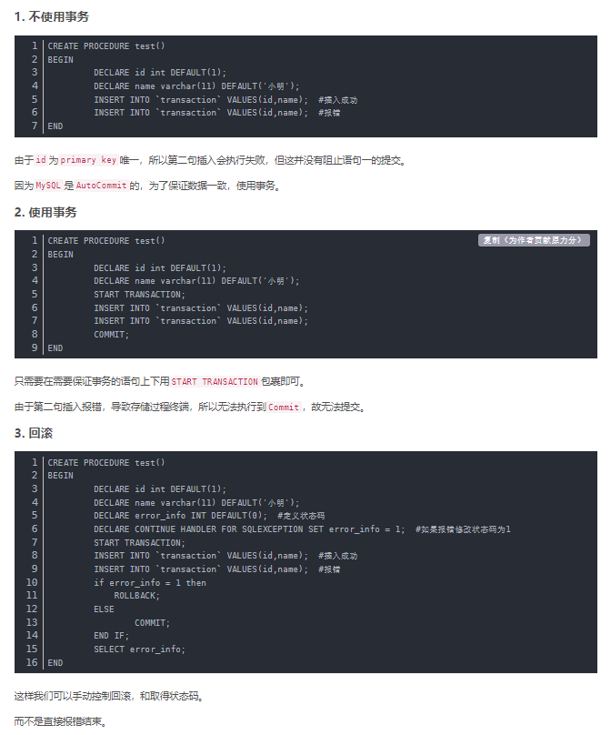

### 15.锁


在了解这部分知识时候我的状态：这TM是啥啊？


#### 15.1简介mysql锁及其作用

**数据库设计锁的初衷是为了处理并发问题。数据库作为多用户共享的资源，当出现并发访问的时候，为了保证数据的一致性，数据库需要合理地控制资源的访问规则。锁就是来实现这些访问规则的重要机制。**

例子：数据表相当于一家酒店，每行数据就像酒店的房间，大家如果随意进出，就会出现多人争抢一个房间的情况，而在房间上加上锁，只有申请到钥匙的人才能入住并且把房间锁起来，其他人只有等他用完退房才可以再次使用，这样保证了房间的一致性，方便酒店管理。

==**MySQL数据库由于自身架构的特点，存在多种数据存储引擎，每种存储引擎所针对的场景特点不大一样，为了满足各自特定应用场景的需求，每种存储引擎的锁定机制都是为了各自所面对的特定场景而优化设计的，所以各存储引擎的锁定机制有很大的区别。其中，MySQL各存储引擎使用了三种类型的锁定机制：表锁、页锁、行锁。**==

#### 15.2锁的分类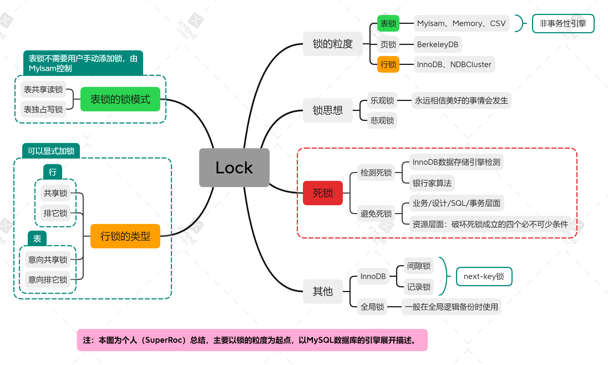

#### 15.3锁的粒度

##### 15.3.1表锁

**表级别的锁定是MySQL各存储类型引擎中最大的锁定机制。**

该锁定机制最大的特点就是实现逻辑简单，带来的系统负面影响最小。所以获取锁和释放锁的速度也很快。

由于表级锁一次将整个表锁定，所以可以很好的避免困扰我们的死锁问题。

锁定颗粒度最大所带来的的负面影响就是出现锁定资源争用的概率最高，并致使并发度大打折扣。

使用表级锁定的存储引擎主要是MyIsam，memory，CSV等一些非事务性存储引擎。

##### 15.3.2页锁

页级锁定是MySQL中比较独特的一种锁定级别，其他数据库管理软件中也并大常见。

页级别锁定的特点是锁定颗粒度介于行级别锁定和表级别锁定之间，所以在获取锁定需要的资源消耗和锁定颗粒度，并发处理能力都介于表级锁和行级锁之间。

页锁和行锁一样，会发生死锁。

##### 15.3.3行锁

行级锁定最大的特点就是锁定对象的颗粒度很小，也是目前各大数据库管理软件所实现的锁定颗粒度最小的。

由于锁定的颗粒度很小，所以发生资源争用的概率也最小，能够给予应用程序尽可能大的并发能力而提高一些需要高并发应用系统的整体性能。

虽然能够在并发处理能力上有较大的的优势，但是行级锁定带来了不少弊端。由于锁定资源的颗粒度很小，所以每次获取锁和释放锁需要做的事情也更多，带来的消耗自然就更大了。**此外行级锁也容易发生死锁。**

使用行级锁定的存储引擎主要是InnoDB存储引擎。

**==总结：==**

在数据库实现资源锁定的过程中，随着锁定资源颗粒度的减小，锁定同样数据量所需要消耗的内存数量是越来越多，实现算法也越来越复杂，发生死锁的概率就更大。不过随着锁定颗粒度的越来越小，应用程序的访问请求遇到锁等待的可能性也会随之降低，系统的并发度也会随之提升。

死锁：死锁是指两个或两个以上的进程在执行过程中，由于竞争资源或者由于彼此通信而造成的一种阻塞的现象，若无外力作用，它们都将无法推进下去。此时称系统处于死锁状态或系统产生了死锁，这些永远在互相等待的进程称为死锁进程。

因为行锁和页锁发生锁冲突的概率较小，所以更适合处理高并发的需求，但一定出现高并发，便会发生死锁。

| NO   | 开销 | 加锁速度 | 锁定力度   | 锁冲突概率 | 并发度 | 死锁发生概率 | 适用于                                                       |
| ---- | ---- | -------- | ---------- | ---------- | ------ | ------------ | ------------------------------------------------------------ |
| 表锁 | 小   | 快       | 颗粒度大   | 最高       | 最低   | 不会发生死锁 | 查询为主，只有少量按照索引条件更新数据的应用                 |
| 页锁 | 较小 | 较快     | 颗粒度较小 | 较高       | 较低   | 会发生死锁   |                                                              |
| 行锁 | 最大 | 最慢     | 颗粒度最小 | 最小       | 最高   | 会发生死锁   | 适合于大量按照索引条件并发更新少量不同数据，同时又有并发查询的应用，如一些在线事务处理系统，如OLTP系统 |

#### 15.4表锁的锁模式

表锁定机制是由MyIsam提供的；

表共享读锁：Table read lock

表共享写锁：Table write lock

==**MyISAM表的读操作和写操作之间，以及写操作之间都是串行的。当一个线程获得对一个表的写锁后，之后持有锁的线程可以对表进行更新操作，其他线程的读写操作都会等待，直到锁被释放为止。**==

##### 15.4.1表共享读锁

对MyIsam表的读操作，不会阻塞其他用户对统一表的读请求，但是会阻塞对同一表的写请求；

##### 15.4.2表共享写锁

对MyIsam表的写操作，则会阻塞其他用户对统一表的度和写操作。

##### 15.4.3MyISAM加表锁

==**MyISAM在执行查询语句之前，会自动给设计的所有表加读锁，在执行更新操作前，会自动给涉及的表加写锁，这个过程不需要用户参与，因此，用户一般不需要直接用lock table命令给MyISAM表显式加锁。**==

##### 15.4.4MyISAM表锁优化建议

MyISAM数据库存储引擎所提供的的表锁定，颗粒度较大，加锁的开销较小，但表冲突的概率大，导致并发较低，好在不会发生死锁。因此优化MyISAM表的表锁只要是为提高并发度。

**同样因为锁定级别无法改变，首先尽可能让锁定的时间变短，然后尽可能让可能并发的操作尽可能的并发；**

###### 1.查询表级锁定争用的情况

mysql内部有两组专门的状态变量记录系统内部锁资源争用情况；

```sql
show status like 'table%'; # 暂未实现成功
```

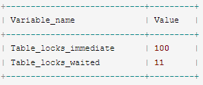

两个变量：

table_locks_immediate：产生表级锁定的次数

table_locks_waited：出现表级锁定争用发生等待的次数

这两个变量状态值从系统启动后变开始记录，出现一次对应的时间则数量+1。

如果这里的table_locks_waited的值比较高，则说明数据库中表级锁定的争用现象很明显，需要进一步分析为什么会有较多的锁定资源被争用。

###### 2.缩短锁定的时间

因为MyISAM表主要适用于查询，因此尽量使Query执行时间尽可能变短：

1. 尽量减少大的复杂query，将复杂的query拆分成几个小的query分步执行；
2. 尽可能建立足够高效的索引，让数据检索更迅速；
3. 尽量让MyISAM存储引擎的表只存放必要的信息
4. 利用合适的机会优化MyISAM表数据文件

###### 3.分离能并行的操作

MyIsam的表锁是读写互相阻塞的表锁，但仍然有一个非常有用的特性，那就是Concurrentinsert（并发插入）的特性。

MyIsam存储引擎有一个控制是否打开Concurrent insert功能的参数选项：concurrent_insert，可以设置为0,1,2，三个值的具体说明如下：

concurrent_insert = 2：无论MyIsam表中有无空洞，都允许在表尾并发插入记录；

concurrent_insert = 1：如果MyIsam表中没有空洞（即表中间没有被删除的行），MyIsam允许一个进程读表的同时，另一个进程从表尾插入记录。这也是MySQL的默认设置；

concurrent_insert = 0：不允许并发插入

可以利用MyIsam存储引擎的并发插入特性，来解决应用中对统一表查询和插入的锁的争用。例如，将concurrent_insert系统变量设置为2，总是允许并发插入；同时，通过定期在系统空闲时间OPTIMIZE table语句来整理空间碎片，回收因删除记录而产生的中间空洞。

###### 4.合理利用读写优先级

MyIsam存储引擎的表锁定是读写互相阻塞的，那么一个进程请求某个MyIsam表的读锁，同时一个进程也请求到同一个表的写锁的情况下，写进程优先获得锁。

不仅以上这样的情况，即使读请求优先到锁等待队列中等待，写请求后等待，写锁也会插到读请求前。

造成上面原因的情况是因为MySQL的表级锁定对于读与写是有不同的优先级设定的，默认情况下写优先级是要大于读优先级。

可以根据各自系统环境的差异来决定读写的优先级：

通过执行命令set low_priority_updates = 1，使得该**连接**读比写优先级高，如果系统为一个以读为主的，可以设置此参数。如果以写为主，则不用设置。

通过制定insert、update、delete等语句的low_priority属性降低该语句的优先级。

小结：MySQL同样提供了一个折中的方法来调节读写冲突，即给系统参数max_write_lock_count设置一个合适的值，当一个表的写锁达到这个值之后，MySQL就暂时将写的优先级降低，给读进程一定获得锁的机会。

同时需要注意的一点：一些经过长时间运行的查询操作，也会让进程饿死，因此，避免应用中出现长时间的查询操作，不要总想着一条语句解决问题。通过如果复杂查询避免不了的话，尽量安排在数据库空闲时间段执行，比如一些定期统计的操作可以安排在夜间执行。

#### 15.5行锁的类型

##### 15.5.1行锁的解释

行级锁定不是MySQL自己实现的锁定方式，而是有其他的存储引擎所实现的，其中包括大名鼎鼎的InnoDB数据存储引擎，以及MySQL的分布式引擎NDBCluster。各个数据引擎的实现都有差别，同时InnoDB也是我们经常使用的数据引擎，因此本段行锁的探究针对于InnoDB展开。

**==总体来说：InnoDB的锁定机制和Oracle数据库有不少相似之处。InnoDB的行级锁定分为共享锁和排他锁。而在锁定机制的实现机制中为了让行级锁和表级锁共存，InnoDB同样使用了意向锁（表级锁定）的概念，也就是说InnoDB同时提供了共享锁和排他锁两个行级锁以及代表表级锁定概念的意向共享锁和意向排他锁。==**

举例：

1.当一个事务需要给自己需要的某个资源加锁的时候，如果遇到一个共享锁正在锁着自己需要的资源的时候，自己可以加上一个共享锁。不能添加排他锁。

2.当一个事务遇到自己需要锁定的资源被一个排他锁锁定占有之后，则只能等到该锁定释放资源之后，自己才能获得锁定的资源并且添加自己的锁定。

3.意向锁的作用就是当一个事务在需要获取资源锁定的时候，如果遇到自己需要的资源被排他锁占用的时候，该事务可以在锁定行的表上添加一个合适的意向锁，如果需要一个共享锁，那么就在表上添加一个意向共享锁。如果自己需要的是某行或者多行上面添加一个排他锁的话，则先在表上添加一个意向排他锁。意向共享锁可以同时存在多个，但是意向排他锁只能存在一个。

总结：InnoDB的行级锁定模式上总共分为四种：共享锁，排他锁，意向共享锁，意向排他锁。

##### 15.5.2共享锁、排他锁、意向共享锁、意向排他锁的共存逻辑关系

四者的共存逻辑关系如下图：

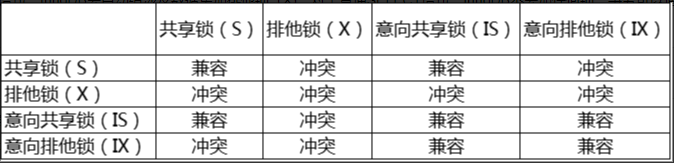

==**如果一个事务请求的锁模式和当前的锁兼容，InnoDB就将请求的锁授予该事务。反之如果不兼容，该事务就需要等待锁的释放。**==

意向锁是InnoDB自动加的，不需要用户干预。

对于普通的Select语句，InnoDB不会添加任何的锁。

对于update、insert、delete语句，InnoDB会自动给涉及的数据集加上排他锁。

事务可以通过语句显式地添加共享锁或者排他锁：

```sql
#共享锁
select * from table_name ... lock in share mode;
#排他锁
select * from table_name ... for update;
```

用语句显示定义共享锁，主要用在需要数据依存关系时来确认某行记录是否存在，并需要确保没有人对这个记录进行update或者delete操作。

但是如果当前事务也需要对该记录进行更新操作，则很有可能造成死锁。

对于锁定行记录需要进行更新操作的应用，应该使用select ... for update方式获得排他锁。

##### 15.5.3InnoDB行锁的实现方式

InnoDB行锁是通过索引上的索引项加锁来实现的，只有通过索引条件检索数据，InnoDB才能使用行级锁，否则InnoDB将使用表锁。

因此在实际的应用中，要特别注意InnoDB行锁的这一特性，否则会造成大量的锁冲突，从而影响并发性能。举例说明

1. 在不通过索引条件查询的时候，InnoDB使用的是表锁，不会使用行锁。
2. 由于MySQL的行锁是针对索引加的锁，不是针对记录加锁，所以虽然是访问不同行的记录，但是如果是使用相同的索引建，是会出现锁冲突的。（相同索引键的问题解释请参考：[mysql 锁问题 (相同索引键值或同一行或间隙锁的冲突) - 沫小淘 - 博客园 (cnblogs.com)](https://www.cnblogs.com/moxiaotao/p/10135682.html)）
3. 当表有多个索引的时候，不同的事务可以使用不同的索引锁定不同的行，此外，不论是使用主键索引还是唯一索引、普通索引，InnoDB都会通过使用行锁对数据加锁。
4. 即便是在条件中使用了索引字段，但是否使用索引来检索数据是由mysql通过判断不同的执行计划的代价来决定。如果mysql认为全表扫描的效率会更高，比如一些很小的表，数据库便不会使用索引，这种情况下InnoDB将使用表锁，而不是行锁，因此在分析锁冲突时，别忘了检查SQL的执行计划，已确认是否真正地使用了索引。

##### 15.5.4间隙锁和next-key锁

讨论间隙锁，我认为首先了解间隙锁的作用，以及复习之前事务的隔离级别和隔离后果，就会发现，我们一切的设计都在保证数据的安全性，此处保证安全性的同时保证正确性，进而提高数据库层面的并发能力，毕竟多用户仍然是软件系统的一个巨大挑战，保证软件架构各个层面有能力去应对高并发所带来的挑战。

###### 15.5.4.1间隙锁解释

当我们用范围条件而不是相等条件检索数据，并请求共享锁或者排他锁时，InnoDB会给符合条件的已有数据记录的索引项加锁；

对于键值在条件范围内但并不存在的记录，叫做“间隙”（GAP）。InnoDB也会对这个间隙加锁，这种加锁机制，就是所谓的间隙锁：next-key锁。

例子：

假如emp表只有101条记录，其中empid分别是1，2,3，···100,101，下面的SQL

```sql
select * from emp where emp_id > 100  for update;
```

上述SQL是一个范围条件的检索，InnoDB不仅会对符合条件的empid值为101的记录上加锁，也会对empid大于101（这些记录并不存在）的间隙加锁。

###### 15.5.4.2间隙锁的作用

1. 防止幻读，以满足相关隔离级别的要求。对于上面的例子，要是不适用间隙锁，如果其他的事务插入了empid大于100的任何记录，那么本市无如果再次执行上述语句，就会发生幻读。
2. 为了满足恢复和复制的需要。（暂不理解）

###### 15.5.4.3间隙锁的弊端

1. 在使用范围条件检索并锁定记录时，即使某些不存在的键值也会被无辜的锁定，而造成锁定的时候无法插入锁定键值范围内的任何数据，在某些场景下这可能会对性能造成很大的伤害。

需要注意的是，InnoDB除了通过范围添加加锁时使用间隙锁外，如果使用相等条件请求给一个不存在的记录加锁，InnoDB也会使用间隙锁。

==**总结InnoDB数据存储引擎存在的几个性能较大的性能弊端**==

1. 间隙锁的弊端如上所述。
2. 当query无法利用索引的时候，InnoDB会放弃使用行级别锁定，而采用表级别锁定，造成并发性能的降低
3. 当query使用的索引并不包含所有的过滤条件时，数据检索使用的索引建所指向的数据可能有部分不属于该query的结果集的行列，但是也会被锁定，因为间隙锁锁定的是一个范围，而不是具体的索引键。
4. 当query在使用索引定为数据的时候，如果使用的索引建一样，但是访问的数据行不同时，一样被锁定。

因此：在实践应用开发过程中，尤其是并发插入较多的时候，我们要尽量优化业务逻辑，尽量使用相等的条件来访问更新数据，避免使用范围条件。

##### 15.5.5InnoDB优化行锁

对于InnoDB实现的行级锁定，虽然在锁定机制方面带来的性能损耗比表级锁定更高，但在整体并发处理能力要远远优于MyIsam的表锁。同样如果使用不当，InnoDB的整体性能不仅不会比MyIsam高，甚至可能更差。

优化思路：

###### 15.5.5.1优化思路一：扬长避短

1. 尽可能让所有的数据检索都通过索引来完成，从而避免InnoDB因为无法通过索引加锁而升级成表级锁定。
2. 合理设计索引
3. 尽可能减少基于范围的数据检索条件，避免间隙锁带来的负面影响
4. 尽量控制事务的大小，减少锁定的资源量和锁定长度
5. 在业务环境允许的情况下，尽量使用较低级别的事务隔离，以减少MySQL因为实现事务隔离所带来的附加成本。

###### 15.5.5.2优化思路二：减少死锁产生的概率

1. 类似业务模块中，尽可能按照相同的访问顺序来访问，防止死锁
2. 同一个事务中，尽可能一次锁定所需要的所有资源
3. 对于非常容易发生死锁的业务成分，可以尝试使用升级锁定颗粒度，通过表级锁定减少死锁发生的概率。

###### 15.5.5.3分析行锁的争夺情况

可以通过检查InnoDB_row_lock状态量来分析系统上的行锁争夺情况

```sql
show status like 'InnoDB_row_lock%';
```

InnoDB的行级锁定状态变量不仅记录了锁定等待次数，还记录了锁定总时长，每次平均时长，以及最大市场，此外还有一个非累计状态量显示了当前正在等待锁定的等待数量，对各个状态量的说明如下：

1. InnoDB_row_lock_current_waits:当前正在等待锁定的数量
2. InnoDB_row_lock_time:从系统启动到现在锁定的总时间长度
3. InnoDB_row_lock_time_avg:每次等待平均花费的时间
4. InnoDB_row_lock_time_max:从系统启动到现在等待最长的一次所花的时间
5. InnoDB_row_lock_waits:系统启动后到现在总共等待的次数

上述五个系统状态变量比较重要的是2，3,5，尤其是当等待次数很高，且每次等待时间也不小的情况下的，需要分析为啥都这么多的等待，并着手优化。

如果发现5和3的值比较高，还可以通过设置InnoDB monitors来进一步观察锁冲突的表和数据行，并分析锁争用的原因。

```sql
create table InnoDB_monitor（a int）engine = InnoDB;
```

然后通过下面的语句来进行查看

```sql
show engine InnoDB status;
```

监视器可以通过发出下列语句来停止查看

```sql
drop table InnoDB_monitor;
```

设置监视器后会有详细的当前锁等待信息，包括表名，锁类型。锁定记录的情况，便于进一步分析。

打开监视器之后，每十五秒会向日志中记录监控的内容，如果长时间打开会导致.err文件变得非常巨大，所以在用户确认问题原因之后，要记得删除监控表以关闭监视器，或者通过“-console”选项来启动服务器以关闭写日志文件。

#### 15.6页锁

除了上述描述的表锁和行锁之外，mysql还有一种相对偏中性的**页级锁**。

页级锁是mysql中比较独特的一种锁定级别，在其他的数据库管理软件中并不大常见。

页级锁的锁定颗粒度介于行级锁和表级锁之间，所以获取锁定所需要的资源开销，以及所能并发处理的能力同样介于二者之间。

**需要注意的是页级锁也会和行级锁一样发生死锁。**

使用页级锁定的主要是BerkeleyDB数据存储引擎。

#### 15.7根据锁的思想分类

##### 15.7.1乐观锁

乐观锁：（optimistic lock）假定不会发生冲突，只要在提交操作时检查数据的完整性。乐观锁不能解决脏读问题。

乐观锁：就是很乐观，每次去拿数据的时候都会认为别人不会修改，所以不会上锁，但是在更新的时候会盘点在此期间别人有没有去更新这个数据，可以使用版本号等机制。乐观锁适用于多种的应用类型，这样可以提高吞吐量。类似数据库如果提供write_condition机制其实就是提供的乐观锁。

###### 15.7.1.1乐观锁与mybatis

注：参考官方链接：[乐观锁插件 | MyBatis-Plus (baomidou.com)](https://baomidou.com/pages/0d93c0/#optimisticlockerinnerinterceptor)

##### 15.7.2悲观锁

悲观锁：（pessimistic lock）假定会发生并发冲突，屏蔽一切可能违反数据库完整性的操作。

悲观锁，就是很悲观，每次去拿数据的时候都认为别人会修改，所以每次在拿数据的时候，都会上锁，这样别人想拿这个数据就会block直到它拿到锁。传统型的关系数据库中里面就用了很多这样的锁机制，比如行锁，表锁。读锁，写锁等。都是在做操作前先加上锁。

#### 15.8全局锁

按照理解，全局锁的颗粒度要比表锁、页锁和行锁都要大，但未将其放置在比较中。作为一种全局设置，这样对于生产环境的操作相对来说是很危险的。因此需要谨慎。

全局锁是对这个数据库实例加锁。使用场景通常在全局逻辑备份时。

MySQL提供的全局读锁的命令1：

```sql
flush tables with read lock;
```

这个命令会是整个库置于只读状态。数据库更新语句、数据表定义语句、更新类的事务提交语句在此都会被阻塞。

可以预知的风险：主库备份时，备份期间不能更新，业务停摆；从库备份时，备份期间不能执行主库的binlog，导致主从延迟同步。

MySQL提供的全局只读的命令2：

```sql
set global readonly = true；
```

相当于整个库设置为只读状态，这种global设置比较重。

两种的效果对比：

首先都可以将全局设置为只读状态。

不一样的点是：`flush tables with read lock;`设置会在数据库连接断开之后释放全局锁，数据库恢复到可以正常更新的状态。而使用`set global readonly = true;`即使连接断开，数据库仍旧保持只读状态，会导致数据库长时间处于不可写的状态。

#### 15.9死锁

上文叙述中MyIsam实现的表锁是不会出现死锁的。页锁和行锁由于并发量提升会发生死锁。

此处我们只讨论InnoDB完成的行锁发生的死锁情况。

##### 15.9.1死锁是什么？

多个并发进程因为争夺资源而产生的相互等待的现象。

发生的原因：

1. 系统资源有限
2. 进程推进不合理

##### 15.9.2死锁的四个必要条件

**进程争取资源发生冲突产生死锁，这里从资源占用的角度来看待死锁发生的必要条件。**

###### 15.9.2.1互斥

某种资源一次只允许一个进程访问，即该资源一旦分配给某个进程，其他进程就不能访问，直到该进程访问结束。

###### 15.9.2.2占有且等待

一个进程本身占用一种或者多种资源，同时还有资源未得到满足，正在等待其他进程释放该进程等待的资源。

###### 15.9.2.3不可抢占

别人已经占用了某项资源，你不能因为自己需要使用，就去把别人的资源抢过来。

###### 15.9.2.4循环等待

存在一个进程链，使得每个进程都占用了下一个进程所需要的至少一种资源。


==总结死锁发生的四个必要条件==：当以上四个条件均得到了满足，必然发生死锁，发生死锁的进程就无法进行下去，他们所持有的资源也无法释放。这样会导致CPU的吞吐量下降，因此死锁是非常浪费系统资源和影响计算机的使用性能的。

##### 15.9.3如何检测死锁

###### 15.9.3.1死锁与InnoDB

​	在InnoDB的事务管理和锁定机制中，有专门检测死锁的机制，会在系统发生死锁后的很短时间内就检测到死锁的存在。

​	当InnoDB检测到系统产生了死锁之后，InnoDB会通过相应的判断来选择产生死锁的两个事务中较小的事务回滚，而让另外一个较大的事务成功完成。

==InnoDB判定事务的大小==：MySQL官方手册中提出：InnoDB发现死锁的存在，会计算两个事务各自插入、更新或者删除是巨量来判定两个事务的大小，也就说哪个事务中改变的记录条数越多，在死锁中就不会被回滚掉。

​	需要注意的一点就是当产生死锁的场景涉及不到InnoDB引擎的时候，InnoDB是无法检测到该死锁的。这时候只能通过锁定超时限制参数InnoDB_lock_wait_timeout来判断。

​	在并发访问较大的情况下，如果大量事务因无法立即获得所需的资源而被挂起，会占用大量的计算机资源，造成严重性能问题，甚至拖垮数据库。因此需要设置合适的锁等待超时阈值，来避免此种情况的发生。

###### 15.9.3.2银行家算法

银行家算法的相关数据结构：

- 可利用资源向量：（Available）用于显示系统里面各种资源剩余的数目。由于系统中拥有的资源都是有很多种，假设有m种，所以我们用一个有m个元素的数组表示各种资源，数组元素的初始值为系统里面所配置的该类全部可用资源的数目。其数值随着该类资源的分配与回收动态的改变。
- 最大需求矩阵：（Max）用于表示各个进程对各种资源的最大需求数额。进程可能会有n个，那么，我们可以使用一个n*m的矩阵来表示各个进程资源的最大需求量。
- 分配矩阵：（Allocation）用于表示分配给各个进程的各种资源的数目。也是一个n*m的矩阵。
- 需求矩阵：用于表示进程仍然需要的资源数目，用一个n*m的矩阵表示。系统可能没法一下子满足某个进程的最大需求（通常进程对资源的最大需求指的是她在整个进程过程中所需要的全部的资源总数，并不是每一个时刻都需要这么多）于是，为了进程的推进，通常系统会分配给进程一部分资源保证进程能够执行起来。进程的最大需求减去已经分配给进程的数目，就得到了进程仍需要的资源数目。

银行家算法通过对进程需求、占用和系统拥有资源的实时统计，确保系统在分配给进程资源不会造成死锁才会分配。

##### 15.9.4如果避免死锁

通常说，死锁都是应用设计的问题，通过调整业务流程、数据库对象设计。事务大小，以及访问数据的SQL语句，绝大部分的死锁都是可以避免的。

###### 15.9.4.1避免死锁的思路一

这里我们从进程的执行去考虑避免死锁，可以借移为事务的角度。

1. 在应用中，如果不同的程序会并发访问存取多个表，应该尽量约定以相同的顺序访问表，这样可以大量降低发生死锁的概率。
2. 在程序以批处理的方式处理数据，如果事先对数据排序，保证每个线程按照固定的顺序进行处理，也可以大大降低发生死锁的可能性。
3. 在事务中，如果要更新记录，应该直接申请足够级别的锁，即排他锁，而不应该先申请共享锁，更新时再申请排他锁，因为当前用户申请排他锁时，其他事务可能又已经获得到了相同记录的共享锁，从而造成锁冲突，甚至是死锁。
4. 在REPEATABLE-READ隔离级别下，如果两个线程同时对相同记录使用了SELECT···FOR UPDATE加了排他锁，在没有符合该条件记录情况下，两个线程都会加锁成功，程序发现记录上不存在，就视图插入一条新纪录，如果两个线程都这么做，就会出现死锁。这种情况下，将隔离级别改成READ···COMMITTED，就可以避免问题。
5. 当隔离级别为READ committed 时，如果两个线程都先执行select ···for update，判断是否存在符合条件的记录，如果没有，就插入记录，此时，只有一个线程能插入成功，另一个线程会出现锁等待。当一个线程提交后，第二个线程会因为逐渐重出错，但虽然这个线程出错了，却会获得一个排他锁。这时候如果有第三个线程又来申请排他锁，也会出现死锁，对于这种情况，可以直接做插入操作。然后再捕获主键重异常。或者在遇到主键重错误时，总是执行ROLLBACK释放得到的排他锁。

###### 15.9.4.2避免死锁的思路二

产生死锁的四个必要条件，只要四个条件中至少有一个得不到满足，就不可能产生死锁。

同样这里是从资源占用的角度去破坏产生死锁的条件。

由于互斥条件是非共享资源中所必须的，不仅不能改变，而且必须加以保证。

a.破坏“占有且等待”条件：

方法1：所有进程在开始运行前，必须一次性地申请其在整个过程中所需的全部资源。

​			优点：简单容易实施，且安全

​			缺点：因为某项资源不满足，进程将无法启动，其他已经满足的资源也不会得到利用，严重降低了资源的利用率，造成了资源浪费，使进程发生饥饿。

方法2：该方法是对第一种方法的改进，允许进程只在运行初期获得需要的资源，便开始运行，在运行过程中逐步释放掉已经分配到的使用完毕的资源，然后再去申请新的资源，这样的话，资源的利用率就会得到提高，也会减少进程饥饿问题。

b.破坏“不可抢占”条件：

​	当一个已经持有了一些资源的进程提出新的资源申请没有得到满足的时候，它必须释放已经保持的所有资源，待以后需要使用的时候再申请，这就意味着进程已经占有的资源会被短时间释放或说是被强占了。

​	这种方法实现起来较为复杂，且代价比较大，释放已经保持的资源很有可能当时进程之前的工作丢失，反复的申请和释放资源会导致进程的执行被无限的推迟。这不仅会延长进程的周转周期，还会影响系统的吞吐量。

c.破坏“循环等待”条件：

​	可以通过定义资源类型的线性顺序来预防，可将每个资源编号，当一个进程占有编号为i的资源时，那么它的下一次申请资源只能申请编号大于i的资源，如下图所示：

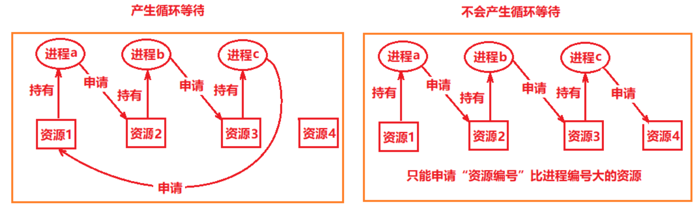

这样虽然避免了循环等待，但这种方法是比较低效的，资源的执行速度会变慢，并且可能在没有必要的情况下被拒绝资源的访问。比如说，进程C想要申请资源1，如果资源1并没有被其他的进程占有，此时将他分配给进程C即可，但是为了避免循环等待，申请就被拒绝，进而降低了资源的利用率。

### 16.函数

数据库中的函数分为内置函数以及自定义函数，内置函数在mysql篇已展开，此处只讨论自定义函数。

本着减少数据库操作压力、降低数据库的IO操作，函数不详细展开。

注：可参考链接：[MySQL自定义函数（CREATE FUNCTION） (biancheng.net)](http://c.biancheng.net/view/2590.html)

#### 16.1创建函数

函数使用保留字：function

语法如下：

```sql
CREATE FUNCTION <函数名> ( [ <参数1> <类型1> [ , <参数2> <类型2>] ] … )
  RETURNS <类型>
  <函数主体>
```

语法说明如下：

- `<函数名>`：指定自定义函数的名称。注意，自定义函数不能与存储过程具有相同的名称。
- `<参数><类型>`：用于指定自定义函数的参数。这里的参数只有名称和类型，不能指定关键字 IN、OUT 和 INOUT。
- `RETURNS<类型>`：用于声明自定义函数返回值的数据类型。其中，`<类型>`用于指定返回值的数据类型。
- `<函数主体>`：自定义函数的主体部分，也称函数体。所有在存储过程中使用的 SQL 语句在自定义函数中同样适用，包括前面所介绍的局部变量、SET 语句、流程控制语句、游标等。除此之外，自定义函数体还必须包含一个 `RETURN<值>` 语句，其中`<值>`用于指定自定义函数的返回值。

在 RETURN VALUE 语句中包含 SELECT 语句时，SELECT 语句的返回结果只能是一行且只能有一列值。

#### 16.2查看自定义函数

- 若要查看数据库中存在哪些自定义函数，可以使用 SHOW FUNCTION STATUS 语句；

- 若要查看数据库中某个具体的自定义函数，可以使用 SHOW CREATE FUNCTION<函数名> 语句，其中`<函数名>`用于指定该自定义函数的名称。

#### 16.3删除自定义函数

```sql
DROP FUNCTION [ IF EXISTS ] <自定义函数名>
```

语法说明如下。

`<自定义函数名>`：指定要删除的自定义函数的名称。

`IF EXISTS`：指定关键字，用于防止因误删除不存在的自定义函数而引发错误。

### 17.主从复制

注：参考链接：[MySQL主从复制的实现过程 - Co~Co - 博客园 (cnblogs.com)](https://www.cnblogs.com/cocoxu1992/p/10670589.html)

业务场景：小公司业务代码存于一个服务器上，而这个服务器有的时候回宕机，导致业务停顿，造成影响。这个时候 就需要做高可用 两个ngix+两个tomcat+两个mysql实现高可用，避免单点问题。中间使用keepalived监听。

#### 17.1什么是主从复制？

> 指一台服务器充当主数据库服务器，另一台或多台服务器充当从数据库服务器，主服务器中的数据自动复制到从服务器之中。对于多级复制，数据库服务器即可充当主机，也可充当从机。MySQL主从复制的基础是主服务器对数据库修改记录二进制日志，从服务器通过主服务器的二进制日志自动执行更新。
>  一句话表示就是，主数据库做什么，从数据库就跟着做什么。

#### 17.2主从复制的作用

1. 实现数据库服务器的负载均衡

   一是在主服务器上只实现数据的更新操作。包括数据记录的更新、删除、新建等等作业。而不关心数据的查询作业。数据库管理员将数据的查询请求全部 转发到从服务器中。这在某些应用中会比较有用。如某些应用，像基金净值预测的网站。其数据的更新都是有管理员更新的，即更新的用户比较少。而查询的用户数 量会非常的多。此时就可以设置一台主服务器，专门用来数据的更新。同时设置多台从服务器，用来负责用户信息的查询

    二是在主服务器上与从服务器切分查询的作业。在这种思路下，主服务器不单单要完成数据的更新、删除、插入等作业，同时也需要负担一部分查询作业。而从服务器的话，只负责数据的查询。当主服务器比较忙时，部分查询请求会自动发送到从服务器重，以降低主服务器的工作负荷。

2. 通过复制实现数据的异地备份

3. 提高数据库系统的可用性

   数据库复制功能实现了主服务器与从服务器之间数据的同步，增加了数据库系统的可用性。当主服务器出现问题时，数据库管理员可以马上让从服务器作为主服务器，用来数据的更新与查询服务。然后回过头来再仔细的检查主服务器的问题。此时一般数据库管理员也会采用两种手段。

#### 17.3主从复制工作原理解析

> 1.Master 数据库只要发生变化，立马记录到Binary log 日志文件中
>  2.Slave数据库启动一个I/O thread连接Master数据库，请求Master变化的二进制日志
>  3.Slave I/O获取到的二进制日志，保存到自己的Relay log 日志文件中。
>  4.Slave 有一个 SQL thread定时检查Realy log是否变化，变化那么就更新数据

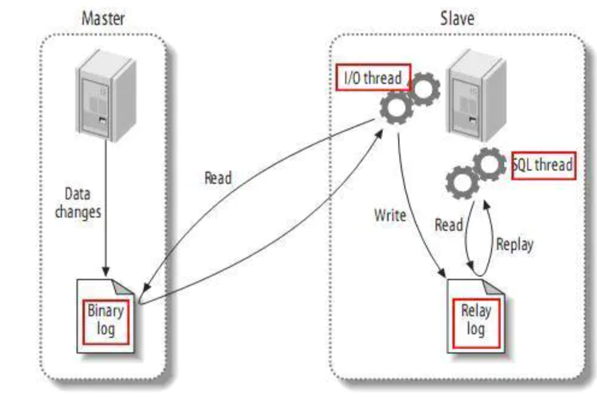

#### 17.4mysql复制的类型

> 1.基于语句的复制 ：主库把sql语句写入到bin log中，完成复制
>  2.基于行数据的复制：主库把每一行数据变化的信息作为事件，写入到bin log，完成复制
>  3.混合复制：上面两个结合体，默认用语句复制，出问题时候自动切换成行数据复制
>  tip:和上面相对应的日志格式也有三种:STATEMENT，ROW，MIXED。

1. STATEMENT模式（SBR）
    每一条会修改数据的sql语句会记录到binlog中。优点是并不需要记录每一条sql语句和每一行的数据变化，减少了binlog日志量，节约IO，提高性能。缺点是在某些情况下会导致master-slave中的数据不一致(如sleep()函数， last_insert_id()，以及user-defined functions(udf)等会出现问题)

2. ROW模式（RBR）
    不记录每条sql语句的上下文信息，仅需记录哪条数据被修改了，修改成什么样了。而且不会出现某些特定情况下的存储过程、或function、或trigger的调用和触发无法被正确复制的问题。缺点是会产生大量的日志，尤其是alter table的时候会让日志暴涨。

3. MIXED模式（MBR）
    以上两种模式的混合使用，一般的复制使用STATEMENT模式保存binlog，对于STATEMENT模式无法复制的操作使用ROW模式保存binlog，MySQL会根据执行的SQL语句选择日志保存方式。

#### 17.5配置mysql主从复制

注：[mysql实现主从复制/主从同步 - 简书 (jianshu.com)](https://www.jianshu.com/p/19cb0f16dea4)

### 18.分库分表

注：参考

[MySQL 分库分表方案，总结的非常好！ - 妖星杉木 - 博客园 (cnblogs.com)](https://www.cnblogs.com/aksir/p/9085694.html)

[Mycat 简介 - 傻不拉几猫 - 博客园 (cnblogs.com)](https://www.cnblogs.com/kingsonfu/p/10627802.html)

#### 18.1为什么要分库分表？

##### 18.1.1数据库架构的演变

早期只采用单机数据库即可，后来面对越来越多的请求，我们将数据库的读写分离，使用多个从库副本负责度，只用主库负责写，从库和主库同步数据更新，保持数据一致。架构上就是数据库主从同步，从库的层面水平扩展。深层意义上这里仍然实在解决度的压力。为了适用大用户量以及大量的写请求，就需要用到分库分表。

##### 18.1.2分库分表前的问题

###### 18.1.2.1用户请求数量较大

因为单服务器TPS、内存、IO都是有限的。

解决方法：分散请求到多个服务器上

###### 18.1.2.2单库太大

单个数据库处理能力有限；单库所在服务器上磁盘不足；单库上操作的IO瓶颈

###### 18.1.2.3单表太大

CURD都是问题；索引膨胀；查询超市

#### 18.2分库分表的方法

##### 18.2.1垂直切分

如果是因为表太多，可以使用垂直切分，根据业务切分成不同的库。

> 1.垂直分表
>
> ​	“大表拆小表”：基于字段进行；一般是表中的字段较多，将不常用的，数据较大的，长度较长的拆分到扩展表。一般是正对那种几百列的大表，也避免查询是，数据量太大造成的“跨页”问题。
>
> 2.垂直分库
>
> ​	垂直分库针对的是一个系统中的不同业务进行拆分，比如用户user一个库，商品product一个库。
>
> ​	切分后要放在多个服务器上，而不是一个服务器上。
>
> 数据库业务层面的拆分，和服务的治理、降级机制类似，也能对不同业务的数据分别的进行管理、维护、监控和扩展等。

##### 18.2.2水平切分

如果只是因为单张表的数据量过大，这时候需要按照一定的规则水平切分。

> 1.水平分表（不建议）
>
> ​	针对于数据量较大的单张表，按照某种规则切分到多张表里面去，但是这些表还是在一个库中，所以库级别的数据库操作还是有IO瓶颈的，不建议采用。
>
> 2.水平分库分表
>
> ​	将单张表的数据切分到多个服务器上，每个服务器上具有相应的库和表，只是数据集合不同。水平分库能够有效的缓解单机的性能瓶颈和压力，突破IO。连接数。硬件资源等瓶颈。
>
> 附：水平分库分表规则：
>
> ​	1.range：范围：从0-10000一个表，从10001-20000一个表
>
> ​	2.HASH取模：一个商场系统，一般都是将用户、订单作为主表，然后将和它们相关的作为附表，这样不会造成跨事务之类的问题。取用户ID，然后Hash取模，分配到不用的数据库上（不明白）。
>
> ​	3.地理区域：华东、华南等地理区域来划分
>
> ​	4.时间：按照时间切分；根据一定的时间段去拆分，旧的时间的数据被查询的概率变小，没必要和热数据放在一起。

==总结：分库分表的顺序应该是先垂直后水平切分。==

#### 18.3分库分表后的问题

##### 18.3.1事务支持

分库分表之后就是分布式事务了。

如果依赖数据库本身的分布式事务管理去执行事务，将付出昂贵的代价；

如果由应用程序去协助控制，形成程序逻辑上的事务，又会造成编程方面的负担。

##### 18.3.2多库结果合并

##### 18.3.3跨库join

原来关联表的操作会受到限制，无法join位于不同分库的表，也无法join分表粒度不同的表。

##### 18.3.4后期扩容

#### 18.4分库分表产品

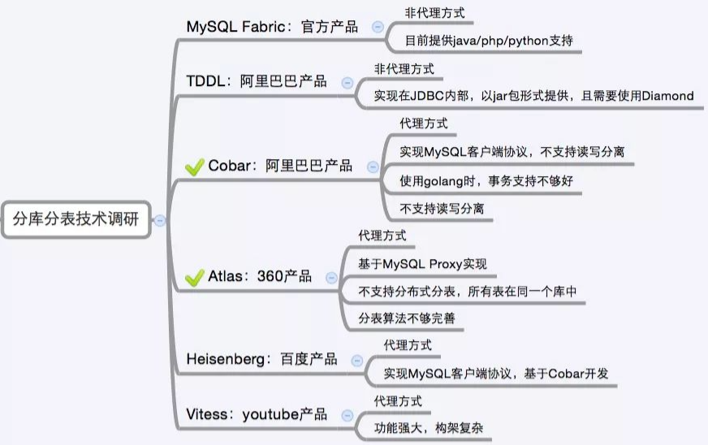

其中：

mycat是一款面向企业级应用的开源数据库中间件，目前支持数据库集群，分布式事务与ACID，被普遍视为基于mysql技术的集群分布式数据库解决方案。

mycat支持多种分片规则：

- 枚举法
- 固定分片的hash算法
- 范围约定
- 日期列分区法
- 统配取模
- ASCII码求模统配
- 编程指定
- 截取数据哈希解析
- 一致性Hash

注：mycat简介：[Mycat 简介 - 傻不拉几猫 - 博客园 (cnblogs.com)](https://www.cnblogs.com/kingsonfu/p/10627802.html)

### 19.MySQL恢复

#### 19.1备份

##### 19.1.1完整sql备份

数据库可以设置定时任务每条备份完整的数据库。

如果需要扩容新的数据库，可以使用备份文件去还原数据量。

##### 19.1.2增量日志备份

小量数据库可以每天进行完整备份，但当数据库很大是，就不太可能每天进行一次完整备份了。这个时候需要增量备份。

增量备份的原理是使用了mysql的binlog日志。

1. 首先做一次完整备份：

   mysqldump -h10.6.208.183 -utest2 -p123 -P3310 --single-transaction --master-data=2 test>test.sql这时候就会得到一个全备文件test.sql

   在sql文件中我们会看到：
   -- CHANGE MASTER TO MASTER_LOG_FILE='bin-log.000002', MASTER_LOG_POS=107;是指备份后所有的更改将会保存到bin-log.000002二进制文件中。

2. 在test库的t_student表中增加两条记录，然后执行**flush logs**命令。这时将会产生一个新的二进制日志文件bin-log.000003，bin-log.000002则保存了全备过后的所有更改，既增加记录的操作也保存在了bin-log.00002中。

3. 再在test库中的a表中增加两条记录，然后误删除t_student表和a表。a中增加记录的操作和删除表a和t_student的操作都记录在bin-log.000003中。

#### 19.2通过日志恢复

通过调整配置打开mysql数据库记录日志的设置，如果是一个新库便打开记录日志，那么日后的任何操作都会生成一个二进制的日志文件。

通过命令可以恢复误删除以及误修改的数据。

可以设置回滚位置和回滚的时间（start-position/stop-position----start-datetime/stop-datetime）

注：参考链接[(4条消息) mysql数据库通过日志恢复数据_qzw5235641的博客-CSDN博客_mysql数据恢复](https://blog.csdn.net/qzw5235641/article/details/83985460)

### 20.大数据优化方案

#### 20.1数据库设计

1. 单库表别太多，一般保持200张一下
2. 表设计尽量小，不要啥都放在一张表
3. 事务设计不要太大
4. 设计表的时候尽量选择“小数据模型”，尽量避免text等数据类型
5. 设计表字段能用int就不要使用字符类型
6. 最好避免使用null
7. 图片不要存DB
8. 避免存储过程和触发器
9. 并不是所有的索引对查询都有效
10. 索引少且精
11. 避免使用游标
12. 可以采用ENUM替代所知的少量固定变量

#### 20.2SQL优化

1. 大SQL拆分
2. 避免使用左模糊
3. 分页查询避免使用大偏移量
4. 避免使用count(*)
5. where子句中尽量避免使用!=或者<> / 避免判断null / 避免使用or连接条件
6. 优化索引
7. in not in慎用
8. SQL中避免出现运算
9. 避免出现回表

#### 20.3读写分离/分库分表

数据量太大已经超过了设计表和设计库的范畴，且无法通过SQL代码层面优化，多用户多访问量，IO压力大就需要考虑分布式等扩展方式，可以进一步缓解数据库的压力

#### 20.4更换大数据引擎处理数据

如果数据量超过了*量级，只好选择大数据。

### 21.BigData

2021年12月20日16:54:04

SuperDream（白日梦）中讨论。

## 五.Mysql问题排查

#### 1.表的使用（多用于锁表）

```mysql
#查看正在使用的线程
show processlist;

#字段In_use表示有多少线程在使用这张表，字段name_locked表示表格是否被锁，0代表锁定状态
show OPEN TABLES where In_use > 0;

#杀死进程:xx 为进程id，需要较高的权限
kill xx;
```

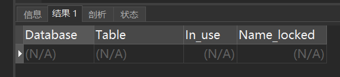

### N.删库跑路。