# javaWeb

狂神java web笔记链接：

1. HTTPs://blog.csdn.net/bell_love/article/details/105667638
2. [【狂神说Java】JavaWeb入门到实战1---笔记 - 你的雷哥 - 博客园 (cnblogs.com)](https://www.cnblogs.com/henuliulei/p/14397046.html)
3. [【狂神说Java】JavaWeb入门到实战2---笔记 - 你的雷哥 - 博客园 (cnblogs.com)](https://www.cnblogs.com/henuliulei/p/14405745.html)

本文仅谈论JavaWeb相关的应用层面的知识，暂不深究网络相关知识

# 一.基本概念

## 1.web开发

- 静态web开发：html，css 提供给所有人看的数据始终不会发生变化！
- 动态web开发：几乎所有的网站都是动态web； 提供给所有人看的数据始终会发生变化，每个人在不同的时间，不同的地点看到的信息各不相同！
- 技术栈：Servlet/JSP，ASP，PHP

**在Java中，动态web资源开发的技术统称为javaWeb；**

## 2.web应用程序

### 2.1web应用程序

web应用程序：可以提供浏览器访问的程序

#### 2.1.1静态web和动态web

##### 2.1.1.1静态web

- *.htm, *.html,这些都是网页的后缀，如果服务器上一直存在这些东西，我们就可以直接进行读取。

- 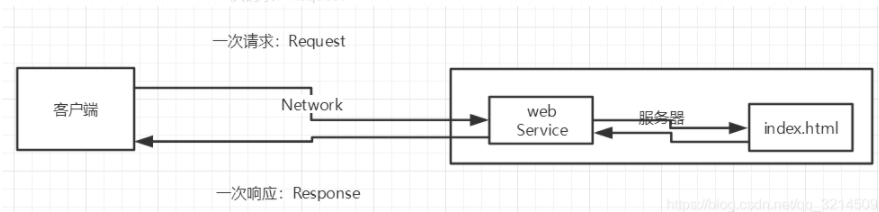

- 静态web存在的缺点：Web页面无法动态更新，所有用户看到都是同一个页面。

   1.轮播图：点击特效：伪动态 
  
   2.javaScript：实际开发中，它用的最多
  
   3.它无法和数据库交互，数据无法持久化，用户无法交互

##### 2.1.1.2动态web

1. 页面会动态展示： “Web的页面展示的效果因人而异”；

2. **缺点：**

    1. 加入服务器的动态web资源出现了错误，我们需要重新编写我们的后台程序，重新发布：停机维护。

    **优点：**

    1. Web页面可以动态更新，所有用户看到都不是同一个页面
    2. 它可以与数据库交互 （数据持久化：注册，商品信息，用户信息…）
    3. 如果存在同数据库交互的情况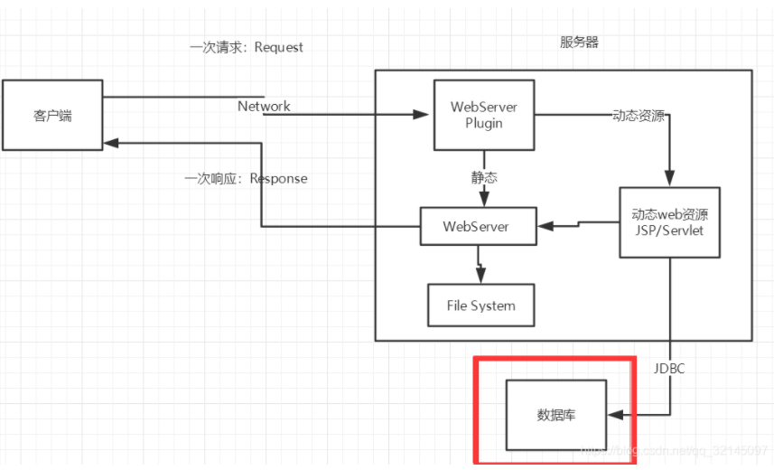

### 2.2URL:统一资源定位符

​	详解URL：[URL是什么意思 URL介绍【详解】 - 知乎 (zhihu.com)](HTTPs://zhuanlan.zhihu.com/p/71374158)

## 3.网站是如何进行访问的？（面试常问）

1. 浏览器地址栏中输入一个域名，回车键访问
2. 检查本机中C盘下的hosts配置文件中有没有当前域名的映射。
   1. 如果有，直接返回当前域名的IP地址，在这个地址中有我们需要访问的web程序，可以直接访问。
   2. 如果没有，联网去DNS服务器找，找到返回目标IP，找不到就返回找不到。
3. 假设找到了，建立TCP的链接
4. 发送一个http请求
5. web程序返回响应的结果
6. 关闭TCP的连接
7. 浏览器解析HTML
8. 浏览器进行布局渲染

# 二.web服务器

## 1.编写语言或技术栈分类

- asp
    - 微软：国内最早流行的就是ASP；
    - 在HTML中嵌入了VB的脚本， ASP + COM；
    - 在ASP开发中，基本一个页面都有几千行的业务代码，页面极其换乱
    - 维护成本高
    - C#编写
    - IIS：在控制面板中启动windows服务
- php
    - PHP开发速度很快，功能很强大，跨平台，代码很简单 （70% , WP）
    - 无法承载大访问量的情况（局限性）
- jsp
    - B/S：浏览和服务器
    - C/S: 客户端和服务器
        - sun公司主推的B/S架构
        - 基于Java语言的 (所有的大公司，或者一些开源的组件，都是用Java写的)
        - 可以承载三高（高并发，高可用，高性能）问题带来的影响

## 2.Web服务器

```xml
服务器是一种被动的操作，用来处理用户的一些请求和给用户一些响应信息；
```

### 2.1.IIS

微软开发，通常与windows系统绑定，需要在系统配置中启动，此处暂不深究，未来可能深究。

### 2.tomcat


```xml
Tomcat是Apache 软件基金会（Apache Software Foundation）的Jakarta 项目中的一个核心项目，最新的Servlet 和JSP 规范总是能在Tomcat 中得到体现，因为Tomcat 技术先进、性能稳定，而且免费，因而深受Java爱好者的喜爱并得到了部分软件开发商的认可，成为目前比较流行的Web应用服务器。

Tomcat服务器是一个免费的开放源代码的Web应用服务器，属于轻量级应用服务器，在中小型系统和并发访问用户不是很多的场合下被普遍使用，是开发和调试JSP 程序的首选。对于一个Java初学web的人来说，它是最佳的选择
```

#### 1.安装Tomcat

- tomcat官网：HTTP://tomcat.apache.org/


**下载解压到相应文件夹下**

注：通常开发环境如果非必要装在C盘默认路径下的，其余均放在同一路径下

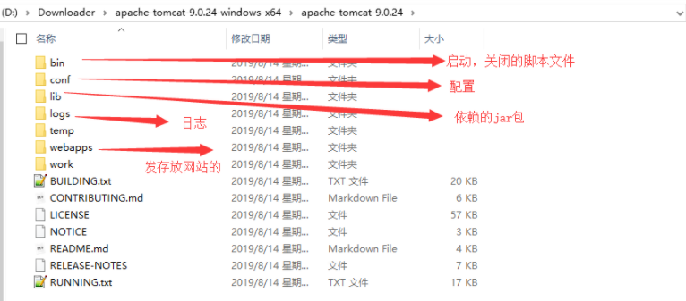

启动/测试/关闭Tomcat


测试地址：HTTP://localhost:8080/

#### 2.可能遇到的问题

- Java环境变量没有配置
- 闪退问题：需要配置兼容性
- 乱码问题：配置文件中设置

# 三.HTTP/HTTPS

## 1.什么是HTTP？

```xml
HTTP（超文本传输协议）是一个简单的请求-响应协议。
所有的WWW文件都必须遵守这个标准。
默认使用80端口。

HTTP连接使用的是“请求-响应”的方式，不仅在请求是需要先建立连接，而且需要客户端向服务器发出请求后，服务器端才能回复数据。

其中HTTP/1.0是第一个在通讯中指定版本号的HTTP协议版本，至今仍被广泛采用，特别是在代理服务器中。

HTTP/1.1是当前版本，持续连接中被默认使用，并能很好地配合代理服务器工作。还能以管道方式同时发送多个请求，以便降低线路负载，提高传输速度。

HTTP/2.0是在HTTP/1.x的基础上，大幅度地提高了web性能，减少了网络延迟。

其中HTTP/1.0和HTTP/1.1在很长一段时间内都会并存，这是因为网络基础设置升级更新缓慢所决定的。
```

### 1.1什么是超文本？

​	超文本是用超链接的方法讲各个不同空间的文字信息，组织在一起的网状文本。

​	超文本更是一种用户界面范式。

​	个人认为超文本可以引申为不止只有文本。

## 2.HTTP/1.0/1.1/2.0

### 2.1.HTTP1.0

HTTP/1.0：客户端可以与web服务器连接后，只能获得一个web资源，断开连接。

​	为了提升系统的效率，HTTP/1.0规定浏览器与服务器只保持短暂的链接，浏览器的每次请求都需要和服务器建立一次TCP连接，服务器完成请求处理后立即断开TCP连接，服务器不跟踪每个客户也不记录过去的请求。但是这同样造成了一些性能上的缺陷。

例如：一个包含多个图像的网页文件，并没有包含真正的图像数据内容，而是指明了这些图像的URl地址，当web浏览器访问这个网页文件时，浏览器首先发出针对该网页文件的请求，当浏览器解析web服务器返回的该文件的HTML内容时，发现其中的图像标签后，浏览器根据标签中的src属性所指定的URL地址再次发送服务器下载图像数据的请求。	显然访问一个包含需要的图像的网页文件的整个过程包含了多次请求和响应。每次请求和响应都需要建立一个单独的链接，每一个连接只传输一个文档和图片。上一次和下一次的请求完全分离。及时图像文件很小，但是客户端和服务器端每次建立连接和关闭连接却是一个相较耗时的过程，并且会严重影响客户机和服务器的性能。同理当一个网页文件中包含JavaScript文件，css文件也会出现上述的情况。

​	同时，带宽和延迟也是影响网络请求的重要因素。在网络基础建设已经使用带宽得到极大的提升的当下，大部分的时候都是延迟在于响应速度。基于此会发现，HTTP/1.0被抱怨最多的则是连接无法服用，和，Head of line blocking这两个问题。理解这两个问题的前提：客户端是依靠域名来向服务器建立连接的，一般PC浏览器会针对单个域名的server同时建立6-8个连接，手机端的连接数则控制在4-6个，显然连接数并不是越多越好，资源的开销和整体延迟都会随之增加，连接无法复用会导致每次请求都会经历三次握手和慢启动。三次握手在高延迟的场景下影响比较明显，慢启动则对文件类的大请求影响较大。head of line blocking会导致带宽无法被充分利用，以及后续的健康请求被阻塞。

```txt
插曲：什么是Head of line blocking？
参考：https://zhuanlan.zhihu.com/p/330300133

首先：head of line blocking会导致健康的请求会被不健康的请求影响，而且这种体验的损耗手网络环境的影响，出现随机且难以监控。为了解决holb带来的延迟，协议设计者设计了一种新的pipelining（流水线）机制。pipelining只能适用于HTTP/1.1，而且由于使用的苛刻，很多浏览器厂商并不支持。

head of line blocking：队头阻塞
单个慢对象阻止了其他/后续的对象前进的情况。

例子：超市购物买东西：你买了半个超市的货物去结账，后续等待结账的其他顾客就收到了阻塞。
这个问题的解决方案就是多路复用。
```

### 2.2.HTTP1.1

HTTP/1.1：客户端可以与web服务器连接后，可以获得多个web资源。

为了，客服HTTP1.0的这个缺陷，HTTP/1.1支持持久连接，且默认模式使用流水线的持久连接。在TCP连接上可以传输多个HTTP请求和响应，减少了建立和关闭连接的消耗和延迟。一个包含有多个图像的网页文件的多个请求和应答都可以在一个连接中传输，但每个单独的网页请求和应答仍需要各自的连接。HTTP/1.1还允许客户端不需要等待上一次请求结果返回，就可以发出下一次的请求，但客户端必须按照接受到客户端请求的先后顺序依次回送响应结果，以保证客户端能够区分每次请求的相应内容，这样显著减少了整个下载过程所需的时间。

HTTP/1.1中，request和response头中都有可能出现一个connection的头，此header的含义是client和server通信对于长链接如何进行处理，默认是对方支持长链接。如果client使用HTTP/1.1协议，但又不希望使用长链接，则需要在header中指明connection的值为close，如果server也不想支持长链接，则需要在response中明确说明connection为close。因此无论是客户端还是服务器指明了connection为close，都表明正在使用的tcp链接在当前请求处理完毕后会被断掉，以后client再进行新的请求就需要建立新的tcp链接了。

此外HTTP/1.1还提供了身份认证、状态管理和cache缓存等机制相关的请求头和响应头。HTTP/1.0不支持文件断点续传，<code>RANGE:bytes</code>是HTTP/1.1的新增内容，HTTP/1.0每次传输文件都是同文件头开始，即是0字节开始。<code>RANGE:XXXX</code>表示要求服务器从文件XXXX文件处开始传送，这就是平时所说的断点续传。

以上综述：HTTP/1.1和HTTP/1.0协议的区别主要体现在：

1. 缓存处理
2. 带宽优化和网络连接的使用
3. 错误通知的管理
4. 详细在网络中的发送
5. 互联网地址的维护
6. 安全性以及完整性

### 2.3.HTTP2.0

HTTP2.0测试网站：[HTTP/2: the Future of the Internet | Akamai](https://http2.akamai.com/demo)

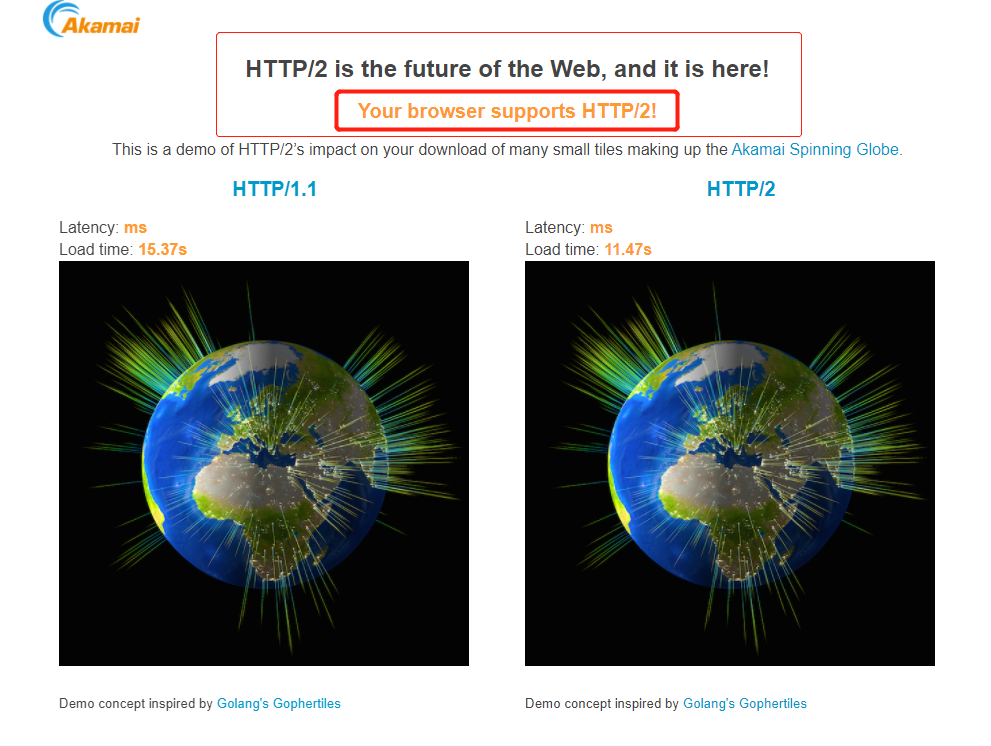

#### 2.3.1特性一：多路复用

多路复用允许同时通过单一的HTTP/2.0链接发起多重的请求-响应消息，在HTTP/1.1协议中浏览器客户端在同一时间，针对于统一域名下的请求有一定的数量限制。超过限制的数目的请求就会被阻塞。这也是为何一些站点会有多个静态资源CDN域名的原因之一，这是目前变相解决浏览器针对统一渔民的请求限制阻塞问题。而HTTP/2.0的多路复用，则允许同时通过单一的HTTP/2.0链接发起多重的请求-响应消息。因此HTTP/2.0可以很容易的去实现多流并行而不是依赖建立多个TCP连接。HTTP/2.0会把HTTP协议通信的基本单位压缩为一个个的帧，这些帧应着逻辑流中的消息，并行地在同一个TCP连接上双向交换消息。

#### 2.3.2特性二：二进制分帧

HTTP/2.0在应用层和传输层之间增加一个二进制分帧层，在不改动HTTP/1.x的语义，语法，状态码，URL以及首部字段的情况下，解决了HTTP1.1的性能限制，改进了传输性能，实现了低延迟和高吞吐量。在二进制分帧层，HTTP/2.0会讲所有传输的信息分割为更小的消息和帧，并对其采用二进制格式的编码，其中HTTP/1.x的首部信息会被封装到HEADER frame，而相对应的Request body则封装在DATA frame里面。

HTTP/2.0通信都在一个链接上完成，这个链接可以承载任意数据量的双向数据流。在过去，HTTP性能优化的关键并不在于高带宽，而是低延迟。TCP连接会随着时间进行自我调谐，起初会限制链接的最大速度，如果数据成功传输，会随着时间的推移提高传输的速度，这种调谐叫做TCP的慢启动。由于这种原因，让原本就具有突发性和短时性的HTTP连接变得十分低效。HTTP/2.0通过让所有数据流共用一个链接，可以更有效地使用TCP链接，让高带宽也能真正服务于HTTP的性能提升。

这种单链接多资源的方式，减少服务端的链接压力，内存占用更少，链接吞吐量更大；同时由于TCP连接的减少，而使网络拥塞的情况得到改善，同时慢启动时间的减少，使得拥塞和丢包恢复速度更快。

#### 2.3.3特性三：首部压缩

HTTP/1.1并不支持HTTP首部压缩，为此SPDY和HTTP/2.0诞生，SPDY使用的是通用的DEFLATE算法，而HTTP/2.0使用专门为首部压缩而设计的HPACK算法。

#### 2.3.4特性四：服务端推送

服务端推送是一种在客户端请求之前发送数据的机制，

在HTTP/2.0中，服务器可以对客户端的一个请求发送多个相应，Server Push让HTTP/1.x时代使用内嵌资源的优化手段，变得没有意义；如果一个请求是你的主页发起的，服务器可能会相应内容、logo以及样式表，因为服务器知道客户端需要这些东西。这相当于在一个HTML文档中集合了所有的资源，不过与之相比，服务器推送还有一个很大的优势，可以缓存。也让遵循同源的前提下，不同页面之间共享缓存资源变成可能。

## 3.HTTPS

由于HTTP协议传输的数据是不加密的，也就是是明文的，因此使用HTTP协议传输隐私信息非常不安全。为了保证这些隐私数据能加密传输，于是诞生了HTTPS。

HTTPS需要在传输数据前客户端与服务器端进行一次握手，在握手过程中将确立双方加密传输数据的密码信息。

传奇的网景公司设计了SSL协议用于对HTTP协议传输的数据进行加密。现在的HTTPS都采用TLS协议，但是由于SSL协议出现较早，依旧被浏览器所支持。TLS/SLL协议不仅仅是一套加密传输的协议，TLS/SSL协议中采用了非对称加密，对称加密及HASH算法。

HTTPS的默认端口号是443；

握手过程简单如下：

1. 浏览器将自己支持的一套加密算法规则发送给网站。
2. 网站从中选出一组加密算法和HASH算法，并将自己的身份信息以证书的形式回发给浏览器。证书里包含了网站地址，加密公钥，以及证书的颁发机构等信息。
3. 获得网站证书之后浏览器要做以下工作：
   1. 验证证书的合法性
   2. 如果证书受信任，或者是用户接受了不守信的证书，浏览器会随机生成一串密码，并用证书中提供的公钥加密
   3. 使用约定好的HASH计算握手信息，并使用生成的随机数对消息进行加密，最后将之前生成的所有信息发送给网站。
4. 网站接收浏览器发送来的数据之后，要做以下操作：
   1. 使用自己的私钥解密信息拿到密码，使用密码解密浏览器发送来的握手信息，并验证HASH是否与浏览器发来的一致
   2. 使用密码加密一段握手信息，并发送给浏览器
5. 浏览器解密并计算握手信息的HASH，如果和服务端发送来的HASH一致，此时握手接受，之后的所有通信数据由之前浏览器生成的随机密码并利用对称加密算法进行加密。

其中握手过程中如果有任何错误，都会断开加密链接，从而阻塞隐私信息的传输。

## 4.HTTP请求

**客户端--请求（Request）--服务器**

### 4.1HTTP请求报文

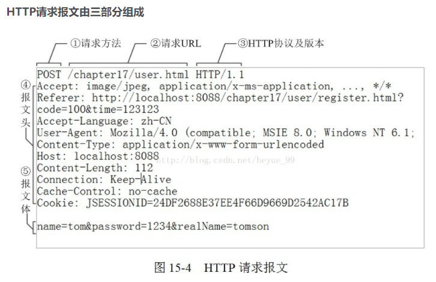

#### 4.1.1请求行

**1是请求方法；2是url地址，它和报文头的Host属性组成完整的请求URL；3是协议名称和版本号。**

#### 4.1.2报文头

```xml
Request URL:HTTPs://www.baidu.com/   请求地址
Request Method:GET    get方法/post方法
Status Code:200 OK    状态码：200
Remote（远程） Address:14.215.177.39:443
    
Accept:text/html  
Accept-Encoding:gzip, deflate, br
Accept-Language:zh-CN,zh;q=0.9    语言
Cache-Control:max-age=0
Connection:keep-alive

// 请求
:authority: dss2.bdstatic.com
:method: GET
:path: /5aV1bjqh_Q23odCf/static/superman/img/weather/icons/a0.png
:scheme: https
accept: image/webp,image/apng,image/svg+xml,image/*,*/*;q=0.8
accept-encoding: gzip, deflate, br
accept-language: zh-CN,zh;q=0.9,en;q=0.8,en-GB;q=0.7,en-US;q=0.6
referer: https://www.baidu.com/?tn=98050039_dg&ch=1
sec-ch-ua: " Not A;Brand";v="99", "Chromium";v="96", "Microsoft Edge";v="96"
sec-ch-ua-mobile: ?0
sec-ch-ua-platform: "Windows"
sec-fetch-dest: image
sec-fetch-mode: no-cors
sec-fetch-site: cross-site
user-agent: Mozilla/5.0 (Windows NT 10.0; Win64; x64) AppleWebKit/537.36 (KHTML, like Gecko) Chrome/96.0.4664.110 Safari/537.36 Edg/96.0.1054.62
```

### 4.2.请求方式

```xml
请求行中的请求方式：GET

请求方式：Get，Post，HEAD,DELETE,PUT,TRACT…

 get：请求能够携带的参数比较少，大小有限制，会在浏览器的URL地址栏显示数据内容，不安全，但高效

 post：请求能够携带的参数没有限制，大小没有限制，不会在浏览器的URL地址栏显示数据内容，安全，但不高效。
```

#### 4.2.1get

请求获取Request-uri所标识的资源

其中：在浏览器的地址栏中输入网址的方式访问网页，浏览器将采用get的方式向服务器获取资源

#### 4.2.2post

在request-uri所标识的资源后附加新的数据

其中：常用于提交表单

#### 4.2.3head

请求获取有Request-URI所标识的资源的响应信息报头

#### 4.2.4put

请求服务器存储一个资源，并用Request-URI作为标识

#### 4.2.5delete

请求服务器删除Request-URI所标识的资源

#### 4.2.6trace

请求服务器会送收到的请求信息，主要用作测试或者诊断

#### 4.2.7connect

保留将来使用

#### 4.2.8options

请求查询服务器的性能，或者查询与资源相关的选项和需求。

### 4.3Accept与Content-type

#### 4.3.1Accept

Accept表述客户端希望接受的数据类型为某种类型

#### 4.3.2Content-type

Content-type：客户端实际返回的内容的内容类型。

##### 4.3.2.1常见的媒体格式类型

1. text/html：HTML格式
2. text/plain：纯文本格式
3. text/xml：xml格式
4. image/gif：gif图片格式
5. image/jpeg：jpg图片格式
6. image/png：png图片格式

##### 4.3.2.2以Application开头的媒体格式类型

1. application/xhtml+xml：XHTML格式
2. application/xml：XML数据格式
3. application/atom+xml：Atom Xml聚合模式
4. application/json：JSON数据格式
5. application/pdf：pdf格式
6. application/msword：word格式
7. application/octet-stream：二进制流数据，如常见的文件下载。
8. application/x-www-form-urlencoded：<form encType = "">中默认的encType，form表单的数据是被编码为Key/value格式发送到服务器的。是表单默认的提交数据的格式
9. multipart/form-data：需要在表单上进行文件上传时，就需要使用此格式；是一种常见的媒体格式，是在上传文件之前使用。

##### 4.3.2.3HTTP content-type对照表

详情请见：[HTTP content-type | 菜鸟教程 (runoob.com)](https://www.runoob.com/http/http-content-type.html)

## 5.HTTP响应

**服务器--响应（response）--客户端**

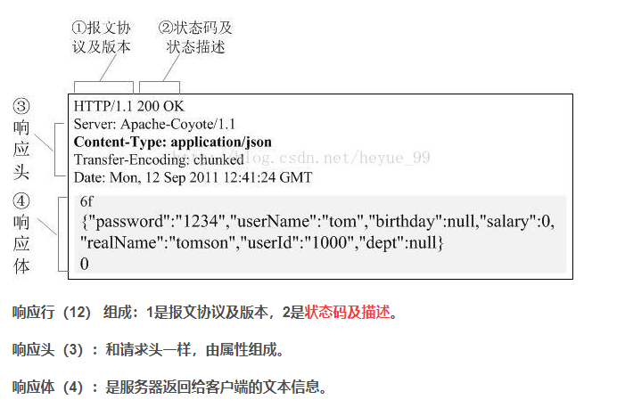

### 5.1.响应体

```xml
Accept：告诉浏览器，它所支持的数据类型
Accept-Encoding：支持哪种编码格式  GBK   UTF-8   GB2312  ISO8859-1
Accept-Language：告诉浏览器，它的语言环境
Cache-Control：缓存控制
Connection：告诉浏览器，请求完成是断开还是保持连接
HOST：主机..../.
Refresh：告诉客户端，多久刷新一次；
Location：让网页重新定位；
```

### 5.2.响应状态码（重点）

参考连接：[http statusCode(状态码) 200、300、400、500序列 - 王老五Plus - 博客园 (cnblogs.com)](https://www.cnblogs.com/wanglaowu/p/6229843.html)

#### 5.2.1：2xx

2xx：表示服务器成功处理了请求的响应状态码，说明网页可以正常访问

1. 200：服务器成功处理了请求。
2. 201：请求成功且服务器已经创建了新的资源
3. 202：服务器已接受请求，但尚未处理
4. 203：服务器已经处理了请求，但返回了可能来自另一来源的信息
5. 204：服务器成功处理了请求，但未返回任何内容
6. 205：服务器成功处理了请求，但未返回任何内容，和204不同的是，此响应要求请求者重置文档视图，例如：清除表单内容，以输入新的内容
7. 206：服务器处理了部分Get请求

#### 5.2.2：3xx

3xx：表示要完成请求，您还需要进一步操作，通过，这些状态代码是永远重定向的、

1. 300：（多种选择）：服务器根据请求可执行多种操作，服务器可根据请求者来选择一项操作，或者提供操作列表供其选择
2. 301：（永久移动）：请求的网页已被永久移动到新位置，服务器返回此响应时，会自动将请求者转至新位置，您应使用此代码通知搜索引擎网页已被永久移动到新闻纸。
3. 302：（临时移动）：服务器正在不同位置的网页响应请求，但请求者继续使用原来的位置来进行以后的请求。会自动将请求者移动至不同的位置。但由于搜索引擎会继续抓取之前的位置并将其编入索引，所以你不应使用此代码告诉搜索引擎页面或者网站已经被移动
4. 303
5. 304
6. 305：（使用代理）：请求者只能使用代理访问请求的网页，如果服务器返回此响应，那么，服务器还会指明请求者应当使用的代理
7. 307：（临时重定向）

#### 5.2.3：4xx

4xx：表示请求可能出错，会妨碍服务器的处理

1. 400：（错误请求）：服务器不理解请求的语法
2. 401：（身份验证错误）：此页面要求授权，您可能不希望此页面纳入索引
3. 403：（禁止）服务器拒绝请求
4. 404：（未找到）：服务器找不到请求的网页，例如：对于服务器上不存在的网页经常会返回此代码
5. 405
6. 406
7. 407
8. 108
9. 409
10. 410
11. 411
12. 412
13. 413
14. 414
15. 415
16. 416
17. 417

#### 5.2.4：5xx

5xx：服务器在尝试处理请求时发生内部错误，这些错误可能是服务器本身的错误，而不是请求出错。

1. 500：（服务器内部错误）：服务器遇到错误，无法完成请求

2. 501

3. 502：（错误网关）：服务器作为网关或者代理，从上游服务器收到了无效的相应

   出现502错误的原因：对于用户访问请求的响应超时造成的，502是报错类型代码bad gateway错误的网关。连接超时，我们向服务器发送的请求太多，导致服务器无法给予正常的响应，从而产生此类报错。

4. 503

5. 504

6. 505

## 5.HTTP和TCP/IP

参考链接：[HTTP长连接、短连接究竟是什么？ - dai.sp - 博客园 (cnblogs.com)](https://www.cnblogs.com/gotodsp/p/6366163.html)

### 5.1混淆HTTP长连接/短连接

HTTP长连接短连接其实就是TCP的长连接短连接；

其中在HTTP/1.0中默认使用短连接，也就是说客户端和服务器每进行一次HTTP操作，就要建立一次连接，任务接受就中断连接。当客户端浏览器访问的某个HTML或者其他类型的Web网页中包含其他的Web资源，例如JavaScript文件、图像文件、css文件件等，每遇到一个web资源，浏览器就会创建一个HTTP会话。这样的情况极其的消耗资源。

而从HTTP/1.1开始，默认使用长链接，用以保持链接特性。使用长链接的HTTP协议，会在响应头中加入：Connection：keep-alive

在使用长连接的情况下，当一个网页打开完成后，客户端和服务器之间用户传输HTTP数据的TCP连接不会关闭，客户端再次访问这个服务器时，会继续使用这一条已经建立的链接。Keep-Alive不会永远保持，它有一个保持时间，可以在不同的服务器软件中设置这个时间。实现长链接需要客户端和服务端都支持长链接。

因此HTTP的长链接短连接其实就是TCP的长短链接。

### 5.2HTTP、TCP、IP

注：这里涉及OSI网络模型的概念

TCP：传输层协议：主要解决如何在IP层之上可靠的传输数据包，使得网络上，接收端收到发送端所发出的所有包，并且发送顺序和发送顺序一致。TCP协议是可靠的面向连接的。

IP：网络层：主要用于解决网络路由和寻址问题

HTTP：应用层协议

### 5.3TCP连接的经典问题

#### 5.3.1三次握手/四次分手

#### 5.3.2TCP长链接与短连接

##### 5.3.2.1什么是长短链接

##### 5.3.2.2长短链接的优缺点

##### 5.3.2.3什么时候使用长链接、短连接？

### 5.4HTTP协议是无状态的

# 四.servlet

## 1.servlet简介

Servlet就是sun公司开发动态web的一门技术

## 2.第一个servlet程序

> Serlvet接口Sun公司有两个默认的实现类：HTTPServlet，GenericServlet

### 2.1HelloServlet

```java
public class HelloServlet extends HttpServlet {

    //由于get或者post只是请求实现的不同的方式，可以相互调用，业务逻辑都一样；
    @Override
    protected void doGet(HttpServletRequest req, HttpServletResponse resp) throws ServletException, IOException {
        //ServletOutputStream outputStream = resp.getOutputStream();
        PrintWriter writer = resp.getWriter(); //响应流
        writer.print("Hello,Serlvet");
    }

    @Override
    protected void doPost(HttpServletRequest req, HttpServletResponse resp) throws ServletException, IOException {
        doGet(req, resp);
    }
} 
```

### 2.2Mapping

在javaweb阶段使用mapping手动映射请求路径，后续在SpringMVC中将使用注解提供更为简单的使用方式。

我们写的是后端程序，但是需要通过浏览器去访问，而浏览器需要链接Web服务器，所以我们需要在Web服务中注册我们写的Servlet程序，给予浏览器一个能够访问的路径。

```xml
<!--注册Servlet-->
<servlet>
    <servlet-name>hello</servlet-name>
    <servlet-class>com.kuang.servlet.HelloServlet</servlet-class>
</servlet>
<!--Servlet的请求路径-->
<servlet-mapping>
    <servlet-name>hello</servlet-name>
    <url-pattern>/hello</url-pattern>
</servlet-mapping>  
```

### 2.3Servlet和Mapping的映射关系

1. 一个Servlet可以指定一个或多个映射路径

2. 一个Servlet可以指定通用路径

3. 一个Servlet可以默认请求路径

4. 路径的优先级问题

## 3.servlet运行原理

链接：HTTPs://www.bilibili.com/video/BV12J411M7Sj?p=9&spm_id_from=pageDriver


## 4.servletContext：servlet上下文

上下文将贯穿日后的一部分框架，这是一个思想，程序的上下文指的是程序当时的运行环境。

#### 4.1共享数据

我们在这个Servlet中保存的数据，在另外一个Servlet中可以拿到；

从servlet直接创建上下文对象。

```java
ServletContext context = this.getServletContext();
```

#### 4.2获取初始化参数

```xml
<!--配置一些web应用初始化参数-->
<context-param>
    <param-name>url</param-name>
    <param-value>jdbc:mysql://localhost:3306/mybatis</param-value>
</context-param>
```
```java
protected void doGet(HttpServletRequest req, HttpServletResponse resp) throws ServletException, IOException {
    ServletContext context = this.getServletContext();
    String url = context.getInitParameter("url");
    resp.getWriter().print(url);
}
```

#### 4.3请求转发

对比学习：转发、重定向

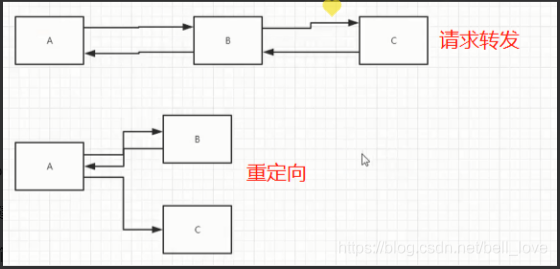

转发：forward

重定向：redirect


客户端发送一个请求到服务端，服务端首先使用一个Servlet来处理请求，当这个Servlet执行完毕之后，它会调用getRequestDispatcher()方法，把这个请求转发给指定的另外一个Servlet，然后处理完毕返回。这个动作叫做转发。

这个过程都是在服务器端完成，而且都是在同一请求中完成，因此请求级别的数据共享是没有问题的。

- 转发过程中客户端只请求了一次服务端
- 转发过程中客户端地址栏不会发生变化
- 转发只能跳转本站点的资源
- 转发是服务器端的行为

#### 4.4读取资源文件

Properties：通常使用.properties的文件作为配置文件。

在编码过程中，有时候需要读取这样的全局配置，因此可以使用servlet获得程序上下文然后读取想要的配置

```java
public class ServletDemo05 extends HttpServlet {
    @Override
    protected void doGet(HttpServletRequest req, HttpServletResponse resp) throws ServletException, IOException {

        InputStream is = this.getServletContext().getResourceAsStream("/WEB-INF/classes/com/kuang/servlet/aa.properties");//这个目录是生成的target目录下的文件

        Properties prop = new Properties();
        prop.load(is);
        String user = prop.getProperty("username");
        String pwd = prop.getProperty("password");

        resp.getWriter().print(user+":"+pwd);

    }

    @Override
    protected void doPost(HttpServletRequest req, HttpServletResponse resp) throws ServletException, IOException {
        doGet(req, resp);
    }
}
```

## 5.HTTPServletResponse

#### 5.1简单分类

负责向浏览器发送数据的方法：

```java
ServletOutputStream getOutputStream() throws IOException;
PrintWriter getWriter() throws IOException;
```

负责向浏览器发送响应头的方法：

```java
void setCharacterEncoding(String var1);

void setContentLength(int var1);

void setContentLengthLong(long var1);

void setContentType(String var1);

void setDateHeader(String var1, long var2);

void addDateHeader(String var1, long var2);

void setHeader(String var1, String var2);

void addHeader(String var1, String var2);

void setIntHeader(String var1, int var2);

void addIntHeader(String var1, int var2);
```

响应的状态码：

```java
int SC_CONTINUE = 100;
int SC_SWITCHING_PROTOCOLS = 101;
int SC_OK = 200;
int SC_CREATED = 201;
int SC_ACCEPTED = 202;
int SC_NON_AUTHORITATIVE_INFORMATION = 203;
int SC_NO_CONTENT = 204;
int SC_RESET_CONTENT = 205;
int SC_PARTIAL_CONTENT = 206;
int SC_MULTIPLE_CHOICES = 300;
int SC_MOVED_PERMANENTLY = 301;
int SC_MOVED_TEMPORARILY = 302;
int SC_FOUND = 302;
int SC_SEE_OTHER = 303;
int SC_NOT_MODIFIED = 304;
int SC_USE_PROXY = 305;
int SC_TEMPORARY_REDIRECT = 307;
int SC_BAD_REQUEST = 400;
int SC_UNAUTHORIZED = 401;
int SC_PAYMENT_REQUIRED = 402;
int SC_FORBIDDEN = 403;
int SC_NOT_FOUND = 404;
int SC_METHOD_NOT_ALLOWED = 405;
int SC_NOT_ACCEPTABLE = 406;
int SC_PROXY_AUTHENTICATION_REQUIRED = 407;
int SC_REQUEST_TIMEOUT = 408;
int SC_CONFLICT = 409;
int SC_GONE = 410;
int SC_LENGTH_REQUIRED = 411;
int SC_PRECONDITION_FAILED = 412;
int SC_REQUEST_ENTITY_TOO_LARGE = 413;
int SC_REQUEST_URI_TOO_LONG = 414;
int SC_UNSUPPORTED_MEDIA_TYPE = 415;
int SC_REQUESTED_RANGE_NOT_SATISFIABLE = 416;
int SC_EXPECTATION_FAILED = 417;
int SC_INTERNAL_SERVER_ERROR = 500;
int SC_NOT_IMPLEMENTED = 501;
int SC_BAD_GATEWAY = 502;
int SC_SERVICE_UNAVAILABLE = 503;
int SC_GATEWAY_TIMEOUT = 504;
int SC_HTTP_VERSION_NOT_SUPPORTED = 505;
```

#### 5.2下载文件

1. 要获取下载文件的路径
2. 下载的文件名是啥？
3. 设置想办法让浏览器能够支持下载我们需要的东西
4. 获取下载文件的输入流
5. 创建缓冲区
6. 获取OutputStream对象
7. 将FileOutputStream流写入到buffer缓冲区
8. 使用OutputStream将缓冲区中的数据输出到客户端！

```java
@Override
protected void doGet(HttpServletRequest req, HttpServletResponse resp) throws ServletException, IOException {
    // 1. 要获取下载文件的路径
    String realPath = "F:\\班级管理\\西开【19525】\\2、代码\\JavaWeb\\javaweb-02-servlet\\response\\target\\classes\\秦疆.png";
    System.out.println("下载文件的路径："+realPath);
    // 2. 下载的文件名是啥？
    String fileName = realPath.substring(realPath.lastIndexOf("\\") + 1);
    // 3. 设置想办法让浏览器能够支持(Content-Disposition)下载我们需要的东西,中文文件名URLEncoder.encode编码，否则有可能乱码
    resp.setHeader("Content-Disposition","attachment;filename="+URLEncoder.encode(fileName,"UTF-8"));
    // 4. 获取下载文件的输入流
    FileInputStream in = new FileInputStream(realPath);
    // 5. 创建缓冲区
    int len = 0;
    byte[] buffer = new byte[1024];
    // 6. 获取OutputStream对象
    ServletOutputStream out = resp.getOutputStream();
    // 7. 将FileOutputStream流写入到buffer缓冲区,使用OutputStream将缓冲区中的数据输出到客户端！
    while ((len=in.read(buffer))>0){
        out.write(buffer,0,len);
    }

    in.close();
    out.close();
}
```

#### 5.3生成验证码

验证码可以前端实现，也可以后端实现；

后端实现最后返回给前端一个图片文件，图片中有对应的验证码，同时我们也可以拿到验证码进而前后比较，从而验证输入正确。

```java
package com.kuang.servlet;

import javax.imageio.ImageIO;
import javax.servlet.ServletException;
import javax.servlet.HTTP.HTTPServlet;
import javax.servlet.HTTP.HTTPServletRequest;
import javax.servlet.HTTP.HTTPServletResponse;
import java.awt.*;
import java.awt.image.BufferedImage;
import java.io.IOException;
import java.util.Random;

public class ImageServlet extends HTTPServlet {

    @Override
    protected void doGet(HTTPServletRequest req, HTTPServletResponse resp) throws ServletException, IOException {

        //如何让浏览器3秒自动刷新一次;
        resp.setHeader("refresh","3");
        
        //在内存中创建一个图片
        BufferedImage image = new BufferedImage(80,20,BufferedImage.TYPE_INT_RGB);
        //得到图片
        Graphics2D g = (Graphics2D) image.getGraphics(); //笔
        //设置图片的背景颜色
        g.setColor(Color.white);
        g.fillRect(0,0,80,20);
        //给图片写数据
        g.setColor(Color.BLUE);
        g.setFont(new Font(null,Font.BOLD,20));
        g.drawString(makeNum(),0,20);

        //告诉浏览器，这个请求用图片的方式打开
        resp.setContentType("image/jpeg");
        //网站存在缓存，不让浏览器缓存
        resp.setDateHeader("expires",-1);
        resp.setHeader("Cache-Control","no-cache");
        resp.setHeader("Pragma","no-cache");

        //把图片写给浏览器
        ImageIO.write(image,"jpg", resp.getOutputStream());

    }

    //生成随机数
    private String makeNum(){
        Random random = new Random();
        String num = random.nextInt(9999999) + "";
        StringBuffer sb = new StringBuffer();
        for (int i = 0; i < 7-num.length() ; i++) {
            sb.append("0");
        }
        num = sb.toString() + num;
        return num;
    }


    @Override
    protected void doPost(HTTPServletRequest req, HTTPServletResponse resp) throws ServletException, IOException {
        doGet(req, resp);
    }
}
```

#### 5.4实现重定向

重定向：客户发来一个请求到服务器，服务器匹配Servlet来处理，这个Servlet处理之后调用sendRedirect（）方法，立即向客户端返回这个响应，响应会告诉客户端你需要再发送一个请求，去访问另外的资源，这个资源可以是本应用内的，也可以是应用外的，紧跟着客户端又发送了另外的请求，去请求行的资源。

- 两次请求互相独立
- 第一次请求后，响应的http状态码是302
- 重定向至少请求了两次
- 重定向的地址栏地址发生了变化
- 重定向的请求不共享数据
- 重定向是客户端行为：因为决定最后去走重定向的是客户端

##### 5.4.1重定向的场景

- 用户登录：用户账户密码验证成功后跳转到其他页面
- 需要获取一个外部资源，重定向是一个方法

## 6.HTTPServletRequest

HttpServletRequest代表了客户端的请求，用户通过HTTP协议访问服务器，HTTP请求中的所有信息都会被封装到HttpServletRequest中，通过这个类的方法，可以获得客户端的所有信息。

### 6.1获取前端传递的参数

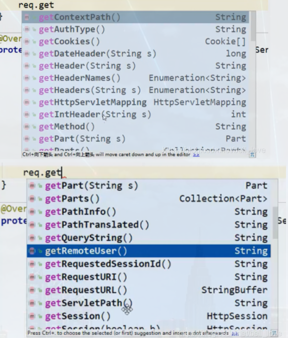

## 7.Cookie和session

### 7.1什么是会话？

**会话**：用户打开一个浏览器，点击了很多超链接，访问多个web资源，关闭浏览器，这个过程可以称之为会话；

#### 7.1.1有状态会话

理解有状态会话：一个同学来过教室，下次再来教室，我们就会知道这个同学曾经来过。

### 7.2保存会话的两种技术

* cookie：客户端技术 （响应，请求）

- session：服务器技术，保存用户的会话信息，可以把信息或者数据放在session中

### 7.3Cookie

在客户端访问某个地址的时候，会将请求交给服务器处理，在发送请求的过程中，浏览器会将页面的头部信息一并交给服务器处理，在处理过程中，cookie在服务器中产生，与此同时一些需要保存的信息可以放在cookie中，例如账户和密码等，并且可以设置cookie的刷新 时间，如果cookie的过期时间不设置，因为cookie的生命周期是浏览器会话期间，当关闭浏览器的时候cookie就会过期，伴随着响应，cookie会被回发到本地。

#### 7.3.1从请求中拿到cookie信息

```java
Cookie[] cookies = req.getCookies(); //获得Cookie
cookie.getName(); //获得cookie中的key
cookie.getValue(); //获得cookie中的vlaue
```

#### 7.3.2服务器响应给客户端cookie

```java
new Cookie("lastLoginTime", System.currentTimeMillis()+""); //新建一个cookie
cookie.setMaxAge(24*60*60); //设置cookie的有效期
resp.addCookie(cookie); //响应给客户端一个cookie
```

**cookie：一般会保存在本地的 用户目录下 appdata；**

**一个网站cookie是否存在上限！细节问题：**

- 一个Cookie只能保存一个信息
- 一个web站点可以给浏览器发送多个cookie，最多存放20个cookie
- Cookie大小有限制4kb
- 300个cookie浏览器上限

#### 7.3.3删除Cookie

- 不设置有效期，关闭浏览器，自动失效；
- 设置有效期时间为 0 ；

#### 7.3.4Cookie更新

可以先删除Cookie再新加

#### 7.3.5==Cookies的使用场景==

##### 7.3.5.1记住用户名

### 7.4session

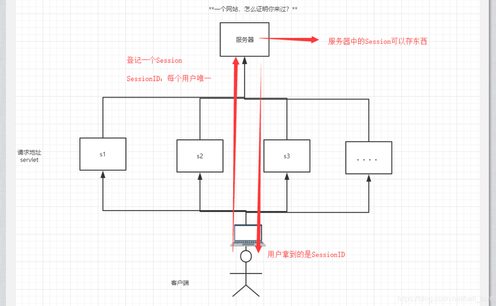

#### 7.4.1什么是session

- 服务器会给每一个用户（浏览器）创建一个Seesion对象；
- 一个Seesion独占一个浏览器，只要浏览器没有关闭，这个Session就存在；
- 用户登录之后，整个网站它都可以访问！–> 保存用户的信息；保存购物车的信息……

#### 7.4.2session和Cookie的区别

- Cookie是把用户的数据写给用户的浏览器，浏览器保存 （可以保存多个）
- Session把用户的数据写到用户独占Session中，服务器端保存 （保存重要的信息，减少服务器资源的浪费）
- Session对象由服务器创建；
- session默认的过期时间是30分钟，不同的服务器中要求不一样。（使用场景一个用户，特别是涉及钱相关的业务，在一段时间内要求用户下线重新登录）
- session和cookie相辅相成：session在生成的时候，会有一个SessionID，这个时候的SessionID可以交给Cookie进行存储。

#### 7.4.3session使用场景

- 保存一个登陆用户的信息
- 购物车信息
- 在网站中经常使用的数据

#### 7.4.4会话自动过期

session超时（失效）时间

配置session的失效时间

1. java代码实现
2. 工程的Web.xml实现
3. web容器的配置文件中实现

#### 7.4.5怎么证明我到过一个网站？

- cookie
- session ID

### 8.Servlet三大作用域

| 对象名称    | 对象的类型         |
| ----------- | ------------------ |
| request     | HttpServletRequest |
| session     | HttpSession        |
| application | ServletContext     |

# 五.JSP

JSP：java server pages java服务器端页面。同servlet一样，开发动态web。

## 5.1什么是JSP

JSP：java server pages：java的服务器端页面

最大的特点：写jsp页面就和写html页面一样。

jsp和html的区别：

- html只给用户提供静态的数据
- jsp页面可以嵌入java代码，为用户提供动态数据

## 5.2JSP原理

记住：jsp就是一个java类。本质上是servlet。

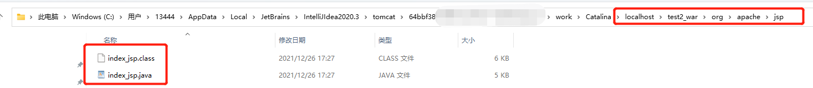

浏览器向服务器发送请求，无论访问什么资源，都是在访问Servlet

JSP也会被转换成一个JAVA类

```java
//初始化
  public void _jspInit() {
      
  }
//销毁
  public void _jspDestroy() {
  }
//JSPService
  public void _jspService(.HttpServletRequest request,HttpServletResponse response)
```

在JSP页面中；

只要是 JAVA代码就会原封不动的输出；

如果是HTML代码，就会被转换为：

> out.write("<html>\r\n");

### 5.2.1JSP转换时的必备

1. 判断请求

2. 内置一些对象

   ```java
   final javax.servlet.jsp.PageContext pageContext;  //页面上下文
   javax.servlet.http.HttpSession session = null;    //session
   final javax.servlet.ServletContext application;   //applicationContext
   final javax.servlet.ServletConfig config;         //config
   javax.servlet.jsp.JspWriter out = null;           //out
   final java.lang.Object page = this;               //page：当前
   HttpServletRequest request                        //请求
   HttpServletResponse response                      //响应
   ```

3. 输出页面前增加的代码

   ```java
   response.setContentType("text/html");       //设置响应的页面类型
   pageContext = _jspxFactory.getPageContext(this, request, response,
          null, true, 8192, true);
   _jspx_page_context = pageContext;
   application = pageContext.getServletContext();
   config = pageContext.getServletConfig();
   session = pageContext.getSession();
   out = pageContext.getOut();
   _jspx_out = out;
   ```

   

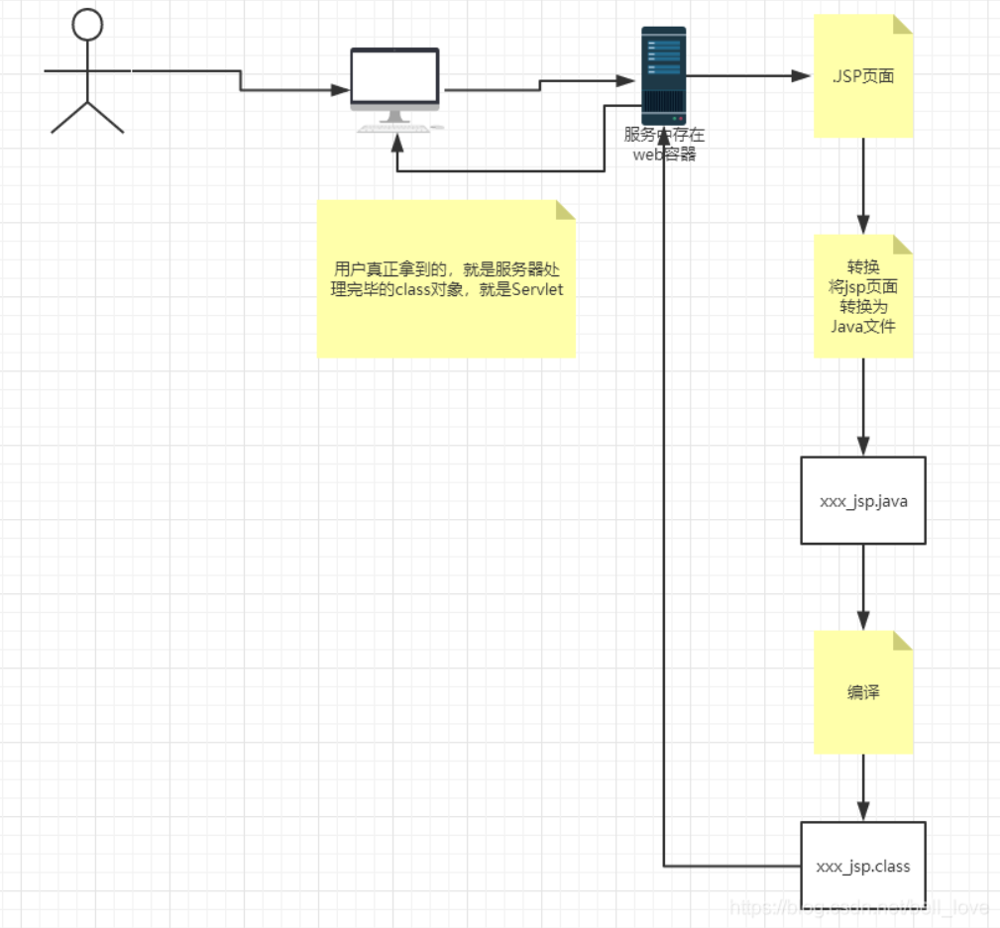

## 5.3JSP基础语法

​	任何语言都有自己的语法，JAVA中有,。 JSP 作为java技术的一种应用，它拥有一些自己扩充的语法（了解，知道即可！），Java所有语法都支持！

### 5.3.1jsp表达式

```jsp
  <%--JSP表达式
  作用：用来将程序的输出，输出到客户端
  <%= 变量或者表达式%>
  --%>
  <%= new java.util.Date()%>
```

### 5.3.2jsp脚本片段

```jsp
  <%--jsp脚本片段--%>
  <%
    int sum = 0;
    for (int i = 1; i <=100 ; i++) {
      sum+=i;
    }
    out.println("<h1>Sum="+sum+"</h1>");
  %>
```

```jsp
  <%
    int x = 10;
    out.println(x);
  %>
  <p>这是一个JSP文档</p>
  <%
    int y = 2;
    out.println(y);
  %>

  <hr>


  <%--在代码嵌入HTML元素--%>
  <%
    for (int i = 0; i < 5; i++) {
  %>
    <h1>Hello,World  <%=i%> </h1>
  <%
    }
  %>
```

### 5.3.3jsp申明

```java
<%!
  static {
  System.out.println("Loading Servlet!");
}

private int globalVar = 0;

public void kuang(){
  System.out.println("进入了方法Kuang！");
}
%>
```

### 5.3.4jstl标签

参考：[JSP 标准标签库（JSTL） | 菜鸟教程 (runoob.com)](https://www.runoob.com/jsp/jsp-jstl.html)

### 5.3.6JSTL表达式

## 5.4JSP指令

```jsp
<%@page args.... %>
<%@include file=""%>

<%--@include会将两个页面合二为一--%>

<%@include file="common/header.jsp"%>
<h1>网页主体</h1>

<%@include file="common/footer.jsp"%>

<hr>


<%--jSP标签
    jsp:include：拼接页面，本质还是三个
    --%>
<jsp:include page="/common/header.jsp"/>
<h1>网页主体</h1>
<jsp:include page="/common/footer.jsp"/>
```

## 5.5 JSP9大内置对象

9大内置对象指的是jsp在被转换成java的时候，提前写死的9个对象。

- PageContext 存东西
- Request 存东西
- Response
- Session 存东西
- Application 【SerlvetContext】 存东西
- config 【SerlvetConfig】
- out
- page ，不用了解
- exception

## 5.6JSP四大域对象

| 对象名称    | 对象的类型         |
| ----------- | ------------------ |
| pageContext | PageContext        |
| request     | HttpServletRequest |
| session     | HttpSession        |
| application | ServletContext     |

# 六.JavaBean

javaBean：实体类

# 七.MVC三层架构

## 7.1什么是三层架构

MVC：model view COntroller：模型、视图、控制器

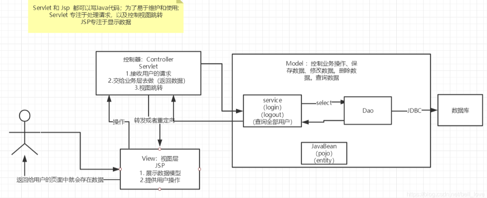

## 7.2SpringMVC

# 八.javaWeb三大器

## 8.1过滤器

**Filter：过滤器**

Shiro安全框架技术是实用Filter来实现的。

未来还会接触拦截器

### 8.1.1实现过滤器

#### 8.1.1.2过滤器类

```java
package filter;

import javax.servlet.*;
import java.io.IOException;

public class CharacterEncodingFilter implements Filter {

    @Override
    public void init(FilterConfig filterConfig) throws ServletException {
        System.out.println("初始化");//在tomcat启动时就初始化
    }

    @Override
    public void doFilter(ServletRequest servletRequest, ServletResponse servletResponse, FilterChain filterChain) throws IOException, ServletException {
        servletRequest.setCharacterEncoding("utf-8");
        servletResponse.setCharacterEncoding("utf-8");
        servletResponse.setContentType("text/html;charset=UTF-8");
        filterChain.doFilter(servletRequest,servletResponse);
        System.out.println("已经完成过滤");
    }

    @Override
    public void destroy() {
        System.out.println("被摧毁");
    }
}
```

#### 8.101.2映射路径

```java
<?xml version="1.0" encoding="UTF-8"?>
<web-app xmlns="http://xmlns.jcp.org/xml/ns/javaee"
         xmlns:xsi="http://www.w3.org/2001/XMLSchema-instance"
         xsi:schemaLocation="http://xmlns.jcp.org/xml/ns/javaee http://xmlns.jcp.org/xml/ns/javaee/web-app_4_0.xsd"
         version="4.0">
    <servlet>
        <servlet-name>servlet</servlet-name>
        <servlet-class>servlet.ShowServlet</servlet-class>
    </servlet>
    <servlet-mapping>
        <servlet-name>servlet</servlet-name>
        <url-pattern>/servlet/show</url-pattern>
    </servlet-mapping>
    <servlet-mapping>
        <servlet-name>servlet</servlet-name>
        <url-pattern>/show</url-pattern>
    </servlet-mapping>
    <filter>
        <filter-name>filter</filter-name>
        <filter-class>filter.CharacterEncodingFilter</filter-class>
    </filter>
    <filter-mapping>
        <filter-name>filter</filter-name>
        <url-pattern>/*</url-pattern>
    </filter-mapping>
</web-app>
```

## 8.2.监听器

Listener：监听器：通过listener可以监听web服务器中的每一个执行动作，并根据要求做出响应。

## 8.3拦截器

# 九.Web应用常见场景

## 9.1文件上传

## 9.2文件下载

## 9.3邮件发送