# Java_Third_Part_Tool

## 一.HuTool

**官网：https://www.hutool.cn/docs/#/**

### 1.HuTool是什么？

```xml
Hutool是一个小而全的Java工具类库，通过静态方法封装，降低相关API的学习成本，提高工作效率，使Java拥有函数式语言般的优雅，让Java语言也可以“甜甜的”。

Hutool中的工具方法来自每个用户的精雕细琢，它涵盖了Java开发底层代码中的方方面面，它既是大型项目开发中解决小问题的利器，也是小型项目中的效率担当；

Hutool是项目中“util”包友好的替代，它节省了开发人员对项目中公用类和公用工具方法的封装时间，使开发专注于业务，同时可以最大限度的避免封装不完善带来的bug。
```

| 模块               | 介绍                                                         |
| ------------------ | ------------------------------------------------------------ |
| hutool-aop         | JDK动态代理封装，提供非IOC下的切面支持                       |
| hutool-bloomFilter | 布隆过滤，提供一些Hash算法的布隆过滤(垃圾邮件过滤)           |
| hutool-cache       | 简单缓存实现                                                 |
| hutool-core        | 核心，包括Bean操作、日期、各种Util等                         |
| hutool-cron        | 定时任务模块，提供类Crontab表达式的定时任务                  |
| hutool-crypto      | 加密解密模块，提供对称、非对称和摘要算法封装                 |
| hutool-db          | JDBC封装后的数据操作，基于ActiveRecord思想                   |
| hutool-dfa         | 基于DFA模型的多关键字查找（敏感词过滤）                      |
| hutool-extra       | 扩展模块，对第三方封装（模板引擎、邮件、Servlet、二维码、Emoji、FTP、分词等） |
| hutool-http        | 基于HttpUrlConnection的Http客户端封装                        |
| hutool-log         | 自动识别日志实现的日志门面                                   |
| hutool-script      | 脚本执行封装，例如Javascript                                 |
| hutool-setting     | 功能更强大的Setting配置文件和Properties封装                  |
| hutool-system      | 系统参数调用封装（JVM信息等）                                |
| hutool-json        | JSON实现                                                     |
| hutool-captcha     | 图片验证码实现                                               |
| hutool-poi         | 针对POI中Excel和Word的封装                                   |
| hutool-socket      | 基于Java的NIO和AIO的Socket封装                               |

### 2.工具和框架的区别


### 3.HuTool和已有工具的对应关系

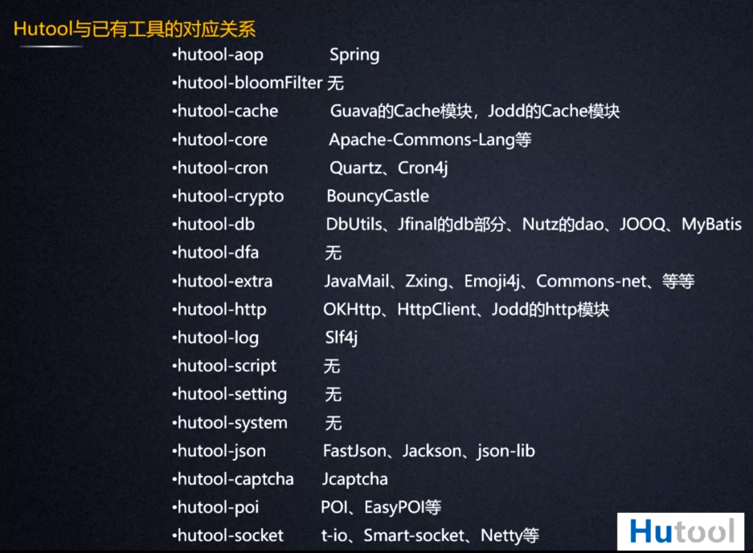

### 4.HuTool的优势

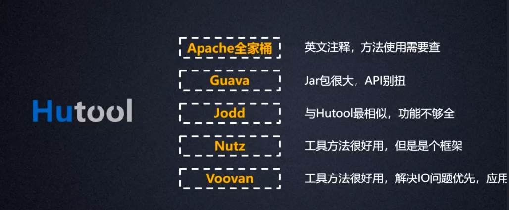

### 5.如何使用HuTool？

## 简要说明：

**下面的工具主要是对Excel进行操作，数据的导入导出。java的IO同样可以做类似的事情，但是底层实现远不如直接调用第三方的工具类实现简单方便，肯定是能懒则懒。**

## 二.EasyExcel

### 1.EasyExcel是什么？

**官方地址：https://www.yuque.com/easyexcel/doc/easyexcel**

### 2.为什么要使用EasyExcel？

相较于POI较大程度地去节省内存的使用，避免内存溢出

### 3.SpringBoot集成EasyExcel写excel

#### 1.导入依赖

```xml
<!--easyExcel-->
<dependency>
    <groupId>com.alibaba</groupId>
    <artifactId>easyexcel</artifactId>
    <version>2.2.6</version>
</dependency>
<!--lombok-->
<dependency>
    <groupId>org.projectlombok</groupId>
    <artifactId>lombok</artifactId>
</dependency>
<!--fastjson-->
<dependency>
    <groupId>com.alibaba</groupId>
    <artifactId>fastjson</artifactId>
    <version>1.2.75</version>
</dependency>
```

#### 2.创建对应所需表格的实体类

```java
@Data
public class EasyExcelData {

    @ExcelProperty("字符串标题")
    private String string;
    @ExcelProperty("日期标题")
    private Date date;
    @ExcelProperty("数字标题")
    private Double doubleData;
    /**
     * 忽略这个字段
     */
    @ExcelIgnore
    private String ignore;
}
```

#### 3.写一个方法根据格式写入Excel

```java
public class EasyExcelWriteTest {

    String Path = "excelStudy";

    private List<EasyExcelData> data() {
        List<EasyExcelData> list = new ArrayList<EasyExcelData>();
        for (int i = 0; i < 10; i++) {
            EasyExcelData data = new EasyExcelData();
            data.setString( "字符串" + i);
            data.setDate(new Date());
            data.setDoubleData(0.56);
            list.add(data);
        }
        return list;
    }

    //根据List写入数据
    /**
     * 最简单的写
     * <p>1. 创建excel对应的实体对象 参照{@link EasyExcelData}
     * <p>2. 直接写即可
     */
    @Test
    public void simpleWrite() {
        // 写法1
        String fileName = Path + "EasyExcel.xlsx";
        // 这里 需要指定写用哪个class去写，然后写到第一个sheet，名字为模板 然后文件流会自动关闭
        // 如果这里想使用03 则 传入excelType参数即可
        //write方法
        //fileName
        //格式从实体类中取
        //sheet名字自定义
        //doWrite写data中的数据
        EasyExcel.write(fileName, EasyExcelData.class).sheet("模板").doWrite(data());
    }
}
```

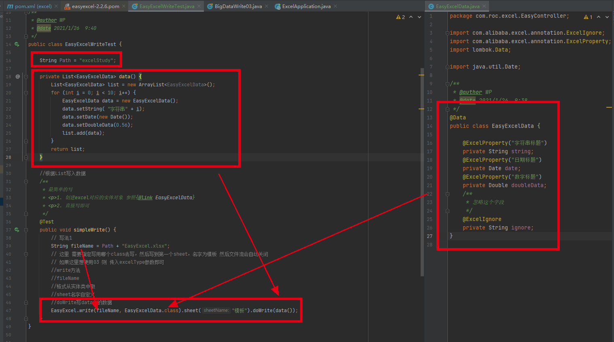

### 4.SpringBoot集成EasyExcel读取excel

## 三.POI(Apache POI)

### 1.POI是什么？

```xml
Apache POI 简介是用Java编写的免费开源的跨平台的 Java API，Apache POI提供API给Java程式对Microsoft Office（Excel、WORD、PowerPoint、Visio等）格式档案读和写的功能。POI为“Poor Obfuscation Implementation”的首字母缩写，意为“可怜的模糊实现”。
```

### 2.POI的基本功能

**Apache POI常用的类**

```xml
HSSF － 提供读写Microsoft Excel XLS格式档案的功能。
XSSF － 提供读写Microsoft Excel OOXML XLSX格式档案的功能。
HWPF － 提供读写Microsoft Word DOC97格式档案的功能。
XWPF － 提供读写Microsoft Word DOC2003格式档案的功能。
HSLF － 提供读写Microsoft PowerPoint格式档案的功能。
HDGF － 提供读Microsoft Visio格式档案的功能。
HPBF － 提供读Microsoft Publisher格式档案的功能。
HSMF － 提供读Microsoft Outlook格式档案的功能。
```

Excel 2003表格最大行数：65536

Excel 2007表格最大行数：无限制

### 3.SpringBoot集成POI进行写文件

#### 1.新建SpringBoot项目导入依赖

```xml
<dependencies>
    <!--xls(03)-->
    <dependency>
        <groupId>org.apache.poi</groupId>
        <artifactId>poi</artifactId>
        <version>3.9</version>
    </dependency>
    <!--xlsx(07)-->
    <dependency>
        <groupId>org.apache.poi</groupId>
        <artifactId>poi-ooxml</artifactId>
        <version>3.9</version>
    </dependency>
    <!--日期格式化工具-->
    <dependency>
        <groupId>joda-time</groupId>
        <artifactId>joda-time</artifactId>
        <version>2.10.1</version>
    </dependency>
    <!--test-->
    <dependency>
        <groupId>junit</groupId>
        <artifactId>junit</artifactId>
        <version>4.12</version>
    </dependency>
</dependencies>

```

#### 2.认清表格+03版本的.xls表格和07版本的.xlsx表格

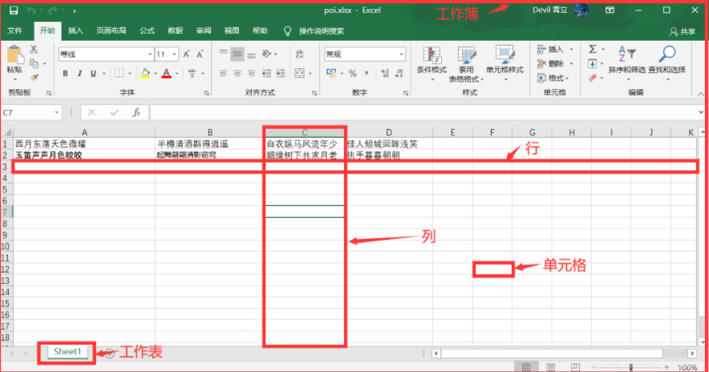

识别出表格中的几个对象

**工作簿**

**工作表**

**行**

**列**

#### 3.测试03版本的简单创建工作簿

```java
//import相关依赖
public class ExcelWriteTest03 {

    String Path = "D:\\MyDemos\\RD\\java\\demos\\excelStudy";

    @Test
    public void testWrite03() throws IOException {
        //1.创建一个工作簿
        HSSFWorkbook workbook = new HSSFWorkbook();
        //2.创建一个工作表
        HSSFSheet sheet = workbook.createSheet();
        //3.创建第一行
        Row row1 = sheet.createRow(0);
        //4.创建第一列
        Cell cell0101 = row1.createCell(0);
        //4.创建第二列
        Cell cell0102 = row1.createCell(1);
        //5.放入数据
        cell0101.setCellValue("信息");
        cell0102.setCellValue("这是POI的一节课");

        //创建第二行
        HSSFRow row2 = sheet.createRow(1);
        //创建第二行的第一列和第二列，且向第二的第一列和第二列放入日期格式的值
        Cell cell0201 = row2.createCell(0);
        Cell cell0202 = row2.createCell(1);
        cell0201.setCellValue("时间");
        String dateTime = new Date().toString();
        cell0202.setCellValue(dateTime);

        //生成一张表(IO文件流) 03版本的后缀为.xls
        //代码操作文件依旧是通过IO操作，new一个新的IO文件流，且使用完IO流之后关闭
        //使用IO流的过程中不断抛出异常
        FileOutputStream fileOutputStream = new FileOutputStream(Path + "POI的第一张表03.xls");
        workbook.write(fileOutputStream);
        fileOutputStream.close();
    }
}
```


#### 4.测试07版本的简单创建工作簿

```java
public class ExcelWriteTest07 {

    String Path = "D:\\MyDemos\\RD\\java\\demos\\excelStudy";

    @Test
    public void testWrite07() throws IOException {
        //1.创建一个工作簿
        XSSFWorkbook workbook = new XSSFWorkbook();
        //2.创建一个工作表
        XSSFSheet sheet = workbook.createSheet();
        //3.创建第一行
        Row row1 = sheet.createRow(0);
        //4.创建第一列
        Cell cell0101 = row1.createCell(0);
        //4.创建第二列
        Cell cell0102 = row1.createCell(1);
        //5.放入数据
        cell0101.setCellValue("信息");
        cell0102.setCellValue("这是POI的一节课");

        //创建第二行
        Row row2 = sheet.createRow(1);
        //创建第二行的第一列和第二列，且向第二的第一列和第二列放入日期格式的值
        Cell cell0201 = row2.createCell(0);
        Cell cell0202 = row2.createCell(1);
        cell0201.setCellValue("时间");
        String dateTime = new Date().toString();
        cell0202.setCellValue(dateTime);

        //生成一张表(IO文件流) 07版本的后缀为.xlsx
        //代码操作文件依旧是通过IO操作，new一个新的IO文件流，且使用完IO流之后关闭
        //使用IO流的过程中不断抛出异常
        FileOutputStream fileOutputStream = new FileOutputStream(Path + "POI的第一张表.xlsx");
        workbook.write(fileOutputStream);
        fileOutputStream.close();
    }
}
```

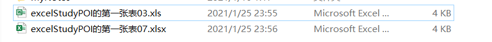

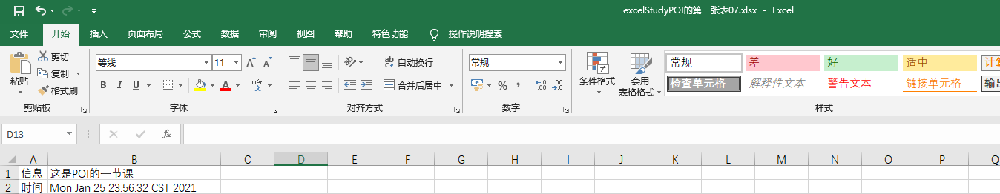

#### 5.测试03数据批量导入！

```java
public class BigDataWrite03 {

    String Path = "D:\\MyDemos\\RD\\java\\demos\\excelStudy";

    @Test
    public void BigDataWriteTest03() throws IOException {
        //获取程序开始时系统的时间且转换成秒
        long begin = System.currentTimeMillis();

        //创建一个工作簿
        HSSFWorkbook workbook03 = new HSSFWorkbook();
        //创建一个工作表
        HSSFSheet sheet = workbook03.createSheet();

        //写入数据
        //for循环写入
        //循环创建65336行
        for (int rowNum = 0;rowNum<65536;rowNum++){
            HSSFRow row = sheet.createRow(rowNum);
            for(int cellNum = 0;cellNum<10;cellNum++){
        //每行循环创建10列且填入数据
                HSSFCell cell = row.createCell(cellNum);
                cell.setCellValue(cellNum);
            }
        }
        //创建成功后
        System.out.println("over");
        //输出数据到文件中
        FileOutputStream fileOutputStream = new FileOutputStream(Path + "BigDataWriteTest03.xls");
        workbook03.write(fileOutputStream);
        fileOutputStream.close();

        //获取程序结束时系统的时间且转换成秒
        long end = System.currentTimeMillis();
        //计算前后总计花费多长时间
        System.out.println((double) (end-begin)/1000);
    }
}
```

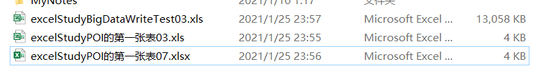

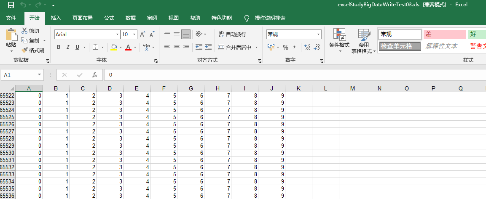

**使用时间为：**

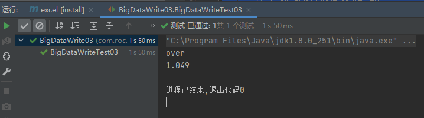

#### 6.测试07数据批量导入！

```java
public class BigDataWrite07 {

    String Path = "D:\\MyDemos\\RD\\java\\demos\\excelStudy";

    @Test
    public void BigDataWriteTest07() throws IOException {
        //获取程序开始时系统的时间且转换成秒
        long begin = System.currentTimeMillis();

        //创建一个工作簿
        XSSFWorkbook workbook07 = new XSSFWorkbook();
        //创建一个工作表
        XSSFSheet sheet = workbook07.createSheet();

        //写入数据
        //for循环写入
        //同样循环创建65336行
        for (int rowNum = 0; rowNum < 65536; rowNum++) {
            XSSFRow row = sheet.createRow(rowNum);
            for (int cellNum = 0; cellNum < 10; cellNum++) {
                //每行循环创建10列且填入数据
                XSSFCell cell = row.createCell(cellNum);
                cell.setCellValue(cellNum);
            }
        }
        //创建成功后
        System.out.println("over");
        //输出数据到文件中
        FileOutputStream fileOutputStream = new FileOutputStream(Path + "BigDataWriteTest07.xlsx");
        workbook07.write(fileOutputStream);
        fileOutputStream.close();

        //获取程序结束时系统的时间且转换成秒
        long end = System.currentTimeMillis();
        //计算前后总计花费多长时间
        System.out.println((double) (end - begin) / 1000);
    }
}
```

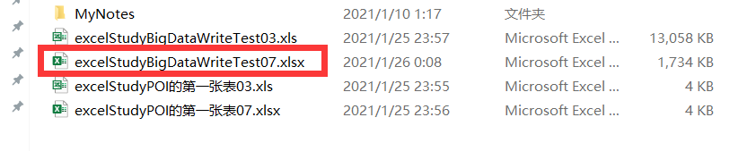

花费的时间为：

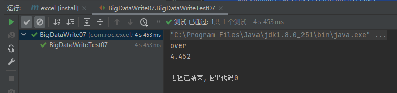

相比之下花费的时间就更长了

但是07可以写更多的数据：测试写100000行10列数据花费多长的时间：

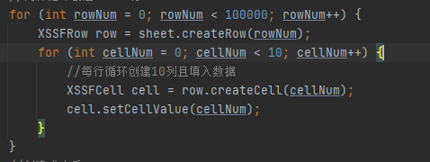

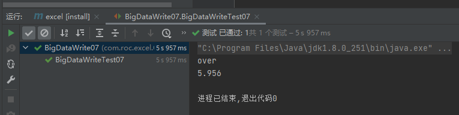

测试写1000000000行10列数据花费多长的时间：10亿行数据

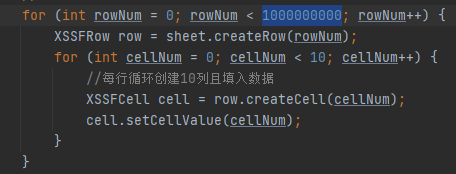

电脑资源使用情况：

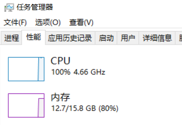

好吧，内存溢出······

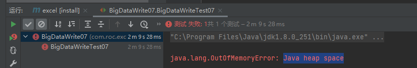

#### 7.解决07超大数据批量写入可能存在的内存溢出：SXSSF

```java
public class SuperDataWrite007 {

    String Path = "D:\\MyDemos\\RD\\java\\demos\\excelStudy";

    @Test
    public void SuperDataWrite007() throws IOException {
        //获取程序开始时系统的时间且转换成秒
        long begin = System.currentTimeMillis();

        //创建一个工作簿
        Workbook workbook007 = new SXSSFWorkbook();
        //创建一个工作表
        Sheet sheet = workbook007.createSheet();

        //写入数据
        //for循环写入
        //同样循环创建100000行
        for (int rowNum = 0; rowNum < 100000; rowNum++) {
            Row row = sheet.createRow(rowNum);
            for (int cellNum = 0; cellNum < 10; cellNum++) {
                //每行循环创建10列且填入数据
                Cell cell = row.createCell(cellNum);
                cell.setCellValue(cellNum);
            }
        }
        //创建成功后
        System.out.println("over");
        //输出数据到文件中
        FileOutputStream fileOutputStream = new FileOutputStream(Path + "SuperDataWrite007.xlsx");
        workbook007.write(fileOutputStream);
        fileOutputStream.close();
        //清除过程中产生的临时文件
        ((SXSSFWorkbook) workbook007).dispose();

        //获取程序结束时系统的时间且转换成秒
        long end = System.currentTimeMillis();
        //计算前后总计花费多长时间
        System.out.println((double) (end - begin) / 1000);
    }
}

```

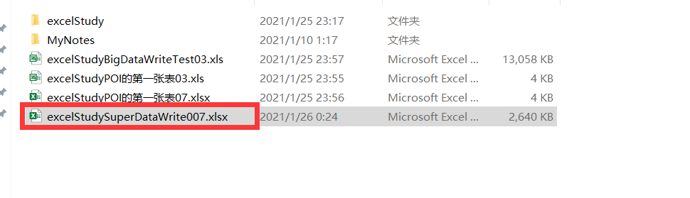

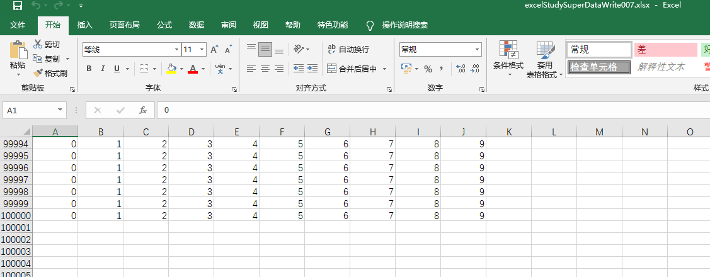

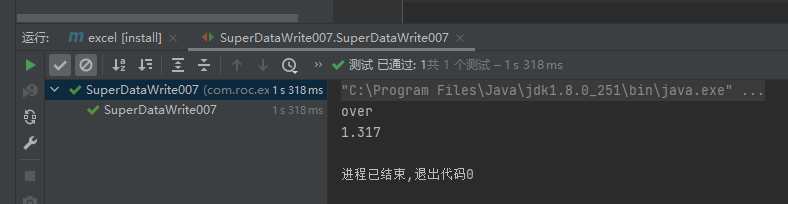

同样07的XSSF花费时间为：

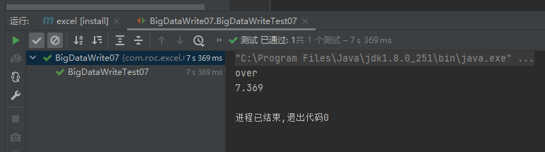

因此对比之下，可以选择SXSSF提高性能问题。

### 4.SpringBoot集成POI进行读文件

## POI和EasyExcel的相同点和区别

1.同样是第三方的组件对java操作Excel进行了优化。

2.实现的方式不同，两者存在性能上的问题：POI是将所有的数据一次性先写入内存，这样容易造成内存溢出，Easy Excel则是一条一条地读写数据，这样面对较大数据量时会存在时间成本问题。

**没有严格意义上的好坏，而是时间和空间的转换。**

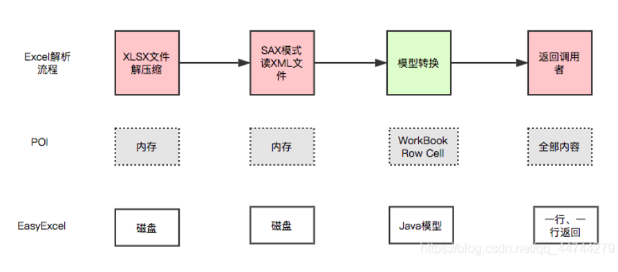