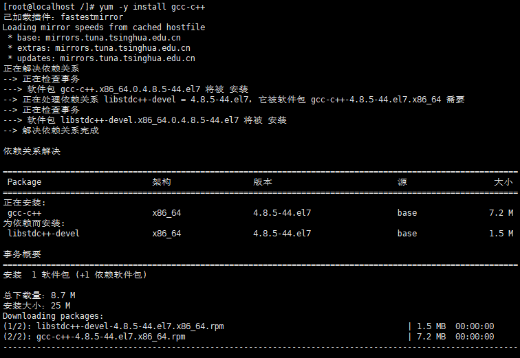

# Linux

## 1.Linux入门

### 1.1为什么要学Linux？

```xml
在服务器端，在开发领域Linux是越来越受欢迎。
java程序需要自己打包上传到Linux服务器上进行部署
```

### 1.2为什么选择Linux做服务器？

```xml
https://blog.csdn.net/qq_32468225/article/details/60466784?utm_medium=distribute.pc_relevant.none-task-blog-BlogCommendFromMachineLearnPai2-1.control&dist_request_id=8724efa4-bd73-4dc8-9778-09f4b5575371&depth_1-utm_source=distribute.pc_relevant.none-task-blog-BlogCommendFromMachineLearnPai2-1.control
```

### 1.3从零开始学习如何在Linux上部署Java web项目？

```xml
https://blog.csdn.net/weixin_33859231/article/details/87997997?utm_medium=distribute.pc_relevant.none-task-blog-BlogCommendFromMachineLearnPai2-1.control&dist_request_id=9ecdd955-9305-4dbd-b135-d7c4e798877a&depth_1-utm_source=distribute.pc_relevant.none-task-blog-BlogCommendFromMachineLearnPai2-1.control
```

## 2.linux简介

### 2.1.什么是Linux?

```xml
	Linux内核最初只是由芬兰人林纳斯.托瓦兹( Linus Torvalds )在赫尔辛基大学上学时出于个人爱好而编写的。
	Linux是一套免费使用和自由传播的类Unix操作系统,是一个基于POSIX (可移植操作系统接口)和UNIX的多用户、多任务、支持多线程和多CPU的操作系统。
	Linux能运行主要的UNIX工具软件、应用程序和网络协议。它支持32位和64位硬件。Linux继承了Unix以网络为核心的设计思想，是一个性能稳定的多用户网络操作系统。
```

### 2.2.Linux版本


### 2.3.Linux与windows的区别


## 3.Linux新系统搭建

> 安装CentOS（虚拟机安装，消耗本地相关资源）

### 3.1通过360软件管家一键式安装VMware虚拟机：激活码寻求网络援助


### 3.2购买云服务器（推荐）

虚拟机安装后占用空间，也会有些卡顿，我们作为程序员其实可以选择购买一台自己的服务器，这样的话更加接近真实线上工作；

#### 3.2.1阿里云购买服务器

https://www.aliyun.com/minisite/goods?userCode=0phtycgr

#### 3.2.2获取服务器的ip地址

获取服务器的ip地址及端口号，重置服务器密码，就可以远程登录了

#### 3.2.3下载 xShell 工具，进行远程连接使用！

##### 3.2.3.1**配置安全组**

##### 3.2.3.2通过公网IP地址进行访问

##### 3.2.3.3使用xsheel连接远程Linux服务器


使用xftp上传文件


### 3.3下载Linux

#### 2.3.1下载链接地址

##### 2.3.1.1简书教程

https://www.jianshu.com/p/a63f47e096e8

##### 2.3.1.2Linux阿里云国内镜像

###### 2.3.1.2.1CentOs：

centos07：http://mirrors.aliyun.com/centos/7/isos/x86_64/

centos08：http://mirrors.aliyun.com/centos/8/isos/x86_64/

###### 2.3.1.2.2ubuntu：

ubuntu20.04：http://mirrors.aliyun.com/ubuntu-releases/20.04/

ununtu21.04：http://mirrors.aliyun.com/ubuntu-releases/21.04/

### 3.4安装Linux

#### 3.4.1通过VMware新建虚拟机CentOS


#### 3.4.2通过Windows Store安装Ubuntu


## 4.Linux能做什么？

### 4.1应用领域

今天各种场合都有使用各种Linux发行版,从嵌入式设备到超级计算机,并且在服务器领域确定了地位,通常服务器使用LAMP(Linux + Apache + MySQL + PHP)或LNMP(Linux + Nginx + MySQL +
PHP)组合。

目前Linux不仅在家庭与企业中使用,并且在政府中也很受欢迎。

许多国家都在使用Linux系统

## 5.Linux系统的使用

### 5.1开机关机

#### 5.1.1开机

开机会启动许多程序。它们在Windows叫做"服务"（service），在Linux就叫做"守护进程"（daemon）。

开机成功后，它会显示一个文本登录界面，这个界面就是我们经常看到的登录界面，在这个登录界面中会提示用户输入用户名，而用户输入的用户将作为参数传给login程序来验证用户的身份，**密码是不显示的**，输完回车即可！

一般来说，用户的登录方式有三种：

- 命令行登录

- ssh登录

- 图形界面登录

**最高权限账户为 root，可以操作一切！**

#### 5.1.2关机

```xml
sync # 将数据由内存同步到硬盘中。
 
shutdown # 关机指令，你可以man shutdown 来看一下帮助文档。例如你可以运行如下命令关机：
 
shutdown –h 10 # 这个命令告诉大家，计算机将在10分钟后关机
 
shutdown –h now # 立马关机
 
shutdown –h 20:25 # 系统会在今天20:25关机
 
shutdown –h +10 # 十分钟后关机
 
shutdown –r now # 系统立马重启
 
shutdown –r +10 # 系统十分钟后重启
 
reboot # 就是重启，等同于 shutdown –r now
 
halt # 关闭系统，等同于shutdown –h now 和 poweroff
```

### 5.2Linux文件目录系统


以下是对这些目录的解释：

- /bin：bin是Binary的缩写, 这个目录存放着最经常使用的命令。

- /boot： 这里存放的是启动Linux时使用的一些核心文件，包括一些连接文件以及镜像文件。

- /dev ： dev是Device(设备)的缩写, 存放的是Linux的外部设备，在Linux中访问设备的方式和访问文件的方式是相同的。

- /etc： 这个目录用来存放所有的系统管理所需要的配置文件和子目录。

- /home：用户的主目录，在Linux中，每个用户都有一个自己的目录，一般该目录名是以用户的账号命名的。

- /lib：这个目录里存放着系统最基本的动态连接共享库，其作用类似于Windows里的DLL文件。

- /lost+found：这个目录一般情况下是空的，当系统非法关机后，这里就存放了一些文件。

- /media：linux系统会自动识别一些设备，例如U盘、光驱等等，当识别后，linux会把识别的设备挂载到这个目录下。

- /mnt：系统提供该目录是为了让用户临时挂载别的文件系统的，我们可以将光驱挂载在/mnt/上，然后进入该目录就可以查看光驱里的内容了。

- /opt：这是给主机额外安装软件所摆放的目录。比如你安装一个ORACLE数据库则就可以放到这个目录下。默认是空的。

- /proc：这个目录是一个虚拟的目录，它是系统内存的映射，我们可以通过直接访问这个目录来获取系统信息。

- /root：该目录为系统管理员，也称作超级权限者的用户主目录。

- /sbin：s就是Super User的意思，这里存放的是系统管理员使用的系统管理程序。

- /srv：该目录存放一些服务启动之后需要提取的数据。

- /sys：这是linux2.6内核的一个很大的变化。该目录下安装了2.6内核中新出现的一个文件系统 sysfs 。

- /tmp：这个目录是用来存放一些临时文件的。

- /usr：这是一个非常重要的目录，用户的很多应用程序和文件都放在这个目录下，类似于windows下的program files目录。

- /usr/bin： 系统用户使用的应用程序。

- /usr/sbin： 超级用户使用的比较高级的管理程序和系统守护程序。

- /usr/src： 内核源代码默认的放置目录。

- /var：这个目录中存放着在不断扩充着的东西，我们习惯将那些经常被修改的目录放在这个目录下。包括各种日志文件。

- /run：是一个临时文件系统，存储系统启动以来的信息。当系统重启时，这个目录下的文件应该被删掉或清除。
- /www：存放服务器网站相关的资源

### 5.3Linux基本的目录命令

#### 5.3.1处理目录的命令

- ls: 列出目录
- cd：切换目录
- pwd：显示目前的目录
- mkdir：创建一个新的目录
- rmdir：删除一个空的目录
- cp: 复制文件或目录
- rm: 移除文件或目录
- mv: 移动文件与目录，或修改文件与目录的名称

##### 5.3.1.1ls列出目录

- -a ：全部的文件，连同隐藏文件( 开头为 . 的文件) 一起列出来(常用)
- -l ：长数据串列出，包含文件的属性与权限等等数据；(常用)


##### 5.3.1.2cd 切换目录

```xml
# 切换到用户目录下
[root@kuangshen /]# cd home  
 
# 使用 mkdir 命令创建 kuangstudy 目录
[root@kuangshen home]# mkdir kuangstudy
 
# 进入 kuangstudy 目录
[root@kuangshen home]# cd kuangstudy
 
# 回到上一级
[root@kuangshen kuangstudy]# cd ..
 
# 回到根目录
[root@kuangshen kuangstudy]# cd /
 
# 表示回到自己的家目录，亦即是 /root 这个目录
[root@kuangshen kuangstudy]# cd ~
```

##### 5.3.1.3pwd ( 显示目前所在的目录 )

> 选项与参数：**-P** ：显示出确实的路径，而非使用连接(link) 路径。
>
> 

##### 5.3.1.4mkdir创建新目录

> - -m ：配置文件的权限喔！直接配置，不需要看默认权限 (umask) 的脸色～
> - -p ：帮助你直接将所需要的目录(包含上一级目录)递归创建起来！
>
> **mkdir -p test01/test02/test03**：递归创建test01下面的test02下面的test03

##### 5.3.1.5rmdir删除空的目录

> rmdir [-p] 目录名称

##### 5.3.1.6cp复制文件或目录

```xml
[root@www ~]# cp [-adfilprsu] 来源档(source) 目标档(destination)
[root@www ~]# cp [options] source1 source2 source3 .... directory

选项与参数：

-a：相当於 -pdr 的意思，至於 pdr 请参考下列说明；(常用)

-p：连同文件的属性一起复制过去，而非使用默认属性(备份常用)；

-d：若来源档为连结档的属性(link file)，则复制连结档属性而非文件本身；

-r：递归持续复制，用於目录的复制行为；(常用)

-f：为强制(force)的意思，若目标文件已经存在且无法开启，则移除后再尝试一次；

-i：若目标档(destination)已经存在时，在覆盖时会先询问动作的进行(常用)

-l：进行硬式连结(hard link)的连结档创建，而非复制文件本身。

-s：复制成为符号连结档 (symbolic link)，亦即『捷径』文件；

-u：若 destination 比 source 旧才升级 destination ！
```

##### 5.3.1.7rmdir移除文件或目录

```xml
# 将刚刚在 cp 的实例中创建的 install.sh删除掉！
[root@kuangshen home]# rm -i install.sh
rm: remove regular file ‘install.sh’? y
# 如果加上 -i 的选项就会主动询问喔，避免你删除到错误的档名！
 
# 尽量不要在服务器上使用  rm -rf /
```

> rmdir [-fir] 文件或目录
>
>选项与参数：
>
>- -f ：就是 force 的意思，忽略不存在的文件，不会出现警告信息；
>- -i ：互动模式，在删除前会询问使用者是否动作
>- -r ：递归删除啊！最常用在目录的删除了！这是非常危险的选项！！！

##### 5.3.1.8mv移动文件与目录，或修改名称

语法：

> mv [-fiu] source destination
> mv [options] source1 source2 source3 .... directory

选项与参数：

- -f ：force 强制的意思，如果目标文件已经存在，不会询问而直接覆盖；
- -i ：若目标文件 (destination) 已经存在时，就会询问是否覆盖！
- -u ：若目标文件已经存在，且 source 比较新，才会升级 (update)

### 5.4文件属性

在Linux中我们可以使用`ll`或者`ls –l`命令来显示一个文件的属性以及文件所属的用户和组


实例中，boot文件的第一个属性用"d"表示。"d"在Linux中代表该文件是一个目录文件。

在Linux中第一个字符代表这个文件是目录、文件或链接文件等等：

当为[ d ]则是目录

当为[ - ]则是文件；

若是[ l ]则表示为链接文档 ( link file )；

若是[ b ]则表示为装置文件里面的可供储存的接口设备 ( 可随机存取装置 )；

若是[ c ]则表示为装置文件里面的串行端口设备，例如键盘、鼠标 ( 一次性读取装置 )。

接下来的字符中，以三个为一组，且均为『rwx』 的三个参数的组合。

其中，[ r ]代表可读(read)、[ w ]代表可写(write)、[ x ]代表可执行(execute)。

要注意的是，这三个权限的位置不会改变，如果没有权限，就会出现减号[ - ]而已。

每个文件的属性由左边第一部分的10个字符来确定（如下图）：


从左至右用0-9这些数字来表示。

第0位确定文件类型，第1-3位确定属主（该文件的所有者）拥有该文件的权限。第4-6位确定属组（所有者的同组用户）拥有该文件的权限，第7-9位确定其他用户拥有该文件的权限。

其中：

第1、4、7位表示读权限，如果用"r"字符表示，则有读权限，如果用"-"字符表示，则没有读权限；

第2、5、8位表示写权限，如果用"w"字符表示，则有写权限，如果用"-"字符表示没有写权限；

第3、6、9位表示可执行权限，如果用"x"字符表示，则有执行权限，如果用"-"字符表示，则没有执行权限。

> 修改文件属性

1、chgrp：更改文件属组

```xml
chgrp [-R] 属组名 文件名
-R：递归更改文件属组，就是在更改某个目录文件的属组时，如果加上-R的参数，那么该目录下的所有文件的属组都会更改。
```

2、chown：更改文件属主，也可以同时更改文件属组

```xml
chown [–R] 属主名 文件名
chown [-R] 属主名：属组名 文件名
```

3、chmod：更改文件9个属性

```xml
chmod [-R] xyz 文件或目录
```

Linux文件属性有两种设置方法，一种是数字，一种是符号。

Linux文件的基本权限就有九个，分别是owner/group/others，三种身份各有自己的read/write/execute权限。

文件的权限字符为：『-rwxrwxrwx』， 这九个权限是三个三个一组的！其中，我们可以使用数字来代表各个权限，各权限的分数对照表如下：

```xml
read:4

write:2

excute:1
```

每种身份(owner/group/others)各自的三个权限(r/w/x)分数是需要累加的，例如当权限为：[-rwxrwx---] 分数则是：

owner = rwx = 4+2+1 = 7

group = rwx = 4+2+1 = 7

others= --- = 0+0+0 = 0

### 5.5文件内容查看

#### 5.5.1cat 由第一行开始显示文件内容

```xml
cat [-AbEnTv]

-A ：相当於 -vET 的整合选项，可列出一些特殊字符而不是空白而已；

-b ：列出行号，仅针对非空白行做行号显示，空白行不标行号！

-E ：将结尾的断行字节 $ 显示出来；

-n ：列印出行号，连同空白行也会有行号，与 -b 的选项不同；

-T ：将 [tab] 按键以 ^I 显示出来；

-v ：列出一些看不出来的特殊字符
```

测试：


#### 5.5.2tac 从最后一行开始显示，可以看出 tac 是 cat 的倒着写！

测试：


#### 5.5.3nl 显示的时候，顺道输出行号！

语法：

```xml
nl [-bnw] 文件
```

选项与参数：

```xml
-b ：指定行号指定的方式，主要有两种：-b a ：表示不论是否为空行，也同样列出行号(类似 cat -n)；-b t ：如果有空行，空的那一行不要列出行号(默认值)；

-n ：列出行号表示的方法，主要有三种：-n ln ：行号在荧幕的最左方显示；-n rn ：行号在自己栏位的最右方显示，且不加 0 ；-n rz ：行号在自己栏位的最右方显示，且加 0 ；

-w ：行号栏位的占用的位数。
```

测试：


#### 5.5.4more 一页一页翻动显示显示文件内容

```xml
在 more 这个程序的运行过程中，你有几个按键可以按的：

空白键 (space)：代表向下翻一页；

Enter     ：代表向下翻『一行』；

/字串     ：代表在这个显示的内容当中，向下搜寻『字串』这个关键字；

:f	：立刻显示出档名以及目前显示的行数；

q	：代表立刻离开 more ，不再显示该文件内容。

b 或 [ctrl]-b ：代表往回翻页，不过这动作只对文件有用，对管线无用。
```

测试：


#### 5.5.5less 与 more 类似，但是比 more 更好的是，他可以往前翻页！

```xml
less运行时可以输入的命令有：

空白键  ：向下翻动一页；

[pagedown]：向下翻动一页；

[pageup] ：向上翻动一页；

/字串   ：向下搜寻『字串』的功能；

?字串   ：向上搜寻『字串』的功能；

n     ：重复前一个搜寻 (与 / 或 ? 有关！)

N     ：反向的重复前一个搜寻 (与 / 或 ? 有关！)

q     ：离开 less 这个程序；
```

测试：

#### 5.5.6head 只看头几行

语法：

```xml
head [-n number] 文件
```

选项与参数：

**-n** 后面接数字，代表显示几行的意思！

默认的情况中，显示前面 10 行！若要显示前 20 行，就得要这样：

head - n 20 filename

测试：


#### 5.5.7tail 只看尾巴几行

语法：

```xml
tail [-n number] 文件名称
```

选项与参数：

**-n** 后面接数字，代表显示几行的意思

默认的情况中，显示后面10 行！若要显示后20 行，就得要这样：

```xml
tail -n 20 filename
```


### 5.6硬链接与软链接

Linux 链接分两种，一种被称为硬链接（Hard Link），另一种被称为符号链接（Symbolic Link）。

情况下，**ln** 命令产生硬链接。

**硬链接：**硬连接指通过索引节点来进行连接。

在 Linux 的文件系统中，保存在磁盘分区中的文件不管是什么类型都给它分配一个编号，称为索引节点号(Inode Index)。在 Linux 中，多个文件名指向同一索引节点是存在的。

硬连接的作用是允许一个文件拥有多个有效路径名，这样用户就可以建立硬连接到重要文件，以防止“误删”的功能。

**软链接：**类似windows中的快捷方式，删除源文件，快捷方式访问不了。

测试命令：

```xml
[root@kuangshen /]# cd /home
[root@kuangshen home]# touch f1  # 创建一个测试文件f1
[root@kuangshen home]# ls
f1
[root@kuangshen home]# ln f1 f2      # 创建f1的一个硬连接文件f2
[root@kuangshen home]# ln -s f1 f3   # 创建f1的一个符号连接文件f3
[root@kuangshen home]# ls -li        # -i参数显示文件的inode节点信息
397247 -rw-r--r-- 2 root  root     0 Mar 13 00:50 f1
397247 -rw-r--r-- 2 root  root     0 Mar 13 00:50 f2
397248 lrwxrwxrwx 1 root  root     2 Mar 13 00:50 f3 -> f1
```

### 5.7Vim

#### 5.7.1Vim是什么？


#### 5.7.2vim的三种使用模式及常用命令及模式流转

##### 5.7.2.1命令模式

用户刚刚启动 vi/vim，便进入了命令模式。

此状态下敲击键盘动作会被Vim识别为命令，而非输入字符。比如我们此时按下i，并不会输入一个字符，i被当作了一个命令。

以下是常用的几个命令：

- **i** 切换到输入模式，以输入字符。
- **x** 删除当前光标所在处的字符。
- **:** 切换到底线命令模式，以在最底一行输入命令

命令模式只有一些最基本的命令，因此仍要依靠底线命令模式输入更多命令。

##### 5.7.2.2输入模式

在命令模式下按下i就进入了输入模式。

在输入模式中，可以使用以下按键：

- **字符按键以及Shift组合**，输入字符
- **ENTER**，回车键，换行
- **BACK SPACE**，退格键，删除光标前一个字符
- **DEL**，删除键，删除光标后一个字符
- **方向键**，在文本中移动光标
- **HOME**/**END**，移动光标到行首/行尾
- **Page Up**/**Page Down**，上/下翻页
- **Insert**，切换光标为输入/替换模式，光标将变成竖线/下划线
- **ESC**，退出输入模式，切换到命令模式

##### 5.7.2.3底线命令模式

在命令模式下按下:（英文冒号）就进入了底线命令模式。

底线命令模式可以输入单个或多个字符的命令，可用的命令非常多。

在底线命令模式中，基本的命令有（已经省略了冒号）：

- q 退出程序
- w 保存文件

按ESC键可随时退出底线命令模式。

##### 5.7.2.3模式流转图


5.7.3Vim按键说明

**一般模式可用的光标移动、复制粘贴、搜索替换等**

| 移动光标的方法     |                                                              |
| :----------------- | ------------------------------------------------------------ |
| h 或 向左箭头键(←) | 光标向左移动一个字符                                         |
| j 或 向下箭头键(↓) | 光标向下移动一个字符                                         |
| k 或 向上箭头键(↑) | 光标向上移动一个字符                                         |
| l 或 向右箭头键(→) | 光标向右移动一个字符                                         |
| [Ctrl] + [f]       | 屏幕『向下』移动一页，相当于 [Page Down]按键 (常用)          |
| [Ctrl] + [b]       | 屏幕『向上』移动一页，相当于 [Page Up] 按键 (常用)           |
| [Ctrl] + [d]       | 屏幕『向下』移动半页                                         |
| [Ctrl] + [u]       | 屏幕『向上』移动半页                                         |
| +                  | 光标移动到非空格符的下一行                                   |
| -                  | 光标移动到非空格符的上一行                                   |
| n< space>          | 那个 n 表示『数字』，例如 20 。按下数字后再按空格键，光标会向右移动这一行的 n 个字符。 |
| 0 或功能键[Home]   | 这是数字『 0 』：移动到这一行的最前面字符处 (常用)           |
| $ 或功能键[End]    | 移动到这一行的最后面字符处(常用)                             |
| H                  | 光标移动到这个屏幕的最上方那一行的第一个字符                 |
| M                  | 光标移动到这个屏幕的中央那一行的第一个字符                   |
| L                  | 光标移动到这个屏幕的最下方那一行的第一个字符                 |
| G                  | 移动到这个档案的最后一行(常用)                               |
| nG                 | n 为数字。移动到这个档案的第 n 行。例如 20G 则会移动到这个档案的第 20 行(可配合 :set nu) |
| gg                 | 移动到这个档案的第一行，相当于 1G 啊！(常用)                 |
| n< Enter>          | n 为数字。光标向下移动 n 行(常用)                            |

| 搜索替换 |                                                              |
| :------- | ------------------------------------------------------------ |
| /word    | 向光标之下寻找一个名称为 word 的字符串。例如要在档案内搜寻 vbird 这个字符串，就输入 /vbird 即可！(常用) |
| ?word    | 向光标之上寻找一个字符串名称为 word 的字符串。               |
| n        | 这个 n 是英文按键。代表重复前一个搜寻的动作。举例来说， 如果刚刚我们执行 /vbird 去向下搜寻 vbird 这个字符串，则按下 n 后，会向下继续搜寻下一个名称为 vbird 的字符串。如果是执行 ?vbird 的话，那么按下 n 则会向上继续搜寻名称为 vbird 的字符串！ |
| N        | 这个 N 是英文按键。与 n 刚好相反，为『反向』进行前一个搜寻动作。例如 /vbird 后，按下 N 则表示『向上』搜寻 vbird 。 |

| 删除、复制与粘贴 |                                                              |
| :--------------- | ------------------------------------------------------------ |
| x, X             | 在一行字当中，x 为向后删除一个字符 (相当于 [del] 按键)， X 为向前删除一个字符(相当于 [backspace] 亦即是退格键) (常用) |
| nx               | n 为数字，连续向后删除 n 个字符。举例来说，我要连续删除 10 个字符， 『10x』。 |
| dd               | 删除游标所在的那一整行(常用)                                 |
| ndd              | n 为数字。删除光标所在的向下 n 行，例如 20dd 则是删除 20 行 (常用) |
| d1G              | 删除光标所在到第一行的所有数据                               |
| dG               | 删除光标所在到最后一行的所有数据                             |
| d$               | 删除游标所在处，到该行的最后一个字符                         |
| d0               | 那个是数字的 0 ，删除游标所在处，到该行的最前面一个字符      |
| yy               | 复制游标所在的那一行(常用)                                   |
| nyy              | n 为数字。复制光标所在的向下 n 行，例如 20yy 则是复制 20 行(常用) |
| y1G              | 复制游标所在行到第一行的所有数据                             |
| yG               | 复制游标所在行到最后一行的所有数据                           |
| y0               | 复制光标所在的那个字符到该行行首的所有数据                   |
| y$               | 复制光标所在的那个字符到该行行尾的所有数据                   |
| p, P             | p 为将已复制的数据在光标下一行贴上，P 则为贴在游标上一行！举例来说，我目前光标在第 20 行，且已经复制了 10 行数据。则按下 p 后， 那 10 行数据会贴在原本的 20 行之后，亦即由 21 行开始贴。但如果是按下 P 呢？那么原本的第 20 行会被推到变成 30 行。(常用) |
| J                | 将光标所在行与下一行的数据结合成同一行                       |
| c                | 重复删除多个数据，例如向下删除 10 行，[ 10cj ]               |
| u                | 复原前一个动作。(常用)                                       |
| [Ctrl]+r         | 重做上一个动作。(常用)                                       |

**第二部分：一般模式切换到编辑模式的可用的按钮说明**

| 进入输入或取代的编辑模式 |                                                              |
| :----------------------- | ------------------------------------------------------------ |
| i, I                     | 进入输入模式(Insert mode)：i 为『从目前光标所在处输入』， I 为『在目前所在行的第一个非空格符处开始输入』。(常用) |
| a, A                     | 进入输入模式(Insert mode)：a 为『从目前光标所在的下一个字符处开始输入』， A 为『从光标所在行的最后一个字符处开始输入』。(常用) |
| o, O                     | 进入输入模式(Insert mode)：这是英文字母 o 的大小写。o 为『在目前光标所在的下一行处输入新的一行』；O 为在目前光标所在处的上一行输入新的一行！(常用) |
| r, R                     | 进入取代模式(Replace mode)：r 只会取代光标所在的那一个字符一次；R会一直取代光标所在的文字，直到按下 ESC 为止；(常用) |
| [Esc]                    | 退出编辑模式，回到一般模式中(常用)                           |

**第三部分：一般模式切换到指令行模式的可用的按钮说明**

| 指令行的储存、离开等指令                                     |                                                              |
| :----------------------------------------------------------- | ------------------------------------------------------------ |
| :w                                                           | 将编辑的数据写入硬盘档案中(常用)                             |
| :w!                                                          | 若文件属性为『只读』时，强制写入该档案。不过，到底能不能写入， 还是跟你对该档案的档案权限有关啊！ |
| :q                                                           | 离开 vi (常用)                                               |
| :q!                                                          | 若曾修改过档案，又不想储存，使用 ! 为强制离开不储存档案。    |
| 注意一下啊，那个惊叹号 (!) 在 vi 当中，常常具有『强制』的意思～ |                                                              |
| :wq                                                          | 储存后离开，若为 :wq! 则为强制储存后离开 (常用)              |
| ZZ                                                           | 这是大写的 Z 喔！若档案没有更动，则不储存离开，若档案已经被更动过，则储存后离开！ |
| :w [filename]                                                | 将编辑的数据储存成另一个档案（类似另存新档）                 |
| :r [filename]                                                | 在编辑的数据中，读入另一个档案的数据。亦即将 『filename』 这个档案内容加到游标所在行后面 |
| :n1,n2 w [filename]                                          | 将 n1 到 n2 的内容储存成 filename 这个档案。                 |
| :! command                                                   | 暂时离开 vi 到指令行模式下执行 command 的显示结果！例如 『:! ls /home』即可在 vi 当中看 /home 底下以 ls 输出的档案信息！ |
| :set nu                                                      | 显示行号，设定之后，会在每一行的前缀显示该行的行号           |
| :set nonu                                                    | 与 set nu 相反，为取消行号！                                 |

### 5.8账号管理

> Linux系统是一个多用户多任务的分时操作系统，任何一个要使用系统资源的用户，都必须首先向系统管理员申请一个账号，然后以这个账号的身份进入系统。
>
> 用户的账号一方面可以帮助系统管理员对使用系统的用户进行跟踪，并控制他们对系统资源的访问；另一方面也可以帮助用户组织文件，并为用户提供安全性保护。
>
> 每个用户账号都拥有一个唯一的用户名和各自的口令。
>
> 用户在登录时键入正确的用户名和口令后，就能够进入系统和自己的主目录。
>
> 实现用户账号的管理，要完成的工作主要有如下几个方面：
>
> - 用户账号的添加、删除与修改。
> - 用户口令的管理。
> - 用户组的管理。

#### 5.8.1添加用户

> 添加账号 useradd

```
useradd 选项 用户名
```

参数说明：

- 选项 :

-
    - -c comment 指定一段注释性描述。
    - -d 目录 指定用户主目录，如果此目录不存在，则同时使用-m选项，可以创建主目录。
    - -g 用户组 指定用户所属的用户组。
    - -G 用户组，用户组 指定用户所属的附加组。
    - -m 使用者目录如不存在则自动建立。
    - -s Shell文件 指定用户的登录Shell。
    - -u 用户号 指定用户的用户号，如果同时有-o选项，则可以重复使用其他用户的标识号。

- 用户名 :

-
    - 指定新账号的登录名。

#### 5.8.2切换用户

1.切换用户的命令为：su username 【username是你的用户名哦】

2.从普通用户切换到root用户，还可以使用命令：sudo su

3.在终端输入exit或logout或使用快捷方式ctrl+d，可以退回到原来用户，其实ctrl+d也是执行的exit命令

4.在切换用户时，如果想在切换用户之后使用新用户的工作环境，可以在su和username之间加-，例如：【su - root】

**$表示普通用户**

**\#表示超级用户，也就是root用户**

#### 5.8.3删除用户

如果一个用户的账号不再使用，可以从系统中删除。

删除用户账号就是要将/etc/passwd等系统文件中的该用户记录删除，必要时还删除用户的主目录。

删除一个已有的用户账号使用userdel命令，其格式如下：

```xml
userdel 选项 用户名
```

常用的选项是 **-r**，它的作用是把用户的主目录一起删除。

```xml
[root@kuangshen home]# userdel -r kuangshen
```

此命令删除用户kuangshen在系统文件中（主要是/etc/passwd, /etc/shadow, /etc/group等）的记录，同时删除用户的主目录。

#### 5.8.4修改账户

修改用户账号就是根据实际情况更改用户的有关属性，如用户号、主目录、用户组、登录Shell等。

修改已有用户的信息使用usermod命令，其格式如下：

```xml
usermod 选项 用户名
```

常用的选项包括-c, -d, -m, -g, -G, -s, -u以及-o等，这些选项的意义与useradd命令中的选项一样，可以为用户指定新的资源值。

#### 5.8.5修改用户的密码

用户管理的一项重要内容是用户口令的管理。用户账号刚创建时没有口令，但是被系统锁定，无法使用，必须为其指定口令后才可以使用，即使是指定空口令。

指定和修改用户口令的Shell命令是passwd。超级用户可以为自己和其他用户指定口令，普通用户只能用它修改自己的口令。

命令的格式为：

```
passwd 选项 用户名
```

可使用的选项：

- -l 锁定口令，即禁用账号。
- -u 口令解锁，即解禁账户。
- -d 使账号无口令。
- -f 强迫用户下次登录时修改口令。

如果默认用户名，则修改当前用户的口令。

### 5.9用户组管理

每个用户都有一个用户组，系统可以对一个用户组中的所有用户进行集中管理。不同Linux 系统对用户组的规定有所不同，如Linux下的用户属于与它同名的用户组，这个用户组在创建用户时同时创建。

**用户组的管理涉及用户组的添加、删除和修改。组的增加、删除和修改实际上就是对/etc/group文件的更新。**

#### 5.9.1增加一个新的用户组使用groupadd命令

```
groupadd 选项 用户组
```

可以使用的选项有：

- -g GID 指定新用户组的组标识号（GID）。
- -o 一般与-g选项同时使用，表示新用户组的GID可以与系统已有用户组的GID相同。

#### 5.9.2删除一个已有的用户组，使用groupdel命令

```xml
groupdel 用户组
```

#### 5.9.3修改组的名字及gid号

```
groupmod 选项 用户组
```

常用的选项有：

- -g GID 为用户组指定新的组标识号。
- -o 与-g选项同时使用，用户组的新GID可以与系统已有用户组的GID相同。
- -n新用户组 将用户组的名字改为新名字

```
# 此命令将组group2的组标识号修改为102。
groupmod -g 102 group2

# 将组group2的标识号改为10000，组名修改为group3。
groupmod –g 10000 -n group3 group2
```

#### 5.9.4切换组

> 切换组

如果一个用户同时属于多个用户组，那么用户可以在用户组之间切换，以便具有其他用户组的权限。

用户可以在登录后，使用命令newgrp切换到其他用户组，这个命令的参数就是目的用户组。例如：

```
$ newgrp root
```

这条命令将当前用户切换到root用户组，前提条件是root用户组确实是该用户的主组或附加组。

#### 5.9.5用户相关拓展

##### 5.9.5.1etc/passwd

完成用户管理的工作有许多种方法，但是每一种方法实际上都是对有关的系统文件进行修改。

与用户和用户组相关的信息都存放在一些系统文件中，这些文件包括/etc/passwd, /etc/shadow, /etc/group等。

下面分别介绍这些文件的内容。

**/etc/passwd文件是用户管理工作涉及的最重要的一个文件。**

Linux系统中的每个用户都在/etc/passwd文件中有一个对应的记录行，它记录了这个用户的一些基本属性。

```
＃ cat /etc/passwd
```


从上面的例子我们可以看到，/etc/passwd中一行记录对应着一个用户，每行记录又被冒号(:)分隔为7个字段，其格式和具体含义如下：

```
用户名:口令:用户标识号:组标识号:注释性描述:主目录:登录Shell
```

这里的**口令=密码**

1）"用户名"是代表用户账号的字符串。

通常长度不超过8个字符，并且由大小写字母和/或数字组成。登录名中不能有冒号(:)，因为冒号在这里是分隔符。

为了兼容起见，登录名中最好不要包含点字符(.)，并且不使用连字符(-)和加号(+)打头。

2）“口令”一些系统中，存放着加密后的用户口令字。

虽然这个字段存放的只是用户口令的加密串，不是明文，但是由于/etc/passwd文件对所有用户都可读，所以这仍是一个安全隐患。因此，现在许多Linux
系统（如SVR4）都使用了shadow技术，把真正的加密后的用户口令字存放到/etc/shadow文件中，而在/etc/passwd文件的口令字段中只存放一个特殊的字符，例如“x”或者“*”。

3）“用户标识号”是一个整数，系统内部用它来标识用户。

**一般情况下它与用户名是一一对应的。如果几个用户名对应的用户标识号是一样的，系统内部将把它们视为同一个用户，但是它们可以有不同的口令、不同的主目录以及不同的登录Shell等。**

**通常用户标识号的取值范围是0～65 535。0是超级用户root的标识号，1～99由系统保留，作为管理账号，普通用户的标识号从100开始。在Linux系统中，这个界限是500。**

4）“组标识号”字段记录的是用户所属的用户组。

它对应着/etc/group文件中的一条记录。

5)“注释性描述”字段记录着用户的一些个人情况。

例如用户的真实姓名、电话、地址等，这个字段并没有什么实际的用途。在不同的Linux 系统中，这个字段的格式并没有统一。在许多Linux系统中，这个字段存放的是一段任意的注释性描述文字，用作finger命令的输出。

6)“主目录”，也就是用户的起始工作目录。

它是用户在登录到系统之后所处的目录。在大多数系统中，各用户的主目录都被组织在同一个特定的目录下，而用户主目录的名称就是该用户的登录名。各用户对自己的主目录有读、写、执行（搜索）权限，其他用户对此目录的访问权限则根据具体情况设置。

7)用户登录后，要启动一个进程，负责将用户的操作传给内核，这个进程是用户登录到系统后运行的命令解释器或某个特定的程序，即Shell。

Shell是用户与Linux系统之间的接口。Linux的Shell有许多种，每种都有不同的特点。常用的有sh(Bourne Shell), csh(C Shell), ksh(Korn Shell), tcsh(TENEX/TOPS-20
type C Shell), bash(Bourne Again Shell)等。

系统管理员可以根据系统情况和用户习惯为用户指定某个Shell。如果不指定Shell，那么系统使用sh为默认的登录Shell，即这个字段的值为/bin/sh。

用户的登录Shell也可以指定为某个特定的程序（此程序不是一个命令解释器）。

利用这一特点，我们可以限制用户只能运行指定的应用程序，在该应用程序运行结束后，用户就自动退出了系统。有些Linux 系统要求只有那些在系统中登记了的程序才能出现在这个字段中。

8)系统中有一类用户称为伪用户（pseudo users）。

这些用户在/etc/passwd文件中也占有一条记录，但是不能登录，因为它们的登录Shell为空。它们的存在主要是方便系统管理，满足相应的系统进程对文件属主的要求。

##### 5.9.5.2/etc/shadow

的文件格式与/etc/passwd类似，由若干个字段组成，字段之间用":"隔开。这些字段是：

```
登录名:加密口令:最后一次修改时间:最小时间间隔:最大时间间隔:警告时间:不活动时间:失效时间:标志
```


1. "登录名"是与/etc/passwd文件中的登录名相一致的用户账号
2. "口令"字段存放的是加密后的用户口令字，长度为13个字符。如果为空，则对应用户没有口令，登录时不需要口令；如果含有不属于集合 { ./0-9A-Za-z }中的字符，则对应的用户不能登录。
3. "最后一次修改时间"表示的是从某个时刻起，到用户最后一次修改口令时的天数。时间起点对不同的系统可能不一样。例如在SCO Linux 中，这个时间起点是1970年1月1日。
4. "最小时间间隔"指的是两次修改口令之间所需的最小天数。
5. "最大时间间隔"指的是口令保持有效的最大天数。
6. "警告时间"字段表示的是从系统开始警告用户到用户密码正式失效之间的天数。
7. "不活动时间"表示的是用户没有登录活动但账号仍能保持有效的最大天数。
8. "失效时间"字段给出的是一个绝对的天数，如果使用了这个字段，那么就给出相应账号的生存期。期满后，该账号就不再是一个合法的账号，也就不能再用来登录了。

##### 5.9.5.3/etc/group

> /etc/group

用户组的所有信息都存放在/etc/group文件中。

将用户分组是Linux 系统中对用户进行管理及控制访问权限的一种手段。

每个用户都属于某个用户组；一个组中可以有多个用户，一个用户也可以属于不同的组。

当一个用户同时是多个组中的成员时，在/etc/passwd文件中记录的是用户所属的主组，也就是登录时所属的默认组，而其他组称为附加组。

用户要访问属于附加组的文件时，必须首先使用newgrp命令使自己成为所要访问的组中的成员。

用户组的所有信息都存放在/etc/group文件中。此文件的格式也类似于/etc/passwd文件，由冒号(:)隔开若干个字段，这些字段有：

```
组名:口令:组标识号:组内用户列表
```

1. "组名"是用户组的名称，由字母或数字构成。与/etc/passwd中的登录名一样，组名不应重复。
2. "口令"字段存放的是用户组加密后的口令字。一般Linux 系统的用户组都没有口令，即这个字段一般为空，或者是*。
3. "组标识号"与用户标识号类似，也是一个整数，被系统内部用来标识组。
4. "组内用户列表"是属于这个组的所有用户的列表/b]，不同用户之间用逗号(,)分隔。这个用户组可能是用户的主组，也可能是附加组。

### 5.10磁盘管理

Linux磁盘管理好坏直接关系到整个系统的性能问题。

Linux磁盘管理常用命令为 df、du。

- df ：列出文件系统的整体磁盘使用量
- du：检查磁盘空间使用量

#### 5.10.1df

df命令参数功能：检查文件系统的磁盘空间占用情况。可以利用该命令来获取硬盘被占用了多少空间，目前还剩下多少空间等信息。

语法：

```
df [-ahikHTm] [目录或文件名]
```

选项与参数：

- -a ：列出所有的文件系统，包括系统特有的 /proc 等文件系统；
- -k ：以 KBytes 的容量显示各文件系统；
- -m ：以 MBytes 的容量显示各文件系统；
- -h ：以人们较易阅读的 GBytes, MBytes, KBytes 等格式自行显示；
- -H ：以 M=1000K 取代 M=1024K 的进位方式；
- -T ：显示文件系统类型, 连同该 partition 的 filesystem 名称 (例如 ext3) 也列出；
- -i ：不用硬盘容量，而以 inode 的数量来显示


#### 5.10.2du

> du

Linux du命令也是查看使用空间的，但是与df命令不同的是Linux du命令是对文件和目录磁盘使用的空间的查看，还是和df命令有一些区别的，这里介绍Linux du命令。

语法：

```
du [-ahskm] 文件或目录名称
```

选项与参数：

- -a ：列出所有的文件与目录容量，因为默认仅统计目录底下的文件量而已。
- -h ：以人们较易读的容量格式 (G/M) 显示；
- -s ：列出总量而已，而不列出每个各别的目录占用容量；
- -S ：不包括子目录下的总计，与 -s 有点差别。
- -k ：以 KBytes 列出容量显示；
- -m ：以 MBytes 列出容量显示；


#### 5.10.3磁盘挂载与卸除

根文件系统之外的其他文件要想能够被访问，都必须通过“关联”至根文件系统上的某个目录来实现，此关联操作即为“挂载”，此目录即为“挂载点”,解除此关联关系的过程称之为“卸载”

Linux 的磁盘挂载使用mount命令，卸载使用umount命令。

磁盘挂载语法：

```
mount [-t 文件系统] [-L Label名] [-o 额外选项] [-n] 装置文件名 挂载点
```

测试：

```
# 将 /dev/hdc6 挂载到 /mnt/hdc6 上面！
[root@www ~]# mkdir /mnt/hdc6
[root@www ~]# mount /dev/hdc6 /mnt/hdc6
[root@www ~]# df
Filesystem           1K-blocks     Used Available Use% Mounted on
/dev/hdc6              1976312     42072   1833836   3% /mnt/hdc6
```

磁盘卸载命令 umount 语法：

```
umount [-fn] 装置文件名或挂载点
```

选项与参数：

- -f ：强制卸除！可用在类似网络文件系统 (NFS) 无法读取到的情况下；
- -n ：不升级 /etc/mtab 情况下卸除。

卸载/dev/hdc6

```
[root@www ~]# umount /dev/hdc6
```

### 5.11进程管理

#### 5.11.1什么是进程？

1、在Linux中 ,每一个程序都是有自己的一个进程,每一个进程都有一个id号!

2、每一个进程呢,都会有一个父进程!

3、进程可以有两种存在方式:前台!后台运行!

4、一般的话服务都是后台运行的，基本的程序都是前台运行的。

#### 5.11.2ps 查看当前系统中正在执行的各种进程的信息！

##### 5.11.2.1ps- xx：

-a 显示当前终端所有的进程信息 -u 以用户的信息显示进程 -x 显示后台运行进程的参数#ps -aux 查看所有进程

```xml
#ps -aux  查看所有进程
ps-aux|grep mysql  查看mysql相关进程
# | 在Linux中这个叫管道符   A|B
# grep 查找文件中符合条件的字符串
```

对于我们来说,这里目前只需要记住一个命令即可ps -xx|grep进程名字!过滤进程信息!


##### 5.11.2.2ps-ef ：可以查看到父进程的信息

```tex
进程树

pstree -pu

-p 显示父id

-u 显示用户组
```

##### 5.11.2.3结束进程：杀掉进程 等价于Windows结束任务

```bash
kill -9 pid
```

表示强制结束该进程

### 5.12安装开发环境

#### 5.12.1安装开发环境的三种方式

##### 5.12.1.1rpm（java jdk安装）

###### 5.12.1.1.1下载java的rpm包

下载地址：http://www.oracle.com/technetwork/java/javase/downloads/index.html

###### 5.12.1.1.2使用xftp上传到linux系统中


###### 5.12.1.1.3使用rpm命令进行安装

```bash
[root@localhost java]# rpm -ivh jdk-8u291-linux-x64.rpm

警告：jdk-8u291-linux-x64.rpm: 头V3 RSA/SHA256 Signature, 密钥 ID ec551f03: NOKEY
准备中...                          ################################# [100%]
正在升级/安装...
   1:jdk1.8-2000:1.8.0_291-fcs        ################################# [100%]
Unpacking JAR files...
	tools.jar...
	plugin.jar...
	javaws.jar...
	deploy.jar...
	rt.jar...
	jsse.jar...
	charsets.jar...
	localedata.jar...
```


###### 5.12.1.1.4配置环境变量

rpm安装不需要配置环境变量

##### 5.12.1.2解压缩（Tomcat安装）

1、安装好了Java环境后我们可以测试下Tomcat！准备好Tomcat的安装包！

2、将文件移动到/usr/tomcat/下，并解压！

```
[root@kuangshen kuangshen]# mv apache-tomcat-9.0.22.tar.gz /usr
[root@kuangshen kuangshen]# cd /usr
[root@kuangshen usr]# ls
apache-tomcat-9.0.22.tar.gz
[root@kuangshen usr]# tar -zxvf apache-tomcat-9.0.22.tar.gz   # 解压
```

3、运行Tomcat，进入bin目录，和我们以前在Windows下看的都是一样的

```
# 执行：startup.sh -->启动tomcat
# 执行：shutdown.sh -->关闭tomcat
./startup.sh
./shutdown.sh
```

4、确保Linux的防火墙端口是开启的，如果是阿里云，需要保证阿里云的安全组策略是开放的！

```
# 查看firewall服务状态
systemctl status firewalld

# 开启、重启、关闭、firewalld.service服务
# 开启
service firewalld start
# 重启
service firewalld restart
# 关闭
service firewalld stop

# 查看防火墙规则
firewall-cmd --list-all    # 查看全部信息
firewall-cmd --list-ports  # 只看端口信息

# 开启端口
开端口命令：firewall-cmd --zone=public --add-port=80/tcp --permanent
重启防火墙：systemctl restart firewalld.service

命令含义：
--zone #作用域
--add-port=80/tcp  #添加端口，格式为：端口/通讯协议
--permanent   #永久生效，没有此参数重启后失效
```

##### 5.12.1.3yum在线安装（CentOS07下Docker安装）

官方参考手册：https://docs.docker.com/install/linux/docker-ce/centos/

相关准备卸载及安装：

总过程：

```xml
#1.卸载旧版本
yum remove docker \
                  docker-client \
                  docker-client-latest \
                  docker-common \
                  docker-latest \
                  docker-latest-logrotate \
                  docker-logrotate \
                  docker-engine
#2.需要的安装包
yum install -y yum-utils

#3.设置镜像的仓库--------替换阿里云的镜像
yum-config-manager \
    --add-repo \
    https://download.docker.com/linux/centos/docker-ce.repo
#上述方法默认是从国外的，不推荐

#推荐使用国内的
yum-config-manager \
    --add-repo \
    https://mirrors.aliyun.com/docker-ce/linux/centos/docker-ce.repo

#4. 更新yum软件包索引
yum makecache fast

#5.安装docker相关的 docker-ce 社区版 而ee是企业版
#  这里我们使用社区版即可
yum install docker-ce docker-ce-cli containerd.io 

#6.启动docker
systemctl start docker

#7. 配置阿里云加速器
7.1.
sudo mkdir -p /etc/docker

7.2.
sudo tee /etc/docker/daemon.json <<-'EOF'
{
  "registry-mirrors": ["https://7cfs6kw9.mirror.aliyuncs.com"]
}
EOF

7.3.
sudo systemctl daemon-reload

7.4.
sudo systemctl restart docker

#8. 使用docker version查看是否按照成功
docker version

#9. 测试
docker run hello-world
```

###### 5.12.1.3.1利用yum移除docker，卸载旧版本

```xml
yum remove docker \
          docker-client \
          docker-client-latest \
          docker-common \
          docker-latest \
          docker-latest-logrotate \
          docker-logrotate \
          docker-engine
```


###### 5.12.1.3.2安装yum相关组件

```xml
yum install -y yum-utils device-mapper-persistent-data lvm2
```


###### 5.12.1.3.3yum安装gcc相关（需要确保 虚拟机可以上外网 ）

```xml
yum -y install gcc
yum -y install gcc-c++
```




###### 5.12.1.3.4切换docker的阿里云镜像

```xml
切换docker的引包为阿里云的镜像
yum-config-manager --add-repo http://mirrors.aliyun.com/docker-ce/linux/centos/docker-ce.repo
```


###### 5.12.1.3.5更新yum的软件包索引

```xml
yum makecache fast
```


###### 5.12.1.3.6安装docker CE

```xml
yum -y install docker-ce docker-ce-cli containerd.io
```


###### 5.12.1.3.7启动Docker服务

```xml
systemctl start docker
```

###### 5.12.1.3.8配置阿里云加速器

```xml
1.
sudo mkdir -p /etc/docker

2.
sudo tee /etc/docker/daemon.json <<-'EOF'
{
  "registry-mirrors": ["https://7cfs6kw9.mirror.aliyuncs.com"]
}
EOF

3.
sudo systemctl daemon-reload

4.
sudo systemctl restart docker
```

###### 5.12.1.3.9查看docker版本

```xml
docker version
```


###### 5.12.1.3.10执行hello-world

```xml
docker run hello-world
```


##### 5.12.1.3.11列出本地镜像

```xml
docker images : 列出本地镜像。
```


##### 5.12.1.4宝塔一键安装

##### ==5.12.2安装各种开发环境==

###### 5.12.2.1java

###### 5.12.2.2mysql

###### 5.12.2.3nginx

###### 5.12.2.4tomcat

###### 5.12.2.5redis

### 5.13CentOS

#### 5.13.1centos命令行调整：黄色命令行+HH:mm:ss


```xml
PS1="\[\e[33;40m\][\[\e[33;40m\]\u\[\e[33;40m\]@\h-\t-\[\e[33;40m\]\w\[\e[0m\]]\\$ " 
```

**
CentOS下命令行终端的背景和shell命令提示符及其颜色**:https://blog.csdn.net/lcr_happy/article/details/54633904?ops_request_misc=%257B%2522request%255Fid%2522%253A%2522161976672216780271546598%2522%252C%2522scm%2522%253A%252220140713.130102334..%2522%257D&request_id=161976672216780271546598&biz_id=0&utm_medium=distribute.pc_search_result.none-task-blog-2~all~baidu_landing_v2~default-2-54633904.first_rank_v2_pc_rank_v29&utm_term=centos%E5%91%BD%E4%BB%A4%E8%A1%8C%E9%AB%98%E4%BA%AE

## 6.windows安装Linux虚拟机可能出现的问题

#### 6.1电脑出现蓝屏，终止代码：clock_watchdog_timeout：超频down机


##### 6.1.1解决方案

1. 家庭版是没有Hyper-V选项的，cmd，以**管理员方式**打开，输入**bcdedit /set hypervisorlaunchtype off**然后**重启电脑**

2. 第一次安装，虚拟机对硬件的要求很高，虚拟机的设备那里把声卡，打印机都去掉。

   

3. Windows功能--勾选虚拟机平台


## 7.远程服务器连接及文件传输

### 7.1连接服务器

#### 7.1.1IDEA


输入主机地址、用户账户及密码，实现连接。


#### 7.1.2Xhell/fianlShell


根据提示输入账户密码


#### 7.1.3Windows Power Shell


新增标签***主机：


配置命令行，添加.bat文件


输入密码，实现登陆；


### 7.2通过SFTP协议连接服务器进行文件传输

#### 7.2.1IDEA


添加远程SSH配置，配置根路径及远程路径


实现连接。

#### 7.2.2XTP


整体界面展示：本地/远端/传输情况。

### 7.3CentOS Linux服务器开放3306端口

#### 7.3.1Mysql配置

```mysql
进入Linux服务器

1.进入mysql环境
mysql -u  root -p ---->输入密码进入mysql
2.进入mysql库修改相关配置
use mysql；//使用mysql数据库

select * from user；//查看user表
select user、host from user；
```


如图所示：

**host字段中，localhost表示只允许本机访问，要实现远程连接，可以将root用户的host改为%；**

**%表示允许任意host访问，如果需要设置只允许特定ip访问，则应改为对应的ip。**

```mysql
3.修改root用户的host字段
update user set host="%" where user="root"；

4.使得本次修改生效
flush privileges；
```


以上，数据库部分的修改结束。

#### 7.3.2Linux开放相关端口

```text
1.查看防火墙的运行状态 (running :开启   not running : 未开启)
firewall-cmd --state

2.开放某个端口（permanent永久生效）
firewall-cmd --zone=public --add-port=端口号/tcp --permanent
```

初次开启：


重复开启：


```txt
3.重启防火墙
firewall-cmd --reload

4.查看所有打开的端口
firewall-cmd --zone=public --list-ports

5.关闭某个端口
firewall-cmd --zone=public --remove-port=端口号/tcp --permanent
```


