# 数据结构与算法

# 1.数据结构是什么？

## 1.1.数据结构

​	数据结构是计算机存储、组织数据的方式，指相互之间存在一种或者多种特定关系的数据元素的集合。

​	通常情况下，精心选择的数据结构可以带来更高的运行或者存储效率。

​	数据结构往往同高效的检索算法和索引技术有关。

### 1.1.1.数据结构的基本功能

1. 如何插入一条新的数据项（add one）
2. 如何查找到某一特征的数据项（get one）
3. 如何删掉某一个特定的数据项（delete one）
4. 如何迭代地访问各个数据项，以便进行显示或者其他操作（query all）

# 2.算法

算法：解决问题的步骤

==**在java中，算法通常都是由类的方法实现，前面说的数据结构，比如说链表为啥插入、删除快，而查找慢，平衡二叉树插入、删除、查找都快，这都是实现这些数据结构的算法造成的，同样各种排序实现也就是算法范畴的重要领域。**==

## 2.1.算法的特征

1. 有穷性：对于任意一组合法的输入值，在执行有穷步骤之后一定能结束。即：算法中每个步骤都能在有限时间内完成。
2. 确定性：在每种情况下所应执行的操作，在算法中都有确切的规定，使算法的执行者或者阅读者都能明确其含义及如何执行。并在任何条件下，算法都只有一条执行路径。
3. 可行性
4. 有输入
5. 有输出

## 2.2.算法的设计原则

1. 正确性
2. 可读性
3. 健壮性
4. 高效率与低存储量需求

# 3.数据结构详解

## 3.0.数据结构分类

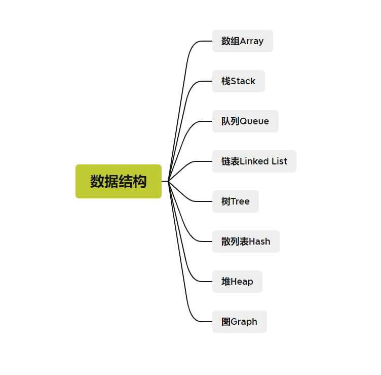

## 3.1.数组Array

## 3.2.链表Linked List

### 3.2.1.链表

链表是一种常见的基础数据结构，是一种线性表，但是并不会按照线性的顺序存储数据，而是在每一个节点里存着下一个节点的指针（Pointer）

链表结构可以充分利用计算机的内存空间，实现灵活的内存动态管理，但是链表失去了数组随机读取的优点，同时链表由于增加了节点的指针域，空间开销比较大。

### 3.2.2.单向链表（Single-Linked List）

单链表是链表结构中最简单的。一个单链表的节点分为两个部分，第一部分是保存或者显示关于节点的信息，另一部分存储着下一节点的地址。最后一个节点存储地址的部分指向空值。

单线链表只可向一个方向遍历，一般查找一个节点的时候需要从第一个节点开始每次访问下一个节点，一直访问到需要的位置。而插入一个节点，对于单向链表，只提供在链表头插入，只需要将当前插入的节点设置为头节点，next指向原头节点即可。删除一个节点，只需要将该节点的上一个节点的next指向该节点的下一个节点。

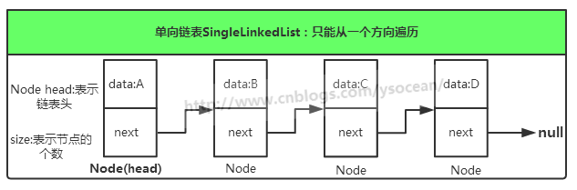

在表头增加节点：

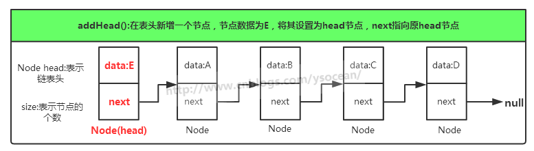

删除节点：

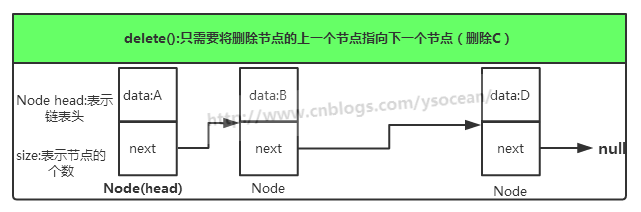

### 3.2.3.双端链表

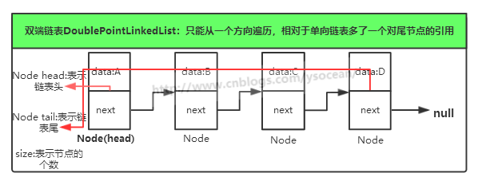

### 3.2.4.有序链表

### 3.2.5.双向链表

双向链表可以从两个方向遍历。

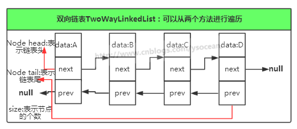

## 3.3.栈Stack

栈：又称为堆栈，或者堆叠

栈作为一种数据结构，是一种只能在一端进行插入和删除操作的特殊线性表。它按照先进后出的原则存储数据，先进入的数据被压入栈底，最后的数据在栈顶。需要读数据的时候从栈顶开始弹出数据，最后一个进入的数据被一个弹出来。

栈具有记忆作用，对栈的插入与删除操作中，不需要改变栈底指针。

栈是允许在同一端进行插入和删除操作的特殊线性表。允许进行插入和删除操作的一端称为栈顶（top），另一端则为栈底（bottom）；栈底固定，而栈顶浮动；栈中元素个数为0的时候为空栈。插入的时候一般为进栈，删除则称为退栈。

有堆叠数据结构只允许在一端进行操作，因而按照后进先出的原理运作，因此栈也被称为后进先出表。

## 3.4.队列Queue

队列是一种特殊的线性表。

进行插入操作的端是队尾，进行删除操作的端称为队头。队列中没有元素时，称为空队列。

队列中的数据元素又称为队列元素，在队列中插入一个队列元素称为入队，从队列中删除一个队列元素称为出队。因为队列只允许在一端插入，在另一端删除，故队列又称为先进先出线性表。

## 3.5.树Tree

### 3.5.1.树

​	树是一种抽象数据类型，用来模拟具有树状结构性质的数据集合。它是由n（n>0）个有限节点通过连接它们的便组成一个具有层次关系的集合。把它称之为树是因为它看起来像一颗倒挂的树：根朝上，叶朝下。

1. 节点：下图的圆圈，比如A、B、C等都表示节点。节点一般代表一些实体，在java面向对象编程中，节点一般代表对象。
2. 边：连接节点的线称之为边，边表示节点的关联关系。一般从一个节点到另一个节点的唯一方法就是沿着一条顺着右边的道路前进，在java当中通常表示引用。

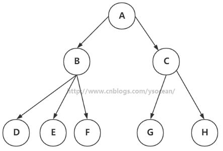

### 3.5.2.树中常用术语

1. 路径：顺着节点的边从一个节点走到另一个节点，所经过的节点的顺序排列就称为“路径”。
2. 根：树顶端的节点称为根，一棵树只有一个根，如果要把一个节点和边的集合称之为树，那么从根到其他任何一个节点都必须有且只有一条路径。下图A是根节点。
3. 父节点：若一个节点有子节点，则这个节点称之为其子节点的父节点。下图中B是D的子节点。
4. 兄弟节点：具有相同父节点的节点互称为兄弟节点：如下图中D和E就互称为兄弟节点
5. 子节点：一个节点含有的自述的根节点称为该节点的子节点：如下图中D是B的子节点
6. 叶节点：没有子节点的节点称之为叶节点，也称之为叶子结点，如下图中H、E、F、G都是叶子结点
7. 子树：每个节点都可以作为子树的根，它和它的所有的子节点、子节点的子节点等都包含在自述中
8. 节点的层次：从根开始定义，根为第一层，根的字节点为第二层，以此类推。
9. 深度：对于任意节点n，n的深度为从根到n的唯一路径长，同时根的深度为0
10. 高度：对于任意节点n，n的高度为从n到一片树叶的最长路径长，所有的树叶的高度为0
11. 路径长度：从树根到每一个节点的路径长度之和。
12. 节点的带权路径长度：从该节点到树根之间的路径长度和节点上权的乘积
13. 树的带权路径长度：树的所有节点的带权路径之和（WPL）

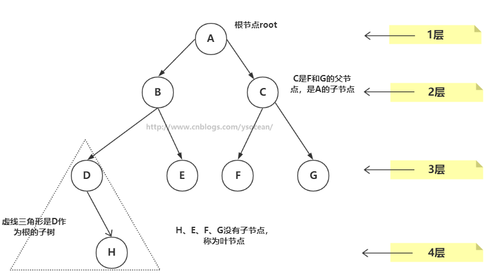

### 3.5.3.树的种类（定位插图）

​	树有很多种：

​	像上图一个节点有多余两个的子节点的树，称为多路数，例如2-3-4树和外部存储树都是多路树的例子。而每个节点最多只能有两个子节点的一种形式称为二叉树。二叉树是本篇探究的重点和难点。

​	等等等等。

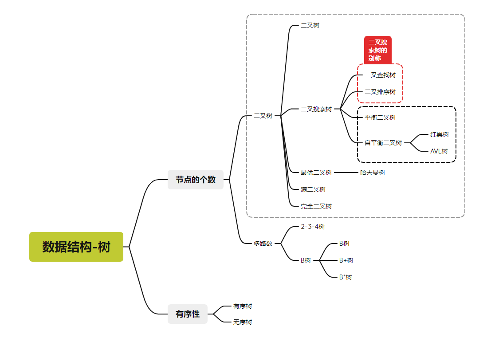

下面详细展开每个大类之间的讲解。

### 3.5.4.顺序树

#### 3.5.4.1.有序树

树中任意节点的子节点之间有顺序关系，这种树称为有序树

#### 3.5.4.2.无序树

树中任意节点的子节点之间没有顺序关系，这种树称为无序树，也成为了自由树

### 3.5.5.多路树

​	节点中有多余两个的子节点的树称为多路树，在上面插入的树的图片中，有一幅图有个节点有三个子节点，就是多路树

#### 3.5.5.1.2-3-4树

2-3-4树：每个节点最多有四个子节点和三个数据项，名字中的2，3，4的数字的含义是指的一个节点可能含有的子节点的个数。对于非叶子节点有三种可能的情况：

1. 有一个数据项的节点总是有两个子节点
2. 有两个数据项的节点总是有三个子节点
3. 有三个数据项的节点总是有四个子节点

简而言之：非叶子节点的子节点数总是比它含有的数据项多1。

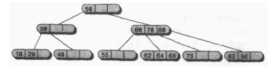

叶子节点是没有子节点的，然而可能含有一个、两个或者三个数据项。空节点是不会存在的。

树结构很重要的一点就是节点之间关键字值的大小的关系。在二叉树中，所有关键字值比某个节点值小的节点都在这个节点左子节点为根的子树上。所有关键字值比某个节点值大的节点都在这个节点右子节点为根的子树上。

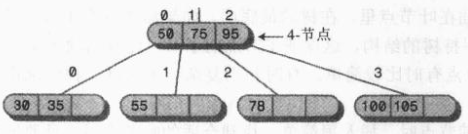

简化关系如下图，由于2-3-4树中一般不允许出现重复关键值，所以不用考虑比较关键值相同的情况。

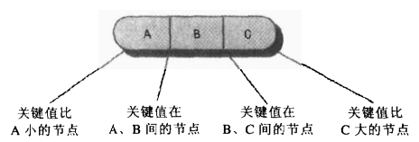

##### 3.5.5.1.1.搜索2-3-4树

##### 3.5.5.1.2.插入新元素

###### 3.5.5.1.2.1.节点分裂

###### 3.5.5.1.2.2.根的分裂

##### 3.5.5.1.3.2-3-4树的效率

#### ==3.5.5.2.B树==

​	B树家族，是在学习MySQL时不可逾越的知识，例如MySQL的InnoDB引擎使用的就是B+树，并且索引的底层实现就是B+树。

​	此外，B树就是B-树，因为B树的原英文名为B-Tree，依次这里尝尝产生误会，强调一下B树就是B-树。

​	B树中的B是Balance平衡的意思。

​	B树的出现是为了弥合不同的存储级别之间访问速度上的巨大差异，实现高效的IO。B树非常适合读取和写入相对较大的数据块（如光盘）的存储系统。B树通常适用于数据库和文件系统。

​	B树：一种多路平衡查找树。/B+树：加强版多路平衡查找树

##### 3.5.5.2.1.B树

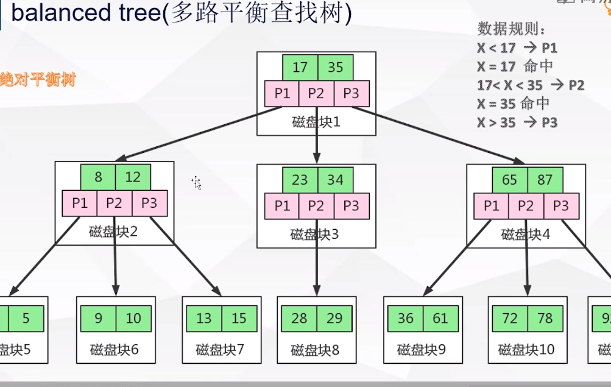

##### 3.5.5.2.2.B+树

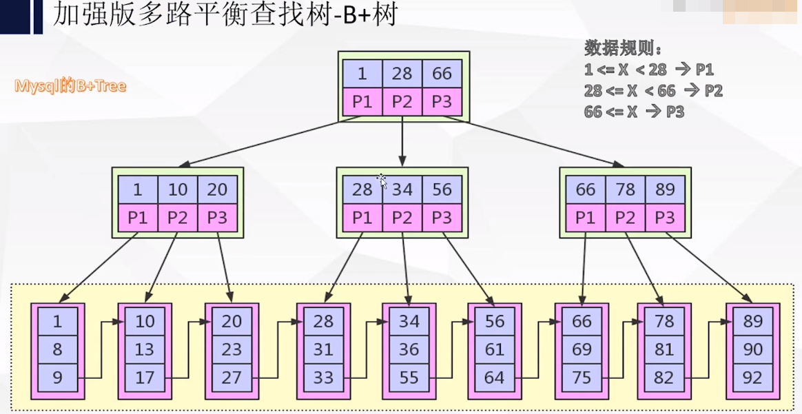

##### 3.5.5.2.3.B*树

### ==3.5.6.二叉树BinaryTree【重点】==

#### 3.5.6.1.二叉树

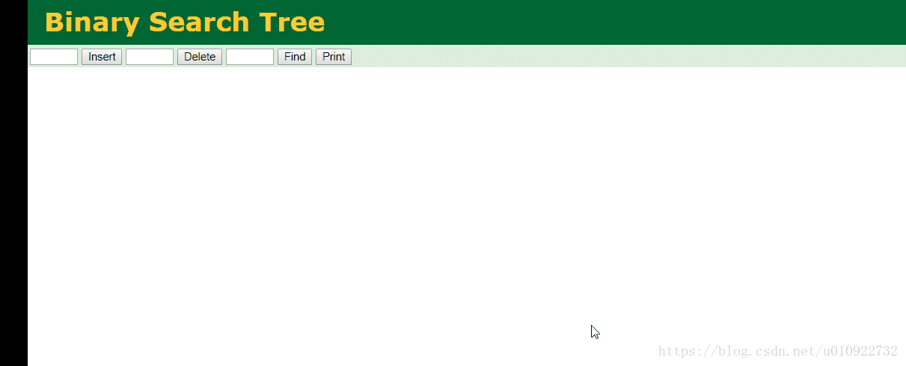

二叉树：**每个节点最多只能有两个子节点的树称为二叉树**。并且二叉树的子节点称为“左子节点”和“右子节点”。

#### 3.5.6.2.二叉搜索树

**二叉搜索树又称为二叉查找树、二叉排序树。**

在二叉树的基础上，添加加一个条件，**一个节点的左节点值小于这个节点，右节点值大于这个节点**，称为二叉搜索树。

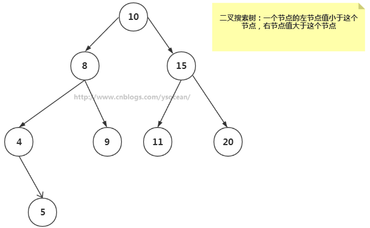

##### 3.5.6.2.1.查找节点

##### 3.5.6.2.2.插入节点

##### 3.5.6.2.3.查找最小值、最大值

##### 3.5.6.2.4.删除节点

##### 3.5.6.2.5.二叉树的效率

#### 3.5.6.3.平衡二叉树

##### 3.5.6.3.1.为什么要有平衡二叉树？

​	二叉搜索树一定程度上可以提高搜索效率，但是当原有序列有序时，例如序列A={1,2,3,4,5,6}，构造二叉树搜索树就如下图，依据此序列结构的二叉搜索树为右斜树，同时二叉树退化成单链表，搜索效率降低为O(n)。

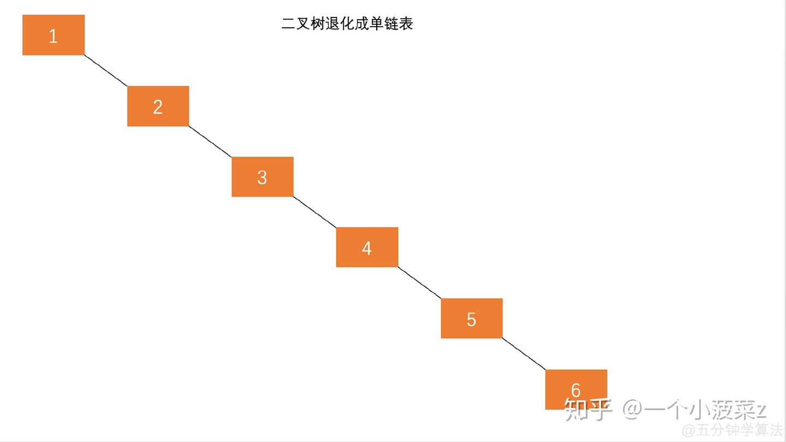

在此二叉搜索树中查找6元素需要查找6次。

二叉搜索树的查找效率取决于树的高度，因为保持树的高度最小，即可保证树的查找效率。同样的序列A，将其改为下图的方式存储，查找元素6时只需要比较3次，查找效率提升一倍。

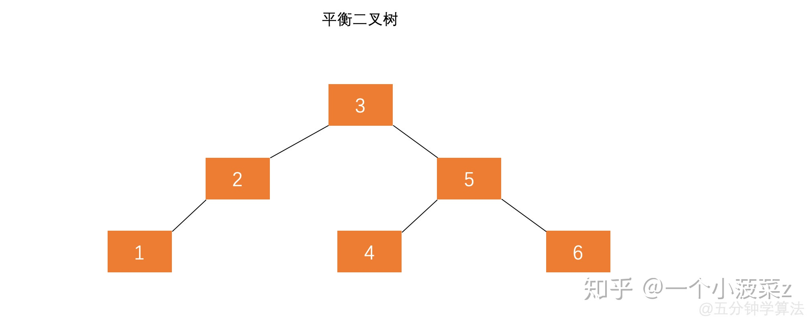

可以看出，当节点数目一定，保持树的左右两端保持平衡，树的查找效率最高。

**像这样左右子树的高度相差不超过1的树称为平衡二叉树。**

#### 3.5.6.4.AVL树

平衡二叉查找树，简称平衡二叉树，也称为AVL树。

具有以下特点：

1. 可以是空树
2. 假设不是空树，任何一个节点的左子树和右子树都是平衡二叉树，并且高度之差的绝对值不会超过1。

平衡之意，如天平，即两边的分量大约相同。

区分几个图：

图一：不是平衡二叉查找树，60左侧和右侧高度之差超过了1

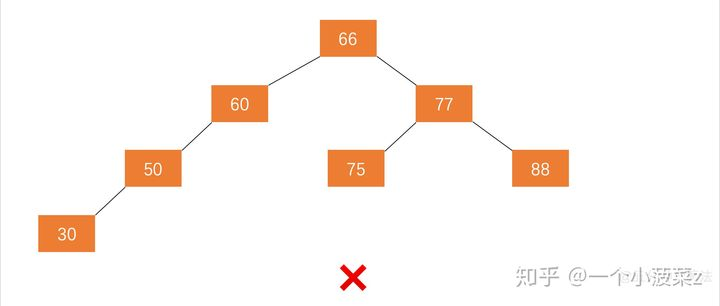

图二：不是平衡二叉查找树，根节点左侧和右侧高度之差超过了1

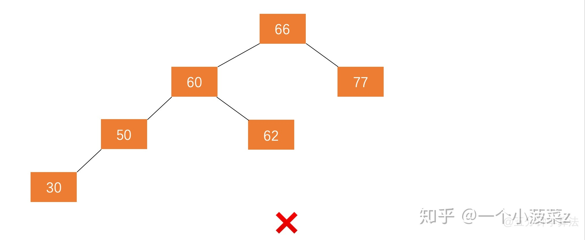

##### 3.5.6.4.1.平衡因子

某节点的左子树与右子树的高度（或者深度）之差即为该节点的平衡因子，平衡二叉树不存在平衡因子大于1的节点。在一颗平衡二叉树中，节点的平衡因子只能取0、1或者-1.

##### 3.5.6.4.2.失衡--->左右旋转

失衡的过程：原本是一颗平衡二叉树，当来了一个新的节点，例如下图：

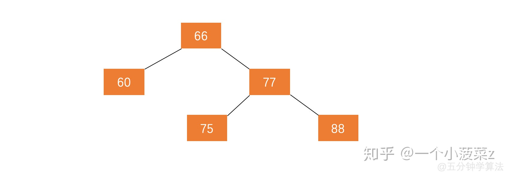

在此平衡二叉树上插入节点99，树结构变为：

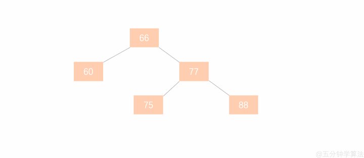

最小失衡子树：在新插入的节点向上查找，以第一个平衡因子的绝对值超过1的节点为根的子树，称为最小失衡树。

也就是说：一颗失衡的树，是有可能有多颗子树同时失衡的，而这时候只需要调整最小的不平衡子树，就能将不平衡的树调整为平衡的树。

平衡二叉树的失衡调整，主要是通过旋转最小失衡树来实现的，根据旋转的方式有两种处理方式“左旋和右旋。

旋转的目的是为了减少高度，通过降低整棵树的高度来平衡。那边的树高，就把那边的树向上旋转。

###### 3.5.6.4.2.1.左旋转

###### 3.5.6.4.2.2.右旋转

#### ==3.5.6.5.红黑树【重点】==

##### 3.5.6.5.1.红黑树的特征

1. 每个节点都有颜色

   在红-黑树中，每个节点的颜色或者是黑色或者是红色，当然也阔以是任意可以区别的颜色，这里的颜色用于标记（代码中，我们可以在节点类中Node中增加一个boolean类型的变量isRed，以此来表示颜色的信息）

2. 在插入和删除过程中，要遵循保持这些颜色的不同排列规则：**红黑规则**

   1. 每个节点不是红色就是黑色
   2. 根节点总是黑色的
   3. 如果节点是红色的，则它的子节点必须是黑色的，也就是说从每个叶子到根的路径上不能有两个连续的红色节点
   4. 从根节点到叶节点或者空子节点的每条路径，必须包含相同数目的黑色节点，即相同的黑色高度。

   注意：**新插入的节点总是红色的**，这是因为插入一个红色节点比插入一个黑色节点违背红-黑规则的可能性更小，原因是插入黑色节点总会改变黑色高度（违背规则4），但是插入红色节点只有一般的机会会违背规则三。此外，违背规则三要比违背规则4更容易修正。

##### 3.5.6.5.2.红黑树的自我修正

###### 3.5.6.5.2.1.改变节点颜色

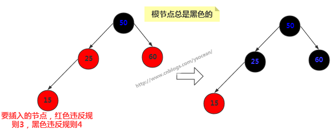

###### 3.5.6.5.2.2.左旋

###### 3.5.6.5.2.3.右旋

##### 3.5.6.5.3.插入操作

##### 3.5.6.5.4.删除操作

##### 3.5.6.5.5.红黑树的效率

##### 3.5.6.5.6.红黑树的应用

HashMap使用的是Hash表，包含了数组、链表、红黑树

#### 3.5.6.6.最优二叉树（哈夫曼树）

​																WPL=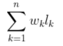

​	假设有n个权值为{W1，W2...Wi}构成一颗有n个叶子节点的二叉树，每个叶子结点带权为Wi，则其中带权路径长度WPL最小的二叉树则为最优二叉树，亦被称为哈夫曼树。

##### 3.5.6.6.1.哈夫曼树的应用

**哈夫曼编解码**：哈夫曼树应用于哈夫曼编码的生成，进而实现压缩（无损压缩）。

#### 3.5.6.7.满二叉树

​	如果二叉树中除了叶子节点，每个节点的度都为2，则此二叉树称之为满二叉树

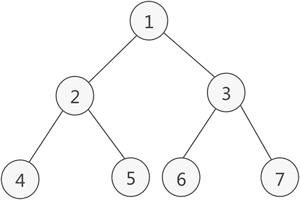

#### 3.5.6.8.完全二叉树

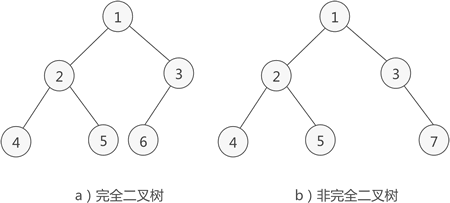

​	如果二叉树中出去最后一层节点为满二叉树，且最后一层的节点依次是从左往右分布，则次二叉树被称为完全二叉树。

## 3.6.图Graph

图是由节点的有穷集合V和边的结合E组成。其中，为了与树结构加以区别，在图结构中常常将节点成为顶点，边是顶点的有序偶对，若两个顶点之间存在一条边，就表示这两个顶点具有相邻关系。

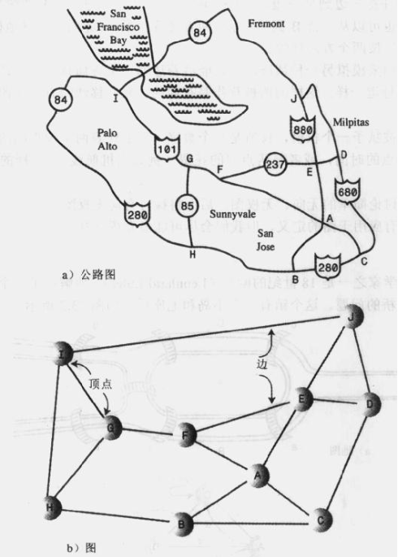

其中根据边有无方向可以分为：有向图和无向图，根据有无权值可以分为有权图和无权图。

### 3.6.1.图的搜索

#### 3.6.1.1.深度优先搜索（DFS）

#### 3.6.1.2.广度优先搜索（BFS）

## 3.7.散列表Hash

​	Hash表也被称为散列表，也可以称为哈希表。

​	Hash表是一种根据关键字值（key-value）而直接访问的数据结构，它基于数组，通过把关键字映射到数组的某个下标来加快查找速度。

**如何把关键字转换为数组的下标，这个转换的函数称之为哈希函数，转换过程称为哈希化。**

## 3.8.堆Heap

堆是一种比较特殊的数据结构，可以被看做一棵树的数组对象。具有以下的性质：

- 堆中某个节点的值总是不大于或不小于其父节点的值
- 堆总是一颗完全二叉树。

将根节点最大的叫做大顶堆，根节点最小的堆叫做小顶堆。

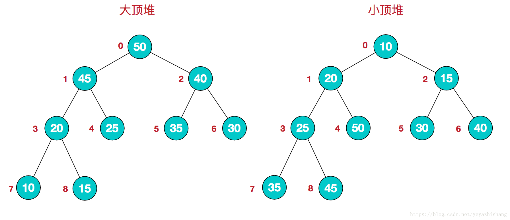

因为堆有序的特点，一般用来做数组中的排序，称之为堆排序。

# 4.算法

参考链接：

[十大经典排序算法（动图演示） - 一像素 - 博客园 (cnblogs.com)](https://www.cnblogs.com/onepixel/articles/7674659.html)

[Java实现八大排序算法 - morethink - 博客园 (cnblogs.com)](https://www.cnblogs.com/morethink/p/8419151.html#快速排序)

[Java数据结构和算法 - 标签 - YSOcean - 博客园 (cnblogs.com)](https://www.cnblogs.com/ysocean/tag/Java数据结构和算法/)

[(16条消息) 快速排序（java实现）_王玉Student的博客-CSDN博客_java快速排序](https://blog.csdn.net/shujuelin/article/details/82423852)

[我要搞科研的主页 - 抖音 (douyin.com)](https://www.douyin.com/user/MS4wLjABAAAAqeFkPBPgvSnf2S3WmX72arWJiou4k0FxEre3xZjRVXEc5Icckqp4gWFKhYEw9ixw)

## 4.1.排序算法的分类

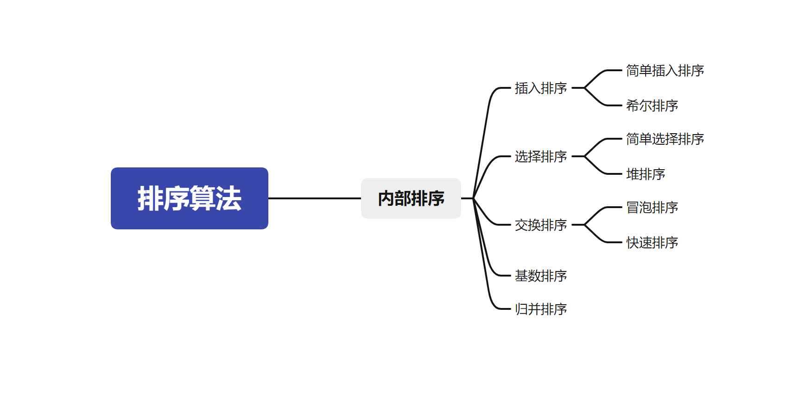

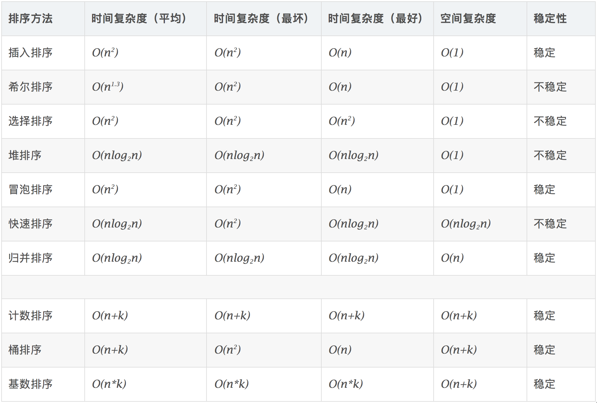

## 4.2.插入排序

### 4.2.1.插入排序

插入排序步骤：

1. 

### 4.2.2.希尔排序

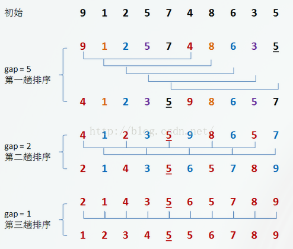

## 4.3.选择排序

### 4.3.1.选择排序

### 4.3.2.堆排序

## 4.4.交换排序

### 4.4.1.冒泡排序

### 4.4.2.快速排序

方法开始：分别从初始序列“6 1 2 7 9 3 4 5 10 8”两端开始“探测”。先从**右**往**左**找一个小于6的数，再从**左**往**右**找一个大于6的数，然后交换他们。这里可以用两个变量i和j，分别指向序列最左边和最右边。我们为这两个变量起个好听的名字“哨兵i”和“哨兵j”。刚开始的时候让哨兵i指向序列的最左边（即i=1），指向数字6。让哨兵j指向序列的最右边（即=10），指向数字。

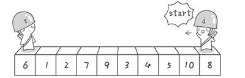

首先哨兵j开始出动。因为此处设置的基准数是最左边的数，所以需要让哨兵j先出动，这一点非常重要（请自己想一想为什么）。哨兵j一步一步地向左挪动（即j–），直到找到一个小于6的数停下来。接下来哨兵i再一步一步向右挪动（即i++），直到找到一个数大于6的数停下来。最后哨兵j停在了数字5面前，哨兵i停在了数字7面前。

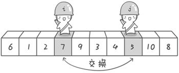

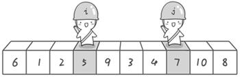

现在交换哨兵i和哨兵j所指向的元素的值。交换之后的序列如下：

6 1 2 **5** 9 3 4 **7** 10 8

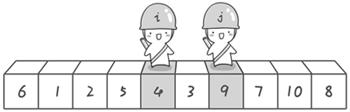

到此，第一次交换结束。接下来开始哨兵j继续向左挪动（再友情提醒，每次必须是哨兵j先出发）。他发现了4（比基准数6要小，满足要求）之后停了下来。哨兵i也继续向右挪动的，他发现了9（比基准数6要大，满足要求）之后停了下来。此时再次进行交换，交换之后的序列如下：

6 1 2 5 **4** 3 **9** 7 10 8

第二次交换结束，“探测”继续。哨兵j继续向左挪动，他发现了3（比基准数6要小，满足要求）之后又停了下来。哨兵i继续向右移动，糟啦！此时哨兵i和哨兵j相遇了，哨兵i和哨兵j都走到3面前。说明此时“探测”结束。我们将基准数6和3进行交换。交换之后的序列如下：

**3** 1 2 5 4 **6** 9 7 10 8

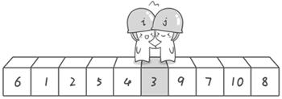

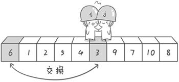

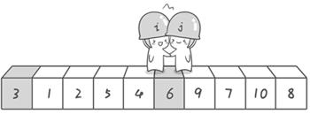

到此第一轮“探测”真正结束。此时以基准数6为分界点，6左边的数都小于等于6，6右边的数都大于等于6。回顾一下刚才的过程，其实哨兵j的使命就是要找小于基准数的数，而哨兵i的使命就是要找大于基准数的数，直到i和j碰头为止。

**速排序之所比较快，因为相比冒泡排序，每次交换是跳跃式的。每次排序的时候设置一个基准点，将小于等于基准点的数全部放到基准点的左边，将大于等于基准点的数全部放到基准点的右边。这样在每次交换的时候就不会像冒泡排序一样每次只能在相邻的数之间进行交换，交换的距离就大的多了。因此总的比较和交换次数就少了，速度自然就提高了。**

## 4.5.基数排序

## 4.6.归并排序

