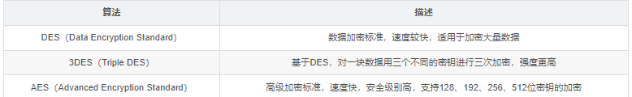
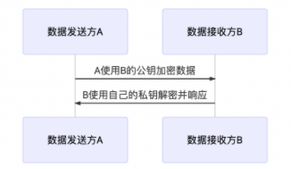

# 加解密：Encryption And Decryption

# 1.什么是加密和解密

## 1.1什么是加解密

==对数据使用一定的加密算法进行加密传输最后解密的过程。==

## 1.2加解密的作用

1. 保密性：保证用户的数据被窃取，即使窃取也无法得知含义；
2. 数据完整性：防止数据被篡改，即使被篡改接收方能功识别被篡改；
3. 身份验证：确认数据来源于被认证的用户。

## 1.3相关名词

- 明文（plaintext）：未经过处理的数据；

- 密文（ciphertext）：明文经过密码转换而成的一种表现形式；

- 加密（Encryption）：将明文转换为密文的过程；

- 解密（Decryption）：将密文恢复为明文的过程；

# 2.加密解密的方式

## 2.1对称加密技术

### 2.1.1什么是对称加密？

采用单钥密码系统的加密方法，同一个密钥可以同时用作信息的加密和解密，这种加密方法称为对称加密，也称为单密钥加密。

### 2.1.2对称加密的特点

- 加密和解密使用同样的密钥
- 计算速度快，适用于对大量数据加密处理
- 安全性取决于算法，也取决于密钥的管理，一旦密钥泄漏，数据则暴露无遗

### 2.1.3对称加密的使用场景

在一些需要高效实时传输的加密通讯场景中，比如使用VPN或者代理进行通讯时，可以使用对称加密。

### 2.1.4常见的加密算法

1. DES(Data Encryption Standard)：数据加密标准(现在用的比较少，因为它的加密强度不够，能够暴力破解) 
2. 3DES：原理和DES几乎是一样的，只是使用3个密钥，对相同的数据执行三次加密，增强加密强度。(缺点：要维护3个密钥，大大增加了维护成本) 
3. **AES**(Advanced Encryption Standard)：高级加密标准，目前美国国家安全局使用的，苹果的钥匙串访问采用的就AES加密。**是现在公认的最安全的加密方式，是对称密钥加密中最流行的算法。**



## 2.2非对称加密技术

### 2.2.1什么是非对称加密？

非对称加密算法需要两个密钥：公开密钥（publickey:简称公钥）和私有密钥（privatekey:简称私钥）。

公钥与私钥是一对，如果用公钥对数据进行加密，只有用对应的私钥才能解密。因为加密和解密使用的是两个不同的密钥，所以这种算法叫作非对称加密算法。

### 2.2.2非对称加密的特点

- 公开密钥加密，算法需要两个密钥，其中一个可以公开，并且通过公开的密钥无法推导出对应的私钥
- 算法复杂度相对对称加密算法高，所以计算相对较慢
- 密钥的保密性较好，因为公钥可以公开，免去了交换密钥的需求

### 2.2.3非对称加密的使用场景

非对此密钥算法被广泛使用，比如SSH、HTTPS、数字证书、数字签名、加密通讯等领域。

1. 数据加密传输



2. 报文签名验签


### 2.2.4常见的非对称加密算法

1. RSA

## 2.3哈希算法

### 2.3.0哈希函数

散列函数或杂凑函数。哈希函数是一个公开函数，可以将任意长度的消息M映射成为一个长度较短且长度固定的值H（M），称H（M）为哈希值、散列值（Hash Value）、杂凑值或者消息摘要（Message Digest）。==它是一种单向密码体制，即一个从明文到密文的不可逆映射，**只有加密过程，没有解密过程。**==

### 2.3.1MD5加密：可被破解

MD5信息摘要算法（英语：MD5 Message-Digest Algorithm），一种被广泛使用的密码散列函数，可以产生出一个128位（16字节）的散列值（hash value），用于确保信息传输完整一致。MD5由美国密码学家罗纳德·李维斯特（Ronald Linn Rivest）设计，于1992年公开，用以取代MD4算法。这套算法的程序在 RFC 1321 标准中被加以规范。**1996年后该算法被证实存在弱点，可以被加以破解。**

### 2.3.2Salt加密 

### 2.3.3SHA加密：可被破解

1. SHA-1

   SHA-1（英语：Secure Hash Algorithm 1，中文名：安全散列算法1）是一种密码散列函数，美国国家安全局设计，并由美国国家标准技术研究所（NIST）发布为联邦数据处理标准（FIPS）。SHA-1可以生成一个被称为消息摘要的160位（20字节）散列值，散列值通常的呈现形式为40个十六进制数。
   SHA-1已经不再视为可抵御有充足资金、充足计算资源的攻击者。2005年，密码分析人员发现了对SHA-1的有效攻击方法，这表明该算法可能不够安全，不能继续使用，自2010年以来，许多组织建议用SHA-2或SHA-3来替换SHA-1。Microsoft、Google以及Mozilla都宣布，它们旗下的浏览器将在2017年前停止接受使用SHA-1算法签名的SSL证书。
   2017年2月23日，CWI Amsterdam与Google宣布了一个成功的SHA-1碰撞攻击，发布了两份内容不同但SHA-1散列值相同的PDF文件作为概念证明。

2. SHA-2/SHA-256
   SHA-2有多种不同的位数，导致这个名词有一些混乱。但是无论是“SHA-2”，“SHA-256”或“SHA-256位”，其实都是指同一种加密算法。但是SHA-224”，“SHA-384”或“SHA-512”，表示SHA-2的二进制长度。还要另一种就是会把算法和二进制长度都写上，如“SHA-2 384”。
   SSL行业选择SHA作为数字签名的散列算法，从2011到2015，一直以SHA-1位主导算法。但随着互联网技术的提升，SHA-1的缺点越来越突显。从去年起，SHA-2成为了新的标准，所以现在签发的SSL证书，必须使用该算法签名。

### 2.3.4HMAC加密

HMAC是密钥相关的哈希运算消息认证码（Hash-based Message Authentication Code）的缩写，由H.Krawezyk，M.Bellare，R.Canetti于1996年提出的一种==基于Hash函数和密钥==进行消息认证的方法，并于1997年作为RFC2104被公布，并在IPSec和其他网络协议（如SSL）中得以广泛应用，现在已经成为事实上的Internet安全标准。它可以与任何迭代散列函数捆绑使用。
HMAC运算利用hash算法，以一个消息M和一个密钥K作为输入，生成一个定长的消息摘要作为输出。HMAC算法利用已有的Hash函数，关键问题是如何使用密钥。

HMAC算法更象是一种加密算法，它引入了密钥，其安全性已经不完全依赖于所使用的Hash算法，安全性主要有以下几点保证。
（1）使用的密钥是双方事先约定的，第三方不可能知道。作为非法截获信息的第三方，能够得到的信息只有作为“挑战”的随机数和作为“响应”的HMAC 结果，无法根据这两个数据推算出密钥。由于不知道密钥，所以无法仿造出一致的响应。
（2）HMAC与一般的加密重要的区别在于它具有“瞬时"性，即认证只在当时有效，而加密算法被破解后，以前的加密结果就可能被解密。
HMAC的安全性依赖于散列函数H的密码学属性：①抗碰撞属性；②当应用于一个单独的消息分组时H的压缩函数的消息认证属性 。

### 2.3.5哈希算法对应的java工具类

```java
import org.apache.commons.codec.binary.Base64;
import org.apache.commons.codec.binary.Hex;

import javax.crypto.Mac;
import javax.crypto.spec.SecretKeySpec;
import java.security.MessageDigest;
import java.security.NoSuchAlgorithmException;

/**
 * HeaUtil
 * Hash encryption algorithm
 * 哈希加密算法：MD5、SHA-1、SHA-256、HMAC-SHA-1、HMAC-SHA-256
 * 需要导入 org.apache.commons.codec 包
 *
 */

public class HeaUtil {

    /**
     * md5加密
     *
     * @param text 内容
     * @return digest 摘要
     * @throws NoSuchAlgorithmException e
     */
    public static String md5(String text) throws NoSuchAlgorithmException {
        MessageDigest messageDigest = MessageDigest.getInstance("MD5");
        byte[] bytes = messageDigest.digest(text.getBytes());
        return Hex.encodeHexString(bytes);
    }

    /**
     * sha1加密
     *
     * @param text 内容
     * @return digest 摘要
     * @throws NoSuchAlgorithmException e
     */
    public static String sha1(String text) throws NoSuchAlgorithmException {
        MessageDigest messageDigest = MessageDigest.getInstance("SHA-1");
        byte[] bytes = messageDigest.digest(text.getBytes());
        return Hex.encodeHexString(bytes);
    }

    /**
     * sha256加密
     *
     * @param text 内容
     * @return digest 摘要
     * @throws NoSuchAlgorithmException e
     */
    public static String sha256(String text) throws NoSuchAlgorithmException {
        MessageDigest messageDigest = MessageDigest.getInstance("SHA-256");
        byte[] bytes = messageDigest.digest(text.getBytes());
        return Hex.encodeHexString(bytes);
    }

    /**
     * hmac-sha1加密
     *
     * @param text 内容
     * @param key 密钥
     *
     * @return 密文
     * @throws Exception e
     */
    public static String hmacSha1(String text, String key) throws Exception {
        SecretKeySpec sk = new SecretKeySpec(key.getBytes(), "HmacSHA1");
        return hmacSha1(text, sk);
    }

    /**
     * hmac-sha1加密
     *
     * @param text 内容
     * @param sk 密钥
     *
     * @return 密文
     * @throws Exception e
     */
    public static String hmacSha1(String text, SecretKeySpec sk) throws Exception {
        Mac mac = Mac.getInstance("HmacSHA1");
        mac.init(sk);
        byte[] rawHmac = mac.doFinal(text.getBytes());
        return new String(Base64.encodeBase64(rawHmac));
    }

    /**
     * 生成 HmacSha1 密钥
     *
     * @param key 密钥字符串
     * @return SecretKeySpec
     */
    public static SecretKeySpec createHmacSha1Key(String key) {
        return new SecretKeySpec(key.getBytes(), "HmacSHA1");
    }

    /**
     * hmac-sha256加密
     *
     * @param text 内容
     * @param key 密钥
     *
     * @return 密文
     * @throws Exception e
     */
    public static String hmacSha256(String text, String key) throws Exception {
        SecretKeySpec sk = new SecretKeySpec(key.getBytes(), "HmacSHA256");
        return hmacSha1(text, sk);
    }

    /**
     * hmac-sha256加密
     *
     * @param text 内容
     * @param sk 密钥
     *
     * @return 密文
     * @throws Exception e
     */
    public static String hmacSha256(String text, SecretKeySpec sk) throws Exception {
        Mac mac = Mac.getInstance("HmacSHA256");
        mac.init(sk);
        byte[] rawHmac = mac.doFinal(text.getBytes());
        return new String(Base64.encodeBase64(rawHmac));
    }

    /**
     * 生成 HmacSha256 密钥
     *
     * @param key 密钥字符串
     * @return SecretKeySpec
     */
    public static SecretKeySpec createHmacSha256Key(String key) {
        return new SecretKeySpec(key.getBytes(), "HmacSHA256");
    }

    /**
     * 测试
     *
     * @param args args
     */
    public static void main(String[] args) throws Exception {
        String s = "123456789了踩踩踩";
        System.out.println(md5(s));
        System.out.println(sha1(s));
        System.out.println(sha256(s));
        String k = "ada232@12";
        System.out.println(hmacSha1(s, k));
        s = "aeqnfoavneornqoenr1啊可是到了南方情况无法弄清了我呢010jownfasdfqijqor";
        System.out.println(hmacSha1(s, k));
        SecretKeySpec sk1 = createHmacSha1Key(k);
        System.out.println(hmacSha1(s, sk1));
        SecretKeySpec sk256 = createHmacSha256Key(k);
        System.out.println(hmacSha256(s, sk256));
    }
}
```

# 3.常见加解密方案或使用场景

## 3.1签名及验签sign

### 3.1.1签名流程

==**签名流程大同小异，根据业务需求来制定**==

1. 获取需要发送请求的参数按照ASCII码（或从小到大）做升序排列
2. 参数名及参数值连接成字符串
3. 用申请到的appid和appsecret连接到字符串的头部
4. 用时间戳连接到字符串的尾部
5. 将字符串进行需要的一系列加密，生成签名，（加密后可转换成大写）

### 3.1.2验签流程

## 3.2数字证书及CA


Q
