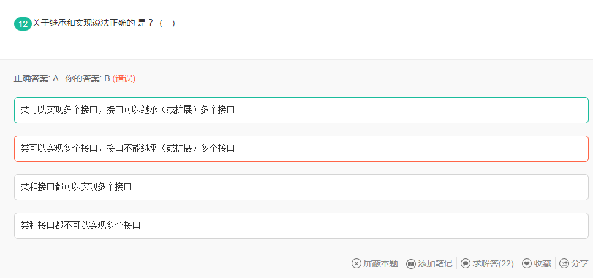

# Wrong Questions

**2021年12月7日10:55:04：新开辟错题库（不仅仅是错题库），附带简要的错题分析，错题展示的知识点依据SuperMaster及MyNotes_Gitee。**

**May the force be with you.**

## 1.2021年12月6日

这是一个凄惨的故事~


### 1.1for循环执行流程


考察：for循环表达式中组件的作用及执行顺序

### 1.2数据类型


### 1.3final->final、finally、finalize()区别


final、finally、finalize()的区别

```java
参考链接：https://www.cnblogs.com/smart-hwt/p/8257330.html
```

### 1.4java计算

#### 1.位运算


#### 2.运算顺序


解题评论：不加括号在公司会被砍死的。

### 1.5继承和实现



类可以实现多个接口，接口也可以继承多个接口

### 1.6java涉及的通信协议


```xml
RMI(Remote Method Invocation)远程方法调用是一种计算机之间利用远程对象互相调用实现双方通讯的一种通讯机制。使用这种机制，某一台计算机上的对象可以调用另外一台计算机上的对象来获取远程数据。RMI是Enterprise JavaBeans的支柱，是建立分布式Java应用程序的方便途径。在过去，TCP/IP套接字通讯是远程通讯的主要手段，但此开发方式没有使用面向对象的方式实现开发，在开发一个如此的通讯机制时往往令程序员感觉到乏味，对此RPC(Remote Procedure Call）应运而生，它使程序员更容易地调用远程程序，但在面对复杂的信息传讯时，RPC依然未能很好的支持，而且RPC未能做到面向对象调用的开发模式。针对RPC服务遗留的问题，RMI出现在世人面前，它被设计成一种面向对象的通讯方式，允许程序员使用远程对象来实现通信，并且支持多线程的服务，这是一次远程通讯的革命，为远程通信开辟新的里程碑。

RMI的开发步骤

先创建远程接口及声明远程方法，注意这是实现双方通讯的接口，需要继承Remote

开发一个类来实现远程接口及远程方法，值得注意的是实现类需要继承UnicastRemoteObject

通过javac命令编译文件，通过java -server 命令注册服务，启动远程对象

最后客户端查找远程对象，并调用远程方法
```

### 1.7Socket


```java
Socket套接字 
就是源Ip地址，目标IP地址，源端口号和目标端口号的组合
服务器端：ServerSocket提供的实例
ServerSocket server= new ServerSocket(端口号)
客户端：Socket提供的实例
Socket soc=new Socket(ip地址，端口号)
```

### 1.8抽象类


```java
答案：E
A,抽象类不能实例化，因为有抽象方法未实现
B,可以被继承。派生类可以实现抽象方法
C，子类可以是抽象的，也可以非抽象的
D，只能被继承说法太肯定，不正确
E，可以被抽象类继承，也可以被非抽象类继承
```

### 1.9多线程

#### 1.同步锁


```java
Test mv =newTest()声明并初始化对data赋默认值 
使用synchronized关键字加同步锁线程依次操作m() 
t1.start();使得result=2,data=2,输出即为2 2 
t2.start();使得result=4,data=4,输出即为4 4 
t3.start();使得result=6,data=6,输出即为6 6 
 System.out.print(result +" "+ data);是print()方法不会换行,输出结果为2 24 46 6
```

#### 2.多线程源码


```java
从jdk作者设计的目的来看，javadoc是这么描述它们的： CountDownLatch: A synchronization aid that allows one or more threads to wait until a set of operations being performed in other threads completes. CyclicBarrier : A synchronization aid that allows a set of threads to all wait for each other to reach a common barrier point.
    从javadoc的描述可以得出： CountDownLatch：一个或者多个线程，等待其他多个线程完成某件事情之后才能执行； CyclicBarrier：多个线程互相等待，直到到达同一个同步点，再继续一起执行。
    对于CountDownLatch来说，重点是“一个线程（多个线程）等待”，而其他的N个线程在完成“某件事情”之后，可以终止，也可以等待。 
    而对于CyclicBarrier，重点是多个线程，在任意一个线程没有完成，所有的线程都必须互相等待，然后继续一起执行。
    
    CountDownLatch是计数器，线程完成一个记录一个，只不过计数不是递增而是递减，
    而CyclicBarrier更像是一个阀门，需要所有线程都到达，阀门才能打开，然后继续执行。 按照这个题目的描述等所有线程都到达了这一个阀门处，再一起执行，此题强调的是，一起继续执行，我认为 选B 比较合理！
```

CountDownLatch：[countDownLatch - 简书 (jianshu.com)](https://www.jianshu.com/p/e233bb37d2e6)

CyclicBarrier：[CyclicBarrier 使用详解 - 简书 (jianshu.com)](https://www.jianshu.com/p/333fd8faa56e)

#### 3.线程状态（start和run的区别）


```tex
start()方法是启动一个线程，此时的线程处于就绪状态，但并不一定就会执行，还需要等待CPU的调度。
run()方法才是线程获得CPU时间，开始执行的点。
```

### 1.10java常用类--内部类


### 1.11序列化与反序列化


序列化保存的是对象的状态，静态变量属于类的状态，因此，序列化并不保存静态变量。所以i是没有改变的

### 1.12Statement继承与特定类的继承关系


Statement类的继承树：statement：java执行数据库操作的一个重要接口


Statement类的简介：[(41条消息) Statement详细用法及解释----java_命z的博客-CSDN博客_statement](https://blog.csdn.net/qq_41668547/article/details/80717146)

### 1.13类的加载顺序

#### 1.例题一


1.首先，需要明白**类的加载顺序**。

(1) 父类静态对象和静态代码块

(2) 子类静态对象和静态代码块

(3) 父类非静态对象和非静态代码块

(4) 父类构造函数

(5) 子类 非静态对象和非静态代码块

(6) 子类构造函数

其中：类中静态块按照声明顺序执行，并且(1)和(2)不需要调用new类实例的时候就执行了(意思就是在类加载到方法区的时候执行的)
2.因而，整体的执行顺序为

public static Test t1 = new Test();     //(1)

static
{
System.out.println("blockB");        //(2)

}

Test t2 =new Test();               //(3)

在执行(1)时创建了一个Test对象，在这个过程中会执行非静态代码块和缺省的无参构造函数，在执行非静态代码块时就输出了blockA；然后执行(2)输出blockB；执行(3)的过程同样会执行非静态代码块和缺省的无参构造函数，在执行非静态代码块时输出blockA。因此，最终的结果为

```
blockA
blockB
blockA
```

#### 2.例题二


### 3.例题三：静态初始化块


类的初始化过程也就是方法执行的过程。

**java对象初始化顺序**
先说结论：

1. 父类静态代码块，父类静态成员变量（同级，按代码顺序执行）
2. 子类静态代码块，子类静态成员变量（同级，按代码顺序执行）
3. 父类非静态代码块，父类非静态成员变量（同级，按代码顺序执行）
4. 父类构造代码块，构造方法
5. 子类非静态代码块，子类非静态成员变量（同级，按代码顺序执行）
6. 子类构造代码块，构造方法

注意点：

1. 静态内容只在类加载时执行一次，之后不再执行。
2. 默认调用父类的无参构造方法，可以在子类构造方法中利用super指定调用父类的哪个构造方法。

### 1.14java的特性

#### 1.解决哈希冲突的开放定址法


`ThreadLocalMap中使用开放地址法来处理散列冲突，而HashMap中使用的是分离链表法。之所以采用不同的方式主要是因为：在ThreadLocalMap中的散列值分散得十分均匀，很少会出现冲突。并且ThreadLocalMap经常需要清除无用的对象，使用纯数组更加方便。`

### 1.15java常用类-String类及相关类与Final的关系


```txt
StringBuilder , StringBuffer ,String 都是 final 的，但是为什么StringBuilder , StringBuffer可以进行修改呢，因为不可变包括的是，引用不可变以及对象不可变，而这三个都是属于引用不可变，（也就是地址不要变，里面的内容随心所欲），而StringBuilder , StringBuffer 中都包含右append方法，可对对象中的内容进行增加。
而String a="123"+new String("456");实际上底层是用了一个StringBuffer 进行append；
```

## 2.2021年12月7日