# NoSQL+Redis

视频链接：[【狂神说Java】Redis最新超详细版教程通俗易懂_哔哩哔哩_bilibili](https://www.bilibili.com/video/BV1S54y1R7SB?p=36)

# 1.NoSql

## 1.1NoSql的历史

### 1.1.1单机Mysql时代

> 90年代,一个网站的访问量一般不会太大，单个数据库完全够用。随着用户增多，网站出现以下问题

1. 数据量增加到一定程度，单机数据库就放不下了
2. 数据的索引（B+ Tree）,一个机器内存也存放不下
3. 访问量变大后（读写混合），一台服务器承受不住。

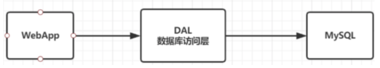

### 1.1.2Memcached(缓存) + Mysql + 垂直拆分（读写分离）

> 网站80%的情况都是在读，每次都要去查询数据库的话就十分的麻烦！所以说我们希望减轻数据库的压力，我们可以使用缓存来保证效率！

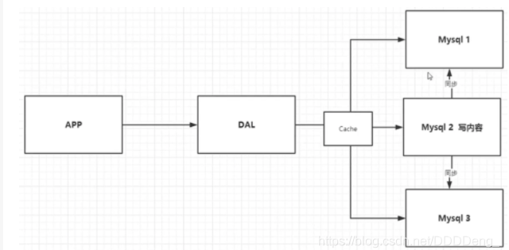

优化过程经历了以下几个过程：

1. 优化数据库的数据结构和索引(难度大)
2. 文件缓存，通过IO流获取比每次都访问数据库效率略高，但是流量爆炸式增长时候，IO流也承受不了
3. MemCache,当时最热门的技术，通过在数据库和数据库访问层之间加上一层缓存，第一次访问时查询数据库，将结果保存到缓存，后续的查询先检查缓存，若有直接拿去使用，效率显著提升。

### 1.1.3分库分表 + 水平拆分 + Mysql集群

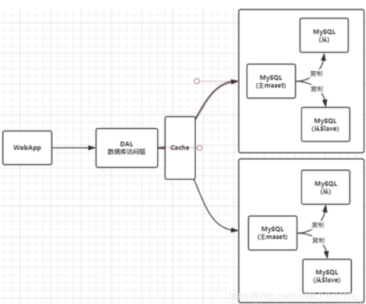

### 1.1.4如今的时代

如今信息量井喷式增长，各种各样的数据出现（用户定位数据，图片数据等），大数据的背景下关系型数据库（RDBMS）无法满足大量数据要求。Nosql数据库就能轻松解决这些问题。目前一个基本的互联网项目：

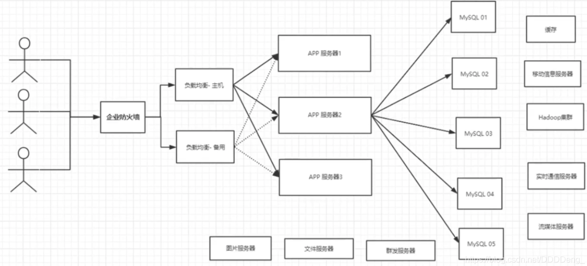

## 1.2为什么使用NoSql？

用户的个人信息，社交网络，地理位置。用户自己产生的数据，用户日志等等爆发式增长！这时候我们就需要使用NoSQL数据库的，Nosql可以很好的处理以上的情况！

## 1.3什么是NoSql？

==NoSQL = Not Only SQL（不仅仅是SQL）==

关系型数据库：列+行，同一个表下数据的结构是一样的。

非关系型数据库：数据存储没有固定的格式，并且可以进行横向扩展。

NoSQL泛指非关系型数据库，随着web2.0互联网的诞生，传统的关系型数据库很难对付web2.0时代！尤其是超大规模的高并发的社区，暴露出来很多难以克服的问题，NoSQL在当今大数据环境下发展的十分迅速，Redis是发展最快的。

### 1.3.1NoSql的特点

1. 方便扩展（数据之间没有关系，很好扩展！）

2. 大数据量高性能（Redis一秒可以写8万次，读11万次，NoSQL的缓存记录级，是一种细粒度的缓存，性能会比较高！）

3. 数据类型是多样型的！（不需要事先设计数据库，随取随用）

### 1.3.2关系型数据库和NoSql的区别

传统的 RDBMS(关系型数据库)

> 结构化组织
> SQL
> 数据和关系都存在单独的表中 row col
> 操作，数据定义语言
> 严格的一致性
> 基础的事务
> ...

Nosql

> 不仅仅是数据
> 没有固定的查询语言
> 键值对存储，列存储，文档存储，图形数据库（社交关系）
> 最终一致性
> CAP定理和BASE
> 高性能，高可用，高扩展
> ...

### 1.3.3大数据时代的3V和3高

#### 1.3.3.1 3V

1. 海量Velume
2. 多样Variety
3. 实时Velocity

#### 1.3.3.2 3高

1. 高并发
2. 高可扩
3. 高性能

## 1.4NoSQL分类

### 1.4.1.KV键值对

典型代表：Redis

### 1.4.2.文档型数据库

1. MongoDB
2. ConthDB

### 1.4.3.列存储数据库

1. HBase（大数据必学）
2. 分布式文件系统

### 1.4.4.图关系型数据库

常用于广告推荐，社交网络

- Neo4j，InfoGrid

| 分类                | Examples举例                                        | 典型应用场景                                                 | 数据模型                                         | 优点                                                         | 缺点                                                         |
| ------------------- | --------------------------------------------------- | ------------------------------------------------------------ | ------------------------------------------------ | ------------------------------------------------------------ | ------------------------------------------------------------ |
| 键值对（key-value） | Tokyo  Cabinet/Tyrant, Redis, Voldemort, Oracle BDB | 内容缓存，主要用于处理大量数据的高访问负载，也用于一些日志系统等等。 | Key  指向 Value 的键值对，通常用hash table来实现 | 查找速度快                                                   | 数据无结构化，通常只被当作字符串或者二进制数据               |
| 列存储数据库        | Cassandra,  HBase, Riak                             | 分布式的文件系统                                             | 以列簇式存储，将同一列数据存在一起               | 查找速度快，可扩展性强，更容易进行分布式扩展                 | 功能相对局限                                                 |
| 文档型数据库        | CouchDB,  MongoDb                                   | Web应用（与Key-Value类似，Value是结构化的，不同的是数据库能够了解Value的内容） | Key-Value对应的键值对，Value为结构化数据         | 数据结构要求不严格，表结构可变，不需要像关系型数据库一样需要预先定义表结构 | 查询性能不高，而且缺乏统一的查询语法。                       |
| 图形(Graph)数据库   | Neo4J,  InfoGrid, Infinite Graph                    | 社交网络，推荐系统等。专注于构建关系图谱                     | 图结构                                           | 利用图结构相关算法。比如最短路径寻址，N度关系查找等          | 很多时候需要对整个图做计算才能得出需要的信息，而且这种结构不太好做分布式的集群 |

# 2.Redis基础

狂神说Redis笔记：https://www.cnblogs.com/kylinxxx/p/13770063.html

Redis安装教程：https://blog.csdn.net/weixin_41381863/article/details/88231397?ops_request_misc=%257B%2522request%255Fid%2522%253A%2522161815029316780262526966%2522%252C%2522scm%2522%253A%252220140713.130102334.pc%255Fall.%2522%257D&request_id=161815029316780262526966&biz_id=0&utm_medium=distribute.pc_search_result.none-task-blog-2~all~first_rank_v2~rank_v29-1-88231397.pc_search_result_cache&utm_term=Redis%E5%AE%89%E8%A3%85%E6%95%99%E7%A8%8B

Redis相关博客：[Redis详解 - 标签 - YSOcean - 博客园 (cnblogs.com)](https://www.cnblogs.com/ysocean/tag/Redis详解/)

## 2.1.Redis的概述

Redis：Remote Dictonary Server 远程字典服务

Redis是一个开源的、由C语言编写的、支持网络的、可以基于内存也可以持久化的日志型的、Key-value数据库，并提供了多种语言的API。

为了保证效率，数据都是缓存在内存中。Redis会周期性地把更新的数据写入磁盘，或者把修改操作写入追加的日志文件中，并且在此基础上实现了master-slave（主从）同步。

### 2.1.1Redis官网

www.Redis.io

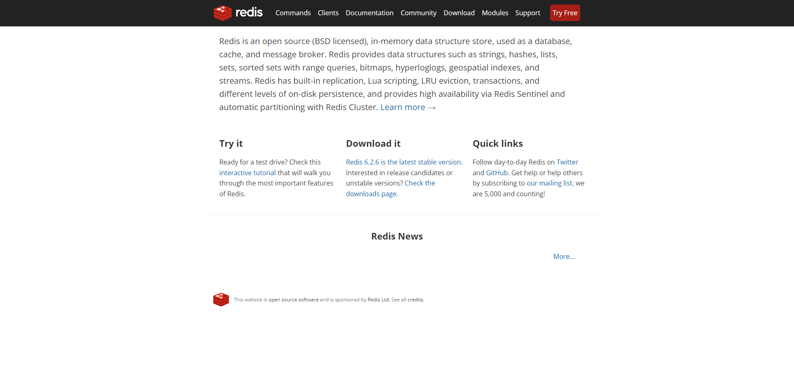

### 2.1.2.Redis info

1. Redis服务下默认有16个数据库，编号从0-15；且默认使用的是0号数据库（这里出现过问题，勿忘）
2. Redis是单线程的
3. Redis是基于内存操作的：因此限制Redis性能的不是CPU速度，而是机器内存和网络带宽。

### 2.1.3.Redis误区：我为啥这么快？

Redis是单线程的，为啥还是这么快？

- 误区：高性能的服务器一定是多线程的？
- 误区：多线程一定会比单线程快？

Redis的数据操作都是在内存上的，内存的读写速度就相当地高，而且使用单线程避免了CPU操作时CPU上下文切换，因此单线程的Redis依旧很快。

下文将测试Redis的性能。

## 2.2.Redis安装

### 2.2.1.Windows安装Redis

下载解压即可，其中

1. Redis-server.exe：Redis服务端
2. Redis-cli.exe：Redis客户端
3. Redis-benchmark.exe：测试Redis性能
4. Redis-check-aof.exe：基于日志文件修复Redis的工具

### 2.2.2.liunx安装Redis

## 2.3Redis-benchmark性能测试

简单测试：

```sh
# 测试：100个并发连接 100000请求
Redis-benchmark -h localhost -p 6379 -c 100 -n 100000
```

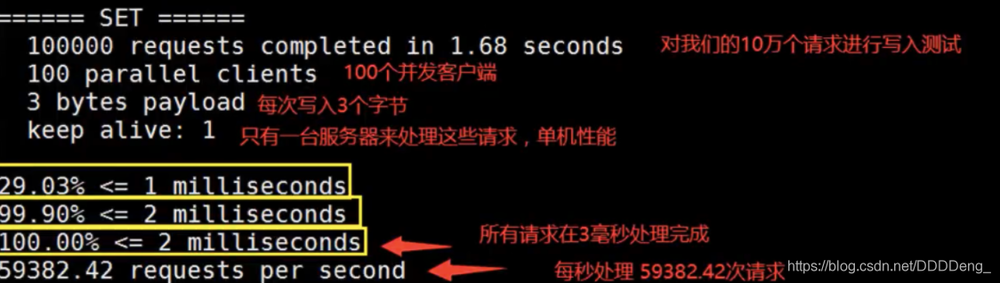

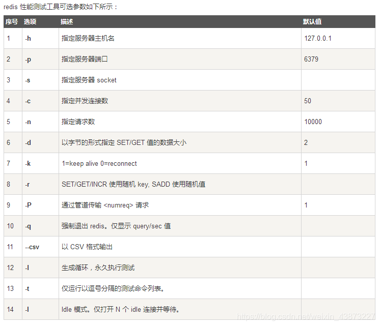

## 2.4Redis-key基本命令

## 2.5Redis八大基本数据类型

### 2.5.1String：字符串

### 2.5.2list：列表

### 2.5.3set：集合

### 2.5.4hash：哈希

### 2.5.5ZSet：有序集合

### 2.5.6Geospatial：地理位置

### 2.5.7Hyperloglog：基数统计

### 2.5.8BitMap：位图

## 2.6Redis与事务

Redis的单条命令是保证原子性的，但是Redis事务是不能保证原子性的。

单条命令失败，这条命令原本的含义是不能执行的。

然而Redis开启了事务队列之后，在将一些命令添加进去之后，即使语法不报错,然后执行事务，错误的执行依旧不会执行，然后正确的执行是可以被执行的。

## 2.7Redis监控与乐观锁/悲观锁

乐观锁：什么时候都不会发生问题，所以不会上锁，只是更新数据的时候去判断一下，在此期间是否有人修改过这个数据。

使用watch key去监控指定数据，相当于乐观锁加锁。

## 2.8Jedis

## 2.9SpringBoot集成Redis

## 2.10Redis配置文件

## 2.11Redis持久化

### 2.11.1.RDB快照

RDB：Redis databases：Redis默认支持的是RDB

#### 2.11.1.1什么是RDB快照

RDB是Redis中用来持久化的一种方式，是把当前内存中的数据集快照写入磁盘，也就是SnapShot。恢复的时候将快照文件直接读进内存。

但由于Redis是基于内存运行的，所以在断电的时候仍然有部分数据断电即失，存在一定的误差。

#### 2.11.1.2RDB配置文件

在Redis.conf配置文件的SNAPSHOTTING下：

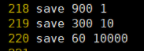

save：这里是用来配置触发Redis的RDB持久化条件，也就是什么时候将内存中的数据保存在硬盘中。

默认如下配置：

```sh
save 900 1 ：表示900s内如果至少有一个key的值变化，则保存
save 300 10 : 表示300s内如果至少有10个key的值变化，则保存
save 60 10000 ：表示60s内如果至少有10000个key的值变化，则保存
```

#### 2.11.1.3手动触发/自动触发

##### 2.11.1.3.1.手动触发

手动触发Redis进行RDB操作的命令有两种

1. save

   该命令会阻塞当前Redis服务器，执行save命令期间，Redis不能处理其他的命令，直到RDB过程完成为止。

   该命令对于内存比较大的实例会造成长时间阻塞，这是致命的缺陷。

2. bgsave

   执行该命令时，Redis会在后台异步进行快照处理，快照同时还可以响应客户端请求。

   具体操作是Redis进程执行fork操作时创建子进程RDB持久化过程由子进程负责，完成后自动结束，阻塞只发生在fork阶段，一般时间很短。

基本上Redis的手动rdb操作都是采用bgsave命令。

##### 2.11.1.3.2.自动触发

默认为自动触发

#### 2.11.1.4恢复数据

​	将备份文件（dump.rdb）移动到Redis安装目录并启动服务即可，Redis就会自动加载文件数据到内存中。

#### 2.11.1.5RDB优势与劣势

##### 2.11.1.5.1.优势

1. rdb是一个非常紧凑的文件，它保存了Redis在某个时间点上的数据集。这种文件非常适合用于进行备份和灾难恢复
2. 在生成rdb文件的时候，Redis主进程会fork一个子进程处理所有的保存工作，主进程不需要进行任何磁盘IO的操作
3. rdb在恢复大数据集时的速度要比AOF的恢复速度要快。

##### 2.11.1.5.2.劣势

1. rdb方式产生的数据没办法做到实时持久化/秒级持久化，在一定间隔时间中做一次备份，如果是Redis意外宕机的话，就会丢失最后一次的快照中的所有修改。
2. rdb文件采用特定的二进制格式保存，Redis版本升级会有多个格式的rdb版本，存在老版本Redis服务无法兼容新版本的rdb文件的问题

### 2.11.2.AOF

AOF持久化方式则是通过保存Redis服务器中所执行的命令来记录数据库的状态。

#### 2.11.2.1AOF配置

#### 2.11.2.2AOF文件恢复

重启Redis之后就会进行AOF文件的载入

#### 2.11.2.3AOF重写

AOF持久化是Redis不断将写命令记录在AOF文件中，这样AOF文件就会越来越大，文件越大，占用服务器内资源越大，并且AOF恢复时间就会越长。为了解决这个问题，Redis加入了重写机制，当AOF文件的大小超过所设定的阈值，Redis就会启动AOF文件的内容压缩。只保留恢复数据的最小指令集。

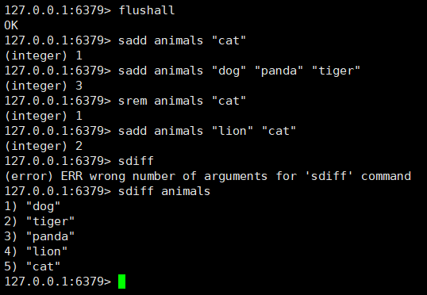

例如上图，如果不进行AOF文件重写，那么AOF文件将保存四条命令，使用AOF重写，那么AOF文件中智慧保留下面一条命令：

```sh
sadd animals "dog" "tiger" "panda" "lion" "cat"
```

默认AOF文件大小是上一次rewrite后大小的一倍且文件大于64M时触发。

#### 2.11.2.4AOF文件修正

如果在使用AOF文件恢复的时候出现错误，可以使用异常修复命令来修复。

异常修复命令：Redis-check-aof --fix

#### 2.11.2.5AOF优缺点

##### 2.11.2.5.1.优点

1. AOF持久化的方法提供了多种的同步频率，即使使用默认的同步频率每秒同步一次，Redis最多也就丢失1s的数据而已
2. AOF文件使用Redis命令追加的形式构造，因此Redis只能向AOF写入命令的片段，使用Redis-check-aof工具也很容易修正AOF文件
3. AOF文件的格式可读性较强

##### 2.11.2.5.2.缺点

1. 对于具有相同数据的Redis，AOF文件通常要比RDF文件体积更大
2. 虽然AOF提供了多种同步的频率，通常情况下，每秒同步一次的频率也具有较高的性能，但是Redis的负载较高时，rdb比aof具有较高的性能保证
3. rdb使用快照的形式来持久化整个Redis数据，而AOF只是将每次的命令追加到AOF文件中，因此从理论上RDB要比AOF方式更加地健壮。官方文件中也指出AOF的确存在一些Buf，而这些Bug在Rdb中没有。

### 2.11.3.RDB和AOF对比

​	如果能忍受一小段时间内的数据丢失的话，毫无疑问使用RDB是最好的，定时生成RDB快照非常编译进行数据库备份，并且RDB恢复数据集的速度要比AOF恢复的速度要快，而且使用RDB可以避免AOF一些隐藏的Bug，否则就使用AOF。

​	但是一般情况下，建议不要单独使用某一种的持久化方式，都是两者一起使用。在这种情况下，当Redis重启时候会优先载入AOF文件来恢复数据，因为通常情况下AOF文件保存的数据集要比RDB文件保存的数据集更加地完整。

## 2.12Redis消息订阅

# 3.Redis高阶

## 3.1Redis集群环境搭建

## 3.2Redis主从复制

## 3.3Redis哨兵模式

注：参考链接：[Redis哨兵（Sentinel）模式 - 简书 (jianshu.com)](https://www.jianshu.com/p/06ab9daf921d)

当主服务器宕机时，需要手动把一台服务器切换为主服务器，这就需要人为干预，费时还费力，还会造成服务一段时间不可用。于是更多时候就出现了**哨兵模式**

哨兵模式是一种特殊的模式。

Redis提供了哨兵，哨兵是一个独立的进程，作为独立的进程，他可以独立的运行。其原理就是哨兵通过发送命令，等待Redis服务器响应，从而监控运行多个Redis实例。

整体的架构如下图：

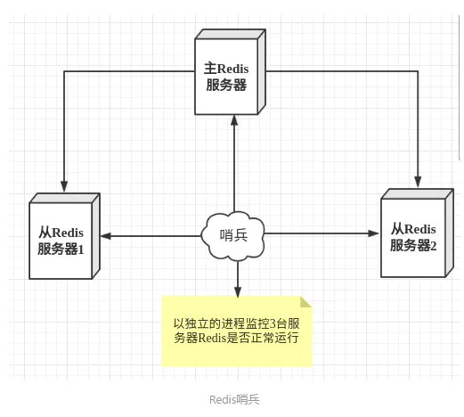

### 3.3.1哨兵的作用

1. 通过发送命令，让Redis服务器返回其运行状态，包括主服务器和从服务器。
2. 当哨兵检测到master节点宕机，会通过选择新master节点的方式切换从节点为master节点（原来老大崩了，会选择新老大）。

### 3.3.2多哨兵模式

一个哨兵进程对Redis服务器集群监控，可能会因为哨兵宕机而导致哨兵模式不可用，因此可以使用多个哨兵构成哨兵集群进行监控，各个哨兵之间还会进行监控，这样就形成了多哨兵模式。

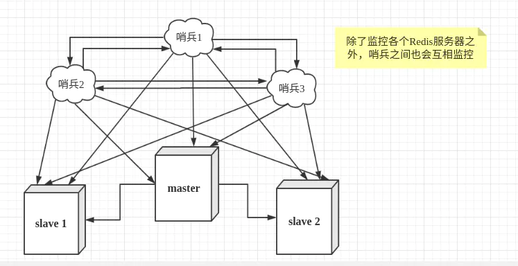

### 3.3.3哨兵模式配置文件

### 3.3.4java中使用多哨兵模式

## 3.4Redis缓存击穿

### 3.4.1什么是Redis缓存击穿

​	在默认情况下，用户请求数据是会先在缓存中查找，若在缓存中没有找到，即缓存没有命中，一般情况下是缓存时间过期。这样会去数据库中查找，引起数据库压力瞬间增大，造成数据库较大的压力。

### 3.4.2缓存击穿的解决方案

1. 设置热点数据永不过期
2. 接口限流与熔断、服务降级：重要的接口一定做好限流策略，防止用户恶意刷接口，同时要做降级准备，当接口中某些服务不可用的时候，进行熔断，快速失败快速返回错误。
3. 布隆过滤器：Bloom Filter就类似于一个Hash Set，用于快速判断某个元素是否存在于集合中，其典型的应用场景就是快速判断一个key是否存在于某容器，不存在就直接返回。
4. 加互斥锁

### 3.4.3.布隆过滤器Bloom Filter

#### 3.4.3.1什么是Bloom Filter？

布隆过滤器Bloom Filter是1970年由布隆提出的。

它实际上是一个很长的二进制向量和一些列的随机映射函数。

布隆过滤器可以用于检索一个元素是否在一个集合中，它的优点就是空间效率和查询时间都要比一般的算法要好得多，缺点就是有一定的误识别率和删除困难。

#### 3.4.3.2布隆过滤器的使用场景

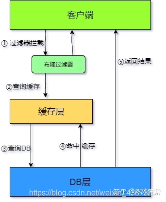

#### 3.4.3.3Redis集成布隆过滤器

## 3.5Redis缓存穿透

### 3.5.1什么是Redis缓存穿透

​	缓存穿透是说缓存和数据库中都没有目标数据，而客户会不断发起请求，每次请求，缓存层没有数据，缓存也就失去了意义，请求的压力就到了数据库层面，流量大时，数据库可能也会挂掉。

### 3.5.2缓存穿透的解决方案

1. 接口层添加校验

2. Key-null

   从缓存中拿不到的数据，在数据库中也没找到，这是可以将key-value对写为key-null，缓存有效的时间可以设置短点，如30秒，这样可以防止用户反复使用同一个id暴力攻击。

## 3.6Redis缓存雪崩

### 3.6.1什么是Redis缓存雪崩

​	缓存雪崩是说，缓存中大批不同的数据到期，而且当前的访问时间巨大，引起数据库的压力过大，甚至宕机。

### 3.6.2缓存雪崩的解决方案

1. 缓存数据的过期时间设置随机，防止同一时间大量数据过期想象的发生。
2. 设置热点数据永不过期

## 3.N...

long long a Way~


