# java_jvm

2022年4月8日11:02:38迁移至此：==初步探寻==

==注：本版本为初步探寻==

**面试重灾区：问得多，并且是等级分层的基础点。**

**提升能力必须逾越的鸿沟。**

- 请你谈谈你对jvm的理解？java8虚拟机和之前的变化更新？
- 什么是OOM？什么是栈溢出？Stack Overflow Error？怎么分析？
- JVM的常用调优参数有哪些？
- 内存快照如何抓取？怎么分析Dump文件？
- 谈谈jvm中，对类加载器的认识？

# 1.JVM的体系结构


1. jvm是包含在java运行时环境（JRE）中，凌驾于操作系统之上的特殊软件。


2. 百分之99的JVM调优都是在堆中调优，Java栈、本地方法栈、程序计数器是不会存在垃圾的。

# 2.类加载器

## 2.1 .java文件-->.class文件的变化


## 2.2.类加载器的作用

​	作用：加载.class文件

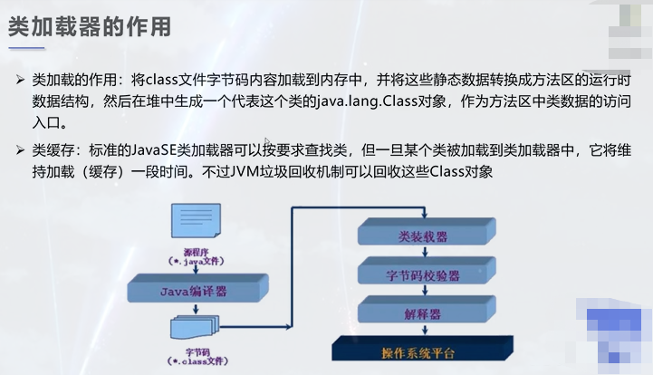

其他：

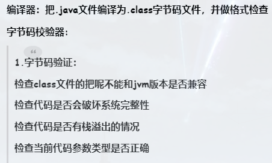

## 2.3.类的加载过程

### 2.3.1.类的加载过程

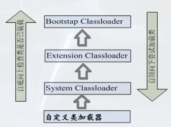


### 2.3.2.什么时候会发生类初始化？


### 2.3.3.类的加载的示例：


## 2.4类的加载和ClassLoader的理解

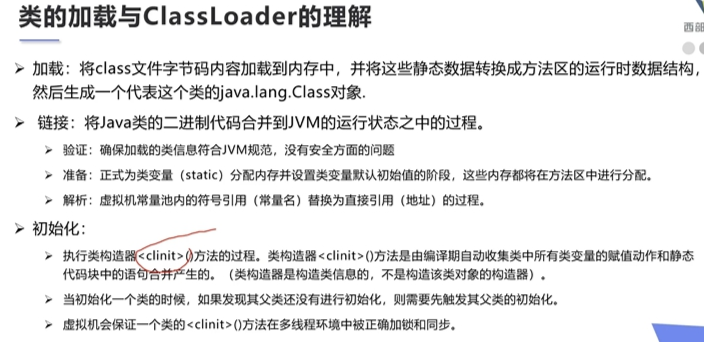

## 2.5类加载器的种类

- JVM自带的加载器(3种)
  - **启动类加载器:Bootstrap ClassLoader,**又名根类加载器或引导类加载器：负责加载%JAVA_HOME%\bin目录下的所有jar包，或者是-Xbootclasspath参数指定的路径jdk中的**rt.jar**；
  - **拓展类加载器:Extension ClassLoader：**负责加载%JAVA_HOME%\bin\ext目录下的所有jar包，或者是java.ext.dirs参数指定的路径；
  - **系统类加载器:Application ClassLoader**,又名应用类加载器：负责加载用户类路径上所指定的类库，如果应用程序中没有自定义加载器，那么次加载器就为默认加载器。

## 2.6热部署类加载器

- 相同的类被同一个类加载器多次加载，则会报错。因此热部署是让同一个类文件被不同的类加载器加载重复加载即可。
- 我们不能调用loadClass方法，而应该调用findClass方法，避免双亲委派机制，从而实现同一个类被加载多次，实现热部署

# 3.双亲委派机制

## 3.1双亲委派机制的目的

==**安全**==

## 3.2双亲委派机制的流程

 1.类加载器收到类加载的请求

 2.将这个请求向上委托给父类加载器去完成，一 直向上委托，直到启动类加载器

 3.启动加载器检查是否能够加载当前这个类，能加载就结束， 使用当前的加载器，否则， 抛出异常，通知子加载器进行加载

 4.重复步骤3

注：Class Not found异常便从这里开始


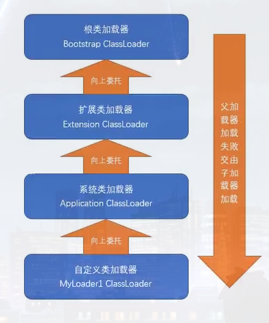

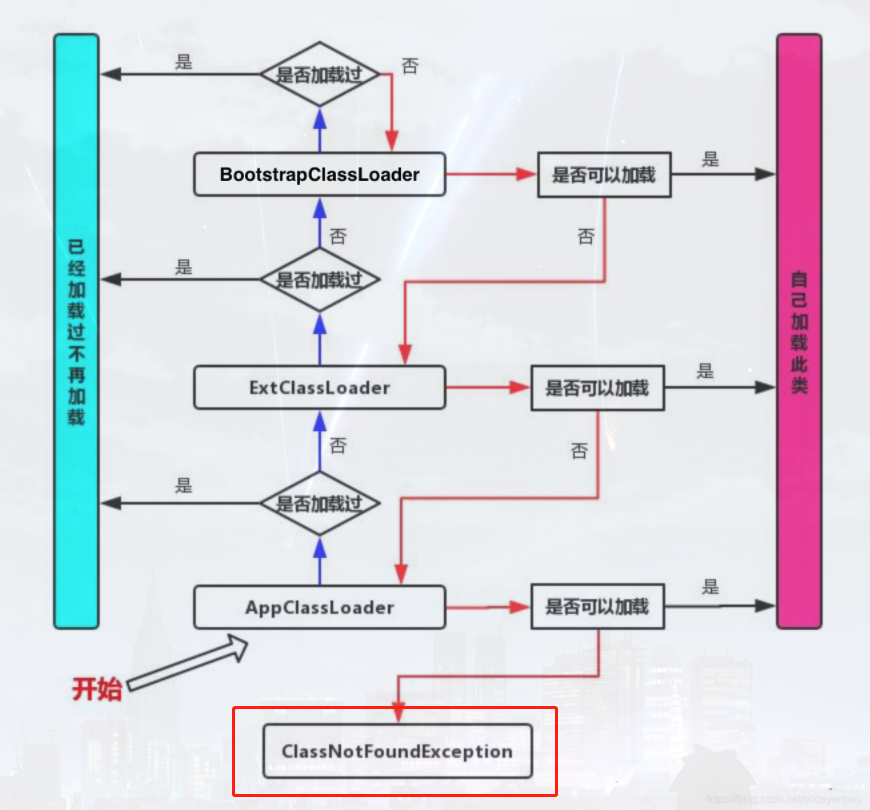

## 3.3双亲委派机制的实现

由类加载器实现。

## 3.4双亲委派模型

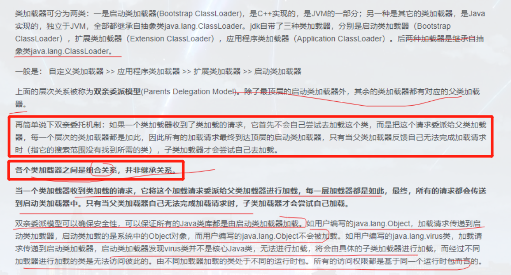

## 3.5为什么采用双亲委派模型？

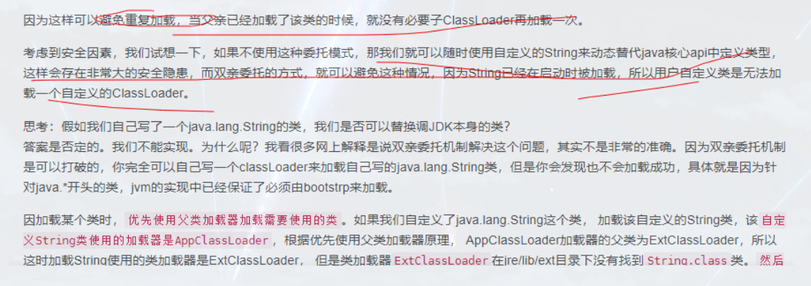

# 4.沙箱安全机制

## 4.1什么是沙箱？

  Java安全模型的核心就是Java沙箱(sandbox) ,

  什么是沙箱?沙箱是一个限制程序运行的环境。沙箱机制就是将Java代码限定在虚拟机(JVM)特定的运行范围中，并且严格限制代码对本地系统资源访问，通过这样的措施来保证对代码的有效隔离，防止对本地系统造成破坏。

 沙箱主要限制系统资源访问，那系统资源包括什么? CPU、内存、文件系统、网络。不同级别的沙箱对这些资源访问的限制也可以不一样。

 所有的Java程序运行都可以指定沙箱，可以定制安全策略。

## 4.2JDK安全模型

### 4.2.1.JDK1.0安全模型

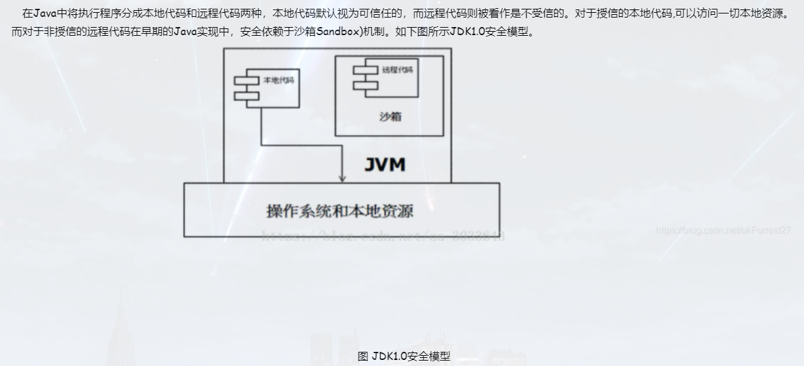

### 4.2.2.JDK1.1安全模型


### 4.2.3.JDK1.2安全模型


### 4.2.4.JDK1.6安全模型


## 4.3组成沙箱的基本组件

### 4.3.1.字节码校验器

确保Java类文件遵循Java语言规范。这样可以帮助Java程序实现内存保护。但并不是所有的类文件都会经过字节码校验，比如核心类。

### 4.3.2.类加载器

- 它防止恶意代码去干涉善意的代码;
- 它守护了被信任的类库边界;
- 它将代码归入保护域,确定了代码可以进行哪些操作。

 虚拟机为不同的类加载器载入的类提供不同的命名空间，命名空间由一系列唯一的名称组成， 每一个被装载的类将有一个名字，这个命名空间是由Java虚拟机为每一个类装载器维护的，它们互相之间甚至不可见。

 类装载器采用的机制是双亲委派模式。

 1.从最内层JVM自带类加载器开始加载,外层恶意同名类得不到加载从而无法使用;

 2.由于严格通过包来区分了访问域,外层恶意的类通过内置代码也无法获得权限访问到内层类，破坏代码就自然无法生效。

## 4.4沙箱的作用

  安全提供者
  消息摘要
  数字签名
  加密
　 鉴别

# 5.Native

`2021年12月2日22:37查看Boss的时候发现有要求熟练掌握JNI`

- native :凡是带了native关键字的，说明java的作用范围达不到了，回去调用底层c语言的库!
- 会进入本地方法栈
- 调用本地方法本地接口 JNI (Java Native Interface)
- JNI作用:开拓Java的使用，融合不同的编程语言为Java所用!最初: C、C++
- Java诞生的时候C、C++横行，想要立足，必须要有调用C、C++的程序
- 它在内存区域中专门开辟了一块标记区域: Native Method Stack，登记native方法
- 在最终执行的时候，加载本地方法库中的方法通过JNI


1. Native Method Stack

   它的具体做法是Native Method Stack中登记native方法，在( Execution Engine )执行引擎执行的时候加载Native Libraies。[本地库]

2. Native Interface本地接口

   本地接口的作用是融合不同的编程语言为Java所用，它的初衷是融合C/C++程序, Java在诞生的时候是C/C++横行的时候，想要立足，必须有调用C、C++的程序，于是就在内存中专门开辟了块区域处理标记为native的代码，它的具体做法是在Native Method Stack 中登记native方法,在( Execution Engine )执行引擎执行的时候加载Native Libraies。

 **目前该方法使用的越来越少了，除非是与硬件有关的应用，比如通过Java程序驱动打印机或者Java系统管理生产设备，在企业级应用中已经比较少见。因为现在的异构领域间通信很发达，比如可以使用Socket通信,也可以使用Web Service等等，不多做介绍!**

# 6.PC寄存器

程序计数器: Program Counter Register

 每个线程都有一个程序计数器，是线程私有的，就是一个指针, 指向方法区中的方法字节码(用来存储指向像一条指令的地址， 也即将要执行的指令代码)，在执行引擎读取下一条指令, 是一个非常小的内存空间，几乎可以忽略不计

# 7.方法区（重点）

## 7.1.什么是方法区？

​	方法区是被所有线程共享,所有字段和方法字节码，以及一些特殊方法，如构造函数,接口代码也在此定义,简单说，所有定义的方法的信息都保存在该区域,此区域属于共享区间;

## 7.2.什么在方法区内？

​	==静态成员（静态变量，静态方法）、常量、类信息(构造方法、接口定义)、运行时的常量池存在方法区中，但是实例变量存在堆内存中，和方法区无关==

## 7.3.方法区、栈、堆实例化对象后的示意图


## 7.4.方法区的历史

1. 方法区(Method Area) 与Java堆一样, 是各个线程共享的内存区域, 它用于存储已被虚拟机加载的类信息, 常量, 静态变量, 即时编译器编译后的代码等数据。 虽然Java虚拟机规范把方法区描述为堆的一个逻辑部分, 但是它却有一个别名叫做Non-Heap非堆, 目的应该是与Java Heap 区分开来。

2. ==在JDK1.7以前HotSpot虚拟机使用永久代来实现方法区，永久代的大小在启动JVM时可以设置一个固定值（-XX:MaxPermSize），不可变；==

3. 在JDK1.7中 存储在永久代的部分数据就已经转移到Java Heap或者Native memory。譬如符号引用(Symbols)转移到了native memory，原本存放在永久代的字符常量池移出。但永久代仍存在于JDK 1.7中，并没有完全移除。

4. JDK1.8中进行了较大改动

   `移除了永久代（PermGen），替换为元空间（Metaspace）；
   永久代中的 class metadata 转移到了 native memory（本地内存，而不是虚拟机）；
   永久代中的 interned Strings 和 class static variables 转移到了 Java heap；
   永久代参数 （PermSize MaxPermSize） -> 元空间参数（MetaspaceSize MaxMetaspaceSize）`

## 7.5.方法区属于堆吗？

方法区是堆的逻辑部分，别名Non-Heap（非堆），目的是为了将其与堆区分开。

# 8.栈（重点）

## 8.1.什么是栈？

**栈主要是用来执行程序的**。

先进后出。

## 8.2.什么存放在栈中？

new对象的引用，八大基本类型

## 8.3.栈的运行原理

由栈帧实现

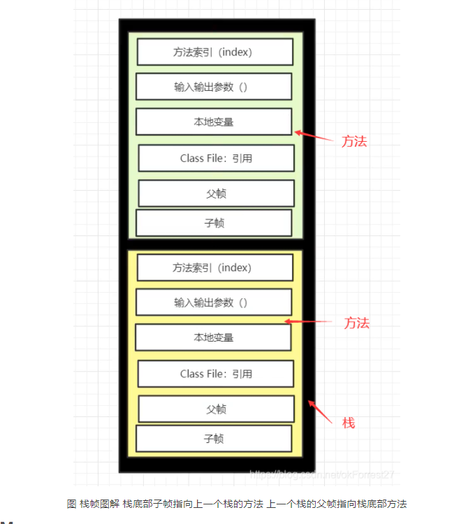

## 8.4.栈的相关错误

栈溢出：StackOverFlow

## 8.5.方法区、栈、堆实例化对象后的示意图


# 9.堆（重点）

- 英文翻译：Heap
- java堆（java Heap）是java虚拟机所管理的内存中最大的一块，堆内存的唯一目的就是存在对象实例，几乎所有的对象实例均在里分配内存，这个区域也是java垃圾管理器的主要区域，因此堆内存也会称为GC 堆。

## 9.1.堆内存

Java 中的堆是 JVM 所管理的最大的一块内存空间（我们jvm调优的重点），主要用于存放各种类的实例对象。


## 9.2.什么东西会放在堆中？

堆中主要存放的是对象实例以及数组。

## 9.3.堆的分区

### 9.3.1.堆分区的历史

1. ==**JDK1.8之后堆被划分成两个不同的区域：新生代 ( Young )、老年代 ( Old )。**==

   - 新生代还可以分为伊甸园（Eden），幸存From区（Survivor From），幸存To区（Survivor To）
   - 之前版本的永久代被彻底抛弃，从1.7开始地去永久代，然后1.8更新后直接去除，之前永久代存放的数据同样全部转移到元空间中，元空间位于本地内存。

   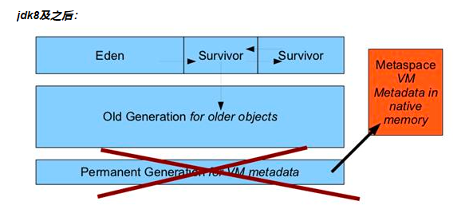

2. JDK1.8之前：新生代（Young），老年代（Old），永久代（PermGen）

   

### 9.3.2.新生代

1. 什么是新生代？

   类诞生、成长甚至死亡的地方

2. 伊甸园

   所有对象都是在伊甸园Eden区new出来的。

3. 幸存From和幸存To

   **1个Eden区和2个Survivor区（分别叫From和To），默认比例为8：1。**

4. 对象与伊甸园和幸存区的转换

   `一个对象的这一辈子：我是一个普通的java对象，我出生在Eden区，在Eden区我还看到和我长的很像的小兄弟，我们在Eden区中玩了挺长时间。有一天Eden区中的人实在是太多了，我就被迫去了Survivor区的“From”区，自从去了Survivor区，我就开始漂了，有时候在Survivor的“From”区，有时候在Survivor的“To”区，居无定所。直到我18岁的时候，爸爸说我成人了，该去社会上闯闯了。于是我就去了年老代那边，年老代里，人很多，并且年龄都挺大的，我在这里也认识了很多人。在年老代里，我生活了20年(每次GC加一岁)，然后被回收。`

5. 新生代与GC

   - 伊甸园满了就触发轻GC，经过轻GC存活下来的就到了幸存者区，幸存者区满之后意味着新生区也满了，则触发重GC，经过重GC之后存活下来的就到了养老区。

   - ==幸存To区始终都是空的。==

   - 新生代也是GC最频繁的区域

   - 这里涉及到GC的一个算法：复制算法，详细会在Jvm调优中阐述

     HotSpot JVM把年轻代分为了三部分：1个Eden区和2个Survivor区（分别叫from和to）。默认比例为8：1,为啥默认会是这个比例，接下来我们会聊到。一般情况下，新创建的对象都会被分配到Eden区(一些大对象特殊处理),这些对象经过第一次Minor GC后，如果仍然存活，将会被移到Survivor区。对象在Survivor区中每熬过一次Minor GC，年龄就会增加1岁（被标记，标记也可以单独设计），当它的年龄增加到一定程度时，就会被移动到年老代中。

     因为年轻代中的对象基本都是朝生夕死的(80%以上)，所以在年轻代的垃圾回收算法使用的是复制算法，复制算法的基本思想就是将内存分为两块，每次只用其中一块，当这一块内存用完，就将还活着的对象复制到另外一块上面。复制算法不会产生内存碎片。

     在GC开始的时候，对象只会存在于Eden区和名为“From”的Survivor区，Survivor区“To”是空的。紧接着进行GC，Eden区中所有存活的对象都会被复制到“To”，而在“From”区中，仍存活的对象会根据他们的年龄值来决定去向。年龄达到一定值(年龄阈值，可以通过-XX:MaxTenuringThreshold来设置)的对象会被移动到年老代中，没有达到阈值的对象会被复制到“To”区域。经过这次GC后，Eden区和From区已经被清空。这个时候，“From”和“To”会交换他们的角色，也就是新的“To”就是上次GC前的“From”，新的“From”就是上次GC前的“To”。不管怎样，都会保证名为To的Survivor区域是空的。Minor GC会一直重复这样的过程，直到“To”区被填满，“To”区被填满之后，会将所有对象移动到年老代中。

     

6.**新生代相关的JVM参数**

- -XX:NewSize和-XX:MaxNewSize：用于设置年轻代的大小，建议设为整个堆大小的1/3或者1/4,两个值设为一样大。
- -XX:SurvivorRatio：用于设置Eden和其中一个Survivor的比值。
- -XX:+PrintTenuringDistribution：这个参数用于显示每次Minor GC时Survivor区中各个年龄段的对象的大小。
- -XX:InitialTenuringThreshol和-XX:MaxTenuringThreshold：用于设置晋升到老年代的对象年龄的最小值和最大值。

7.为什么会有Survivor区？

1. Survivor区的意义

   - Survivor区的过渡意义

   **如果没有Survivor，Eden区每进行一次Minor GC，存活的对象就会被送到老年代。老年代很快被填满，触发Major GC（因为Major GC一般伴随着Minor GC，也可以看做触发了Full GC）。老年代的内存空间远大于新生代，进行一次Full GC消耗的时间比Minor GC长得多**。你也许会问，执行时间长有什么坏处？频发的Full GC消耗的时间是非常可观的，这一点会影响大型程序的执行和响应速度，更不要说某些连接会因为超时发生连接错误了。

   | 方案           | 优点                                        | 缺点                                                      |
   | -------------- | ------------------------------------------- | --------------------------------------------------------- |
   | 增加老年代空间 | 更多存活对象才能填满老年代。降低Full GC频率 | 随着老年代空间加大，一旦发生Full GC，执行所需要的时间更长 |
   | 减少老年代空间 | Full GC所需时间减少                         | 老年代很快被存活对象填满，Full GC频率增加                 |

   <u>**第一条结论**</u>：Survivor的存在意义，就是减少被送到老年代的对象，进而减少Full GC的发生，Survivor的预筛选保证，只有经历16次Minor GC还能在新生代中存活的对象，才会被送到老年代。

   - 为什么会有两个Survior区？

   *设置两个Survivor区最大的好处就是解决了碎片化*，下面我们来分析一下。

   为什么一个Survivor区不行？第一部分中，我们知道了必须设置Survivor区。假设现在只有一个survivor区，我们来模拟一下流程：
   刚刚新建的对象在Eden中，一旦Eden满了，触发一次Minor GC，Eden中的存活对象就会被移动到Survivor区。这样继续循环下去，下一次Eden满了的时候，问题来了，此时进行Minor GC，Eden和Survivor各有一些存活对象，**如果此时把Eden区的存活对象硬放到Survivor区，很明显这两部分对象所占有的内存是不连续的，也就导致了内存碎片**化。
   我绘制了一幅图来表明这个过程。其中色块代表对象，白色框分别代表Eden区（大）和Survivor区（小）。Eden区理所当然大一些，否则新建对象很快就导致Eden区满，进而触发Minor GC，有悖于初衷。

### 9.3.3.老年代

1.老年代Info

老年代GC(Major GC/Full GC):指发生在老年代的GC,出现了Major GC,经常会伴随至少一次的Minor GC(但非绝对的,在Parallel Scavenge收集器的收集策略里就有直接进行Major GC的策略选择过程)。Major GC的速度一般会比Minor GC慢10倍以上。

**大对象直接进入老年代。**所谓的大对象是指,需要大量连续内存空间的Java对象,最典型的大对象就是那种很长的字符串以及数组(byte[]数组就是典型的大对象)。大对象对虚拟机的内存分配来说就是一个坏消息(替Java虚拟机抱怨一句,比遇到一个大对象更加坏的消息就是遇到一群“朝生夕灭”的“短命大对象”,写程序的时候应当避免),经常出现大对象容易导致内存还有不少空间时就提前触发垃圾收集以获取足够的连续空间来“安置”它们。

**长期存活的对象将进入老年代。**虚拟机给每个对象定义了一个对象年龄(Age)计数器。如果对象在Eden出生并经过第一次Minor GC后仍然存活,并且能被Survivor容纳的话,将被移动到Survivor空间中,并且对象年龄设为1。对象在Survivor区中每“熬过”一次Minor GC,年龄就增加1岁,当它的年龄增加到一定程度(默认为15岁),就将会被晋升到老年代中。

2.**老年代相关的JVM参数**

- `-XX:PretenureSizeThreshold`令大于这个设置值的对象直接在老年代分配。这样做的目的是避免在Eden区及两个Survivor区之间发生大量的内存复制(新生代采用复制算法收集内存)。

### 9.3.4.永久代

注：==目前公司环境多实用JDK1.8，所以永久代已经成为历史。==

1.永久代的历史

- jdk1.6之前:永久代,常量池是在方法区;
- jdk1.7:永久代,但是慢慢的退化了，去永久代，常量池在堆中
- jdk1.8之后:无永久代,常量池在元空间

2.永久代存在时的堆内存划分

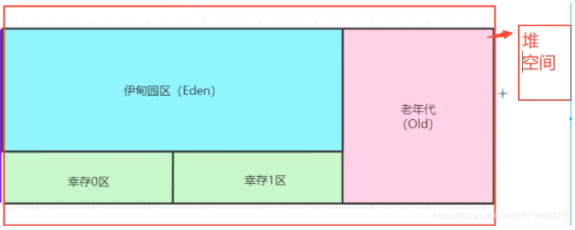

***移除持久代后，PermGen空间的状况：***

- 这部分的内存空间被全部移除
- PermSize和MaxPermSize会被忽略并给出警告（如果在启用的时候设置了这两个参数）

### 9.3.5.元空间

1.元空间是什么？

随着JDK8的到来，JVM不再有PermGen。但类的元数据信息（metadata）还在，只不过不再是存储在连续的堆空间上，而是移动到叫做“Metaspace”的==本地内存（Native memory）==中。

2.**元空间的历史，也就是为什么要移除永久代？**

- 避免OOM异常：通常使用PermSize和MaxPermSize设置永久代的大小，就决定了永久代的上限，但不清楚分配的空间是否够用或者默认选择分配的空间更加容易触发OOM错误，当使用元空间的时候，不再有系统设置的上限决定分配的空间大小，理论上可以根据硬件系统的实际可用空间来控制。
- jdk1.7之前字符串常量池是存放在永久代中，容易出现性能问题和内存溢出。
- 永久代会给GC带来不必要的复杂度，且永久代的回收率偏低。
- 合并HotSpot和JRockit两个虚拟机的代码，且JRockit从未有永久代的概念，不需要开发人员设置永久代的大小，但运行良好。

根据上面的各种原因，永久代最终被移除，**方法区移至Metaspace，字符串常量移至Java Heap**。

3.元空间存放着什么？

1. 虚拟机加载的类信息
2. 常量池
3. 静态变量

4.MetaSpace相关的JVM参数

| **参数名**            | **作  用**                                                   |
| --------------------- | ------------------------------------------------------------ |
| MetaspaceSize         | 初始化的Metaspace大小，控制Metaspace发生GC的阈值。GC后，动态增加或者降低MetaspaceSize，默认情况下，这个值大小根据不同的平台在12M到20M之间浮动 |
| MaxMetaspaceSize      | 限制Metaspace增长上限，防止因为某些情况导致Metaspace无限使用本地内存，影响到其他程序，默认为4096M |
| MinMetaspaceFreeRatio | 当进行过Metaspace GC之后，会计算当前Metaspace的空闲空间比，如果空闲比小于这个参数，那么虚拟机增长Metaspace的大小，默认为40，即70% |
| MaxMetaspaceFreeRatio | 当进行过Metaspace GC之后，会计算当前Metaspace的空闲空间比，如果空闲比大于这个参数，那么虚拟机会释放部分Metaspace空间，默认为70，即70% |
| MaxMetaspaceExpanison | Metaspace增长时的最大幅度，默认值为5M                        |
| MinMetaspaceExpanison | Metaspace增长时的最小幅度，默认为330KB                       |

5.元空间Info

- 元空间：逻辑上存在，物理上并不存在，因为存储在本地内存上的缘故，并不计算在JVM虚拟内存中。

- 通常所说的常量池是运行时常量池，存放在元空间中，而字符串常量池是存放在堆中，字符串常量池和类常量池实在编译时产生。

  - 运行时常量池和字符串常量池的关系

    - 运行时常量池是一个统称，包含字符串常量池，不过字符串常量池仅包含字符串对象，运行时常量池还包括类信息，属性信息，方法信息。
    - jdk1.7之前，运行时常量池是包含字符串常量池的，且都在方法区，具体实现由Hotspot虚拟机的永久代实现。
    - jdk1.7，字符串常量池从运行时常量池中剥离出来，移到堆中，运行时常量池的其他部分仍在方法区，具体实现仍由永久代实现。
    - jdk1.8，方法区的实现由永久代变成了元空间，字符串常量池依然在堆中。

  - 插一嘴：什么是常量池？什么是运行时常量池？

    - 

    - 常量池中包含：

      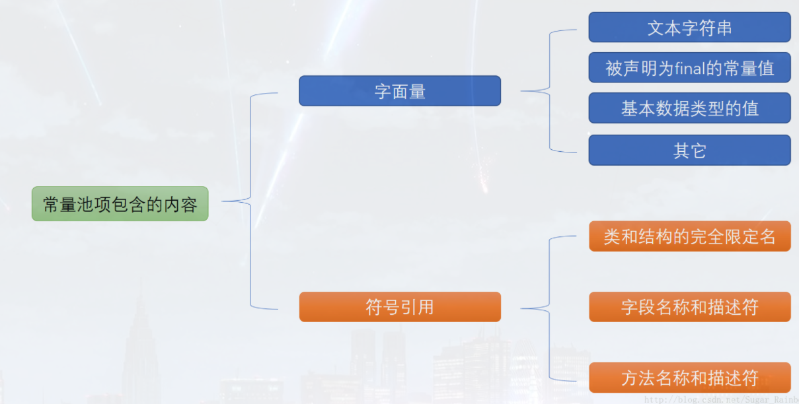

### 9.3.6.整数缓冲区、字符串常量池

```java
/**
     * @param
     * @return void
     * @Author: WP
     * @Date: 2021/12/3 9:26
     * @Version 1.0
     * @Description: 一次性解决==和equals()方法的区别，同时针对面试整理的面试题01
     * @UpdateUser WP
     */
    @Test
    public void testEquals01() {
        /*
        == vs equals()
        区别：
        1.== 关系运算符 equals()是Object类的方法。
        2.== 既可以比较基本类型，也可以比较引用类型，equals()仅可以比较引用类型。
            == 比较基本类型时直接对比目标的值，并返回结果
               比较引用类型，对比目标的内存地址，并返回结果
            equals()比较引用类型，默认是判断目标对象的内存地址，实际生产情况下指对比包装类及String类，因为上述类重写了继承Object类的方法，所以是对比目标对象的值
         */

        /**
         * 此处难点容易混淆的点也是 整数缓冲区和字符串常量池 的应用
         */

        int a = 100;
        int b = 100;
        int c = 200;
        int d = 200;
        System.out.println("--------------------------");
        System.out.println("== 对比基本类型");
        //true
        System.out.println(a == b);
        //true
        System.out.println(c == d);
        System.out.println("--------------------------");
        Integer integer01 = 100;
        Integer integer02 = 100;
        Integer integer03 = 200;
        Integer integer04 = 200;
        System.out.println("== 对比基本类型的包装类(一)");
        //true
        System.out.println(integer01 == integer02);
        //false
        System.out.println(integer03 == integer04);
        System.out.println("--------------------------");
        System.out.println("== 对比基本类型的包装类(二)");
        Integer integer05 = new Integer(100);
        Integer integer06 = new Integer(100);
        Integer integer07 = new Integer(200);
        Integer integer08 = new Integer(200);
        //false
        System.out.println(integer05 == integer06);
        //false
        System.out.println(integer05 == integer01);
        //false
        System.out.println(integer07 == integer08);
        //false
        System.out.println(integer07 == integer04);
        System.out.println("--------------------------");
        System.out.println("== 对比String类");
        String str01 = "Hello";
        String str02 = "He";
        String str03 = "llo";
        String str04 = str02 + str03;
        String str05 = "He" + "llo";
        String str06 = "He" + new String("llo");
        String str07 = new String("Hello");
        String str08 = new String("He") + new String("llo");
        //false
        System.out.println(str01 == str04);
        //true
        System.out.println(str01 == str05);
        //false
        System.out.println(str04 == str05);
        //false
        System.out.println(str01 == str06);
        //false
        System.out.println(str01 == str07);
        //false
        System.out.println(str01 == str08);
        //false
        System.out.println(str07 == str08);
        System.out.println("--------------------------");
    }
    
    /**
     * @Author: WP
     * @Date: 2021/12/3 10:49
     * @Version 1.0
     * @Description: 一次性解决==和equals()方法的区别，同时针对面试整理的面试题02
     * @UpdateUser WP
     * @param  
     * @return void
     */
    @Test
    public void testEquals02(){
        Integer integer01 = 100;
        Integer integer02 = 100;
        Integer integer03 = 200;
        Integer integer04 = 200;
        System.out.println("equals 判断基本类型的包装类01");
        //true
        System.out.println(integer01.equals(integer02));
        //true
        System.out.println(integer03.equals(integer04));

        System.out.println("--------------------------");
        System.out.println("equals 判断基本类型的包装类02");
        Integer integer05 = new Integer(100);
        Integer integer06 = new Integer(100);
        Integer integer07 = new Integer(200);
        Integer integer08 = new Integer(200);
        //true
        System.out.println(integer05.equals(integer06));
        //true
        System.out.println(integer07.equals(integer08));

        System.out.println("--------------------------");
        System.out.println("equals 判断String类");
        String str01 = "Hello";
        String str02 = "He";
        String str03 = "llo";
        String str04 = str02 + str03;
        String str05 = "He" + "llo";
        String str06 = "He" + new String("llo");
        String str07 = new String("Hello");
        String str08 = new String("He") + new String("llo");
        //true
        System.out.println(str01.equals(str04));
        //true
        System.out.println(str01.equals(str05));
        //true
        System.out.println(str01.equals(str06));
        //true
        System.out.println(str01.equals(str07));
        //true
        System.out.println(str01.equals(str08));
        //true
        System.out.println(str07.equals(str08));
        System.out.println("--------------------------");
    }
```

`2021年12月2日23:15:54整数缓冲区和字符串常量池的位置困扰我很久，也把我干懵过。`

- 两者都是用了池化技术（什么是池化技术？池化技术的好处？[(40条消息) Java池化技术_码农翻身之道的博客-CSDN博客_java池化技术](https://blog.csdn.net/weixin_43845116/article/details/107057624?spm=1001.2101.3001.6650.6&utm_medium=distribute.pc_relevant.none-task-blog-2~default~BlogCommendFromBaidu~default-6.no_search_link&depth_1-utm_source=distribute.pc_relevant.none-task-blog-2~default~BlogCommendFromBaidu~default-6.no_search_link)）
- jDK1.8 两者存放的位置：堆内存。

#### 9.3.6.1.整数缓冲区

- 涉及到基本类型的装箱拆箱，**常见的面试题就是比较**。同样这里考究==和equals（）的使用，常见的面试题的equals（）比较相对简单，因为Object类的部分子类是重写了equals（）方法。

- 具体的整数缓冲区参考上面的描述。

  IntegerCache中包含一个从-128到127的数组，使用`Integer integer = 100;`类似语句直接赋值的对象，在前面数组范围之内的便是直接引用整数缓冲区内的对象，因此无论使用==比较对象地址或者equals（）方法比较对象的值，结论都是True

  反之，赋值超过了这个数组范围，便会直接去new对象，此时使用==比较对象的内存地址则为false，无论值是否相等，同样使用了equals比较依旧是比较的值。（此处引申IDEA的智能提示：包装类型之间的相等判断应该用equals，而不是‘= =’，原因是包装类型及常用String中重写了equals（）方法，判断两个对象是否为同一个类，若为同类便直接比较对象的值，从而返回我们想要的结果。）


#### 9.3.6.2.字符串常量池

- 常见面试题：参考上方代码
- 这里引申出String类的问题：
  - 正确理解Java字符串常量池和intern（）方法：[理解Java字符串常量池与intern()方法 - 没课割绿地 - 博客园 (cnblogs.com)](https://www.cnblogs.com/justcooooode/p/7603381.html)
  - 为什么java中的String类是不可变的。：[为什么Java中的String类是不可变的? - 没课割绿地 - 博客园 (cnblogs.com)](https://www.cnblogs.com/justcooooode/p/7514863.html)

在使用==比较的时候，重点理解**使用字面量赋值创建String对象**和**使用new创建String对象**的区别

- 直接使用字面量赋值创建的时候，jvm会在编译期进行优化，从而直接生成新的String对象，存在字符串常量池中，同时如果之前存在值相等的字符串，直接生成引用即可，然后比较的话，便会返回true。

- 使用new创建String对象的时候，便是去内存中开辟新的地址，同时会在堆中和字符串常量池中创建两个对象，即使字符串常量池中存在值相等的字符串对象也会创建新的，因此，比较的话指定是false，因为内存地址是不同的。

  ==同样IDEA会提醒请勿使用此方法创建String对象以及使用包装类的new方法区创建包装类的对象，前者涉及多余创建对象，占用内存空间，后者涉及进行了多余的拆箱操作，增加程序运行时间，因此有简单的方式建议不要使用复杂的操作，此方式仅限面试了解。同时根据java代码规范以及IDEA的提示合理编写代码。==

# 10.java的三种jvm

●Sun公司HotSpot Java Hotspot™

●BEA JRockit

●IBM J9VM

我们学习都是: Hotspot

## 10.1.**如何查看电脑的jvm版本？**

CMD命令：java -version：除了可以查看java环境的安装情况，java的版本，且可以查看jvm的版本信息


# 11.GC垃圾回收

注：醍醐灌顶一下：想来几个面试题

- JVM的内存模型和分区？请详细到每个区存放什么？
- 堆里的分区有哪些？
- GC的算法有哪些？
- 轻GC和重GC分别在什么时候发生？

## 11.1.什么是GC？

每个程序员都遇到过内存溢出的情况，程序运行时，内存空间是有限的，那么如何及时的把不再使用的对象清除将内存释放出来，这就是GC要做的事。

GC：垃圾收集，英文全称为Garbage Collection，通常称为"GC"。

## 11.2.GC的对象

GC需要回收的对象就是已经没有存活的对象。

判断一个对象是否存活常用的有两种方法：引用计数法和可达分析法。

1. 可达分析法：从GC Roots开始往下搜索，搜索走过的路称为引用链，当一个对象到GC Roots没有任何引用链时，则证明此对象是不可用的。

   > 在Java语言中，**GC Roots**包括：
   >
   > 虚拟机栈中引用的对象。
   >
   > 方法区中类静态属性实体引用的对象。
   >
   > 方法区中常量引用的对象。
   >
   > 本地方法栈中JNI引用的对象

2. 引用计数法：每一个对象均有一个引用计数的属性，新增一个引用时计数器加一，引用释放时计数减一，计数为0时可以回收。此方法简单，无法解决对象互相循环引用的问题。

## 11.3.轻GC、重GC

`百度搜索的时候会发现很多的名词，还有full GC等等，结合整体环境判断同属于哪种，别被名字不同的翻译搞混了。`

### 11.3.1.轻GC和重GC触发的条件

`伊甸园满了就触发轻GC，经过轻GC存活下来的就到了幸存者区，`

`幸存者区满之后意味着新生区也满了，则触发重GC，`

`经过重GC之后存活下来的就到了养老区`

### 11.3.2.什么是MinorGC、MajorGC？


1. MinorGC 轻GC

   筛选清理流程：此时如果新生的对象无法在Eden区创建（Eden区无法容纳）就会触发一次Young GC，此时会将Survivor From区和Eden区的对象一起进行可达性分析，找出活跃的对象，将其复制到Survivor To区，并且将Eden区和Survivor From区的对象清空，这样那些筛选出的不可达的对象已经全部清除，同时将Survivor From区和Survivor To区交换。

   实现：复制算法

   同样以此反复Survivor区中的两个区也会频繁地交换。

   `注：番外：幸存区为什么有两个区？Survivor From区和Survivor To区`

   > 两个区的话会频繁地交换，从而对To区的垃圾回收，以及分代年龄的提升。

   

2. MajorGC（Full GC） 重GC

   发生在老年代的GC，基本上发生一次Major GC就会发生一次Minor GC，因此相当于进行了一次全局GC。但Major GC的速度往往会比Minor GC慢10倍。

   **筛选清理流程：**

   当Survivor满了或者新对象过大（超大数组）无法存放在Eden区中，触发Major GC清理老年代的空间，放得下的成功，清理之后仍然放不下OOM。

   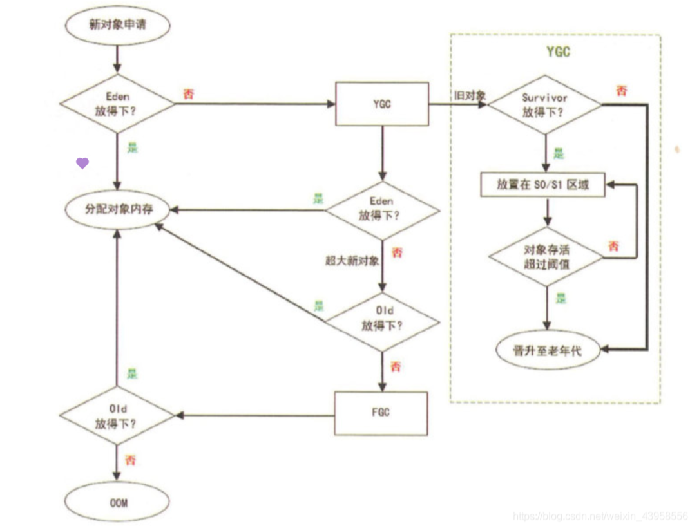

==重GC因为执行起来开销较大，应尽量避免==

- 避免频繁的FullGC
- 避免定义较大的对象（数组）
- 避免将过大的对象定义为静态变量

<u>**实现：标记清除算法**</u>


## 11.4.GC常用算法

### 11.4.1引用计数器法

原理：实际上是通过**在对象头中分配一个空间来保存该对象被引用的次数**。如果该对象被其它对象引用，则它的引用计数+1，如果删除对该对象的引用，那么它的引用计数就-1，当该对象的引用计数为0时，那么该对象就会被回收。GC会将计数器为0的对象C进行销毁。

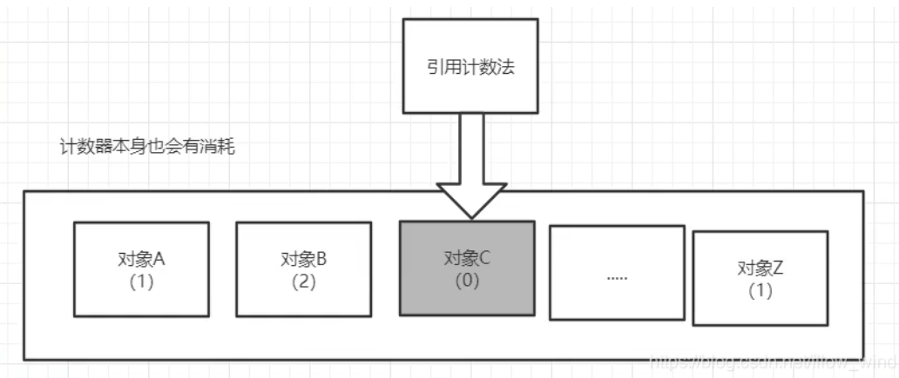

### 11.4.2.复制算法（新生代）

1.复制算法的概念：将原有的**内存空间分为两块**，每次只使用其中一块，在垃圾回收时，将正在使用的内存中的**存活对象复制到未使用的内存块中**，之后，**清除正在使用的内存块中的所有对象**，**交换两个内存的角色**，完成垃圾回收。

- 与标记-清除算法相比，复制算法是一种相对高效的回收方法
- 不适用于存活对象较多的场合，如老年代（复制算法**适合做新生代的GC**）
- 幸存区from和幸存区to中谁空谁是to,我们会将to中的数据复制到from中保持to中数据为空;
- from和to区实际上为逻辑上的概念,保证to区一直空;
- 默认对象经过15次GC后还没有被销毁就会进入养老区.
  - -XX:MaxTenuringThreshold=15 设置进入老年代的存活次数条件

2.原理图


3.流程图展示：

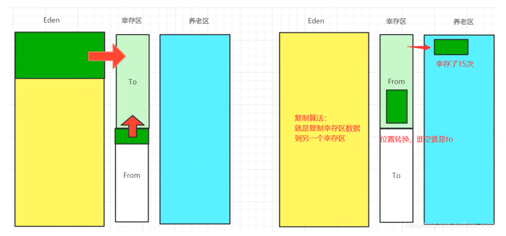

- 好处：没有内存的碎片，内存效率高
- 坏处：
  - 浪费了内存空间，因为一个Survivor区永远都是空的
  - 假设对象100%存活，复制成本相当高

### 11.4.3标记-清除算法

概念：标记-清除算法是现代垃圾回收算法的思想基础，标记-清除算法将垃圾回收分为两个阶段：标记阶段和清除阶段。

一种可行的实现是：在标记阶段，首先通过根节点，标记所有从根节点开始的可达对象。因此未被标记的对象就是未被引用的垃圾对象；然后在清除阶段，清除所有未被标记的对象。

流程示意图：

- 需要进行两次扫描：第一次扫描标记存活对象，第二次扫描清除未被标记的对象

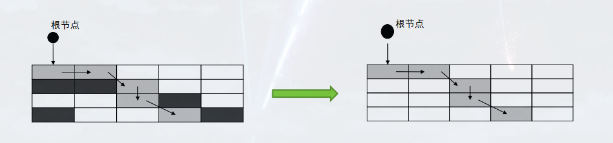

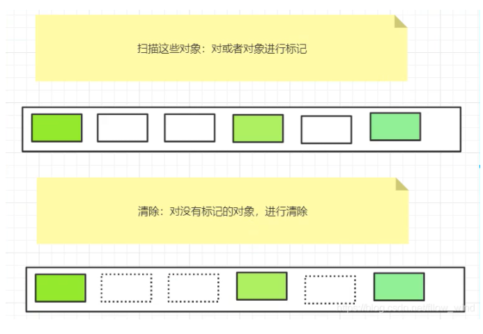

优点：不需要额外空间，优化了复制算法

缺点：两次扫描，浪费了时间，会产生内存碎片

### 11.4.4.标记-压缩/整理算法（老年代）

概念：标记压缩算法适用于存活对象较多的场合，例如老年代。

它在做标记-清除算法的基础上做了一些优化。同标记-清除算法一样，标记-压缩算法也是从根节点开始，对于所有可达的对象进行一次标记，但之后它不是简单地清理未标记的对象，而是将所有存活的对象压缩到内存的一端；之后开始清除边界外的空间。

原理示意图：


### 11.4.5.分代收集算法（新生代和老年代的GC）

当前商业使用的虚拟机采用的都是“分代收集算法”，这并不是什么新的思想，只是根据对象的存活周期的不同将内存化分为几块儿。

一般是把java堆分为新生代和老年代：短命对象化分为新生代，长命对象化分为老年代。

- 少量对象存活：适合复制算法，在新生代中，每次GC都有大批的对象死去，只有少量的存活，选择使用复制算法，只需要付出少量的存货成本便可以完成GC。
- 大量对象存活：适用于标记-清除/标记-压缩整理算法，在老年代，因为对象的存活率较高，没有额外的空间作为担保，就必须使用“标记-清理”或者“标记-整理”算法进行GC

`注:老年代的对象中，有一小部分是因为在新生代回收时。老年代作为担保进来的对象；绝大部分对象都是因为熬过很多次GC都没有回收而进入了老年代`

> ==补充==：Stop the world 
>
> 以上描述的在各种内存区域进行的各种算法活动，也就是垃圾回收过程中，经常涉及到对对象的挪动，进而导致需要对对象引用进行更新，为了保证引用更新的正确性，java会暂停所有的其他线程，这种情况叫做“Stop the world”，导致系统全局停顿。
>
> 
>
> Stop the world对系统性能存在影响，因此垃圾回收的一个原则便是尽可能减少“Stop the world”的时间
>
> 不同垃圾收集器的Stop-The-World情况，Serial、Parallel和CMS收集器均存在不同程度的Stop-The-Word情况；而即便是最新的**G1收集器**也不例外。
>
> 
>
> 全局停顿Stop the world引起的原因
>
> 1. GC原因
>
> - 老年代空间不足
> - 永久代（1.7）或者元空间（1.8）不足
> - System.gc（）方法的引用
> - CMS GC时出现promotion failed 和 concurrent mode failure
> - YoungGC时部分对象晋升老年代的内存平均值大于老年代的剩余空间
> - 有连续的大对象需要分配。
>
> 2. 人为原因
>
> - Dump线程
> - 死锁检查
> - 堆Dump
>
> 
>
> 全局停顿Stop the world的危害
>
> - 长时间服务停止，没有响应
> - 遇到HA系统，可能引起主备切换，严重危害生产环境
> - 新生代的GC时间比较短，危害较小，老年代的gc有时候短，有时候比较长几秒甚至100秒，堆越大花的时间会越长

### 11.4.6.可达分析算法

1. 实现的主要思路

   先找出一批根节点对象集合，作为GC Roots，可称为根节点枚举，然后从这批根节点出发，查找其引用关系，最后形成如下图反应对象间的依赖关系的图，若某些对象没有任何的引用链和GC roots相连，则证明这就是垃圾对象，是可以被垃圾回收器回收的。

   

2. GC roots对象有哪些？

   - 虚拟机栈引用的对象（参数、局部变量等）
   - 方法区中的静态变量
   - 方法区中常量引用的对象
   - 本地方法栈中引用的对象
   - 被同步锁（Synchronized）持有的对象

3. 注意点：

   1.  就拿根节点枚举来说。整个方法区那么多类，常量信息，若一个一个来检查那些可做GC Roots，耗费的时间肯定不少，所以在HotSpot虚拟机中就通过一组OopMap的数据结构来记录哪些位置是引用，在类加载完成后就将哪个对象内什么偏移量上是什么数据类型计算出来，这样收集器就可以直接得知这些信息，而不需要依次遍历整个方法区。

## 11.5.垃圾收集器

[(41条消息) 【JAVA核心】Java GC机制详解_老莫的博客-CSDN博客](https://blog.csdn.net/laomo_bible/article/details/83112622)

如果说收集算法是内存回收的方法论，垃圾收集器就是内存回收的具体实现

### 11.5.1.serial（串行）收集器

串行收集器是最古老，最稳定以及效率高的收集器

可能会产生较长的停顿，只使用一个线程去回收

-XX:+UseSerialGC

- 新生代、老年代使用串行回收
- 新生代复制算法
- 老年代标记-压缩


### 11.5.2.并行收集器

1. PartNew

   -XX:+UseParNewGC（new代表新生代，所以适用于新生代）

   - 新生代并行
   - 老年代串行

   Serial收集器新生代的并行版本

   在新生代回收时使用复制算法

   [多线程](https://so.csdn.net/so/search?from=pc_blog_highlight&q=多线程)，需要多核支持

   -XX:ParallelGCThreads 限制线程数量

   

2. paralle收集器

   类似ParNew 

   - 新生代复制算法 
   - 老年代标记-压缩 
   - 更加关注吞吐量 
   - -XX:+UseParallelGC 

   - 使用Parallel收集器+ 老年代串行

   -XX:+UseParallelOldGC 

   - 使用Parallel收集器+ 老年代并行

     

     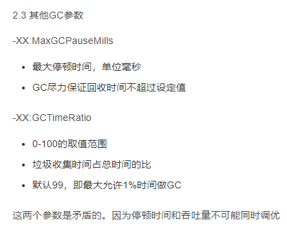

### 11.5.3.CMS收集器

- Concurrent Mark Sweep 并发标记清除（应用程序线程和GC线程交替执行）
- 使用标记-清除算法
- 并发阶段会降低吞吐量（停顿时间减少，吞吐量降低）
- 老年代收集器（新生代使用ParNew）
- -XX:+UseConcMarkSweepGC

```java
CMS运行过程比较复杂，着重实现了标记的过程，可分为

1. 初始标记（会产生全局停顿）
	根可以直接关联到的对象
	速度快
2. 并发标记（和用户线程一起） 
	主要标记过程，标记全部对象
3. 重新标记 （会产生全局停顿） 
	由于并发标记时，用户线程依然运行，因此在正式清理前，再做修正
4. 并发清除（和用户线程一起） 
	基于标记结果，直接清理对象
```


### 11.5.4.G1收集器

G1是目前技术发展的最前沿成果之一，HotSpot开发团队赋予它的使命是未来可以替换掉JDK1.5中发布的CMS收集器。


==**<u>*G1收集器的工作步骤：*</u>**==

(1)标记阶段，首先初始标记(Initial-Mark),这个阶段是停顿的(Stop the World Event)，并且会触发一次普通Mintor GC。对应GC log:GC pause (young) (inital-mark)

(2)Root Region Scanning，程序运行过程中会回收survivor区(存活到老年代)，这一过程必须在young GC之前完成。

(3)Concurrent Marking，在整个堆中进行并发标记(和应用程序并发执行)，此过程可能被young GC中断。在并发标记阶段，若发现区域对象中的所有对象都是垃圾，那个这个区域会被立即回收(图中打X)。同时，并发标记过程中，会计算每个区域的对象活性(区域中存活对象的比例)。
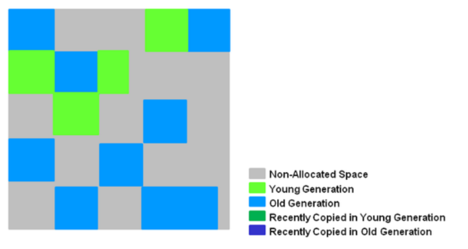

(4)Remark, 再标记，会有短暂停顿(STW)。再标记阶段是用来收集 并发标记阶段 产生新的垃圾(并发阶段和应用程序一同运行)；G1中采用了比CMS更快的初始快照算法:snapshot-at-the-beginning (SATB)。

(5)Copy/Clean up，多线程清除失活对象，会有STW。G1将回收区域的存活对象拷贝到新区域，清除Remember Sets，并发清空回收区域并把它返回到空闲区域链表中。

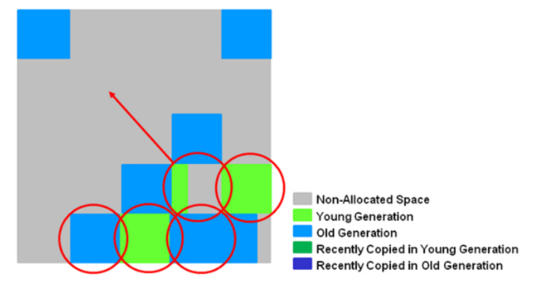

(6)复制/清除过程后。回收区域的活性对象已经被集中回收到深蓝色和深绿色区域。

## 11.6.finalize（）方法

finalize：完成

### 11.6.1.finalize（）方法的作用

(1)finalize()是Object的protected方法，**子类可以覆盖该方法以实现资源清理工作**，**GC在回收对象之前调用该方法**。

(2)finalize()与C++中的析构函数不是对应的。C++中的析构函数调用的时机是确定的（对象离开作用域或delete掉），**但Java中的finalize的调用具有不确定性*

(3)不建议用finalize方法完成“非内存资源”的清理工作，但建议用于：① 清理本地对象(通过JNI创建的对象)；② 作为确保某些非内存资源(如Socket、文件等)释放的一个补充：在finalize方法中显式调用其他资源释放方法。其原因可见下文[finalize的问题]

### 11.6.2.finalize（）方法的问题

(1)一些与finalize相关的方法，由于一些致命的缺陷，已经被废弃了，如System.runFinalizersOnExit()方法、Runtime.runFinalizersOnExit()方法

(2)System.gc()与System.runFinalization()方法增加了finalize方法执行的机会，但不可盲目依赖它们

(3)Java语言规范并不保证finalize方法会被及时地执行、而且根本不会保证它们会被执行

(4)finalize方法可能会带来性能问题。因为JVM通常在单独的低优先级线程中完成finalize的执行

(5)对象再生问题：finalize方法中，可将待回收对象赋值给GC Roots可达的对象引用，从而达到对象再生的目的

(6)finalize方法至多由GC执行一次(用户当然可以手动调用对象的finalize方法，但并不影响GC对finalize的行为)

### 11.6.3.finalize（）方法的执行过程（生命周期）

注：方法重写又称为方法覆盖。

通俗理解：当对象通过可达性分析法分析为不可达，垃圾回收器就判断这个对象是否重写了finalize()方法，若没有重写，直接回收，否则因为不在引用链上了，便垂死挣扎一下，放入一个低优先级的执行队列，用于执行该finalize()方法，算是一个对象的托底方法，执行完毕之后，若在引用链上，则对象复活，否则直接回收。

(1) `首先，大致描述一下finalize流程：当对象变成(GC Roots)不可达时，GC会判断该对象是否覆盖了finalize方法，若未覆盖，则直接将其回收。否则，若对象未执行过finalize方法，将其放入F-Queue队列，由一低优先级线程执行该队列中对象的finalize方法。执行finalize方法完毕后，GC会再次判断该对象是否可达，若不可达，则进行回收，否则，对象“复活”。`
(2) 具体的finalize流程：
对象可由两种状态，涉及到两类状态空间，一是终结状态空间 F = {unfinalized, finalizable, finalized}；二是可达状态空间 R = {reachable, finalizer-reachable, unreachable}。


**finalize方法的使用总结：**

- 经验：**避免使用finalize()**，操作不慎可能导致错误。
- 优先级低，何时被调用，不确定

何时发生GC不确定，自然也就不知道finalize方法什么时候执行

- 如果要使用finalize去释放资源，我们可以使用try-catch-finally来替代它

# 12.JMM：java内存模型

## 12.1.什么是JMM？

## 12.2.JMM的作用？


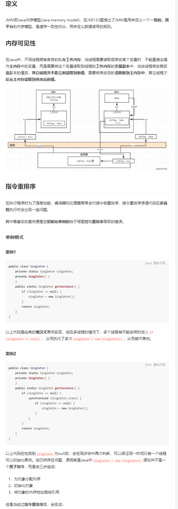


# ==13.JVM调优（重中之重）==

JVM调优调的是稳定性。稳定性是实现其他一切的基础。

## 13.1.调优辅助工具

MAT, Jprofiler

## 13.2.辅助工具的作用

●分析Dump内存文件,快速定位内存泄露;

●获得堆中的数据

●获得大的对象~

## 13.3.Jprofiler的使用

### 13.3.1.博客测试

1. 源码

```java
public static void main(String[] args) {
String s = "";
while (true) {
s += "11111111111111111111111111111111111111111111111111111";
}
}
```

2	设置项目VM的参数


==命令参数详解==
`// -Xms设置初始化内存分配大小/164
// -Xmx设置最大分配内存，默以1/4
// -XX: +PrintGCDetails // 打印GC垃圾回收信息
// -XX: +HeapDumpOnOutOfMemoryError //oom DUMP`

控制台输出：

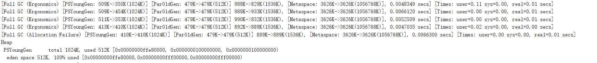

3. 寻错

在一个项目中，突然出现了OOM故障,那么该如何排除 研究为什么出错~

●能够看到代码第几行出错:内存快照分析工具，MAT, Jprofiler

●Dubug, 一行行分析代码

### 13.3.2.使用Jprofiler

版本：12.0.4

效果图：


1. 安装教程（结合IDEA）

   ```xml
   https://www.cnblogs.com/jpfss/p/11057440.html
   ```

2. 玄学使用（Crack）

3. 根据内存快照分析

   1. 制作内存快照
   2. 查看内存快照
   3. 思考：生产环境如何查看OOM？如何拿到内存快照？

## 13.4.虚拟机配置详解

### 13.4.1.虚拟机配置

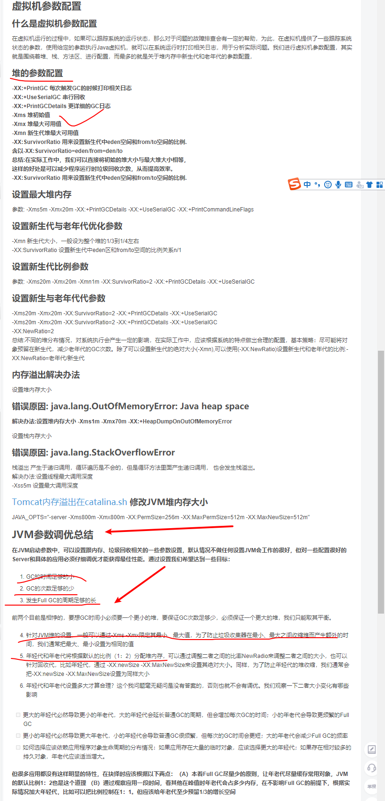

### 13.4.2.堆内存分配原则

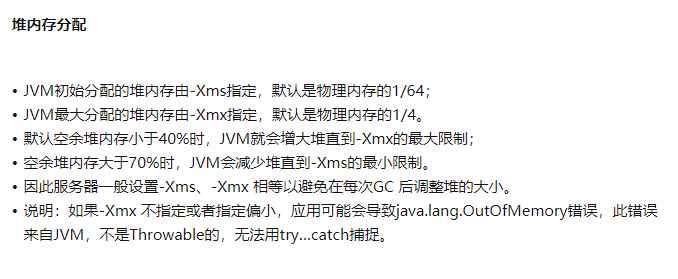