# java_基础篇

参考：

- 狂神说B站系统简介：https://space.bilibili.com/95256449/channel/detail?cid=146244
- 网络资料：https://www.sxt.cn/Java_jQuery_in_action/Introduction_of_programming_language.html
- 百度百科

# 一.计算机基础知识

### 1.Dos命令

1. 打开方式：使用win+R打开CMD（常用）

2. 常用的dos命令

   [【狂神说Java】Java零基础学习视频通俗易懂_哔哩哔哩_bilibili](https://www.bilibili.com/video/BV12J41137hu?p=11&spm_id_from=pageDriver)
   
   ```bash
   盘符切换： F：+回车
   查看当前目录下的所有文件  dir
   切换目录 cd /d：
   返回上一级 cd ..
   清理屏幕 cls 或者 clear
   退出终端 exit
   查看电脑IP ipconfig
   可以打开应用
   ping命令
   #文件操作
   	创建目录 md 目录名
   	删除目录 rd 目录名
   	创建文件 cd> 文件名
   	删除文件 del 文件名
   ```

### 2.计算机语言发展史

```xml
第一代语言：机器语言
第二代语言：汇编语言
第三带语言：高级语言：C、c++、java、C#、python等等
C：面向过程
C++、java：面向对象
```

### 3.摩尔定律

```xml
1、集成电路芯片上所集成的电路的数目，每隔18个月就翻一番；
2、微处理器的性能每隔18个月提高一倍，而价格下降一半；
3、用一美元所能买到的计算机性能，每隔18个月翻两番。
```

### 4.冯诺依曼体系结构


# 二.java是什么？

### 1.java的诞生

```xml
Java是一门面向对象编程语言，不仅吸收了C++语言的各种优点，还摒弃了C++里难以理解的多继承、指针等概念，因此Java语言具有功能强大和简单易用两个特征。Java语言作为静态面向对象编程语言的代表，极好地实现了面向对象理论，允许程序员以优雅的思维方式进行复杂的编程。
```

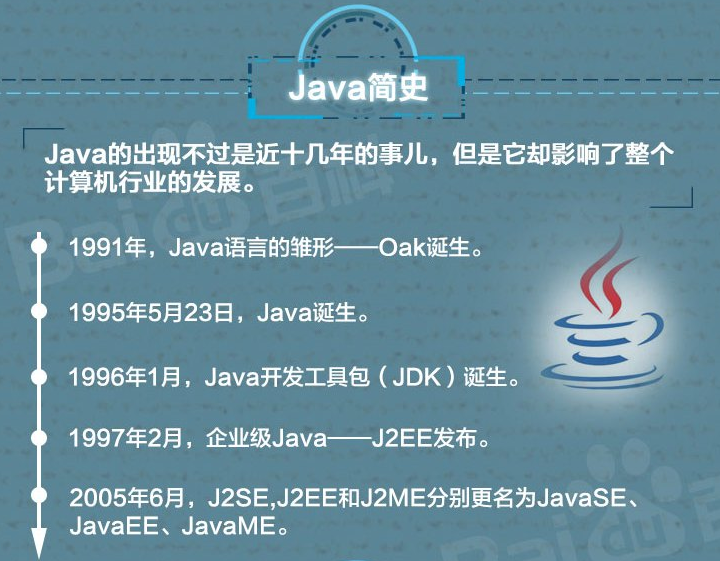

# 三.为什么要学习java？

## 1.java的优点：高可用、高性能、高并发

- 简单性
- 面向对象
- 可已执行
- 高性能
- 分布式：网络的分布式开发
- 动态性：反射机制
- 多线程
- 安全性
- 健壮性

## 2.编程语言排行：java占据第二位_2020.12

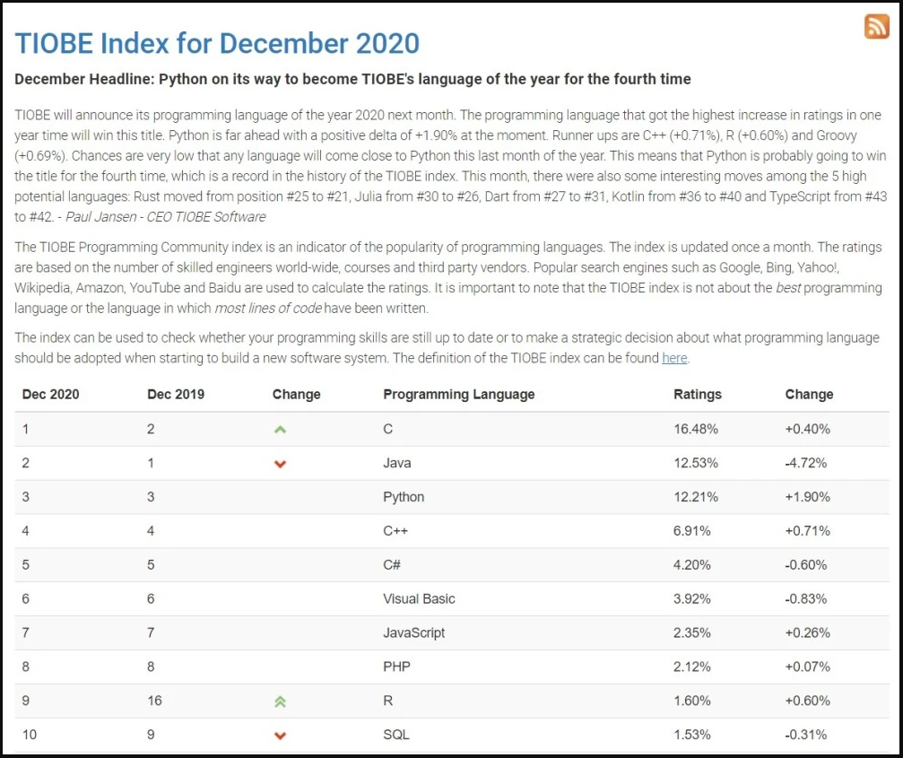

# 四.大后端学习进阶路程：任重道远

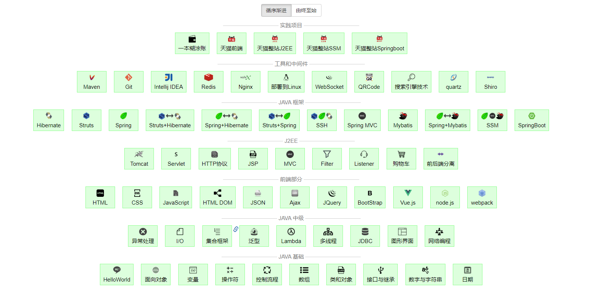

2022年1月10日15:30:52~即将过年~

再次看了一眼上面的学习进阶的图，果然就是一本糊涂账

这段时间，少说一个多月吧，自己悟道了很多算是，说好听点，可以说算是精进了下自己的思想，无论是生活工作还是持续学习这条路子。

芜湖啊~

持续学习这仅仅只是一个开始~

从知识到实践再到理论，最后进阶~这条路不好走啊~

不过，始终保持一颗谦卑的心，增加自己自信的资本，始终知道自己究竟想要什么？

那问题来了。

自己想要什么呢？？？

···

# 五.java基础知识

### 5.1java Basic

#### 1.java的三大版本

- **JavaSE：标准版**
- JavaME：嵌入式开发-->Android
- **JavaEE：企业级开发：web、服务器端开发**

#### 2.JDK、JRE、JVM

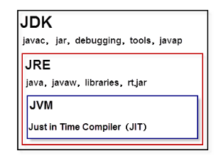

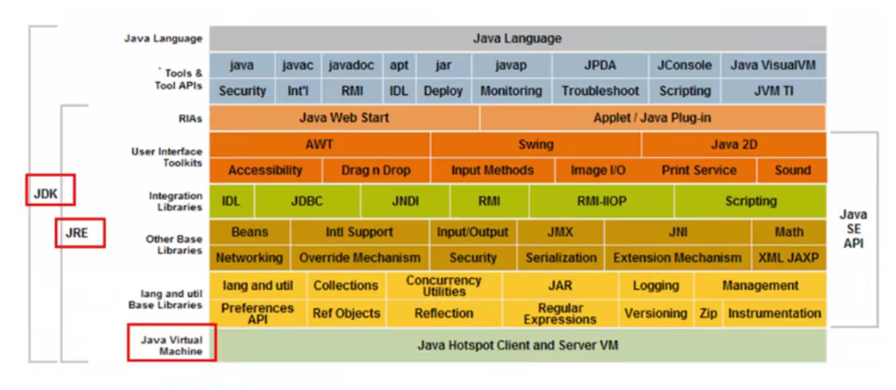

- JDK：java开发者工具--包含jre+jvm

- JRE：java运行时环境

- JVM：java虚拟机：Write Once，Run Anywhere

  ```xml
  什么是虚拟机？
  		虚拟机是一种抽象化的计算机，通过在实际的计算机上仿真模拟各种计算机功能来实现的。Java虚拟机有自己完善的硬体架构，如处理器、堆栈、寄存器等，还具有相应的指令系统。Java虚拟机屏蔽了与具体操作系统平台相关的信息，使得Java程序只需生成在Java虚拟机上运行的目标代码（字节码），就可以在多种平台上不加修改地运行。
  ```

#### 3.JDK安装及卸载

##### 1.安装JDK

```xml
安装及环境变量配置:
https://blog.csdn.net/kangmiao89757/article/details/9993887?ops_request_misc=%25257B%252522request%25255Fid%252522%25253A%252522160851668416780277053420%252522%25252C%252522scm%252522%25253A%25252220140713.130102334..%252522%25257D&request_id=160851668416780277053420&biz_id=0&utm_medium=distribute.pc_search_result.none-task-blog-2~all~sobaiduend~default-1-9993887.nonecase&utm_term=java%E5%AE%89%E8%A3%85%E5%8F%8A%E9%85%8D%E7%BD%AE%E6%95%99%E7%A8%8B
```

- java官网下载：https://www.java.com/zh-CN/download/

  注：版本为java-8u271，目前企业较多使用java1.8；

  截止2020.01.09，oracle javaSE已经更新到java 15；

  截止2021.05.24，oracle javaSE已经更新到java 16。

- java安装时需要dos命令验证java安装成功、环境变量配置成功

  ```xml
  java -version:验证java安装是否成功及环境变量配置、查看本机java环境版本
  ```

  注：学习工作仅安装java jdk是远远不够的，查看“开发新机器配置.md”进一步拓展，类如IDEA的插件安装等未涉及到，仅讨论到java、tomcat、maven、数据库及Jetbrains工具安装，其他开发所用的工具暂未涉及，以待更新。
  
  2021年11月10日22:07:32更新：IDEA的各类插件基本更新且安装，各种新奇有趣高效的插件有助于更快地编程。

##### 2.卸载JDK

1. 删除java的安装目录
2. 删除java_home/path
3. java -version查看是否卸载成功

#### 4.第一个java程序:HelloWorld

```java
public class hello{
  public static void helloWorld(Strings[] args){
    system.out.println("hello,world");
  }
}
```

- 不依靠IDEA等编码工具手写hello.java

1. 选择一个文件夹新建hello.java文件
2. 使用notepad++（一款十分好用的文本编辑器，选择语言环境即可高亮关键字）打开
3. 编辑，如下图


4. 使用cmd编译hello.java到hello.class

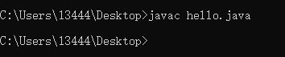

5. 同级目录下出现hello.class文件

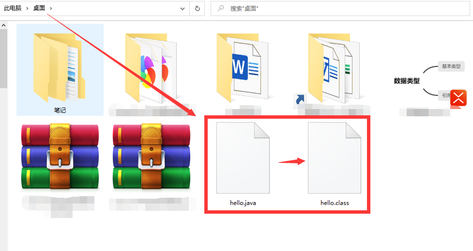

6. cmd命令：java hello 回车

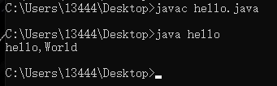

7. 恭喜入门，任重道远

#### 5.“hello，world”可能出现的问题

1. 本机java环境配置
2. 类名称和java文件名称不对应
3. 方法单词大小写问题
4. 符号采用了中文符号

#### 6.java程序运行机制

1. 编译型/解释型：计算机高级语言的类型主要有编译型和解释型两种，而Java 语言是两种类型的结合。

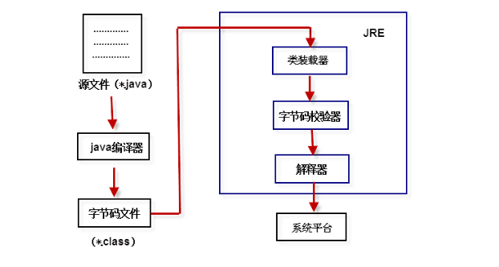

==编译型语言：==C,C++

==解释型语言：==python，h5，JavaScript，Shell，Ruby等

#### 7.注释

**java的注释有三种**：单行注释，多行注释，文档注释

- IDEA中注释快捷键：ctrl+/

1. 单行注释：//
2. 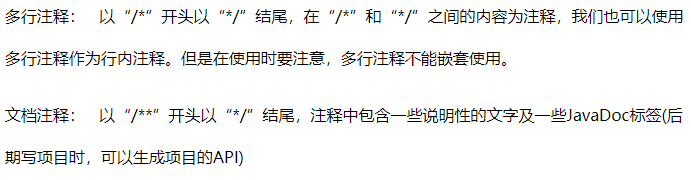

#### 8.标识符

##### 1).关键字

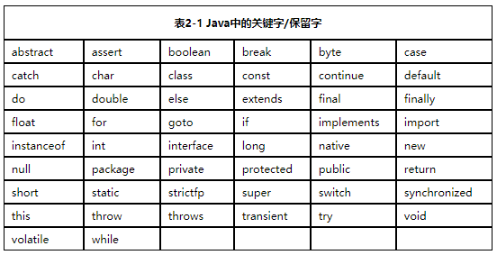

##### 2).标识符的规则

1. 标识符必须以字母、下划线_、美元符号$开头 _
2. 首字母之后字母、下划线“_”、美元符“$”和数字的任意组合
3. Java 标识符大小写敏感，且长度无限制
4. 标识符不可以是Java的关键字

##### 3).标识符的使用规范

1. 表示类名的标识符：每个首字母大写
2. 表示方法和变量的标识符遵守驼峰原则：第一个单词小写，第二个单词开始首字母大写

#### 9.数据类型（包含面试题）

- java是一种强类型语言，变量只用定义后才能使用
- java的数据类型分为两周：基本数据类型，引用数据类型

1. 基本类型：数字（整数，小数）和字符
2. 引用类型：类，接口，数组


- 其中整形常量有不同的进制形式：二进制，八进制，十进制，十六进制，且进制内可以相互转换。

- java数据类型占据内存最多的是？Long

  #### 进制之间的相互转换：

  逢8进1，逢16进1。

    - 其他进制和二进制相互转换：

      其他进制-->二进制：2取余法

      二进制-->其他进制：按权展开

    - 8进制，10进制，16进制相互转换

      间接法：通过二进制作为中间点进行相互转换

      直接法：按权展开

  #### 代表各种进制的英文字母：
  
    1. 二进制是Binary，简写为B
    2. 八进制是Octal，简写为O
    3. 十进制为Decimal，简写为D
    4. 十六进制为Hexadecimal，简写为H

  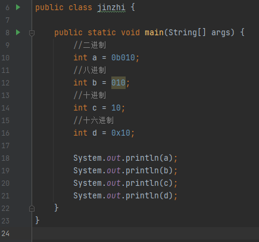

  控制台输出：

  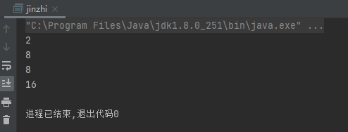

  #### 浮点类型与银行业务：最好完全避免使用浮点数进行比较

  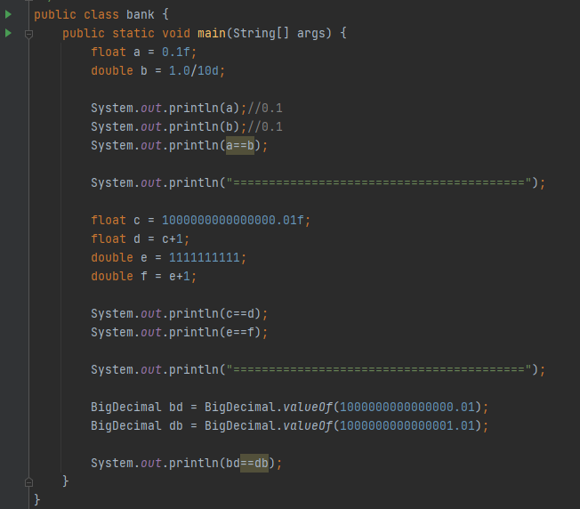

  控制台输出：

  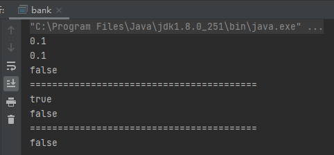

  #### char和String的区别
  
  ```xml
  1.char是表示的是字符，定义的时候用单引号，只能存储一个字符。例如; char='d',
    String表示的是字符串，定义的时候用双引号，可以存储一个或者多个字符。例如：String=“we  are neuer”。
  2.char是基本数据类型，而String是个类，属于引用数据类型。String类可以调用方法，具有面向对象的特征。
  ```

#### 10.变量/常量

1. 变量：从整理上可将变量分为局部变量，成员变量和静态变量：每个类型变量有这自己不同的生命周期。

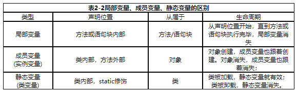

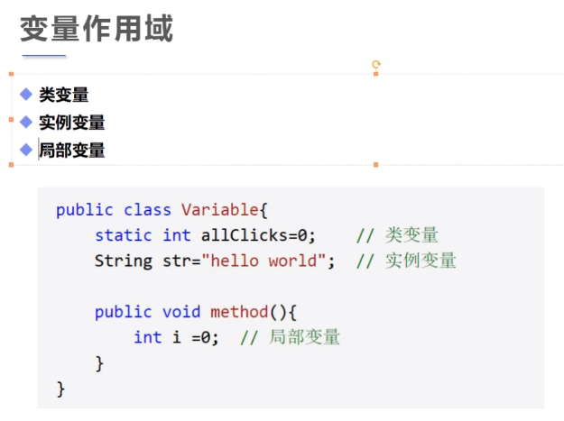

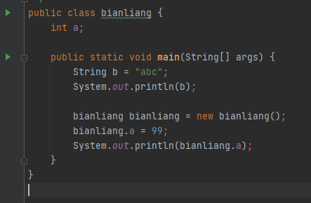

控制台输出：

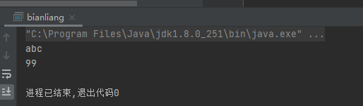

2. 常量：常量通常指确定的值：在Java语言中，主要是利用关键字final来定义一个常量。 常量一旦被初始化后不能再更改其值。

#### 11.数据转换

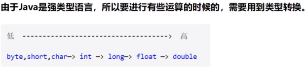

1. 强制类型转换：高-->低
2. 自动类型转换：低-->高

注：转换时存在的问题

- 精度问题：浮点型转成其他的整数类型的时候，例如int，会丢小数点后的精度。
- 不能对布尔值进行转换
- 大容量的数转换到小容量的数据类型容易溢出


注：黑色的实线表示无数据丢失的自动类型转换，而虚线表示在转换时可能会有精度的损失。

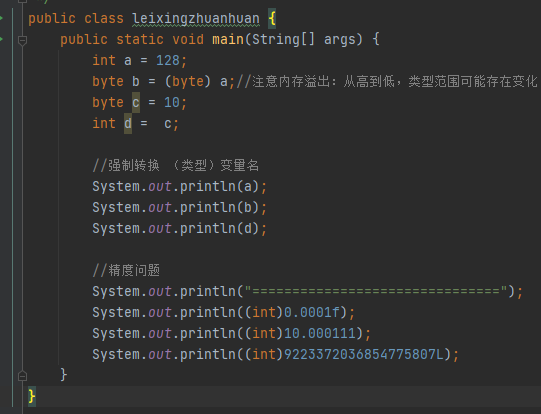

控制台输出：

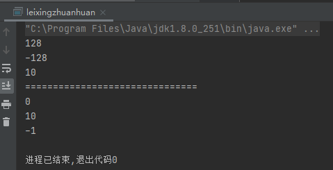

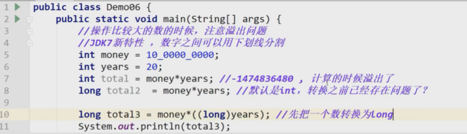

#### 12.转义字符

```xml
1.八进制转义序列：\ + 1到3位5数字；范围'\000'~'\377'      \0：空字符
2.Unicode转义字符：\u + 四个十六进制数字；0~65535       \u0000：空字符
3.特殊字符：就3个
      \"：双引号
     \'：单引号
     \\：反斜线
4.控制字符：5个
\' 单引号字符
\\ 反斜杠字符
\r 回车
\n 换行
\f 走纸换页
\t 横向跳格
\b 退格
点的转义：. ==> u002E
美元符号的转义：$ ==> u0024
乘方符号的转义：^ ==> u005E
左大括号的转义：{ ==> u007B
左方括号的转义：[ ==> u005B
左圆括号的转义：( ==> u0028
竖线的转义：| ==> u007C
右圆括号的转义：) ==> u0029
星号的转义：* ==> u002A
加号的转义：+ ==> u002B
问号的转义：? ==> u003F
反斜杠的转义： ==> u005C
```

部分转义字符：

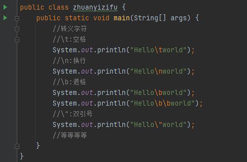

控制台输出：

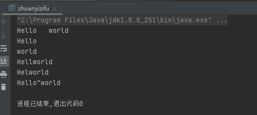

#### 13.运算符

```xml
算术运算符：一元运算符，二元运算符，三元运算符：+，-，*，/，%，++，--
赋值运算符：=
关系运算符：<，>,<=,>=,!=,instanceof，==
逻辑运算符:与或非：&&，||，！
位运算符：&，|，~，^，<<,>>，>>>
条件运算符：？：
扩展赋值运算符：+=，-=，*=，/=
字符串连接符:+
```

注：==计算过程中如果有long，结果为long，如果没有long，结果类型则为int，如果有double，结果类型则为double==

- 一元运算符++/--

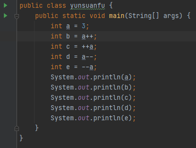

控制台输出：

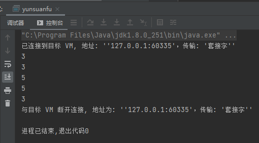

- 细节1~

```java
@Test
    public void testOnly(){
        int a = 10;
        int b = 10;
        System.out.println(""+a+b);
        System.out.println(a+b+"");
    }
```

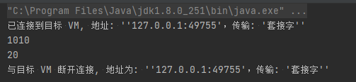

- 细节2~

```java
x++：先自加后使用
++x：先使用再自加
x--：先自减后使用
--x：先使用再自减
x+=1：x=x+1
x-=1：x=x-1
```

```java
@Test
    public void testInfo(){
        int a = 0;
        System.out.println(a++);
        System.out.println(a);
    }
```

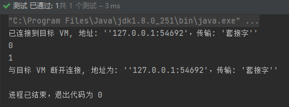

- 位运算符

```java

```

#### 14.java包机制

==包的本质就是文件夹==

==**一般利用公司域名倒置作为包名**==

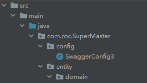

导入包：import

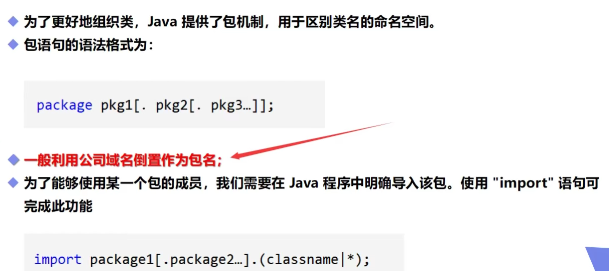

#### 15.javaDoc

javaDoc命令生成自己的API文档

##### 1.使用java命令生产API文档

```bash
javadoc -encoding UTF-8 -charset UTF-8 java文件名字
```

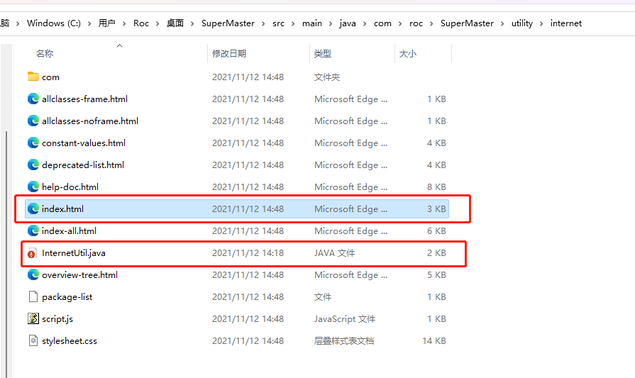

Internet.java为目标类，index.html为文档进入入口。

文档如下图：

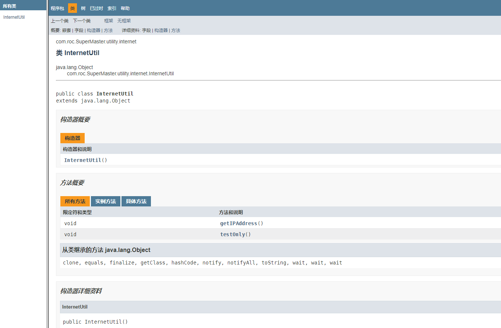

##### 2.使用IDEA生成java文档

可以选择是IDEA自动生成javaDoc文档

#### 16.if选择结构

if：如果怎么样，然后怎么样。基本上是最常用的判断语句

在实际工作中用的几乎是最多的，其次需要注意的一点就是，空值的判断。

最后强调的一点：程序就是处理数据，存储数据，不要害怕使用if，一些公众号上会写通篇全是if什么可读性啊，代码结构混乱啊，最后不混乱的还是需要使用if，代码混不混乱取决于写代码的人。

##### 1.if单选择结构

```java
if(布尔表达式){
    //如果布尔表达式为true将执行的语句
}
```

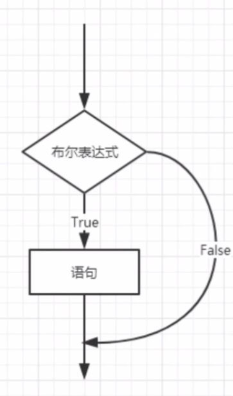

##### 2.if双选择结构

```java
if(布尔表达式){
    //如果布尔表达式为true将执行的语句
}else{
    //如果布尔表达式为false将执行的语句
}
```

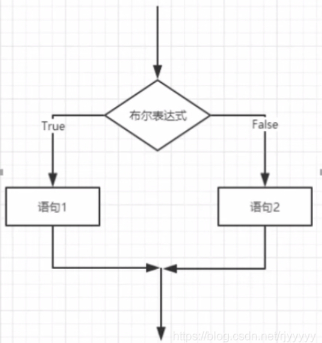

##### 3.if多选择结构

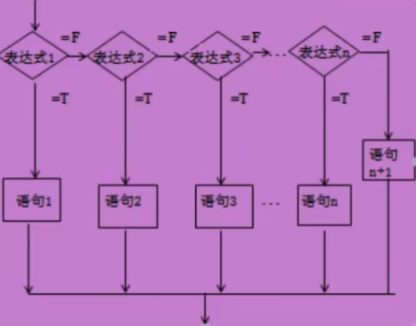

##### 4.if的嵌套查询

```java
if(布尔表达式1){
    //如果布尔表达式1为true将执行的语句
	if(布尔表达式2){
    //如果布尔表达式2为true将执行的语句
    }
}
```

#### 17.Switch选择结构

- 判断一个变量与一系列值中的某个值是否相等，每个值称为一个分支

```java
switch(expression){
    case value1:
        //语句1
        break;//可选
    case value2:
        //语句2
        break;//可选
    case valuen:
        //语句n
        break;//可选
    default://可选
        //语句n+1
}
```

- switch语句中的变量类型可以是：byte、short、int、char

  从 Java SE 7 开始，switch支持字符串String类型。

  case标签必须为字符串常量或字面量。

- ==case穿透==：每写一个case务必跟上一个break，否则出现case穿透现象；

#### 18.While循环

##### 1.while循环

```java
while(布尔表达式){
    //循环内容
}
```

- 只要布尔表达式为true，循环就会一直执行下去。
- 大多数情况会让循环停止下来，需要一个让表达式失效的方式来结束循环。
- 少部分情况下需要循环一直执行，比如服务器的请求响应监听等。
- 循环条件一直为true就会造成==无限循环(死循环)==，会影响程序性能或造成程序卡死崩溃，正常的业务编程中应该尽量避免死循环。

##### 2.do···while循环

- 对于while语句而言，如果不满足条件，则不能进入循环。但有时候需要即使不满足条件，也至少执行一次。

- while 和 do…while 的区别
  - while 先判断后执行；do…while 先执行后判断。
  - ==do…while总是保证循环体会被至少执行一次。==

```java
do{
    //代码语句
}while(布尔表达式);
```

```java
public void static main(String[] args){
  int i = 0;
  int sum = 0;
  while(i<=100){
    sum = sum + i;
    i++;
  }
  System.out.println(sum);
}
```

#### 19.For循环家族

##### 19.1普通For循环

```java
for(初始化; 布尔表达式; 更新){
    //代码语句 
}
```

**==普通for循环的执行方式==**

```java
for(sta1;sta2;sta3){
    sta4
}

以上各部分的执行顺序
1.开始循环后执行sta1
    2.执行sta2//条件为真执行sta4，不然直接跳出循环
    3.执行sta4
    4.执行sta3
    5.再回到第二部开始执行
```

==for的死循环==

```java
for(;;){
    
}
```

for循环的例题：

1. 计算0-100之间的奇数和偶数的和：取模运算

```java

```

2. 用while或者for循环输出1-1000之间能被5整除的数，并且每行输出3个

```java

```

3. 打印九九乘法表

```java

```

##### 19.2增强For循环

- 用于数组或集合的遍历

```java
for（声明语句 ： 表达式）{
    //代码
}
```

##### 19.3 break，continue

###### 19.3.1break

在任何循环语句的主体部分，均可用break控制循环的过程。

break用于**强行退出循环**，不执行循环中剩余的语句。

break语句也在switch语句中使用。

###### 19.3.2continue

continue语句用在循环语句体中，用于**终止某次循环过程**。

即跳过循环体中尚未执行的语句，接着进行是否执行循环的判定。

#### 20.java的方法

##### 20.1什么是方法？

- Java方法是语句的集合，它们在一起执行一个功能。
  - 方法是解决一类问题的步骤的有序组合
  - 方法包含于类或对象中
  - 方法在程序中被创建，在其他地方被引用(调用)
- java方法设计的原则
  - 方法的本意是语句块
  - 保持方法的原子性
- java方法的命名规则：首字母小写+驼峰

##### 20.2方法的定义

```java
修饰符 返回值类型 方法名 (参数类型 参数名){ //形式参数
    ...
    方法体
    ...
    return 返回值;
}
```

1. 修饰符：可选。告诉编译器如何调用该方法，定义了该方法的访问类型。

2. 返回值类型：方法可能会返回值。returnValueType是方法返回值的数据类型。有些方法执行所需的操作，但没有返回值。在这种情况下，returnValueType是关键字void。
3. 方法名：方法的实际名称。方法名和参数表共同构成方法签名。
4. 参数类型：参数像是一个占位符。当方法被调用时，传递值给参数。这个值被称为实参或变量。参数列表是指方法的参数类型、顺序和参数的个数。参数是可选的，方法可以不包含任何参数。
   - 形式参数：在方法被调用时用于接收外界输入的数据。
   - 实参：调用方法时实际传给方法的数据
   - 方法体：包含具体的语句，定义该方法的功能。

##### 20.3方法的调用

- 调用方法：对象名.方法名(实参列表)
- Java支持两种调用方法的方式，根据方法是否返回值来选择：
  - 当方法返回一个值的时候，方法调用通常被当做一个值
  - 如果方法返回值是void，方法的调用一定是一个语句。

##### 20.4命令行传参

##### 20.5可变参数

- JDK 1.5开始，Java支持传递同类型的可变参数给一个方法。(个数不限)
- 在方法声明中，在指定参数类型后加一个省略号(…)。
- 一个方法中只能指定一个可变参数，它必须是方法的最后一个参数。任何普通的参数必须在它之前声明。

```java
public void test(int...i){
    System.out.println(i[0]);
    System.out.println(i[1]);
    System.out.println(i[2);
}
```

示例：

```java
package com.kuang.method;

public class Demo04 {
    public static void main(String[] args) {
        Demo04 demo04 = new Demo04();
        demo04.test(1,2,3,4,5);

    }

    public void test (int... i){
        System.out.println((i[0]));
        System.out.println((i[1]));
        System.out.println((i[2]));
        System.out.println((i[3]));
        System.out.println((i[4]));
    }

    /*
    public void method(){}
    public void method(int i){}
    public void method(int i, int j){}
    public void method(int i, double j){}
     */

}
```

#### 21.java数组

##### 21.1数组概述

==搭配**Java 集合和数组**品尝最可==

- 数组是**相同类型数据**的有序集合。
- 数组描述的是相同类型的若干个数据，按照一定的**先后次序排列**组合而成。
- 其中，每一个数据称作一个**数组元素**，每个数组元素可以通过一个**下标**(从0开始)来访问。

##### 21.2数组的声明与创建

###### 21.2.1数组的声明

```java
dataType[] arrayRefVar;//首选方法

dataType arrayRefVar[];//效果相同，但不是首选
```

原因：第二种方法是方便C/C++程序员的使用，延用了C/C++的使用习惯

- Java语言使用new操作符来创建数组，语法如下：

```java
dataType[] arrayRefVar = new dataType[arraySize];
```

- 数组的元素是通过索引访问的，数组索引从0开始。
- 获取数组的长度

```java
arrays.length();
```

- 数组声明创建之后即使不存放具体实际的值，数组的元素也会存在默认值，例如int为元素的数组，默认值为0，String为元素的数组。默认值则为null；

###### 21.2.2java数组的内存分析

1. ==java的内存分析==

   1. 堆
      - 存放new的对象和数组
      - 可以被所有的线程共享
   2. 栈
      - 存放基本的变量类型
      - 引用对象的变量
   3. 方法区
      - 可以被所有的线程共享
      - 包含了所有的class和static变量

   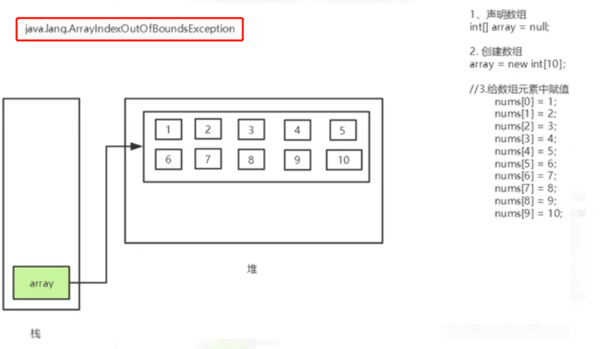

2. 三种初始化
   1. 静态初始化
   
      ```java
      int[] a = {1,2,3};
      Man[] mans = {new Man(1,1),new Man(2,2)};
      ```
   
   2. 动态初始化
   
      ```java
      int[] a = new int[2];
      a[0] = 1;
      a[1] = 2;
      ```
   
   3. 数组的静默初始化
   
      数组是引用类型，它的元素相当于类的实例变量，因此数组一经分配空间，其中的每个元素也被按照实例变量同样的方式被隐式初始化。(int: 0; String: null)

##### 21.3数组的使用

###### 21.3.1遍历数组

1. 普通For循环
2. 增强For循环
3. 数组作为方法传入或返回值

###### 21.3.2数组与集合

21.3.3使用数组可能出现的问题：数组边界及数组下标越界异常

- 下边的合法区间：[0，length-1]，如果越界就会报错
- ArrayIndexOutOfBoundsException：数组下标越界异常

##### 21.4多维数组

==多维数组的创建使用参考 java数组与集合和SuperMaster项目最佳，此处不做过多阐述==

###### 21.4.1二维数组

二维数组：数组的数组，其中每一个元素都是一个数组

- 声明及创建：

  ```java
  int a[][] = new int[2][5];
  ```

###### 21.4.2三维数组

##### 21.5Arrays类

**Arrays类的常用方法**

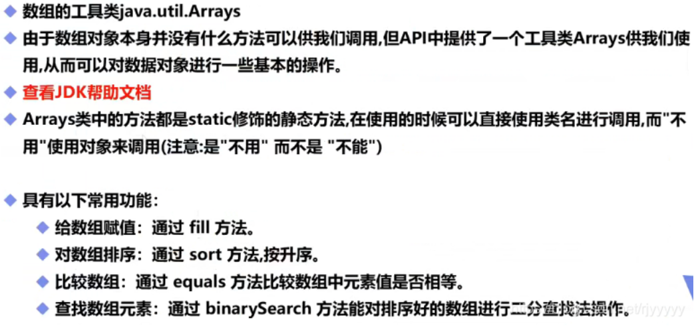

##### 21.6稀疏数组（重点）

2021年11月16日11:05:36：==[(35条消息) Java实现稀疏数组_baolingye的博客-CSDN博客_java稀疏数组](https://blog.csdn.net/baolingye/article/details/99943083?ops_request_misc=%7B%22request%5Fid%22%3A%22163703189416780357225649%22%2C%22scm%22%3A%2220140713.130102334..%22%7D&request_id=163703189416780357225649&biz_id=0&utm_medium=distribute.pc_search_result.none-task-blog-2~all~sobaiduend~default-1-99943083.pc_search_mgc_flag&utm_term=java稀疏数组&spm=1018.2226.3001.4187)==

1. 什么是稀疏数组？

   当一个数组中大部分的元素为0，或者为同一值的数组时，可以使用稀疏数组来保存该数组。

2. 稀疏数组的处理方式

   - 记录数组一共有几行几列，有多少不同值。

   - 把具有不同值的元素和行列及值，记录在一个小规模的数组中，从缩小程序的规模

   如下图：左侧为原始数组，右侧为稀疏数组。

   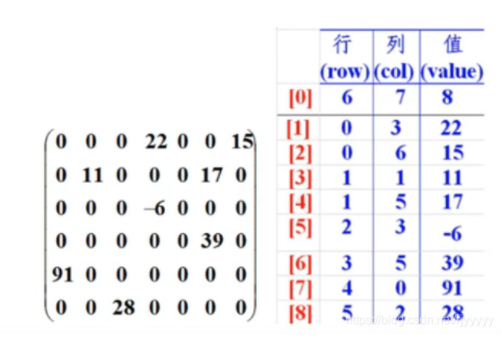

   3. 原始数组和稀疏数组的相互转换

      1. 输入原始数组，输出稀疏数组

         ```java
         public static int[][] sparseArraysConvert(int[][] ints) {
         
                 /*
                 目标：寻求适合全部合适的二维数组转换为稀疏数组的方法
                 */
         
                 //稀疏数组的构成
                 //其实稀疏数组仅记录大部分元素为0，或者为同一数值的情况，例如棋盘游戏，一旦出现大规模的不同的，转换稀疏数组甚至还不如之前的存储方式
                 //可以理解为时间战胜了空间
                 //第一行：记录一共有多少行和多少列，记录有多少不同的值
                 //剩下的记录值的位置
         
                 //值的个数
                 int numCount = 0;
         
                 if (ints.length != 0){
                     //寻找值的个数
                     for (int i = 0; i < ints.length; i++) {
                         for (int j = 0; j < ints[i].length; j++) {
                             if (ints[i][j] != 0) {
                                 numCount++;
                             }
                         }
                     }
         
                     //用于接收数据的稀疏数组
                     int[][] sparse = new int[numCount+1][3];
                     //给与稀疏数组赋值：优先存储目标二维数组的基础信息：几行几列，几个特殊值
                     sparse[0][0] = ints.length;
                     sparse[0][1] = ints[0].length;
                     sparse[0][2] = numCount;
         
                     //开始赋值
                     int count = 0;
                     for (int i = 0; i < ints.length; i++) {
                         for (int j = 0; j < ints[i].length; j++) {
                             if (ints[i][j] != 0) {
                                 count++;
                                 sparse[count][0] = i;
                                 sparse[count][1] = j;
                                 sparse[count][2] = ints[i][j];
                             }
                         }
                     }
                     return sparse;
                 }else {
                     System.out.println("~~~~~~~~~目标数组不规范~~~~~~~~~");
                     return null;
                 }
             }
         ```

      2. 输入稀疏数组，输出原始数组

         ```java
         public static int[][] twoArraysConvert(int[][] ints){
                 int row = ints[0][0];
                 int col = ints[0][1];
                 int[][] target = new int[row][col];
         
                 int rowNum = 0;
                 int colNum = 0;
         
                 for (int i = 1; i < ints.length; i++) {
                     rowNum =ints[i][0] ;
                     colNum = ints[i][1] ;
                     target[rowNum][colNum] = ints[i][2];
                 }
                 return target;
             }
         ```

#### 22.java的排序算法

##### 22.1冒泡排序

#### 23.递归

##### 23.1什么是递归

```java
递归就是：自己调用自己
```

##### 23.2递归结构

1. 递归头：什么时候不调用自身方法。如果没有头，将陷入死循环。
2. 递归体：什么时候需要调用自身方法。

##### 23.3递归例子

```java
@Test
public void testInfo(){
    System.out.println(f(10));
}
public static long f(long i){
    if (i==1){
        return 1;
    }else {
        return i*f(i-1);
    }
}
```

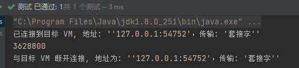

### 5.2java OOP

#### 1.什么是面向对象

##### 1.1面向过程和面向对象 

1. 面向过程

   - 步骤清晰简单，第一步做什么，第二步做什么…
   - 面向过程适合处理一些较为简单的问题

2. 面向对象

   - 物以类聚，分类的思维方式。

     首先思考解决问题需要哪些分类，然后对这些分类进行单独思考，最后对某个分类下的细节进行面向过程的思索。

   - 面向对象适合处理复杂的问题，适合处理需要多人协作的问题。

##### 1.2什么是面向对象？

1. 面向对象的本质：==以类的方式组织代码，以对象的形式组织数据==
2. 三大特性：封装  继承  多态
3. 认识角度与代码运行角度
   1. 从认识角度来看：先有的对象，然后有的类。对象是具体的实例，类是抽象的，是对对象的抽象。
   2. 从代码运行的角度：先有的类后有的对象。类是对象的模板。

#### 2.构造器

##### 2.1什么是构造器？

1. 和类名相同
2. 没有返回值

本质是一个特殊的方法。

##### 2.2构造器的作用

1. new本质是在调用构造器
2. 初始化对象的值

##### 2.3构造器的注意点

1. 定义有参构造后若仍想使用无参构造，需显示定义一个无参构造（重载的使用）。
2. IDEA创建构造器的快捷方式：alt+insert

#### 3.创建对象的内存分析

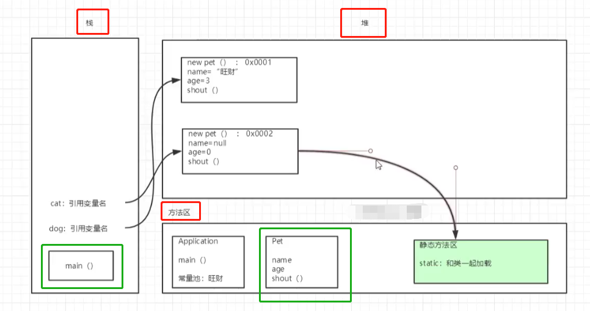

#### 4.类和对象

##### 4.1类

1. 类是一个模板，由具体的实例抽象而来。

2. 一个类中仅包含属性（字段）和方法。

3. 类的组成

   1. 成员变量
   2. 方法
   3. 构造器
   4. 代码块（静态代码块，非静态代码块）
   5. 内部类

4. 类的分类

   1. 外部类
   2. 内部类
      1. 静态内部类
      2. 局部内部类
      3. 匿名内部类

5. 类的成员的执行顺序

   这里需要带上子类对父类的继承来讲。

   1. 父类的静态成员变量，静态代码块（属于同级，执行顺序从上往下）
   2. 子类的静态成员变量，静态代码块（）
   3. 父类的非静态代码块，非静态成员变量
   4. 父类的构造方法
   5. 子类的非静态代码块，非静态成员变量
   6. 子类的构造方法

##### 4.2对象成员变量

1. 对象是一个具体的实例。
2. 对象的创建和使用
   1. 必须使用new关键字创建对象，实则去调用的构造器方法

#### 5.封装继承多态

##### 5.1封装

###### 5.1.1为什么要封装？

程序设计考究：高内聚，低耦合

1. 高内聚：类内部的数据操作细节由自己完成，不允许外部进行干涉。
2. 低耦合：仅暴露少量的方法给外部使用。

###### 5.1.2封装（数据的隐藏）

1. 封装的含义：属性私有，get/set
2. 封装的意义：
   1. 提高程序的安全性，保护数据
   2. 隐藏代码的实现细节
   3. 统一接口
   4. 提高系统的可维护性

##### 5.2继承

###### 5.2.1本质

继承的本质是对某一批类的抽象，从而实现对现实世界更好的建模。

###### 5.2.2细节

1. extends的意思是扩展。子类是对父类的拓展。
2. java中只有单继承，没有多继承。
3. 继承是类和类之间的一种关系。除此之外，类和类之间的关系还有依赖，组合，聚合等
4. 继承关系的两个类，一个为子类（派生类），一个是父类（基类），子类继承父类，使用关键字extends来表示。
5. 子类和父类之间，从意义上来讲应该具有“is a”的关系。

##### 5.3多态

- ==编译时多态与运行时多态==：[(36条消息) JAVA 多态（运行时多态和编译时多态）及其内存图解_doncoder的博客-CSDN博客_java编译时多态和运行时多态](https://blog.csdn.net/doncoder/article/details/83243906)

###### 5.3.1什么是多态？

- 同一方法可以根据发送对象的不同而采用多种不同的行为方式。（注：多态是方法的多态，类的属性是没有多态的。）

###### 5.3.2多态存在的条件

- 有继承关系 ( 否则–>类型转换异常ClassCastException )
- 子类**重写**父类方法 ( static/final/private 方法不能重写 )
- 父类引用指向子类的对象 ( Person s2 = new Student(); )

#### 6.重写重载Overload -- Override

##### 6.1重载

- 重载就是在一个类中，有相同的名称，但形参不同的方法。

###### 6.1.1规则

- 方法名称必须相同
- 参数列表必须不同(个数不同、或类型不同、或参数排列顺序不同等)
- 方法的返回类型可以相同也可以不同
- 仅仅返回类型不同不足以称为方法的重载

##### 6.2重写

###### 6.2.1重写的前提

1. 有继承关系
2. 子类重写父类的方法

###### 6.2.2重写的要求

1. 方法名必须相同
2. 参数列表必须相同
3. 修饰符：范围可以扩大但不能缩小：public>protected>default>private
4. 抛出的异常：范围可以被缩小但是不能扩大
5. 方法体不同

###### 6.2.3为什么要重写？

​		父类的功能，子类不一定需要，或者不一定满足。

#### 7.Super

- super() 调用父类的构造方法，必须在构造方法的第一行。
- super() 只能出现在子类的方法或构造方法中。
- super 和 this 不能同时调用构造方法。

==Super VS this==

- 代表的对象不同：
  - this：本身调用者这个对象
  - super：代表父类对象的应用
- 前提
  - this：没有继承也可以使用
  - super：只能在继承条件下使用
- 构造方法
  - this()：本类的构造
  - super()：父类的构造

#### 8.接口的定义和实现

##### 8.1接口是什么？

- 接口是规范，定义了一组规则

- 接口的本质是契约，制定以后要遵守

- 面向对象的精髓是对对象的抽象，最能体现这一点的就是接口

##### 8.2接口的作用

1. 约束
2. 项目前期搭建项目主体，定义接口，便于让不同的人实现
3. 接口的方法都是public abstract
4. 接口的常量都是public static final
5. 接口不能实例化，接口中没有构造方法
6. implements可以实现多个接口（个人不建议，有点混乱，当然也可以）
7. 必须重写接口中的方法
8. 利用接口实现伪多继承

#### 9.java内部类

##### 9.1内部类

内部类就是在一个类中再定义一个类。

##### 9.2分类

1. 成员内部类
2. 静态内部类
3. 局部内部类
4. 匿名内部类（骚操作较为常见吧：实现接口的方法）

```java
package com.oop.demo13;

public class Outer {
    private int id = 10;
    public void out(){
        System.out.println("外部类方法");
    }

    //public static class Inner { 静态内部类，不能调用id
    public class Inner { //成员内部类

        public void in(){
            System.out.println("内部类方法");
        }
        //获得外部类的私有属性
        public void gerID(){
            System.out.println(id);
        }
    }

    public void methed(){
        class Inner1{  //局部内部类
            public void in(){

            }
        }
    }
}
//一个Java类中可以有多个class类，但是只有有一个public class
class A{

}
```

#### 10.抽象类

- ==不能new一个抽象类==，只能靠子类去实现它：约束！
- 抽象类中可以写普通方法，抽象方法必须写在抽象类中。
- 抽象的抽象：约束
- ==抽象类存在构造器==
- 意义：提高开发效率

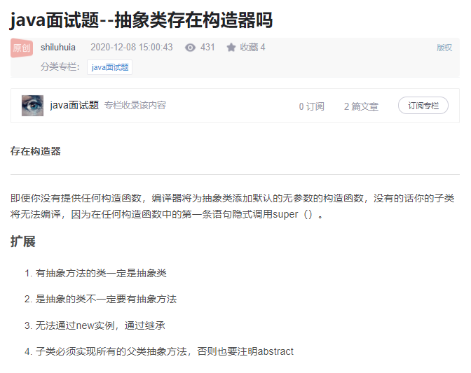

#### 11.instanceof和类型转换

##### 11.1instanceof

- 用于判断两个类的父子关系
- 使用方式：

```java
System.out.print(目标类 instanceof 目标类)//结果Boolean
```

##### 11.2类型转换

- 父类引用指向子类的对象
- 把子类转换为父类，向上转型 (可能丢失方法)；自动转换
- 把父类转换为子类，向下转型 (可能损失精度)；强制转换
- 方便方法的调用，减少重复的代码

#### 12.Static修饰符

##### 12.1静态变量

伴随程序启动类加载的时候即加载，所以加载到内存的时间片较早，这就是定义了static变量之后无需将类实例化即可适用静态变量

##### 12.2静态代码块

静态代码块的作用：初始化静态成员变量

静态代码块的生命周期：随着类的加载而执行，而且只执行一次。

```java
package com.oop.demo10;

public class Person {
    {                               
        //2
        //代码块(匿名代码块)可以用来赋初始值
        System.out.println("匿名代码块");
    }
    static{                          
        //1
        //静态代码块 只执行一次
        System.out.println("静态代码块");
    }
    public Person(){                 
        //3
        System.out.println("构造方法");
    }
    public static void main(String[] args) {
        Person person1 = new Person();
        System.out.println("----------");
        Person person2 = new Person();
    }
}
```

### 5.3java Exception处理机制

#### 1.Error和Exception

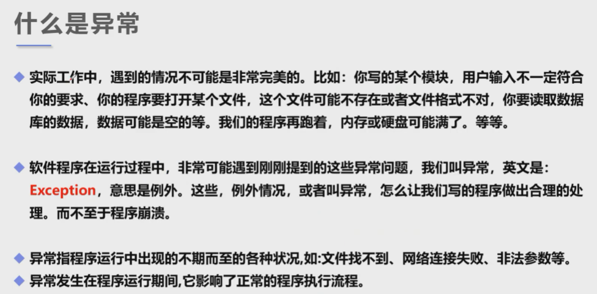

###### 1.1异常的分类

1. 检查性异常
2. 运行时异常


1. 错误

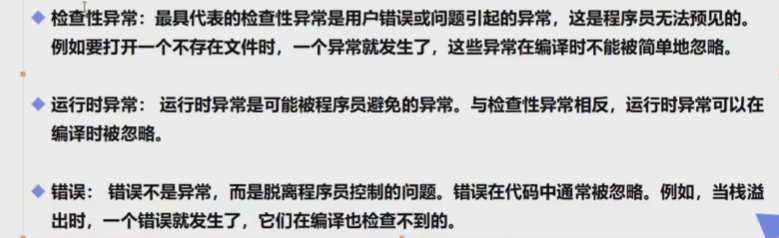

###### 1.2异常处理结构

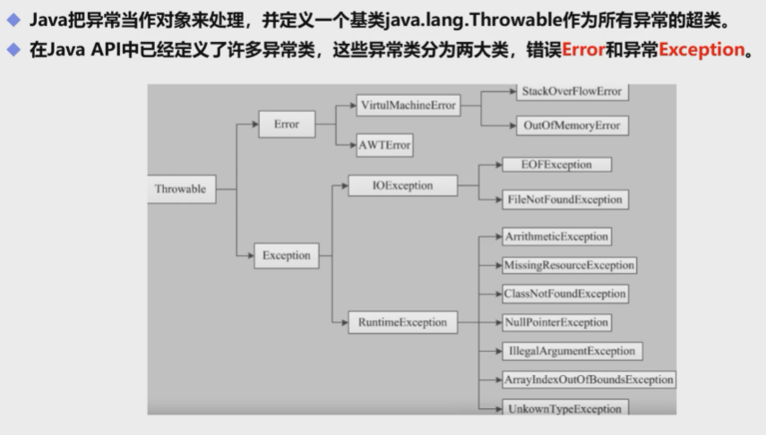

###### 1.3Error

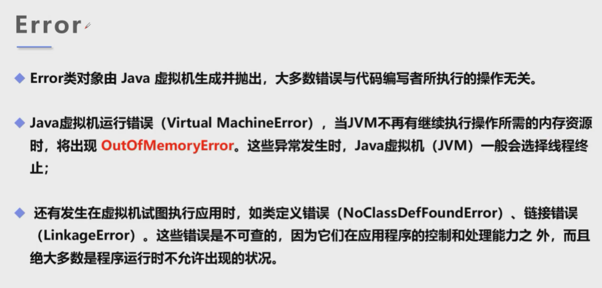

###### 1.4Exception

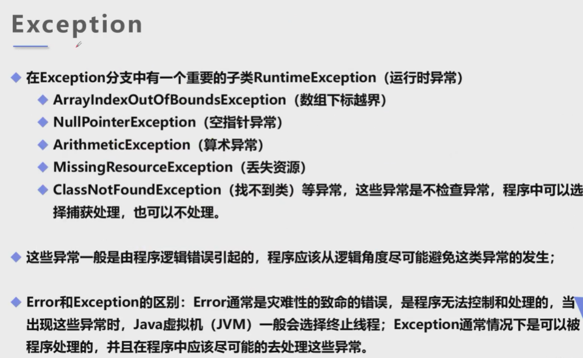

#### 2.捕获和抛出异常

- 抛出异常
- 捕获异常
- 异常处理五个关键字
  - try
  - catch
  - finally
  - throw
  - throws

==try···catch可以包含多个catch，异常的等级由小变大，最后使用Exception或者Throwable捕获==

```java
package com.exception;

public class Test {
    public static void main(String[] args) {
        int a = 1;
        int b = 0;

        //Exception in thread "main" java.lang.ArithmeticException: / by zero
        //System.out.println(a/b);

        try{ //try监控区域
            System.out.println(a/b);
        }catch(ArithmeticException e){ //捕获异常
            System.out.println("程序出现异常，变量b不能为0");
        }finally{ //处理善后工作
            System.out.println("finally");
        }
        //finally用于IO、资源关闭 可以不要finally
        System.out.println("--------------");
        //假设要捕获多个异常：从小到大捕获
        try{ //try监控区域
            System.out.println(a/b);
        }catch (Error e){ //捕获异常
            System.out.println("Error");
        }catch (Exception e){ //捕获异常
            System.out.println("Exception");
        }catch (Throwable e){ //捕获异常
            System.out.println("Throwable");
        }finally{ //处理善后工作
            System.out.println("finally");
        }
    }
    public void a(){
        b();
    }
    public void b(){
        a();
    }
}
```

##### 2.1throws和throw的区别

[(36条消息) java中异常的捕获及处理_Superme-CSDN博客_java异常处理](https://blog.csdn.net/sugar_no1/article/details/88593255)

- throw   -- 用于抛出异常。
- throws -- 用在方法签名中，用于声明该方法可能抛出的异常。主方法上也可以使用throws抛出。如果在主方法上使用了throws抛出，就表示在主方法里面可以不用强制性进行异常处理，如果出现了异常，就交给JVM进行默认处理，则此时会导致程序中断执行。

#### 3.自定义异常

```java
//自定义的异常类
public class MyException extends Exception{
    //传递数字 >10 抛出异常
    private int detail;

    public MyException(int a) {
        this.detail = a;
    }
    //toString：异常的打印信息
    @Override
    public String toString() {
        return "MyException{" +
                "detail=" + detail +
                '}';
    }
}
```

### 5.4java 常用类

==源引千峰教育B站课程链接：https://www.bilibili.com/video/BV1vt4y197nY ’==

#### 5.4.1内部类

- ==**内部类的分类**==
  1. 成员内部类
  2. 静态内部类
  3. 局部内部类
  4. 匿名内部类
- 内部类：在一个类的内部定义一个完整的类
- 内部类的特点
  - 编译之后生成独立的字节码文件
  - 内部类可以直接访问外部类的私有成员，而不破坏封装
  - 可为外部类提供必要的内部功能组件

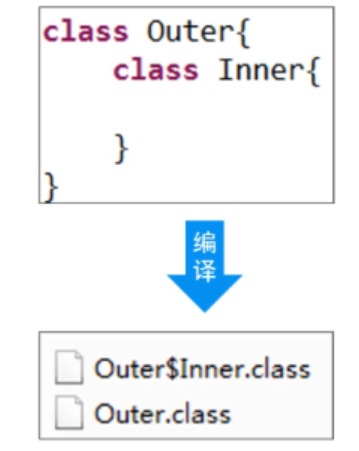

##### 1.成员内部类

- ==在类的内部定义，与实例变量、实例方法同级别的类==
- 外部类的一个实例部分，**创建内部类对象时，必须依赖外部类对象**
- ==当外部类、内部类存在重名属性时，会优先访问内部类属性==
- 成员内部类里不能定义静态成员、可以包含静态常量(final)

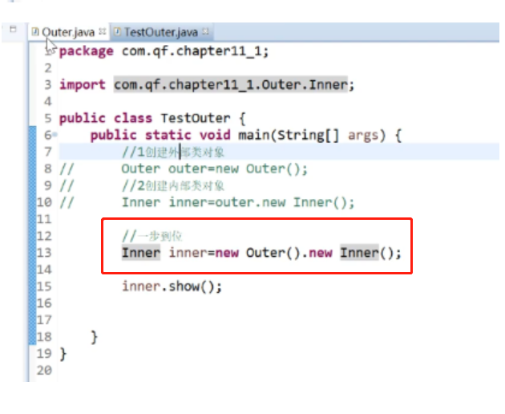

##### 2.静态内部类

- 不依赖外部类对象，可直接创建或通过类名访问可声明静态成员

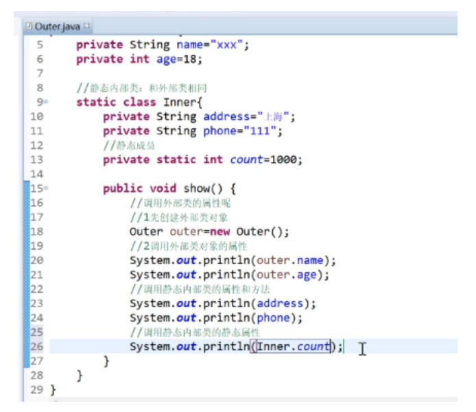

##### 3.局部内部类

+ 定义在外部类方法中，作用范围和创建对象范围仅限于当前的方法
+ 局部内部类访问外部类当前方法的局部变量时，因无法保障变量的生命周期与自身相同，变量必须修饰为final
+ 限制类的适用范围

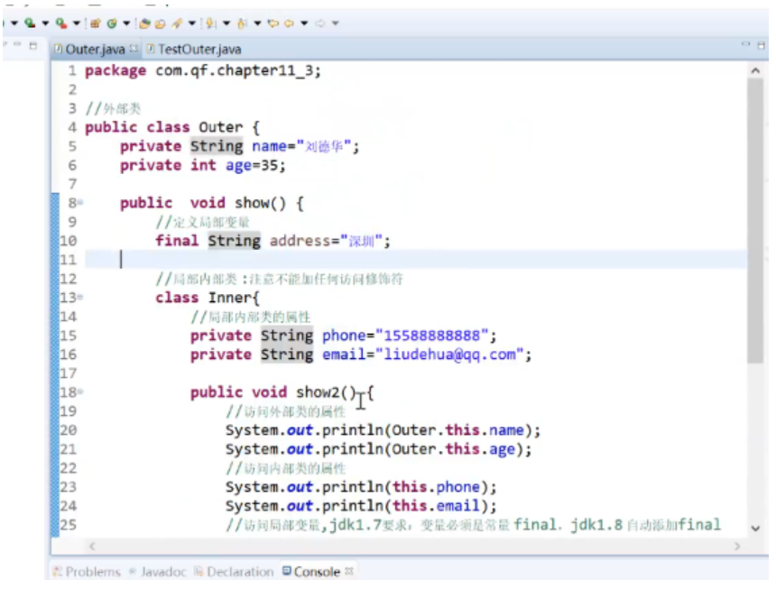

##### 4.匿名内部类

精讲：[(38条消息) 匿名内部类详解_一点一滴-CSDN博客_匿名内部类](https://blog.csdn.net/qq_34944851/article/details/51449420)

- 没有类名的局部内部类
- 必须继承一个父类或者实现一个接口
- 定义类、实现类、创建对象的语法合并，只能创建一个该类的对象
- 优点：减少代码量
- 缺点：代码可读性较差

#### 5.4.2Object类

- 所有类的直接或间接父类，位于继承树的最顶层
- 任何类没有书写extends显示继承某个类，都默认直接继承Object类，否则就间接继承
- Object类中的方法都是所有对象都具备的方法
- Object类型可以存储任何对象
  - 作为参数，可接受任何对象
  - 作为返回值，可返回任何对象

##### 1.getClass()方法

```java
 public final Class<?> getClass(){}
```

返回引用中存储的实际对象类型。

应用：通常用于判断两个引用中实际存储对象类型是否一致。

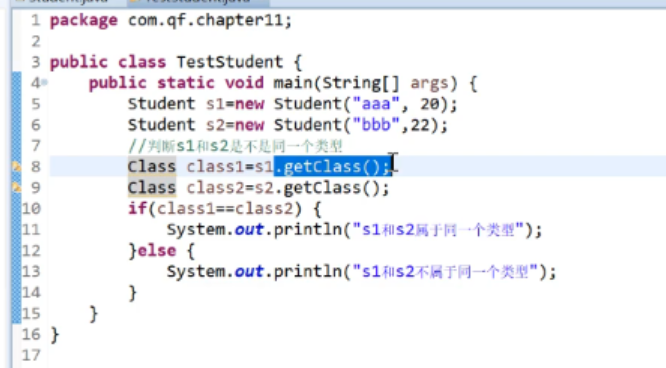

##### 2.hashCode()方法

```java
 public int hashCode(){}
```

- 返回该对象的哈希码值
- 哈希值根据对象的地址或字符串或数字使用hash算法计算出的int类型的数值。
- 一般情况下相同对象返回相同哈希码

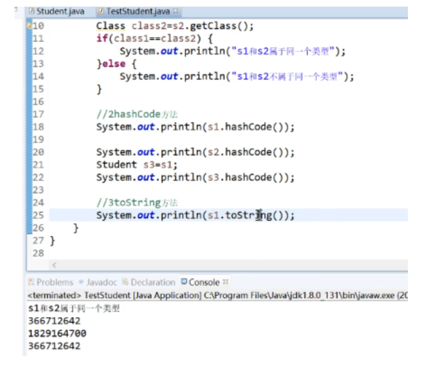

##### 3.toString()方法

- public String toString(){}
- 返回该对象的字符串表示(表现形式)
- 可以根据程序需求覆盖该方法,如：展示对象各个属性值

##### 4.equals()方法

- public booean equals(Object obj){}
- 默认实现为(this==obj)，比较两个对象地址是否相同
- 可进行覆盖，比较两个对象的内容是否相同

- equals()方法覆盖步骤
  - 判断obj是否为null
  - 判断两个引用指向的实际对象类型是否一致
  - 强制类型转换
  - 依次比较各个属性值是否相同

##### 5.finalize()方法

- 当对象被判定为垃圾对象时，由JVM自动调用此方法，用以标记垃圾对象，进入回收队列
- 垃圾对象：没有有效引用指向此对象时，为垃圾对象
- 垃圾回收：由GC销毁垃圾对象，释放内存空间
- 自动回收机制：JVM的内存耗尽，一次性回收所有垃圾对象
- 手动回收机制，使用System.gc();通知JVM执行垃圾回收

#### 5.4.3包装类

- ==基本数据类型所对应的引用数据类型==
- Object可统一所有数据，包装类的默认值是null
- 包装类的对应：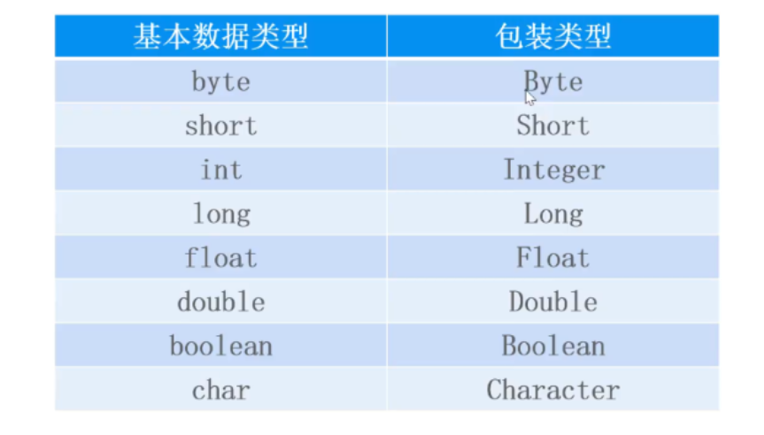

##### 1.类型转换与装箱、拆箱

- ==装箱：基本类型转为引用类型的过程==

- ==拆箱：引用类型转为基本类型的过程==

###### 1.对应类型之间的装箱与拆箱

1. 装箱

```java
public void packing(){
    Integer integer01 = new Integer(100);
    Integer integer02 = Integer.valueOf(100);
    Integer integer03 = 100;
    Integer integer04 = 100;
    Integer integer05 = 200;
    Integer integer06 = 200;
    Integer integer07 = new Integer(200);
    Integer integer08 = new Integer(200);

    System.out.println("-------------------");
    System.out.println(integer01);
    System.out.println(integer02);
    System.out.println(integer03);
    System.out.println(integer04);
    System.out.println(integer05);
    System.out.println(integer06);
    System.out.println(integer07);
    System.out.println(integer08);
    System.out.println("-------------------");
    System.out.println(integer01==integer02);
    System.out.println(integer03==integer04);
    System.out.println(integer05==integer06);
    System.out.println(integer07==integer08);
}
```

2. 拆箱

```java
public void unpacking(){
    Integer integer = 100;
    int i01 = integer.intValue();
    int i02 = integer;
    System.out.println(i01);
    System.out.println(i02);
}
```

###### 2.不同类型之间的转换

```java
public void integerToToString(){

    try {
        String str01 = "150";
        //String str02 = "150o";
        //String to int/Integer
        int i1 = Integer.parseInt(str01);
        //int i4 = Integer.parseInt(str02);

        System.out.println(i1);
        //System.out.println(i4);

        System.out.println("----------------------------------");

        int i = 100;
        Integer integer = 100;
        //int/Integer to String
        String str03 = i + "";
        String str04 = integer + "";
        String i001 = Integer.toString(i,2);
        String i002 = Integer.toString(integer,2);
        System.out.println(i001);
        System.out.println(i002);
        System.out.println(str04.getClass());
        System.out.println(str03.getClass());
    }catch (NumberFormatException e){
        System.out.println("String转换为Integer/int不能携带非数字");
    }finally {
        System.out.println("----------------------------------");
        System.out.println("Integer/int 与 String 的相互转换结束");
    }
}
```

##### 2.整数缓冲区

- java预先创建了256个常用的整数包装类的对象，存在在堆中

- 在实际应用中，对已经创建的对象进行复用

- IntegerCache：Integer类中的一个静态数组，位置在java.lang;

  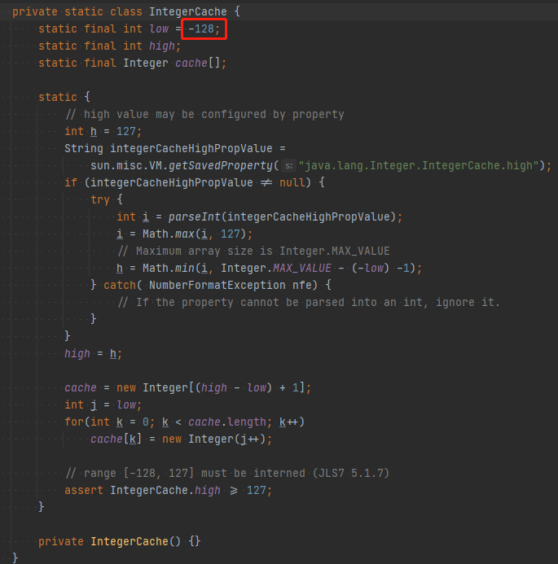

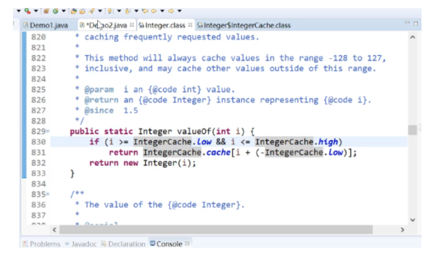

#### 5.4.4String类

- 字符串是常量，创建之后不可改变
- 字符串字面值存储在字符串池中，可以共享
  - String s = "Hello";产生一个对象，字符串池中存储
  - String s = new String("Hello"); //产生两个对象，堆、池个存储一个

##### 1.String常用方法

- public int length();返回字符串的长度
- public char charAt(int index);返回某个位置的字符
- public boolean contains(String str);判断是否包含某个子字符串
- public char[] toCharArray();将字符串转换为char类型数组
- public int indexOf(String str)；查找str首次出现的下表，若存在，返回该下标；不存在，则返回-1
- public int lastIndexof()；返回字符串最后一次出现的位置
- public String trim();去掉字符串前后的空格
- public String toUpperCase();将小写转成大写
- public String toLowerCase()；把大写转成小写
- public boolean endWith(String str):判断字符串是否以str结尾
- public boolean startwith(String str)；判断是否以str开头
- public String replace(char oldChar,char newChar);将旧字符串替换成新字符串
- public String[] split(String str);根据str做拆分

##### 2.字符串常量池

##### 3.可变字符串

3.1StringBuffer---StringBuilder

```
/**
 * StringBuilder和StringBuffer区别
 * 不同点：
 * 1.线程安全
 *      StringBuffer是线程安全的，因为添加了synchronized锁
 *      StringBuilder不是线程安全
 * 2.执行效率
 *      StringBuilder执行效率比StringBuffer快，因为执行不需要判断锁
 * 相同点：
 * 1.底层实现
 *      StringBuilder及StringBuffer均继承了AbstractStringBuilder
 *      其中AbstractStringBuilder底层使用的仍是字符数组，但是没有使用final修饰，可以动态扩充，属于可变字符串。
 * 2.实现的方法和功能都是等价的
 * */

/**
 * 参考文档：
 * 1.Java StringBuffer 和 StringBuilder 类详解：
 * https://www.runoob.com/java/java-stringbuffer.html
 * https://www.runoob.com/manual/jdk11api/java.base/java/lang/StringBuffer.html
 * https://www.runoob.com/manual/jdk11api/java.base/java/lang/StringBuilder.html
 * 2.StringBuilder扩容规则：
 * https://blog.csdn.net/chiting5096/article/details/100726861?utm_medium=distribute.pc_relevant.none-task-blog-2%7Edefault%7EBlogCommendFromMachineLearnPai2%7Edefault-3.control&depth_1-utm_source=distribute.pc_relevant.none-task-blog-2%7Edefault%7EBlogCommendFromMachineLearnPai2%7Edefault-3.control
 * 3.StringBuffer扩容原理：
 * https://www.jianshu.com/p/9b8ed3721b11
 * 4.什么是线程安全？
 * https://blog.csdn.net/zxc456733/article/details/78871972
 * 5.java常量池：
 * https://blog.csdn.net/qq_41376740/article/details/80338158
 */
```

##### 4.拼接字符串

```java
/**
 * 拼接字符串的6种方法
 * +
 * String.Join
 * String.Concat
 * StringUtils.Join
 * StringBuilder
 * StringBuffer
 * */
```

==拼接字符串详情请见SuperMaster中的stringUtil==

#### 5.4.5BigDecimal类

##### 1.BigDecimal类

==详情请见SuperMaster中mathUtil中PrecisionCalculation==

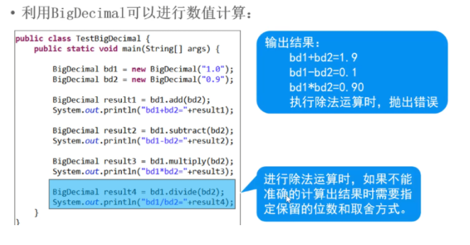

- 位置:java.math

- 作用：精确计算浮点数

- 创建方式：BigDecimal bd = new BigDecimal( "1.0" )

- ==除法==：divide(BigDecimal bd,int scal,RoundingMode mode)

  - 参数scal：指定精确到小数点后几位

  - 参数mode：

    指定小数部分的取舍模式，通常采取四舍五入的模式，取值为BigDecimal.ROUND_HALF_UP。

#### 5.4.6Date类

- Date表示特定的瞬间，精确到毫秒。Date类中的大部分方法都已经被Calendar类中的方法所取代。

- 时间单位
  - 1秒=1000毫秒
  - 1毫秒=1000微秒
  - 1微秒=1000纳秒

```java
/**
     * 获取Date类型的当前时间
     */
    @Test
    public void getNowDate() {
        Date date = new Date();
        System.out.println("Date类型的当前时间：" + date);
    }

    /**
     * 时间格式化
     */
    @Test
    public void timeFormat() {
        Date date = new Date();
        String dateFormat = "yyyy-MM-dd HH:mm:ss";
        SimpleDateFormat simpleDateFormat = new SimpleDateFormat(dateFormat);
        String dateFormatString = simpleDateFormat.format(date).toString();
        System.out.println(dateFormatString);
    }
```

#### 5.4.7Calendar类

- Calendar提供了获取或设置各种日历字段的方法。

- 构造方法
  - protected Calendar()：由于修饰符是protected，所以无法直接创建该对象。

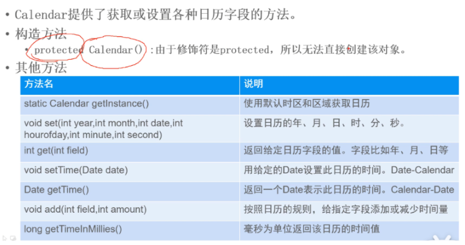

#### 5.4.8SimpleDateFormat类

- SimpleDateFormat是一个以与语言环境有关的方式来格式化和解析日期的具体类。

- 进行格式化(日期—>文本)、解析(文本->日期)。

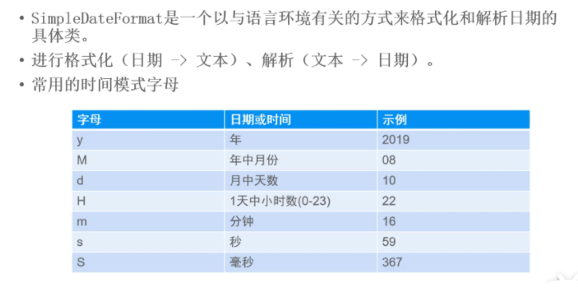

#### 5.4.9System类

- System类：主要用于获取系统的属性数据和其他操作，构造方法是私有的。
- System类的常用方法
  - static void arraycopy(...);------复制数组
  - static long currentTimeMillis();------获取当前系统时间，返回的是毫秒值
  - static void gc();------建议JVM赶快启动垃圾回收器回收垃圾
  - static void exit(int status);------推出JVM，如果参数是0正常退出JVM，非0表示异常退出JVM

### 5.5集合框架

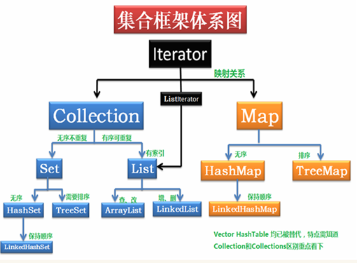

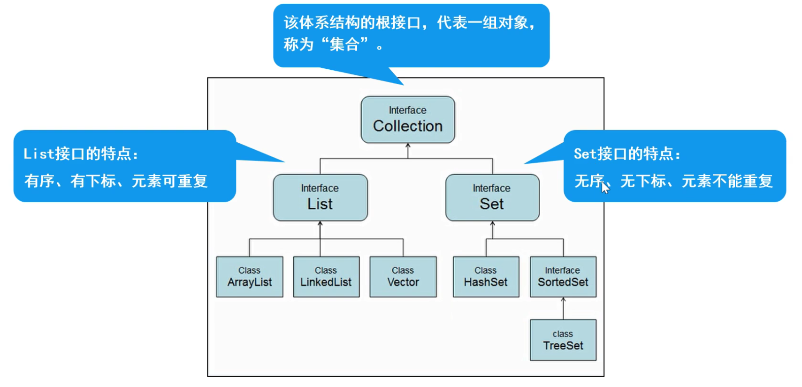

#### 1.集合

##### 1.1**概念**

​	对象的容器，定义了对多个对象进项操作的的常用方法。可实现数组的功能。

##### 1.2**和数组的区别**

1. 数组长度固定，集合长度不固定。

2. 数组可以存储基本类型和引用类型，集合只能存储引用类型。

##### 1.3**位置**

​	位于java.util.*;

##### 1.4集合的分类

1. Collection
   - List
   - Set
2. Map
   - Map

##### 1.5集合类及其接口的实现类的主要方法

1. 定义
2. 添加
3. 删除
   - 清空整个集合
   - 根据特征删除某个元素
4. 查询
   - 返回集合的长度
   - 查找某个元素的下标
5. 遍历（不一定适用于全部集合）
   - for循环
   - 增强for循环
   - 迭代器（Iterator/ListIterator）
   - keySet/EntrySet
6. 判断
   - 判断集合是否包含某个特征元素
   - 判断集合是否为空
7. 复制
8. 集合之间的转换
9. 集合与数组之间的转换
10. 集合的截取

#### 2.Collection接口

- **特点**：代表一组任意类型的对象，无序、无下标、不能重复。

- 方法：

  ```java
  boolean add(Object obj) //添加一个对象。
  boolean addAll(Collection c) //将一个集合中的所有对象添加到此集合中。
  void clear() //清空此集合中的所有对象。
  boolean contains(Object o) //检查此集合中是否包含o对象。
  boolean equals(Object o) //比较此集合是否与指定对象相等。
  boolean isEmpty() //判断此集合是否为空。
  boolean remove(Object o) //在此集合中移除o对象。
  int size() //返回此集合中的元素个数。
  Object[] toArray() //将此集合转换成数组。
  ```

#### 3.List接口和实现类

##### 3.1List集合特点

1. 有序
2. 有下标
3. 元素可重复

##### 3.2常用的方法

```java
void add(int index,Object o) //在index位置插入对象o。
boolean addAll(index,Collection c) //将一个集合中的元素添加到此集合中的index位置。
Object get(int index) //返回集合中指定位置的元素。
List subList(int fromIndex,int toIndex) //返回fromIndex和toIndex之间的集合元素。
```

##### 3.3List集合的实现类

###### 1.ArrayList【重点】

1. 特点：数组结构实现，查询快，增删慢

2. 其他：JDK1.2版本出现，运行效率快，线程不安全

3. ==源码分析==：

   - 默认容量大小：private static final int DEFAULT_CAPACITY = ==10==;
   - 实际存放元素的数组：transient Object[] elementData;
   - 实际元素的个数：private int size;
   - 当数组的长度到达10的时候，开始增量ArrayList：每次扩容为原来的1.5倍

   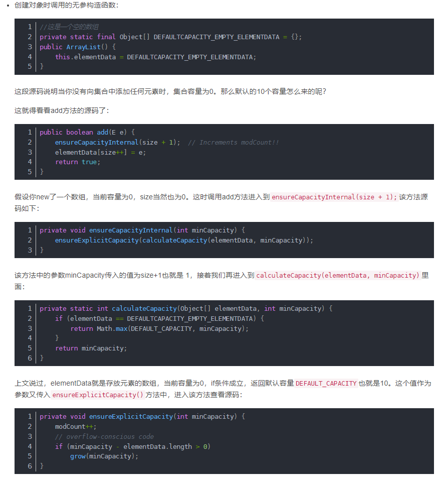

   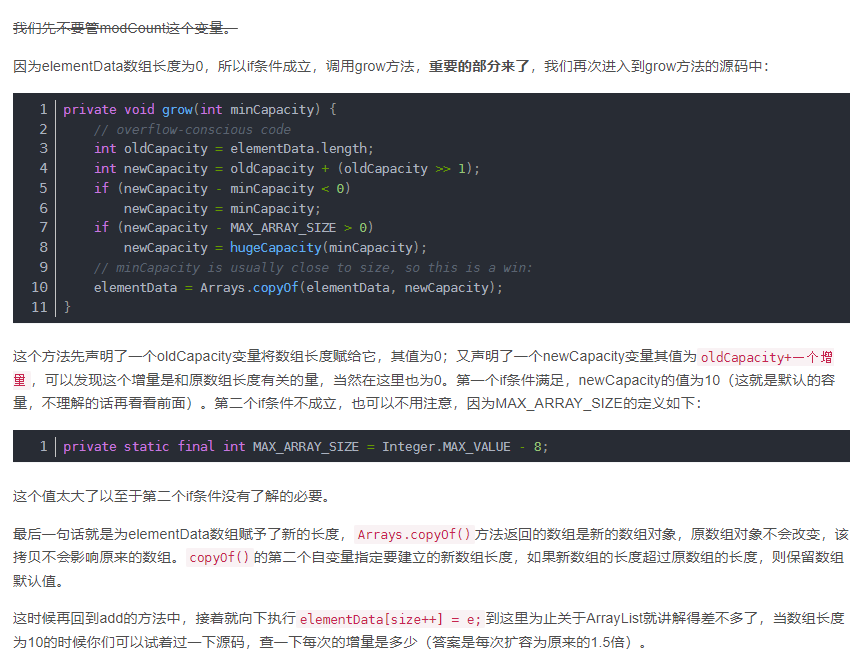

###### 2.LinkedList

1. ==链表结构实现==，增删快，查询慢。

2. 链表大小：`transient int size = 0;`

3. （指向）第一个结点/头结点：`transient Node<E> first;`

4. （指向）最后一个结点/尾结点：`transient Node<E> last;`

   ```java
   /**
    * LinkedList的用法
    * 存储结构：双向链表
    * 1.添加元素
    * 2.删除元素
    * 3.遍历
    * 4.判断
    */
   public class Demo2 {
   	public static void main(String[] args) {
   		LinkedList linkedList=new LinkedList<>();
   		Student s1=new Student("唐", 21);
   		Student s2=new Student("何", 22);
   		Student s3=new Student("余", 21);
   		//1.添加元素
   		linkedList.add(s1);
   		linkedList.add(s2);
   		linkedList.add(s3);
   		linkedList.add(s3);
   		System.out.println("元素个数："+linkedList.size());
   		System.out.println(linkedList.toString());
   		//2.删除元素
   		/*
   		 * linkedList.remove(new Student("唐", 21));
   		 * System.out.println(linkedList.toString());
   		 */
   		//3.遍历
   		//3.1 使用for
   		for(int i=0;i<linkedList.size();++i) {
   			System.out.println(linkedList.get(i));
   		}
   		//3.2 使用增强for
   		for(Object object:linkedList) {
   			Student student=(Student) object;
   			System.out.println(student.toString());
   		}
   		//3.3 使用迭代器
   		Iterator iterator =linkedList.iterator();
   		while (iterator.hasNext()) {
   			Student student = (Student) iterator.next();
   			System.out.println(student.toString());
   		}
   		//3.4 使用列表迭代器（略）
   		//4. 判断
   		System.out.println(linkedList.contains(s1));
   		System.out.println(linkedList.isEmpty());
   		System.out.println(linkedList.indexOf(s3));
   	}
   }
   ```

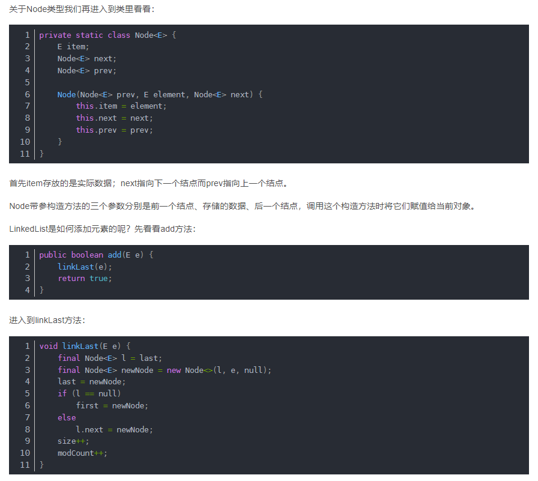


5. ArrayList与LinkedList的区别

   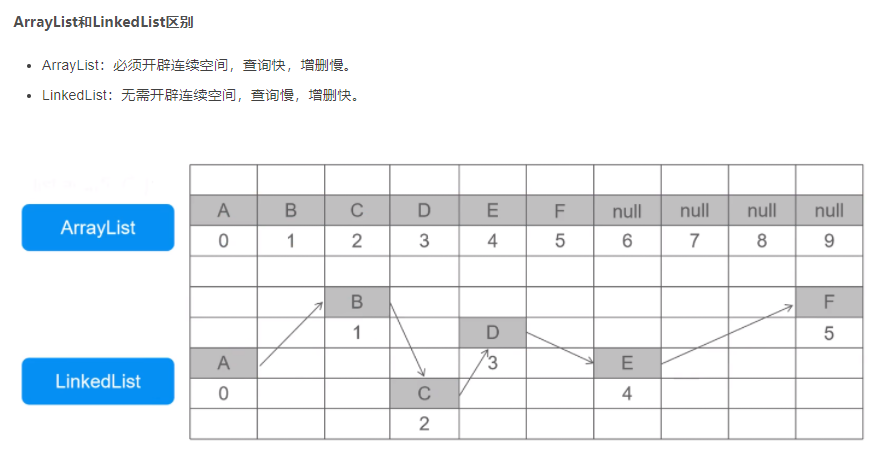

###### 3.Vector

1. 数组结构实现，查询快，增删慢

2. JDK1.0版本出现，运行效率慢，线程安全

   ```java
   /**
    * Vector的演示使用
    * 
    *1.添加数据
    *2.删除数据
    *3.遍历
    *4.判断
    */
   public class Demo1 {
   	public static void main(String[] args) {
   		Vector vector=new Vector<>();
   		//1.添加数据
   		vector.add("tang");
   		vector.add("he");
   		vector.add("yu");
   		System.out.println("元素个数："+vector.size());
   		//2.删除数据
   		/*
   		 * vector.remove(0); vector.remove("tang");
   		 */
   		//3.遍历
   		//使用枚举器
   		Enumeration enumeration=vector.elements();
   		while (enumeration.hasMoreElements()) {
   			String s = (String) enumeration.nextElement();
   			System.out.println(s);
   		}
   		//4.判断
   		System.out.println(vector.isEmpty());
   		System.out.println(vector.contains("he"));
   		//5. Vector其他方法
   		//firstElement()  lastElement()  ElementAt();
   	}
   }
   ```

#### 4.泛型和工具类

- Java泛型是JDK1.5中引入的一个新特性，其本质是参数化类型，把类型作为参数传递。
- 常见形式有==泛型类==、==泛型接口==、==泛型方法==。
- 语法：
  - <T,…> T称为类型占位符，表示一种引用类型。
- 好处：
  - 提高代码的重用性。
  - 防止类型转换异常，提高代码的安全性。

##### 4.1泛型类

```java
/**
 * 泛型类
 * 语法：类名<T>
 * T是类型占位符，表示一种引用类型，编写多个使用逗号隔开
 * 
 */
public class myGeneric<T>{
	//1.创建泛型变量
	//不能使用new来创建，因为泛型是不确定的类型，也可能拥有私密的构造方法。
	T t;
	//2.泛型作为方法的参数
	public void show(T t) {
		System.out.println(t);
	}
	//泛型作为方法的返回值
	public T getT() {
		return t;
	}
}
```

```java
/**
 * 注意：
 * 1.泛型只能使用引用类型
 * 2.不同泛型类型的对象不能相互赋值
 */
public class testGeneric {
	public static void main(String[] args) {
		//使用泛型类创建对象
		myGeneric<String> myGeneric1=new myGeneric<String>();
		myGeneric1.t="tang";
		myGeneric1.show("he");
		
		myGeneric<Integer> myGeneric2=new myGeneric<Integer>();
		myGeneric2.t=10;
		myGeneric2.show(20);
		Integer integer=myGeneric2.getT();
	}
}
```

##### 4.2泛型接口

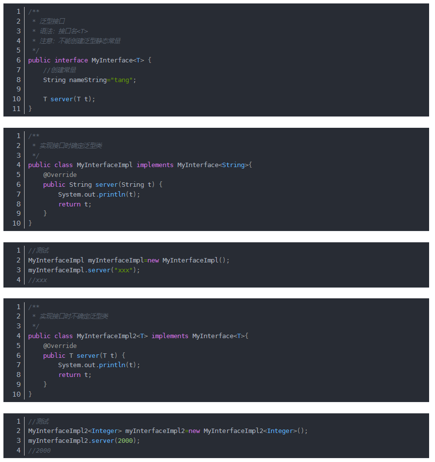

##### 4.3泛型方法

```java
/**
 * 泛型方法
 * 语法：<T> 返回类型
 */
public class MyGenericMethod {
	public <T> void show(T t) {
		System.out.println("泛型方法"+t);
	}
}

//测试
MyGenericMethod myGenericMethod=new MyGenericMethod();
myGenericMethod.show("tang");
myGenericMethod.show(200);
myGenericMethod.show(3.14);
```

##### 4.4泛型集合

- **概念**：参数化类型、类型安全的集合，强制集合元素的类型必须一致。

- 特点：

  - 编译时即可检查，而非运行时抛出异常。
  - 访问时，不必类型转换（拆箱）。
  - 不同泛型指尖引用不能相互赋值，泛型不存在多态。

  ```java
  public class LinkedList<E>
      extends AbstractSequentialList<E>
      implements List<E>, Deque<E>, Cloneable, java.io.Serializable{//略}
  ```

注：它是一个泛型类，而之前使用的时候并没有传递，说明java语法是允许的，这个时候传递的类型是Object类，虽然它是所有类的父类，可以存储任意的类型，但是在遍历、获取元素时需要原来的类型就要进行强制转换。这个时候就会出现一些问题，假如往链表里存储了许多不同类型的数据，在强转的时候就要判断每一个原来的类型，这样就很容易出现错误。

#### 5.Set接口与实现类

##### 5.1Set接口

- 特点：无序，无下标，元素不可重复

- 方法：全部继承自Collection中的方法

- ```java
  /**
   * 测试Set接口的使用
   * 特点：1.无序，没有下标；2.重复
   * 1.添加数据
   * 2.删除数据
   * 3.遍历【重点】
   * 4.判断
   */
  public class Demo1 {
  	public static void main(String[] args) {
  		Set<String> set=new HashSet<String>();
  		//1.添加数据
  		set.add("tang");
  		set.add("he");
  		set.add("yu");
  		System.out.println("数据个数："+set.size());
  		System.out.println(set.toString());//无序输出
  		//2.删除数据
  		/*
  		 * set.remove("tang"); System.out.println(set.toString());
  		 */
  		//3.遍历【重点】-----无下标不可使用普通for循环
  		//3.1 使用增强for
  		for (String string : set) {
  			System.out.println(string);
  		}
  		//3.2 使用迭代器
  		Iterator<String> iterator=set.iterator();
  		while (iterator.hasNext()) {
  			System.out.println(iterator.next());
  		}
  		//4.判断
  		System.out.println(set.contains("tang"));
  		System.out.println(set.isEmpty());
  	}
  }
  ```

5.2==Set接口的实现类==【重点】

###### 5.2.1HashSet【重点】

1. hashSet存储过程：==存储结构：哈希表（数组+链表+红黑树）==

- 基于HashCode计算元素存放位置。
- 当存入元素的哈希码相同时，会调用equals进行确认，如结果为true，则拒绝后者存入。

2. hashCode方法里为什么要使用31这个数字大概有两个原因：
   1. 31是一个质数，这样的数字在计算时可以尽量减少散列冲突。
   2. 可以提高执行效率，因为31*i=(i<<5)-i，31乘以一个数可以转换成移位操作，这样能快一点；但是也有网上一些人对这两点提出质疑。

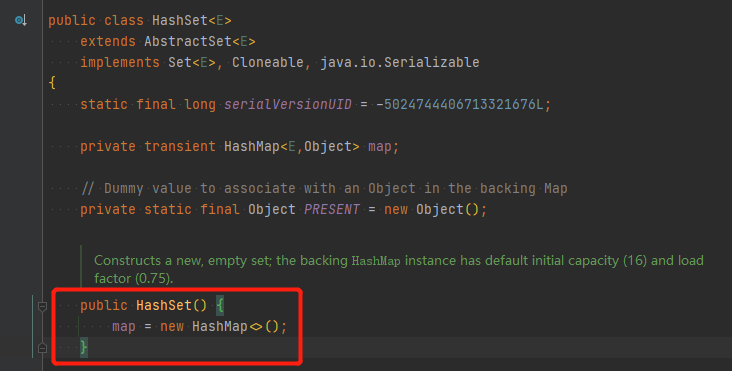

###### 5.2.2TreeSet

==存储结构：红黑树==

- 基于排序顺序实现不重复。
- 实现了SortedSet接口，对集合元素自动排序。
- 元素对象的类型必须实现Comparable接口，指定排序规则。
- 通过CompareTo方法确定是否为重复元素。

```java
/**
 * 使用TreeSet保存数据
 * 存储结构：红黑树
 * 要求：元素类必须实现Comparable接口，compareTo方法返回0，认为是重复元素 
 */
public class Demo4 {
	public static void main(String[] args) {
		TreeSet<Person> persons=new TreeSet<Person>();
		Person p1=new Person("tang",21);
		Person p2=new Person("he", 22);
		Person p3=new Person("yu", 21);
		//1.添加元素
		persons.add(p1);
		persons.add(p2);
		persons.add(p3);
		//注：直接添加会报类型转换错误，需要实现Comparable接口
		System.out.println(persons.toString());
		//2.删除元素
		persons.remove(p1);
		persons.remove(new Person("he", 22));
		System.out.println(persons.toString());
		//3.遍历（略）
		//4.判断
		System.out.println(persons.contains(new Person("yu", 21)));
	}
}
```

查看Comparable接口的源码，发现只有一个compareTo抽象方法，在人类中实现它：

```java
public class Person implements Comparable<Person>{
    @Override
	//1.先按姓名比
	//2.再按年龄比
	public int compareTo(Person o) {
		int n1=this.getName().compareTo(o.getName());
		int n2=this.age-o.getAge();
		return n1==0?n2:n1;
	}
}
```

除了实现Comparable接口里的比较方法，TreeSet也提供了一个带比较器Comparator的构造方法，使用匿名内部类来实现它：

```java
/**
 * TreeSet的使用
 * Comparator：实现定制比较（比较器）
 */
public class Demo5 {
	public static void main(String[] args) {
		TreeSet<Person> persons=new TreeSet<Person>(new Comparator<Person>() {
			@Override
			public int compare(Person o1, Person o2) {
				// 先按年龄比较
				// 再按姓名比较
				int n1=o1.getAge()-o2.getAge();
				int n2=o1.getName().compareTo(o2.getName());
				return n1==0?n2:n1;
			}			
		});
		Person p1=new Person("tang",21);
		Person p2=new Person("he", 22);
		Person p3=new Person("yu", 21);
		persons.add(p1);
		persons.add(p2);
		persons.add(p3);
		System.out.println(persons.toString());
	}
}
```

#### 6.Map接口与实现类

##### 6.1Map集合接口

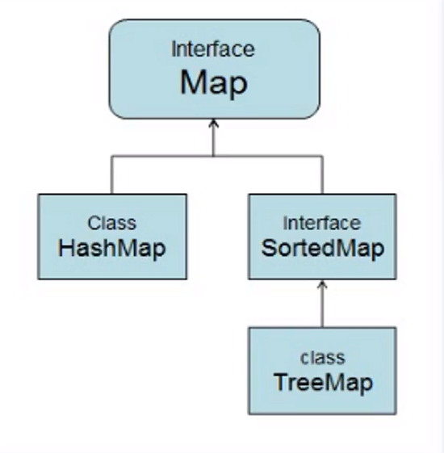

1. Map接口的特点：
   1. 用于存储任意键值对(Key-Value)。
   2. 键：无序、无下标、不允许重复（唯一）。
   3. 值：无序、无下标、允许重复。

2. 常用方法：

   - `V put(K key,V value)`//将对象存入到集合中，关联键值。key重复则覆盖原值。
   - `Object get(Object key)`//根据键获取相应的值。
   - `Set<K>`//返回所有的key
   - `Collection<V> values()`//返回包含所有值的Collection集合。
   - `Set<Map.Entry<K,V>>`//键值匹配的set集合

   ```java
   /**
    * Map接口的使用
    * 特点：1.存储键值对 2.键不能重复，值可以重复 3.无序
    */
   public class Demo1 {
   	public static void main(String[] args) {
   		Map<String,Integer> map=new HashMap<String, Integer>();
   		//1.添加元素
   		map.put("tang", 21);
   		map.put("he", 22);
   		map.put("fan", 23);
   		System.out.println(map.toString());
   		//2.删除元素
   		map.remove("he");
   		System.out.println(map.toString());
   		//3.遍历
   		//3.1 使用keySet();
   		for (String key : map.keySet()) {
   			System.out.println(key+" "+map.get(key));
   		}
   		//3.2 使用entrySet();效率较高
   		for (Map.Entry<String, Integer> entry : map.entrySet()) {
   			System.out.println(entry.getKey()+" "+entry.getValue());
   		}
   	}
   }
   ```

##### 6.2HashMap

###### 6.2.1特点

​	JDK1.2版本，线程不安全，运行效率快；

​	允许用null作为key或是value。

6.2.2==源码分析==

- 默认初始化容量：`static final int DEFAULT_INITIAL_CAPACITY = 1 << 4; // aka 16`

- 数组最大容量：`static final int MAXIMUM_CAPACITY = 1 << 30;`

- 默认加载因子：`static final float DEFAULT_LOAD_FACTOR = 0.75f;`

- 链表调整为红黑树的链表长度阈值（JDK1.8）：`static final int TREEIFY_THRESHOLD = 8;`

- 红黑树调整为链表的链表长度阈值（JDK1.8）：`static final int UNTREEIFY_THRESHOLD = 6;`

- 链表调整为红黑树的数组最小阈值（JDK1.8）：`static final int MIN_TREEIFY_CAPACITY = 64;`

- HashMap存储的数组：`transient Node<K,V>[] table;`

- HashMap存储的元素个数：`transient int size;`

  > - 默认加载因子是什么？
  >   - 就是判断数组是否扩容的一个因子。假如数组容量为100，如果HashMap的存储元素个数超过了100*0.75=75，那么就会进行扩容。
  > - 链表调整为红黑树的链表长度阈值是什么？
  >   - 假设在数组中下标为3的位置已经存储了数据，当新增数据时通过哈希码得到的存储位置又是3，那么就会在该位置形成一个链表，当链表过长时就会转换成红黑树以提高执行效率，这个阈值就是链表转换成红黑树的最短链表长度；
  > - 红黑树调整为链表的链表长度阈值是什么？
  >   - 当红黑树的元素个数小于该阈值时就会转换成链表。
  > - 链表调整为红黑树的数组最小阈值是什么？
  >   - 并不是只要链表长度大于8就可以转换成红黑树，在前者条件成立的情况下，数组的容量必须大于等于64才会进行转换。

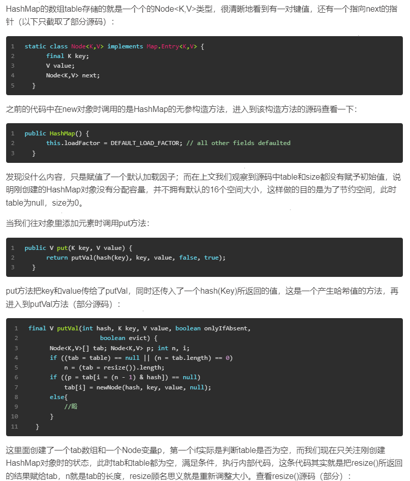

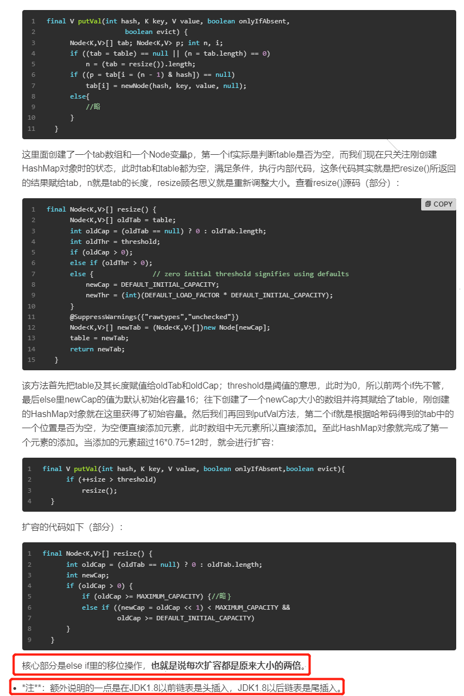

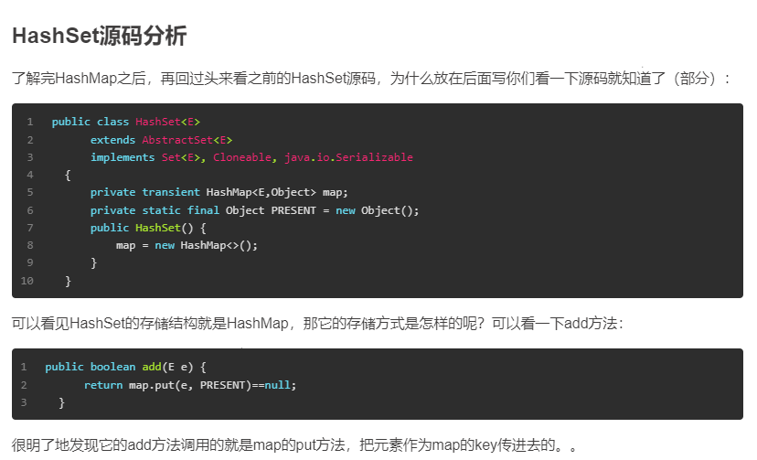

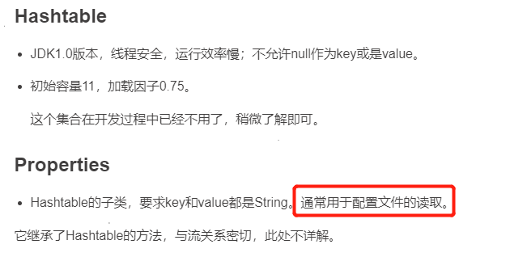

##### 6.3TreeMap

- 实现了SortedMap接口（是Map的子接口），可以对key自动排序。==（所谓自动排序，需要实现Comparable接口，也就是需要定制比较器）==

- 定制比较器

  - ```java
    public class Student implements Comparable<Student>{
        @Override
        public int compareTo(Student o) {
            int n1=this.id-o.id;
            return n1;
    }
    ```

  - ```java
    TreeMap<Student, Integer> treeMap2=new TreeMap<Student, Integer>(new Comparator<Student>() {
        @Override
        public int compare(Student o1, Student o2) {
            // 略
            return 0;
        }			
    });
    ```

- ==注：TreeSet的存储结构实际上就是TreeMap，再来看其存储方式：==

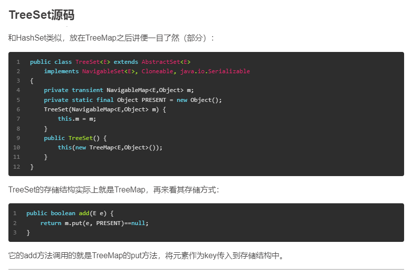

#### 7.Collection工具类

- **概念**：集合工具类，定义了除了存取以外的集合常用方法。
- **方法**：
  - `public static void reverse(List<?> list)`//反转集合中元素的顺序
  - `public static void shuffle(List<?> list)`//随机重置集合元素的顺序
  - `public static void sort(List<T> list)`//升序排序（元素类型必须实现Comparable接口）

```java
/**
 * 演示Collections工具类的使用
 *
 */
public class Demo {
	public static void main(String[] args) {
		List<Integer> list=new ArrayList<Integer>();
		list.add(20);
		list.add(10);
		list.add(30);
		list.add(90);
		list.add(70);
		
		//sort排序
		System.out.println(list.toString());
		Collections.sort(list);
		System.out.println(list.toString());
		System.out.println("---------");
		
		//binarySearch二分查找
		int i=Collections.binarySearch(list, 10);
		System.out.println(i);
		
		//copy复制
		List<Integer> list2=new ArrayList<Integer>();
		for(int i1=0;i1<5;++i1) {
			list2.add(0);
		}
		//该方法要求目标元素容量大于等于源目标
		Collections.copy(list2, list);
		System.out.println(list2.toString());
		
		//reserve反转
		Collections.reverse(list2);
		System.out.println(list2.toString());
		
		//shuffle 打乱
		Collections.shuffle(list2);
		System.out.println(list2.toString());
		
		//补充：list转成数组
		Integer[] arr=list.toArray(new Integer[0]);
		System.out.println(arr.length);
		//补充：数组转成集合 
		String[] nameStrings= {"tang","he","yu"};
		//受限集合，不能添加和删除
		List<String> list3=Arrays.asList(nameStrings);
		System.out.println(list3);
		
		//注：基本类型转成集合时需要修改为包装类
	}
}
```

### 5.6 java IO

注：引用链接：[Java IO详解系列 - 标签 - YSOcean - 博客园 (cnblogs.com)](https://www.cnblogs.com/ysocean/tag/Java IO详解系列/)

#### 1.流的概念

##### 1.1什么是流

​	内存与存储设备之间传输数据的通道

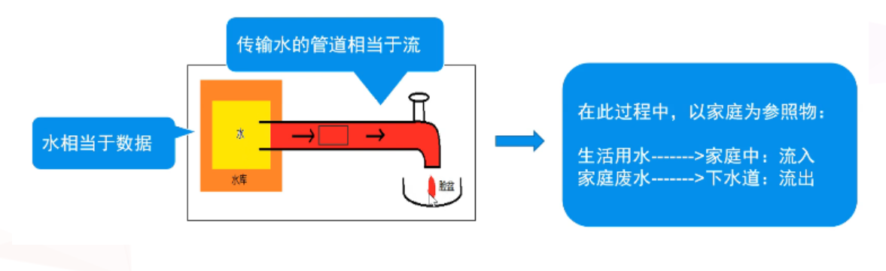

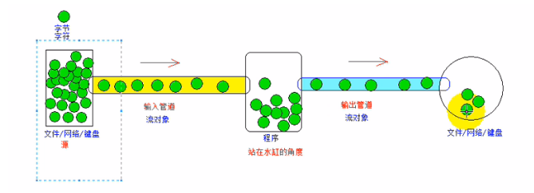

#### 2.流的分类

##### 2.1流的分类

1. 按照方向：注意输入输出流是相对程序而言的。

   输出：把程序（内存中的数据）输出到磁盘或者光盘等存储物质中。

   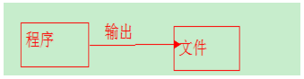

   输入：读取外部数据（磁盘、光盘等存储设备的数据）到程序（内存）中。

   

   1. 输入流：将<存储设备>中的内容读到<内存>中
   2. 输出流：将<内存>中的内容写到<存储设备>中

2. 按照单位

   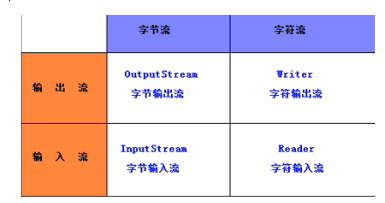

   1. 字节流：以字节为单位，可以读写所有数据
   2. 字符流：以字符为单位，只能读写文本数据

3. 按照功能
   1. 节点流：具有实际传输数据的读写功能
   2. 过滤流：在节点流的基础之上增强功能

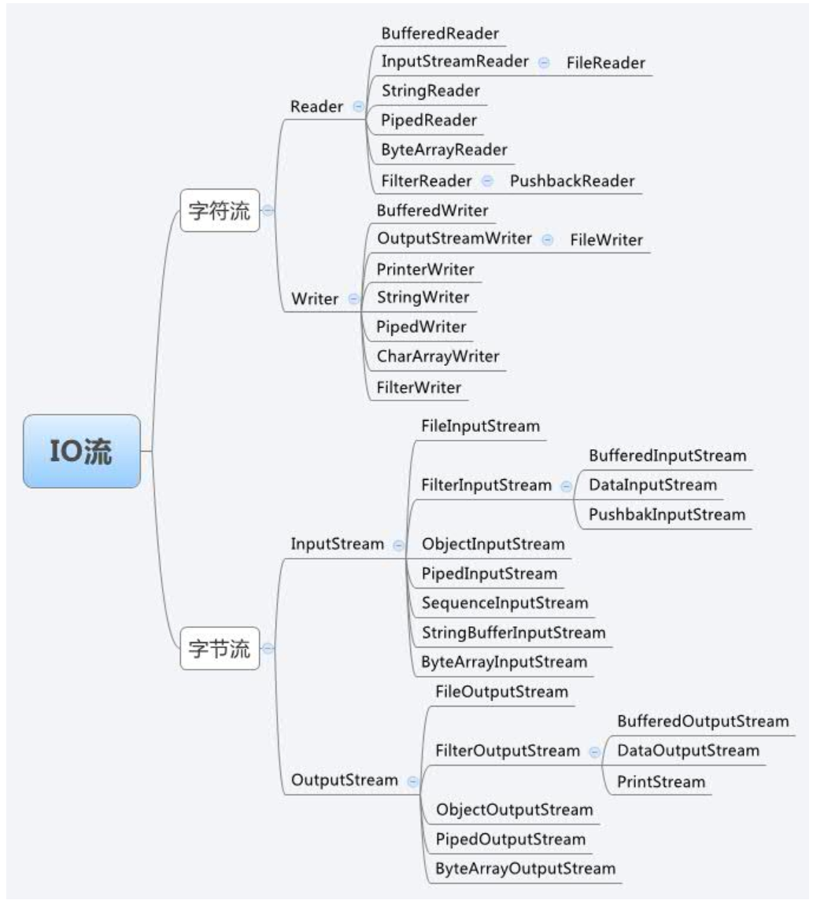

#### 3.字节流

字节流的父类InputStream与OutputStream，都是抽象类。

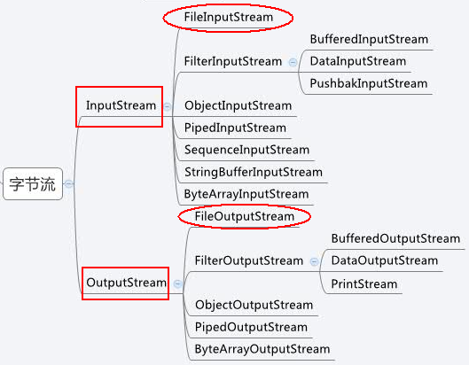

##### 3.1字节输入/输出流

1. **InputStream：字节输入流**

| int read()                             | 读取下一个字节，字节值范围是0-255。如果返回-1代表已到流的末尾。 |
| -------------------------------------- | ------------------------------------------------------------ |
| **int read(byte[] b)**                 | **以指定长度的字节数组读取流。返回读取到的实际字节数组个数，如果返回-1代表已到流的末尾。** |
| **int read(byte[] b,int off,int len)** | **以指定的字节数组读取流，并可以通过off指定字节数组覆盖位置，len指定字节输入覆盖的长度。如果返回-1代表已到流的末尾。** |

2. **OutputStream：字节输出流**

| **void write(int b)**                    | **将指定的字节写入该输出流中**                               |
| ---------------------------------------- | ------------------------------------------------------------ |
| **void write(byte[] b)**                 | **将指定的字节数组写入该输出流**                             |
| **void write(byte[] b,int off,int len)** | **将指定的字节数组写入该输出流，off指定字节输入写入的起始位置，len指定写入的字节数组长度。** |

##### 3.2字节流读取/写出文件

1. 文件输入流

```java
public static void main(String[] args) throws Exception{
  // 1 创建FileInputStream 并指定文件路径
  FileInputStream fis = new FileInputStream("d:\\abc.txt");
  // 2 读取文件
  // fis.read();
  // 2.1单字节读取
  int data = 0;
  while((data = fis.read()) != -1){
    sout((char)data);
  }
  // 2.2 一次读取多个字节
  byte[] buf = new byte[3]; // 大小为3的缓存区
  int count = fis.read(buf); // 一次读3个
  sout(new String(buf));
  sout(count);
  int count2 = fis.read(buf); // 再读3个
  sout(new String(buf));
  sout(count2);
  
  // 上述优化后
  int count = 0;
  while((count = fis.read(buf)) != -1){
    sout(new String(buf, 0, count));
  }
  
  // 3 关闭
  fis.close();
}
```

2. 文件输出流

```java
psvm(String[] args) throws Exception{
  // 1 创建文件字节输出流
  FileOutputStream fos = new FileOutputStream("路径", true);// true表示不覆盖 接着写 
	// 2 写入文件
  fos.write(97);
  fos.write('a');
  // String string = "hello world";
  fos.write(string.getByte());
  // 3 关闭
  fos.close();
}
```

##### 3.3字节流复制图片

```java
// 1 创建流
// 1.1 文件字节输入流
FileInputStream fis = new FileInputStream("路径");
// 1.2 文件字节输出流
FileInputStream fos = new FileOutpuStream("路径");
// 2 边读边写
byte[] buf = new byte[1024];
int count = 0;
while((count = fis.read(buf)) != -1){
  fos.write(buf, 0, count);
}
// 3 关闭
fis.close();
fos.close();
```

##### 3.4字节缓冲流

缓冲流：==BufferedInputStream/ BufferedOutputStream==

- 提高IO效率，减少访问磁盘次数

- 数据存储在缓冲区中，flush是将缓冲区的内容写入文件中，也可以直接close

  1.使用字节缓冲流 读取 文件

```java
// 使用字节缓冲流 读取 文件
psvm(String[] args) throws Exception{
  // 1 创建BufferedInputStream
  FileInputStream fis = new FileInputStream("路径");
  BufferedInputStream bis = new BufferedInputStream(fis);
  // 2 读取
  int data = 0;
  while((data = bis.read()) != -1){
    sout((char)data);
  }
  // 用自己创建的缓冲流
  byte[] buf = new byte[1024];
  int count = 0;
  while((count = bis.read(buf)) != -1){
    sout(new String(buf, 0, count));
  }
  
  // 3 关闭
  bis.close();
}
```

2. 使用字节缓冲流 写入 文件

```java
// 使用字节缓冲流 写入 文件
psvm(String[] args) throws Exception{
  // 1 创建BufferedInputStream
  FileOutputStream fos = new FileOutputStream("路径");
  BufferedOutputStream bis = new BufferedOutputStream(fos);
  // 2 写入文件
  for(int i = 0; i < 10; i ++){
    bos.write("hello".getBytes());// 写入8k缓冲区
    bos.flush(); // 刷新到硬盘
  }
  // 3 关闭
  bos.close();
}
```

#### 4.对象流

字节流的一种，单独提出来分析是因为对象的序列化与反序列化。

##### 4.1对象流

```java
ObjectOutputStream / ObjectInputStream
```

- 增强了缓冲区功能
- 增强了读写8种基本数据类型和字符串的功能
- 增强了读写对象的功能
  - `readObject()` 从流中读取一个对象
  - `writeObject(Object obj)` 向流中写入一个对象

==使用流传输对象的过程称为序列化、反序列化==

##### 4.2序列化和反序列化

1. 序列化

```java
// 使用objectoutputStream实现序列化
psvm(String[] args){
  // 1. 创建对象流
  FileOutputStream fos = new 		 FileOutputStream("d:\\st.bin");
  ObjectOutputSream oos = new objectOutputSream(fos);
  // 2. 序列化（写入操作）
  Student zhangsan = new Student("zs", 20);
  oos.WriteObject(zhangsan);
  // 3. 关闭
  oos.close();
  sout("序列化完毕");
}
```

2. 反序列化

```java
// 使用ObjectInputSteam实现反序列化（读取重构对象）
psvm(String[] args){
  // 1. 创建对象流
  FileInputStream fis = new FileInputStream("d:\\stu.bin");
  ObjectInputStream ois = new ObjectInputStream(fis);
  // 2. 读取文件（反序列化）
  Student s = (Student)ois.readObject();
  // 3. 关闭
  ois.close();
  sout("执行完毕");
  sout(s.toString());  
}
```

3. 注意事项
   1. ==某个类要想序列化必须实现Serializable接口==
   2. **序列化类中对象属性要求实现Serializable接口**
   3. 序列化版本号ID，保证序列化的类和反序列化的类是同一个类
   4. ==使用transient修饰属性，这个属性就不能序列化==
   5. ==静态属性不能序列化==
   6. 序列化多个对象，可以借助集合来实现

#### 5.字符流

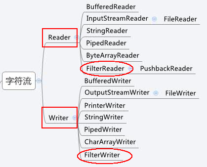

注：学习字符流前的思考？

1.为什么使用字符流？

`因为使用字节流操作汉字或者特殊符号时容易乱码，因为汉字不止一个字节，建议使用字符流。`

2.什么情况下使用字符流？

`一般可以使用记事本打开的文件，我们可以看到文件不乱吗的，就是文本文件，便可以使用字符流。而操作二进制文件，比如图片、音频、视频必须使用字节流。`

```java
// 传统字节流读取
psvm(String[] args){
  // 1. 创建FileInputStream对象
  FileInputSteam fis = new FileInputStream("路径");
  // 2. 读取
  int data = 0;
  while((data = fis.read()) != -1){
    sout((char)data); 
  }
  // 3. 关闭
  fis.close();
}
```

##### 5.1字符输入流/输出流

`reader` 字符输入流

- `public int read(){}`
- `public int read(char[] c){}`
- `public int read(char[] b, int off, int len){}`

`Writer` 字符输出流

- `public void write(int n){}`
- `public void write(String str){}`
- `public void write(char[] c){}`

==文件字符输入流==

```java
// 1. 创建FileReader 文件字符输入流
FileReader fr = new FileReader("..");
// 2. 读取
// 2.1 单个字符读取
int data = 0;
while((data = fr.read()) != -1){
  sout((char)data);// 读取一个字符
}
char[] buf = new char[2];// 字符缓冲区读取
int count = 0;
while((count = fr.read(buf) != -1)){
  sout(new String(buf, 0, count));
}
// 3. 关闭
fr.close();
```

==文件字符输出流==

```java
// 1. 创建FileWriter对象
FileWriter fw = new FileWriter("..");
// 2. 写入
for(int i = 0; i < 10; i ++){
  fw.write("写入的内容");
  fw.flush();
}
// 3. 关闭
fw.close();
sout("执行完毕");
```

##### 5.2字符缓冲流

```
BufferedReader / BufferedWriter
```

高效读写、支持输入换行符、可一次写一行读一行

###### 5.2.1BufferedReader

```java
psvm(String[] args) throws Exception{
  // 创建缓冲流
  FileReader fr = new FileReader("..");
	BufferedReader br = new BufferedReader(fr);
  // 读取
  // 1. 第一种方式
  char[] buf = new char[1024];
  int count = 0;
  while((count = br.read(buf)) != -1){
    sout(new String(buf, 0, count));
  }
  // 2. 第二种方式 一行一行读取
  String line = null;
  while((line = br.readLine()) != null){
    sout(line);
  }
  
	// 关闭
  br.close();
}
```

###### 5.2.2BufferedWriter

```java
psvm(String[] args){
  // 1. 创建BufferedWriter对象
  FileWriter fw = new FileWriter("..");
  BufferedWriter bw = new BufferedWriter(fw);
  // 2. 写入
  for(int i = 0; i < 10; i ++){
    bw.write("写入的内容");
    vw.newLine(); // 写入一个换行符
    bw.flush();
  }
  // 3. 关闭
  bw.close(); // 此时会自动关闭fw
}
```

#### 6.PrintWriter打印流

封装了`print() / println()` 方法 支持写入后换行

支持数据原样打印

```java
public static void main(String[] args){
  // 1 创建打印流
  PrintWriter pw = new PrintWriter("..");
  // 2 打印
  pw.println(12);
  pw.println(true);
  pw.println(3.14);
  pw.println('a');
  // 3 关闭
  pw.close();
}
```

#### 7.转换流

桥转换流 `InputStreamReader / OutputStreamWriter`

可将字节流转换为字符流

可设置字符的编码方式

```java
psvm(String[] args) throws Exception{
  // 1 创建InputStreamReader对象
  FileInputStream fis = new FisInputStream("..");
  InputStreamReader isr = new InputStreamReader(fis, "utf-8");
  // 2 读取文件
  int data = 0;
  while((data = isr.read()) != -1){
    sout((char)data);
  }
  // 3 关闭
  isr.close();
}
```

```java
psvm(String[] args) throws Exception{
  // 1 创建OutputStreamReader对象
  FileOutputStream fos = new FisOutputStream("..");
  OutputStreamWRITER osw = new OutputStreamReader(fos, "utf-8");
  // 2 写入
  for(int i = 0; i < 10; i ++){
    osw.write("写入内容");
    osw.flush();
  }
  // 3 关闭
  osw.close();
}
```

#### 8.File类

概念：代表物理盘符中的一个文件或者文件夹

**File 类：文件和目录路径名的抽象表示。**

**注意：File 类只能操作文件的属性，文件的内容是不能操作的。**

##### 8.1File类的使用

file类的常用方法：

　　①、**创建方法**

　　　　1.boolean createNewFile() 不存在返回true 存在返回false

　　　　2.boolean mkdir() 创建目录，如果上一级目录不存在，则会创建失败

　　　　3.boolean mkdirs() 创建多级目录，如果上一级目录不存在也会自动创建

 　　②、**删除方法**

　　　　1.boolean delete() 删除文件或目录，如果表示目录，则目录下必须为空才能删除

　　　　2.boolean deleteOnExit() 文件使用完成后删除

　　③、**判断方法**

　　　　1.boolean canExecute()判断文件是否可执行

　　　　2.boolean canRead()判断文件是否可读

　　　　3.boolean canWrite() 判断文件是否可写

　　　　4.boolean exists() 判断文件或目录是否存在

　　　　5.boolean isDirectory()  判断此路径是否为一个目录

　　　　6.boolean isFile()　　判断是否为一个文件

​    　　　7.boolean isHidden()　　判断是否为隐藏文件

　　　　8.boolean isAbsolute()判断是否是绝对路径 文件不存在也能判断

 　④、**获取方法**

　　　　1.String getName() 获取此路径表示的文件或目录名称

　　　　2.String getPath() 将此路径名转换为路径名字符串

　　　　3.String getAbsolutePath() 返回此抽象路径名的绝对形式

　　　　4.String getParent()//如果没有父目录返回null

　　　　5.long lastModified()//获取最后一次修改的时间

　　　　6.long length() 返回由此抽象路径名表示的文件的长度。

　　　　7.boolean renameTo(File f) 重命名由此抽象路径名表示的文件。

　　　　8.File[] liseRoots()//获取机器盘符

　　　　9.String[] list()  返回一个字符串数组，命名由此抽象路径名表示的目录中的文件和目录。

　　　　10.String[] list(FilenameFilter filter) 返回一个字符串数组，命名由此抽象路径名表示的目录中满足指定过滤器的文件和目录。

```java
/*
File类的使用
1. 分隔符
2. 文件操作
3. 文件夹操作
*/
public class Demo{
  psvm(String[] args){
    separator();
  }
  // 1. 分隔符
  public static void separator(){
    sout("路径分隔符" + File.pathSeparator);
    sout("名称分隔符" + File.separator);
  }
  // 2. 文件操作
  public static void fileOpen(){
    // 1. 创建文件
    if(!file.exists()){ // 是否存在
    	File file = new File("...");
    	boolean b = file.creatNewFile();
    }
    
    // 2. 删除文件
    // 2.1 直接删除
    file.delete(); // 成功true
    // 2.2 使用jvm退出时删除
    file.deleteOnExit();
    
    // 3. 获取文件信息
    sout("获取绝对路径" + file.getAbsolutePaht());
    sout("获取路径" + file.getPath());
    sout("获取文件名称" + file.getName());
    sout("获取夫目录" + file.getParent());
    sout("获取文件长度" + file.length());
    sout("文件创建时间" + new Date(file.lashModified()).toLocalString());
    
    // 4. 判断
    sout("是否可写" + file.canWrite());
    sout("是否是文件" + file.isFile());
    sout("是否隐藏" + file.isHidden());
  }
  
  
  // 文件夹操作
  public static void directoryOpe() throws Exception{
    // 1. 创建文件夹
    File dir = new File("...");
    sout(dir.toString());
    if(!dir.exists()){
      //dir.mkdir(); // 只能创建单级目录
      dir.mkdirs(); // 创建多级目录
    }
    
    // 2. 删除文件夹
    // 2.1 直接删除
    dir.delete(); // 只能删除最底层空目录
    // 2.2 使用jvm删除
    dir.deleteOnExit();
    
    // 3. 获取文件夹信息
 		sout("获取绝对路径" + dir.getAbsolutePaht());
    sout("获取路径" + dir.getPath());
    sout("获取文件名称" + dir.getName());
    sout("获取夫目录" + dir.getParent());
    sout("获取文件长度" + dir.length());
    sout("文件夹创建时间" + new Date(dir.lashModified()).toLocalString());
    
    // 4. 判断
    sout("是否是文件夹" + dir.isFile());
    sout("是否隐藏" + dir.isHidden());
    
    // 5. 遍历文件夹
    File dir2 = new File("...");
    String[] files = dir2.list();
    for(String string : files){
      sout(string);
    }
    
    // FileFilter接口的使用
    
    File[] files2 = dir2.listFiles(new FileFilter(){
      
      @Override
      public boolean accept(File pathname){
        if(pathname.getName().endsWith(".jpg")){
          return true;
        }
        return false;
      }
    });
    for(File file : files2){
      sout(file.getName());
    }
    
  }
}
```

##### 8.2递归遍历文件夹

```java
psvm(String[] args){
  listDir(new File("d:\\myfiles"));
}
public static void listDir(File dir){
  File[] files = dir.listFiles();
  sout(dir.getAbsolutePath());
  if(files != null && files.length > 0){
    for(File file : files){
      if(file.isDirectory()){
        listDir(file); // 递归
      }else {
        sout(file.getAbsolutePath());
      }
    }
  }
}
```

##### 8.3递归删除文件夹

```java
public static void deleteDir(File dir){
  File[] files = dir.listFiles();
  if(files != null && files.length > 0){
    for(File file : files){
      if(file.idDirectory()){
        deleteDir(file); // 递归
      }else{
        // 删除文件
        sout(file.getAbsolutePath() + "删除" + file.delete());
      }
    }
  }
}
```

#### 9.编码方式

# N.Java高级特性

### 1.注解与反射

注解与反射笔记博客：https://blog.csdn.net/qq_42449963/article/details/109406428

#### 1.1注解Annotation

##### 1.1.1什么是注解

1. Annotation是从JDK5.0开始引入的新技术

2. Annotation的作用：

   - 可以对程序作出解释，这一点和注释comment类似

   - 对程序进行检查和约束，例如@Override

   - 可以被其他程序（比如：编译器等）读取

3. Annotation的格式：

   注解是以“@注释名”在代码中存在的，还可以添加一些参数值，例如：SuppressWarning(value=”unchecked”)

4. Annotation在哪里使用？

   可以附加在package、class、method、field等上面，相等于给他们添加了额外的辅助信息，然后结合反射机制实现对这些元数据的访问

##### 1.1.2内置注解

1. **@Override**：定义在java.lang包中，此注解只适用于修饰方法，表示该方法打算重写父类中的同名方法，并且具有检查作用

2. **@Deprecated**：定义在java.lang包中，此注释可以修饰方法、属性、类，注释@Deprecated的程序元素是程序员不鼓励使用的程序元素，通常是因为它是危险的，或者因为它已经过时了，然后存在更好的替代方法，但是你使用也没有任何影响

3. **@SupressWarnings**：定义在java.lang包中，用来抑制编译时产生的黄色警告信息，虽然这些警告信息不会影响编译结果，但是看着不舒服，然后该注释和前两个注释有所不同，你需要添加一个参数才能正确使用，这些参数都是已经定义好了的，具体参数信息如下所示：
   @SuppressWarnings(“all”) // 压制所有警告，下面有例子：
   @SuppressWarnings(“unchecked”) // 压制"unchecked"警告
   @SuppressWarnings(value={“unchecked”, “deprecation”}) // 压制"unchecked", "deprecation"警告

   **注意：**==public @interface SuppressWarnings {String[] value();}，==其中value是参数名，而String[]是参数是类型，当注解只使用value这一个参数的时候，value可以省略，例如上面的@SuppressWarnings("all")和@SuppressWarnings("unchecked")就是省略了前面的value，但是仅限参数名是value，并且注解中只使用value这一个参数的情况才可以 省略value

##### 1.1.3元注解

1.1.3.1什么是元注解？

​	负责注解其他注解，Java中定义了4个标准的元注解（）类型，他们被用来对其他注解类型进行解释说明限制

1. 元注解的位置：在java.lang.annotation包中
2. 元注解四大类型
   - @Target：用于描述注解的使用范围，也就是描述注解可以使用在什么地方，public @interface Target {ElementType[] value();}可以看出可以它是一个数组，可以有多个值，里面的值设置的都是定义的注解MyAnnotation的使用范围，比如在类上、方法上等等，你可以通过@Target，然后点击里面的ElementType去查看
   - @Retention：表示需要在什么级别保存该注释信息，用于描述注解的生命周期（SOURCE < CLASS < RUNTIME），SOURCE是源码级别，CLASS 是源码级别和编译之后的字节码文件中有效，RUNTIME是在源码级别、编译之后的字节码文件、JVM中运行都有效，最常用的就是RUNTIME
   - @Documentd：说明该注解将被包含在javadoc文档中
   - @Inherited：说明子类可以继承父类中的该注解

##### 1.1.4自定义注解

```java
@Target({ElementType.TYPE,ElementType.METHOD})
@Retention(RetentionPolicy.RUNTIME)
public @interface MyAnnotation {
    String name() default "";
}
```

- 使用@interface自定义注解时，自动继承了java.lang.annotation.Annotation接口
- @interface 用来声明一个注解，格式是：修饰符 @interface 注解名{定义内容}
  - 内容中的每一个方法实际上是声明了一个配置参数，方法的名称就是参数的名称，方法的返回值类型就是参数的类型
  - 返回值类型只能是基本类型、Class、String、enum，如果返回值是String[]的时候，赋值的时候要用{“X1”, “X2”}这种形式；
  - 参数的格式：数据类型 参数名 （）；
    - 可以通过default来声明参数的默认值，声明默认值的可以不在自定义注解中赋值，反之必须赋值
  - 如果只有一个参数成员，一般参数名使用value字段，这是因为当参数名称是value并且自定义注解中只需要写一个参数的时候，可以省略参数名称，只有value可以这样，其他的都不行
  - 注解元素必须有值，我们定义注解元素时，经常使用空字符串、0、-1等作为默认值，当默认值为-1，代表不存在

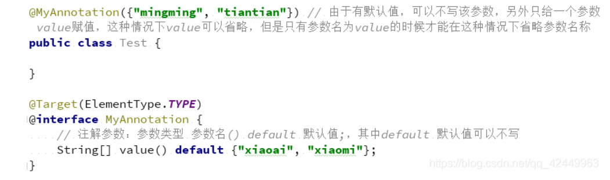

#### 1.2反射

##### 1.2.1反射机制的概述

###### 1.2.1.1静态语言和动态语言 

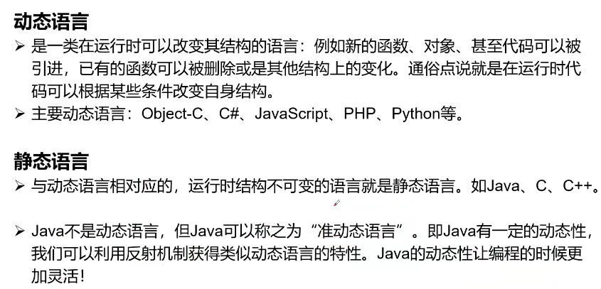

###### 1.2.1.2Java Reflection

1. Reflection（反射）是java被视为动态语言的关键，反射机制允许程序借助Reflection API获取任何类的内部信息，并能直接操作任意对象的内部属性和方法。

```JAVA
Class c = Class.forName("java.lang.String");//此语句可能会抛出一个ClassNotFoundException的异常
```

2. 反射与类的加载

   - 加载完类之后，在堆内存的方法区（JDK1.8版本之后==转移到元空间==）就产生了一个Class类型的对象，且一个类只有一个Class对象，这个Class对象包含了完整的类的结构信息。我们可以通过这个对象看到类的结构。==个人+UP主理解：这个独一无二的Class对象便是类和类的实例中间的镜子，用以完整反射两者的信息，因此才被称为 反射==

     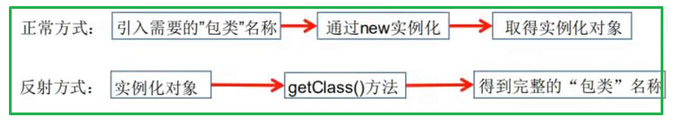

3. java反射机制研究及应用

   1. 在运行时判断任意一个对象所属的类
   2. 在运行时构造任意一个类的对象
   3. 在运行时判断任意一个类所具有的成员变量和方法
   4. 在运行时获取泛型信息
   5. 在运行时调用任意一个对象的成员变量和方法
   6. 在运行时处理注解
   7. 生成动态代理
   8. ···

4. java反射的优点和缺点

   1. 优点：可以实现动态创建对象和编译，体现出很大的灵活性。
   2. 缺点：对性能有影响，使用反射基本上是一种解释操作，我们可以告诉JVM我们希望做什么，并且JVM需要满足我们的要求，这类操作总是慢于直接去操作。

5. 反射相关的API

   1. java.lang.Class
   2. java.lang.reflect.Method
   3. java.reflect.Field
   4. java.lang.reflect.Constructor

   ```java
   package com.nty.reflection;
   
   //什么叫反射
   public class Test01 {
       public static void main(String[] args) throws ClassNotFoundException {
   
           //通过反射获取类的class对象
           Class aClass = Class.forName("com.nty.reflection.User");
   
           System.out.println(aClass);//结果：class com.nty.reflection.User
   
           System.out.println(aClass.getClass());//结果：class java.lang.Class
   
           //结论：一个类在内存中只有一个Class对象
           //一个类被加载后，类的整个结构都会被封装在Class对象中
           Class c2 = Class.forName("com.nty.reflection.User");
           Class c3 = Class.forName("com.nty.reflection.User");
           Class c4 = Class.forName("com.nty.reflection.User");
   
           System.out.println("c2:" + c2.hashCode());
           System.out.println("c3:" + c3.hashCode());
           System.out.println("c3:" + c3.hashCode());
           
           /*结果：
           c2:460141958
           c3:460141958
           c3:460141958
           */
   
       }
   }
   
   //实体类
   class User {
       private String name;
       private int id;
       private int age;
   
       public User() {
       }
   
       public User(String name, int id, int age) {
           this.name = name;
           this.id = id;
           this.age = age;
       }
   
       public String getName() {
           return name;
       }
   
       public void setName(String name) {
           this.name = name;
       }
   
       public int getId() {
           return id;
       }
   
       public void setId(int id) {
           this.id = id;
       }
   
       public int getAge() {
           return age;
       }
   
       public void setAge(int age) {
           this.age = age;
       }
   
       @Override
       public String toString() {
           return "User{" +
                   "name='" + name + '\'' +
                   ", id=" + id +
                   ", age=" + age +
                   '}';
       }
   }
   ```

##### 1.2.2理解Class类并获取Class实例

1. ###### Class类

   在Object类中定义了一下的方法，此方法将被所有的子类继承

   ​	`public final Class getClass();`

   以上的方法返回值的类型是一个Class类，此类是Java反射的源头，实际上所谓反射从程序的运行结果来看也很好理解，

   即:可以通过对象反射求出类的名称。

   对象照镜子后可以得到的信息:某个类的属性、方法和构造器、某个类到底实现了哪些接口。

   对于每个类而言，JRE都为其保留一个**不变的Class类型的对象**。一个Class对象包含了特定某个结构**(class/interface/enum/annotation/primitive type/void/[])**的有关信息。

   

   Class本身自己也是一个类。其中需要注意的点：

   - Class对象只能由系统创建
   - 一个加载在JVM中的类只有一个Class类的实例对象
   - 一个Class对象对应着一个加载到JVM中的.class文件
   - 每个类的实例都会自己记着是哪个Class实例所生成
   - 通过Class可以完整地得到一个类中的所有被加载的结构
   - Class类是Reflection的根源，想要动态加载运行中的类，前提是获得相应的Class对象

   

2. ###### Class类的常用方法

   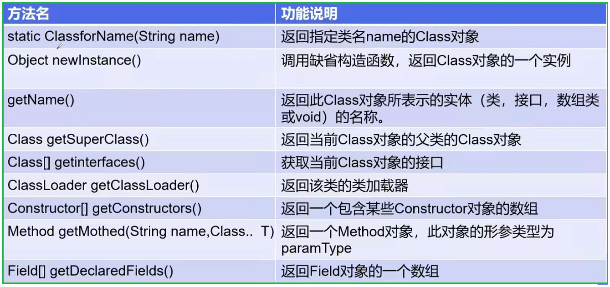

3. ###### 获取Class类的实例

   1. 若已知具体的类，可以通过类的class属性获取，该方法最为安全可靠，程序性能最高

      `Class clazz = Person.class;`

   2. 若已知具体的类，可以通过类的getClass（）方法获取

      `Class clazz  = person.getClass();`

   3. 已知一个类的全类名，且该类在类路径下，可以通过Class类的静态方法forName()获取，可能抛出ClassNotFoundException

      `Class clazz = Class.forName("com.roc.SuperMaster.Person");`

   4. 内置基本数据类型可以直接用类名.Type

   5. 利用ClassLoader

   ```java
   package com.nty.reflection;
   
   public class Test04 {
       public static void main(String[] args) throws ClassNotFoundException {
           Person person = new Student();
           System.out.println("这个人是：" + person.name);//这个人是：学生
   
           //方式一：通过对象获得
           Class c1 = person.getClass();
           System.out.println(c1.hashCode());//21685669
   
           //方式二：ClassForName获得
           Class c2 = Class.forName("com.nty.reflection.Student");
           System.out.println(c2.hashCode());//21685669
   
           //通过类名.class
           Class c3 = Student.class;
           System.out.println(c3.hashCode());//21685669
   
           //方式四：基本内置类型的包装类都有一个Type属性
           Class<Integer> c4 = Integer.TYPE;
           System.out.println(c4);//int
   
           //获得父类类型
           Class c5 = c1.getSuperclass();
           System.out.println(c5);//class com.nty.reflection.Person
   
       }
   }
   
   class Person {
       public String name;
   
       public Person() {
       }
   
       public Person(String name) {
           this.name = name;
       }
   }
   
   class Student extends Person {
       public Student() {
           this.name = "学生";
       }
   }
   
   class Teacher extends Person {
       public Teacher() {
           this.name = "老师";
       }
   }
   ```

4. ###### 哪些类型可以用Class对象？

   1. Class：外部类，成员类，局部内部类，匿名内部类
   2. interface：接口
   3. []：一维数组
   4. [] []:二维数组
   5. enum：枚举
   6. annotation：注解
   7. primitive type：基本数据类型
   8. void

   ```java
   package com.nty.reflection;
   
   import java.lang.annotation.ElementType;
   
   //所有类型的class
   public class Test02 {
       public static void main(String[] args) {
           Class c1 = Object.class;//类  class java.lang.Object
           Class c2 = String[].class;//一维数组  class [Ljava.lang.String;
           Class c3 = int[][].class;//二维数组  class [[I
           Class c4 = Comparable.class;//接口  interface java.lang.Comparable
           Class c5 = Override.class;//注解  interface java.lang.Override
           Class c6 = Integer.class;//基本数据类型  class java.lang.Integer
           Class c7 = void.class;//void  void
           Class c8 = Class.class;//Class本身   class java.lang.Class
           Class c9 = ElementType.class;//枚举  class java.lang.annotation.ElementType
   
           System.out.println(c1);
           System.out.println(c2);
           System.out.println(c3);
           System.out.println(c4);
           System.out.println(c5);
           System.out.println(c6);
           System.out.println(c7);
           System.out.println(c8);
           System.out.println(c9);
   
           //只要元素类型与维度一样，class类型就一样
   
           int[] a = new int[10];
           int[] b = new int[100];
           System.out.println(a.getClass().hashCode());     //460141958
           System.out.println(b.getClass().hashCode());     //460141958
   
   
       }
   }
   ```

##### 1.2.3类的加载与ClassLoader

###### 1.类的加载过程

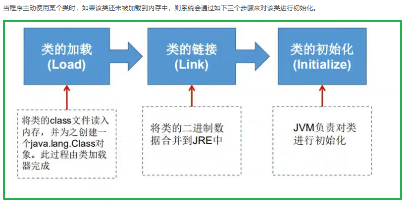

###### 2.类加载与ClassLoader的理解

- 1.加载：将.class文件字节码内容加载到内存中，并将这些静态数据转换成方法区（JDK1.8之后调整至元空间）的运行时数据结构,然后生成一个代表这个类的java.lang.Class对象.

- 2.链接:

  将Java类的二进制代码合并到JVM的运行状态之中的过程。

  - 验证:确保加载的类信息符合JVM规范，没有安全方面的问题
  - 准备:正式为类变量(static) 分配内存并设置类变量默认初始值的阶段，这些内存都将在方法区中进行分配
  - 解析:虚拟机常量池内的符号引用(常量名)替换为直接引用(地址)的过程

- 3.初始化:

  - 执行类构造器<clinit> ()方法的过程，类构造器< clinit> ()方法是由编译期自动收集类中所有类变量的赋值动作和静态代码块中的语句合并产生的。(类构造 器是构造类信息的，不是构造该类对象的构造器)。
  - 当初始化一个类的时候，如果发现其父类还没有进行初始化，则需要先触发其父类的初始化。
  - 虚拟机会保证一个类的< clinit> ()方法在多线程环境中被正确加锁和同步。

###### 3.什么时候发生类初始化

```tcl
1. 类的主动引用一定会发生类的初始化
 - 当虚拟机启动，**先初始化main方法所在的类**
 - new一个类的对象
 - 调用类的静态成员(除了final常量)和静态方法
 - 使用java.lang.reflect包的方法对类进行反射调用
 - 当初始化一个类，如果其父类没有被初始化，则先会初始化它的父类
2. 类的被动引用，不会发生类的初始化
 - 当访问一个静态域时，只有真正声明这个域的类才会被初始化。如:当通过**子类引用父类的静态变量，不会导致子类初始化**
 - 通过**数组定义类引用，不会触发此类的初始化**
 - **引用常量不会触发此类的初始化**(常量在链接阶段就存入调用类的常量池中了)
```

```java
package com.nty.reflection;

//测试类什么时候会初始化
public class Test05 {
    static {
        System.out.println("main 类被加载");
    }

    public static void main(String[] args) throws ClassNotFoundException {
        
        //1、主动引用
        //Son son = new Son();

        //2、通过反射产生主动引用
        Class.forName("com.nty.reflection.Son");
    }

}

class Father {

    static int b = 2;

    static {
        System.out.println("父类被初始化");
    }
}

class Son extends Father {
    static {
        System.out.println("子类被加载");
        m = 300;
    }

    static int m = 100;
    static final int M = 1;
}


/*
* main 类被加载
父类被初始化
子类被加载
* */
```

###### 4.类加载器的作用

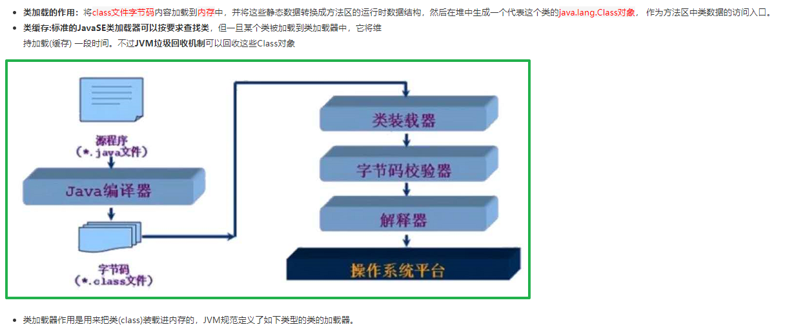

###### 5.类加载器及双亲委派机制

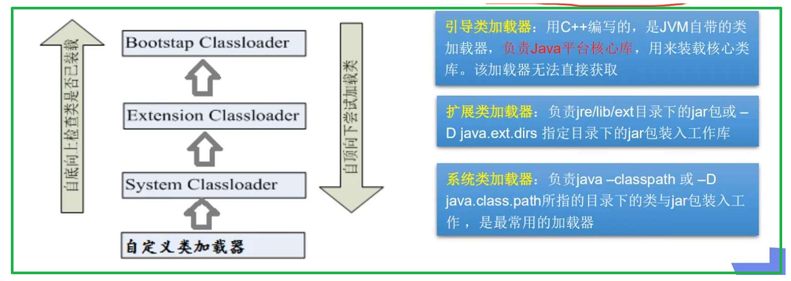

##### 1.2.4获取运行时类的完整结构

###### 1.通过反射获得运行时类的完整结构

1. 全部的Filed
2. 继承的父类
3. 全部的构造器
4. 实现的全部接口
5. 注解
6. 全部的方法
7. ···

```java
package com.nty.reflection;

import java.lang.reflect.Constructor;
import java.lang.reflect.Field;
import java.lang.reflect.Method;

public class Test07 {

    public static void main(String[] args) throws ClassNotFoundException, NoSuchFieldException, NoSuchMethodException {
        Class c1 = Class.forName("com.nty.reflection.User");

        /*
         User user = new User();
         c1 = user.getClass();
         */

        //1、获得类的名字--->获得包名+类名
        System.out.println(c1.getName());//com.nty.reflection.User

        //2、获得类的简单名字-->获得类名
        System.out.println(c1.getSimpleName());//User

        System.out.println("=======================");

        //3、获得类的属性
        //3.1 获得public的属性
        Field[] fields = c1.getFields();//只能找到public的属性

        //3.2  能够找到所有的属性
        Field[] fields1 = c1.getDeclaredFields();
        for (Field field : fields1) {
            System.out.println(field);
        }

        /**
         * private java.lang.String com.nty.reflection.User.name
         * private int com.nty.reflection.User.id
         * private int com.nty.reflection.User.age
         * private java.lang.String com.nty.reflection.User.name
         */

        //3.3、获得指定的属性
        Field name = c1.getDeclaredField("name");
        System.out.println(name);//private java.lang.String com.nty.reflection.User.name

        //4、获得类的方法
        System.out.println("====================================");
        Method[] methods = c1.getMethods();//获得本类及其父类的全部public方法
        for (Method method : methods) {
            System.out.println("c1.getMethods():" + method);
        }
        Method[] methods1 = c1.getDeclaredMethods();//获得本类的全部方法
        for (Method method : methods1) {
            System.out.println("c1.getDeclaredMethods():" + method);
        }
        //获取指定的方法   重载，所以要添加参数
        Method getName = c1.getMethod("getName", null);
        System.out.println(getName);//public java.lang.String com.nty.reflection.User.getName()
        Method setName = c1.getMethod("setName", String.class);
        System.out.println(setName);//public void com.nty.reflection.User.setName(java.lang.String)

        //5、获取指定的构造器
        System.out.println("=================================");
        Constructor[] constructors = c1.getConstructors();//获取public
        for (Constructor constructor : constructors) {
            System.out.println("c1.getConstructors():" + constructor);
        }
        Constructor[] constructors1 = c1.getDeclaredConstructors();//获取所有的构造器
        for (Constructor constructor : constructors1) {
            System.out.println("c1.getDeclaredConstructors():" + constructor);
        }

        //获取指定的构造器
        Constructor declaredConstructor = c1.getDeclaredConstructor(String.class, int.class, int.class);
        System.out.println("获取指定的构造器" + declaredConstructor);
        //获取指定的构造器public com.nty.reflection.User(java.lang.String,int,int)
    }
}
```

##### 1.2.5创建运行时类的对象+调用运行时类的指定结构

###### 1.创建类的对象

有了Class的对象可以创建类的对象，准确是运行时的类对象，此时类已全部加载，并且运行时环境也已经开辟好。

创建类的对象：调用CLass对象的newInstance()方法

- 需要原始类有一个无参构造器
- 类的构造器的访问权限足够

步骤：

- 1.通过Class类的getDeclaredConstructor(Class ... parameterTypes)取得本类的指定形参类型的构造器
- 2.向构造器的形参中传递一个对象数组进去， 里面包含了构造器中所需的各个参数。
- 3.通过Constructor实例化对象

###### 2.调用运行时类的指定结构

指定结构：方法，属性

1. 调用指定的方法invoke()

   - 通过反射，调用类中的方法，通过Method类完成。
   - ①通过Class类的getMethod(String name,Clas..parameterTypes)方法取得一个Method对象，并设置此方法操作时所需要的参数类型。
   - ②之后使用Object invoke(Object obj, Object[] args)进行调用，并向方法中传递要设置的obj对象的参数信息。

   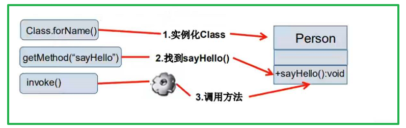

   - Object invoke(Object obj, Object ... args)
     - Object 对应原方法的返回值,若原方法无返回值，此时返回null)
     - 若原方法若为静态方法，此时形参9bject gbj可为null
     - 若原方法形参列表为空，则Object[] args为null
     - 若原方法声明为**private**，则需要在调用此invoke()方法前，显式调用方法对象的setAccessible(true)方法，将可访问private的方法。

2. 调用指定的属性

   - setAccessible().
     - ➢Method和Field、Constructor对象都有 setAccessible()方法
     - ➢setAccessible作用是启动和禁用访问安全检查的开关
     - ➢参数值为true则指示反射的对象在使用时应该取消**Java语言访问检查**
     - ➢提高反射的效率。如果代码中必须用反射，而该句代码需要频繁的被调用，那么请设置为true
     - ➢使得原本无法访问的私有成员也可以访问
     - ➢参数值为false则指示反射的对象应该实施Java语言访问检查

   ```java
   package com.nty.reflection;
   
   import java.lang.reflect.Constructor;
   import java.lang.reflect.Field;
   import java.lang.reflect.InvocationTargetException;
   import java.lang.reflect.Method;
   
   public class Test08 {
       public static void main(String[] args) throws ClassNotFoundException, IllegalAccessException, InstantiationException, NoSuchMethodException, InvocationTargetException, NoSuchFieldException, InvocationTargetException {
           //获得Class对象
           Class c1 = Class.forName("com.nty.reflection.User");
   
           //1、创建对象：
           //1.1 通过newInstance（）构造一个对象
           User user1 = (User) c1.newInstance();//实质上是调用的无参构造
           System.out.println(user1);//User{name='null', id=0, age=0}
   
           //1.2 通过构造器创建
           Constructor constructor = c1.getDeclaredConstructor(String.class, int.class, int.class);
           User user2 = (User) constructor.newInstance("nty", 001, 18);
           System.out.println(user2);//User{name='nty', id=1, age=18}
   
           //2、通过反射调用普通方法
           System.out.println("=============================================");
           //创建一个对象
           User user3 = (User) c1.newInstance();
           //通过反射获取一个方法
           Method setName = c1.getDeclaredMethod("setName", String.class);
           //invoke：激活 、唤醒
           //参数（对象，"方法的值"）
           setName.invoke(user3, "China");
           System.out.println(user3.getName());//China
   
           //3、通过反射操作属性
           System.out.println("=============================================");
           User user4 = (User) c1.newInstance();
           Field name = c1.getDeclaredField("name");
   
           //不能直接操作私有属性，我们需要关闭程序的安全监测，通过：name.setAccessible(true);
           name.setAccessible(true);
           name.set(user4, "nty");
           System.out.println(user4.getName());//nty
       }
   }
   ```

##### 1.2.6反射机制的性能问题

例：一个方法执行10亿次需要的时间，分别使用普通方法、反射及关闭程序监测的反射实现，然后进行对比。

结果：反射>普通>关闭监测

```java
package com.nty.reflection;

import java.lang.reflect.InvocationTargetException;
import java.lang.reflect.Method;

public class Test09 {
    public static void main(String[] args) throws NoSuchMethodException, IllegalAccessException, InvocationTargetException {
        test01();
        test02();
        test03();
    }

    //普通方法调用
    public static void test01() {
        User user = new User();
        long start_time = System.currentTimeMillis();
        for (int i = 0; i < 1000000000; i++) {
            user.getName();
        }
        long end_time = System.currentTimeMillis();
        System.out.println("普通方式执行10亿次需要：" + (end_time - start_time) + "ms");
    }

    //反射方式调用
    public static void test02() throws NoSuchMethodException, InvocationTargetException, IllegalAccessException {
        User user = new User();
        Class c1 = user.getClass();
        Method getName = c1.getMethod("getName", null);
        getName.invoke(user, null);
        long start_time = System.currentTimeMillis();
        for (int i = 0; i < 1000000000; i++) {
            user.getName();
        }
        long end_time = System.currentTimeMillis();
        System.out.println("反射方式调用执行10亿次需要：" + (end_time - start_time) + "ms");
    }


    //反射方式调用，关闭安全监测
    public static void test03() throws NoSuchMethodException, IllegalAccessException, InvocationTargetException {
        User user = new User();
        Class c1 = user.getClass();
        Method getName = c1.getMethod("getName", null);
        getName.setAccessible(true);
        getName.invoke(user, null);
        long start_time = System.currentTimeMillis();
        for (int i = 0; i < 1000000000; i++) {
            user.getName();
        }
        long end_time = System.currentTimeMillis();
        System.out.println("反射方式调用，关闭安全监测调用执行10亿次需要：" + (end_time - start_time) + "ms");
    }

    /*
     *普通方式执行10亿次需要：7ms
     *反射方式调用执行10亿次需要：6ms
     *反射方式调用，关闭安全监测调用执行10亿次需要：7ms
     */
}
```

##### 1.2.7获取泛型信息

- Java采用泛型擦除的机制来引入泛型，Java中的泛型仅仅是给编译器javac使用的，确保数据的安全性和免去强制类型转换问题，但是，一旦编译完成，所有和泛型有关的类型全部擦除
- 为了通过反射操作这些类型， Java新增了ParameterizedType, GenericArrayType，TypeVariable和WildcardType几种类型来代表不能被归一到Class类中的类型但是又和原始类型齐名的类型
- ParameterizedType：表示一种参数化类型,比如Collection
- GenericArrayType：表示一种元素类型是参数化类型或者类型变量的数组类型
- TypeVariable：是各种类型变量的公共父接口
- WildcardType：代表一种通配符类型表达式

```java
package com.nty.reflection;

import java.lang.reflect.Method;
import java.lang.reflect.ParameterizedType;
import java.lang.reflect.Type;
import java.util.List;
import java.util.Map;

//通过反射获取泛型信息
public class Test10 {

    public void test01(Map<String, User> map, List<User> list) {
        System.out.println("test01");
    }

    public Map<String, User> test02() {
        System.out.println("test02");
        return null;
    }

    public static void main(String[] args) throws NoSuchMethodException {
        Method method = Test10.class.getMethod("test01", Map.class, List.class);

        //getGenericParameterTypes():获得泛型的参数类型
        Type[] genericParameterTypes = method.getGenericParameterTypes();

        for (Type genericParameterType : genericParameterTypes) {
            System.out.println(genericParameterType);//Java.JavaBase.Collections.HashMapTest.Map<java.lang.String, kuangshen.reflection.User>
            // 判断genericParameterType是否等于ParameterizedType（结构化参数类型）
            if (genericParameterType instanceof ParameterizedType) {
                //getActualTypeArguments()：获得真实的参数信息
                Type[] actualTypeArguments = ((ParameterizedType) genericParameterType).getActualTypeArguments();
                for (Type actualTypeArgument : actualTypeArguments) {
                    System.out.println(actualTypeArgument);
                }
            }
        }

        System.out.println("===============test02====================");
        method = Test10.class.getMethod("test02", null);
        Type genericReturnType = method.getGenericReturnType();
        if (genericReturnType instanceof ParameterizedType) {
            //getActualTypeArguments()：获得真实的参数信息
            Type[] actualTypeArguments = ((ParameterizedType) genericReturnType).getActualTypeArguments();
            for (Type actualTypeArgument : actualTypeArguments) {
                System.out.println(actualTypeArgument);
            }
        }
    }
}

/*
 * java.util.Map<java.lang.String, com.nty.reflection.User>
 * class java.lang.String
 * class com.nty.reflection.User
 * java.util.List<com.nty.reflection.User>
 * class com.nty.reflection.User
 * ===============test02====================
 * class java.lang.String
 * class com.nty.reflection.User
 */
```

##### 1.2.8获取注解信息

- getAnnotations()
- getAnnotation()

```java
package com.nty.reflection;

import java.lang.annotation.*;
import java.lang.reflect.Field;

//练习反射操作注解
public class Test11 {

    public static void main(String[] args) throws ClassNotFoundException, NoSuchFieldException {

        Class c1 = Class.forName("com.nty.reflection.Student2");

        //通过反射获取注解
        Annotation[] annotations = c1.getAnnotations();
        for (Annotation annotation : annotations) {
            System.out.println(annotation);//
        }

        //获得注解value的值
        TestAnno testAnno = (TestAnno) c1.getAnnotation(TestAnno.class);
        System.out.println(testAnno.value());//db_student

        System.out.println("================================");
        //获得类指定的注解
        Field f = c1.getDeclaredField("name");
        FieldAnno annotation = f.getAnnotation(FieldAnno.class);
        System.out.println(annotation.columnName());//db_name
        System.out.println(annotation.type());//varchar
        System.out.println(annotation.length());//10
    }
}

@TestAnno("db_student")
class Student2 {
    @FieldAnno(columnName = "db_id", type = "int", length = 10)
    private int id;
    @FieldAnno(columnName = "db_name", type = "varchar", length = 10)
    private String name;
    @FieldAnno(columnName = "db_age", type = "int", length = 10)
    private int age;

    public Student2() {
    }

    public Student2(int id, String name, int age) {
        this.id = id;
        this.name = name;
        this.age = age;
    }

    public int getId() {
        return id;
    }

    public void setId(int id) {
        this.id = id;
    }

    public String getName() {
        return name;
    }

    public void setName(String name) {
        this.name = name;
    }

    public int getAge() {
        return age;
    }

    public void setAge(int age) {
        this.age = age;
    }

    @Override
    public String toString() {
        return "Student2{" +
                "id=" + id +
                ", name='" + name + '\'' +
                ", age=" + age +
                '}';
    }
}

//创建一个注解
@Target(ElementType.TYPE)//类上使用
@Retention(RetentionPolicy.RUNTIME)
        //Retention：表示我们的注解在什么地方有效
@interface TestAnno {
    String value();

}

//属性的注解
@Target(ElementType.FIELD)//类上使用
@Retention(RetentionPolicy.RUNTIME)
@interface FieldAnno {
    String columnName();

    String type();

    int length();
}
```

### 2.java网络编程

#### 2.1计算机网络基本知识

​	计算机网络是指将地理位置不同的具有独立功能的多台计算机及其外部设备，通过通信线路连接（有线性、无线）起来，在网络操作系统，网络管理软件及网络通信协议的管理和协调下，实现资源共享和信息传递的计算机系统。

#### 2.2通信协议

##### 1.TCP/IP协议簇

###### 1.1TCP与UDP

TCP：用户传输协议

UDP：用户数据报协议

两者之间的对比
TCP：连接稳定，两者需要建立确定的连接

UDP：发短信：不确定连接，不稳定：客户端与服务端没有明确的界限：恶意攻击DDOS


表示层：用来解码不同的格式为机器语言，以及其他功能。

会话层：判断是否需要网络传输。

传输层：识别端口来指定服务器，如指定80端口的www服务。

网络层：提供逻辑地址选路，即发送ip地址到接收的ip地址。

数据链路层：成帧，识别MAC地址来访问媒介，如交换机的功能。

物理层：设备之间的比特流传输。

##### 2.TCP/IP模型和OSI模型

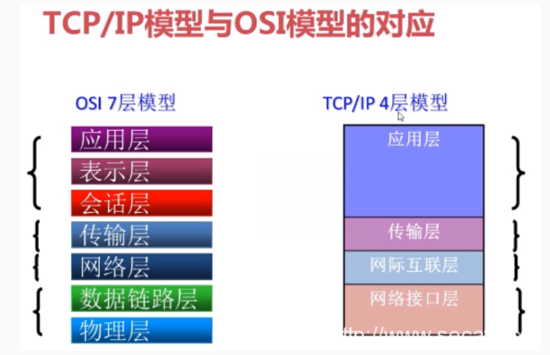


##### 3.TCP/IP模型的经典问题：三次握手与四次分手

参考链接：[“三次握手，四次挥手”这么讲，保证你忘不了_三分恶的博客-CSDN博客](https://fighter3.blog.csdn.net/article/details/117205064)

###### 3.1三次握手和四次分手

简单形象化：

```java
三次握手
    A：你瞅啥？
    B：瞅你咋地？
    A：干一架。
    
四次分手：
    A：我要分手。
    B：你真的要走了吗？
    B：你真的真的要走了吗？
    A：我真的要走了。
```

1. 三次握手

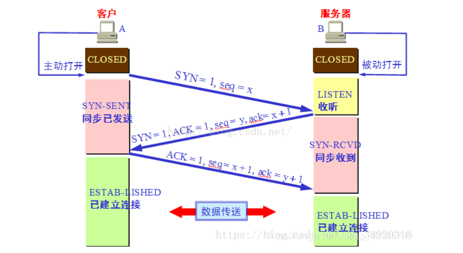

​		第一次握手：建立连接时，客户端发送syn包（syn=j）到服务器，并进入SYN_SENT状态，等待服务器确认；SYN：同步序列编号（Synchronize Sequence Numbers）。

  第二次握手：服务器收到syn包，必须确认客户的SYN（ack=j+1），同时自己也发送一个SYN包（syn=k），即SYN+ACK包，此时服务器进入SYN_RECV状态；

  第三次握手：客户端收到服务器的SYN+ACK包，向服务器发送确认包ACK(ack=k+1），此包发送完毕，客户端和服务器进入ESTABLISHED（TCP连接成功）状态，完成三次握手。

2. 四次分手

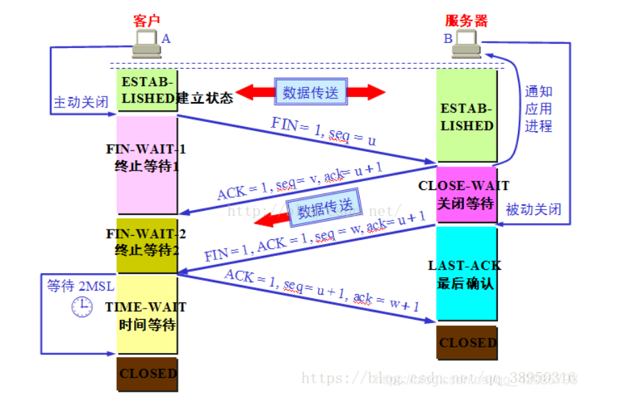

###### 3.2两军问题


##### 4.数据封装过程

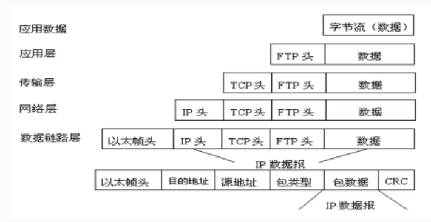

##### 5.IP包头

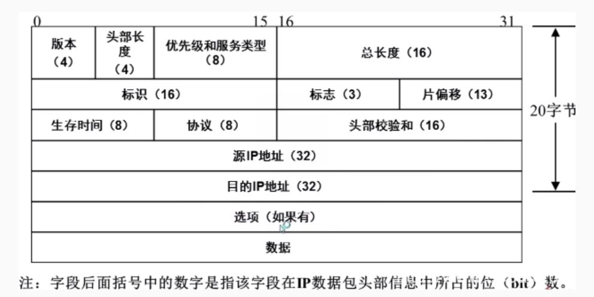

因为多了一个选项，所以包头不一定是20个字节，每接收一个数据都要检测这个包头字节多少，比较浪费资源，所以IPV6采用了固定包头。

#### 2.3IP地址

##### 2.3.1网络编程的前提

- 确定对方的**IP地址**
- 确定对方的**端口Port**

例如：192.168.0.0:8080，通过ip和端口号便可定位一个具体的位置（可以错略理解为具有地理位置的程序）

##### 2.3.2IP

IP：网络互联协议

###### 1.IP作用

唯一定位一台网络上的主机

###### 2.IP分类

1. IPV4/IPV6
2. 公网/私网

###### 3.java InetAdress类

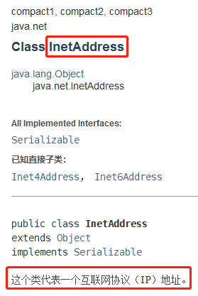

```java
常用方法：
    查询本机的IP地址
    查询目标网站的IP地址
```

注：CMD命令获得本机IP的相关信息：ipconfig

```java
public class TestInetAddress {
    public static void main(String[] args) throws Exception {
        //查询本机的ip地址
        InetAddress localhost = InetAddress.getByName("localhost");
        System.out.println(localhost);

        InetAddress localHost = InetAddress.getLocalHost();
        System.out.println(localHost);
        System.out.println("=================");
        //查询网站ip地址
        InetAddress name = InetAddress.getByName("www.baidu.com");
        System.out.println(name);
        System.out.println("=================");
        //常用方法
        //System.out.println(name.getAddress());
        System.out.println(name.getHostAddress());//获取主机ip地址
        System.out.println(name.getHostName());// 获取域名
        System.out.println(name.getCanonicalHostName());//获取规范的主机ip地址
    }
}
```

#### 2.4端口Port

1. 端口表示计算机上的一个程序的进程。
2. 端口的范围：0-65535
3. TCP与UDP分别有65535*2，单个协议下，每个端口号不可重复。
4. 端口分类
   1. 常见协议端口
      1. HTTP：80
      2. HTTPS：443
      3. FTP：21
   2. 常见程序注册接口
      1. Tomcat：8080
      2. MySql：3306
      3. Oracle：1521
5. CMD命令查看相应端口信息
   1. `netstat -ano :查询所有端口信息`
   2. `netstat -ano |findstr "8080" :查询指定的接口`
   3. `tasklist | findstr "8080" ：查看指定端口的进程`
   4. `taskkill -pid 1680 -f：解除1680进程的端口占用`

```java
public class TesyInetSocketAddress {
    public static void main(String[] args) {

        InetSocketAddress socketAddress = new InetSocketAddress("127.0.0.1", 8080);
        InetSocketAddress socketAddress1 = new InetSocketAddress("localhost", 8080);

        System.out.println(socketAddress);
        System.out.println(socketAddress1);
        System.out.println("====================");

        System.out.println(socketAddress.getAddress());//ip地址
        System.out.println(socketAddress.getHostName());//主机名称
        System.out.println(socketAddress.getHostString());
        System.out.println(socketAddress.getPort());//端口
        
    }
}
```

#### 2.5TCP实现聊天

**实现思路：**聊天需要IP地址和聊天信息，聊天信息需要相应的IO处理输入输出。

​	**客户端：**1.建立连接Socket  2.发送消息

​	**服务器端：**1.建立连接需要的端口ServerSocket  2.等待连接  3.接收消息

客户端代码：

```java
/**
 * @Author Roc
 * @Date 2021/12/10 17:34
 * @Version 1.0.0
 * @ClassName TcpClientToMsg.java
 * @Description TCP客户端发送消息
 * @UpdateUser Roc
 */
public class TcpClientToMsg {

    public static void main(String[] args) throws Exception {
        //获得目标服务端的IP
        InetAddress serverIp = InetAddress.getByName("localhost");
        int port = 9999;
        OutputStream outputStream = null;
        Socket socket = null;
        try {
            //创建客户端
            socket = new Socket(serverIp, port);
            //将发送的消息处理成客户端的输出流
            outputStream = socket.getOutputStream();
            outputStream.write("你好，世界".getBytes());
        } catch (IOException e) {
            e.printStackTrace();
        } finally {
            outputStream.close();
            socket.close();
        }
    }
}
```

服务器端代码：

```java
/**
 * @Author Roc
 * @Date 2021/12/10 17:35
 * @Version 1.0.0
 * @ClassName TcpServer01.java
 * @Description TCP服务端接收消息
 * @UpdateUser Roc
 */
public class TcpServerGetMsg {
    public static void main(String[] args) throws Exception{

        ServerSocket serverSocket = null;
        Socket accept = null;
        InputStream inputStream = null;
        //创建一个字节数组输出流
        ByteArrayOutputStream byteArrayOutputStream = null;
        try {
            //创建服务端
            serverSocket = new ServerSocket(9999);
            //服务端监听等待连接的对象
            accept = serverSocket.accept();
            inputStream = accept.getInputStream();
            byteArrayOutputStream = new ByteArrayOutputStream();
            //设置缓冲区
            byte[] buffer = new byte[1024];
            int len = 0;
            while ((len = inputStream.read(buffer)) != -1) {
                byteArrayOutputStream.write(buffer, 0, len);
            }
            System.out.println(byteArrayOutputStream.toString());
        } catch (IOException e) {
            e.printStackTrace();
        } finally {
            //关闭资源
            byteArrayOutputStream.close();
            inputStream.close();
            accept.close();
            serverSocket.close();
        }
    }
}
```

#### 2.6TCP实现文件上传

实现思路：文件上传需要IP地址和文件，整理上就是客户端读取文件形成自己的输入，但对于服务端则需要向服务端输出（同时考察IO：管道流）

​	客户端：1.创建连接 2.读取文件 3.创建对服务器的输出流

​	服务端：1.创建服务 2.监听客户端连接 3.获取输入流 4.文件输出

客户端代码：

```java
/**
 * @author WP
 * @version 1.0
 * @Date 2021/12/12 13:38
 * @ClassName TcpClientToFile.class
 * @Description TCP客户端实现文件上传
 * @UpdateUser Roc
 */
public class TcpClientToFile {
    public static void main(String[] args) throws Exception {
        //创建服务器地址：本机
        InetAddress inetAddress = InetAddress.getByName("localhost");
        int port = 9999;
        //创建socket客户端
        Socket socket = new Socket(inetAddress, port);
        File file = new File("src/main/java/com/roc/SuperMaster/utility/internet/target01.jpg");
        FileInputStream fileInputStream = new FileInputStream(file);
        OutputStream outputStream = socket.getOutputStream();
        byte[] buffer01 = new byte[1024];
        int len = 0;
        while ((len = fileInputStream.read(buffer01)) != -1) {
            outputStream.write(buffer01, 0, len);
        }

        //禁用此套接字的输出流。
        socket.shutdownOutput();

        //开始接受来自服务端的通知
        InputStream inputStream = socket.getInputStream();
        ByteArrayOutputStream byteArrayOutputStream = new ByteArrayOutputStream();
        byte[] buffer02 = new byte[1024];
        int len02 = 0;
        while((len02 = inputStream.read(buffer02)) != -1){
            byteArrayOutputStream.write(buffer02,0,len02);
        }
        System.out.println(byteArrayOutputStream.toString());

        byteArrayOutputStream.close();
        inputStream.close();
        outputStream.close();
        fileInputStream.close();
        socket.close();
    }
}
```

服务端代码：

```java
/**
 * @author WP
 * @version 1.0
 * @Date 2021/12/12 13:40
 * @ClassName TcpServerGetFile.class
 * @Description Tcp服务端接受文件
 * @UpdateUser Roc
 */
public class TcpServerGetFile {
    public static void main(String[] args) throws Exception{
        ServerSocket serverSocket = new ServerSocket(9999);
        Socket accept = serverSocket.accept();
        InputStream inputStream = accept.getInputStream();
        FileOutputStream fileOutputStream = new FileOutputStream(new File("src/main/java/com/roc/SuperMaster/utility/internet/target02.jpg"));

        byte[] buffer = new byte[1024];
        int len = 0;
        while ((len = inputStream.read(buffer)) != -1){
            fileOutputStream.write(buffer,0,len);
        }

        //接收完毕，通知客户端
        OutputStream outputStream = accept.getOutputStream();
        outputStream.write("服务器接收完毕，可以断开连接".getBytes());

        outputStream.close();
        fileOutputStream.close();
        inputStream.close();
        accept.close();
        serverSocket.close();
    }
}
```

#### 2.7Tomcat初识

#### 2.8UDP消息发送

实现思路：发短信需要IP地址

​	发送端：

```java
/**
 * @author WP
 * @version 1.0
 * @Date 2021/12/12 14:46
 * @ClassName UdpSendMsg.class
 * @Description UDP协议发送信息：发送端
 * @UpdateUser Roc
 */
public class UdpSendMsg {

    public static void main(String[] args) throws Exception{
        DatagramSocket datagramSocket = new DatagramSocket();
        InetAddress inetAddress = InetAddress.getByName("localhost");
        int port = 9999;
        byte[] bytes = "你好".getBytes();
        DatagramPacket datagramPacket = new DatagramPacket(bytes,0,bytes.length,inetAddress,port);
        datagramSocket.send(datagramPacket);
        datagramSocket.close();
    }
    
}
```

​	接收端：

```java
/**
 * @author WP
 * @version 1.0
 * @Date 2021/12/12 14:53
 * @ClassName UdpGetMsg.class
 * @Description UDP协议接收消息：接收端
 * @UpdateUser Roc
 */
public class UdpGetMsg {
    
    public static void main(String[] args) throws Exception{
        DatagramSocket datagramSocket = new DatagramSocket(9999);
        byte[] bytes = new byte[1024];
        DatagramPacket datagramPacket = new DatagramPacket(bytes, 0, bytes.length);
        datagramSocket.receive(datagramPacket);
        System.out.println(new String(datagramPacket.getData(),0, bytes.length));
        datagramSocket.close();
    }
    
}
```

#### 2.9UDP循环发送消息

注：发送端一直发，可以主动停止，但是接收端仅接受。

发送端：

```java
/**
 * @author WP
 * @version 1.0
 * @Date 2021/12/12 15:08
 * @ClassName UdpLoopSendMsg.class
 * @Description UDP循环发送消息
 * @UpdateUser Roc
 */
public class UdpLoopSendMsg {
    
    public static void main(String[] args) throws Exception {
        DatagramSocket socket = new DatagramSocket(8888);
        
        while (true) {
            BufferedReader bufferedReader = new BufferedReader(new InputStreamReader(System.in));
            String s = bufferedReader.readLine();
            InetAddress inetAddress = InetAddress.getByName("localhost");
            DatagramPacket datagramPacket = new DatagramPacket(s.getBytes(), 0, s.getBytes().length, inetAddress, 9999);
            socket.send(datagramPacket);
            if (s.equals("bye")){
                break;
            }
        }
        socket.close();
    }
    
}
```

接收端：

```java
/**
 * @author WP
 * @version 1.0
 * @Date 2021/12/12 15:09
 * @ClassName UdpLoopGetMsg.class
 * @Description UDP循环接收消息
 * @UpdateUser Roc
 */
public class UdpLoopGetMsg {
    public static void main(String[] args) throws Exception {

        DatagramSocket datagramSocket = new DatagramSocket(9999);
        byte[] bytes = new byte[1024];

        while (true) {

            DatagramPacket datagramPacket = new DatagramPacket(bytes, 0, bytes.length);
            datagramSocket.receive(datagramPacket);
            String s = new String(datagramPacket.getData(), 0, datagramPacket.getData().length);
            System.out.println(s);
            bytes = new byte[1024];
            if (s.equals("bye")){
                break;
            }
        }
        datagramSocket.close();
    }
}
```

#### 2.10UDP与多线程：在线咨询

思路：

1. 提取发送和接受信息方法作为工具类
2. 在线咨询要求多线程

发送消息：

```java
/**
 * @author WP
 * @version 1.0
 * @Date 2021/12/12 20:02
 * @ClassName SentThread.class
 * @Description Udp在线聊天：发送方法
 * @UpdateUser Roc
 */
public class SentThread implements Runnable {

    //用于发送的信息报和数据报套接字
    DatagramPacket datagramPacket;
    DatagramSocket datagramSocket;

    //目标IP
    private String toIP;
    //目标端口
    private int toPort;
    //用于发送的端口
    private int fromPort;

    //缓冲字符输入流：用于接收用户System.in的字符数据
    BufferedReader bufferedReader;

    String buffer;

    public SentThread(int toPort, String toIP, int fromPort) {
        this.toIP = toIP;
        this.toPort = toPort;
        this.fromPort = fromPort;
        try {
            this.datagramSocket = new DatagramSocket(fromPort);
        } catch (Exception e) {
            e.printStackTrace();
        }
    }

    @Override
    public void run() {
        while (true) {

            try {
                bufferedReader = new BufferedReader(new InputStreamReader(System.in));
                buffer = bufferedReader.readLine();
                byte[] bufferBytes = buffer.getBytes();
                //将用户输入的字符数据转换为字节数据，通过数据报的构建方法，构建携带数据以及目标IP的数据报实例。
                datagramPacket = new DatagramPacket(bufferBytes, 0, bufferBytes.length, new InetSocketAddress(this.toIP, this.toPort));
                //套接字负责发送数据报
                datagramSocket.send(datagramPacket);
                if (buffer.equals("bye")) {
                    break;
                }
            } catch (Exception e) {
                e.printStackTrace();
            }
        }
        datagramSocket.close();
    }
}
```

接受消息：

```java
/**
 * @author WP
 * @version 1.0
 * @Date 2021/12/12 20:02
 * @ClassName Receive.class
 * @Description Udp在线聊天：接收方法
 * @UpdateUser Roc
 */
public class ReceiveThread implements Runnable {

    //数据报：用于解析发来的数据报实例
    DatagramSocket datagramSocket;
    DatagramPacket datagramPacket;

    private String fromID;
    private int port;

    public ReceiveThread(String fromID, int port) {
        this.fromID = fromID;
        this.port = port;
        try {
            datagramSocket = new DatagramSocket(port);
        } catch (Exception e) {
            e.printStackTrace();
        }
    }

    @Override
    public void run() {
        while (true) {
            try {
                //构建数据报
                byte[] bytes = new byte[1024];
                datagramPacket = new DatagramPacket(bytes, 0, bytes.length);
                //接收数据报信息
                datagramSocket.receive(datagramPacket);
                //获取数据报的数据，然后解析
                byte[] data = datagramPacket.getData();
                String msg = new String(data, 0, data.length);
                System.out.println(fromID + ":" + msg);
                if (msg.equals("bye")) {
                    break;
                }
            } catch (Exception e) {
                e.printStackTrace();
            }
        }
        datagramSocket.close();
    }
}
```

聊天者A：

```java
/**
 * @author WP
 * @version 1.0
 * @Date 2021/12/12 20:26
 * @ClassName ChatA.class
 * @Description 聊天者A
 * @UpdateUser Roc
 */
public class ChatA {
    public static void main(String[] args) {
        new Thread(new SentThread(9999,"localhost",7777)).start();
        new Thread(new ReceiveThread("ChatB",8888)).start();
    }
}
```

聊天者B：

```java
/**
 * @author WP
 * @version 1.0
 * @Date 2021/12/12 20:27
 * @ClassName ChatB.class
 * @Description 聊天者B
 * @UpdateUser Roc
 */
public class ChatB {
    public static void main(String[] args) {
        new Thread(new SentThread(8888,"localhost",5555)).start();
        new Thread(new ReceiveThread("ChatA",9999)).start();
    }
}
```

#### 2.11通过URL下载网络资源

```java
/**
 * @author WP
 * @version 1.0
 * @Date 2021/12/12 20:39
 * @ClassName DownFromUrl.class
 * @Description 通过URL下载图片
 * @UpdateUser Roc
 */
public class DownFromUrl {
    public static void main(String[] args) throws Exception {
        URL url = new URL("https://pic.cnblogs.com/avatar/2157769/20200917085607.png");

        HttpURLConnection urlConnection = (HttpURLConnection) url.openConnection();
        InputStream inputStream = urlConnection.getInputStream();
        FileOutputStream fileOutputStream = new FileOutputStream("src/main/java/com/roc/SuperMaster/utility/internet/urlUtil/targetPicture.png");
        byte[] bytes = new byte[1024];
        int len;
        while ((len = inputStream.read(bytes)) != -1){
            fileOutputStream.write(bytes,0,bytes.length);
        }
        fileOutputStream.close();
        inputStream.close();
        urlConnection.disconnect();
    }
}
```

### 3.java多线程

注：部分笔记源于[狂神说Java个人笔记-多线程 - 小小细胞 - 博客园 (cnblogs.com)](https://www.cnblogs.com/fire-dong/p/13414743.html)

#### 1.线程简介

##### 1.1线程、进程、多线程

###### 1.1.1线程

线程是进程的基本执行单元，一个进程的所有任务都在线程中执行。

线程是处理器调度的基本单位。

###### 1.1.2进程

进程是指在系统中正在运行的一个应用程序

###### 1.1.3程序

程序是指令和数据的有序集合，其本身没有任何运行的含义，是一个静态的概念。而进程则是在处理机上的一次执行过程，它是一个动态的概念。这个不难理解，其实进程是包含程序的，进程的执行离不开程序，进程中的文本区域就是代码区，也就是程序。

###### 1.1.4多线程

==多线程是为了同步完成多项任务，不是为了提高运行效率，而是为了提高资源使用效率来提高系统的效率。线程是在同一时间需要完成多项任务的时候实现的。==

###### 1.1.5线程进程之间的区别

[进程和线程的区别#软件测试工程师 #面试 #编程 @DOU+小助手 - 抖音 (douyin.com)](https://www.douyin.com/video/7003239499660676366)

参考上述视频可以采用火车的例子解释更加的生动形象。

1. 地址空间

   同一个进程的线程共享本进程的地址空间，而进程之间则是独立的地址空间

2. 资源拥有

   同一个进程的线程拥有本进程的资源（如内存、IO、CPU等），但是进程之间的资源是独立的。

3. 执行过程

   每个独立的进程有一个程序运行的入口、顺序执行序列和程序入口。但是线程不能独立执行，必须依存在应用程序中，由应用程序提供多个线程执行控制。

4. 其他

   1. 进程切换时消耗的资源大，效率高，所以涉及到频繁的切换时，使用线程要好于进程。同样如果要求同时进行并且又要共享某些变量的并发操作，只能用线程不能用进程。
   2. 一个进程崩溃后，在保护模式下不会对其他进程产生影响，但是一个线程崩溃整个进程都死掉。所以多进程要比多线程健壮。
   3. **==线程是处理器调度的基本单位，但是进程是资源分配的最小单位==**。

###### 1.1.6单线程和多线程


#### 2.线程实现（重点）

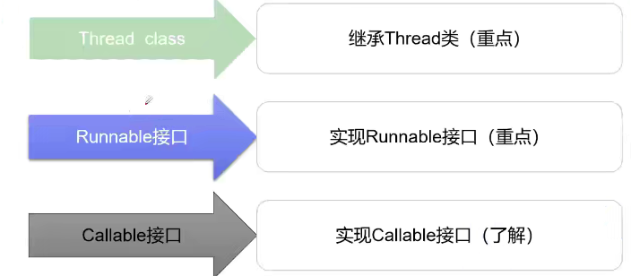

##### 2.1==线程创建的三种方式==

###### 1.继承Thread类

不建议使用：为了避免OOP单继承局限性

**Thread类本身实现了Runnable接口**

**实现过程：**

①自定义线程类继承Thread类

②重写run方法，编写程序执行体

③创建线程对象，调用start()方法启动线程

***总结***：线程开启不一定立即执行，由CPU调度执行，直接调用run方法相当于调用普通方法，不会创建新的线程

```java
public class TestThread1 extends Thread {//继承Thread类
    public static void main(String[] args) {

       TestThread1 thread1=new  TestThread1();
       // thread1.run();//先执行run方法，再执行接下来的代码（没起到多线程的作用）
        thread1.start();//主线程和子线程交替执行，且不可控，每次执行结果都不一样
        for (int i = 0; i < 20; i++) {
            System.out.println("主线程"+i);
        }
    }
    @Override
    public void run() {
       // super.run();
        for (int i = 0; i < 20; i++) {
            System.out.println("子线程"+i);
        }
    }
}
```

==小插曲：使用多线程下载图片==

```java
package MultiThread;

import org.apache.commons.io.FileUtils;
import sun.misc.FileURLMapper;

import java.io.File;
import java.io.IOException;
import java.net.MalformedURLException;
import java.net.URL;

//实现多线程同步下载网图
public class TestThread2 extends Thread{

    private String url;//网络图片地址
    private String name;//保存的文件名
    @Override
    public void run()
    {
        WebDownLoader webDownLoader=new WebDownLoader();
        webDownLoader.downloader(url,name);
        System.out.println("下载了文件名为"+name);
    }

    public TestThread2(String url, String name) {
        this.url = url;
        this.name = name;
    }

    public static void main(String[] args) {
        TestThread2 t1=new TestThread2("https://image.baidu.com/search/detail?ct=503316480&z=0&ipn=d&word=%E5%B0%8F%E7%8B%97%E5%9B%BE%E7%89%87&hs=2&pn=2&spn=0&di=68640&pi=0&rn=1&tn=baiduimagedetail&is=0%2C0&ie=utf-8&oe=utf-8&cl=2&lm=-1&cs=3788223672%2C2933772794&os=3469738239%2C2819470525&simid=0%2C0&adpicid=0&lpn=0&ln=30&fr=ala&fm=&sme=&cg=&bdtype=0&oriquery=%E5%B0%8F%E7%8B%97%E5%9B%BE%E7%89%87&objurl=https%3A%2F%2Fgimg2.baidu.com%2Fimage_search%2Fsrc%3Dhttp%3A%2F%2Fimage.biaobaiju.com%2Fuploads%2F20191105%2F15%2F1572937434-vjDJNuBAxl.jpg%26refer%3Dhttp%3A%2F%2Fimage.biaobaiju.com%26app%3D2002%26size%3Df9999%2C10000%26q%3Da80%26n%3D0%26g%3D0n%26fmt%3Djpeg%3Fsec%3D1613979841%26t%3D6b74022d98f53152b4e7143934ed2714&fromurl=ippr_z2C%24qAzdH3FAzdH3Fooo_z%26e3Bktw5kwt37_z%26e3Bv54AzdH3Fi5g2geiwtztAzdH3Fl08nc_z%26e3Bip4s&gsm=3&islist=&querylist=","dog.jpeg");
        TestThread2 t2=new TestThread2("https://image.baidu.com/search/detail?ct=503316480&z=0&ipn=d&word=%E5%B0%8F%E7%8B%97%E5%9B%BE%E7%89%87&hs=2&pn=5&spn=0&di=26840&pi=0&rn=1&tn=baiduimagedetail&is=0%2C0&ie=utf-8&oe=utf-8&cl=2&lm=-1&cs=2057173425%2C3288346039&os=3534193242%2C1744020036&simid=4255926711%2C726475710&adpicid=0&lpn=0&ln=30&fr=ala&fm=&sme=&cg=&bdtype=0&oriquery=%E5%B0%8F%E7%8B%97%E5%9B%BE%E7%89%87&objurl=https%3A%2F%2Fgimg2.baidu.com%2Fimage_search%2Fsrc%3Dhttp%3A%2F%2Fimg.wohaoyun.com%2Fimg_600%2FM00%2F07%2FB8%2FwKjg2lvW-dGAERdjAAEeYGzmpUA906.jpg%26refer%3Dhttp%3A%2F%2Fimg.wohaoyun.com%26app%3D2002%26size%3Df9999%2C10000%26q%3Da80%26n%3D0%26g%3D0n%26fmt%3Djpeg%3Fsec%3D1613979935%26t%3Dbd8042b4b6488deae4c73854e0c4dd6e&fromurl=ippr_z2C%24qAzdH3FAzdH3Fooo_z%26e3Bo5iw5y7g_z%26e3Bv54AzdH3Ff3AzdH3F15g2o7ktzitAzdH3Fda8bAzdH3F88AzdH3F8988_z%26e3Bip4s&gsm=6&islist=&querylist=","dog2.jpeg");
        TestThread2 t3=new TestThread2("https://image.baidu.com/search/detail?ct=503316480&z=0&ipn=d&word=%E5%B0%8F%E7%8B%97%E5%9B%BE%E7%89%87&hs=2&pn=4&spn=0&di=13750&pi=0&rn=1&tn=baiduimagedetail&is=0%2C0&ie=utf-8&oe=utf-8&cl=2&lm=-1&cs=2136279165%2C2845293579&os=1684394320%2C374773828&simid=3423840844%2C312231934&adpicid=0&lpn=0&ln=30&fr=ala&fm=&sme=&cg=&bdtype=0&oriquery=%E5%B0%8F%E7%8B%97%E5%9B%BE%E7%89%87&objurl=https%3A%2F%2Fgimg2.baidu.com%2Fimage_search%2Fsrc%3Dhttp%3A%2F%2Fwww.cpnic.com%2FUploadFiles%2Fimg_0_3308088708_3867205912_26.jpg%26refer%3Dhttp%3A%2F%2Fwww.cpnic.com%26app%3D2002%26size%3Df9999%2C10000%26q%3Da80%26n%3D0%26g%3D0n%26fmt%3Djpeg%3Fsec%3D1613980066%26t%3D73944a43d2a1181ed0e4aeb6cd59da1e&fromurl=ippr_z2C%24qAzdH3FAzdH3Fooo_z%26e3Bvrgtv_z%26e3Bv54AzdH3FrtvAzdH3F%25Ec%25Ba%25bF%25Ec%25lE%25bB%25E0%25bB%25l0%25Ec%25ln%25b8%25E0%25A0%25bD%25Ec%25A9%25A0%25Ec%25bc%25Ab%25Ec%25bF%25bA%25Ec%25lB%25BE%25E0%25bl%25b0%25Ec%25bF%25bA%25E9%25BB%25B0%25Em%25Aa%25BCAzdH3F&gsm=5&islist=&querylist=","dog3.jpeg");
        t1.start();
        t2.start();
        t3.start();

    }
}
//下载器
class WebDownLoader{
    //下载方法
    public void downloader(String url,String name)  {
        try {
            FileUtils.copyURLToFile(new URL(url),new File(name));//copyURLToFile，把url变成文件
        } catch (IOException e) {
            e.printStackTrace();
            System.out.println("IO异常，downloader方法出现问题");
        }
    }
}
```

###### 2.实现Runnable接口

==java是单继承，推荐使用Runnable接口，方便同一个独享被多个线程使用==

避免了单继承的局限性：即在Java中一个类只能使用extends继承一个父类.，如果继承多个父类，而父类有同名方法时就不知道调用哪一个方法了，另外会是两个类的耦合性增加，如果父类有改动时会直接影响子类。

① 定义MyRunnable类实现Runnable接口

②实现Run()方法，编写程序执行体

③创建线程对象，调用start()方法启动线程

###### 3.实现Callable接口

1.实现Callable接口，需要返回值类型

2.重写call方法，需要抛出异常

3.创建目标对象

4.创建执行服务:ExecutorService ser = Executors.newFixedThreadPool(1);

5.提交执行:Future result1 = ser.submit(t1);

6.获取结果: boolean r1 = result1.get()

7.关闭服务:ser.shutdownNow();

```java
package MultiThread;

import org.apache.commons.io.FileUtils;

import java.io.File;
import java.io.IOException;
import java.net.URL;
import java.util.concurrent.*;

public class TestCallable implements Callable<Boolean> {
    private String url;//网络图片地址
    private String name;//保存的文件名
    @Override
    public Boolean call()
    {
        WebDownLoader webDownLoader=new WebDownLoader();
        webDownLoader.downloader(url,name);
        System.out.println("下载了文件名为"+name);
        return true;
    }

    public TestCallable(String url, String name) {
        this.url = url;
        this.name = name;
    }

    public static void main(String[] args) throws ExecutionException, InterruptedException {
        TestCallable t1=new TestCallable("https://image.baidu.com/search/detail?ct=503316480&z=0&ipn=d&word=%E5%B0%8F%E7%8B%97%E5%9B%BE%E7%89%87&hs=2&pn=2&spn=0&di=68640&pi=0&rn=1&tn=baiduimagedetail&is=0%2C0&ie=utf-8&oe=utf-8&cl=2&lm=-1&cs=3788223672%2C2933772794&os=3469738239%2C2819470525&simid=0%2C0&adpicid=0&lpn=0&ln=30&fr=ala&fm=&sme=&cg=&bdtype=0&oriquery=%E5%B0%8F%E7%8B%97%E5%9B%BE%E7%89%87&objurl=https%3A%2F%2Fgimg2.baidu.com%2Fimage_search%2Fsrc%3Dhttp%3A%2F%2Fimage.biaobaiju.com%2Fuploads%2F20191105%2F15%2F1572937434-vjDJNuBAxl.jpg%26refer%3Dhttp%3A%2F%2Fimage.biaobaiju.com%26app%3D2002%26size%3Df9999%2C10000%26q%3Da80%26n%3D0%26g%3D0n%26fmt%3Djpeg%3Fsec%3D1613979841%26t%3D6b74022d98f53152b4e7143934ed2714&fromurl=ippr_z2C%24qAzdH3FAzdH3Fooo_z%26e3Bktw5kwt37_z%26e3Bv54AzdH3Fi5g2geiwtztAzdH3Fl08nc_z%26e3Bip4s&gsm=3&islist=&querylist=","dog.jpeg");
        TestCallable t2=new TestCallable("https://image.baidu.com/search/detail?ct=503316480&z=0&ipn=d&word=%E5%B0%8F%E7%8B%97%E5%9B%BE%E7%89%87&hs=2&pn=5&spn=0&di=26840&pi=0&rn=1&tn=baiduimagedetail&is=0%2C0&ie=utf-8&oe=utf-8&cl=2&lm=-1&cs=2057173425%2C3288346039&os=3534193242%2C1744020036&simid=4255926711%2C726475710&adpicid=0&lpn=0&ln=30&fr=ala&fm=&sme=&cg=&bdtype=0&oriquery=%E5%B0%8F%E7%8B%97%E5%9B%BE%E7%89%87&objurl=https%3A%2F%2Fgimg2.baidu.com%2Fimage_search%2Fsrc%3Dhttp%3A%2F%2Fimg.wohaoyun.com%2Fimg_600%2FM00%2F07%2FB8%2FwKjg2lvW-dGAERdjAAEeYGzmpUA906.jpg%26refer%3Dhttp%3A%2F%2Fimg.wohaoyun.com%26app%3D2002%26size%3Df9999%2C10000%26q%3Da80%26n%3D0%26g%3D0n%26fmt%3Djpeg%3Fsec%3D1613979935%26t%3Dbd8042b4b6488deae4c73854e0c4dd6e&fromurl=ippr_z2C%24qAzdH3FAzdH3Fooo_z%26e3Bo5iw5y7g_z%26e3Bv54AzdH3Ff3AzdH3F15g2o7ktzitAzdH3Fda8bAzdH3F88AzdH3F8988_z%26e3Bip4s&gsm=6&islist=&querylist=","dog2.jpeg");
        TestCallable t3=new TestCallable("https://image.baidu.com/search/detail?ct=503316480&z=0&ipn=d&word=%E5%B0%8F%E7%8B%97%E5%9B%BE%E7%89%87&hs=2&pn=4&spn=0&di=13750&pi=0&rn=1&tn=baiduimagedetail&is=0%2C0&ie=utf-8&oe=utf-8&cl=2&lm=-1&cs=2136279165%2C2845293579&os=1684394320%2C374773828&simid=3423840844%2C312231934&adpicid=0&lpn=0&ln=30&fr=ala&fm=&sme=&cg=&bdtype=0&oriquery=%E5%B0%8F%E7%8B%97%E5%9B%BE%E7%89%87&objurl=https%3A%2F%2Fgimg2.baidu.com%2Fimage_search%2Fsrc%3Dhttp%3A%2F%2Fwww.cpnic.com%2FUploadFiles%2Fimg_0_3308088708_3867205912_26.jpg%26refer%3Dhttp%3A%2F%2Fwww.cpnic.com%26app%3D2002%26size%3Df9999%2C10000%26q%3Da80%26n%3D0%26g%3D0n%26fmt%3Djpeg%3Fsec%3D1613980066%26t%3D73944a43d2a1181ed0e4aeb6cd59da1e&fromurl=ippr_z2C%24qAzdH3FAzdH3Fooo_z%26e3Bvrgtv_z%26e3Bv54AzdH3FrtvAzdH3F%25Ec%25Ba%25bF%25Ec%25lE%25bB%25E0%25bB%25l0%25Ec%25ln%25b8%25E0%25A0%25bD%25Ec%25A9%25A0%25Ec%25bc%25Ab%25Ec%25bF%25bA%25Ec%25lB%25BE%25E0%25bl%25b0%25Ec%25bF%25bA%25E9%25BB%25B0%25Em%25Aa%25BCAzdH3F&gsm=5&islist=&querylist=","dog3.jpeg");
       //创建执行服务
        ExecutorService ser= Executors.newFixedThreadPool(3);//线程池，放3个线程
        //提交执行
        Future<Boolean> r1=ser.submit(t1);
        Future<Boolean> r2=ser.submit(t2);
        Future<Boolean> r3=ser.submit(t3);
        //获取结果
        boolean rs1=r1.get();
        boolean rs2=r2.get();
        boolean rs3=r3.get();
        //关闭服务
        ser.shutdownNow();
    }


}
//下载器
class WebDownLoader{
    //下载方法
    public void downloader(String url,String name)  {
        try {
            FileUtils.copyURLToFile(new URL(url),new File(name));//copyURLToFile，把url变成文件
        } catch (IOException e) {
            e.printStackTrace();
            System.out.println("IO异常，downloader方法出现问题");
        }
    }
}
```

##### 2.2初步认识并发问题

==多个线程操作同一个资源的情况下出现不同的线程抢到同一张票，线程不安全，数据紊乱==

###### 2.2.1三人购买火车票问题

```java
package MultiThread;
//多个线程操作同一个对象
//买火车票
//多个线程操作同一个资源的情况下出现不同的线程抢到同一张票，线程不安全，数据紊乱
public class TestTheread4 implements Runnable{
int ticketNums=100;//票数
public static void main(String[] args) {
    TestTheread4 testTheread4 = new TestTheread4();
    new Thread(testTheread4,"1").start();//1,2,3是线程名字
    new Thread(testTheread4,"2").start();
    new Thread(testTheread4,"3").start();
}
@Override
public void run() {
    while (true)
    {
       if(ticketNums<=0)
       {
           break;
       }
        try {
            Thread.sleep(200);//模拟延时
        } catch (InterruptedException e) {
            e.printStackTrace();
        }
        System.out.println(Thread.currentThread().getName()+"-->拿到了第"+ticketNums--+"张票");
    }
  }
}
```

###### 2.2.2龟兔赛跑问题

```java
package MultiThread;
/*
1．首先来个赛道距离，然后要离终点越来越近
2．判断比赛是否结束
3.打印出胜利者
4．龟兔赛跑开始
5．故事中是乌龟赢的，兔子需要睡觉，所以我们来模拟兔子睡觉
6.终于，乌龟赢得比赛
 **/
public class Race implements Runnable{
    private static String winner;//用static，保证只有一个胜利者

    public static void main(String[] args) {
        Race Rubbit=new Race();
        Race tortise=new Race();
        new Thread(Rubbit,"兔子").start();
        new Thread(tortise,"乌龟").start();
    }

    @Override
    public void run() {
        for (int i = 0; i <= 1000; i++) {
            //模拟兔子休息,每10步休息一下
if(Thread.currentThread().getName().equals("兔子")&&i%10==0)//注意不要用==
{
    try {
        Thread.sleep(10);
    } catch (InterruptedException e) {
        e.printStackTrace();
    }
}


            //判断比赛是否结束
            boolean flag=gameOver(i);
            //如果比赛结束，停止程序
            if(flag)
            {
                break;
            }

            System.out.println(Thread.currentThread().getName()+"-->跑了"+i+"步");
        }
    }
    //判断是否完成比赛
    private boolean gameOver(int steps)
    {
        if(winner!=null)
        {
            return true;
        }
        {
            if(steps>=1000) {
                winner= Thread.currentThread().getName();
                System.out.println("winneer is"+winner);
                return true;
            }
        }
        return false;
    }
}
```

#### 3.线程状态

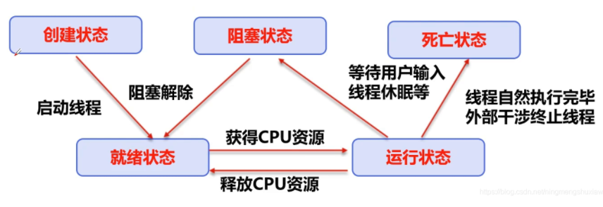

##### 3.1线程的状态

1. 创建
2. 就绪
3. 阻塞
4. 运行
5. 死亡

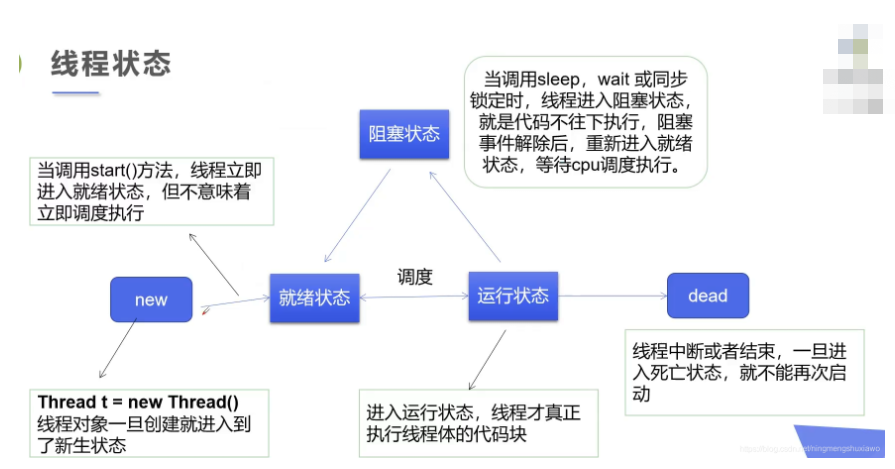

##### 3.2线程类的常用方法

| 方法                           | 说明                                       |
| ------------------------------ | ------------------------------------------ |
| setPriority(int newPriority)   | 更改线程的优先级                           |
| static void sleep(long millis) | 在指定的毫秒数内让当前正在执行的线程休眠   |
| void join()                    | 等待该线程终止                             |
| static void yield()            | 暂停当前正在执行的线程对象，并执行其他线程 |
| void interrupt(）              | 中断线程，别用这个方式                     |
| boolean isAlive()              | 测试线程是否处于活动状态                   |

###### 3.2.1停止线程

==不推荐使用jdk提供的stop(),destory()方法==

1. stop方法是过时的从Java编码规则来说，已经过时的方法不建议采用。
2. stop方法会导致代码逻辑不完整stop方法是一种“恶意”的中断，一旦执行stop方法，即终止当前正在运行的线程，不管线程逻辑是否完整，这是非常危险的
3. stop方法会破坏原子逻辑多线程为了解决共享资源抢占的问题，使用了锁概念，避免资源不同步，但是正因此原因，stop方法却会带来更大的麻烦：它会丢弃所有的锁，导致原子逻辑受损。

**建议使用一个标志位进行终止变量，当flag=false,则线程终止运行**

```java
public class Teststop implements Runnable {
//1.线程中定义线程体使用的标识
private boolean flag = true;
@Override
public void run (){
/ /2 .线程体使用该标识
while (flag) {
systepaoit.println ( "run. . . Thread" );
}
}
//3.对外提供方法改变标识
public void stop(){
this.flag = false;
}
}
```

```java
public class TestStop implements Runnable {
    private boolean flag=true;
    @Override
    public void run() {
        int i=0;
        while (flag){
            System.out.println("run.....Thread"+(i++));
        }
    }
    public void stop(){
        this.flag=false;
    }
    public static void main(String[] args) {
        TestStop testStop = new TestStop();
        new Thread(testStop).start();
        for (int i = 0; i <1000 ; i++) {
            System.out.println("main"+i);
            if (i==900){
                testStop.stop();
                System.out.println("run线程停止了！");
            }
        }
    }
}
```

###### 3.2.2线程休眠

- sleep(时间)指定当前线程阻塞的毫秒数;

- sleep存在异常InterruptedException;

- sleep时间达到后线程进入就绪状态;

- sleep可以模拟网络延时(放大问题的发生性，比如多线程卖票，一票多卖)，倒计时等，同时可以模拟定时任务

- 每一个对象都有一个锁,sleep不会释放锁;

```java
package MultiThread;

import java.text.SimpleDateFormat;
import java.util.Date;
import java.util.logging.SimpleFormatter;

//模拟倒计时
public class TestSleep implements Runnable {

    public static void main(String[] args) throws InterruptedException {
        tenDown();
        //打印当前系统时间
        Date startTime=new Date(System.currentTimeMillis());
        while(true)
        {
            Thread.sleep(1000);
            System.out.println(new SimpleDateFormat("HH:mm:ss").format(startTime));
            startTime=new Date(System.currentTimeMillis());

        }
    }
    public static void tenDown() throws InterruptedException {//模拟倒计时
        int num=10;
        while(true)
        {
          Thread.sleep(1000);
            System.out.println(num--);
            if(num<=0)
            {
                break;
            }
        }
    }

    @Override
    public void run() {
    }
}
```

###### 3.2.3线程礼让

礼让线程，让当前正在执行的线程暂停，但不阻塞

将线程从运行状态转为就绪状态

让CPU重新调度，礼让不一定成功

```java
package MultiThread;

public class TestYield {
    public static void main(String[] args) {
        MyYield myYield=new MyYield();
        new Thread(myYield,"a").start();
        new Thread(myYield,"b").start();
    }
}
class MyYield implements Runnable{
    @Override
    public void run() {
        System.out.println(Thread.currentThread().getName()+"线程开始执行");
        Thread.yield();
        System.out.println(Thread.currentThread().getName()+"线程结束执行");
    }
}
```

可能礼让成功，可能礼让失败

###### 3.2.4观测线程状态

Thread.State

| 关键词         | 含义                                                         |
| -------------- | ------------------------------------------------------------ |
| NEW            | 尚未启动的线程处于此状态。RUNNABLE                           |
| RUNNABLE       | 在Java虚拟机中执行的线程处于此状态                           |
| BLOCKED        | 被阻塞等待监视器锁定的线程处于此状态                         |
| WAITING        | 正在等待另一个线程执行特定动作的线程处于此状态               |
| TIMED_ WAITING | 正在等待另一个线程执行动作达到指定等待时间的线程处于此状态。 |
| TERMINATED     | 已退出的线程处于此状态                                       |

一个线程可以给定时间点处于一个状态。这些状态是不反映任何操作系统线程状态的虚拟机状态

==同样死亡之后的线程不能再被调用==

```java
public class TestState {
    public static void main(String[] args) throws InterruptedException {
        Thread thread=new Thread(()->{
            for (int i = 0; i <5 ; i++) {
                try {
                    Thread.sleep(1000);

                } catch (InterruptedException e) {
                    e.printStackTrace();
                }
            }
            System.out.println("");
        });
        Thread.State state = thread.getState();
        System.out.println(state);//new
        thread.start();//启动线程
        state=thread.getState();//runnable
        System.out.println(state);
        while (state!= Thread.State.TERMINATED){//只要线程不终止就输出线程状态
            Thread.sleep(100);
            state=thread.getState();//更新线程状态
            System.out.println(state);//TIME_WAITING
            
        }
    }
}
```

###### 3.2.5更改线程的优先级

线程优先级高不一定优先执行，但是优先执行的权重就大了

java提供一个线程调度器来监控程序中启动后进入就绪状态的所有线程，线程调度器按照优先级决定应该调度哪个线程来执行。

线程优先级低只是意味着获得调度的概率低，并不是优先级低就不会被调用了，这都是看CPU调度

线程的优先级用数字表示，范围从1~10。

Thread.MIN_PRIORITY = 1;

Thread.MAX_PRIORITY = 10;

Thread.NORM_PRIORITY = 5;

使用以下方式改变或获取优先级：getPriority().setPriority(int xxx)

```java
public class TestPriority {
    public static void main(String[] args) {
       //主线程设置默认优先级
        System.out.println(Thread.currentThread().getName()+"-->"+Thread.currentThread().getPriority();
        MyPriority myPriority = new MyPriority();
        Thread t1 = new Thread(myPriority);
        Thread t2 = new Thread(myPriority);
        Thread t3 = new Thread(myPriority);
        Thread t4 = new Thread(myPriority);
        Thread t5 = new Thread(myPriority);
        Thread t6 = new Thread(myPriority);
        //先设置线程优先级
        t1.setPriority(1);
        t1.start();
        t2.setPriority(3);
        t2.start();
        t3.setPriority(6);
        t3.start();
        t4.setPriority(Thread.MAX_PRIORITY);//  优先级=10
        t4.start();
        t5.setPriority(Thread.MIN_PRIORITY);// 优先级=1
        t6.setPriority(9);
        t6.start();

        System.out.println("main");
    }
}
class MyPriority implements Runnable{

    @Override
    public void run() {
        System.out.println(Thread.currentThread().getName()+"---线程被执行了！---"+Thread.currentThread().getPriority());
    }
}
```

==大多数时候，线程优先级高的线程会优先执行，先设置优先级，再start线程！！！==

###### 3.2.6守护线程

1. 线程分为用户线程和守护线程
2. 虚拟机必须确保用户线程执行完毕
3. 虚拟机不用等待守护线程执行完毕,如，后台记录操作日志，监控内存，垃圾回收等待。。。

```java
public class TestDaemon {
    public static void main(String[] args) {
        God god = new God();
        You you=new You();
        Thread thread = new Thread(god);
        thread.setDaemon(true);//默认为flase 为用户线程，  true为守护线程
        thread.start();
        new Thread(you).start();
    }
}
class God implements Runnable{

    @Override
    public void run() {
        while (true){
            System.out.println("上帝守护着你-------");
        }
    }
}
class You implements Runnable{
    @Override
    public void run() {
        for (int i = 0; i <36500 ; i++) {
            System.out.println("开心着活着每一天------");
        }
        System.out.println("----goodbye!Beautiful World!!!------");
    }
}
```

###### 3.2.7线程强制执行

待此线程执行完毕之后，在执行其他线程，其他线程阻塞，可以想象成**插队**

```java
package MultiThread;

public class TestJoin implements Runnable {

    public static void main(String[] args) throws InterruptedException {
        TestJoin testJoin=new  TestJoin();
        Thread thread=  new Thread( testJoin);
        thread.start();

        for (int i = 0; i < 50; i++) {
          if(i==25)
          {
              thread.join();
          }
            System.out.println("主线程"+i);
        }
    }
    @Override
    public void run() {
        for (int i = 0; i < 200; i++) {
            System.out.println("join线程"+i);
        }
    }
}
```

#### 4.线程同步（重点）

##### 4.1什么是线程同步

处理多线程问题时,多个线程访问同一个对象，并且某些线程还想修改这个对象.这时候我们就需要线程同步，线程同步其实就是一种等待机制。多个需要同时访问此对象的线程进入这个对象的等待池形成队列,等待前面线程使用完毕，下一个线程再使用。

##### 4.2线程同步形成条件--队列+锁

##### 4.3线程安全--synchronized 

1. 由于同一进程的多个线程共享同一块存储空间，在带来方便的同时，也带来了访问冲突问题，为了保证数据在方法中被访问时的正确性，在访问时加入锁机制synchronized，当一个线程获得对象的排它锁，独占资源，其他线程必须等待，使用后释放锁即可，存在以下问题：

   - 一个线程持有锁会导致其它所有需要此锁的线程挂起；
   - 在多线程竞争下，加锁，释放锁会导致比较多的上下文切换和调度延时，引起性能问题；
   - 如果一个优先级高的线程等待一个优先级低的线程释放锁，会导致优先级倒置，引起性能问题。

2. ==synchronized方法控制对“对象”的访问，每个对象对应一把锁﹐每个synchronized方法都必须获得调用该方法的对象的锁才能执行﹐否则线程会阻塞，方法一旦执行﹐就独占该锁，直到该方法返回才释放锁﹐后面被阻塞的线程才能获得这个锁,继续执行==

3. 同步方法和同步块

   1. 同步方法

      - synchronized方法控制对“对象”的访问，每个对象对应一把锁﹐每个synchronized方法都必须获得调用该方法的对象的锁才能执行﹐否则线程会阻塞，方法一旦执行﹐就独占该锁，直到该方法返回才释放锁﹐后面被阻塞的线程才能获得这个锁,继续执行

      - 缺陷:若将一个大的方法申明为synchronized将会影响效率

      - 只读代码是不需要加锁的，只有需要进行修改的代码才需要加锁（所以产生了同步方法和同步代码块）
      - 方法里面需要修改的内容才需要锁，锁得太多，浪费资源

   2. 同步块

      1. synchronized(Obj){}

      - Obj称之为同步监视器
      - Obj可以是任何对象，但是推荐使用共享资源作为同步监视器
        注意监视的对象是需要增删改查的对象
      - 同步方法中无需指定同步监视器，因为同步方法的同步监视器就是this,就是这个对象本身，或者是class【反射中讲解】

      2. 同步监视器的执行过程：

         第一个线程访问，锁定同步监视器，执行其中代码
         第二个线程访问，发现同步监视器被锁定，无法访问
         第一个线程访问完毕，皆出同步监视器
         第二个线程访问，发现同步监视器没有锁

##### 4.4线程不安全的三个例子

###### 4.4.1买火车票

- 线程不安全

  ```java
  package MultiThread.syn;
  //不安全的买票
  public class UnsafeBuyTicket {
  
      public static void main(String[] args) {
          BuyTicket buyTicket = new BuyTicket();
          new Thread(buyTicket,"1").start();
          new Thread(buyTicket,"2").start();
          new Thread(buyTicket,"3").start();
      }
  }
  
  class BuyTicket implements  Runnable{
  
      private int tickNums=10;
      boolean flag=true;//标志位，用于线程的外部停止方式
      @Override
      public void run() {
          //买票
          while(flag)
          {
              buy();
          }
      }
      private void buy() {
          //判断是否有票
          if (tickNums <= 0)
          {
              flag=false;
              return;
          }
          //模拟延时
          try {
              Thread.sleep(100);
          } catch (InterruptedException e) {
              e.printStackTrace();
          }
  
  
          //买票
          System.out.println(Thread.currentThread().getName()+"拿到"+tickNums--);
      }
  }
  ```

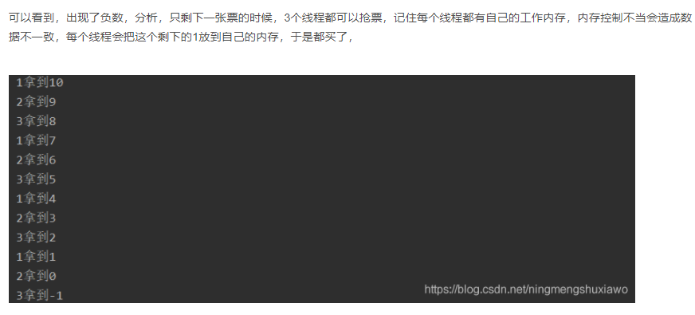

- 线程安全

  ```java
  //synchronized同步方法，锁的是this
      private synchronized void buy() throws InterruptedException {
          //判断是否有票
          if (tickNums <= 0)
          {
              flag=false;
              return;
          }
          //模拟延时
             // Thread.sleep(10);
          //买票
          System.out.println(Thread.currentThread().getName()+"拿到"+tickNums--);
      }
  ```

###### 4.4.2银行取钱

- 线程不安全

```java
package MultiThread.syn;
//不安全取钱
public class UnsafeBank {
    public static void main(String[] args) {
        //取钱首先得有账户
        Account account=new Account(100,"结婚基金");
        Drawing you=new Drawing(account,50,"你");
        Drawing girl=new Drawing(account,100,"girlFriend");
        you.start();
        girl.start();


    }

}

class Account{//账户
    int money;//余额
    String name;//卡名

    public Account(int money, String name) {
        this.money = money;
        this.name = name;
    }
}
//银行：模拟取款
class Drawing extends Thread{
    Account account;//账户
    int drawingMoney;//取多少钱
    int nMoney;//现在有多少钱

    public Drawing(Account account, int drawingMoney, String name) {
        super(name);//调用父类的方法
        this.account = account;
        this.drawingMoney = drawingMoney;
       // this.nMoney = nMoney;

    }

    @Override
    public void run() {
        //super.run();
        //判断有没有钱
        if(account.money-drawingMoney<0)
        {
            System.out.println(Thread.currentThread().getName()+"钱不够，取不了");
            return;
        }
        //模拟延时
        try {
            Thread.sleep(100);
        } catch (InterruptedException e) {
            e.printStackTrace();
        }

        //卡内余额
        account.money=account.money-drawingMoney;
        //现在手里的钱
        nMoney=nMoney+drawingMoney;
        System.out.println(account.name+"余额为："+account.money);
       //this就是调用当前方法的对象，Drawing继承了Thread,所以this也是一个线程对象，可以调用Thread的getName方法来获取线程的名字
       //Thread.currentThread().getName()=this.getName()
        System.out.println(this.getName()+"手里的钱"+nMoney);
    }
}
```

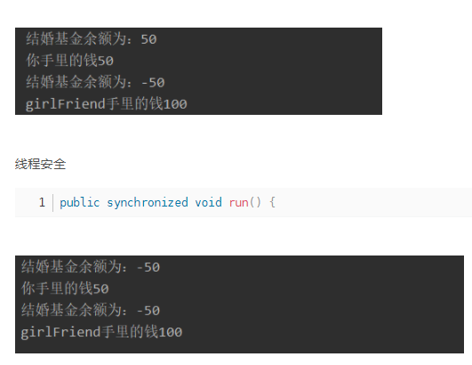

==还是会出现负数，不安全，因为synchronized默认所得独享是this,那么这里就是锁的银行，但是我们操作是对account进行操作的，银行是没有变的，所以我们需要synchronized同步块，锁account==

- 线程安全

```java
@Override
    public  void run() {
        //super.run();
        //判断有没有钱
        synchronized(account)
        {
            if(account.money-drawingMoney<0)
            {
                System.out.println(Thread.currentThread().getName()+"钱不够，取不了");
                return;
            }
            //模拟延时
            try {
                Thread.sleep(100);
            } catch (InterruptedException e) {
                e.printStackTrace();
            }

            //卡内余额
            account.money=account.money-drawingMoney;
            //现在手里的钱
            nMoney=nMoney+drawingMoney;
            System.out.println(account.name+"余额为："+account.money);
            //this就是调用当前方法的对象，Drawing继承了Thread,所以this也是一个线程对象，可以调用Thread的getName方法来获取线程的名字
            //Thread.currentThread().getName()=this.getName()
            System.out.println(this.getName()+"手里的钱"+nMoney);
        }

    }
```

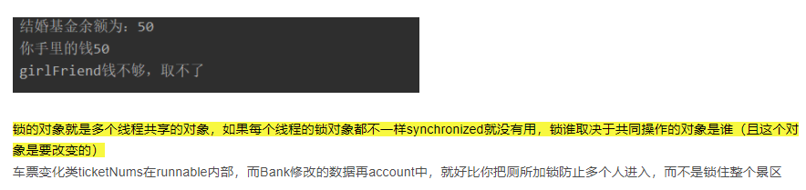

###### 4.4.3线程不安全的集合

- 线程不安全

```java
import java.util.ArrayList;
import java.util.List;

//线程不安全的集合
public class UnsafeList {
    public static void main(String[] args) {
        List<String> list = new ArrayList<>();
        for (int i = 0; i < 10000; i++) {
            new Thread(()->{
                list.add(Thread.currentThread().getName());
            }).start();
        }
          Thread.sleep(100);//休息一会再打印，电脑运行速度太快了。线程里add还没执行完就执行主线程的打印语句。会导致打印结果偏小，但最后实际结果其实还是10000

        System.out.println(list.size());
    }
}
```

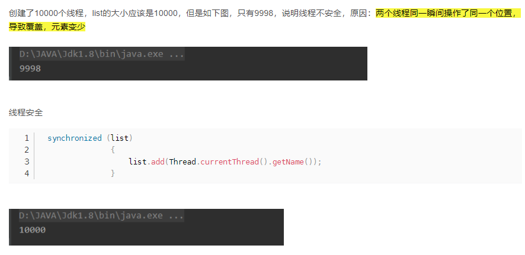

- 线程安全

```java
  synchronized (list)
                {
                    list.add(Thread.currentThread().getName());
                }

```

==**线程安全的集合：CopyOnWriteArrayList**==

```java
package MultiThread.syn;

import java.util.concurrent.CopyOnWriteArrayList;

public class testJuuc implements Runnable {
    static CopyOnWriteArrayList<String>list=new CopyOnWriteArrayList<String>();
    public static void main(String[] args) throws InterruptedException {

        testJuuc thread=new testJuuc();
        for (int i = 0; i < 10; i++) {
            new Thread( thread).start();
        }

        Thread.sleep(3000);
        System.out.println(list.size());
        System.out.println(list.toString());
    }

    @Override
    public void run() {
        list.add(Thread.currentThread().getName());
    }
}
```

##### 4.5线程安全--锁与死锁

###### 4.5.1死锁

多个线程各自占有一些共享资源，并且互相等待其他线程占有的资源才能运行，而导致两个或者多个线程都在等待对方释放资源，都停止执行的情形，某一个同步块同时拥有“两个以上对象的锁”时，就可能会发生死锁的问题

```java
package MultiThread.syn;
//死锁：多个线程互相抱着对方需要的资源，形成僵持
//这里以女生化妆为例
public class DeadLock {
    public static void main(String[] args) {
        Makeup girl1=new Makeup(0,"灰姑凉");
        Makeup girl2=new Makeup(1,"白雪公主");
        girl1.start();
        girl2.start();

    }

}
//口红
class Lipstick{


}
//镜子
class Mirror{

}
class Makeup extends Thread{

    //需要的资源只有一份，用static修饰来保证只有一份
  static Lipstick lipstick=new Lipstick();
  static Mirror mirror=new Mirror();
  int choice;
  String girlName;//使用化妆品的人

    public Makeup(int choice, String girlName) {
        this.choice = choice;
        this.girlName = girlName;
    }


    @Override
    public void run() {
        try {
            makeup();
        } catch (InterruptedException e) {
            e.printStackTrace();
        }
    }
        //super.run();
      //化妆，互相持有对方的锁，需要拿到对方的资源
       /*
        第一个人进来想拿口红，1秒之后拿镜子，然后离开
        第二个人进来拿镜子，2秒之后拿口红，然后离开
        于是形成了互相僵持，想拿到对方的东西
        **/

        private void makeup() throws InterruptedException {

            if(choice==0)
            {
                synchronized (lipstick){//获得口红的锁
                    System.out.println(this.girlName+"获得口红的锁");
                    Thread.sleep(1000);
                    synchronized (mirror){//一秒中后获得镜子的锁
                        System.out.println(this.girlName+"获得镜子的锁");
                    }
                }
            }
            else
            {
                synchronized (mirror){//获得镜子的锁
                    System.out.println(this.girlName+"获得镜子的锁");
                    Thread.sleep(2000);
                    synchronized (lipstick){//一秒中后获得口红的锁
                        System.out.println(this.girlName+"获得口红的锁");
                    }
                }
            }

        }
    }
```

死锁发生，程序不结束

```java
  private void makeup() throws InterruptedException {

            if(choice==0)
            {
                synchronized (lipstick){//获得口红的锁
                    System.out.println(this.girlName+"获得口红的锁");
                    Thread.sleep(1000);
                }
                synchronized (mirror){//一秒中后获得镜子的锁
                    System.out.println(this.girlName+"获得镜子的锁");
                }
            }
            else
            {
                synchronized (mirror){//获得镜子的锁
                    System.out.println(this.girlName+"获得镜子的锁");
                    Thread.sleep(2000);

                }
                synchronized (lipstick){//一秒中后获得口红的锁
                    System.out.println(this.girlName+"获得口红的锁");
                }
            }

        }
```

总结：
首先有两个线程都需要化妆，但是现在只有一份口红和镜子，一个人先拿到了口红，另一个人先拿到了镜子，如果另一个人拿着镜子不放，你就没法拿到镜子，那是因为你没有放下你的口红，别人也就放不下它的镜子，它只有拿到口红才能拿到镜子，所以，要避免一个线程拿到两个或以上的对象锁

***==产生死锁的四个必要条件:==***

1.互斥条件:一个资源每次只能被一个进程使用。

2．请求与保持条件:一个进程因请求资源而阻塞时，对已获得的资源保持不放。

3.不剥夺条件:进程已获得的资源，在末使用完之前，不能强行剥夺。

4.循环等待条件:若干进程之间形成一种头尾相接的循环等待资源关系。

###### 4.5.2锁

==从JDK 5.0开始，Java提供了更强大的线程同步机制——通过显式定义同步锁对象来实现同步。同步锁使用Lock对象充当java.util.concurrent.locks.Lock接口是控制多个线程对共享资源进行访问的工具。锁提供了对共享资源的独占访问，每次只能有一个线程对Lock对象加锁，线程开始访问共享资源之前应先获得Lock对象
ReentrantLock(可重入锁)类实现了Lock，它拥有与synchronized相同的并发性和内存语义，在实现线程安全的控制中，比较常用的是ReentrantLock，可以显式加锁、释放锁。==

```java
class A{

private final ReentrantLock lock = new Reen TrantLock();
public void m(){


try{
lock.lock();
//保证线程安全的代码;
}
finally{
lock.unlock();
//如果同步代码有异常，要将unlock()写入finally语句块}
}
}
```

1. 加锁
2. 解锁

```java
package MultiThread.syn;

import java.util.concurrent.locks.ReentrantLock;

//测试Lock锁
public class TestLock implements Runnable {
    int ticketNums=1000;
    //定义lock锁
    private final ReentrantLock lock = new ReentrantLock();
    public static void main(String[] args) {
        TestLock testLock=new TestLock();
       // new Thread(testLock,"1").start();
        new Thread(testLock,"2").start();
        new Thread(testLock,"3").start();
        new Thread(testLock,"4").start();
    }
    @Override
    public void run() {
        while(true)
        {
            try {
                lock.lock();
                if(ticketNums>0)
                {
                    try {
                        Thread.sleep(10);
                    } catch (InterruptedException e) {
                        e.printStackTrace();
                    }
                    System.out.println(Thread.currentThread().getName()+"获得了第"+ticketNums--+"票");
                }
                else
                {
                    break;
                }
            }
            finally {
                lock.unlock();
            }
        }
    }
}
```

###### 4.5.3Synchronized和Lock的区别

1. Lock是显式锁（手动开启和关闭，别忘记关闭锁）Synchronized是隐式锁，出了作用域自动释放
2. Lock只有代码块锁，Synchronized有代码块锁和方法锁
3. 使用Lock锁，JVM将花费较少的时间来调度线程，性能更好。并且有更好的扩展性（提供更多的子类）
4. 优先使用顺序：Lock>同步代码块（已经进入了方法体，分配了相应资源）>同步方法（在方法体之外）

#### 5.线程通信问题

1. 即线程之间的交流

- 生产者消费者模式（不是23中设计模式之一）
- 生产者生产，消费者消费，两个线程之间可以通信

2. 应用场景:生产者和消费者问题

##### 5.1生产者消费者

1. 思路：

   假设仓库中只能存放一件产品﹐生产者将生产出来的产品放入仓库,消费者将仓库中产品取走消费.

   如果仓库中没有产品，则生产者将产品放入仓库﹐否则停止生产并等待﹐直到仓库中的产品被消费者取走为止.

   如果仓库中放有产品，则消费者可以将产品取走消费﹐否则停止消费并等待，直到仓库中再次放入产品为止.
   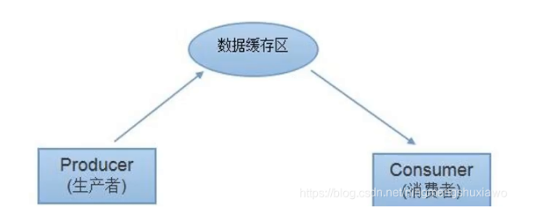

   - 这是一个线程同步问题：生产者和消费者共享同一个资源,并且生产者和消费者之间相互依赖,互为条件.
   - 对于生产者没有生产产品之前，要通知消费者等待，而生产了产品之后，又需要马上通知消费者消费
   - 对于消费者,在消费之后﹐要通知生产者已经结束消费﹐需要生产新的产品以供消费.

   2.解决方案

   在生产者消费者问题中,仅有synchronized是不够的

   synchronized 可阻止并发更新同一个共享资源,实现了同步

   synchronized不能用来实现不同线程之间的消息传递(通信)

   Java提供了几个方法解决线程之间的通信问题

   注意:均是Object类的方法，都只能在同步方法或者同步代码块中使用,否则会抛出异常IlIegalMonitorStateException

   | 方法名             | 含义                                                         |
   | ------------------ | ------------------------------------------------------------ |
   | wait()             | 表示线程一直等待，知道其他线程通知，会释放锁                 |
   | wait(long timeout) | 指定等待的毫秒数                                             |
   | notify()           | 唤醒一个处于等待状态的线程                                   |
   | notifyall()        | 唤醒同一个对象上所有调用wait方法的线程，优先级别高的线程优先调度 |

###### 5.1.1管程法

并发协作模型“生产者/消费者模式”—>管程法

生产者:负责生产数据的模块(可能是方法﹐对象﹐线程﹐进程);

消费者:负责处理数据的模块(可能是方法﹐对象﹐线程,进程);

缓冲区∶消费者不能直接使用生产者的数据,他们之间有个“缓冲区

```java
//测试：生产者消费者模型--》
    //生产者，消费者，产品
public class Tes
    public stati
        SynConta
        new Prod
        new Cons
    }
}
//生产者
class Productor 
    SynContainer
    public Produ
        this.con
    }
    //生产

    @Override
    public void 
        for (int
            cont
            Syst
        }
    }
}
//消费者
class Consumer e
    SynContainer
    public Consu
        this.con
    }
//消费
    @Override
    public void 
        for (int
            Syst
        }
    }
}
//产品
class Chicken{
    int id;//产品编
    public Chick
        this.id=
    }

}
//容器
class SynContain
    //需要一个容器大小
    Chicken[] ch
    //容器计数器
    int count =1
    //生产者放入产品
    public synch
        //如果容器满了
        if (coun
            //同知

                
                
                
                
                

        }
        //如果没有满，
        chickens
        count++;
        //可以同知消费
        this.not
    }
    //消费者消费产品
    public synch
        //判断能否消费
        if (coun
            //等待
            try 
                
            } ca
                
            }
        }

        //如果可以消费
        count--;
        Chicken 
        //吃完了，同知
        this.not
        return c
    }
}
```

###### 5.1.2信号灯法

即设置标志位

```java
//信号灯法！！！
public class TestPC2 {
    public static void main(String[] args) {
        TV tv = new TV();
        new Player(tv).start();
        new Watcher(tv).start();
    }
}
//生产者--》演员
class Player extends Thread{
    TV tv;

    public Player(TV tv) {
        this.tv = tv;
    }

    @Override
    public void run() {
        for (int i = 0; i <20 ; i++) {
            if (i%2==0){
                this.tv.play("快乐大本营播放中");
            }else{
                this.tv.play("抖音：记录美好生活");
            }
        }
    }
}
//消费者--》观众
class  Watcher extends Thread{
    TV tv;

    public Watcher(TV tv) {
        this.tv = tv;
    }

    @Override
    public void run() {
        for (int i = 0; i <20 ; i++) {
            tv.watch();
        }
    }
}
//产品-->节目
class TV{
    //演员表演，观众等待  T
    //观众观看，演员等待  F
    String voice;//表演的节目
    boolean flag=true;
    //表演
    public synchronized void play(String voice){
        if (!flag){
            try {
                this.wait();
            } catch (InterruptedException e) {
                e.printStackTrace();
            }
        }
        System.out.println("演员表演了:"+voice);
        //通知观众观看
        this.notifyAll();//通知唤醒
        this.voice=voice;
        this.flag=!this.flag;
    }
    //观看
    public synchronized void watch(){
        if (flag){
            try {
                this.wait();
            } catch (InterruptedException e) {
                e.printStackTrace();
            }
        }
        System.out.println("观看了："+voice);
        //同知演员表演
        this.notifyAll();
        this.flag=!this.flag;
    }
}
```

#### 6.高级主题

##### 6.1线程池

1. 背景:经常创建和销毁、使用量特别大的资源，比如并发情况下的线程，对性能影响很大。
2. 思路: 提前创建好多个线程，放入线程池中，使用时直接获取，使用完放回池中。可以避免频繁创建销毁、实现重复利用。类似生活中的公共交通工具。
3. 好处:
   1. 提高响应速度（减少了创建新线程的时间)
   2. 降低资源消耗（重复利用线程池中线程，不需要每次都创建)便于线程管理(.……)

###### 6.1.2Executors:工具类、线程池的工厂类，用于创建并返回不同类型的线程池

corePoolSize:核心池的大小
maximumPoolSize:最大线程数
keepAliveTime:线程没有任务时最多保持多长时间后会终止

```java
package MultiThread.syn;

import java.util.concurrent.ExecutorService;
import java.util.concurrent.Executors;

public class TestPool {
    public static void main(String[] args) {
        //1创建服务，创建线程池
        //newFixedThreadPool 参数为：线程池大小
        ExecutorService service= Executors.newFixedThreadPool(10);
        //执行
        service.execute(new MyThread());
        service.execute(new MyThread());
        service.execute(new MyThread());
        service.execute(new MyThread());
        //2关闭连接
        service.shutdown();
    }
}
class MyThread implements  Runnable{

    @Override
    public void run() {
        System.out.println(Thread.currentThread().getName()+"此生辽阔");
    }
}
```

##### 6.2并发编程

##### 6.3java的锁

###### 6.3.1公平锁/非公平锁

###### 6.3.2可重入锁

###### 6.3.2独享锁/共享锁

###### 6.3.2互斥锁/读写锁

###### 6.3.2悲观锁/乐观锁

###### 6.3.2分段锁

###### 6.3.2偏向锁/轻量级锁/重量级锁

###### 6.3.2自选锁

### 4.jvm（初步探寻）

==注：初步探寻==

**面试重灾区：问得多，并且是等级分层的基础点。**

- 请你谈谈你对jvm的理解？java8虚拟机和之前的变化更新？
- 什么是OOM？什么是栈溢出？Stack Overflow Error？怎么分析？
- JVM的常用调优参数有哪些？
- 内存快照如何抓取？怎么分析Dump文件？
- 谈谈jvm中，对类加载器的认识？

#### 4.1JVM的体系结构

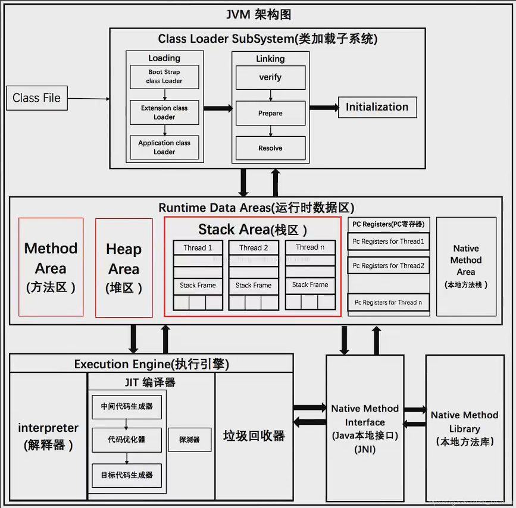

1. jvm是包含在java运行时环境（JRE）中，凌驾于操作系统之上的特殊软件。

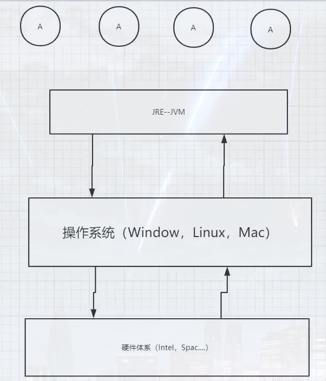

2. 百分之99的JVM调优都是在堆中调优，Java栈、本地方法栈、程序计数器是不会存在垃圾的。

#### 4.2类加载器

##### 4.2.1 .java文件-->.class文件的变化

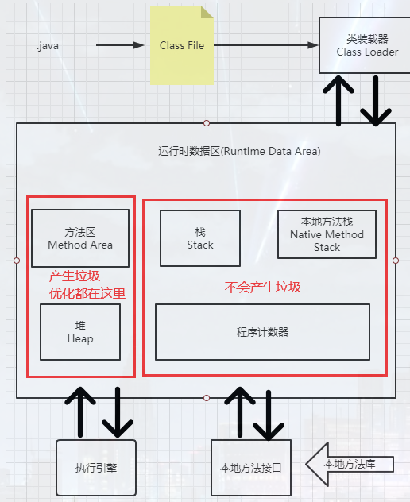

##### 4.2.2类加载器的作用

​	作用：加载.class文件


其他：


##### 4.2.3类的加载过程

###### 1.类的加载过程


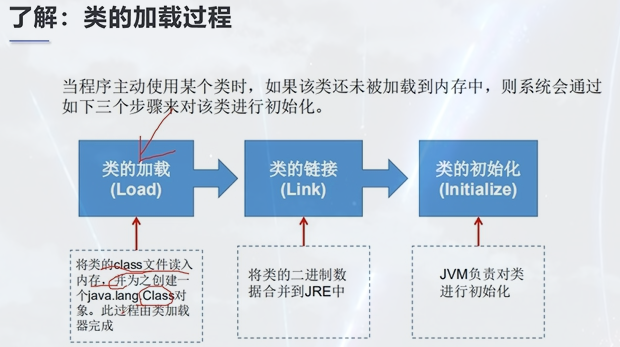

###### 2.什么时候会发生类初始化？

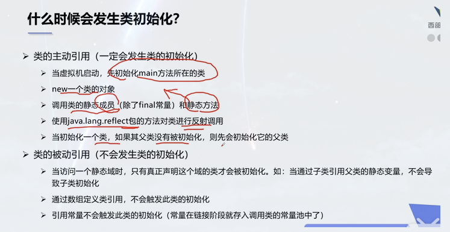

###### 3.类的加载的示例：

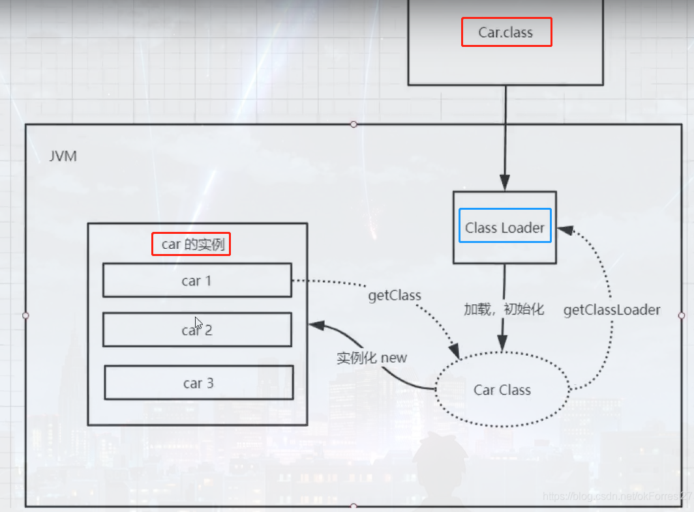

##### 4.2.4类的加载和ClassLoader的理解


##### 4.2.5类加载器的种类

- JVM自带的加载器(3种)
  - **启动类加载器:Bootstrap ClassLoader,**又名根类加载器或引导类加载器：负责加载%JAVA_HOME%\bin目录下的所有jar包，或者是-Xbootclasspath参数指定的路径jdk中的**rt.jar**；
  - **拓展类加载器:Extension ClassLoader：**负责加载%JAVA_HOME%\bin\ext目录下的所有jar包，或者是java.ext.dirs参数指定的路径；
  - **系统类加载器:Application ClassLoader**,又名应用类加载器：负责加载用户类路径上所指定的类库，如果应用程序中没有自定义加载器，那么次加载器就为默认加载器。

##### 4.2.6热部署类加载器

- 相同的类被同一个类加载器多次加载，则会报错。因此热部署是让同一个类文件被不同的类加载器加载重复加载即可。
- 我们不能调用loadClass方法，而应该调用findClass方法，避免双亲委派机制，从而实现同一个类被加载多次，实现热部署

#### 4.3双亲委派机制

##### 4.3.1双亲委派机制的目的

==**安全**==

##### 4.3.2双亲委派机制的流程

 1.类加载器收到类加载的请求

 2.将这个请求向上委托给父类加载器去完成，一 直向上委托，直到启动类加载器

 3.启动加载器检查是否能够加载当前这个类，能加载就结束， 使用当前的加载器，否则， 抛出异常，通知子加载器进行加载

 4.重复步骤3

注：Class Not found异常便从这里开始

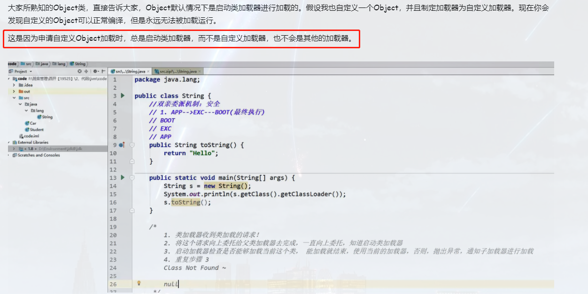


##### 4.3.3双亲委派机制的实现

由类加载器实现。

##### 4.3.4双亲委派模型


##### 4.3.5为什么采用双亲委派模型？


#### 4.4沙箱安全机制

##### 4.4.1什么是沙箱？

  Java安全模型的核心就是Java沙箱(sandbox) ,

  什么是沙箱?沙箱是一个限制程序运行的环境。沙箱机制就是将Java代码限定在虚拟机(JVM)特定的运行范围中，并且严格限制代码对本地系统资源访问，通过这样的措施来保证对代码的有效隔离，防止对本地系统造成破坏。

 沙箱主要限制系统资源访问，那系统资源包括什么? CPU、内存、文件系统、网络。不同级别的沙箱对这些资源访问的限制也可以不一样。

 所有的Java程序运行都可以指定沙箱，可以定制安全策略。

##### 4.4.2JDK安全模型

###### 1.JDK1.0安全模型


###### 2.JDK1.1安全模型

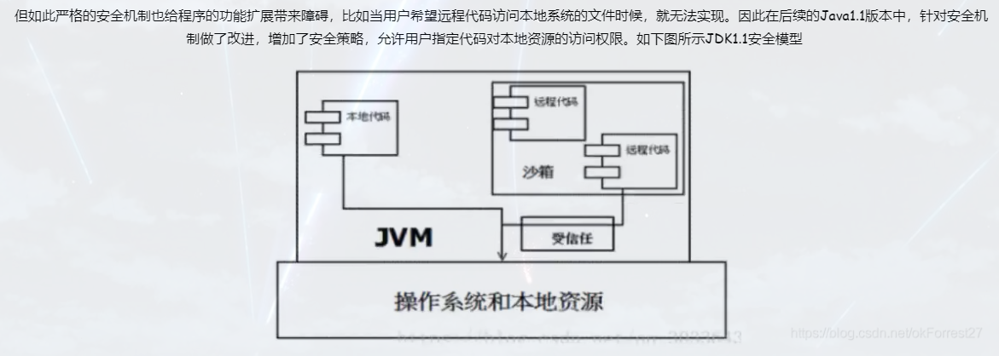

###### 3.JDK1.2安全模型

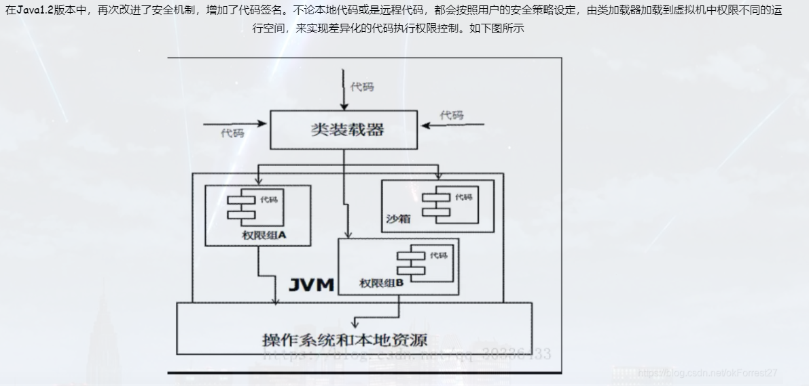

###### 4.JDK1.6安全模型

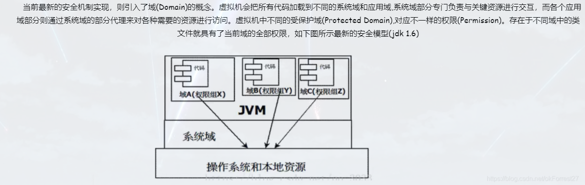

##### 4.4.3组成沙箱的基本组件

###### 1.字节码校验器

确保Java类文件遵循Java语言规范。这样可以帮助Java程序实现内存保护。但并不是所有的类文件都会经过字节码校验，比如核心类。

###### 2.类加载器

- 它防止恶意代码去干涉善意的代码;
- 它守护了被信任的类库边界;
- 它将代码归入保护域,确定了代码可以进行哪些操作。

 虚拟机为不同的类加载器载入的类提供不同的命名空间，命名空间由一系列唯一的名称组成， 每一个被装载的类将有一个名字，这个命名空间是由Java虚拟机为每一个类装载器维护的，它们互相之间甚至不可见。

 类装载器采用的机制是双亲委派模式。

 1.从最内层JVM自带类加载器开始加载,外层恶意同名类得不到加载从而无法使用;

 2.由于严格通过包来区分了访问域,外层恶意的类通过内置代码也无法获得权限访问到内层类，破坏代码就自然无法生效。

##### 4.4.4沙箱的作用

  安全提供者
  消息摘要
  数字签名
  加密
　 鉴别

#### 4.5Native

`2021年12月2日22:37查看Boss的时候发现有要求熟练掌握JNI`

- native :凡是带了native关键字的，说明java的作用范围达不到了，回去调用底层c语言的库!
- 会进入本地方法栈
- 调用本地方法本地接口 JNI (Java Native Interface)
- JNI作用:开拓Java的使用，融合不同的编程语言为Java所用!最初: C、C++
- Java诞生的时候C、C++横行，想要立足，必须要有调用C、C++的程序
- 它在内存区域中专门开辟了一块标记区域: Native Method Stack，登记native方法
- 在最终执行的时候，加载本地方法库中的方法通过JNI


1. Native Method Stack

   它的具体做法是Native Method Stack中登记native方法，在( Execution Engine )执行引擎执行的时候加载Native Libraies。[本地库]

2. Native Interface本地接口

   本地接口的作用是融合不同的编程语言为Java所用，它的初衷是融合C/C++程序, Java在诞生的时候是C/C++横行的时候，想要立足，必须有调用C、C++的程序，于是就在内存中专门开辟了块区域处理标记为native的代码，它的具体做法是在Native Method Stack 中登记native方法,在( Execution Engine )执行引擎执行的时候加载Native Libraies。

 **目前该方法使用的越来越少了，除非是与硬件有关的应用，比如通过Java程序驱动打印机或者Java系统管理生产设备，在企业级应用中已经比较少见。因为现在的异构领域间通信很发达，比如可以使用Socket通信,也可以使用Web Service等等，不多做介绍!**

#### 4.6PC寄存器

程序计数器: Program Counter Register

 每个线程都有一个程序计数器，是线程私有的，就是一个指针, 指向方法区中的方法字节码(用来存储指向像一条指令的地址， 也即将要执行的指令代码)，在执行引擎读取下一条指令, 是一个非常小的内存空间，几乎可以忽略不计

#### 4.7方法区（重点）

##### 1.什么是方法区？

​	方法区是被所有线程共享,所有字段和方法字节码，以及一些特殊方法，如构造函数,接口代码也在此定义,简单说，所有定义的方法的信息都保存在该区域,此区域属于共享区间;

##### 2.什么在方法区内？

​	==静态成员（静态变量，静态方法）、常量、类信息(构造方法、接口定义)、运行时的常量池存在方法区中，但是实例变量存在堆内存中，和方法区无关==

##### 3.方法区、栈、堆实例化对象后的示意图

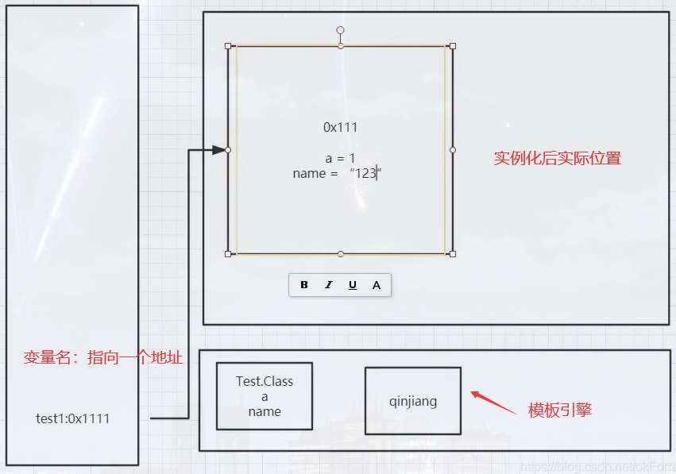

##### 4.方法区的历史

1. 方法区(Method Area) 与Java堆一样, 是各个线程共享的内存区域, 它用于存储已被虚拟机加载的类信息, 常量, 静态变量, 即时编译器编译后的代码等数据。 虽然Java虚拟机规范把方法区描述为堆的一个逻辑部分, 但是它却有一个别名叫做Non-Heap非堆, 目的应该是与Java Heap 区分开来。

2. ==在JDK1.7以前HotSpot虚拟机使用永久代来实现方法区，永久代的大小在启动JVM时可以设置一个固定值（-XX:MaxPermSize），不可变；==

3. 在JDK1.7中 存储在永久代的部分数据就已经转移到Java Heap或者Native memory。譬如符号引用(Symbols)转移到了native memory，原本存放在永久代的字符常量池移出。但永久代仍存在于JDK 1.7中，并没有完全移除。

4. JDK1.8中进行了较大改动

   `移除了永久代（PermGen），替换为元空间（Metaspace）；
   永久代中的 class metadata 转移到了 native memory（本地内存，而不是虚拟机）；
   永久代中的 interned Strings 和 class static variables 转移到了 Java heap；
   永久代参数 （PermSize MaxPermSize） -> 元空间参数（MetaspaceSize MaxMetaspaceSize）`

##### 5.方法区属于堆吗？

方法区是堆的逻辑部分，别名Non-Heap（非堆），目的是为了将其与堆区分开。

#### 4.8栈（重点）

##### 1.什么是栈？

**栈主要是用来执行程序的**。

先进后出。

##### 2.什么存放在栈中？

new对象的引用，八大基本类型

##### 3.栈的运行原理

由栈帧实现


##### 4.栈的相关错误

栈溢出：StackOverFlow

##### 5.方法区、栈、堆实例化对象后的示意图

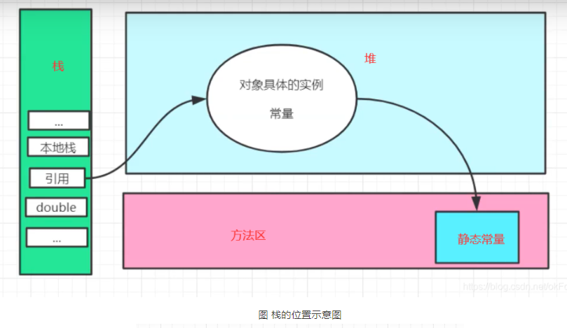

#### 4.9堆（重点）

- 英文翻译：Heap
- java堆（java Heap）是java虚拟机所管理的内存中最大的一块，堆内存的唯一目的就是存在对象实例，几乎所有的对象实例均在里分配内存，这个区域也是java垃圾管理器的主要区域，因此堆内存也会称为GC 堆。

##### 1.堆内存

Java 中的堆是 JVM 所管理的最大的一块内存空间（我们jvm调优的重点），主要用于存放各种类的实例对象。


##### 2.什么东西会放在堆中？

堆中主要存放的是对象实例以及数组。

##### 3.堆的分区

###### 3.1堆分区的历史

1. ==**JDK1.8之后堆被划分成两个不同的区域：新生代 ( Young )、老年代 ( Old )。**==

   - 新生代还可以分为伊甸园（Eden），幸存From区（Survivor From），幸存To区（Survivor To）
   - 之前版本的永久代被彻底抛弃，从1.7开始地去永久代，然后1.8更新后直接去除，之前永久代存放的数据同样全部转移到元空间中，元空间位于本地内存。

   

2. JDK1.8之前：新生代（Young），老年代（Old），永久代（PermGen）

   

###### 3.2新生代

1. 什么是新生代？

   类诞生、成长甚至死亡的地方

2. 伊甸园

   所有对象都是在伊甸园Eden区new出来的。

3. 幸存From和幸存To

   **1个Eden区和2个Survivor区（分别叫From和To），默认比例为8：1。**

4. 对象与伊甸园和幸存区的转换

   `一个对象的这一辈子：我是一个普通的java对象，我出生在Eden区，在Eden区我还看到和我长的很像的小兄弟，我们在Eden区中玩了挺长时间。有一天Eden区中的人实在是太多了，我就被迫去了Survivor区的“From”区，自从去了Survivor区，我就开始漂了，有时候在Survivor的“From”区，有时候在Survivor的“To”区，居无定所。直到我18岁的时候，爸爸说我成人了，该去社会上闯闯了。于是我就去了年老代那边，年老代里，人很多，并且年龄都挺大的，我在这里也认识了很多人。在年老代里，我生活了20年(每次GC加一岁)，然后被回收。`

5. 新生代与GC

   - 伊甸园满了就触发轻GC，经过轻GC存活下来的就到了幸存者区，幸存者区满之后意味着新生区也满了，则触发重GC，经过重GC之后存活下来的就到了养老区。

   - ==幸存To区始终都是空的。==

   - 新生代也是GC最频繁的区域

   - 这里涉及到GC的一个算法：复制算法，详细会在Jvm调优中阐述

      HotSpot JVM把年轻代分为了三部分：1个Eden区和2个Survivor区（分别叫from和to）。默认比例为8：1,为啥默认会是这个比例，接下来我们会聊到。一般情况下，新创建的对象都会被分配到Eden区(一些大对象特殊处理),这些对象经过第一次Minor GC后，如果仍然存活，将会被移到Survivor区。对象在Survivor区中每熬过一次Minor GC，年龄就会增加1岁（被标记，标记也可以单独设计），当它的年龄增加到一定程度时，就会被移动到年老代中。

     因为年轻代中的对象基本都是朝生夕死的(80%以上)，所以在年轻代的垃圾回收算法使用的是复制算法，复制算法的基本思想就是将内存分为两块，每次只用其中一块，当这一块内存用完，就将还活着的对象复制到另外一块上面。复制算法不会产生内存碎片。

     在GC开始的时候，对象只会存在于Eden区和名为“From”的Survivor区，Survivor区“To”是空的。紧接着进行GC，Eden区中所有存活的对象都会被复制到“To”，而在“From”区中，仍存活的对象会根据他们的年龄值来决定去向。年龄达到一定值(年龄阈值，可以通过-XX:MaxTenuringThreshold来设置)的对象会被移动到年老代中，没有达到阈值的对象会被复制到“To”区域。经过这次GC后，Eden区和From区已经被清空。这个时候，“From”和“To”会交换他们的角色，也就是新的“To”就是上次GC前的“From”，新的“From”就是上次GC前的“To”。不管怎样，都会保证名为To的Survivor区域是空的。Minor GC会一直重复这样的过程，直到“To”区被填满，“To”区被填满之后，会将所有对象移动到年老代中。

     

6.**新生代相关的JVM参数**

- -XX:NewSize和-XX:MaxNewSize：用于设置年轻代的大小，建议设为整个堆大小的1/3或者1/4,两个值设为一样大。
- -XX:SurvivorRatio：用于设置Eden和其中一个Survivor的比值。
- -XX:+PrintTenuringDistribution：这个参数用于显示每次Minor GC时Survivor区中各个年龄段的对象的大小。
- -XX:InitialTenuringThreshol和-XX:MaxTenuringThreshold：用于设置晋升到老年代的对象年龄的最小值和最大值。

7.为什么会有Survivor区？

1. Survivor区的意义

   - Survivor区的过渡意义

   **如果没有Survivor，Eden区每进行一次Minor GC，存活的对象就会被送到老年代。老年代很快被填满，触发Major GC（因为Major GC一般伴随着Minor GC，也可以看做触发了Full GC）。老年代的内存空间远大于新生代，进行一次Full GC消耗的时间比Minor GC长得多**。你也许会问，执行时间长有什么坏处？频发的Full GC消耗的时间是非常可观的，这一点会影响大型程序的执行和响应速度，更不要说某些连接会因为超时发生连接错误了。

   | 方案           | 优点                                        | 缺点                                                      |
   | -------------- | ------------------------------------------- | --------------------------------------------------------- |
   | 增加老年代空间 | 更多存活对象才能填满老年代。降低Full GC频率 | 随着老年代空间加大，一旦发生Full GC，执行所需要的时间更长 |
   | 减少老年代空间 | Full GC所需时间减少                         | 老年代很快被存活对象填满，Full GC频率增加                 |

   <u>**第一条结论**</u>：Survivor的存在意义，就是减少被送到老年代的对象，进而减少Full GC的发生，Survivor的预筛选保证，只有经历16次Minor GC还能在新生代中存活的对象，才会被送到老年代。

   - 为什么会有两个Survior区？

   *设置两个Survivor区最大的好处就是解决了碎片化*，下面我们来分析一下。

   为什么一个Survivor区不行？第一部分中，我们知道了必须设置Survivor区。假设现在只有一个survivor区，我们来模拟一下流程：
   刚刚新建的对象在Eden中，一旦Eden满了，触发一次Minor GC，Eden中的存活对象就会被移动到Survivor区。这样继续循环下去，下一次Eden满了的时候，问题来了，此时进行Minor GC，Eden和Survivor各有一些存活对象，**如果此时把Eden区的存活对象硬放到Survivor区，很明显这两部分对象所占有的内存是不连续的，也就导致了内存碎片**化。
   我绘制了一幅图来表明这个过程。其中色块代表对象，白色框分别代表Eden区（大）和Survivor区（小）。Eden区理所当然大一些，否则新建对象很快就导致Eden区满，进而触发Minor GC，有悖于初衷。

###### 3.3老年代

1.老年代Info

老年代GC(Major GC/Full GC):指发生在老年代的GC,出现了Major GC,经常会伴随至少一次的Minor GC(但非绝对的,在Parallel Scavenge收集器的收集策略里就有直接进行Major GC的策略选择过程)。Major GC的速度一般会比Minor GC慢10倍以上。

**大对象直接进入老年代。**所谓的大对象是指,需要大量连续内存空间的Java对象,最典型的大对象就是那种很长的字符串以及数组(byte[]数组就是典型的大对象)。大对象对虚拟机的内存分配来说就是一个坏消息(替Java虚拟机抱怨一句,比遇到一个大对象更加坏的消息就是遇到一群“朝生夕灭”的“短命大对象”,写程序的时候应当避免),经常出现大对象容易导致内存还有不少空间时就提前触发垃圾收集以获取足够的连续空间来“安置”它们。

**长期存活的对象将进入老年代。**虚拟机给每个对象定义了一个对象年龄(Age)计数器。如果对象在Eden出生并经过第一次Minor GC后仍然存活,并且能被Survivor容纳的话,将被移动到Survivor空间中,并且对象年龄设为1。对象在Survivor区中每“熬过”一次Minor GC,年龄就增加1岁,当它的年龄增加到一定程度(默认为15岁),就将会被晋升到老年代中。

2.**老年代相关的JVM参数**

- `-XX:PretenureSizeThreshold`令大于这个设置值的对象直接在老年代分配。这样做的目的是避免在Eden区及两个Survivor区之间发生大量的内存复制(新生代采用复制算法收集内存)。

###### 3.4永久代

注：==目前公司环境多实用JDK1.8，所以永久代已经成为历史。==

1.永久代的历史

- jdk1.6之前:永久代,常量池是在方法区;
- jdk1.7:永久代,但是慢慢的退化了，去永久代，常量池在堆中
- jdk1.8之后:无永久代,常量池在元空间

2.永久代存在时的堆内存划分


***移除持久代后，PermGen空间的状况：***

- 这部分的内存空间被全部移除
- PermSize和MaxPermSize会被忽略并给出警告（如果在启用的时候设置了这两个参数）

###### 3.5元空间

1.元空间是什么？

随着JDK8的到来，JVM不再有PermGen。但类的元数据信息（metadata）还在，只不过不再是存储在连续的堆空间上，而是移动到叫做“Metaspace”的==本地内存（Native memory）==中。

2.**元空间的历史，也就是为什么要移除永久代？**

- 避免OOM异常：通常使用PermSize和MaxPermSize设置永久代的大小，就决定了永久代的上限，但不清楚分配的空间是否够用或者默认选择分配的空间更加容易触发OOM错误，当使用元空间的时候，不再有系统设置的上限决定分配的空间大小，理论上可以根据硬件系统的实际可用空间来控制。
- jdk1.7之前字符串常量池是存放在永久代中，容易出现性能问题和内存溢出。
- 永久代会给GC带来不必要的复杂度，且永久代的回收率偏低。
- 合并HotSpot和JRockit两个虚拟机的代码，且JRockit从未有永久代的概念，不需要开发人员设置永久代的大小，但运行良好。

根据上面的各种原因，永久代最终被移除，**方法区移至Metaspace，字符串常量移至Java Heap**。

3.元空间存放着什么？

1. 虚拟机加载的类信息
2. 常量池
3. 静态变量

4.MetaSpace相关的JVM参数

| **参数名**            | **作  用**                                                   |
| --------------------- | ------------------------------------------------------------ |
| MetaspaceSize         | 初始化的Metaspace大小，控制Metaspace发生GC的阈值。GC后，动态增加或者降低MetaspaceSize，默认情况下，这个值大小根据不同的平台在12M到20M之间浮动 |
| MaxMetaspaceSize      | 限制Metaspace增长上限，防止因为某些情况导致Metaspace无限使用本地内存，影响到其他程序，默认为4096M |
| MinMetaspaceFreeRatio | 当进行过Metaspace GC之后，会计算当前Metaspace的空闲空间比，如果空闲比小于这个参数，那么虚拟机增长Metaspace的大小，默认为40，即70% |
| MaxMetaspaceFreeRatio | 当进行过Metaspace GC之后，会计算当前Metaspace的空闲空间比，如果空闲比大于这个参数，那么虚拟机会释放部分Metaspace空间，默认为70，即70% |
| MaxMetaspaceExpanison | Metaspace增长时的最大幅度，默认值为5M                        |
| MinMetaspaceExpanison | Metaspace增长时的最小幅度，默认为330KB                       |

5.元空间Info

- 元空间：逻辑上存在，物理上并不存在，因为存储在本地内存上的缘故，并不计算在JVM虚拟内存中。

- 通常所说的常量池是运行时常量池，存放在元空间中，而字符串常量池是存放在堆中，字符串常量池和类常量池实在编译时产生。

  - 运行时常量池和字符串常量池的关系

    - 运行时常量池是一个统称，包含字符串常量池，不过字符串常量池仅包含字符串对象，运行时常量池还包括类信息，属性信息，方法信息。
    - jdk1.7之前，运行时常量池是包含字符串常量池的，且都在方法区，具体实现由Hotspot虚拟机的永久代实现。
    - jdk1.7，字符串常量池从运行时常量池中剥离出来，移到堆中，运行时常量池的其他部分仍在方法区，具体实现仍由永久代实现。
    - jdk1.8，方法区的实现由永久代变成了元空间，字符串常量池依然在堆中。

  - 插一嘴：什么是常量池？什么是运行时常量池？

    - 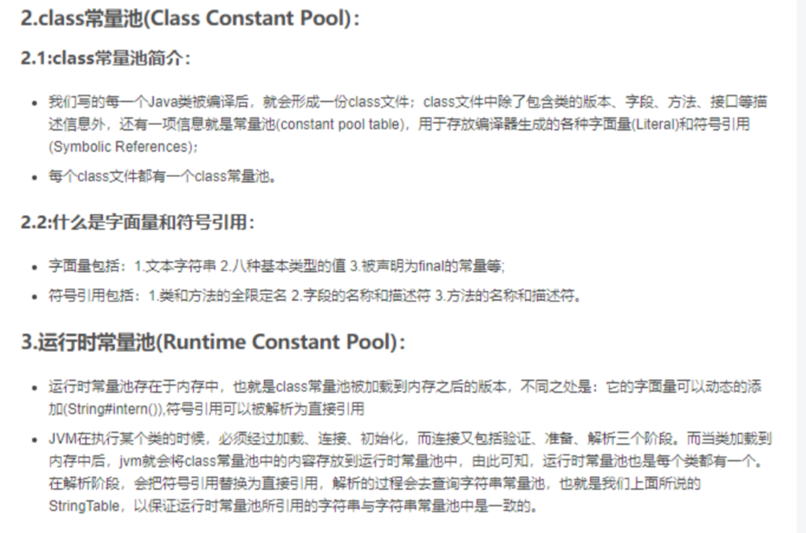

    - 常量池中包含：

      

##### 4.整数缓冲区、字符串常量池

```java
/**
     * @param
     * @return void
     * @Author: WP
     * @Date: 2021/12/3 9:26
     * @Version 1.0
     * @Description: 一次性解决==和equals()方法的区别，同时针对面试整理的面试题01
     * @UpdateUser WP
     */
    @Test
    public void testEquals01() {
        /*
        == vs equals()
        区别：
        1.== 关系运算符 equals()是Object类的方法。
        2.== 既可以比较基本类型，也可以比较引用类型，equals()仅可以比较引用类型。
            == 比较基本类型时直接对比目标的值，并返回结果
               比较引用类型，对比目标的内存地址，并返回结果
            equals()比较引用类型，默认是判断目标对象的内存地址，实际生产情况下指对比包装类及String类，因为上述类重写了继承Object类的方法，所以是对比目标对象的值
         */

        /**
         * 此处难点容易混淆的点也是 整数缓冲区和字符串常量池 的应用
         */

        int a = 100;
        int b = 100;
        int c = 200;
        int d = 200;
        System.out.println("--------------------------");
        System.out.println("== 对比基本类型");
        //true
        System.out.println(a == b);
        //true
        System.out.println(c == d);
        System.out.println("--------------------------");
        Integer integer01 = 100;
        Integer integer02 = 100;
        Integer integer03 = 200;
        Integer integer04 = 200;
        System.out.println("== 对比基本类型的包装类(一)");
        //true
        System.out.println(integer01 == integer02);
        //false
        System.out.println(integer03 == integer04);
        System.out.println("--------------------------");
        System.out.println("== 对比基本类型的包装类(二)");
        Integer integer05 = new Integer(100);
        Integer integer06 = new Integer(100);
        Integer integer07 = new Integer(200);
        Integer integer08 = new Integer(200);
        //false
        System.out.println(integer05 == integer06);
        //false
        System.out.println(integer05 == integer01);
        //false
        System.out.println(integer07 == integer08);
        //false
        System.out.println(integer07 == integer04);
        System.out.println("--------------------------");
        System.out.println("== 对比String类");
        String str01 = "Hello";
        String str02 = "He";
        String str03 = "llo";
        String str04 = str02 + str03;
        String str05 = "He" + "llo";
        String str06 = "He" + new String("llo");
        String str07 = new String("Hello");
        String str08 = new String("He") + new String("llo");
        //false
        System.out.println(str01 == str04);
        //true
        System.out.println(str01 == str05);
        //false
        System.out.println(str04 == str05);
        //false
        System.out.println(str01 == str06);
        //false
        System.out.println(str01 == str07);
        //false
        System.out.println(str01 == str08);
        //false
        System.out.println(str07 == str08);
        System.out.println("--------------------------");
    }
    
    /**
     * @Author: WP
     * @Date: 2021/12/3 10:49
     * @Version 1.0
     * @Description: 一次性解决==和equals()方法的区别，同时针对面试整理的面试题02
     * @UpdateUser WP
     * @param  
     * @return void
     */
    @Test
    public void testEquals02(){
        Integer integer01 = 100;
        Integer integer02 = 100;
        Integer integer03 = 200;
        Integer integer04 = 200;
        System.out.println("equals 判断基本类型的包装类01");
        //true
        System.out.println(integer01.equals(integer02));
        //true
        System.out.println(integer03.equals(integer04));

        System.out.println("--------------------------");
        System.out.println("equals 判断基本类型的包装类02");
        Integer integer05 = new Integer(100);
        Integer integer06 = new Integer(100);
        Integer integer07 = new Integer(200);
        Integer integer08 = new Integer(200);
        //true
        System.out.println(integer05.equals(integer06));
        //true
        System.out.println(integer07.equals(integer08));

        System.out.println("--------------------------");
        System.out.println("equals 判断String类");
        String str01 = "Hello";
        String str02 = "He";
        String str03 = "llo";
        String str04 = str02 + str03;
        String str05 = "He" + "llo";
        String str06 = "He" + new String("llo");
        String str07 = new String("Hello");
        String str08 = new String("He") + new String("llo");
        //true
        System.out.println(str01.equals(str04));
        //true
        System.out.println(str01.equals(str05));
        //true
        System.out.println(str01.equals(str06));
        //true
        System.out.println(str01.equals(str07));
        //true
        System.out.println(str01.equals(str08));
        //true
        System.out.println(str07.equals(str08));
        System.out.println("--------------------------");
    }
```

`2021年12月2日23:15:54整数缓冲区和字符串常量池的位置困扰我很久，也把我干懵过。`

- 两者都是用了池化技术（什么是池化技术？池化技术的好处？[(40条消息) Java池化技术_码农翻身之道的博客-CSDN博客_java池化技术](https://blog.csdn.net/weixin_43845116/article/details/107057624?spm=1001.2101.3001.6650.6&utm_medium=distribute.pc_relevant.none-task-blog-2~default~BlogCommendFromBaidu~default-6.no_search_link&depth_1-utm_source=distribute.pc_relevant.none-task-blog-2~default~BlogCommendFromBaidu~default-6.no_search_link)）
- jDK1.8 两者存放的位置：堆内存。

###### 1.整数缓冲区

- 涉及到基本类型的装箱拆箱，**常见的面试题就是比较**。同样这里考究==和equals（）的使用，常见的面试题的equals（）比较相对简单，因为Object类的部分子类是重写了equals（）方法。

- 具体的整数缓冲区参考上面的描述。

  IntegerCache中包含一个从-128到127的数组，使用`Integer integer = 100;`类似语句直接赋值的对象，在前面数组范围之内的便是直接引用整数缓冲区内的对象，因此无论使用==比较对象地址或者equals（）方法比较对象的值，结论都是True

  反之，赋值超过了这个数组范围，便会直接去new对象，此时使用==比较对象的内存地址则为false，无论值是否相等，同样使用了equals比较依旧是比较的值。（此处引申IDEA的智能提示：包装类型之间的相等判断应该用equals，而不是‘= =’，原因是包装类型及常用String中重写了equals（）方法，判断两个对象是否为同一个类，若为同类便直接比较对象的值，从而返回我们想要的结果。）


###### 2.字符串常量池

- 常见面试题：参考上方代码
- 这里引申出String类的问题：
  - 正确理解Java字符串常量池和intern（）方法：[理解Java字符串常量池与intern()方法 - 没课割绿地 - 博客园 (cnblogs.com)](https://www.cnblogs.com/justcooooode/p/7603381.html)
  - 为什么java中的String类是不可变的。：[为什么Java中的String类是不可变的? - 没课割绿地 - 博客园 (cnblogs.com)](https://www.cnblogs.com/justcooooode/p/7514863.html)

在使用==比较的时候，重点理解**使用字面量赋值创建String对象**和**使用new创建String对象**的区别

- 直接使用字面量赋值创建的时候，jvm会在编译期进行优化，从而直接生成新的String对象，存在字符串常量池中，同时如果之前存在值相等的字符串，直接生成引用即可，然后比较的话，便会返回true。

- 使用new创建String对象的时候，便是去内存中开辟新的地址，同时会在堆中和字符串常量池中创建两个对象，即使字符串常量池中存在值相等的字符串对象也会创建新的，因此，比较的话指定是false，因为内存地址是不同的。

  ==同样IDEA会提醒请勿使用此方法创建String对象以及使用包装类的new方法区创建包装类的对象，前者涉及多余创建对象，占用内存空间，后者涉及进行了多余的拆箱操作，增加程序运行时间，因此有简单的方式建议不要使用复杂的操作，此方式仅限面试了解。同时根据java代码规范以及IDEA的提示合理编写代码。==

#### 4.10java的三种jvm

●Sun公司HotSpot Java Hotspot™

●BEA JRockit

●IBM J9VM

我们学习都是: Hotspot

##### 1.**如何查看电脑的jvm版本？**

CMD命令：java -version：除了可以查看java环境的安装情况，java的版本，且可以查看jvm的版本信息

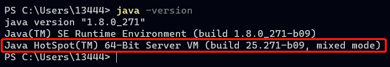

#### 4.11GC垃圾回收

注：醍醐灌顶一下：想来几个面试题

- JVM的内存模型和分区？请详细到每个区存放什么？
- 堆里的分区有哪些？
- GC的算法有哪些？
- 轻GC和重GC分别在什么时候发生？

##### 1.什么是GC？

每个程序员都遇到过内存溢出的情况，程序运行时，内存空间是有限的，那么如何及时的把不再使用的对象清除将内存释放出来，这就是GC要做的事。

GC：垃圾收集，英文全称为Garbage Collection，通常称为"GC"。

##### 2.GC的对象

GC需要回收的对象就是已经没有存活的对象。

判断一个对象是否存活常用的有两种方法：引用计数法和可达分析法。

1. 可达分析法：从GC Roots开始往下搜索，搜索走过的路称为引用链，当一个对象到GC Roots没有任何引用链时，则证明此对象是不可用的。

   > 在Java语言中，**GC Roots**包括：
   >
   > 虚拟机栈中引用的对象。
   >
   > 方法区中类静态属性实体引用的对象。
   >
   > 方法区中常量引用的对象。
   >
   > 本地方法栈中JNI引用的对象

2. 引用计数法：每一个对象均有一个引用计数的属性，新增一个引用时计数器加一，引用释放时计数减一，计数为0时可以回收。此方法简单，无法解决对象互相循环引用的问题。

##### 3.轻GC、重GC

`百度搜索的时候会发现很多的名词，还有full GC等等，结合整体环境判断同属于哪种，别被名字不同的翻译搞混了。`

###### 1.轻GC和重GC触发的条件

`伊甸园满了就触发轻GC，经过轻GC存活下来的就到了幸存者区，`

`幸存者区满之后意味着新生区也满了，则触发重GC，`

`经过重GC之后存活下来的就到了养老区`

###### 2.什么是MinorGC、MajorGC？

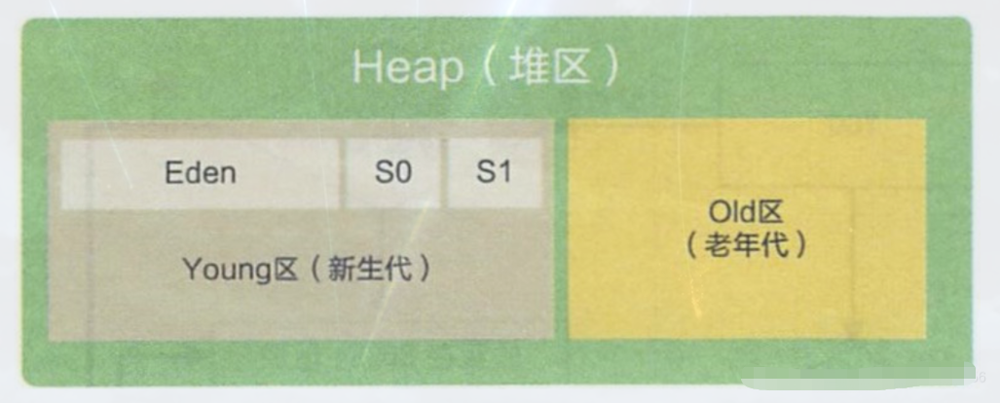

1. MinorGC 轻GC

   筛选清理流程：此时如果新生的对象无法在Eden区创建（Eden区无法容纳）就会触发一次Young GC，此时会将Survivor From区和Eden区的对象一起进行可达性分析，找出活跃的对象，将其复制到Survivor To区，并且将Eden区和Survivor From区的对象清空，这样那些筛选出的不可达的对象已经全部清除，同时将Survivor From区和Survivor To区交换。

   实现：复制算法

   同样以此反复Survivor区中的两个区也会频繁地交换。

   `注：番外：幸存区为什么有两个区？Survivor From区和Survivor To区`

   > 两个区的话会频繁地交换，从而对To区的垃圾回收，以及分代年龄的提升。

   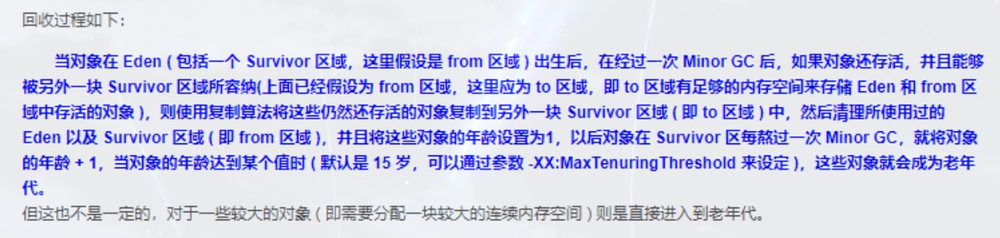

2. MajorGC（Full GC） 重GC

   发生在老年代的GC，基本上发生一次Major GC就会发生一次Minor GC，因此相当于进行了一次全局GC。但Major GC的速度往往会比Minor GC慢10倍。

   **筛选清理流程：**

   当Survivor满了或者新对象过大（超大数组）无法存放在Eden区中，触发Major GC清理老年代的空间，放得下的成功，清理之后仍然放不下OOM。

   

==重GC因为执行起来开销较大，应尽量避免==

- 避免频繁的FullGC
- 避免定义较大的对象（数组）
- 避免将过大的对象定义为静态变量

<u>**实现：标记清除算法**</u>


##### 4.GC常用算法

###### 4.1引用计数器法

原理：实际上是通过**在对象头中分配一个空间来保存该对象被引用的次数**。如果该对象被其它对象引用，则它的引用计数+1，如果删除对该对象的引用，那么它的引用计数就-1，当该对象的引用计数为0时，那么该对象就会被回收。GC会将计数器为0的对象C进行销毁。


###### 4.2复制算法（新生代）

1.复制算法的概念：将原有的**内存空间分为两块**，每次只使用其中一块，在垃圾回收时，将正在使用的内存中的**存活对象复制到未使用的内存块中**，之后，**清除正在使用的内存块中的所有对象**，**交换两个内存的角色**，完成垃圾回收。

- 与标记-清除算法相比，复制算法是一种相对高效的回收方法
- 不适用于存活对象较多的场合，如老年代（复制算法**适合做新生代的GC**）
- 幸存区from和幸存区to中谁空谁是to,我们会将to中的数据复制到from中保持to中数据为空;
- from和to区实际上为逻辑上的概念,保证to区一直空;
- 默认对象经过15次GC后还没有被销毁就会进入养老区.
  - -XX:MaxTenuringThreshold=15 设置进入老年代的存活次数条件

2.原理图


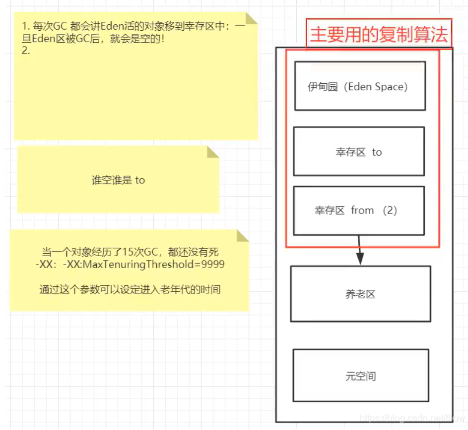

3.流程图展示：


- 好处：没有内存的碎片，内存效率高
- 坏处：
  - 浪费了内存空间，因为一个Survivor区永远都是空的
  - 假设对象100%存活，复制成本相当高

###### 4.3标记-清除算法

概念：标记-清除算法是现代垃圾回收算法的思想基础，标记-清除算法将垃圾回收分为两个阶段：标记阶段和清除阶段。

一种可行的实现是：在标记阶段，首先通过根节点，标记所有从根节点开始的可达对象。因此未被标记的对象就是未被引用的垃圾对象；然后在清除阶段，清除所有未被标记的对象。

流程示意图：

- 需要进行两次扫描：第一次扫描标记存活对象，第二次扫描清除未被标记的对象


优点：不需要额外空间，优化了复制算法

缺点：两次扫描，浪费了时间，会产生内存碎片

###### 4.4标记-压缩/整理算法（老年代）

概念：标记压缩算法适用于存活对象较多的场合，例如老年代。

它在做标记-清除算法的基础上做了一些优化。同标记-清除算法一样，标记-压缩算法也是从根节点开始，对于所有可达的对象进行一次标记，但之后它不是简单地清理未标记的对象，而是将所有存活的对象压缩到内存的一端；之后开始清除边界外的空间。

原理示意图：


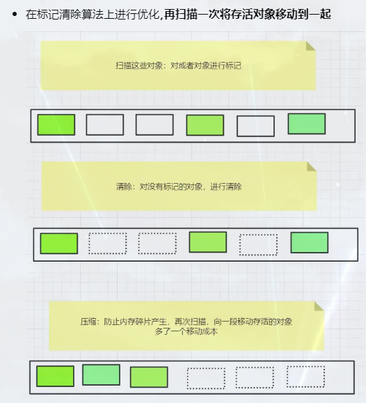

###### 4.5分代收集算法（新生代和老年代的GC）

当前商业使用的虚拟机采用的都是“分代收集算法”，这并不是什么新的思想，只是根据对象的存活周期的不同将内存化分为几块儿。

一般是把java堆分为新生代和老年代：短命对象化分为新生代，长命对象化分为老年代。

- 少量对象存活：适合复制算法，在新生代中，每次GC都有大批的对象死去，只有少量的存活，选择使用复制算法，只需要付出少量的存货成本便可以完成GC。
- 大量对象存活：适用于标记-清除/标记-压缩整理算法，在老年代，因为对象的存活率较高，没有额外的空间作为担保，就必须使用“标记-清理”或者“标记-整理”算法进行GC

`注:老年代的对象中，有一小部分是因为在新生代回收时。老年代作为担保进来的对象；绝大部分对象都是因为熬过很多次GC都没有回收而进入了老年代`

> ==补充==：Stop the world 
>
> 以上描述的在各种内存区域进行的各种算法活动，也就是垃圾回收过程中，经常涉及到对对象的挪动，进而导致需要对对象引用进行更新，为了保证引用更新的正确性，java会暂停所有的其他线程，这种情况叫做“Stop the world”，导致系统全局停顿。
>
> 
>
> Stop the world对系统性能存在影响，因此垃圾回收的一个原则便是尽可能减少“Stop the world”的时间
>
> 不同垃圾收集器的Stop-The-World情况，Serial、Parallel和CMS收集器均存在不同程度的Stop-The-Word情况；而即便是最新的**G1收集器**也不例外。
>
> 
>
> 全局停顿Stop the world引起的原因
>
> 1. GC原因
>
> - 老年代空间不足
> - 永久代（1.7）或者元空间（1.8）不足
> - System.gc（）方法的引用
> - CMS GC时出现promotion failed 和 concurrent mode failure
> - YoungGC时部分对象晋升老年代的内存平均值大于老年代的剩余空间
> - 有连续的大对象需要分配。
>
> 2. 人为原因
>
> - Dump线程
> - 死锁检查
> - 堆Dump
>
> 
>
> 全局停顿Stop the world的危害
>
> - 长时间服务停止，没有响应
> - 遇到HA系统，可能引起主备切换，严重危害生产环境
> - 新生代的GC时间比较短，危害较小，老年代的gc有时候短，有时候比较长几秒甚至100秒，堆越大花的时间会越长

###### 4.6可达分析算法

1. 实现的主要思路

   先找出一批根节点对象集合，作为GC Roots，可称为根节点枚举，然后从这批根节点出发，查找其引用关系，最后形成如下图反应对象间的依赖关系的图，若某些对象没有任何的引用链和GC roots相连，则证明这就是垃圾对象，是可以被垃圾回收器回收的。

   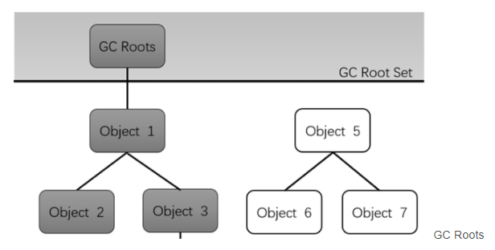

2. GC roots对象有哪些？

   - 虚拟机栈引用的对象（参数、局部变量等）
   - 方法区中的静态变量
   - 方法区中常量引用的对象
   - 本地方法栈中引用的对象
   - 被同步锁（Synchronized）持有的对象

3. 注意点：

   1.  就拿根节点枚举来说。整个方法区那么多类，常量信息，若一个一个来检查那些可做GC Roots，耗费的时间肯定不少，所以在HotSpot虚拟机中就通过一组OopMap的数据结构来记录哪些位置是引用，在类加载完成后就将哪个对象内什么偏移量上是什么数据类型计算出来，这样收集器就可以直接得知这些信息，而不需要依次遍历整个方法区。

##### 5.垃圾收集器

[(41条消息) 【JAVA核心】Java GC机制详解_老莫的博客-CSDN博客](https://blog.csdn.net/laomo_bible/article/details/83112622)

如果说收集算法是内存回收的方法论，垃圾收集器就是内存回收的具体实现

###### 5.1serial（串行）收集器

串行收集器是最古老，最稳定以及效率高的收集器

可能会产生较长的停顿，只使用一个线程去回收

-XX:+UseSerialGC

- 新生代、老年代使用串行回收
- 新生代复制算法
- 老年代标记-压缩

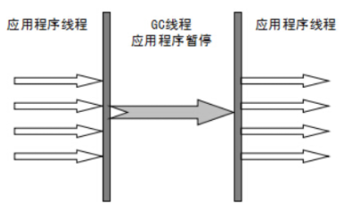

###### 5.2并行收集器

1. PartNew

   -XX:+UseParNewGC（new代表新生代，所以适用于新生代）

   - 新生代并行
   - 老年代串行

   Serial收集器新生代的并行版本

   在新生代回收时使用复制算法

   [多线程](https://so.csdn.net/so/search?from=pc_blog_highlight&q=多线程)，需要多核支持

   -XX:ParallelGCThreads 限制线程数量

   

2. paralle收集器

   类似ParNew 

   - 新生代复制算法 
   - 老年代标记-压缩 
   - 更加关注吞吐量 
   - -XX:+UseParallelGC 

   - 使用Parallel收集器+ 老年代串行

   -XX:+UseParallelOldGC 

   - 使用Parallel收集器+ 老年代并行

     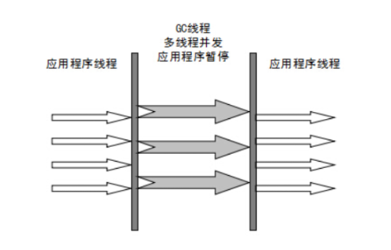

     

###### 5.3CMS收集器

- Concurrent Mark Sweep 并发标记清除（应用程序线程和GC线程交替执行）
- 使用标记-清除算法
- 并发阶段会降低吞吐量（停顿时间减少，吞吐量降低）
- 老年代收集器（新生代使用ParNew）
- -XX:+UseConcMarkSweepGC

```java
CMS运行过程比较复杂，着重实现了标记的过程，可分为

1. 初始标记（会产生全局停顿）
	根可以直接关联到的对象
	速度快
2. 并发标记（和用户线程一起） 
	主要标记过程，标记全部对象
3. 重新标记 （会产生全局停顿） 
	由于并发标记时，用户线程依然运行，因此在正式清理前，再做修正
4. 并发清除（和用户线程一起） 
	基于标记结果，直接清理对象
```

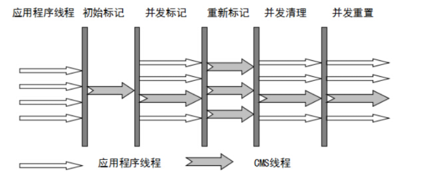

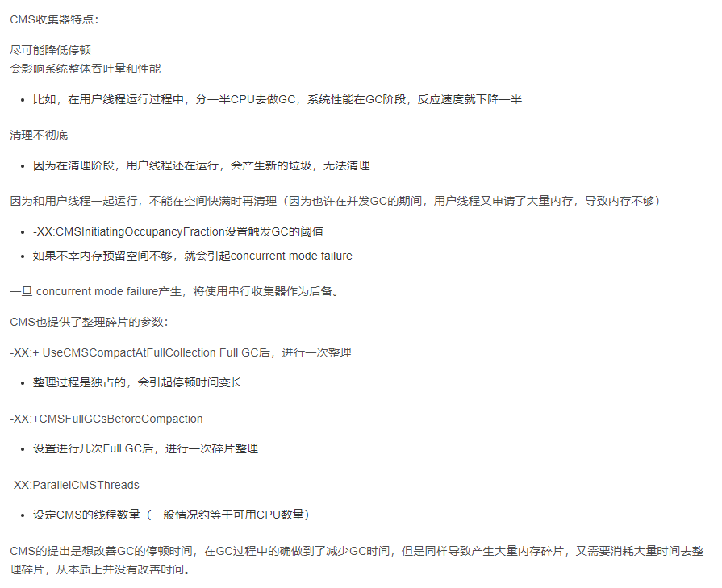

###### 5.4G1收集器

G1是目前技术发展的最前沿成果之一，HotSpot开发团队赋予它的使命是未来可以替换掉JDK1.5中发布的CMS收集器。

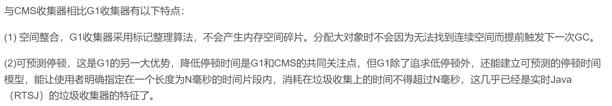

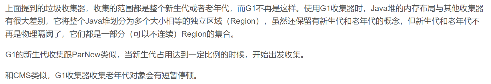

==**<u>*G1收集器的工作步骤：*</u>**==

(1)标记阶段，首先初始标记(Initial-Mark),这个阶段是停顿的(Stop the World Event)，并且会触发一次普通Mintor GC。对应GC log:GC pause (young) (inital-mark)

(2)Root Region Scanning，程序运行过程中会回收survivor区(存活到老年代)，这一过程必须在young GC之前完成。

(3)Concurrent Marking，在整个堆中进行并发标记(和应用程序并发执行)，此过程可能被young GC中断。在并发标记阶段，若发现区域对象中的所有对象都是垃圾，那个这个区域会被立即回收(图中打X)。同时，并发标记过程中，会计算每个区域的对象活性(区域中存活对象的比例)。


(4)Remark, 再标记，会有短暂停顿(STW)。再标记阶段是用来收集 并发标记阶段 产生新的垃圾(并发阶段和应用程序一同运行)；G1中采用了比CMS更快的初始快照算法:snapshot-at-the-beginning (SATB)。

(5)Copy/Clean up，多线程清除失活对象，会有STW。G1将回收区域的存活对象拷贝到新区域，清除Remember Sets，并发清空回收区域并把它返回到空闲区域链表中。


(6)复制/清除过程后。回收区域的活性对象已经被集中回收到深蓝色和深绿色区域。

##### 6.finalize（）方法

finalize：完成

###### 6.1finalize（）方法的作用

(1)finalize()是Object的protected方法，**子类可以覆盖该方法以实现资源清理工作**，**GC在回收对象之前调用该方法**。

(2)finalize()与C++中的析构函数不是对应的。C++中的析构函数调用的时机是确定的（对象离开作用域或delete掉），**但Java中的finalize的调用具有不确定性*

(3)不建议用finalize方法完成“非内存资源”的清理工作，但建议用于：① 清理本地对象(通过JNI创建的对象)；② 作为确保某些非内存资源(如Socket、文件等)释放的一个补充：在finalize方法中显式调用其他资源释放方法。其原因可见下文[finalize的问题]

###### 6.2finalize（）方法的问题

(1)一些与finalize相关的方法，由于一些致命的缺陷，已经被废弃了，如System.runFinalizersOnExit()方法、Runtime.runFinalizersOnExit()方法

(2)System.gc()与System.runFinalization()方法增加了finalize方法执行的机会，但不可盲目依赖它们

(3)Java语言规范并不保证finalize方法会被及时地执行、而且根本不会保证它们会被执行

(4)finalize方法可能会带来性能问题。因为JVM通常在单独的低优先级线程中完成finalize的执行

(5)对象再生问题：finalize方法中，可将待回收对象赋值给GC Roots可达的对象引用，从而达到对象再生的目的

(6)finalize方法至多由GC执行一次(用户当然可以手动调用对象的finalize方法，但并不影响GC对finalize的行为)

###### 6.3finalize（）方法的执行过程（生命周期）

注：方法重写又称为方法覆盖。

通俗理解：当对象通过可达性分析法分析为不可达，垃圾回收器就判断这个对象是否重写了finalize()方法，若没有重写，直接回收，否则因为不在引用链上了，便垂死挣扎一下，放入一个低优先级的执行队列，用于执行该finalize()方法，算是一个对象的托底方法，执行完毕之后，若在引用链上，则对象复活，否则直接回收。

(1) `首先，大致描述一下finalize流程：当对象变成(GC Roots)不可达时，GC会判断该对象是否覆盖了finalize方法，若未覆盖，则直接将其回收。否则，若对象未执行过finalize方法，将其放入F-Queue队列，由一低优先级线程执行该队列中对象的finalize方法。执行finalize方法完毕后，GC会再次判断该对象是否可达，若不可达，则进行回收，否则，对象“复活”。`
(2) 具体的finalize流程：
对象可由两种状态，涉及到两类状态空间，一是终结状态空间 F = {unfinalized, finalizable, finalized}；二是可达状态空间 R = {reachable, finalizer-reachable, unreachable}。

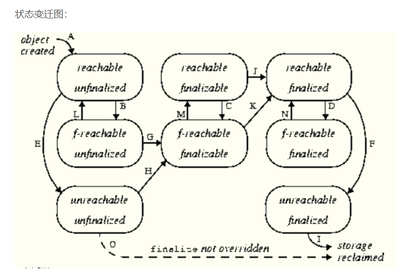

**finalize方法的使用总结：**

- 经验：**避免使用finalize()**，操作不慎可能导致错误。
- 优先级低，何时被调用，不确定

何时发生GC不确定，自然也就不知道finalize方法什么时候执行

- 如果要使用finalize去释放资源，我们可以使用try-catch-finally来替代它

#### 4.12JMM：java内存模型

##### 1.什么是JMM？

##### 2.JMM的作用？

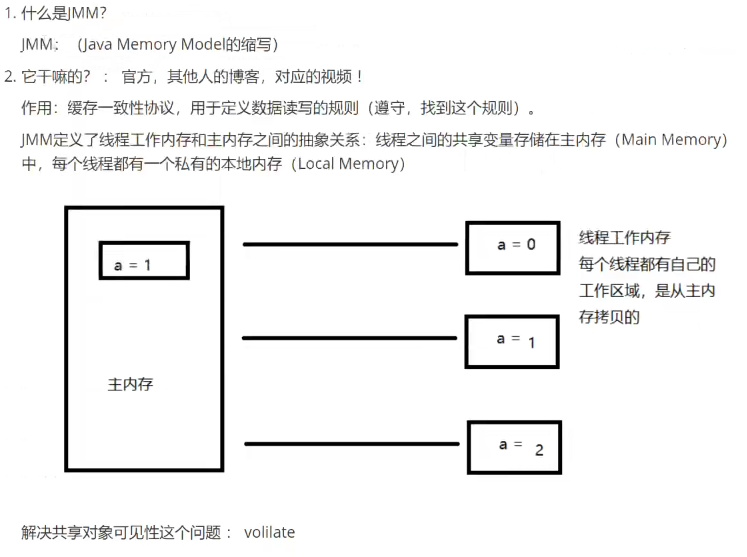


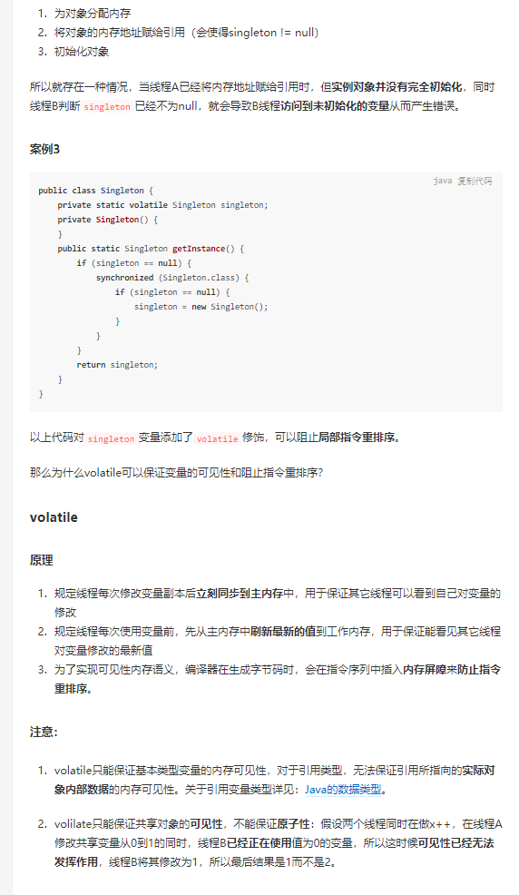

#### ==4.13JVM调优（重中之重）==

JVM调优调的是稳定性。稳定性是实现其他一切的基础。

##### 1.调优辅助工具

MAT, Jprofiler

##### 2.辅助工具的作用

●分析Dump内存文件,快速定位内存泄露;

●获得堆中的数据

●获得大的对象~

##### 3.Jprofiler的使用

###### 3.1博客测试

1. 源码

```java
public static void main(String[] args) {
String s = "";
while (true) {
s += "11111111111111111111111111111111111111111111111111111";
}
}
```

2	设置项目VM的参数


==命令参数详解==
`// -Xms设置初始化内存分配大小/164
// -Xmx设置最大分配内存，默以1/4
// -XX: +PrintGCDetails // 打印GC垃圾回收信息
// -XX: +HeapDumpOnOutOfMemoryError //oom DUMP`

控制台输出：


3. 寻错

在一个项目中，突然出现了OOM故障,那么该如何排除 研究为什么出错~

●能够看到代码第几行出错:内存快照分析工具，MAT, Jprofiler

●Dubug, 一行行分析代码

###### 3.2使用Jprofiler

版本：12.0.4

效果图：


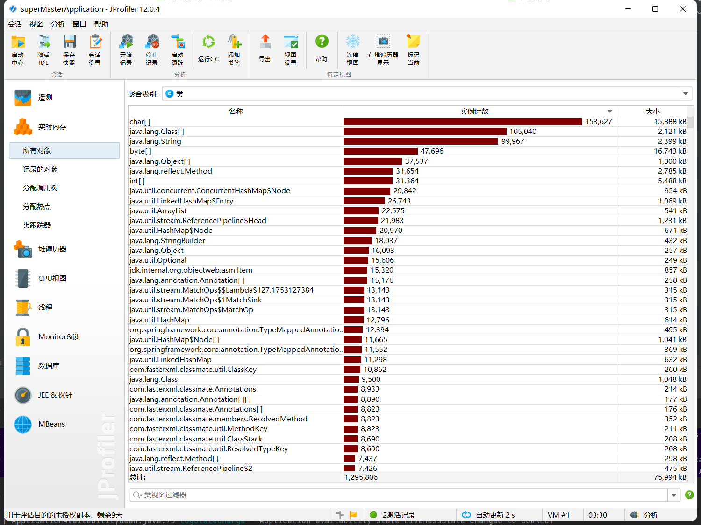

1. 安装教程（结合IDEA）

   ```xml
   https://www.cnblogs.com/jpfss/p/11057440.html
   ```

2. 玄学使用（Crack）

3. 根据内存快照分析

   1. 制作内存快照
   2. 查看内存快照
   3. 思考：生产环境如何查看OOM？如何拿到内存快照？

##### 4.虚拟机配置详解

###### 4.1虚拟机配置


###### 4.2堆内存分配原则


### 5.java语言特性

#### 5.1Lambda函数式编程

##### 1.为什么使用Lambda编程

1. 避免匿名内部类定义过多
2. 其实质属于函数式编程的概念
3. 可以让代码看起来很简洁
4. 去掉了一堆没有意义的代码，只留下核心的逻辑

##### 2.函数式接口

Functional Interface（函数式接口）

定义：任何接口，如果只包含唯一一个抽象方法，那么它就是一个函数式接口。

对于函数式接口，可以通过lambda表达式来创建该接口的对象。

```java
public class TestLambda1 {
    //2.静态内部类
    static class Love implements ILove {
        public void ILove(int a) {
            System.out.println("i like lambda" + a);
        }
    }
    public static void main(String[] args) {
      Love love=new Love();
      love.ILove(1);
      Love love1=new Love();
      love1.ILove(2);
        class Love implements ILove {
        //3.局部内部类
            public void ILove(int a) {
                System.out.println("i like lambda" + a);
            }
        }
        Love love2 = new Love();
        love2.ILove(3);
        //4.匿名内部类
        ILove iLove=new ILove() {
            @Override
            public void ILove(int a) {
                System.out.println("i like lambda" + a);
            }
        };
      iLove.ILove(4);
      //5.lambda表达式
        ILove iLove1=(int a)->{
            System.out.println("i like lambda" + a);
        };
        iLove1.ILove(5);
    }
}
//定义一个接口,只有一个方法，函数式接口
interface ILove{
    void ILove(int a);
}
    //1.普通实现
class Love implements ILove {
        @Override
    public void ILove(int a) {
        System.out.println("i like lambda" + a);
    }
}
```

##### 3.总结

1. lambda表达式只能有一行代码的情况下才能简化为一行，如果有多行，那么就用代码块包裹
2. 前提是接口为函数式接口
3. 多个参数也可以去掉参数类型，要去掉就都去掉，必须加上括号。

#### 5.2语法糖

```xml
参考链接：https://www.cnblogs.com/qingshanli/p/9375040.html#_label7
```

##### 1.什么是语法糖？

语法糖：Syntactic sugar

也译为糖衣语法，是由英国计算机科学家彼得·兰丁发明的一个术语，指计算机语言中添加的某种语法，这种语法对语言的功能没有影响，但是更方便程序员使用。语法糖让程序更加简洁，有更高的可读性。

##### 2.语法糖的过程

- 语法糖仅存在于编译期间
- 在编译器将.java源文件编译成.class字节码文件时，会进行**解语法糖的操作**，还原成最原始的基础语法结构。

##### 3.常见的几种语法糖

1. 字符串拼接
2. lambda表达式
3. 增强for循环
4. 自动装箱和拆箱
5. 泛型擦除
6. 内部类
7. 枚举
8. 可变参数
9. 条件编译
10. 断言
11. try-with-resources
12. 枚举与Switch语句
13. 字符串与Switch语句
14. JDK10的局部变量类型判断

#### 5.3Optional

Optional：可选择的。

可参考：SuperMaster中的OptionalUtil

#### 5.4Stream流式编程

### 6.java反编译

#### 6.1为什么进行反编译

java编译是将java源码编译成java字节码文件的过程。

java反编译是java字节码“翻译”成java源码的过程。

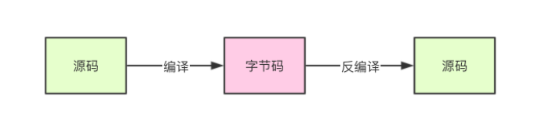

其中为什么要反编译？

java语法糖使用起来去极大减轻了程序员的负担，但是探究其原理只能去看源码。

也就是大家俗称的看源码。源码可以更加细节地展示出jvm在运行中所做的操作，可以看到程序的处理细节。

同样，获取的jar包中的结构也全部是.class字节码文件。


例子：源码文件和反编译后的文件:为了探究try-with-resource

源文件：

```java
import java.io.IOException;
import java.io.OutputStream;
import java.net.Socket;

/**
 * @Author Roc
 * @Date 2021/12/13 9:44
 * @Version 1.0.0
 * @ClassName Hello.java
 * @Description 对比Try-catch-finally和Try-with-resource
 * @UpdateUser Roc
 */
public class Hello {
    /**
     * 传统的Try-catch-finally
     */
    public static void main(String[] args) {
        Socket socket = null;
        OutputStream outputStream = null;
        try {
            socket = new Socket();
            outputStream = socket.getOutputStream();
            String str = "你好";
            outputStream.write(str.getBytes(), 0, str.getBytes().length);
            System.out.println(outputStream.toString());
        } catch (Exception e) {
            e.printStackTrace();
        } finally {
            if (outputStream != null) {
                try {
                    outputStream.close();
                } catch (IOException e) {
                    e.printStackTrace();
                }
            }
            if (socket != null){
                try{
                    socket.close();
                }catch (IOException e){
                    e.printStackTrace();
                }
            }
        }
    }

    /**
     * 使用Try-with-resource
     */
    public void testTryWithResource() {
        try (
                Socket socket = new Socket();
                OutputStream outputStream = socket.getOutputStream();
        ) {
            String str = "你好";
            outputStream.write(str.getBytes(), 0, str.getBytes().length);
            System.out.println(outputStream.toString());
        } catch (Exception e) {
            e.printStackTrace();
        }
    }
}
```

反编译后的源码文件：

```java
//
// Source code recreated from a .class file by IntelliJ IDEA
// (powered by FernFlower decompiler)
//

import java.io.IOException;
import java.io.OutputStream;
import java.net.Socket;

public class Hello {
    public Hello() {
    }

    public static void main(String[] var0) {
        Socket var1 = null;
        OutputStream var2 = null;

        try {
            var1 = new Socket();
            var2 = var1.getOutputStream();
            String var3 = "你好";
            var2.write(var3.getBytes(), 0, var3.getBytes().length);
            System.out.println(var2.toString());
        } catch (Exception var16) {
            var16.printStackTrace();
        } finally {
            if (var2 != null) {
                try {
                    var2.close();
                } catch (IOException var15) {
                    var15.printStackTrace();
                }
            }

            if (var1 != null) {
                try {
                    var1.close();
                } catch (IOException var14) {
                    var14.printStackTrace();
                }
            }

        }

    }

    public void testTryWithResource() {
        try {
            Socket var1 = new Socket();
            Throwable var2 = null;

            try {
                OutputStream var3 = var1.getOutputStream();
                Throwable var4 = null;

                try {
                    String var5 = "你好";
                    var3.write(var5.getBytes(), 0, var5.getBytes().length);
                    System.out.println(var3.toString());
                } catch (Throwable var29) {
                    var4 = var29;
                    throw var29;
                } finally {
                    if (var3 != null) {
                        if (var4 != null) {
                            try {
                                var3.close();
                            } catch (Throwable var28) {
                                var4.addSuppressed(var28);
                            }
                        } else {
                            var3.close();
                        }
                    }

                }
            } catch (Throwable var31) {
                var2 = var31;
                throw var31;
            } finally {
                if (var1 != null) {
                    if (var2 != null) {
                        try {
                            var1.close();
                        } catch (Throwable var27) {
                            var2.addSuppressed(var27);
                        }
                    } else {
                        var1.close();
                    }
                }

            }
        } catch (Exception var33) {
            var33.printStackTrace();
        }

    }
}
```

#### 6.2使用本地工具进行反编译

##### 6.2.1使用IDEA反编译

在idea打开的项目结构上能看到target包，里面全是编译好的.class文件以及所需要的jar包文件，因为idea本身的强大，直接可以打开.class文件，同样在其他地方编译的.class文件也可以选择用idea打开。

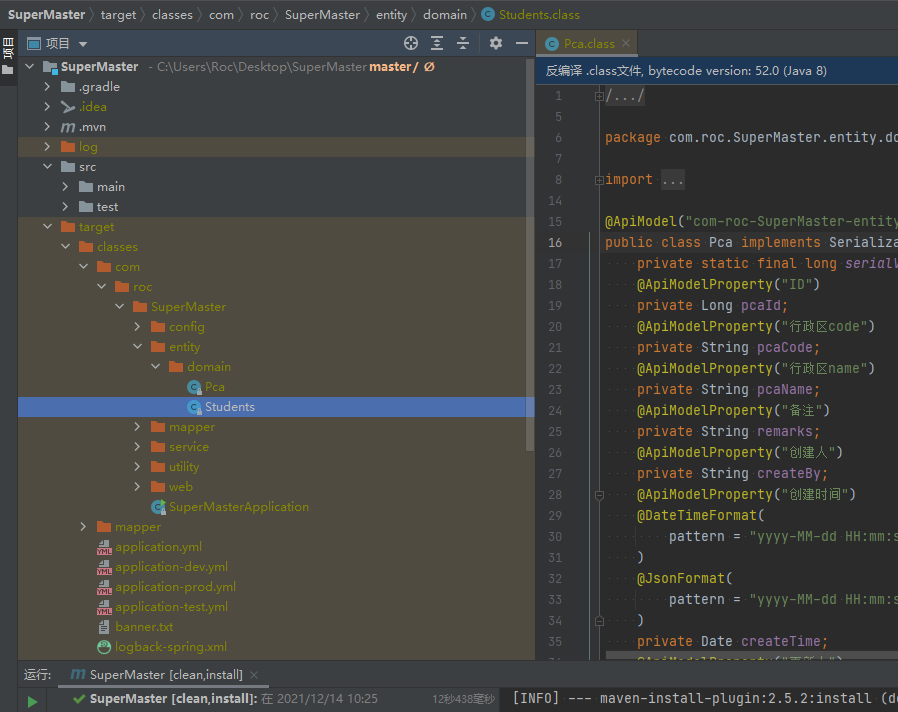

##### 6.2.2使用jd-gui-Windows反编译

轻量化的java反编译工具，用于学习源码再合适不过了。

免安装，直接打开目标文件，可在Windows设置中选择使用jd直接打开.class文件。


可直接查看结构：

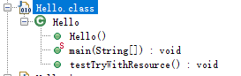

同样也可以直接可以打开jar包显示整个jar包的目录结构


##### 6.2.3使用CMD命令反编译

em，暂不推荐使用

1. javac -encoding UTF-8 目标文件.java

2. javap：java自带的class分解器以及反编译工具

   1. 通过命令可以获取class的属性等信息
   2. 通过命令可以将class文件反编译到目标文件夹

   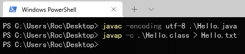


#### 6.3使用在线工具进行反编译

##### 6.3.1：Decompiler.com（推荐）

[Java decompiler online / APK decompiler - Decompiler.com](https://www.decompiler.com/)

##### 6.3.2：javadecompilers.com

[Java decompiler online (javadecompilers.com)](http://www.javadecompilers.com/)

