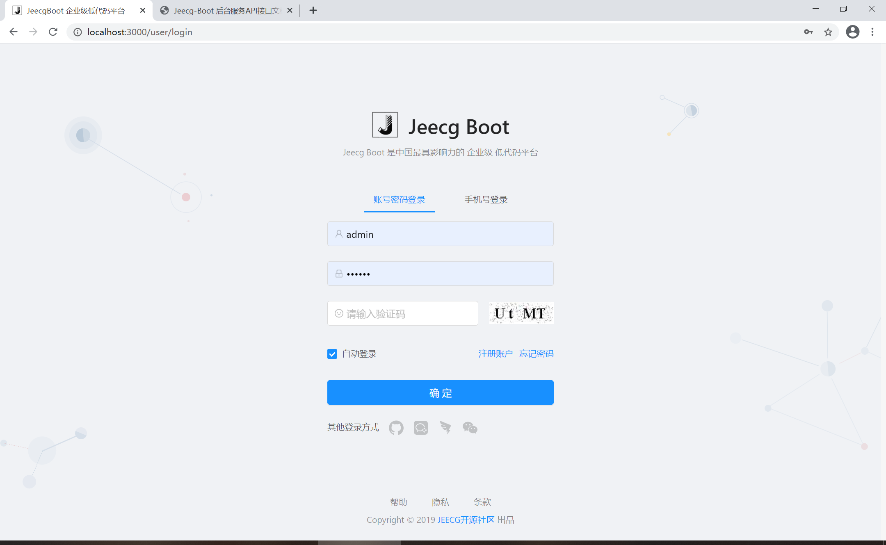

# LowCode

## 1.什么是低代码开发平台？

链接：https://www.zhihu.com/question/363277641

低代码开发平台（LCDP）是无需编码（0代码）或通过少量代码就可以快速生成应用程序的开发平台。通过可视化进行应用程序开发的方法（参考可视编程语言），使具有不同经验水平的开发人员可以通过图形化的用户界面，使用拖拽组件和模型驱动的逻辑来创建网页和移动应用程序。

## 2.低代码开发平台有哪些？

1、钉钉宜搭（低代码开发平台），阿里云公司旗下产品，于2019年3月上线，流程较简单，阿里生态圈。

2、织信Informat（低/零代码开发平台），由深圳基石协作科技有限公司自主研发，公司成立于2019年，团队99人，注册资本2000万，法人郭闫闫，开发是程序语言是Java，简单易上手，界面较友好舒适，关键还免费。

3、奥哲（低代码开发平台），由深圳奥哲网络科技有限公司自主研发，公司成立于2010年，团队285人，注册资本2000万，法人徐平俊，钉钉参股，深度集成。

4、思泉云（低代码开发平台），由深圳市思泉软件有限公司研发，公司成立于2004年，团队26人，注册资本500万，法人雷文成，.Net平台，工作流功能强大。

5、JEPaas（低代码开发平台），由北京凯特伟业科技有限公司研发，公司成立于2008年成立，团队45人，注册资本1000万，公司法人闫建伟，开发是程序语言是Java，有开源版。

6、炎黄盈动（低代码开发平台），由北京炎黄盈动科技发展有限责任公司研发，公司成立于2003年，团队136人，注册资本2105万，法人刘金柱，文档详细，老板Java大牛。

7、七巧（低代码开发平台），由广东道一信息技术股份有限公司研发，公司成立于2004年，团队753人，注册资本1519万，法人陈侦，腾讯参股，企业微信集成。

8、JEECG（低代码开发平台），由北京国炬信息技术有限公司研发，公司成立于2015年，团队8人，注册资金100万，法人张代浩，人气开源软件，功能较简单。

9、明道云（低/零代码开发平台），由上海万企明道软件有限公司研发，公司成立于2013年，团队38人，注册资金64万，法人任向晖，docker发布，用到程序技术比较多，react、java、C#、nodejs。

10、简道云（低代码开发平台），由帆软软件有限公司研发，公司成立于2018年成立，团队883人，注册5000万，法人薛爱华，属于是钉钉集成，主营业务BI报表。

## 3.JeecgBoot低代码开发平台（前后端分离版本）

### 3.1什么是JeecgBoot？

JeecgBoot 是一款基于代码生成器的`低代码`开发平台！前后端分离架构 SpringBoot2.x，SpringCloud，Ant
Design&Vue，Mybatis-plus，Shiro，JWT，支持微服务。强大的代码生成器让前后端代码一键生成，实现低代码开发。

### 3.2JeecgBoot技术文档

- 技术官网： [http://www.jeecg.com](http://www.jeecg.com/)
- 开发文档： [http://doc.jeecg.com](http://doc.jeecg.com/)
- 微服务启动： [单体升级为微服务启动文档2.4+](http://doc.jeecg.com/2043906)
- 在线演示 ： [http://boot.jeecg.com](http://boot.jeecg.com/)

- 视频教程 ：[JeecgBoot入门视频](http://www.jeecg.com/doc/video)
- 常见问题： [入门常见问题Q&A](http://jeecg.com/doc/qa)
- 更新日志： [版本日志](http://www.jeecg.com/doc/log)

### 3.3为什么使用JeecgBoot？

目前看得懂的！2021年4月9日15:49:09

1. 前后端分离：Springboot+Mybatis+antd
2. 支持微服务SpringCloud
3. 代码生成器？
4. 简易的Excel导入导出
5. 数据权限
6. 页面校验（必填项、数字校验、金额校验、时间校验等）
7. 分布式文件服务，如阿里OSS等
8. 主流数据库可兼容
9. 集成工作流Activiti
10. 多数据源
11. 单点登录
12. 专业接口对接机制，采用restful接口方式，集成swagger-ui
13. 消息中心
14. 集成WebSocket消息通知规则
15. 国际化方案
16. maven

#### 官方原生的理由

- 1.采用最新主流前后分离框架（Springboot+Mybatis+antd），容易上手; 代码生成器依赖性低,灵活的扩展能力，可快速实现二次开发;
- 2.支持微服务SpringCloud Alibaba(Nacos、Gateway、Sentinel、Skywalking)，提供切换机制支持单体和微服务自由切换
- 3.开发效率高,采用代码生成器，单表、树列表、一对多、一对一等数据模型，增删改查功能一键生成，菜单配置直接使用；
- 4.代码生成器提供强大模板机制，支持自定义模板，目前提供四套风格模板（单表两套、树模型一套、一对多三套）
- 5.代码生成器非常智能，在线业务建模、在线配置、所见即所得支持23种类控件，一键生成前后端代码，大幅度提升开发效率，不再为重复工作发愁。
- 6.低代码能力：Online在线表单（无需编码，通过在线配置表单，实现表单的增删改查，支持单表、树、一对多、一对一等模型，实现人人皆可编码）
- 7.低代码能力：Online在线报表（无需编码，通过在线配置方式，实现数据报表，可以快速抽取数据，减轻开发压力，实现人人皆可编码）
- 8.低代码能力：Online在线图表（无需编码，通过在线配置方式，实现曲线图，柱状图，数据报表等，支持自定义排版布局，实现人人皆可编码）
- 9.封装完善的用户、角色、菜单、组织机构、数据字典、在线定时任务等基础功能，支持访问授权、按钮权限、数据权限等功能
- 10.常用共通封装，各种工具类(定时任务,短信接口,邮件发送,Excel导入导出等),基本满足80%项目需求
- 11.简易Excel导入导出，支持单表导出和一对多表模式导出，生成的代码自带导入导出功能
- 12.集成简易报表工具，图像报表和数据导出非常方便，可极其方便的生成图形报表、pdf、excel、word等报表；
- 13.采用前后分离技术，页面UI风格精美，针对常用组件做了封装：时间、行表格控件、截取显示控件、报表组件，编辑器等等
- 14.查询过滤器：查询功能自动生成，后台动态拼SQL追加查询条件；支持多种匹配方式（全匹配/模糊查询/包含查询/不匹配查询）；
- 15.数据权限（精细化数据权限控制，控制到行级，列表级，表单字段级，实现不同人看不同数据，不同人对同一个页面操作不同字段
- 16.页面校验自动生成(必须输入、数字校验、金额校验、时间空间等);
- 17.支持SAAS服务模式，提供SaaS多租户架构方案。
- 18.分布式文件服务，集成minio、阿里OSS等优秀的第三方，提供便捷的文件上传与管理，同时也支持本地存储。
- 19.主流数据库兼容，一套代码完全兼容Mysql、Postgresql、Oracle三大主流数据库。
- 20.集成工作流activiti，并实现了只需在页面配置流程转向，可极大的简化bpm工作流的开发；用bpm的流程设计器画出了流程走向，一个工作流基本就完成了，只需写很少量的java代码；
- 21.低代码能力：在线流程设计，采用开源Activiti流程引擎，实现在线画流程,自定义表单,表单挂靠,业务流转
- 22.多数据源：及其简易的使用方式，在线配置数据源配置，便捷的从其他数据抓取数据；
- 23.提供单点登录CAS集成方案，项目中已经提供完善的对接代码
- 24.低代码能力：表单设计器，支持用户自定义表单布局，支持单表，一对多表单、支持select、radio、checkbox、textarea、date、popup、列表、宏等控件
- 25.专业接口对接机制，统一采用restful接口方式，集成swagger-ui在线接口文档，Jwt token安全验证，方便客户端对接
- 26.接口安全机制，可细化控制接口授权，非常简便实现不同客户端只看自己数据等控制
- 27.高级组合查询功能，在线配置支持主子表关联查询，可保存查询历史
- 28.提供各种系统监控，实时跟踪系统运行情况（监控 Redis、Tomcat、jvm、服务器信息、请求追踪、SQL监控）
- 29.消息中心（支持短信、邮件、微信推送等等）
- 30.集成Websocket消息通知机制
- 31.移动自适应效果优秀，提供APP发布方案：
- 32.支持多语言，提供国际化方案；
- 33.数据变更记录日志，可记录数据每次变更内容，通过版本对比功能查看历史变化
- 34.平台UI强大，实现了移动自适应
- 35.平台首页风格，提供多种组合模式，支持自定义风格
- 36.提供简单易用的打印插件，支持谷歌、火狐、IE11+ 等各种浏览器
- 37.示例代码丰富，提供很多学习案例参考
- 38.采用maven分模块开发方式
- 39.支持菜单动态路由
- 40.权限控制采用 RBAC（Role-Based Access Control，基于角色的访问控制）
- 41.提供新行编辑表格JVXETable，轻松满足各种复杂ERP布局，拥有更高的性能、更灵活的扩展、更强大的功能

### 3.4技术架构

#### 3.4.1单体架构

##### 3.4.1.1开发环境

- 语言：Java 8
- IDE(JAVA)： IDEA / Eclipse安装lombok插件
- IDE(前端)： WebStorm 或者 IDEA
- 依赖管理：Maven
- 数据库：MySQL5.7+ & Oracle 11g & Sqlserver2017
- 缓存：Redis

##### 3.4.1.2后端

- 基础框架：Spring Boot 2.3.5.RELEASE
- 微服务框架： Spring Cloud Alibaba 2.2.3.RELEASE
- 持久层框架：Mybatis-plus 3.4.1
- 安全框架：Apache Shiro 1.7.0，Jwt 3.11.0
- 微服务技术栈：Spring Cloud Alibaba、Nacos、Gateway、Sentinel、Skywalking
- 数据库连接池：阿里巴巴Druid 1.1.22
- 缓存框架：redis
- 日志打印：logback
- 其他：fastjson，poi，Swagger-ui，quartz, lombok（简化代码）等。

##### 3.4.1.3前端

- [Vue 2.6.10](https://cn.vuejs.org/),[Vuex](https://vuex.vuejs.org/zh/),[Vue Router](https://router.vuejs.org/zh/)
- [Axios](https://github.com/axios/axios)
- [ant-design-vue](https://vuecomponent.github.io/ant-design-vue/docs/vue/introduce-cn/)
- [webpack](https://www.webpackjs.com/),[yarn](https://yarnpkg.com/zh-Hans/)
- [vue-cropper](https://github.com/xyxiao001/vue-cropper) - 头像裁剪组件
- [@antv/g2](https://antv.alipay.com/zh-cn/index.html) - Alipay AntV 数据可视化图表
- [Viser-vue](https://viserjs.github.io/docs.html#/viser/guide/installation) - antv/g2 封装实现
- eslint，[@vue/cli 3.2.1](https://cli.vuejs.org/zh/guide)
- vue-print-nb - 打印

#### 3.4.2微服务架构

1、服务注册和发现 Nacos √

2、统一配置中心 Nacos √

3、路由网关 gateway(三种加载方式) √

4、分布式 http feign √

5、熔断和降级 Sentinel √

6、分布式文件 Minio、阿里OSS √

7、统一权限控制 JWT + Shiro √

8、服务监控 SpringBootAdmin√

9、链路跟踪 Skywalking [参考文档](https://www.kancloud.cn/zhangdaiscott/jeecgcloud/1771670)

10、消息中间件 RabbitMQ √

11、分布式任务 xxl-job √

12、分布式事务 Seata

13、分布式日志 elk + kafka

14、支持 docker-compose、k8s、jenkins

15、CAS 单点登录 √

16、路由限流 √

##### 3.4.2.1微服务架构图


### 3.5功能模块

```xml
├─系统管理
│  ├─用户管理
│  ├─角色管理
│  ├─菜单管理
│  ├─权限设置（支持按钮权限、数据权限）
│  ├─表单权限（控制字段禁用、隐藏）
│  ├─部门管理
│  ├─我的部门（二级管理员）
│  └─字典管理
│  └─分类字典
│  └─系统公告
│  └─职务管理
│  └─通讯录
│  └─多租户管理
├─消息中心
│  ├─消息管理
│  ├─模板管理
├─代码生成器(低代码)
│  ├─代码生成器功能（一键生成前后端代码，生成后无需修改直接用，绝对是后端开发福音）
│  ├─代码生成器模板（提供4套模板，分别支持单表和一对多模型，不同风格选择）
│  ├─代码生成器模板（生成代码，自带excel导入导出）
│  ├─查询过滤器（查询逻辑无需编码，系统根据页面配置自动生成）
│  ├─高级查询器（弹窗自动组合查询条件）
│  ├─Excel导入导出工具集成（支持单表，一对多 导入导出）
│  ├─平台移动自适应支持
├─系统监控
│  ├─Gateway路由网关
│  ├─性能扫描监控
│  │  ├─监控 Redis
│  │  ├─Tomcat
│  │  ├─jvm
│  │  ├─服务器信息
│  │  ├─请求追踪
│  │  ├─磁盘监控
│  ├─定时任务
│  ├─系统日志
│  ├─消息中心（支持短信、邮件、微信推送等等）
│  ├─数据日志（记录数据快照，可对比快照，查看数据变更情况）
│  ├─系统通知
│  ├─SQL监控
│  ├─swagger-ui(在线接口文档)
│─报表示例
│  ├─曲线图
│  └─饼状图
│  └─柱状图
│  └─折线图
│  └─面积图
│  └─雷达图
│  └─仪表图
│  └─进度条
│  └─排名列表
│  └─等等
│─大屏模板
│  ├─作战指挥中心大屏
│  └─物流服务中心大屏
│─常用示例
│  ├─自定义组件
│  ├─对象存储(对接阿里云)
│  ├─JVXETable示例（各种复杂ERP布局示例）
│  ├─单表模型例子
│  └─一对多模型例子
│  └─打印例子
│  └─一对多TAB例子
│  └─内嵌table例子
│  └─常用选择组件
│  └─异步树table
│  └─接口模拟测试
│  └─表格合计示例
│  └─异步树列表示例
│  └─一对多JEditable
│  └─JEditable组件示例
│  └─图片拖拽排序
│  └─图片翻页
│  └─图片预览
│  └─PDF预览
│  └─分屏功能
│─封装通用组件	
│  ├─行编辑表格JEditableTable
│  └─省略显示组件
│  └─时间控件
│  └─高级查询
│  └─用户选择组件
│  └─报表组件封装
│  └─字典组件
│  └─下拉多选组件
│  └─选人组件
│  └─选部门组件
│  └─通过部门选人组件
│  └─封装曲线、柱状图、饼状图、折线图等等报表的组件（经过封装，使用简单）
│  └─在线code编辑器
│  └─上传文件组件
│  └─验证码组件
│  └─树列表组件
│  └─表单禁用组件
│  └─等等
│─更多页面模板
│  ├─各种高级表单
│  ├─各种列表效果
│  └─结果页面
│  └─异常页面
│  └─个人页面
├─高级功能
│  ├─系统编码规则
│  ├─提供单点登录CAS集成方案
│  ├─提供APP发布方案
│  ├─集成Websocket消息通知机制
├─Online在线开发(低代码)
│  ├─Online在线表单 - 功能已开放
│  ├─Online代码生成器 - 功能已开放
│  ├─Online在线报表 - 功能已开放
│  ├─Online在线图表(暂不开源)
│  ├─Online图表模板配置(暂不开源)
│  ├─Online布局设计(暂不开源)
│  ├─多数据源管理 - 功能已开放
├─积木报表设计器(低代码)
│  ├─打印设计器
│  ├─数据报表设计
│  ├─图形报表设计（支持echart）
│  ├─大屏设计器(暂不开源)
│─流程模块功能 (暂不开源)
│  ├─流程设计器
│  ├─在线表单设计
│  └─我的任务
│  └─历史流程
│  └─历史流程
│  └─流程实例管理
│  └─流程监听管理
│  └─流程表达式
│  └─我发起的流程
│  └─我的抄送
│  └─流程委派、抄送、跳转
│  └─。。。
└─其他模块
   └─更多功能开发中。。
```

### 3.6环境依赖

#### 3.6.1后台开发环境和依赖

- java
- maven
- jdk8
- mysql
- redis
- 数据库脚本：jeecg-boot/db/jeecgboot-mysql-5.7.sql
- 默认登录账号： admin/123456

#### 3.6.2前端开发环境和依赖

- node
- yarn
- webpack
- eslint
- @vue/cli 3.2.1
- [ant-design-vue](https://github.com/vueComponent/ant-design-vue) - Ant Design Of Vue 实现
- [vue-cropper](https://github.com/xyxiao001/vue-cropper) - 头像裁剪组件
- [@antv/g2](https://antv.alipay.com/zh-cn/index.html) - Alipay AntV 数据可视化图表
- [Viser-vue](https://viserjs.github.io/docs.html#/viser/guide/installation) - antv/g2 封装实现
- [jeecg-boot-angular 版本](https://gitee.com/dangzhenghui/jeecg-boot)

#### 3.6.3前端环境安装及验证是否安装成功

1. node


2. npm


- 切换淘宝镜像的命令：npm install -g cnpm --registry=https://registry.npm.taobao.org

  

3. 安装yarn及验证是否安装成功

- yarn：javaScript包管理器


4. webpack：当前前端最热门的前端资源模块化管理和打包工具

    - 安装链接：https://segmentfault.com/a/1190000014159004
    - 使用淘宝进行安装：cnpm install webpack -g

   

5. eslint：可组装的JavaScript和JSX检查工具

    - 使用淘宝镜像进行安装：cnpm install -g eslint

6. vue-cli3.2.1脚手架

    - 安装命令：npm i -g @vue/cli@3.2.1

7. axios：

    - 安装命令：npm install axios

8. ant-design-vue：Ant Design Of Vue 实现

    - 安装命令：yarn add ant-design-vue

9. vue-cropper：头像裁剪组件

    - 安装命令：yarn add vue-cropper

10. viser-vue：antv/g2 封装实现

    - 安装命令：npm install -g viser-vue

11. @ant-design/charts：

    - 安装命令：npm install @ant-design/charts

12. vue-print-nb：

    - 安装命令：npm install -g vue-print-nb

### 3.7快速开始

#### 3.7.1拉取代码：建议使用IDEA拉取代码

```xml
git clone https://gitee.com/jeecg/jeecg-boot.git
```

#### 3.7.2创建相应数据库


##### 3.7.2.1创建jeecg-boot数据库

```sql
DROP DATABASE IF EXISTS `jeecg-boot`;
create database `jeecg-boot` default character set utf8mb4 collate utf8mb4_general_ci;
```

##### 3.7.2.2导入数据库脚本


选择相应脚本，执行等待脚本执行完毕。

#### 3.7.3启动前端项目

```xml
#进入前端项目目录
cd  jeecg-boot/ant-design-jeecg-vue
```

```java
#前端相应打包编译
# 安装yarn
npm install -g yarn

# 下载依赖
yarn install

# 启动项目
yarn run serve

# 编译打包项目
yarn run build

# Lints and fixes files检验文件
yarn run lint
```

进入：http://localhost:3000/user/login



#### 3.7.4启动后端项目

##### 3.7.4.1修改redis的密码

##### 3.7.4.2修改本地数据库的密码

进入后台服务API接口文档：http://localhost:8080/jeecg-boot/#/home


### 3.8学习JeecgBoot相关链接

#### 3.8.1线上预览JeecgBoot

链接：http://boot.jeecg.org/user/login

#### 3.8.2【引】我对jeecg-boot项目的理解、使用心得和改进建议

链接：https://blog.csdn.net/zhang91yun/article/details/92643680


#### 3.8.3官方教程

链接：https://www.bilibili.com/video/BV1Ut411N7yh

### 3.9项目架构

#### 3.9.1前端项目架构

##### 3.9.1.2npm


- pre：

- serve ：启动项目

- build：编译及打包

- build：test

- lint：检测修复

> package.json：类似于java工程中pom.xml文件


#### 3.9.2后端项目架构


##### 3.9.2.1pom.xml

可根据父工程的父pom.xml文件去操作install等操作。

##### 3.9.2.2Redis

redis用于生成登录时的token···

##### 3.9.2.3mybatis-plus


##### 3.9.2.4项目架构组成

- system：存放多种config文件，各个组件需要添加的config加些啥可自行查找。

##### 3.9.2.*

多数据源配置

数据库驱动配置

redis密码配置

开发/测试/生产环境配置

### 3.10代码自动生成器

#### 3.10.1demo：hello world

#### 3.10.2菜单管理


#### 3.10.3代码自动生成器


设计新表--代码生成--复制相关代码到指定位置--添加页面菜单--添加页面菜单权限

- 设计新表：


- 代码生成：


### 3.11出现的问题

#### 3.11.1本机安装VMware，出现多个网络适配器

jeecgboot本地启动后内外网地址


本地cmd命令：IPConfig调出本地所有网卡的地址


因为有虚拟机的网卡，所以不匹配。

两种方案：


1. 直接禁用掉虚拟机的网卡


2. 修改网络适配器的优先级


选中--右键属性--选中Internet协议版本4--点击属性--高级--调整接口活跃点数


数字越低，优先级越高，数字越高，优先级越低，调整需要的适配器的优先级靠前。