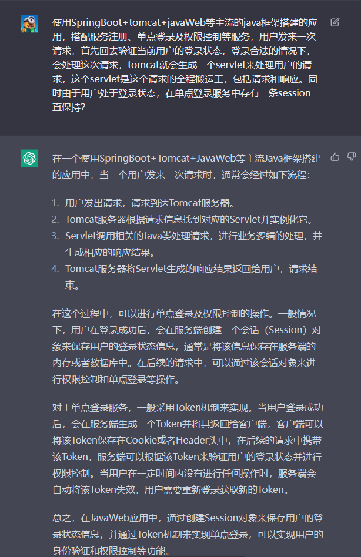

# 1.单点登录

## 1.1.单点登录和权限中心

​		通常情况下，SSO单点登录需要多次与权限中心进行交互。

​		在SSO单点登录中，用户需要进行认证和授权。一般来说，用户在访问一个需要身份验证的系统时，该系统会将用户重定向到一个身份认证中心，该中心会验证用户的身份并颁发一个令牌。然后用户使用该令牌访问其他系统时，这些系统需要向身份认证中心验证该令牌是否有效。因此，每次用户访问一个需要身份验证的系统时，都需要与身份认证中心进行交互来验证令牌的有效性。

​		另外，对于一些需要授权的操作，也需要与权限中心进行交互来验证用户是否有权限进行该操作。因此，对于需要授权的操作，也需要与权限中心进行交互。

# 2.Cookie、Token、Session

## 2.1.Cookie

## 2.2.Token

## 2.3.Session

# 3.Questions

## 3.1.

