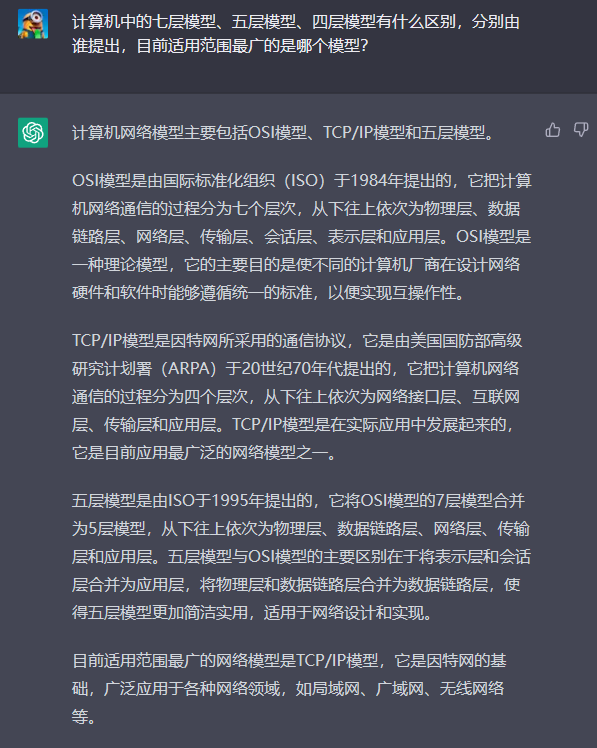

### 1.网段

​	网段（subnet）是将一个 IP 网络地址划分成几个子网的过程。在这个过程中，网络管理员将网络分成数个较小的子网，以适应不同的网络设备和需要。这样可以更好地管理网络流量、提高网络的安全性，同时也可以更好地利用 IP 地址。在子网中，IP 地址是通过将网络地址分为更小的块来实现的。

### 2.信道

​	信道指的是信息传输的通道，可以是物理通道，如传输介质（例如光纤、电缆等），也可以是无线信道（如Wi-Fi、蓝牙等）。在计算机网络中，信道用于传输数据和信息，可以是有线或无线的。常见的有线信道有以太网、光纤、同轴电缆等；常见的无线信道有Wi-Fi、蓝牙、4G/5G等。信道的质量和带宽都是影响数据传输速度和稳定性的重要因素。

### 3.在光纤传输中，通常采用的是光的强弱来表示数字信号的0和1，例如001就是两个弱的光脉冲和一个强的光脉冲？

​	在光纤传输中，通常采用的是光脉冲的强弱来表示数字信号的0和1，具体的方式是通过改变光源的强度来控制光的强弱，例如0对应的是较弱的光脉冲，而1对应的是较强的光脉冲。这种方式被称为光强度调制（Amplitude-Shift Keying，简称ASK）。还有一些其他的调制方式，例如光频率调制（Frequency-Shift Keying，简称FSK）和光相位调制（Phase-Shift Keying，简称PSK），它们都是将数字信号转化为光脉冲的方式之一。

### 4.光纤传输中，连续的二进制信息如何转成光脉冲？

​	在光纤传输中，连续的二进制信息需要转换成光脉冲信号才能在光纤中传输。这个转换过程一般分为两个步骤：

1. 调制（Modulation）：将二进制信息转换成模拟信号，比如将0和1分别对应成低电平和高电平。这个过程也叫做数字信号调制，常见的调制方式有三种：振幅调制（AM）、频率调制（FM）和相位调制（PM）。在光通信中，一般采用调幅（AM）或调频（FM）方式。

2. 光发射（Optical Transmission）：将调制好的模拟信号转换成光脉冲信号，也就是让光的强度随着调制信号的变化而变化。这个过程需要使用激光器或发光二极管等光源来实现。

   在接收端，还需要进行解调（Demodulation）和光检测（Optical Detection）两个过程，将光信号转换成数字信号，最终得到原始的二进制信息。

### 5.计算机中的七层模型、五层模型、四层模型有啥区别？

### 6.计算机网络中数据链路层

​	计算机网络中数据链路层（Data Link Layer）是 OSI 模型和 TCP/IP 模型中的第二层，主要负责将网络层（第三层）提供的数据报分成数据帧，并发送给物理层（第一层）进行传输。同时，数据链路层还负责检错和纠错等工作，确保数据在物理层中可靠传输。

​	数据链路层的主要功能包括：

1. 分帧：将网络层传来的数据报按照一定的规则划分为一个个的数据帧，方便进行传输。
2. 数据帧的定界：在数据帧中添加头部和尾部，用于标识帧的开始和结束。
3. 差错控制：采用校验和、循环冗余校验等方式检测数据是否有误，并且提供重发机制保证数据的可靠传输。
4. 流量控制：通过一定的方法控制传输速率，避免发送端发送速度过快，导致接收端无法处理。
5. 访问控制：在多点通信中，通过访问控制机制，防止多个设备同时访问同一物理介质导致冲突。

数据链路层的实现通常基于两种协议：点对点协议（PPP）和局域网协议（如以太网、令牌环网等）。其中，以太网是应用最为广泛的局域网协议之一。

### 7.数据链路层中的点对点是指的用户直接与ISP连接？

​	在数据链路层中，“点对点”通常指的是两个设备之间直接建立的连接，而不是通过中间节点或者网关进行连接的情况。这种连接通常是在物理层上建立的，例如通过网线或者光纤直接连接两个设备。在互联网中，用户通常通过调制解调器（modem）或者路由器（router）与ISP进行连接，这种连接是通过中间节点或者网关建立的，不是点对点的连接。但是，在数据链路层中，这些设备之间的连接仍然是通过点对点的方式进行传输数据的。

### 8.数据链路层的前提是存在物理连接？

​	数据链路层的通信基于物理连接。数据链路层的主要任务是通过物理层提供的物理连接，建立和维护网络中直接相连的两个节点之间的通信。因此，在数据链路层中，要先建立物理连接，然后才能在此基础上进行数据的传输。

### 9.数据链路层中LCP，PPP，NCP

​	在数据链路层中，PPP（Point-to-Point Protocol）是一种常用的协议，它可以在两个节点之间建立连接，常用于拨号连接、DSL等场景。PPP协议包含三个阶段：链路控制协议（LCP）、网络控制协议（NCP）和认证协议。

LCP（Link Control Protocol）用于建立、配置、测试和维护数据链路连接。在 PPP 连接的建立和维护过程中，LCP 负责以下几个方面：

- 确定是否能建立通信链路
- 协商通信链路的参数，如最大传输单元（MTU）、协商数据压缩和加密等
- 监测链路状态，当链路出现故障时能够及时通知对端设备
- 终止连接

NCP（Network Control Protocol）用于协商 PPP 连接中网络层协议的类型和配置参数，如 IP 协议的地址、子网掩码、DNS 服务器地址等。NCP 协议还可以协商多种网络层协议的同时使用，以支持多协议的数据传输。

总的来说，PPP 协议是一种基于点对点连接的协议，可以通过 LCP 协议对链路进行配置和管理，通过 NCP 协议对网络层协议进行协商和配置。

### 10.广域网中模拟帧的目标地址来截获信息吗？

​	在广域网中模拟帧的目标地址是一种欺骗技术，通常被用来截获或篡改网络流量。该技术通过伪造MAC地址或IP地址，使得网络设备将网络流量误认为是发往目标设备的，从而将其转发到攻击者的设备上进行拦截或篡改。这种技术常常被用于网络钓鱼、窃听、流量劫持等攻击行为中。

​	如果没有额外的安全措施，是可能被截获的。因此，在实际的网络通信中，为了保证通信的安全性，往往需要使用加密技术等安全机制来防止信息被截获和窃听。此外，许多协议也已经提供了一些安全性的扩展，如HTTPS协议。

### 11.计算机网络各层的简单介绍

**Question**：在计算机网络中，应用层是组织信息的一层，传输层是确定一对一或者一对多连接的一层，网络层是确定对方所在地址的一层，数据链路层是将从应用层到网络层的信息转成一个个帧的一层，物理层则负责物理发送这些信号，这样理解对吗？

**Answer**：您对计算机网络中各层的功能和作用的理解是基本正确的。

应用层是负责为用户提供服务，并且组织应用层协议数据单元（PDU），例如HTTP、SMTP、FTP等。

传输层则提供端到端的通信服务，确保数据在端到端的传输中能够完整、可靠的传输，常见的协议有TCP、UDP等。

网络层则负责数据的路由和转发，将数据传输到目标主机，常见的协议有IP、ICMP等。

数据链路层则负责将数据封装成帧的形式进行传输，同时也负责错误检测，常见的协议有Ethernet、PPP等。

物理层则负责在物理媒介上传输数据，例如电缆、光纤、无线电波等。物理层负责的是在媒介上传输二进制数据的电压、频率和其他特性。

### 12.计算机网络中的差错检测和纠错

​	数据链路层只负责差错检测而不负责纠错，使用循环冗余和校验和来进行差错检测，在传输过程中如果发现了差错，数据链路层通常会要求上层进行重传或者进行纠错操作

​	在计算机网络中，纠错通常在传输层和应用层来完成，其中在传输层中，TCP协议通过序号、确认号和重传机制保证数据的可靠传输，并能够对少量的错误进行纠正，而在UDP协议中，由于没有重传机制，传输的数据往往不可靠，需要应用层自己纠错。

​	在应用层中，通过各种纠错编码来提高数据传输的可靠性，例如项数据包中添加校验和、使用海明码或者RS码等编码方式

### 13.计算机网络和负载均衡

​	负载均衡是一种分布式系统中常用的技术，用于平衡不同服务器之间的负载，以提高系统的可用性和可伸缩性，在实际应用中，负载均衡一般是通过在应用层或者传输层进行流量控制来实现的。

​	其中：

​	1.应用层负载均衡：常见的方式是反向代理和DNS负载均衡。

​		反向代理负责将请求转发给后端服务器，并将响应返回给客户端

​		DNS负载均衡通过将一个域名解析到多个IP地址上，使得客户端请求分不到多台服务器上

​	2.传输层负载均衡：常见的方式是四层负载均衡和七层负载均衡。

​		四层负载均衡是指基于IP地址和端口号进行流量控制，可以将请求分发到多个服务器上。

​		七层负载均衡则是在应用层进行流量控制，可以根据请求内容的不同分发到不同的服务器上，以提高系统的可用性和伸缩性

### 14.自然语言或者说是信息转换到计算机语言的二进制是由应用层和传输层协议负责的

### 15.计算机网络中的以太网

#### 15.1.以太网：一种局域网技术

​		以太网是一种常见的局域网技术，他是用Xerox，intel和Digital Equipment Corporation（DEC）三家公司共同研发。

​		以太网采用总线型、星型或者树型拓扑结构，使用CSMA/CD（载波侦听多路访问/冲突检测）协议控制访问

​		在计算机网络中，以太网协议是工作在数据链路层的协议，可以说是以太网是数据链路层的子层。在与其他层之间的传输中，以太网通常用于将数据包从一个主机传输到同一个局域网的另一个主机。

​		**以太网可以称为是局域网的一种叫法**

​		***在数据链路层中，进行碰撞检测是以太网中特有的技术。***

#### 15.2.广域网技术

​		广域网（WAN）是指连接在广域范围内的计算机和网络设备，其跨越城市、州、国家甚至大陆。与局域网不同，广域网需要使用一些专门的技术来实现远程通信。

以下是一些常见的广域网实现技术：

1. 链路层协议：一些网络服务提供商（ISP）提供的广域网服务使用链路层协议来连接用户设备和ISP的设备。这些协议包括了ATM（异步传输模式）和Frame Relay等。这些协议提供的服务通常是按照速率计费的，因此使用它们需要仔细考虑网络使用需求。
2. 传输层协议：传输层协议如TCP/IP（传输控制协议/互联网协议）和MPLS（多协议标签交换）等常用于连接不同地点的广域网。这些协议提供了可靠的数据传输和路由功能，但是使用它们需要相应的硬件和网络设施支持。
3. 虚拟专用网（VPN）：VPN是一种可以在公共网络上建立安全连接的技术。通过加密和认证技术，VPN可以将不同地点的计算机和网络设备连接起来，提供一种安全的远程访问方式。VPN通常使用IPSec（Internet Protocol Security）和SSL（Secure Sockets Layer）等协议来实现。
4. 光纤通信：光纤通信是一种通过光纤传输数据的技术，其传输速度非常快。通过使用光纤网络，可以在城市、州甚至国家之间建立高速连接。然而，使用光纤通信需要建立大量的基础设施和支持设备，成本较高。

### 16.网络层的分组交换

#### 16.1.分组交换发生在网络层

​		在分组交换中，数据被分割成较小的数据包，每个数据包被打上目标地址和其他相关的信息，然后通过不同的路径传输到目标设备，这个过程中，每个数据包可以独立地进行路由决策，以便更加高效地使用网络资源。

#### 16.2.分组交换有顺序

​		分组交换中，每个数据包都有一个讯号，接收方会按照序号的顺序重新组合，确保数据的有序性

#### 16.3.分组交换是并行的

#### 16.4.“丢包”

### 17.数据链路层的“停止等待协议”

​		通常情况下，数据链路层不会保持已经发送的帧，但在某些情况下，数据链路层可能会在发送数据的同时使用一些技术保证数据的可靠性传输，比如流量控制和确认机制。在这种情况下，数据链路层会保留已经发送的帧，直到接收到目的地的确认信息，才会删除已经发送的帧，这种技术用于可靠传输协议，比如“停止-等待”协议和选择重传协议。

​		比较极端的情况下，“停止-等待”协议可能会造成数据的积压，在发送方没有收到目的地的确认信息，发送方将停止发送任何帧，直到收到确认信息，这时数据链路层通常会使用滑动窗口协议，以提高传输的效率和可靠性。

### 18.数据链路层的“滑动窗口协议”

​		滑动窗口协议是数据链路层中的一种协议，用于在不可靠的信道上进行数据传输。其主要思想是在发送方和接收方之间维护一个滑动窗口，发送方只有在接收到确认帧之后才能发送下一个数据帧，而接收方只有在正确接收到数据帧之后才能发送确认帧。

具体来说，滑动窗口协议中包含两个重要的参数：窗口大小和确认方式。窗口大小表示可以发送的帧的数量，而确认方式有两种：肯定确认（ACK）和否定确认（NAK）。在肯定确认方式下，接收方会发送一个带有确认号的帧来告知发送方当前已经接收到了哪些帧，而在否定确认方式下，接收方会发送一个带有否定确认标志的帧来告知发送方有哪些帧没有接收到。

滑动窗口协议的工作流程如下：

1. 发送方发送一个帧，帧中包含了一个序列号，表示这个帧是发送方的第几个帧。
2. 接收方收到这个帧，如果帧的序列号与接收方期望接收的序列号一致，则接收方将这个帧发送到网络层，并发送一个带有确认号的帧给发送方；如果帧的序列号与期望接收的序列号不一致，则接收方将发送一个否定确认的帧给发送方，告知发送方需要重传这个帧。
3. 发送方收到确认帧或否定确认帧，如果收到肯定确认，则将窗口向前滑动一位，表示可以发送下一个帧；如果收到否定确认，则将窗口向后滑动一位，表示需要重传这个帧。
4. 当窗口满了之后，发送方会等待接收到一个确认帧之后才能继续发送下一个帧。
5. 如果发送方在一定时间内没有收到任何确认帧，则会超时重传当前窗口内的所有帧。

通过滑动窗口协议，可以有效地减少数据链路层中的重传次数，提高数据传输的效率和可靠性。

​		**滑动窗口协议可以缓解数据堆积问题，但无法完全解决。因为数据堆积问题通常是由于网络拥塞或接收方处理速度不足等原因引起的，而滑动窗口协议只是针对传输过程中的确认机制进行了优化，无法直接解决网络拥塞等底层问题。不过滑动窗口协议可以通过控制发送窗口大小和确认超时时间等参数，以适应网络状况的变化，从而最大程度地避免数据堆积问题的发生。**

### 19.数据链路层的数据短暂存储在网络适配器或网卡的缓冲区内。

### 20.计算机网络的TCP的“三次握手，四次挥手”

三次握手是TCP协议在建立连接时使用的一种机制，主要用于确保双方的通信能力和可靠性。具体来说，建立TCP连接需要进行以下步骤：

1. 客户端发送一个SYN包给服务器，表示请求建立连接，并等待服务器的回复。
2. 服务器收到SYN包后，发送一个SYN-ACK包给客户端，表示可以建立连接，客户端收到后，发送一个ACK包给服务器，表示确认连接建立。
3. 服务器收到ACK包后，连接建立成功，可以开始传输数据。

四次挥手则是TCP协议在关闭连接时使用的一种机制，主要用于保证双方都能正常关闭连接。具体来说，关闭TCP连接需要进行以下步骤：

1. 客户端发送一个FIN包给服务器，表示请求关闭连接，并等待服务器的回复。
2. 服务器收到FIN包后，发送一个ACK包给客户端，表示已经接收到关闭请求，但是还有一些数据没有传输完毕，因此需要继续传输数据。
3. 当服务器完成数据传输后，发送一个FIN包给客户端，表示可以关闭连接，但是还需要等待客户端的确认。
4. 客户端收到FIN包后，发送一个ACK包给服务器，表示确认关闭连接。服务器收到ACK包后，连接关闭完成。

需要注意的是，TCP协议中的三次握手和四次挥手都是可靠的连接机制，可以保证数据传输的可靠性和正确性。

### 21.移动通信网络和计算机网络的对比

​		4G和5G网络也采用了类似于计算机网络的分层架构，但是与计算机网络的分层架构略有不同。

​		4G和5G网络采用了5层协议栈的结构，其中包括物理层、数据链路层、网络层、传输层和应用层。这个协议栈结构与计算机网络的分层结构比较相似，但各层的功能和实现方式有所不同。

​		物理层负责将数字信号转换成模拟信号，并通过天线将信号发送到空气中。数据链路层则负责将数据分成帧，并在物理层上发送和接收帧。网络层提供IP地址和路由功能，使得数据可以在不同的网络之间进行传输。传输层负责数据传输的可靠性和流量控制。应用层则是最高层，提供了各种应用程序的协议和接口，例如HTTP、FTP、SMTP等。

总之，虽然4G和5G网络与计算机网络的分层架构有所不同，但它们都采用了分层结构，这使得网络的设计、实现和维护更加简单和灵活。