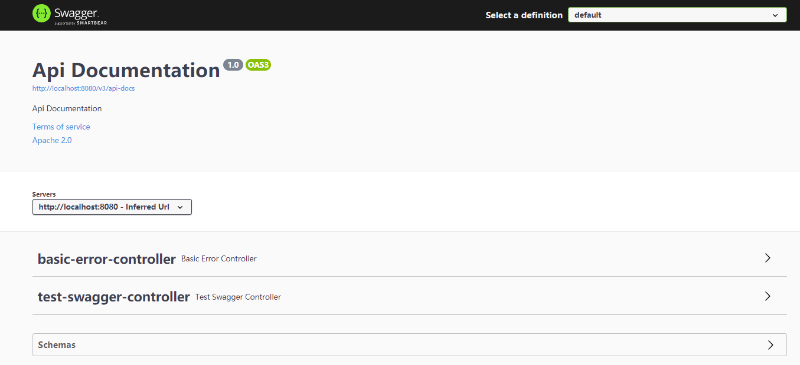

# Swagger

https://blog.csdn.net/qq_36595013/article/details/95177117?ops_request_misc=%257B%2522request%255Fid%2522%253A%2522161648946716780255297111%2522%252C%2522scm%2522%253A%252220140713.130102334..%2522%257D&request_id=161648946716780255297111&biz_id=0&utm_medium=distribute.pc_search_result.none-task-blog-2~all~top_positive~default-2-95177117.pc_search_positive&utm_term=swagger

## 1.什么是Swagger？


用于解决前后台同事接口参数数据等

## 2.OpenApi规范

2.1Open API规范(OpenAPI Specification)以前叫做Swagger规范，是REST API的API描述格式。

2.2源码和说明参照：https://github.com/OAI/OpenAPI-Specification/blob/master/versions/3.0.0.md#oasDocument

## 3.Swagger 简介

### 3.1Swagger工具组件

Swagger是一套围绕Open API规范构建的开源工具，可以帮助设计，构建，记录和使用REST API。

Swagger-tools:提供各种与Swagger进行集成和交互的工具。例如模式检验、Swagger 1.2文档转换成Swagger 2.0文档等功能。

#### 3.1.1Swagger-core

用于Java/Scala的的Swagger实现。与JAX-RS(Jersey、Resteasy、CXF…)、Servlets和Play框架进行集成。

#### 3.1.2Swagger-js

用于JavaScript的Swagger实现。

#### 3.1.3Swagger-node-express

Swagger模块，用于node.js的Express web应用框架。

#### 3.1.4**Swagger-ui**

**一个无依赖的HTML、JS和CSS集合，可以为Swagger兼容API动态生成优雅文档。**

#### 3.1.5Swagger-codegen

一个模板驱动引擎，通过分析用户Swagger资源声明以各种语言生成客户端代码。通过Swagger Codegen可以将描述文件生成html格式和cwiki形式的接口文档，同时也可以生成多种言语的客户端和服务端代码。

#### 3.1.6Swagger Hub

集成了上面所有项目的各个功能，你可以以项目和版本为单位，将你的描述文件上传到Swagger Hub中。在Swagger Hub中可以完成上面项目的所有工作，需要注册账号，分免费版和收费版。

### 3.2Spring Fox

Marty Pitt编写了一个基于Spring的组件swagger-springmvc。Spring-fox就是根据这个组件发展而来的全新项目。

Spring-fox是根据代码生成接口文档，所以正常的进行更新项目版本，修改代码即可，而不需要跟随修改描述文件。

Spring-fox利用自身AOP特性，把Swagger集成进来，底层还是Swagger。但是使用起来确方便很多。

附：官网地址： http://springfox.github.io/springfox/

附：官方源码： https://github.com/springfox/springfox

## 4.使用Swagger（SpringBoot项目）

### 4.1Swagger2

#### 4.1.1导入依赖

```xml
<!--        swagger ui 依赖-->
<dependency>
    <groupId>io.springfox</groupId>
    <artifactId>springfox-swagger-ui</artifactId>
    <version>2.9.2</version>
</dependency>
<!--        swagger 核心依赖-->
<dependency>
    <groupId>io.springfox</groupId>
    <artifactId>springfox-swagger2</artifactId>
    <version>2.9.2</version>
</dependency>
```

#### 4.1.2启动类添加swagger注解

```java
//添加swagger注解
@EnableSwagger2
@SpringBootApplication
public class SmsApplication {
    public static void main(String[] args) {
        SpringApplication.run(SmsApplication.class, args);
    }
}
```

#### 4.1.3编写Controller

```java
@RestController
public class TestSwaggerController {

    @PostMapping("/post")
    public String post(){
        return "post";
    }
}
```

#### 4.1.4启动项目，进入swagger2

地址：http://localhost:8080/swagger-ui.html


### 4.2Swagger3

#### 4.2.1导入依赖

```xml
<dependency>
    <groupId>io.springfox</groupId>
    <artifactId>springfox-boot-starter</artifactId>
    <version>3.0.0</version>
</dependency>
```

#### 4.2.2编写Controller

```java
@RestController
public class TestSwaggerController {

    @PostMapping("/post")
    public String post(){
        return "post";
    }
}
```

#### 4.2.3启动项目进入swagger3

链接：http://localhost:8080/swagger-ui/index.html



### 4.3swagger2和swagger3的区别

链接：https://blog.csdn.net/u014389734/article/details/113875955?utm_medium=distribute.pc_relevant.none-task-blog-baidujs_utm_term-0&spm=1001.2101.3001.4242


## 5.使用swagger进行接口调试


## 6.Swagger配置

#### 6.1新建SwaggerConfiguration

```java
@Configuration
public class swaggerConfig3 {
    @Bean
    public Docket getDocket(){
        return new Docket(DocumentationType.SWAGGER_2)
                .apiInfo(swaggerDemoApiInfo())
                .select()
                .build();
    }
    private ApiInfo swaggerDemoApiInfo(){
        return new ApiInfoBuilder()
                //添加联系人的联系方式
                .contact(new Contact("西米豆豆", "公司主页", "PM的email"))
                //文档标题
                .title("这里是Swagger的标题")
                //文档描述
                .description("这里是Swagger的描述")
                //文档版本
                .version("1.0.0")
                .build();
    }
}
```

效果如下图：


### 6.2指定扫描特定包下面的注解

```java
docket.select()        .apis(RequestHandlerSelectors.basePackage("com.roc.study.Controller"));//扫描指定包下面的注解
```


### 6.3屏蔽使用了某个注解的方法

#### 6.3.1自定义注解

```java
//自定义注解
@Target //当前注解可以定义在什么资源上
        ({ElementType.METHOD             //定义在方法上
        ,ElementType.ANNOTATION_TYPE,   //
        ElementType.TYPE_USE,           //
        ElementType.FIELD,              //定义在属性上
        ElementType.PACKAGE,            //定义在包上
        ElementType.PARAMETER           //定义在方法参数上
        })
@Retention//当前注解什么时候有效
        (RetentionPolicy.RUNTIME)
        //RetentionPolicy.SOURCE    --编译时使用
        //RetentionPolicy.CLASS     --字节码运行时使用
        //RetentionPolicy.RUNTIME   --VM运行中使用
public @interface MyAnnotation {
    //自定义注解中的属性，相当于@MyAnnotation(value = "")
   
```


#### 6.3.2屏蔽掉特定注解

```java
docket.select()              
    .apis(not(withMethodAnnotation(MyAnnotation.class))) .apis(RequestHandlerSelectors.basePackage("com.roc.study.Controller"));//扫描指定包下面的注解
```

## 7.Swagger常用注解

### 7.1常用注解

- @Api--注解到类
- @ApiOperation--注解到方法
- @Requestparam--注解到参数